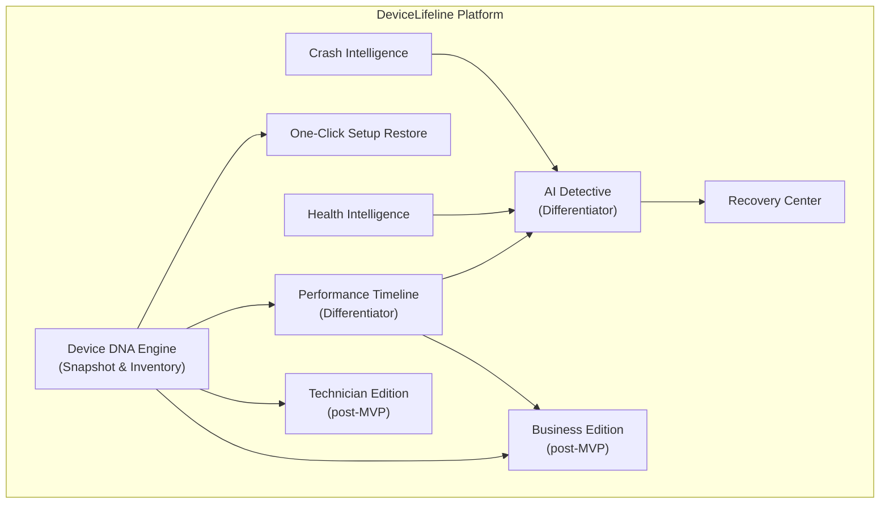

# 01. Executive Summary

> High-level overview of DeviceLifeline: the problem it solves, what it does, and why it matters now. Part of the DeviceLifeline documentation suite — see [Documentation Index](README.md).

**Status:** Draft v1 · **Authoring role:** Principal Product Manager · **Last updated:** 2026-06-07
**Related:** [02. Product Vision](02-product-vision.md), [03. PRD](03-product-requirements-document.md), [11. MVP Definition](11-mvp-definition.md), [13. Monetization Strategy](13-monetization-strategy.md)

---

## 1. Purpose & Scope

This Executive Summary conveys the DeviceLifeline product strategy to all stakeholders — founders, investors, engineering leads, and go-to-market teams — in a single, definitive document. It establishes the problem, the solution, the differentiated value, the target market, the business model, the MVP scope, and the headline metrics that define success. It does not substitute for the full PRD, technical architecture, or roadmap documents, which are cross-referenced throughout.

---

## 2. Assumptions

- Windows 10/11 is the launch platform. macOS and Linux are future targets.
- The initial product ships as a native desktop application built on the locked technology stack (Tauri, Rust, React/TypeScript/Tailwind, SQLite, Supabase).
- "MVP" refers to the Version 1 scope defined in [11. MVP Definition](11-mvp-definition.md): Device DNA Engine, software inventory, setup export/restore, Performance Timeline, basic Health Intelligence, and basic AI diagnosis.
- Revenue from Day 1 via Stripe and Paystack subscriptions; free tier is permanent.
- AI inference runs server-side via Supabase Edge Functions; API keys (OpenAI, Anthropic) are never bundled in the client binary.
- All usage analytics are opt-in and privacy-first via PostHog; crash reporting via Sentry.

---

## 3. Elevator Pitch

**DeviceLifeline is a Computer Operating Intelligence Platform.** It continuously captures and understands the complete history of a computer — every software install, configuration change, performance shift, hardware event, and system failure — so users can answer the questions that every PC owner eventually asks: *Why is my computer slow? What changed? How do I restore my setup? How do I move to a new machine?*

Where traditional utilities show a snapshot of *now*, DeviceLifeline maintains a **living digital history** — the operating memory of the device — and uses that history to diagnose problems, guide recovery, and replicate environments with one click.

---

## 4. The Problem

Computers degrade silently. Users, developers, businesses, and technicians all face a version of the same frustration: **no computer currently maintains a legible, actionable record of its own history.**

| User Group | Core Problem |
|---|---|
| **Everyday consumers** | PC slows down over months with no explanation. Crashes appear out of nowhere. Startup takes 3× as long as it did last year. Hardware failures arrive without warning. Moving to a new machine means starting from scratch. |
| **Developers & power users** | Rebuilding a dev environment after a format or new machine purchase takes hours to days. IDEs, SDKs, language runtimes, package managers, dotfiles, and browser profiles must all be manually reinstalled. One wrong driver update breaks a build pipeline. |
| **Businesses & IT teams** | Onboarding a new employee requires manual software provisioning. Troubleshooting a failing device means guesswork. Ensuring software compliance across a fleet has no lightweight solution. |
| **Repair technicians** | Customers bring devices with no history. Root-cause diagnosis is time-consuming and imprecise. There is no standard way to share a diagnostic report with a customer. |

Current tools — Task Manager, Event Viewer, vendor diagnostics, third-party cleaners — are **fragmented, reactive, and opaque**. They show current state; they do not explain causality, do not track history, and do not guide recovery.

---

## 5. The Solution — The Nine Pillars

DeviceLifeline addresses all four problem clusters through nine integrated capabilities:

| # | Pillar | What It Does |
|---|---|---|
| 1 | **Device DNA Engine** | Captures a complete, versioned blueprint of the machine: installed apps, system config, startup items, services, browser environments, and dev toolchains. Output is a **Device DNA Snapshot**. |
| 2 | **One-Click Setup Restore** | Recreates a full environment on any machine using WinGet, Microsoft Store, and vendor installers — apps, extensions, dev tools, and preferences in minutes. |
| 3 | **Performance Timeline** | Tracks every software install, update, driver change, and system event over time and correlates these events with measured performance changes. The platform's primary differentiator. |
| 4 | **AI Detective** | Answers natural-language questions ("Why is my PC slow?") by analyzing the timeline, logs, hardware telemetry, and system events; returns likely causes ranked by confidence score. |
| 5 | **Health Intelligence** | Continuously monitors CPU, RAM, SSD, HDD, GPU, battery, and network; produces health scores, trend charts, and predictive failure alerts. |
| 6 | **Crash Intelligence** | Parses Event Viewer logs, BSODs, driver failures, and application crashes; translates technical data into plain English with remediation steps. |
| 7 | **Recovery Center** | Provides rollback and restore capabilities: configurations, settings, dev environments, and full device states. |
| 8 | **Technician Edition** | A professional diagnostic toolkit for repair shops: customer device reports, full history views, health assessments, and shareable repair recommendations. |
| 9 | **Business Edition** | Fleet management for businesses and MSPs: device onboarding, software compliance monitoring, environment standardization, and asset visibility. |

---

## 6. What Makes DeviceLifeline Different

Three capabilities separate DeviceLifeline from every existing tool on the market:

**Performance Timeline** — No current consumer tool builds a causal, time-correlated record linking software changes to performance degradation. This is the feature that creates "aha" moments and drives word-of-mouth: users can see *exactly* when their PC slowed down and *why*.

**AI Detective** — Conversational troubleshooting grounded in real device history is a step-change beyond manual log inspection. DeviceLifeline doesn't guess — it reasons over months of recorded evidence.

**Device DNA** — A portable, versioned blueprint of the complete machine environment (not just a backup) that can be restored to any machine, exported, compared, and shared. This reframes "setup" from a painful manual process into a repeatable, one-click operation.

---

## 7. Target Users

| Segment | Primary Pain | Edition |
|---|---|---|
| Everyday consumers | Slow/crashing PC, no visibility | Free, Pro |
| Power users & gamers | Performance regression, configuration control | Pro |
| Developers & freelancers | Environment replication, workstation mobility | Developer |
| Repair technicians | Diagnosis time, lack of device history | Technician |
| MSPs & IT teams | Fleet visibility, onboarding, compliance | Business |
| Small-business owners | Device reliability, staff productivity | Business |

Detailed personas for each segment are in [04. User Personas](04-user-personas.md).

---

## 8. Business Model Snapshot

DeviceLifeline operates on a **freemium SaaS subscription model** delivered as a native desktop application. All tiers include the core local agent; higher tiers unlock cloud sync, AI features, and multi-device management.

| Tier | Audience | Key Features | Billing |
|---|---|---|---|
| **Free** | Consumers | Basic device inventory, basic health dashboard | Free forever |
| **Pro** | Power users, gamers | Setup export/restore, Performance Timeline, AI Detective, Health Intelligence | Monthly / annual subscription via Stripe / Paystack |
| **Developer** | Developers, freelancers | All Pro features + environment replication, dev toolchain snapshots, workspace templates | Monthly / annual |
| **Technician** | Repair shops | Multi-device dashboard, customer reports, diagnostic exports | Per-seat, monthly / annual |
| **Business** | SMBs, MSPs, enterprises | Per-device fleet licensing, deployment templates, compliance monitoring | Per-device / per-seat, monthly / annual |

Full pricing strategy and tier feature matrix are in [13. Monetization Strategy](13-monetization-strategy.md) and [14. Subscription Plans](14-subscription-plans.md).

---

## 9. MVP Scope (V1)

The MVP delivers the highest-value, highest-differentiation features needed to acquire and retain early users, validate the Performance Timeline concept, and establish the subscription funnel.

**In MVP:**
- Device DNA Engine (full machine snapshot, versioned)
- Software inventory (installed apps, sources, versions)
- Setup export (Device DNA Snapshot file)
- One-Click Setup Restore (WinGet + Microsoft Store + vendor installers)
- Performance Timeline (event ingestion, correlation, visualization)
- Basic Health Intelligence (CPU, RAM, SSD, GPU monitoring; health scores)
- Basic AI Diagnosis (AI Detective, text query → root-cause response)

**Post-MVP (labeled throughout the suite):**
- Crash Intelligence (full BSOD/Event Viewer parsing)
- Recovery Center (full rollback workflows)
- Technician Edition
- Business Edition / fleet management
- macOS and Linux support
- Mobile companion app
- Advanced AI agent workflows

The full MVP boundary is specified in [11. MVP Definition](11-mvp-definition.md).

---

## 10. Why Now

Several converging trends make 2026 the right moment:

1. **AI inference is cheap enough to embed in a consumer product.** LLM costs have dropped to the point where per-query AI diagnosis is financially viable at free-tier scale.
2. **WinGet has reached maturity.** Microsoft's package manager now covers the vast majority of common Windows software, making automated restore both feasible and reliable.
3. **Remote work normalized device self-sufficiency.** Developers and knowledge workers manage their own machines with less IT support than ever, raising demand for personal device intelligence.
4. **Hardware complexity has increased.** Modern PCs combine spinning HDDs, NVMe SSDs, discrete GPUs, NPUs, and multiple network adapters — creating more failure surfaces and more need for health monitoring.
5. **No dominant player owns this category.** The competitive landscape (CCleaner, iSpy, HWiNFO, Crystal DiskInfo, manual Event Viewer) is fragmented, aging, and not AI-native.

---

## 11. Headline Success Metrics

The following KPIs define a successful launch and first year of operation. Full metric definitions and measurement methodology are in [03. PRD](03-product-requirements-document.md).

| Metric | MVP Target (M6) | Year-1 Target |
|---|---|---|
| Active installs (WAU) | 5,000 | 50,000 |
| Free → Pro conversion rate | 5% | 8% |
| D30 retention (Pro) | 55% | 65% |
| Performance Timeline "aha" event rate | 40% of actives in first session | 60% |
| AI Detective query satisfaction (thumbs up) | 70% | 80% |
| Median setup restore success rate | 90% | 95% |
| App crash rate (Sentry) | < 0.5% of sessions | < 0.2% of sessions |
| P99 Device DNA snapshot generation time | < 30 s | < 20 s |

---

## Diagrams

---

## Risks & Mitigations

| Risk | Likelihood | Impact | Mitigation |
|---|---|---|---|
| WinGet restore success rate too low to be compelling | Medium | High | Pre-flight app compatibility check; fallback to vendor installers; clear UI expectation-setting before restore |
| AI diagnosis quality insufficient to drive upgrade from Free | Medium | High | Curated prompt engineering, confidence thresholds, human-readable fallback explanations, rapid model iteration |
| Windows API changes break collectors | Low | High | Version-pinned OS API calls; integration test suite; fast-path patching process |
| Privacy concerns block enterprise adoption | Medium | High | Full local-first architecture; configurable telemetry; no PII in AI payloads; independent privacy audit pre-launch |
| Competitive response from established tools (CCleaner, etc.) | Low | Medium | Move fast on Performance Timeline and AI Detective — these are hard to copy without native history data |
| Tauri/WebView rendering inconsistencies across Windows versions | Medium | Medium | WebView2 version pinning; CI matrix across Win10 21H2, Win10 22H2, Win11 23H2, Win11 24H2 |

---

## Future Considerations

- **macOS port:** Architecture is designed to be platform-agnostic at the Rust core; macOS support (Homebrew-based restore) is the next platform target. See [28. Future macOS Architecture Plan](28-macos-architecture-plan.md).
- **Mobile companion app:** Read-only device status, push alerts for health events, remote snapshot trigger. See [59. Future Mobile App Strategy](59-future-mobile-app-strategy.md).
- **AI agent evolution:** From reactive query-response to proactive, autonomous device optimization agents. See [58. Future AI Agent Strategy](58-future-ai-agent-strategy.md).
- **Marketplace:** Community-contributed restore templates and environment profiles for popular developer stacks.

---

## Acceptance Criteria

- [ ] AC-001: Document conveys the core problem for all four user groups in plain language without jargon.
- [ ] AC-002: All nine pillars are named and summarized with consistent terminology matching the brief.
- [ ] AC-003: The three differentiators (Performance Timeline, AI Detective, Device DNA) are explicitly called out.
- [ ] AC-004: MVP scope is clearly bounded with a statement that all other features are post-MVP.
- [ ] AC-005: All five subscription tiers are named and summarized with their target audience.
- [ ] AC-006: Headline success metrics include numeric targets for both M6 and Year 1.
- [ ] AC-007: Technology stack references are consistent with the locked stack (Tauri, Rust, SQLite, Supabase, WinGet, Stripe/Paystack, PostHog, Sentry).
- [ ] AC-008: All cross-references use relative filenames pointing to documents in the master list.
- [ ] AC-009: Risks table covers at least five distinct risk vectors.
