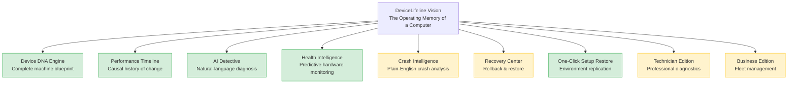
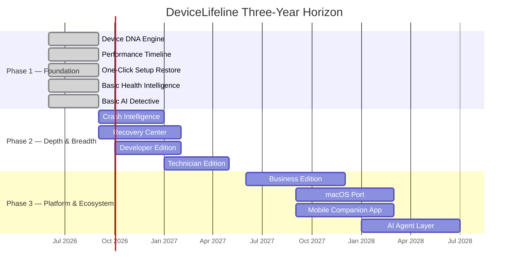
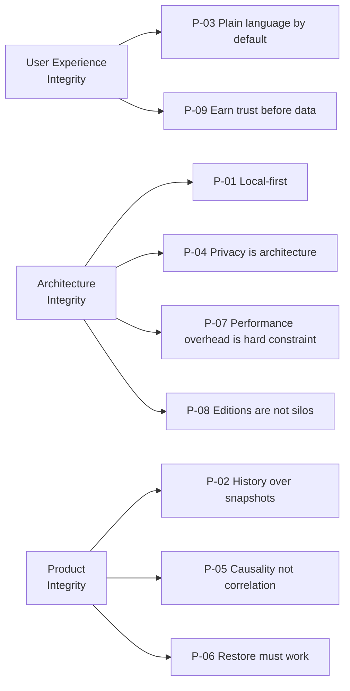

# 02. Product Vision Document

> The long-term product vision, north-star statement, guiding principles, 3-year horizon, and per-segment success outcomes for DeviceLifeline. Part of the DeviceLifeline documentation suite — see [Documentation Index](README.md).

**Status:** Draft v1 · **Authoring role:** Principal Product Manager · **Last updated:** 2026-06-07
**Related:** [01. Executive Summary](01-executive-summary.md), [03. PRD](03-product-requirements-document.md), [12. Product Roadmap](12-product-roadmap.md), [15. Competitive Analysis](15-competitive-analysis.md)

---

## 1. Purpose & Scope

This document articulates the long-term vision for DeviceLifeline — where the product is going, why it matters at a generational scale, and the principles that govern every product decision. It is the stable north star for the roadmap, design, engineering, and go-to-market teams. Day-to-day feature decisions should be evaluated against this vision. It does not specify implementation detail; for that, see [03. PRD](03-product-requirements-document.md) and the technical architecture documents.

---

## 2. Assumptions

- The market for personal and professional device management software is large, underserved, and fragmented — no current product owns the "operating memory" category.
- AI inference costs will continue to decline, making per-query AI assistance economically viable for free-tier users within a 2-year horizon.
- Windows will remain the dominant desktop OS for DeviceLifeline's core segments (IT, developers, SMBs) through the 3-year planning horizon.
- The ecosystem trend is toward self-managed devices: remote work, bring-your-own-device, and reduced IT headcount create structural demand for personal device intelligence.
- Privacy regulations (GDPR, CCPA, and successors) will tighten; local-first architecture is both a product advantage and a compliance posture.

---

## 3. The Long-Term Vision

### 3.1 Vision Statement

> **Every computer should have a memory. DeviceLifeline is that memory — an always-on operating intelligence that knows what changed, when it changed, why it changed, what it caused, and how to recover.**

DeviceLifeline's long-term vision is to become the **standard operating layer** for understanding, managing, and restoring any computer — the way Git became the standard for tracking code history, or the way DNS became the standard for resolving network identity. A device without DeviceLifeline should feel as incomplete as a codebase without version control.

At full maturity, DeviceLifeline is not a utility a user opens occasionally — it is a **persistent intelligence** running silently in the background, surfacing insights when they matter, predicting failures before they occur, and handling environment replication automatically when a new machine arrives.

### 3.2 The "Operating Memory" Concept

Human memory allows us to recall what happened, attribute cause and effect, and apply past experience to future decisions. Computers have historically had no equivalent: they experience changes (software installs, configuration edits, hardware swaps) without recording them in a legible, causal, searchable way.

DeviceLifeline gives computers this capacity. The **Device DNA Snapshot** is the encoded memory of a machine at a point in time. The **Performance Timeline** is the episodic memory — the record of what happened and when. The **AI Detective** is the reasoning layer that interprets that memory in response to questions. Together they create, for the first time, a computer that can *explain itself*.

---

## 4. North-Star Statement and Metric

**North-star statement:** "The number of users who have used DeviceLifeline to understand or fix a real problem with their computer this week."

**North-star metric:** **Weekly Problem-Resolved Events (WPRE)** — defined as any session in which a user completes one of:
- A Performance Timeline correlation that identifies the cause of a slowdown.
- An AI Detective query that returns a root-cause response rated as helpful.
- A successful Setup Restore that reproduces a prior environment on a new machine.
- A predictive health alert that the user acts on before a failure occurs.

WPRE is chosen because it measures actual value delivered — not just logins or page views — and aligns Free, Pro, Developer, Technician, and Business users on a shared outcome signal.

| Horizon | WPRE Target |
|---|---|
| MVP Launch (M6) | 2,000 / week |
| Year 1 (M12) | 20,000 / week |
| Year 2 (M24) | 100,000 / week |
| Year 3 (M36) | 500,000 / week |

---

## 5. Guiding Product Principles

These principles are non-negotiable and should be applied when resolving any product or design conflict.

| # | Principle | Meaning in Practice |
|---|---|---|
| P-01 | **Local-first, cloud-enhanced** | All core functionality works without an internet connection. SQLite is the source of truth. Supabase sync is a feature, not a dependency. |
| P-02 | **History over snapshots** | Every feature should contribute to the timeline, not just the current state. A snapshot without history is half the value. |
| P-03 | **Plain language by default** | Technical output (logs, BSOD codes, SMART data) must be translated into plain English before reaching the user. Experts can drill down; novices must not be lost. |
| P-04 | **Privacy is architecture, not policy** | Data minimization, local processing, and opt-in telemetry are built into the system design. The user controls what leaves their device. |
| P-05 | **Causality, not just correlation** | AI diagnosis must distinguish likely cause from mere co-occurrence. Confidence scores and evidence citations are mandatory output fields. |
| P-06 | **Restore must work, or it must not promise** | Setup restore with a 60% success rate is worse than no restore feature. Pre-flight compatibility checking, dry-run mode, and graceful partial-success handling are required. |
| P-07 | **Performance overhead is a hard constraint** | DeviceLifeline must not measurably degrade the device it monitors. Rust-core collectors and scheduler budgets enforce this. |
| P-08 | **Editions are not silos** | A Technician Edition user is also a potential Pro user. Edition boundaries serve pricing, not architecture. The data model and core agent are shared. |
| P-09 | **Earn trust before asking for data** | The product must deliver value before requesting additional permissions. Onboarding progresses from low-permission features to high-permission features. |

---

## 6. The Three-Year Horizon

### Phase 1 — Foundation (M0–M6, MVP)
**Theme: Prove the core loop.**

Deliver Device DNA Engine, Performance Timeline, One-Click Setup Restore, basic Health Intelligence, and basic AI Detective. Win early adopters from developer and power-user communities. Validate that Performance Timeline "aha" moments drive upgrade from Free to Pro. Achieve 5,000 WAU and 5% conversion.

Key deliverables: Windows-only desktop app, Tauri + Rust + SQLite + Supabase stack operational, Stripe/Paystack subscription flow, PostHog analytics live.

### Phase 2 — Depth & Breadth (M7–M18)
**Theme: Become indispensable.**

Deliver Crash Intelligence, full Recovery Center, Developer Edition environment replication, and Technician Edition diagnostic toolkit. Expand AI Detective from text Q&A to proactive recommendations. Reach 50,000 WAU and 8% Pro conversion.

Key deliverables: Full Event Viewer / BSOD parsing, rollback workflows, technician multi-device dashboard, community-contributed restore templates.

### Phase 3 — Platform & Ecosystem (M19–M36)
**Theme: The operating memory standard.**

Deliver Business Edition fleet management, macOS port (Homebrew-based restore), mobile companion app, and the AI agent layer (proactive, autonomous device optimization). Establish the Device DNA format as a community standard. Pursue enterprise and MSP channel partnerships.

Key deliverables: macOS architecture (see [28. Future macOS Architecture Plan](28-macos-architecture-plan.md)), mobile app (see [59. Future Mobile App Strategy](59-future-mobile-app-strategy.md)), AI agent framework (see [58. Future AI Agent Strategy](58-future-ai-agent-strategy.md)), per-device fleet licensing, SSO/SAML for enterprise.

---

## 7. Target Outcomes per User Segment

| Segment | Year-1 Outcome | Year-3 Outcome |
|---|---|---|
| **Everyday consumers** | Can identify why their PC slowed down and act on the finding without technical expertise. | Proactive alerts prevent hardware failures; PC setup moves to a new machine in < 10 minutes. |
| **Power users / gamers** | Performance Timeline is part of their routine; they catch regressions before they impact gaming or workloads. | DeviceLifeline auto-diagnoses performance drops and suggests remediation within minutes of detection. |
| **Developers / freelancers** | New machine setup from a Device DNA Snapshot takes < 30 minutes (vs. current multi-hour manual process). | Full dev environment — IDE, SDKs, extensions, dotfiles, package managers — replicated in one command. |
| **Repair technicians** | Diagnosis time per device drops by 40%; customer reports are shareable PDFs generated in < 1 minute. | DeviceLifeline is the standard pre-repair checklist tool for independent repair shops in target markets. |
| **SMBs / MSPs** | Fleet onboarding time drops by 60%; software compliance is visible in a single dashboard. | DeviceLifeline manages 80% of routine device health and software standardization without IT intervention. |

---

## 8. Positioning Statement

**For** individuals, developers, and businesses who manage Windows computers and have experienced unexplained slowdowns, configuration loss, or time-consuming setup,

**DeviceLifeline** is a Computer Operating Intelligence Platform

**that** gives every computer a living memory — continuously tracking configuration, performance, and health history — so users can diagnose problems instantly, restore any environment in minutes, and move to a new machine without losing anything.

**Unlike** fragmented utilities (CCleaner, HWiNFO, Event Viewer, Ninite) that show current state without history or causality,

**DeviceLifeline** combines a persistent timeline, AI-powered diagnosis, and one-click environment restore in a single, privacy-first application that works locally without a cloud dependency.

---

## 9. What Success Looks Like

**At MVP (M6):**
- A non-technical user opens DeviceLifeline, sees their Performance Timeline, and identifies the source of a weeks-long slowdown within 5 minutes — without reading documentation.
- A developer clones their workstation to a new machine using a Device DNA Snapshot and is productive in < 30 minutes.
- Pro conversion is driven by the Performance Timeline and AI Detective — users pay because the value is obvious, not because of artificial feature gating.

**At Year 1:**
- "Check DeviceLifeline" is a recognized first step in PC troubleshooting communities (Reddit, YouTube, Discord).
- Technicians recommend DeviceLifeline to customers as part of standard service.
- At least one enterprise IT team uses Business Edition as their primary device onboarding tool.

**At Year 3:**
- Device DNA Snapshots are shared between users as a community norm (like dotfiles repos).
- DeviceLifeline is mentioned in mainstream tech media as the product that "finally gives PCs memory."
- The platform manages > 1 million active devices across consumer, professional, and enterprise segments.

---

## Diagrams

### Vision Pillars Diagram

*Green = MVP scope. Amber = post-MVP.*

### Three-Year Horizon Roadmap

### Guiding Principles Hierarchy

---

## Risks & Mitigations

| Risk | Likelihood | Impact | Mitigation |
|---|---|---|---|
| Vision outpaces monetization: users love free features, don't upgrade | Medium | High | Design Performance Timeline and AI Detective as the primary upgrade gates; establish clear value demonstrations inside the free tier that require Pro to act on |
| AI inference costs make free-tier economics unviable | Medium | High | On-device pre-processing reduces payload size; aggressive prompt compression; free-tier rate limits on AI Detective queries |
| "Operating memory" concept requires too much user education | Medium | Medium | Show don't tell: Performance Timeline UI should make the concept self-evident within the first session; onboarding walkthrough targets < 3 minutes |
| Phase 3 platform ambition dilutes Phase 1/2 execution | High | High | Strict MVP boundary enforced in sprint planning; post-MVP features are specced but not resourced until Phase 2 milestones are met |
| macOS/Linux demand creates pressure to de-prioritize Windows depth | Low | Medium | Explicit platform priority (Windows-first) documented and shared; macOS work does not begin until Phase 2 Windows features ship |
| Enterprise sales cycle length delays Business Edition revenue | Medium | Medium | SMB and MSP self-serve path is the primary go-to-market; enterprise deals are a bolt-on, not the core model |

---

## Future Considerations

- **AI agent autonomy:** As LLM capabilities improve, AI Detective evolves from answering questions to taking actions (removing conflicting drivers, scheduling maintenance, pre-fetching installers before a restore). See [58. Future AI Agent Strategy](58-future-ai-agent-strategy.md).
- **Device DNA as a community standard:** Open-source the Device DNA Snapshot format to enable third-party tooling, community template repositories, and ecosystem integrations.
- **Cross-device correlation:** With explicit user consent, aggregate anonymized Performance Timeline data to identify system-wide patterns (e.g., a specific Windows update that degrades performance across a large user cohort).
- **Hardware procurement integration:** Connect predictive failure alerts to hardware vendor APIs for automated warranty claims or replacement ordering.

---

## Acceptance Criteria

- [ ] AC-010: Vision statement is a single, memorable sentence that does not use product category jargon.
- [ ] AC-011: North-star metric (WPRE) is defined with a precise measurement rule and numeric targets for M6, M12, M24, and M36.
- [ ] AC-012: All nine guiding principles are enumerated with a stable ID (P-01 through P-09) and a concrete "meaning in practice" statement.
- [ ] AC-013: Three-year horizon is divided into three named phases with distinct themes and key deliverables per phase.
- [ ] AC-014: Positioning statement follows the standard template (For / is a / that / unlike / DeviceLifeline).
- [ ] AC-015: Vision pillars Mermaid diagram distinguishes MVP from post-MVP scope visually.
- [ ] AC-016: All cross-references use relative filenames from the master document list.
- [ ] AC-017: The document does not specify implementation detail (no code, no schema, no API contracts).
