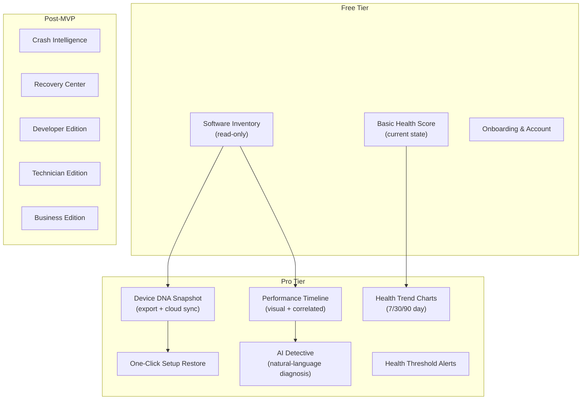
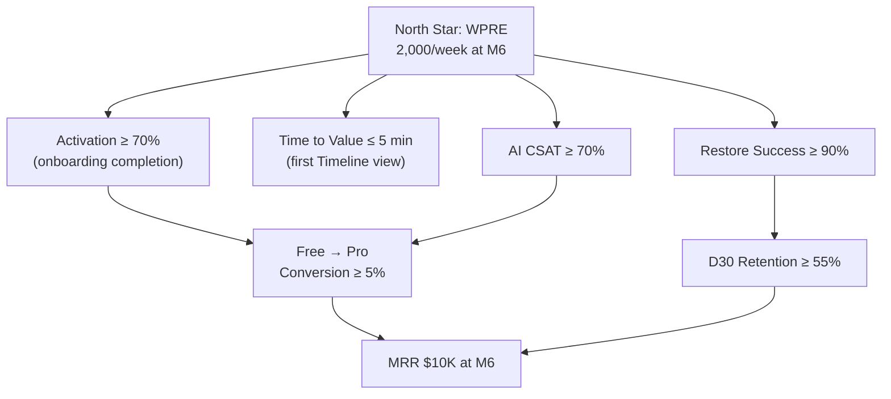

# 03. Product Requirements Document (PRD)

> Authoritative statement of what DeviceLifeline must do, for whom, and how success is measured. Part of the DeviceLifeline documentation suite — see [Documentation Index](README.md).

**Status:** Draft v1 · **Authoring role:** Principal Product Manager · **Last updated:** 2026-06-07
**Related:** [01. Executive Summary](01-executive-summary.md), [02. Product Vision](02-product-vision.md), [06. Functional Requirements](06-functional-requirements.md), [07. NFR Specification](07-non-functional-requirements.md), [11. MVP Definition](11-mvp-definition.md), [04. User Personas](04-user-personas.md)

---

## 1. Purpose & Scope

This PRD defines the goals, non-goals, target users, MVP scope, capability priorities, success metrics, key dependencies, release criteria, and open questions for DeviceLifeline. It is the binding contract between product, engineering, and design for the MVP release and serves as the source of truth for scope decisions.

For enumerated functional requirements, see [06. Functional Requirements](06-functional-requirements.md). For non-functional requirements (performance, security, privacy), see [07. NFR Specification](07-non-functional-requirements.md). For the detailed MVP feature boundary, see [11. MVP Definition](11-mvp-definition.md).

---

## 2. Assumptions

- Windows 10 (build 19041+) and Windows 11 are the only supported platforms at MVP launch.
- The Tauri + Rust + React/TypeScript/Tailwind + SQLite + Supabase stack is locked and not up for discussion in this document.
- WinGet 1.6+ is available on the target devices (shipped with Windows 11; available as an update for Windows 10). The restore engine falls back to Microsoft Store and vendor installers when WinGet is unavailable for a given package.
- AI inference (OpenAI / Anthropic) is server-side only; the client never holds API keys.
- All payment processing is handled by Stripe (global) and Paystack (Africa/local methods); no direct card data touches DeviceLifeline servers.
- PostHog telemetry is opt-in; Sentry crash reporting is opt-in (configurable in settings).
- The product launches with a single-tenant desktop model; multi-tenant fleet management is post-MVP.
- "Device" means a single Windows PC or laptop. Multi-device management per account is a Pro+ feature for syncing snapshots but not a full fleet management capability until Business Edition.

---

## 3. Goals and Non-Goals

### 3.1 Goals

| Goal ID | Goal Statement | Priority |
|---|---|---|
| G-01 | Give individual users a clear, visual explanation of why their PC performance has changed over time | Must Have |
| G-02 | Enable users to export their complete software and configuration environment as a portable Device DNA Snapshot | Must Have |
| G-03 | Enable users to restore a Device DNA Snapshot on any Windows machine with a single action | Must Have |
| G-04 | Provide plain-English answers to natural-language troubleshooting questions grounded in real device history | Must Have |
| G-05 | Monitor device hardware health (CPU, RAM, SSD, GPU) and surface actionable alerts before failures | Must Have |
| G-06 | Deliver all core functionality with no measurable degradation to device performance | Must Have |
| G-07 | Operate fully offline for all local intelligence features; cloud sync is additive, not required | Must Have |
| G-08 | Convert free users to paid tiers at a rate of ≥ 5% within 6 months of launch | Should Have |
| G-09 | Achieve a median setup restore success rate of ≥ 90% across MVP-supported app categories | Must Have |
| G-10 | Earn a user-reported satisfaction score (CSAT) of ≥ 4.0/5.0 for AI Detective responses | Should Have |

### 3.2 Non-Goals (MVP)

| Non-Goal | Rationale |
|---|---|
| macOS or Linux support | Windows-first strategy; macOS planned for Phase 2. See [28. Future macOS Architecture Plan](28-macos-architecture-plan.md). |
| Full Crash Intelligence (BSOD parsing, minidump analysis) | Scoped to Phase 2; basic event log surfacing is in-scope for MVP. |
| Full Recovery Center (granular rollback workflows) | Phase 2. MVP includes snapshot export/import, not line-item rollback. |
| Technician Edition (multi-device dashboard, customer reports) | Phase 2. See [56. Technician Edition Specification](56-technician-edition-specification.md). |
| Business Edition (fleet management, compliance monitoring) | Phase 2/3. See [57. Business Edition Specification](57-business-edition-specification.md). |
| Mobile companion app | Phase 3. See [59. Future Mobile App Strategy](59-future-mobile-app-strategy.md). |
| Antivirus, firewall, or active threat detection | Out of scope permanently; security monitoring covers configuration drift, not malware detection. |
| Registry deep-clean or "junk removal" features | Intentionally excluded — these features carry risk and are category-defining for competitors, not for DeviceLifeline. |

---

## 4. Problem Framing

### 4.1 Problem Statement

Computers change continuously — software is installed and removed, drivers are updated, Windows pushes changes, services are added at startup, and hardware degrades. None of this is recorded in a way that users can search, visualize, or reason about. When something goes wrong, users have no systematic way to know:

- What changed recently?
- Which change caused the problem?
- How do I get back to the state where things worked?
- If I buy a new computer, how do I recreate my current setup?

The current ecosystem response is fragmented utilities: Event Viewer for logs, HWiNFO for hardware telemetry, CCleaner for software management, Ninite for batch install, Windows Backup for files. None of these tools communicate with each other, none maintain a causal history, and none provide AI-powered diagnosis.

### 4.2 Root Causes

1. **No unified event log with causal attribution.** Windows Event Log records events but does not correlate them with performance impact.
2. **No portable environment format.** Windows does not have a standard for representing the full software + configuration environment of a device.
3. **AI is not applied to device history.** LLMs can reason over structured event data but are not connected to device telemetry in any consumer product today.
4. **Restore tooling is fragmented.** WinGet, Microsoft Store, vendor installers, and third-party tools are not orchestrated by a single agent.

### 4.3 Hypothesis

> If DeviceLifeline gives users a visual, time-correlated view of configuration changes and their performance impact — backed by AI-powered natural-language diagnosis — users will find and fix real problems that they previously either endured silently or paid a technician to diagnose.

This hypothesis is validated when the WPRE (Weekly Problem-Resolved Events) north-star metric reaches 2,000/week by M6.

---

## 5. Target Users

Detailed personas for each segment are in [04. User Personas](04-user-personas.md). Summary:

| Persona | Segment | Primary Need | MVP Edition |
|---|---|---|---|
| Alex | Everyday consumer | Understand why PC is slow | Free |
| Jordan | Power user / gamer | Correlate performance regressions with system changes | Pro |
| Sam | Developer / freelancer | Replicate dev environment on new machine | Developer (post-MVP for full env replication; Pro at MVP) |
| Riley | Repair technician | Fast device diagnosis, customer-shareable reports | Technician (post-MVP) |
| Morgan | MSP / IT operator | Fleet health and compliance dashboard | Business (post-MVP) |
| Casey | Small-business owner | Device reliability without full IT staff | Business (post-MVP) |
| Taylor | Enterprise IT admin | Standardized onboarding, compliance, asset visibility | Business (post-MVP) |

---

## 6. Scope — MVP vs. Later

### 6.1 MVP Scope (V1 — shipped at Phase 1 completion)

| Capability | Description | Tier Gate |
|---|---|---|
| Device DNA Engine | Full machine snapshot: installed apps (name, version, source), services, startup items, power settings, network adapters, browser + extensions, dev toolchain detection | Free (read); Pro (export/cloud sync) |
| Software Inventory | Enumerated list of all installed software with WinGet source mapping | Free |
| Setup Export | Export Device DNA Snapshot to a portable JSON/compressed archive | Pro |
| One-Click Setup Restore | Restore a Device DNA Snapshot on any Windows machine via WinGet / Microsoft Store / vendor installers | Pro |
| Performance Timeline | Visual timeline of software installs, updates, driver changes, startup changes, and correlated performance metrics (boot time, RAM, CPU idle) | Pro |
| Basic Health Intelligence | CPU, RAM, SSD (SMART), GPU, network health scores; trend chart; threshold alerts | Free (current health score); Pro (trend chart + alerts) |
| Basic AI Detective | Natural-language query interface; analyzes timeline + health + recent events; returns plain-English diagnosis with confidence score | Pro |
| User account + subscription | Supabase auth (email/password, OAuth), Stripe/Paystack billing, license enforcement | All |
| Cloud sync | Device DNA Snapshots and timeline events synced to Supabase (encrypted, user-controlled) | Pro |
| Onboarding flow | First-run wizard: permission grants, first snapshot, first health score display | All |

### 6.2 Post-MVP (Phase 2+)

All post-MVP features are labeled **[POST-MVP]** throughout the documentation suite.

- **[POST-MVP]** Crash Intelligence: full BSOD/minidump parsing, Event Viewer crash correlation
- **[POST-MVP]** Recovery Center: granular rollback by category (app, config, service, driver)
- **[POST-MVP]** Developer Edition: full environment replication (IDE extensions, SDK configs, dotfiles, package-manager lockfiles)
- **[POST-MVP]** Technician Edition: multi-device dashboard, customer PDF reports, repair recommendations
- **[POST-MVP]** Business Edition: fleet management, onboarding templates, compliance monitoring, per-device licensing
- **[POST-MVP]** macOS port (Homebrew-based restore)
- **[POST-MVP]** Advanced AI proactive recommendations (push, not pull)
- **[POST-MVP]** Mobile companion app

---

## 7. Prioritized Capabilities (MoSCoW)

### Must Have (MVP-blocking)

| ID | Capability | Rationale |
|---|---|---|
| CAP-01 | Device DNA Engine — full snapshot generation | Core data collection without which no other feature works |
| CAP-02 | Software inventory enumeration | Foundation of Setup Restore and Timeline |
| CAP-03 | Performance Timeline event ingestion and display | Primary differentiator; drives Pro conversion |
| CAP-04 | One-Click Setup Restore (WinGet + MS Store + vendor) | Highest-stated user demand; drives Developer tier |
| CAP-05 | Basic AI Detective (query + diagnosis) | Second major differentiator; drives Pro conversion |
| CAP-06 | Basic Health Intelligence (CPU, RAM, SSD, GPU) | Table-stakes feature for device monitoring category |
| CAP-07 | User account, Supabase Auth, subscription flow | Revenue and license enforcement |
| CAP-08 | Cloud sync (snapshots + timeline, encrypted) | Enables cross-device restore and backup |
| CAP-09 | Onboarding wizard with permission flow | First-time user experience; required for activation |
| CAP-10 | Rust collector with < 1% CPU budget | Non-functional — device performance must not be degraded |

### Should Have (MVP; cut only under resource constraint)

| ID | Capability | Rationale |
|---|---|---|
| CAP-11 | Browser extension inventory (Chrome, Edge, Firefox) | Significant portion of user environment; high value for Dev/Pro users |
| CAP-12 | Startup item management and monitoring | Common source of boot-time degradation; high value for consumers |
| CAP-13 | Performance Timeline correlation annotations | "Likely cause" labels; required to make the Timeline actionable |
| CAP-14 | Health trend charts (7/30/90 day) | Required for health feature to feel like intelligence, not just a meter |
| CAP-15 | WinGet source mapping for installed apps | Required for restore pre-flight accuracy |

### Could Have (MVP if time; otherwise Phase 2)

| ID | Capability | Rationale |
|---|---|---|
| CAP-16 | Basic Crash Intelligence (Event Viewer surface) | Good-to-have; full implementation is Phase 2 |
| CAP-17 | Restore dry-run / pre-flight report | Improves restore trust; could ship as beta flag |
| CAP-18 | Dark mode UI | Requested by power users; design work is minimal given Tailwind |
| CAP-19 | Snapshot comparison (diff between two snapshots) | Useful for developers; scoped to Phase 2 if cut from MVP |
| CAP-20 | PostHog event tracking full instrumentation | Required for data-driven iteration; high engineering leverage |

### Won't Have (MVP)

| ID | Capability | Rationale |
|---|---|---|
| CAP-21 | Technician Edition | Phase 2 |
| CAP-22 | Business Edition / fleet management | Phase 2/3 |
| CAP-23 | macOS / Linux support | Phase 2/3 |
| CAP-24 | Full Recovery Center (line-item rollback) | Phase 2 |
| CAP-25 | Mobile companion app | Phase 3 |
| CAP-26 | AI proactive recommendations (push) | Phase 2 |
| CAP-27 | Registry cleaner or junk removal | Not in product scope — ever |

---

## 8. Success Metrics and KPIs

### 8.1 Activation Metrics

| Metric | Definition | MVP Target (M6) |
|---|---|---|
| Activation rate | % of installs that complete onboarding and generate first Device DNA Snapshot | ≥ 70% |
| Time to first value | Median time from install to first Performance Timeline view | ≤ 5 minutes |
| First snapshot generation success rate | % of first-run snapshots that complete without error | ≥ 98% |

### 8.2 Engagement Metrics

| Metric | Definition | MVP Target (M6) |
|---|---|---|
| WAU | Weekly active users | 5,000 |
| D7 retention | % of new users active 7 days after install | ≥ 40% |
| D30 retention (Pro) | % of Pro subscribers active 30 days after subscription | ≥ 55% |
| AI Detective queries per active Pro user per week | Indicates AI feature adoption | ≥ 2 |
| Performance Timeline views per active user per week | Core engagement signal | ≥ 3 |

### 8.3 Conversion and Revenue Metrics

| Metric | Definition | MVP Target (M6) |
|---|---|---|
| Free → Pro conversion rate | % of Free users who upgrade to Pro within 30 days | ≥ 5% |
| Pro trial → paid conversion | % of trial activations that convert to paid | ≥ 40% |
| MRR | Monthly recurring revenue | $10,000 |
| Churn rate (Pro) | Monthly subscription churn | ≤ 5% |

### 8.4 Quality Metrics

| Metric | Definition | MVP Target (M6) |
|---|---|---|
| Setup restore success rate | % of restore operations that complete all apps without user-error abort | ≥ 90% |
| AI Detective satisfaction (thumbs up) | % of AI responses rated positively | ≥ 70% |
| Crash-free session rate (Sentry) | % of sessions with no unhandled exception | ≥ 99.5% |
| P99 snapshot generation time | Time for full Device DNA snapshot on a representative device | ≤ 30 seconds |
| Collector CPU overhead | Average CPU% consumed by Rust collector during idle | ≤ 1% |

### 8.5 North-Star Metric

| Metric | Definition | MVP Target (M6) |
|---|---|---|
| WPRE | Weekly Problem-Resolved Events (see [02. Product Vision](02-product-vision.md) §4) | 2,000/week |

---

## 9. Key Dependencies

| Dependency | Owner | Risk | Mitigation |
|---|---|---|---|
| WinGet 1.6+ availability on user devices | Microsoft | Medium — older Win10 devices may not have it | Auto-download WinGet if absent; fallback restore paths for non-WinGet packages |
| OpenAI / Anthropic API reliability | External | Medium — API downtime affects AI Detective | Graceful degradation: AI Detective shows "unavailable" banner, core features remain operational |
| Supabase service uptime | Supabase | Low — 99.9% SLA | Local-first architecture: all features work offline; sync queued until connection restored |
| WebView2 Runtime on Windows | Microsoft | Low — ships with Windows 11; available for Win10 | Bundle WebView2 installer in setup package; check version at launch |
| Stripe / Paystack API | Payment providers | Low | Retry logic; clear UI error messages; do not block app launch on payment API failure |
| SMART data access (SSD health) | OS / hardware | Medium — some NVMe drives report limited SMART attributes | Graceful partial health score; label data gaps clearly in UI |
| Windows Performance Counters (WMI/PDH) | Windows OS | Low | Fallback to alternative data sources (registry, WMI queries) if primary counter fails |

---

## 10. Release Criteria

The MVP is considered release-ready when all of the following criteria are met:

| Criterion ID | Criterion | Gate Type |
|---|---|---|
| RC-01 | All Must Have capabilities (CAP-01 through CAP-10) are implemented, tested, and passing CI | Hard gate |
| RC-02 | Crash-free session rate ≥ 99.5% over a 2-week stabilization period (Sentry) | Hard gate |
| RC-03 | P99 Device DNA snapshot generation ≤ 30 s on a reference device (i5-8250U, 8 GB RAM, SATA SSD) | Hard gate |
| RC-04 | Collector CPU overhead ≤ 1% average during idle on the reference device | Hard gate |
| RC-05 | Setup restore success rate ≥ 90% across the 50 most common WinGet packages | Hard gate |
| RC-06 | Stripe and Paystack subscription flows work end-to-end in production | Hard gate |
| RC-07 | Supabase RLS policies verified by independent security review (see [17. Security Requirements](17-security-requirements.md)) | Hard gate |
| RC-08 | PostHog event tracking covers all 20 must-have events (see [35. Event Tracking Specification](35-event-tracking-specification.md)) | Soft gate |
| RC-09 | Onboarding completion rate ≥ 70% in closed beta (n ≥ 100 users) | Soft gate |
| RC-10 | CSAT for AI Detective ≥ 70% thumbs-up in closed beta (n ≥ 50 AI queries) | Soft gate |
| RC-11 | Privacy policy and terms of service reviewed by legal counsel and linked in app | Hard gate |
| RC-12 | Windows compatibility matrix tested: Win10 21H2, Win10 22H2, Win11 23H2, Win11 24H2 | Hard gate |

---

## 11. Open Questions

| ID | Question | Owner | Resolution Target |
|---|---|---|---|
| OQ-01 | What is the minimum WinGet version required for reliable restore, and should the installer auto-update WinGet if the device version is below that threshold? | Engineering | M1 |
| OQ-02 | Should the free tier include any AI Detective queries (e.g., 3/month) to demonstrate value before upgrade, or should AI Detective be strictly Pro+? | Product | M1 |
| OQ-03 | Which NVMe SMART attributes should we use as primary SSD health indicators given inconsistent vendor reporting? Define fallback behavior when attributes are absent. | Engineering | M2 |
| OQ-04 | What is the maximum Device DNA Snapshot file size we expect on a typical device, and does this impact sync payload or storage tier pricing? | Engineering + Product | M2 |
| OQ-05 | Should the AI Detective prompt include raw event log data or only preprocessed summary events? Impacts privacy and token cost. | Engineering + Legal | M1 |
| OQ-06 | Paystack integration: which specific payment methods beyond cards are required at launch (mobile money, bank transfer)? Which African markets are Day 1 targets? | Business | M1 |
| OQ-07 | Should the Performance Timeline be visible (read-only) on the Free tier with a Pro upgrade prompt, or entirely hidden until Pro is active? | Product | M1 |
| OQ-08 | What is the retention policy for on-device SQLite data? Is there a max timeline depth (e.g., 90 days) before local pruning, and is this configurable by the user? | Product + Legal | M2 |
| OQ-09 | For the restore dry-run feature (CAP-17): does this ship in MVP as a beta flag, or should it be pushed to Phase 2? | Product + Engineering | M2 |

---

## Diagrams

### MVP Capability Map

### Success Metrics Hierarchy

---

## Risks & Mitigations

| Risk | Likelihood | Impact | Mitigation |
|---|---|---|---|
| WinGet package coverage too low to make restore compelling for non-developer users | High | High | Pre-restore compatibility report; set expectations; offer partial restore + manual completion guide |
| AI Detective responses are too generic (not grounded in device-specific data) | Medium | High | Require timeline events in AI prompt payload; enforce minimum evidence threshold before AI responds; show "insufficient data" state for new installs |
| Performance Timeline has too many false-positive correlations, eroding trust | Medium | High | Confidence scoring on all correlations; manual override/dismiss; clear "correlation, not causation" language in UI |
| Snapshot size / sync cost scales poorly for power users with 200+ apps | Medium | Medium | Compress snapshot payload; delta sync (only changed fields); storage tier limits with clear UI |
| WebView2 rendering bugs create inconsistent UI across Windows versions | Medium | Medium | Cross-version CI matrix; WebView2 version pinning in Tauri config |
| Open questions OQ-02 and OQ-07 not resolved before M1 — conversion funnel design blocked | High | Medium | Time-box decision to Sprint 3; default to "Performance Timeline preview in Free + AI Detective strictly Pro" if unresolved |

---

## Future Considerations

- **Requirement versioning:** As Phase 2 and Phase 3 scopes are finalized, this PRD will be versioned (PRD v2, v3). The MVP PRD should be baselined and change-controlled from M1.
- **Platform expansion requirements:** macOS PRD will be a separate document once Phase 2 begins; the Windows PRD remains the canonical reference.
- **Compliance requirements:** GDPR Article 30 record-of-processing, CCPA data subject rights, and SOC 2 Type II readiness will add requirements in Phase 2. See [18. Compliance Requirements](18-compliance-requirements.md).

---

## Acceptance Criteria

- [ ] AC-018: Goals table uses stable IDs (G-01 through G-10) and distinguishes Must Have from Should Have.
- [ ] AC-019: Non-goals table includes a rationale and a cross-reference to the relevant post-MVP document for each item.
- [ ] AC-020: MoSCoW table covers all major MVP capabilities with stable IDs (CAP-01 through CAP-27).
- [ ] AC-021: Success metrics include numeric targets for Activation, Engagement, Conversion, Quality, and North-Star dimensions.
- [ ] AC-022: Release criteria use stable IDs (RC-01 through RC-12) and distinguish Hard Gates from Soft Gates.
- [ ] AC-023: Open questions use stable IDs (OQ-01 through OQ-09) and assign an owner and resolution target milestone.
- [ ] AC-024: Cross-references to [06. Functional Requirements](06-functional-requirements.md) and [11. MVP Definition](11-mvp-definition.md) are present.
- [ ] AC-025: Technology stack references (WinGet, Supabase, Stripe/Paystack, Tauri, PostHog, Sentry) are consistent with the brief.
