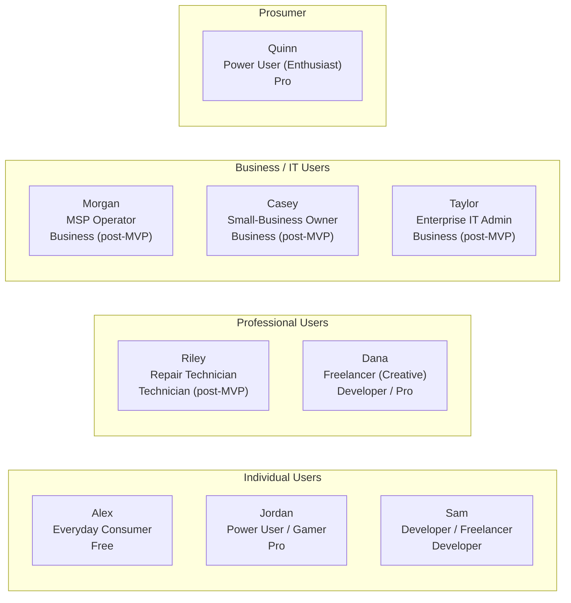
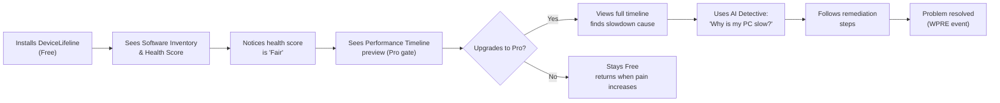

# 04. User Personas

> Detailed personas representing the nine core user segments DeviceLifeline serves, with goals, pains, JTBD, key scenarios, and edition fit. Part of the DeviceLifeline documentation suite — see [Documentation Index](README.md).

**Status:** Draft v1 · **Authoring role:** Principal Product Manager · **Last updated:** 2026-06-07
**Related:** [03. PRD](03-product-requirements-document.md), [05. User Stories](05-user-stories.md), [08. User Flows](08-user-flows.md), [50. UI/UX Specification](50-ui-ux-specification.md)

---

## 1. Purpose & Scope

This document defines the nine primary user personas for DeviceLifeline. Each persona is a composite archetype drawn from the target user segments identified in [03. PRD](03-product-requirements-document.md). Personas inform feature prioritization, UX decisions, onboarding design, marketing messaging, and edition gating. They are not demographic profiles — they are behavioral and motivational models.

---

## 2. Assumptions

- Personas are Windows users at MVP; macOS personas will be added when the macOS platform launches.
- Edition assignments reflect MVP tiers; Technician and Business editions are post-MVP but personas are documented now to guide design of those products.
- Each persona is given a stable archetype name for cross-document reference.
- "Primary features used" reflects MVP-available features unless marked **[POST-MVP]**.

---

## 3. Persona Summary Map

---

## 4. Personas

---

### Persona 1 — Alex, Everyday Consumer

**Snapshot**

| Field | Detail |
|---|---|
| Archetype ID | PERSONA-01 |
| Name | Alex |
| Age range | 35–55 |
| Technical level | Low to moderate |
| Primary device | Mid-range Windows laptop, 4–6 years old |
| DeviceLifeline edition | Free → Pro |
| Discovery channel | YouTube tutorial, Reddit r/techsupport, friend recommendation |

**Goals**
- Keep the laptop running fast enough to handle web browsing, email, video calls, and streaming.
- Not spend money on a new PC if the current one can be fixed.
- Understand what is wrong with the computer in plain language without needing to call a technician.
- Feel in control of a device that currently feels unpredictable.

**Pains**
- The laptop was fast three years ago; it is now noticeably slow, especially at startup. Alex does not know why.
- Occasional unexplained crashes and freezes cause lost work.
- "Updates" always seem to make things worse, not better.
- Paid a technician $120 to "clean up" the PC; it helped for two weeks, then degraded again.
- No way to know if the hard drive is about to fail until it does.

**Jobs to Be Done**
1. *When* my PC is slow, *I want to* see exactly what changed to make it slow *so that* I can take a specific action, not just "try a restart."
2. *When* I buy a new computer, *I want to* move all my apps and settings over *so that* I don't have to spend a weekend reinstalling everything.
3. *When* my PC crashes, *I want to* understand what happened in plain English *so that* I can either fix it myself or explain it clearly to support.

**Key Scenarios**
1. Opens DeviceLifeline for the first time; sees the Performance Timeline showing that startup time increased by 40% two months ago when a Windows update installed a new printer driver service. Acts on the AI Detective recommendation to disable the service.
2. Buys a new laptop; uses Setup Restore to transfer all installed applications and browser settings in one session.
3. Sees a health alert: "SSD wear level is at 87% — consider backing up your data soon." Takes action before failure.

**Which DeviceLifeline Edition**
- Starts on **Free**: sees software inventory and current health score.
- Upgrades to **Pro** when they encounter the Performance Timeline and want to understand the historical slowdown + use AI Detective.

**Primary Features Used**
- Health Intelligence dashboard (current scores)
- Performance Timeline (Pro)
- AI Detective: "Why is my PC slow?" (Pro)
- Setup Restore (Pro) — when buying a new device

---

### Persona 2 — Jordan, Power User / Gamer

**Snapshot**

| Field | Detail |
|---|---|
| Archetype ID | PERSONA-02 |
| Name | Jordan |
| Age range | 20–35 |
| Technical level | High |
| Primary device | Custom-built gaming desktop, Windows 11, overclocked GPU, NVMe SSD |
| DeviceLifeline edition | Pro |
| Discovery channel | Gaming subreddit, PC building Discord, YouTube tech channel |

**Goals**
- Maintain peak gaming and workload performance on a meticulously configured system.
- Immediately identify which driver update, Windows update, or background process is responsible for any FPS drop or latency spike.
- Manage startup items, GPU driver versions, and service configuration with precision.
- Ensure the GPU and NVMe SSDs are healthy given the thermal stress of heavy use.

**Pains**
- A driver update killed 15% of GPU performance in a game; it took 3 hours of forum searching to identify the cause.
- Windows update auto-installed a background service that added 12 seconds to boot time. The service was still running after disabling it in Task Manager because it was also set as a startup task in a different location.
- Replacing a GPU requires re-verifying game library integrity across 40+ titles.
- No single tool shows the timeline of exactly what changed and when.

**Jobs to Be Done**
1. *When* my FPS drops or load times increase, *I want to* see what changed in the last 48 hours *so that* I can immediately identify and roll back the culprit.
2. *When* I upgrade a component, *I want to* document my system's pre-upgrade state *so that* I can compare post-upgrade performance meaningfully.
3. *When* I build a new PC, *I want to* restore my complete Windows configuration and game library metadata *so that* I spend less time on setup and more time playing.

**Key Scenarios**
1. Notices a performance regression after a Nvidia driver update; opens Performance Timeline; sees correlation annotation: "GPU driver 560.81 installed → GPU memory clock frequency variance increased 12%." Rolls back driver.
2. Pre-benchmarks system before a CPU cooler swap; takes a Device DNA Snapshot; post-swap compares performance timeline to confirm thermal improvement.
3. Sets up weekly health scans and configures SMS/email alerts if GPU temperature trend exceeds threshold.

**Which DeviceLifeline Edition**
- **Pro** is the natural fit; Jordan is technical enough to use advanced features but does not need developer toolchain replication.

**Primary Features Used**
- Performance Timeline (correlation view with driver/hardware events)
- Health Intelligence (GPU temp trends, NVMe wear, CPU load)
- AI Detective (query: "What changed in the last week that could affect gaming performance?")
- Device DNA Snapshot (pre/post upgrade documentation)

---

### Persona 3 — Sam, Developer / Freelancer

**Snapshot**

| Field | Detail |
|---|---|
| Archetype ID | PERSONA-03 |
| Name | Sam |
| Age range | 25–40 |
| Technical level | Very high |
| Primary device | Windows 11 laptop (ThinkPad X1 or Dell XPS), sometimes dual-boot, WSL2 in daily use |
| DeviceLifeline edition | Developer (post-MVP full env replication; Pro at MVP) |
| Discovery channel | Hacker News, dev.to, GitHub Trending, tech Twitter/X |

**Goals**
- Replicate an entire dev environment (Node, Python, Rust, VS Code with 30+ extensions, Docker, Git configs, WSL distros, package manager state) in < 30 minutes on a new machine.
- Track what system change broke a build pipeline or caused a dev tool to misbehave.
- Keep a versioned history of the workstation environment so any known-good state can be restored.
- Back up dev environment before major OS updates or hardware swaps.

**Pains**
- New machine setup takes a full day or more. Dotfiles repos help but don't cover Windows-side tooling.
- A Windows update broke WSL2 networking; it took hours to trace the cause.
- VS Code extensions installed manually over 2 years are completely undocumented.
- Switching between client projects requires different toolchain configurations; no tool tracks these as named "environments."

**Jobs to Be Done**
1. *When* I get a new laptop, *I want to* restore my entire development environment from a snapshot *so that* I am productive by the end of the same day.
2. *When* a build breaks after a system event, *I want to* see what changed in the 24 hours prior *so that* I can pinpoint the environmental cause.
3. *When* I start a new client project, *I want to* create a named environment snapshot for that project's toolchain *so that* I can switch contexts without losing configuration.

**Key Scenarios**
1. Company issues a new laptop. Sam exports a Device DNA Snapshot from the old machine. On the new machine, runs Setup Restore; WinGet installs all CLI tools, VS Code extensions are re-provisioned, npm global packages are restored. Productive in under an hour.
2. `docker build` fails after a Windows Security update. Opens Performance Timeline; sees WinGet installed a Windows Update at 2:14 AM that modified Hyper-V settings. AI Detective confirms: "This Windows update changed the Hyper-V virtual switch configuration. Workaround: reset WSL2 network adapter."
3. Creates "project-alpha" environment snapshot before switching to "project-beta" client work; restores it 3 weeks later for a follow-up sprint.

**Which DeviceLifeline Edition**
- **Pro** at MVP for Performance Timeline and AI Detective.
- **Developer Edition** (post-MVP) for full environment replication: IDE extension state, SDK configurations, dotfiles, package-manager lockfiles, workspace templates.

**Primary Features Used**
- Device DNA Engine (dev toolchain inventory: VS Code, Node, Python, Docker, WSL, Git)
- Setup Export / Restore (Pro)
- Performance Timeline (correlated with system/update events)
- AI Detective ("What changed that broke my Docker build?")
- **[POST-MVP]** Developer environment workspace templates
- **[POST-MVP]** Full dotfiles / SDK config replication

---

### Persona 4 — Dana, Freelancer (Creative Professional)

**Snapshot**

| Field | Detail |
|---|---|
| Archetype ID | PERSONA-04 |
| Name | Dana |
| Age range | 28–45 |
| Technical level | Moderate |
| Primary device | Windows 11 workstation (Figma, Adobe CC, DaVinci Resolve) |
| DeviceLifeline edition | Pro |
| Discovery channel | Design community newsletters, YouTube productivity channels |

**Goals**
- Protect a heavily customized creative workstation (hundreds of Figma plugins, Lightroom presets, Premiere project templates) from loss.
- Move between studio desktop and travel laptop without losing the toolchain.
- Quickly identify if a plugin update broke Premiere or Resolve performance.
- Spend less time on IT and more time on client work.

**Pains**
- Reinstalling and re-customizing Adobe CC tools after a format takes a full day.
- A plugin update slowed Premiere render speeds by 30%; spent two evenings diagnosing it before uninstalling the update.
- Cloud backup tools cover files but not application states, preferences, or plugin registries.
- Creative tools have their own update cycles that often conflict with each other.

**Jobs to Be Done**
1. *When* my workstation is restored or replaced, *I want to* recreate my creative toolchain in one session *so that* I don't lose client time to manual reinstallation.
2. *When* my render or export performance drops after an update, *I want to* trace the cause quickly *so that* I can fix it or rollback before a deadline.

**Key Scenarios**
1. Upgrades RAM on workstation. Pre-captures Device DNA Snapshot. Performance Timeline shows boot time improved by 8 seconds post-upgrade, confirming the RAM bottleneck was real.
2. After a DaVinci Resolve update degrades export speed, uses AI Detective: "Why is my video export slower than last week?" Gets: "DaVinci Resolve 19.1 installed 4 days ago. GPU utilization during export dropped from 94% to 71%. Likely cause: new CUDA compute path in v19.1. Rollback to 19.0 or update GPU drivers."

**Which DeviceLifeline Edition**
- **Pro** for Performance Timeline, AI Detective, and Setup Restore.

**Primary Features Used**
- Device DNA Snapshot (including creative app plugin/preset inventory)
- Performance Timeline (correlated with app updates)
- AI Detective (performance regression diagnosis)
- Setup Restore (Pro) for workstation migration

---

### Persona 5 — Quinn, Power User (Enthusiast / IT-Savvy)

**Snapshot**

| Field | Detail |
|---|---|
| Archetype ID | PERSONA-05 |
| Name | Quinn |
| Age range | 22–40 |
| Technical level | High |
| Primary device | Self-built or high-spec Windows 11 PC; sometimes manages family devices |
| DeviceLifeline edition | Pro |
| Discovery channel | r/Windows11, r/techsupport, Linus Tech Tips, Tom's Hardware |

**Goals**
- Maintain a fast, clean, well-understood system.
- Help family members and friends troubleshoot their PCs using the same tools used for own machine.
- Have a full configuration backup before any major change (Windows upgrade, hardware swap, risky software install).
- Feel expert — understand the system better than any tool currently allows.

**Pains**
- Current tools (HWiNFO, CrystalDiskInfo, Speccy) each show one dimension; no single tool shows the full picture with history.
- Windows' built-in performance monitor is incomprehensible without deep training.
- After troubleshooting family PCs, there is no way to leave them with a standing tool that will monitor the device and alert on problems.

**Jobs to Be Done**
1. *When* I make a system change, *I want to* capture a before/after snapshot *so that* I have a documented rollback point.
2. *When* a family member's PC is slow, *I want to* quickly run a diagnosis *so that* I can give them a specific fix in plain language.
3. *When* there is something unusual in health data, *I want to* get a human-readable explanation *so that* I can decide whether to act immediately or monitor.

**Key Scenarios**
1. Before upgrading from Windows 11 23H2 to 24H2: captures Device DNA Snapshot, reviews startup item baseline. Post-upgrade, compares timeline for any regressions.
2. Takes over a friend's laptop; generates Device DNA Snapshot; Performance Timeline shows startup time tripled after a printer driver bundle installed 7 background services. Removes them; startup time returns to baseline.

**Which DeviceLifeline Edition**
- **Pro** for full feature access.

**Primary Features Used**
- All Performance Timeline features
- Device DNA Snapshot (capture, compare, export)
- AI Detective
- Health Intelligence (all metrics, trend charts)

---

### Persona 6 — Riley, Repair Technician (Shop)

> **[POST-MVP]** This persona is fully served by the Technician Edition, which is a Phase 2 deliverable. The persona is documented now to inform the Technician Edition design. See [56. Technician Edition Specification](56-technician-edition-specification.md).

**Snapshot**

| Field | Detail |
|---|---|
| Archetype ID | PERSONA-06 |
| Name | Riley |
| Age range | 25–45 |
| Technical level | Very high |
| Primary device | Repair bench Windows 11 workstation; diagnoses 5–15 customer devices per week |
| DeviceLifeline edition | Technician (post-MVP) |
| Discovery channel | iFixit community, repair shop owner forums, trade shows |

**Goals**
- Diagnose a customer's device quickly and accurately with minimal guesswork.
- Produce a professional, shareable report the customer can understand and agree to before repair work begins.
- Build a history of each repeat customer's device to accelerate future diagnoses.
- Differentiate the shop from competitors by offering a higher standard of diagnostic transparency.

**Pains**
- Customers bring devices with no history. "It just started doing this" is the most common description.
- Manual diagnosis (Event Viewer, SMART tools, performance counters) takes 30–60 minutes per device.
- No standard format for sharing diagnostic findings with customers.
- No tool remembers what was found on a device last time it was in the shop.

**Jobs to Be Done**
1. *When* a customer drops off a device, *I want to* run a complete diagnostic scan *so that* I have an objective basis for a repair recommendation in < 15 minutes.
2. *When* the diagnosis is complete, *I want to* generate a customer-readable PDF report *so that* I can show the customer exactly what was found and what it means.
3. *When* a device has been in the shop before, *I want to* compare its current state to its prior state *so that* I can identify what changed since the last visit.

**Key Scenarios**
1. Customer brings in a laptop running slowly. Riley connects DeviceLifeline Technician Edition, runs a full scan, gets a report: "4 background services added by Spotify, 2 by HP support software — combined boot impact: +34 seconds. SSD wear level: 61% — 12 months estimated lifespan at current write rate."
2. Exports the report as a PDF and shares with the customer; customer approves the repair scope before any work begins.
3. Customer returns 6 months later; DeviceLifeline shows the device history from the prior visit; Riley compares the two snapshots to see what changed.

**Which DeviceLifeline Edition**
- **Technician Edition (post-MVP)** — per-seat, monthly subscription.

**Primary Features Used [POST-MVP]**
- Multi-device management dashboard
- Full device diagnostic scan (one-time scan, no install on customer device required)
- Customer PDF report generation
- Device history comparison (snapshot diff)
- Health assessment with remediation recommendations

---

### Persona 7 — Morgan, MSP Operator

> **[POST-MVP]** Served by Business Edition (Phase 2/3). See [57. Business Edition Specification](57-business-edition-specification.md).

**Snapshot**

| Field | Detail |
|---|---|
| Archetype ID | PERSONA-07 |
| Name | Morgan |
| Age range | 30–50 |
| Technical level | Very high |
| Primary device | Admin workstation; manages 50–500 client devices across multiple organizations |
| DeviceLifeline edition | Business (post-MVP) |
| Discovery channel | MSP community forums, ConnectWise/Datto partner channels |

**Goals**
- Monitor the health and software compliance of all managed devices from a single dashboard.
- Automate routine tasks: software inventory audits, health alerts, environment standardization.
- Reduce time-on-site for routine maintenance by doing more remotely.
- Report on fleet health to client stakeholders with minimum manual effort.

**Pains**
- Current RMM tools (Datto, ConnectWise) are expensive and complex; DeviceLifeline's intelligence layer is not available in those platforms.
- Software compliance audits require manual scripting.
- No tool correlates configuration changes with performance trends across a fleet.

**Jobs to Be Done**
1. *When* a client device starts performing poorly, *I want to* remotely see the device's Performance Timeline *so that* I can diagnose and resolve without a site visit.
2. *When* a new device is provisioned for a client, *I want to* apply a standard environment template *so that* onboarding is consistent and fast.

**Key Scenarios**
1. A client calls about a slow PC. Morgan opens the fleet dashboard, finds the device, opens its Performance Timeline remotely — sees a Windows Update installed 3 days ago that added 3 new services. Resolves in 10 minutes without a site visit.

**Which DeviceLifeline Edition**
- **Business Edition (post-MVP)** — per-device licensing.

---

### Persona 8 — Casey, Small-Business Owner

> **[POST-MVP]** Served by Business Edition (Phase 2/3). See [57. Business Edition Specification](57-business-edition-specification.md).

**Snapshot**

| Field | Detail |
|---|---|
| Archetype ID | PERSONA-08 |
| Name | Casey |
| Age range | 35–55 |
| Technical level | Low to moderate |
| Primary device | Office Windows 11 desktop; responsible for 5–20 staff PCs |
| DeviceLifeline edition | Business (post-MVP) |
| Discovery channel | Small business forums, accountant/lawyer referrals, word of mouth |

**Goals**
- Keep staff PCs running reliably without a dedicated IT person.
- Quickly onboard new staff with the correct software setup.
- Get alerted before a staff device fails and causes business disruption.
- Keep software licensing costs visible and auditable.

**Pains**
- One staff PC failure costs a half-day of lost productivity.
- Onboarding new staff means manually installing the same 12 apps on a new device every time.
- No single view of what software is installed across all office devices.
- Cannot tell if staff are installing unauthorized software.

**Jobs to Be Done**
1. *When* I hire a new staff member, *I want to* provision their PC from a standard template *so that* they are fully set up in under an hour.
2. *When* a staff PC is slow, *I want to* see the cause without involving an external IT consultant *so that* I save money and resolve it faster.

---

### Persona 9 — Taylor, Enterprise IT Admin

> **[POST-MVP]** Served by Business Edition (Phase 2/3). See [57. Business Edition Specification](57-business-edition-specification.md).

**Snapshot**

| Field | Detail |
|---|---|
| Archetype ID | PERSONA-09 |
| Name | Taylor |
| Age range | 28–50 |
| Technical level | Expert |
| Primary device | Admin workstation; manages 500–5,000 endpoints in an enterprise environment |
| DeviceLifeline edition | Business Enterprise tier (post-MVP) |
| Discovery channel | Gartner, enterprise software evaluations, peer CISO/IT Director recommendations |

**Goals**
- Maintain software compliance across the endpoint fleet (no unauthorized software, current patch levels).
- Reduce mean time to diagnosis (MTTD) for endpoint performance issues.
- Standardize device environments across departments.
- Integrate device health and configuration data with existing SIEM/ITSM tooling (ServiceNow, Splunk).

**Pains**
- Current endpoint management tools (Intune, SCCM) focus on policy enforcement, not performance intelligence.
- Performance regressions after Windows Update deployments affect thousands of devices simultaneously with no fast diagnosis path.
- Audit reports require manual data collection.
- No tool correlates configuration drift with helpdesk ticket volume.

**Jobs to Be Done**
1. *When* a Windows Update causes widespread performance regression, *I want to* see the fleet-wide Performance Timeline *so that* I can quickly quantify impact and initiate a rollback policy.
2. *When* an employee leaves, *I want to* capture a Device DNA Snapshot of their workstation *so that* the next employee can be onboarded to a known-good state.

**Which DeviceLifeline Edition**
- **Business Enterprise tier (post-MVP)** — per-device licensing, SSO/SAML, API access for SIEM integration.

---

## 5. Persona × Feature Matrix

| Feature | Alex (P1) | Jordan (P2) | Sam (P3) | Dana (P4) | Quinn (P5) | Riley (P6)* | Morgan (P7)* | Casey (P8)* | Taylor (P9)* |
|---|:---:|:---:|:---:|:---:|:---:|:---:|:---:|:---:|:---:|
| Software Inventory (Free) | ✓ | ✓ | ✓ | ✓ | ✓ | ✓ | ✓ | ✓ | ✓ |
| Health Score (Free) | ✓ | ✓ | ✓ | ✓ | ✓ | ✓ | ✓ | ✓ | ✓ |
| Performance Timeline (Pro) | ✓ | ✓ | ✓ | ✓ | ✓ | ✓ | ✓ | ✓ | ✓ |
| Setup Restore (Pro) | ✓ | ✓ | ✓ | ✓ | ✓ | — | ✓ | ✓ | ✓ |
| AI Detective (Pro) | ✓ | ✓ | ✓ | ✓ | ✓ | ✓ | ✓ | ✓ | ✓ |
| Health Trend Charts (Pro) | — | ✓ | — | — | ✓ | ✓ | ✓ | ✓ | ✓ |
| Dev Env Replication (Dev)* | — | — | ✓ | — | — | — | — | — | — |
| Multi-device Dashboard (Tech/Biz)* | — | — | — | — | — | ✓ | ✓ | ✓ | ✓ |
| Customer PDF Reports (Tech)* | — | — | — | — | — | ✓ | — | — | — |
| Fleet Compliance Monitoring (Biz)* | — | — | — | — | — | — | ✓ | ✓ | ✓ |

*\* Post-MVP features/editions.*

---

## Diagrams

### Persona Journey Map (Everyday Consumer — Alex)

---

## Risks & Mitigations

| Risk | Likelihood | Impact | Mitigation |
|---|---|---|---|
| Persona assumptions don't match actual user behavior at launch | Medium | Medium | PostHog event data in first 60 days; rapid persona update cycle; A/B test onboarding flows by segment |
| Pro tier features don't resonate with everyday consumer (Alex) enough to convert | Medium | High | Free tier must surface Performance Timeline preview clearly; AI Detective "tease" on Free tier drives upgrade intent |
| Developer persona (Sam) defers to manual dotfiles setup rather than using DeviceLifeline | Medium | Medium | Developer-specific onboarding flow emphasizing time-saving; GitHub dotfiles repo integration in Developer Edition |
| Enterprise persona (Taylor) requires procurement and security review that delays adoption | High | Medium | Self-serve Business tier for SMBs first; enterprise is a long-cycle upsell, not a launch dependency |

---

## Future Considerations

- **macOS personas:** When macOS ships, Sam's developer persona gains a macOS variant; Homebrew-based restore and macOS-specific dev toolchain capture are the primary new scenarios.
- **Mobile companion persona:** A light variation of Alex's persona that monitors device health from a phone app without the desktop interface.
- **Student persona:** Younger users (18–24) with budget constraints and high software churn; may warrant a discounted tier.

---

## Acceptance Criteria

- [ ] AC-026: All nine persona archetypes have stable IDs (PERSONA-01 through PERSONA-09).
- [ ] AC-027: Each persona includes Goals, Pains, Jobs to Be Done (JTBD), Key Scenarios, Edition assignment, and Primary Features Used.
- [ ] AC-028: Post-MVP personas (Riley, Morgan, Casey, Taylor) are clearly labeled [POST-MVP] with cross-references to the relevant Edition specification document.
- [ ] AC-029: The Persona × Feature Matrix covers all MVP-available features and all personas.
- [ ] AC-030: At least one Mermaid diagram illustrates a persona journey.
- [ ] AC-031: No persona is described in purely demographic terms; all personas are defined by behavior and motivation.
