# 05. User Stories

> Prioritized, INVEST-quality user stories organized by epic, with acceptance criteria, MVP flags, and persona mapping. Part of the DeviceLifeline documentation suite — see [Documentation Index](README.md).

**Status:** Draft v1 · **Authoring role:** Principal Product Manager · **Last updated:** 2026-06-07
**Related:** [03. PRD](03-product-requirements-document.md), [04. User Personas](04-user-personas.md), [06. Functional Requirements](06-functional-requirements.md), [11. MVP Definition](11-mvp-definition.md)

---

## 1. Purpose & Scope

This document contains the full user story backlog for DeviceLifeline, organized by epic. Each epic maps to one of the nine product pillars or a cross-cutting concern (editions, onboarding). Stories use the standard "As a … I want … so that …" form, carry stable IDs (US-###), and include per-story acceptance criteria. An MVP column marks stories that must ship in the Version 1 release.

Stories in this document are the primary source for sprint-level planning. Functional requirements (FR-###) in [06. Functional Requirements](06-functional-requirements.md) trace back to stories here.

---

## 2. Assumptions

- Story IDs are stable and do not change after assignment; deprecated stories are marked **[DEPRECATED]** rather than renumbered.
- MVP = ships in the Phase 1 (V1) release as defined in [11. MVP Definition](11-mvp-definition.md).
- Post-MVP stories are included for backlog completeness; they are sprint-planned in Phase 2+.
- Personas reference IDs from [04. User Personas](04-user-personas.md): PERSONA-01 through PERSONA-09.
- Acceptance criteria are written at the behavior/observable-output level, not at the code level.
- Story point estimates are intentionally omitted here — sizing happens in sprint planning.

---

## 3. Epic Index

| Epic ID | Epic Name | Pillar | MVP |
|---|---|---|:---:|
| EP-01 | Onboarding & Account Setup | Cross-cutting | ✓ |
| EP-02 | Device DNA Engine | Pillar 1 | ✓ |
| EP-03 | One-Click Setup Restore | Pillar 2 | ✓ |
| EP-04 | Performance Timeline | Pillar 3 | ✓ |
| EP-05 | AI Detective | Pillar 4 | ✓ |
| EP-06 | Health Intelligence | Pillar 5 | ✓ |
| EP-07 | Crash Intelligence | Pillar 6 | — |
| EP-08 | Recovery Center | Pillar 7 | — |
| EP-09 | Technician Edition | Pillar 8 | — |
| EP-10 | Business Edition | Pillar 9 | — |
| EP-11 | Subscription & Billing | Cross-cutting | ✓ |
| EP-12 | Settings & Privacy | Cross-cutting | ✓ |

---

## 4. Stories

### EP-01 — Onboarding & Account Setup

| ID | Story | Persona | MVP | Priority |
|---|---|---|:---:|---|
| US-001 | As a **new user**, I want to install DeviceLifeline and complete setup in under 5 minutes so that I can see my device's first health score without prior technical knowledge. | PERSONA-01, -02, -03 | ✓ | Must Have |
| US-002 | As a **new user**, I want to create an account with my email and password so that my Device DNA Snapshots and timeline data are associated with my profile. | All | ✓ | Must Have |
| US-003 | As a **new user**, I want to sign in with Google or Microsoft OAuth so that I don't have to create a new password. | All | ✓ | Should Have |
| US-004 | As a **new user**, I want the onboarding wizard to explain what permissions DeviceLifeline needs and why so that I can make an informed consent decision before granting access. | PERSONA-01, -04 | ✓ | Must Have |
| US-005 | As a **new user**, I want to see my first Device DNA Snapshot generated automatically after onboarding completes so that I immediately understand the product's value. | All | ✓ | Must Have |
| US-006 | As a **returning user**, I want to log in and see my device's current health and last snapshot summary on a dashboard so that I can quickly assess the device state. | All | ✓ | Must Have |
| US-007 | As a **free-tier user**, I want to see a clear, non-intrusive indication of which features require an upgrade so that I understand what Pro unlocks without feeling pressured. | PERSONA-01 | ✓ | Must Have |
| US-008 | As a **user on any tier**, I want to set the language/locale preference during onboarding so that dates, numbers, and units match my region. | All | ✓ | Should Have |

**Acceptance Criteria (selected)**

**US-001:**
- [ ] Installer completes without user error on Win10 21H2, Win10 22H2, Win11 23H2, Win11 24H2.
- [ ] Onboarding wizard presents ≤ 4 steps before the first Device DNA Snapshot is triggered.
- [ ] Time from installer launch to first health score visible on screen: ≤ 5 minutes on a reference device (i5-8250U, 8 GB RAM, SATA SSD).

**US-004:**
- [ ] Permission dialog lists each permission type (filesystem read, registry read, WMI access, network telemetry) with a plain-English explanation.
- [ ] User can selectively decline optional permissions; app continues to function with reduced capability and surfaces a banner indicating which features are affected.

**US-007:**
- [ ] Pro-gated features display a lock icon and a one-sentence description of the benefit.
- [ ] Upgrade prompt appears no more than once per session and is dismissible.

---

### EP-02 — Device DNA Engine

| ID | Story | Persona | MVP | Priority |
|---|---|---|:---:|---|
| US-010 | As a **Pro user**, I want DeviceLifeline to generate a complete Device DNA Snapshot of my machine so that I have a portable, versioned blueprint of my entire software environment. | PERSONA-02, -03, -05 | ✓ | Must Have |
| US-011 | As a **user**, I want the snapshot to include all installed applications with their names, versions, and installation sources so that I know exactly what is on my machine. | All | ✓ | Must Have |
| US-012 | As a **user**, I want the snapshot to include all active startup items and scheduled tasks so that I can see what runs automatically on my machine. | PERSONA-02, -05 | ✓ | Must Have |
| US-013 | As a **user**, I want the snapshot to include all installed services and their start types so that background processes are fully inventoried. | PERSONA-02, -05 | ✓ | Must Have |
| US-014 | As a **user**, I want the snapshot to capture installed browsers and their extensions (Chrome, Edge, Firefox) so that my browser environment is part of the blueprint. | PERSONA-01, -03, -04 | ✓ | Should Have |
| US-015 | As a **developer**, I want the snapshot to detect my development toolchain (Node, Python, Rust, Java, VS Code + extensions, Docker, WSL distros, Git config) so that my dev environment is fully documented. | PERSONA-03 | ✓ | Should Have |
| US-016 | As a **Pro user**, I want to export my Device DNA Snapshot as a downloadable file so that I can store it externally, share it, or import it on another machine. | PERSONA-02, -03, -05 | ✓ | Must Have |
| US-017 | As a **Pro user**, I want my snapshots to be automatically synced to cloud storage so that they are available even if my local machine is lost or formatted. | PERSONA-01, -03 | ✓ | Must Have |
| US-018 | As a **user**, I want to view a history of all snapshots I have taken (with timestamps) so that I can compare my environment at different points in time. | PERSONA-05 | ✓ | Must Have |
| US-019 | As a **user**, I want to manually trigger a new snapshot at any time so that I can capture the state before a risky change. | PERSONA-02, -05 | ✓ | Must Have |
| US-020 | As a **developer user**, I want to compare two Device DNA Snapshots and see a diff so that I can understand exactly what changed between two points in time. | PERSONA-03, -05 | — | Should Have (post-MVP) |
| US-021 | As a **user**, I want snapshot generation to complete in ≤ 30 seconds so that it does not interrupt my workflow. | All | ✓ | Must Have |
| US-022 | As a **user**, I want to be notified when a scheduled automatic snapshot completes so that I know my environment is backed up without actively checking. | PERSONA-01, -02 | ✓ | Should Have |

**Acceptance Criteria (selected)**

**US-010:**
- [ ] Snapshot includes: installed apps (from registry, WMI, AppX packages), startup items, services, scheduled tasks, network adapter configs, power plan settings, browsers + extensions, dev toolchain (if detected).
- [ ] Snapshot generates without error on a clean Windows 11 install with 0 apps and on a heavily loaded machine with 200+ apps.
- [ ] Snapshot file size does not exceed 50 MB for a device with 200 installed apps.

**US-016:**
- [ ] Export produces a compressed archive (`.dlsnap`) containing a human-readable JSON manifest and binary-compressed event data.
- [ ] Export file includes a checksum for integrity verification.
- [ ] Export completes in ≤ 10 seconds for a typical snapshot.

**US-021:**
- [ ] P99 snapshot generation time ≤ 30 s on reference device (i5-8250U, 8 GB RAM, SATA SSD).
- [ ] Rust collector CPU overhead during snapshot generation does not exceed 15% on any single core.
- [ ] Snapshot does not block the UI; generation runs in background with progress indicator.

---

### EP-03 — One-Click Setup Restore

| ID | Story | Persona | MVP | Priority |
|---|---|---|:---:|---|
| US-030 | As a **Pro user**, I want to import a Device DNA Snapshot file and restore my applications on a new machine so that I can recreate my environment without manually reinstalling every app. | PERSONA-01, -02, -03 | ✓ | Must Have |
| US-031 | As a **Pro user**, I want to see a pre-restore compatibility report that lists which apps can be auto-installed, which require manual steps, and which are unavailable via WinGet/MS Store so that I understand what will succeed before I start. | PERSONA-03, -05 | ✓ | Must Have |
| US-032 | As a **user**, I want to select which applications to include or exclude from a restore operation so that I can customize the restore for a specific machine or use case. | PERSONA-02, -03 | ✓ | Must Have |
| US-033 | As a **user**, I want to see real-time progress during a restore (app-by-app status: pending, installing, succeeded, failed) so that I know what is happening at all times. | All | ✓ | Must Have |
| US-034 | As a **user**, I want failed app installs during a restore to be logged with a plain-English reason so that I can follow up manually without needing to research error codes. | PERSONA-01 | ✓ | Must Have |
| US-035 | As a **user**, I want the restore engine to use WinGet as the primary installation source and fall back to Microsoft Store or direct vendor URLs when WinGet is unavailable for a package so that restore coverage is maximized. | PERSONA-03 | ✓ | Must Have |
| US-036 | As a **developer**, I want the restore to include VS Code extensions and global npm/pip packages so that my dev toolchain is fully restored, not just the base tools. | PERSONA-03 | ✓ | Should Have |
| US-037 | As a **user**, I want to save a restore template (a named subset of apps from a snapshot) so that I can apply a standard environment to multiple machines. | PERSONA-05, -08 | — | Should Have (post-MVP) |
| US-038 | As a **user**, I want to restore browser extensions (Chrome, Edge, Firefox) as part of the setup restore so that my browser environment is recreated alongside applications. | PERSONA-01, -04 | ✓ | Should Have |
| US-039 | As a **user**, I want a dry-run mode that simulates the restore and reports expected outcomes without installing anything so that I can verify coverage before committing. | PERSONA-05 | ✓ | Could Have |
| US-040 | As a **user**, I want the restore to complete in background without blocking the machine so that I can continue using the device while apps are installed. | All | ✓ | Must Have |

**Acceptance Criteria (selected)**

**US-031 (Pre-restore compatibility report):**
- [ ] Report is generated before any install begins; user must review and confirm before restore starts.
- [ ] Each app in the snapshot is categorized: WinGet-available, MS Store-available, manual-only, or unknown.
- [ ] Report displays estimated install time based on package count.
- [ ] WinGet resolution check completes in ≤ 15 seconds for a 100-app snapshot.

**US-033 (Real-time progress):**
- [ ] Progress UI shows: total apps, completed count, currently installing app name, per-app status badge (pending/installing/done/failed).
- [ ] UI updates within 2 seconds of each app's status change.
- [ ] User can cancel restore at any point; partial installs are not rolled back automatically but are logged.

**US-035 (Fallback install sources):**
- [ ] Fallback order: WinGet → Microsoft Store → vendor installer URL (from snapshot metadata) → manual flag.
- [ ] Each fallback source is labeled in the progress UI.
- [ ] Restore success rate ≥ 90% for the 50 most common WinGet packages (measured in CI integration tests).

---

### EP-04 — Performance Timeline

| ID | Story | Persona | MVP | Priority |
|---|---|---|:---:|---|
| US-050 | As a **Pro user**, I want to see a visual timeline of system events (software installs, updates, driver changes, startup changes) alongside performance metrics (boot time, RAM usage, CPU idle) so that I can visually correlate events with performance changes. | PERSONA-02, -05 | ✓ | Must Have |
| US-051 | As a **user**, I want each event on the timeline to show a plain-English label (e.g., "Docker Desktop installed", "Windows Update KB5034441") so that I understand what happened without decoding technical identifiers. | PERSONA-01 | ✓ | Must Have |
| US-052 | As a **Pro user**, I want events that are statistically correlated with a performance metric change to be highlighted with a "likely impact" annotation so that the cause of regressions is surfaced automatically. | PERSONA-02, -05 | ✓ | Must Have |
| US-053 | As a **user**, I want to filter the timeline by event category (software, driver, Windows update, startup, service, hardware) so that I can focus on the relevant type of change. | PERSONA-05 | ✓ | Should Have |
| US-054 | As a **user**, I want to zoom into a specific time range on the timeline so that I can inspect a specific period of interest in detail. | PERSONA-02, -03 | ✓ | Must Have |
| US-055 | As a **user**, I want to click an event on the timeline to see a detail panel with the event's full metadata (timestamp, source, user or system action, files changed) so that I can investigate further. | PERSONA-05 | ✓ | Must Have |
| US-056 | As a **user**, I want the timeline to show at least 90 days of history by default, with options to view longer periods, so that gradual degradation is visible. | PERSONA-01, -02 | ✓ | Must Have |
| US-057 | As a **user**, I want the Rust collector to capture timeline events in the background with no noticeable impact on my device so that data collection does not degrade performance. | All | ✓ | Must Have |
| US-058 | As a **user**, I want the Performance Timeline to load and render within 2 seconds for a 90-day history so that I don't wait for the most important screen in the product. | All | ✓ | Must Have |
| US-059 | As a **free-tier user**, I want to see a 7-day preview of the Performance Timeline so that I understand what the feature offers before upgrading to Pro. | PERSONA-01 | ✓ | Should Have |
| US-060 | As a **user**, I want to annotate specific timeline events with my own notes (e.g., "this is when I noticed the slowdown") so that I can add context to the system-generated record. | PERSONA-05 | — | Could Have (post-MVP) |
| US-061 | As a **user**, I want to export the Performance Timeline as a CSV or PDF so that I can share it with a technician or keep an offline record. | PERSONA-06 | — | Could Have (post-MVP) |

**Acceptance Criteria (selected)**

**US-050:**
- [ ] Timeline renders events from ≥ 6 distinct categories: software installs, driver updates, Windows updates, startup changes, service changes, hardware changes.
- [ ] At least 3 performance metrics are overlaid: boot time (seconds), peak RAM usage (GB), CPU idle average (%).
- [ ] Events are displayed in chronological order with correct timestamps sourced from the local SQLite timeline store.

**US-052 (Correlation annotations):**
- [ ] Correlation annotation appears only when statistical significance threshold is met (Pearson r > 0.6 or equivalent heuristic — exact threshold defined in [23. Performance Timeline Design](23-performance-timeline-design.md)).
- [ ] Annotation displays confidence level as a percentage (e.g., "87% likely impact").
- [ ] Annotation language: "Likely cause" (high confidence), "Possible cause" (medium confidence), "May be related" (low confidence).
- [ ] False-positive rate in test dataset < 15%.

**US-057 (Background collection):**
- [ ] Rust collector CPU usage ≤ 1% average during idle periods.
- [ ] Collection does not trigger on battery saver mode (configurable).
- [ ] No event is missed for > 1 minute when the device is active.

---

### EP-05 — AI Detective

| ID | Story | Persona | MVP | Priority |
|---|---|---|:---:|---|
| US-070 | As a **Pro user**, I want to ask a natural-language question about my device ("Why is my PC slow?") and receive a plain-English answer with a likely root cause and confidence score so that I can act on a specific finding rather than guessing. | PERSONA-01, -02, -03 | ✓ | Must Have |
| US-071 | As a **user**, I want the AI response to cite specific evidence from my device's history (e.g., "On June 5, Docker Desktop was installed; the next day boot time increased by 34 seconds") so that I know the answer is grounded in real data, not a generic guess. | PERSONA-02, -05 | ✓ | Must Have |
| US-072 | As a **user**, I want each AI Detective response to include 1–3 recommended remediation steps in plain language so that I know what to do after I understand the problem. | PERSONA-01, -04 | ✓ | Must Have |
| US-073 | As a **user**, I want to rate AI responses with a thumbs-up or thumbs-down so that the product team can improve response quality over time. | All | ✓ | Must Have |
| US-074 | As a **user**, I want the AI Detective to respond within 10 seconds of my query so that the interaction feels responsive. | All | ✓ | Must Have |
| US-075 | As a **user**, I want the AI Detective to gracefully handle questions it cannot answer (e.g., insufficient data history) with a clear explanation rather than a confusing or incorrect answer. | PERSONA-01 | ✓ | Must Have |
| US-076 | As a **user**, I want my device telemetry sent to the AI to be pre-processed on-device before transmission so that raw sensitive data (file paths, usernames) is excluded from the LLM payload. | All | ✓ | Must Have |
| US-077 | As a **user**, I want to see a history of my previous AI Detective queries and responses so that I can review prior diagnoses. | PERSONA-05 | ✓ | Should Have |
| US-078 | As a **user**, I want to follow up on an AI Detective response with a clarifying question so that I can get more detail on a specific finding. | PERSONA-02, -03 | ✓ | Should Have |
| US-079 | As a **free-tier user**, I want to see that AI Detective is available on the Pro tier with a sample question and its result previewed so that I understand the value before upgrading. | PERSONA-01 | ✓ | Should Have |
| US-080 | As a **Pro user**, I want AI Detective to proactively notify me when it detects a significant pattern in my timeline that warrants attention (e.g., gradual RAM degradation) so that I don't have to ask. | PERSONA-02 | — | Should Have (post-MVP) |

**Acceptance Criteria (selected)**

**US-070:**
- [ ] AI Detective accepts free-text input up to 500 characters.
- [ ] Response includes: summary answer (≤ 100 words), primary likely cause, confidence score (0–100%), up to 3 supporting evidence points from device history.
- [ ] Response rendered in ≤ 10 seconds from query submission (P90).
- [ ] AI inference is routed through Supabase Edge Functions; client binary contains no API keys.

**US-071 (Evidence citation):**
- [ ] Each cited evidence point includes: event type, event timestamp, plain-English description, and performance metric impact (if applicable).
- [ ] If no evidence supports a conclusion, the response explicitly states "insufficient device history" rather than generating an unsupported answer.

**US-076 (Privacy pre-processing):**
- [ ] On-device pre-processor strips: full file paths (replaced with category labels), usernames, IP addresses, and hostnames before submitting to the Edge Function.
- [ ] Pre-processed payload is inspectable by the user via a "What was sent?" expandable panel.
- [ ] Pre-processing adds no more than 500 ms to total response latency.

---

### EP-06 — Health Intelligence

| ID | Story | Persona | MVP | Priority |
|---|---|---|:---:|---|
| US-090 | As a **free-tier user**, I want to see current health scores for CPU, RAM, SSD, and GPU so that I have an immediate, simple assessment of my device's condition. | PERSONA-01 | ✓ | Must Have |
| US-091 | As a **Pro user**, I want to see 7-day, 30-day, and 90-day trend charts for each health metric so that I can identify gradual degradation before it becomes a problem. | PERSONA-02, -05 | ✓ | Must Have |
| US-092 | As a **user**, I want to receive an alert when a health metric crosses a critical threshold (e.g., SSD wear level > 80%, CPU temperature > 90°C sustained) so that I can take action before failure. | PERSONA-01, -02 | ✓ | Must Have |
| US-093 | As a **user**, I want SSD health to be assessed using SMART data and reported as a wear level percentage with an estimated remaining lifespan so that I have a concrete indicator, not just a raw value. | PERSONA-01, -05 | ✓ | Must Have |
| US-094 | As a **user**, I want RAM health to include a check for memory errors (via Windows Memory Diagnostic data if available) in addition to utilization so that I know whether RAM failures are occurring. | PERSONA-05 | ✓ | Should Have |
| US-095 | As a **user**, I want the battery health score (on laptops) to include current capacity vs. design capacity as a percentage so that I know how degraded the battery is. | PERSONA-01 | ✓ | Should Have |
| US-096 | As a **user**, I want network health to include latency and packet loss metrics so that I can distinguish device problems from network problems. | PERSONA-03 | ✓ | Should Have |
| US-097 | As a **user**, I want health data to be collected in the background with no noticeable performance impact so that monitoring is invisible during normal use. | All | ✓ | Must Have |
| US-098 | As a **user**, I want health alerts to be delivered in-app (notification banner) and optionally by system toast notification so that I'm informed without opening the app. | PERSONA-01 | ✓ | Should Have |
| US-099 | As a **Pro user**, I want predictive failure warnings based on trend analysis (e.g., "SSD failure probability: 23% in the next 90 days based on current write rate") so that I have time to back up and replace hardware proactively. | PERSONA-01, -02 | — | Should Have (post-MVP) |

**Acceptance Criteria (selected)**

**US-090:**
- [ ] Health scores displayed for: CPU (utilization trend + temp), RAM (utilization + error rate), SSD (SMART wear + read/write speed), GPU (utilization + temp + VRAM).
- [ ] Score presented as a 0–100 index with a color indicator: 80–100 = Good (green), 50–79 = Fair (amber), 0–49 = Critical (red).
- [ ] Score updates at most every 60 seconds to avoid CPU overhead.

**US-092 (Threshold alerts):**
- [ ] Alert thresholds are: SSD wear > 80%, CPU temp sustained > 90°C for > 5 min, RAM utilization > 95% for > 10 min, GPU temp > 95°C for > 5 min.
- [ ] Thresholds are configurable by the user within documented safe ranges.
- [ ] Each alert links to the AI Detective with a pre-filled query relevant to the alert condition.

**US-093 (SSD SMART):**
- [ ] SMART attributes read: Reallocated Sectors Count, Wear Leveling Count (NVMe equivalent), Power-On Hours, Uncorrectable Error Count.
- [ ] If SMART data is unavailable for a drive (some NVMe controllers), UI displays "Health data limited for this drive" rather than an incorrect score.

---

### EP-07 — Crash Intelligence (Post-MVP)

> **[POST-MVP]** — All stories in this epic are Phase 2 deliverables.

| ID | Story | Persona | MVP | Priority |
|---|---|---|:---:|---|
| US-110 | As a **user**, I want DeviceLifeline to detect and surface BSOD events from the Windows event log with a plain-English explanation of the stop code so that I don't have to look up cryptic error codes. | PERSONA-01, -05 | — | Must Have (Phase 2) |
| US-111 | As a **user**, I want application crashes to be captured and correlated with recent system changes so that I can understand whether a crash is caused by a specific install or update. | PERSONA-02, -03 | — | Must Have (Phase 2) |
| US-112 | As a **user**, I want driver failures logged in the event log to be translated into actionable recommendations (e.g., "Roll back to previous version" or "Update to latest stable release") so that I know the specific fix. | PERSONA-02 | — | Must Have (Phase 2) |
| US-113 | As a **user**, I want crash events to appear on the Performance Timeline so that crashes are integrated into the full history, not isolated in a separate view. | All | — | Should Have (Phase 2) |

---

### EP-08 — Recovery Center (Post-MVP)

> **[POST-MVP]** — All stories in this epic are Phase 2 deliverables.

| ID | Story | Persona | MVP | Priority |
|---|---|---|:---:|---|
| US-120 | As a **user**, I want to roll back a specific application to a previous version captured in a Device DNA Snapshot so that I can undo a problematic update without restoring the entire environment. | PERSONA-02, -03 | — | Must Have (Phase 2) |
| US-121 | As a **user**, I want to restore a specific system configuration (startup items, services, power settings) to a prior snapshot state so that I can recover from a misconfiguration without a full restore. | PERSONA-05 | — | Must Have (Phase 2) |
| US-122 | As a **user**, I want to create a manual recovery checkpoint before making a major change (e.g., a large Windows update) so that I have a named rollback point distinct from automatic snapshots. | PERSONA-02, -05 | — | Should Have (Phase 2) |

---

### EP-09 — Technician Edition (Post-MVP)

> **[POST-MVP]** — All stories in this epic are Phase 2 deliverables. See [56. Technician Edition Specification](56-technician-edition-specification.md).

| ID | Story | Persona | MVP | Priority |
|---|---|---|:---:|---|
| US-130 | As a **repair technician**, I want to run a full diagnostic scan on a customer's device and receive a structured health and history report in < 15 minutes so that I can give the customer a professional diagnosis quickly. | PERSONA-06 | — | Must Have (Phase 2) |
| US-131 | As a **repair technician**, I want to generate a customer-readable PDF report from a diagnostic scan so that I can share findings in a professional format before repair work begins. | PERSONA-06 | — | Must Have (Phase 2) |
| US-132 | As a **repair technician**, I want to manage a list of customer devices in a dashboard so that I can track history and quickly access prior diagnostic reports for repeat customers. | PERSONA-06 | — | Must Have (Phase 2) |
| US-133 | As a **repair technician**, I want DeviceLifeline to run a scan from a USB drive without installing software on the customer's device so that I don't modify the device before diagnosis. | PERSONA-06 | — | Should Have (Phase 2) |

---

### EP-10 — Business Edition (Post-MVP)

> **[POST-MVP]** — All stories in this epic are Phase 2/3 deliverables. See [57. Business Edition Specification](57-business-edition-specification.md).

| ID | Story | Persona | MVP | Priority |
|---|---|---|:---:|---|
| US-140 | As an **MSP operator**, I want to view the health and configuration status of all managed devices in a single dashboard so that I can identify at-risk devices without visiting each one individually. | PERSONA-07 | — | Must Have (Phase 2) |
| US-141 | As a **business owner**, I want to provision a new employee's device from a standard software template so that onboarding is consistent and fast without manual IT effort. | PERSONA-08 | — | Must Have (Phase 2) |
| US-142 | As an **IT admin**, I want to receive automated alerts when any fleet device's software deviates from the approved configuration baseline so that I can maintain compliance. | PERSONA-09 | — | Must Have (Phase 3) |
| US-143 | As an **IT admin**, I want to generate a fleet-wide performance report comparing all devices' timelines so that I can identify systemic issues caused by a specific update across the organization. | PERSONA-09 | — | Should Have (Phase 3) |

---

### EP-11 — Subscription & Billing

| ID | Story | Persona | MVP | Priority |
|---|---|---|:---:|---|
| US-150 | As a **user**, I want to upgrade from Free to Pro using a credit/debit card via Stripe so that I can unlock Pro features immediately after payment. | All | ✓ | Must Have |
| US-151 | As a **user** in Africa, I want to pay via local payment methods (mobile money, bank transfer) via Paystack so that I can subscribe without a credit card. | PERSONA-01, -02 | ✓ | Must Have |
| US-152 | As a **subscriber**, I want to manage my subscription (upgrade, downgrade, cancel) from within the app so that I don't need to navigate a separate website. | All | ✓ | Must Have |
| US-153 | As a **subscriber**, I want to receive an email receipt after each billing event so that I have a record for personal or business accounting. | All | ✓ | Must Have |
| US-154 | As a **user on a free trial**, I want to see how many days remain in my trial with a clear conversion prompt so that I understand the timeline without feeling surprised when billed. | All | ✓ | Must Have |
| US-155 | As a **cancelled subscriber**, I want my Pro features to remain accessible until the end of the current billing period so that I don't lose access abruptly after cancellation. | All | ✓ | Must Have |

**Acceptance Criteria (selected)**

**US-150:**
- [ ] Stripe Checkout flow completes end-to-end in production without errors.
- [ ] Pro features are unlocked within 30 seconds of successful payment confirmation.
- [ ] Payment failure returns a clear, user-friendly error message with retry option.

**US-151:**
- [ ] Paystack integration supports at minimum: card, mobile money (Ghana, Nigeria, Kenya), bank transfer (Nigeria).
- [ ] Paystack flow tested on mobile and desktop browsers.

---

### EP-12 — Settings & Privacy

| ID | Story | Persona | MVP | Priority |
|---|---|---|:---:|---|
| US-160 | As a **user**, I want to configure which data categories are included in Device DNA Snapshots (e.g., opt out of browser extension inventory) so that I control what is recorded. | All | ✓ | Must Have |
| US-161 | As a **user**, I want to opt in or out of product analytics (PostHog) and crash reporting (Sentry) separately so that I have granular control over what telemetry leaves my device. | All | ✓ | Must Have |
| US-162 | As a **user**, I want to delete all my cloud-synced data and close my account from within the app so that I have a clear path to data removal. | All | ✓ | Must Have |
| US-163 | As a **user**, I want to configure how frequently automatic snapshots are taken (daily, weekly, manual only) so that I balance data freshness with storage usage. | PERSONA-05 | ✓ | Should Have |
| US-164 | As a **user**, I want the app to respect Windows battery saver mode and pause background collection so that DeviceLifeline does not drain my laptop battery. | PERSONA-01, -04 | ✓ | Must Have |
| US-165 | As a **user**, I want to export all my personal data as a JSON archive so that I can comply with GDPR data portability rights. | All | ✓ | Should Have |

---

## 5. Story Traceability Matrix

| Epic | Story Range | FR- Range | Pillar |
|---|---|---|---|
| EP-01 Onboarding | US-001–US-008 | FR-001–FR-020 | Cross-cutting |
| EP-02 Device DNA | US-010–US-022 | FR-021–FR-060 | Pillar 1 |
| EP-03 Setup Restore | US-030–US-040 | FR-061–FR-100 | Pillar 2 |
| EP-04 Performance Timeline | US-050–US-061 | FR-101–FR-140 | Pillar 3 |
| EP-05 AI Detective | US-070–US-080 | FR-141–FR-180 | Pillar 4 |
| EP-06 Health Intelligence | US-090–US-099 | FR-181–FR-220 | Pillar 5 |
| EP-07 Crash Intelligence | US-110–US-113 | FR-221–FR-250 | Pillar 6 |
| EP-08 Recovery Center | US-120–US-122 | FR-251–FR-280 | Pillar 7 |
| EP-09 Technician Edition | US-130–US-133 | FR-281–FR-310 | Pillar 8 |
| EP-10 Business Edition | US-140–US-143 | FR-311–FR-340 | Pillar 9 |
| EP-11 Billing | US-150–US-155 | FR-341–FR-360 | Cross-cutting |
| EP-12 Settings/Privacy | US-160–US-165 | FR-361–FR-380 | Cross-cutting |

---

## Diagrams

### MVP Story Coverage by Pillar

```mermaid
graph TD
    MVP["MVP Release\n(Phase 1)"]
    MVP --> EP01["EP-01 Onboarding\nUS-001–008 (8 stories)"]
    MVP --> EP02["EP-02 Device DNA\nUS-010–021 (11 MVP stories)"]
    MVP --> EP03["EP-03 Setup Restore\nUS-030–040 (9 MVP stories)"]
    MVP --> EP04["EP-04 Performance Timeline\nUS-050–058 (9 MVP stories)"]
    MVP --> EP05["EP-05 AI Detective\nUS-070–079 (9 MVP stories)"]
    MVP --> EP06["EP-06 Health Intelligence\nUS-090–098 (8 MVP stories)"]
    MVP --> EP11["EP-11 Billing\nUS-150–155 (6 stories)"]
    MVP --> EP12["EP-12 Settings\nUS-160–165 (6 stories)"]

    PostMVP["Post-MVP\n(Phase 2+)"]
    PostMVP --> EP07["EP-07 Crash Intelligence\nUS-110–113"]
    PostMVP --> EP08["EP-08 Recovery Center\nUS-120–122"]
    PostMVP --> EP09["EP-09 Technician\nUS-130–133"]
    PostMVP --> EP10["EP-10 Business\nUS-140–143"]
```

---

## Risks & Mitigations

| Risk | Likelihood | Impact | Mitigation |
|---|---|---|---|
| AI Detective stories (US-070–078) blocked by prompt engineering quality | Medium | High | Dedicate 1 sprint to AI Detective prompt R&D before finalizing acceptance criteria thresholds; iterative release as beta feature |
| Setup Restore pre-flight report (US-031) scope creep inflating MVP effort | Medium | Medium | Timebox pre-flight to WinGet availability check only for MVP; full vendor URL fallback resolution is Phase 2 |
| Health Intelligence SMART data gaps (US-093) affect score reliability | Medium | Medium | Clear "partial data" UI state; document known unsupported NVMe controllers in release notes |
| Post-MVP stories (EP-07–10) get pulled into MVP sprints under stakeholder pressure | High | High | Enforce MVP boundary via sprint planning gate; post-MVP stories are locked in Jira until Phase 2 kickoff |

---

## Future Considerations

- **AI Detective proactive mode (US-080):** The reactive query model ships in MVP; proactive notification evolves as AI response quality improves and privacy implications are resolved.
- **Story decomposition:** Large MVP stories (US-010, US-050, US-070) should be decomposed into sub-tasks in Jira before sprint commitment.
- **Localization stories:** If non-English markets are targeted in Year 1, localization stories (l10n, i18n) should be added to EP-01.

---

## Acceptance Criteria

- [ ] AC-032: All story IDs (US-###) are unique, stable, and present in all twelve epics.
- [ ] AC-033: Every story follows the "As a … I want … so that …" form.
- [ ] AC-034: MVP flag is present for every story; post-MVP stories are labeled with their Phase target.
- [ ] AC-035: At least 3 representative stories per MVP epic have detailed acceptance criteria.
- [ ] AC-036: Story traceability matrix maps each epic to its FR-### range and product pillar.
- [ ] AC-037: All persona references use PERSONA-## IDs traceable to [04. User Personas](04-user-personas.md).
- [ ] AC-038: No story contains implementation detail (no code, no schema, no API method names).
