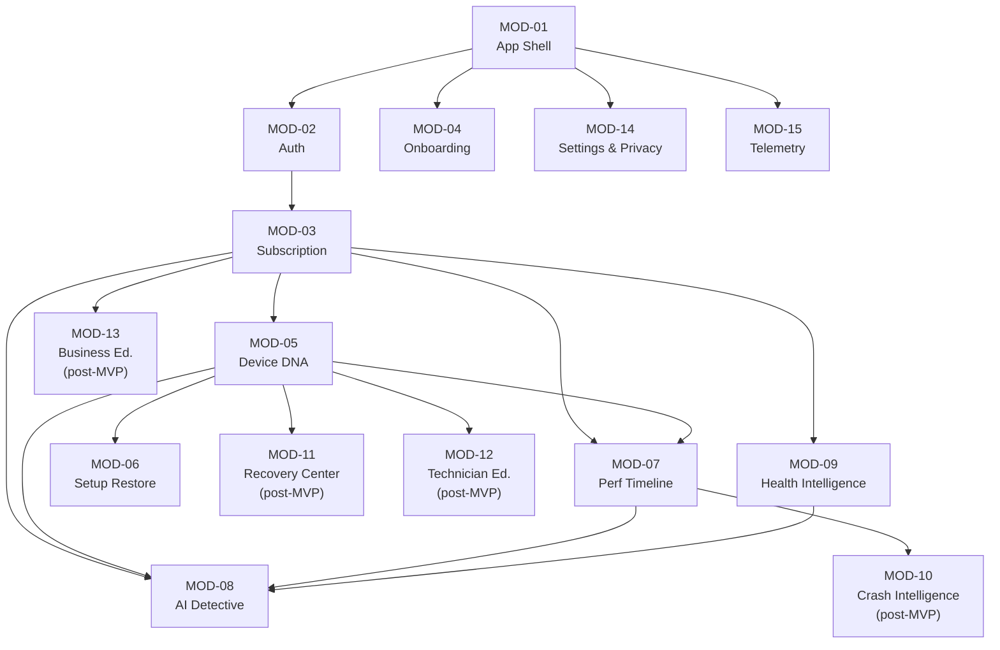
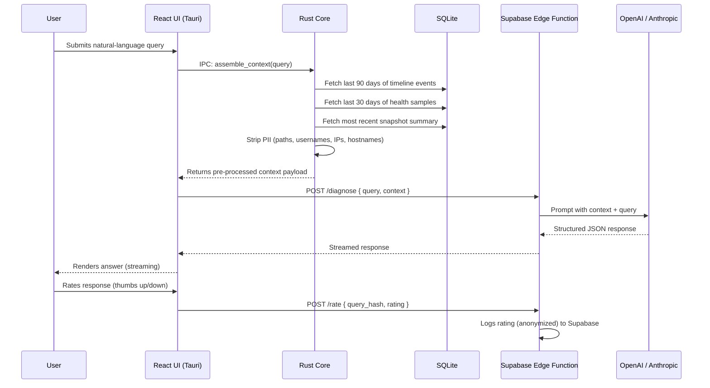

# 06. Functional Requirements Specification

> Enumerated functional requirements (FR-###) grouped by pillar and module, implementation-ready. Part of the DeviceLifeline documentation suite — see [Documentation Index](README.md).

**Status:** Draft v1 · **Authoring role:** Principal Product Manager · **Last updated:** 2026-06-07
**Related:** [03. PRD](03-product-requirements-document.md), [07. NFR Specification](07-non-functional-requirements.md), [05. User Stories](05-user-stories.md), [11. MVP Definition](11-mvp-definition.md), [30. System Architecture](30-system-architecture.md)

---

## 1. Purpose & Scope

This Functional Requirements Specification enumerates every discrete behavioral requirement for DeviceLifeline. Requirements are organized by pillar/module, carry stable IDs (FR-###), and specify priority (using MoSCoW), MVP flag, dependencies, and notes sufficient for an engineering team to implement without further product discovery.

For non-functional requirements (performance, security, availability, privacy), see [07. NFR Specification](07-non-functional-requirements.md). For the user stories that motivate these requirements, see [05. User Stories](05-user-stories.md).

**Priority legend:**
- **M** — Must Have: MVP-blocking; product cannot ship without it.
- **S** — Should Have: MVP target; cut only under resource constraint.
- **C** — Could Have: MVP stretch; deferred to Phase 2 if cut.
- **W** — Won't Have (MVP): documented for Phase 2+ planning.

---

## 2. Assumptions

- All FR-### IDs are stable. Deprecated requirements are annotated **[DEPRECATED]** rather than renumbered.
- "On-device" means the Rust core agent running on the user's Windows machine.
- "Cloud" means Supabase (Postgres + Edge Functions + Storage).
- "UI" means the React/TypeScript/Tailwind frontend rendered in Tauri's WebView2 shell.
- Windows 10 build 19041+ and Windows 11 are the only supported OS versions at MVP.
- WinGet 1.6+ is the primary install source; MS Store and vendor installer URLs are fallbacks.
- AI inference is server-side only; LLM API calls originate from Supabase Edge Functions, never from the client.

---

## 3. Module Map

| Module ID | Module Name | Pillar | FR Range |
|---|---|---|---|
| MOD-01 | Application Shell & Lifecycle | Cross-cutting | FR-001–FR-015 |
| MOD-02 | User Account & Authentication | Cross-cutting | FR-016–FR-030 |
| MOD-03 | Subscription & Licensing | Cross-cutting | FR-031–FR-045 |
| MOD-04 | Onboarding | Cross-cutting | FR-046–FR-060 |
| MOD-05 | Device DNA Engine | Pillar 1 | FR-061–FR-110 |
| MOD-06 | Setup Export & Restore | Pillar 2 | FR-111–FR-155 |
| MOD-07 | Performance Timeline | Pillar 3 | FR-156–FR-200 |
| MOD-08 | AI Detective | Pillar 4 | FR-201–FR-235 |
| MOD-09 | Health Intelligence | Pillar 5 | FR-236–FR-275 |
| MOD-10 | Crash Intelligence | Pillar 6 | FR-276–FR-300 |
| MOD-11 | Recovery Center | Pillar 7 | FR-301–FR-325 |
| MOD-12 | Technician Edition | Pillar 8 | FR-326–FR-350 |
| MOD-13 | Business Edition | Pillar 9 | FR-351–FR-380 |
| MOD-14 | Settings & Privacy | Cross-cutting | FR-381–FR-400 |
| MOD-15 | Telemetry & Analytics | Cross-cutting | FR-401–FR-415 |

---

## 4. Functional Requirements

### MOD-01 — Application Shell & Lifecycle

| ID | Requirement | Priority | MVP | Dependencies | Notes |
|---|---|:---:|:---:|---|---|
| FR-001 | The application shall be packaged as a Tauri-based native desktop application using WebView2 on Windows. | M | ✓ | Tauri ≥ 2.x | Installer must bundle WebView2 bootstrapper |
| FR-002 | The application installer shall be distributed as a signed `.msi` and `.exe` installer. Both formats must be produced by the CI pipeline. | M | ✓ | FR-001 | Code signing certificate required |
| FR-003 | The application shall launch to the main dashboard in ≤ 3 seconds on the reference hardware (i5-8250U, 8 GB RAM, SATA SSD, cold launch). | M | ✓ | FR-001 | Tauri preload + SQLite warm-up |
| FR-004 | The Rust core agent shall register itself as a Windows service and start automatically on system boot. | M | ✓ | FR-001 | Requires elevated install permissions |
| FR-005 | The Rust core agent shall consume ≤ 1% average CPU during idle periods and ≤ 15% peak CPU during snapshot generation. | M | ✓ | FR-004 | Enforced by scheduler budget |
| FR-006 | The application shall support graceful update delivery: new versions downloaded in background, applied on next launch with user notification. | M | ✓ | FR-001, FR-002 | Tauri updater plugin |
| FR-007 | The application shall display a meaningful error state and allow the user to retry or report when the Rust core agent is unavailable. | M | ✓ | FR-004 | Sentry error capture for unhandled states |
| FR-008 | The application shall support Windows 10 build 19041 (20H1) through the latest released Windows 11 version at time of build. | M | ✓ | FR-001 | CI matrix required |
| FR-009 | The application shall pause background collection when the device is in Windows Battery Saver mode. | M | ✓ | FR-004 | Windows power plan event subscription |
| FR-010 | The application shall support WebView2 version pinning to avoid regressions from WebView2 auto-updates on user devices. | S | ✓ | FR-001 | Tauri config: `webview2-install-mode` |
| FR-011 | The application shall display the current version number and build hash in the Settings > About screen. | S | ✓ | — | Injected at build time |
| FR-012 | The application UI shall render correctly at 100%, 125%, 150%, and 200% display scaling (DPI). | M | ✓ | FR-001 | Tailwind responsive layout required |
| FR-013 | The application shall respect the Windows system light/dark mode setting by default, with manual override in settings. | S | ✓ | FR-001 | CSS media query `prefers-color-scheme` |
| FR-014 | The application shall not require an internet connection to start or use core local features (snapshot, timeline, health). | M | ✓ | FR-001 | Local-first architecture |
| FR-015 | The application shall queue cloud sync operations when offline and execute them automatically when connectivity is restored. | M | ✓ | FR-014, Supabase | Retry with exponential backoff |

---

### MOD-02 — User Account & Authentication

| ID | Requirement | Priority | MVP | Dependencies | Notes |
|---|---|:---:|:---:|---|---|
| FR-016 | The system shall support user registration with email address and password. | M | ✓ | Supabase Auth | Password min length: 12 chars, complexity enforced |
| FR-017 | The system shall support OAuth sign-in via Google and Microsoft accounts. | S | ✓ | Supabase Auth OAuth | Deep link callback via Tauri URL handler |
| FR-018 | The system shall enforce email verification before granting access to cloud-sync features. | M | ✓ | FR-016, Supabase | Local features available pre-verification |
| FR-019 | The system shall support password reset via email with a time-limited (15-minute) token. | M | ✓ | FR-016, Supabase | Token delivered to registered email |
| FR-020 | The system shall maintain an authenticated session persisted to secure local storage. Session shall refresh automatically before expiry (default 7 days). | M | ✓ | FR-016 | Supabase JWT refresh token |
| FR-021 | The system shall support account deletion from within the app. Deletion shall trigger: deactivation of subscription (if active), deletion of all cloud data, and local data wipe of auth tokens. | M | ✓ | FR-016, FR-036 | GDPR right to erasure |
| FR-022 | The system shall log all authentication events (login, logout, failed login, password reset) with timestamp and IP address in the audit log. | M | ✓ | FR-016, Supabase | Supabase audit log + Sentry |
| FR-023 | The system shall lock the account after 10 consecutive failed login attempts and require email-based unlock. | S | ✓ | FR-016, Supabase | Brute force protection |
| FR-024 | The system shall support multi-factor authentication (TOTP) as an optional security enhancement. | C | — | FR-016, Supabase | Post-MVP; Supabase MFA |

---

### MOD-03 — Subscription & Licensing

| ID | Requirement | Priority | MVP | Dependencies | Notes |
|---|---|:---:|:---:|---|---|
| FR-031 | The system shall support five subscription tiers: Free, Pro, Developer, Technician, Business. | M | ✓ | Stripe, Supabase | Technician and Business are post-MVP but tiers must be defined in the schema |
| FR-032 | The system shall process subscription payments via Stripe for all markets except Africa. | M | ✓ | Stripe API | Stripe Checkout hosted page via Tauri browser open |
| FR-033 | The system shall process subscription payments via Paystack for African markets (Ghana, Nigeria, Kenya, South Africa, Egypt as Day 1). | M | ✓ | Paystack API | Market detection by IP geolocation + user-selectable override |
| FR-034 | The system shall support monthly and annual billing cycles for all paid tiers. Annual discount ≥ 15% vs monthly equivalent. | M | ✓ | FR-032, FR-033 | Discount configured in Stripe/Paystack product catalog |
| FR-035 | The system shall enforce feature access based on the user's active subscription tier, enforced on both the client (UI gating) and server (Supabase RLS + Edge Function checks). | M | ✓ | FR-031, Supabase RLS | Dual enforcement prevents client-side bypass |
| FR-036 | The system shall allow users to cancel their subscription from within the app. Cancellation shall take effect at the end of the current billing period; Pro features remain active until that date. | M | ✓ | FR-032, FR-033 | Stripe/Paystack webhook on subscription end |
| FR-037 | The system shall send an email receipt to the user within 5 minutes of each successful billing event. | M | ✓ | FR-032, FR-033 | Stripe/Paystack webhook → Supabase Edge Function → email |
| FR-038 | The system shall present a 14-day free trial for Pro tier to new registered users. Trial period starts on account creation. | S | ✓ | FR-031 | Trial managed in Stripe; no credit card required |
| FR-039 | The system shall display remaining trial days prominently during the trial period. | S | ✓ | FR-038 | Dashboard banner |
| FR-040 | The system shall support coupon codes redeemable at checkout for promotional discounts. | C | — | FR-032, FR-033 | Stripe promotions API; post-MVP |
| FR-041 | The system shall support per-device licensing for the Business tier (price per device per month). | W | — | FR-031 | Phase 2/3 |
| FR-042 | The system shall enforce a maximum of 3 concurrent device activations per Pro license. | S | ✓ | FR-031, Supabase | Device activation tracked in Supabase; user notified when limit reached |
| FR-043 | The system shall provide a subscription management screen showing current plan, billing date, payment method, and invoice history. | M | ✓ | FR-031 | Invoice history links to Stripe/Paystack portal |

---

### MOD-04 — Onboarding

| ID | Requirement | Priority | MVP | Dependencies | Notes |
|---|---|:---:|:---:|---|---|
| FR-046 | The system shall present a first-run onboarding wizard on initial launch that completes in ≤ 4 steps before showing the first Device DNA Snapshot. | M | ✓ | FR-001, FR-016 | Steps: Welcome, Account, Permissions, First Snapshot |
| FR-047 | The onboarding wizard shall request the following Windows permissions with individual plain-English explanations: filesystem read (for app detection), registry read (for config and startup items), WMI access (for hardware data), system event subscription (for timeline collection). | M | ✓ | FR-046 | Each permission listed with: why needed, what is read, what is NOT read |
| FR-048 | The system shall allow users to decline optional permissions during onboarding. The app shall function with reduced capability and clearly indicate which features are unavailable. | M | ✓ | FR-047 | Required permissions: registry read, WMI. Optional: filesystem scan depth |
| FR-049 | The system shall automatically trigger a first Device DNA Snapshot upon onboarding completion. | M | ✓ | FR-046, FR-062 | Snapshot runs in background; progress shown in onboarding completion screen |
| FR-050 | The system shall display the first health score summary within the onboarding completion screen. | M | ✓ | FR-049, FR-237 | Score calculated from first snapshot data |
| FR-051 | The system shall track onboarding completion as a distinct analytics event (PostHog: `onboarding_completed`) with step-level funnel events. | M | ✓ | FR-046, FR-404 | Required for activation rate measurement |
| FR-052 | The system shall provide a "skip" option for account creation during onboarding, allowing local-only use with limited features. | S | ✓ | FR-046 | Upsell prompt displayed; local mode has no cloud sync |
| FR-053 | The system shall resume interrupted onboarding at the last completed step on next launch. | S | ✓ | FR-046 | State persisted to SQLite |

---

### MOD-05 — Device DNA Engine

| ID | Requirement | Priority | MVP | Dependencies | Notes |
|---|---|:---:|:---:|---|---|
| FR-061 | The Rust core agent shall enumerate all installed applications by querying the following sources: Windows registry (`HKLM\SOFTWARE\Microsoft\Windows\CurrentVersion\Uninstall`), `HKCU` equivalent, WMI `Win32_Product` (async, non-blocking), and AppX/MSIX packages via `Get-AppxPackage` PowerShell equivalent in Rust. | M | ✓ | FR-004 | WMI query must be non-blocking to avoid system event log spam |
| FR-062 | Each installed application record shall include: display name, version, publisher, install date, install location, install source (WinGet package ID if mappable, MS Store product ID, or "unknown"). | M | ✓ | FR-061 | WinGet source mapping via local WinGet manifest cache |
| FR-063 | The Rust core agent shall enumerate all Windows services with: service name, display name, start type (automatic, manual, disabled, automatic-delayed), current state, and binary path. | M | ✓ | FR-004 | Windows Service Control Manager API |
| FR-064 | The Rust core agent shall enumerate all startup items from: registry Run/RunOnce keys (HKLM and HKCU), Task Scheduler (enabled tasks with `SYSTEM` or user-level triggers), Startup folder (per-user and all-users). | M | ✓ | FR-004 | Maps to startup impact metric for Timeline |
| FR-065 | The Rust core agent shall record the current power plan (GUID, name, settings summary) and network adapter configurations (adapter name, type, IP config method, DNS). | S | ✓ | FR-004 | Power plan via `powercfg` equivalent; network via WMI or netsh |
| FR-066 | The Rust core agent shall detect installed browsers (Chrome, Edge, Firefox, Brave, Opera) and enumerate installed extensions for each with: extension ID, name, version, enabled state. | S | ✓ | FR-004 | Read from browser extension manifest directories; no browser process access |
| FR-067 | The Rust core agent shall detect the following developer toolchain components: Node.js (version, npm version), Python (version, pip), Rust (version, cargo), Java (version, JAVA_HOME), VS Code (version, installed extensions list), Docker Desktop (version), Git (version, global config), WSL (installed distros + versions), package managers (Homebrew/Scoop/Chocolatey, if present). | S | ✓ | FR-004 | Detection via PATH, registry, and well-known install directories |
| FR-068 | The Device DNA Snapshot shall be stored in the local SQLite database with a schema that supports versioning (each snapshot is a distinct, immutable record with a UUID and timestamp). | M | ✓ | FR-061–067, SQLite | Schema defined in [32. Database Design](32-database-design.md) |
| FR-069 | The Device DNA Snapshot shall be serializable to a portable `.dlsnap` archive format containing: a human-readable JSON manifest, binary-compressed event data, and a SHA-256 checksum of the manifest. | M | ✓ | FR-068 | Format versioned (v1 at MVP) for future compatibility |
| FR-070 | The Device DNA Snapshot generation shall complete in ≤ 30 seconds (P99) on the reference device. | M | ✓ | FR-061–067 | Enforced by per-collector timeout; partial results acceptable with logged skips |
| FR-071 | The system shall schedule automatic Device DNA Snapshots at user-configurable intervals (default: daily). Configurable range: 6 hours to 7 days, or manual-only. | S | ✓ | FR-068, FR-004 | Scheduler respects battery saver (FR-009) |
| FR-072 | The UI shall display the Device DNA Snapshot inventory in a searchable, filterable list organized by category (Applications, Services, Startup, Browser, Dev Tools, System Config). | M | ✓ | FR-068 | Filter by category; search by name |
| FR-073 | The UI shall display the snapshot history as a list of timestamped entries. Users shall be able to open any historical snapshot to view its contents. | M | ✓ | FR-068 | Comparison between snapshots is post-MVP (FR-074) |
| FR-074 | The UI shall display a diff view comparing any two Device DNA Snapshots, highlighting added, removed, and changed items per category. | W | — | FR-068 | Post-MVP; Phase 2 |
| FR-075 | The system shall allow the user to label any snapshot with a custom name (e.g., "Before GPU upgrade"). | S | ✓ | FR-068 | Max 100 characters; stored in snapshot metadata |
| FR-076 | The system shall sync Device DNA Snapshots to Supabase Storage (encrypted at rest, AES-256) for Pro and higher tiers. | M | ✓ | FR-068, Supabase, FR-035 | Sync is async; local SQLite is always source of truth |
| FR-077 | The system shall enforce a local SQLite retention limit of 365 snapshots per device. Oldest snapshots are pruned when the limit is reached, after confirming cloud sync for Pro users. | S | ✓ | FR-068, FR-076 | Free users: 30-snapshot local limit |

---

### MOD-06 — Setup Export & Restore

| ID | Requirement | Priority | MVP | Dependencies | Notes |
|---|---|:---:|:---:|---|---|
| FR-111 | The system shall allow Pro users to export any Device DNA Snapshot as a `.dlsnap` file to a user-selected local directory. | M | ✓ | FR-069, FR-035 | Tauri file dialog; export includes checksum |
| FR-112 | The system shall allow Pro users to import a `.dlsnap` file from the local filesystem or from a cloud-synced snapshot list. | M | ✓ | FR-069, FR-035 | Validates checksum before import; rejects malformed files |
| FR-113 | Before initiating a restore, the system shall generate a pre-restore compatibility report that classifies each application in the snapshot as: WinGet-available, MS Store-available, vendor-URL-available, or manual-required. | M | ✓ | FR-062, FR-112 | WinGet availability check via `winget search` with package ID; completes in ≤ 15 seconds for 100 apps |
| FR-114 | The pre-restore compatibility report shall display: total app count, auto-installable count, manual count, estimated install time, and total download size estimate. | M | ✓ | FR-113 | Download size estimated from WinGet manifest metadata |
| FR-115 | The user shall be able to select or deselect individual applications or entire categories from the restore operation before confirming. | M | ✓ | FR-113 | Selection persisted for the duration of the restore session |
| FR-116 | The restore engine shall install applications in the following priority order: WinGet packages → Microsoft Store packages → vendor installer URLs → skipped (logged as manual). | M | ✓ | FR-113 | WinGet calls via `winget install --id <pkg> --silent --accept-package-agreements --accept-source-agreements` |
| FR-117 | The restore engine shall install applications in parallel (up to 4 concurrent installs) to minimize total restore time, respecting per-installer constraints. | S | ✓ | FR-116 | Concurrency limit configurable; some installers (e.g., VS Code extensions) must be sequential |
| FR-118 | The restore UI shall display real-time per-app status: pending, downloading, installing, succeeded, failed. The UI shall update within 2 seconds of each state change. | M | ✓ | FR-116, FR-117 | Progress communicated from Rust core to UI via Tauri IPC events |
| FR-119 | On restore completion, the system shall display a summary report: total apps attempted, succeeded, failed, skipped. Failed apps shall include the error reason in plain English. | M | ✓ | FR-116 | Errors mapped to plain-English messages; raw error codes logged to Sentry |
| FR-120 | The restore engine shall allow cancellation at any point. Already-installed apps are not uninstalled on cancellation. The partial restore state is logged. | M | ✓ | FR-116 | Cancellation signals all pending installs to abort; in-progress installs complete before abort |
| FR-121 | The restore engine shall support dry-run mode: simulate the restore plan (pre-flight + download check) without executing any installs. | C | — | FR-113 | MVP stretch; ships as beta flag if time allows |
| FR-122 | The restore engine shall restore browser extensions for Chrome, Edge, and Firefox using the browser's extension manifest data from the snapshot. | S | ✓ | FR-066, FR-112 | For Chrome/Edge: navigate to Chrome Web Store install URLs in background; for Firefox: AMO install URLs |
| FR-123 | The restore engine shall restore VS Code extensions using the `code --install-extension <ext-id>` command for each extension captured in the snapshot. | S | ✓ | FR-067, FR-112 | Requires VS Code in PATH; skipped with a warning if not found |
| FR-124 | The restore engine shall restore global npm packages captured in the snapshot using `npm install -g <package>@<version>`. | S | ✓ | FR-067, FR-112 | Requires Node.js in PATH |
| FR-125 | The system shall log all restore operations (attempted, succeeded, failed, skipped) to the local SQLite audit log and to Supabase for Pro users. | M | ✓ | FR-116, SQLite, Supabase | Restore log retained for 90 days |
| FR-126 | The restore success rate for the 50 most common WinGet-available packages shall be ≥ 90% as measured in CI integration tests. | M | ✓ | FR-116 | Tested against a locked list of packages in [43. Testing Strategy](43-testing-strategy.md) |
| FR-127 | The system shall allow users to save a named restore template (a subset of apps from a snapshot) for repeated application to multiple machines. | W | — | FR-115 | Post-MVP |

---

### MOD-07 — Performance Timeline

| ID | Requirement | Priority | MVP | Dependencies | Notes |
|---|---|:---:|:---:|---|---|
| FR-156 | The Rust core agent shall collect the following system events and store them in the local SQLite timeline table: application installs, application removals, application version changes, Windows Update events (KB number, classification), driver updates (driver name, version, device class), startup item additions/removals, service start-type changes, hardware changes (device attach/detach), and power plan changes. | M | ✓ | FR-004, SQLite | Event sources: Windows Event Log (Application, System, Setup channels), WMI event subscriptions, registry change notifications |
| FR-157 | For each timeline event, the system shall record: event UUID, event type, timestamp (UTC), source (system/user), plain-English description (generated by Rust core), and raw metadata JSON. | M | ✓ | FR-156, SQLite | Plain-English description must be generated without LLM (deterministic rule engine) |
| FR-158 | The Rust core agent shall collect the following performance metrics at configurable intervals (default: every 5 minutes during active use, every 60 minutes during idle): boot time (seconds, from BIOS to desktop), CPU utilization (5-min average), RAM usage (GB, 5-min average), disk read/write throughput (MB/s, 5-min average). | M | ✓ | FR-004, SQLite | Boot time measured via Windows Event Log ID 6013 + startup event correlation |
| FR-159 | The system shall correlate timeline events with performance metric changes using a statistical significance threshold. Correlations shall be classified as: High Confidence (annotated as "Likely Cause"), Medium Confidence ("Possible Cause"), or Low Confidence ("May Be Related"). | M | ✓ | FR-156, FR-158 | Correlation algorithm specified in [23. Performance Timeline Design](23-performance-timeline-design.md); default threshold: Pearson |r| ≥ 0.6 for High, 0.4–0.6 for Medium |
| FR-160 | The UI shall render the Performance Timeline as a scrollable, zoomable chart with events plotted on a time axis and performance metrics overlaid as line series. | M | ✓ | FR-156, FR-158 | React charting library (recharts or equivalent); SQLite data loaded via Tauri IPC |
| FR-161 | The Performance Timeline shall display a default view of 90 days. Users shall be able to select 7-day, 30-day, 90-day, 180-day, and custom date range views. | M | ✓ | FR-160 | Custom range limited to available data depth |
| FR-162 | The Performance Timeline shall load and render for a 90-day view in ≤ 2 seconds. | M | ✓ | FR-160 | SQLite query optimization required; data pre-aggregated to hourly buckets for display |
| FR-163 | Each timeline event marker shall be clickable, opening a detail panel with: event timestamp, event type, source, plain-English description, correlation annotation (if any), and a link to run an AI Detective query pre-seeded with this event. | M | ✓ | FR-157, FR-159, FR-160 | Detail panel is a slide-in panel, not a modal |
| FR-164 | The UI shall allow users to filter the Performance Timeline by event category (Software, Driver, Windows Update, Startup, Service, Hardware). Multiple categories can be active simultaneously. | S | ✓ | FR-160 | Filter state persisted to localStorage |
| FR-165 | The system shall annotate events with a "likely impact" badge when a High Confidence correlation is detected, showing the direction and magnitude of the performance metric change (e.g., "Boot time +34%"). | M | ✓ | FR-159, FR-160 | Badge displayed on the event marker in the timeline chart |
| FR-166 | For Free-tier users, the Performance Timeline shall display a 7-day read-only preview with a Pro upgrade prompt. Full timeline access requires Pro. | S | ✓ | FR-035, FR-160 | Preview uses same chart component; events beyond 7 days are visually blurred |
| FR-167 | The system shall retain timeline event data in SQLite for a minimum of 365 days (configurable; user-controlled). Data older than the retention limit is pruned. | S | ✓ | FR-156, SQLite | Cloud sync extends effective retention for Pro users |
| FR-168 | Timeline events shall be synced to Supabase for Pro users, enabling cross-device timeline views and cloud-based AI Detective analysis. | S | ✓ | FR-156, Supabase, FR-035 | Events are synced in batches every 15 minutes when online |

---

### MOD-08 — AI Detective

| ID | Requirement | Priority | MVP | Dependencies | Notes |
|---|---|:---:|:---:|---|---|
| FR-201 | The system shall provide a natural-language query interface (text input, max 500 characters) accessible from the main navigation as "AI Detective." | M | ✓ | FR-035 | Pro-gated; Free users see a feature description with upgrade prompt |
| FR-202 | On query submission, the on-device Rust pre-processor shall assemble a structured context payload from: the last 90 days of timeline events, the most recent Device DNA Snapshot summary, and the last 30 days of health metric samples. | M | ✓ | FR-156, FR-068, FR-238 | Payload assembled in Rust; passed to UI for transmission to Edge Function |
| FR-203 | The on-device pre-processor shall strip the following from the context payload before transmission: full file paths (replaced with `<file_path>`), usernames (replaced with `<username>`), IP addresses (replaced with `<ip_address>`), and hostnames (replaced with `<hostname>`). | M | ✓ | FR-202 | Privacy requirement; regex-based stripping in Rust |
| FR-204 | The system shall transmit the pre-processed context payload and user query to a Supabase Edge Function. The Edge Function shall call the OpenAI or Anthropic API with the assembled prompt. No API keys shall be present in the client binary. | M | ✓ | FR-202, FR-203, Supabase, OpenAI/Anthropic | Model selection and prompt template defined in Edge Function; model is configurable server-side without client update |
| FR-205 | The AI Detective response shall include: a summary answer (≤ 150 words), primary likely cause with confidence score (0–100%), up to 3 supporting evidence points (each citing a specific timeline event or health reading), and up to 3 recommended remediation steps. | M | ✓ | FR-204 | Response schema enforced via structured output (JSON mode) from the LLM |
| FR-206 | The total AI Detective response time (query submission to first character rendered) shall be ≤ 10 seconds at P90, ≤ 20 seconds at P99. | M | ✓ | FR-204 | Streaming response rendering required to avoid blank wait |
| FR-207 | When the context payload contains insufficient history (device is < 3 days old, or no timeline events exist), the system shall return a graceful "insufficient data" state rather than a generic or hallucinated response. | M | ✓ | FR-202 | Minimum evidence threshold check in Edge Function before LLM call |
| FR-208 | Each AI Detective response shall include a thumbs-up / thumbs-down rating control. User ratings shall be logged to Supabase (anonymized, linked to query hash not personal data) for product analytics. | M | ✓ | FR-205, Supabase | Rating used to measure CSAT KPI |
| FR-209 | The UI shall display an expandable "What was sent?" panel showing the pre-processed (PII-stripped) context payload that was transmitted to the Edge Function. | S | ✓ | FR-203 | Privacy transparency feature |
| FR-210 | The system shall persist the last 50 AI Detective queries and responses in local SQLite for the query history view. | S | ✓ | SQLite, FR-201 | History is local-only; not synced to cloud |
| FR-211 | The UI shall support multi-turn conversation: after an initial AI Detective response, the user can ask a follow-up question, and the system shall include the prior exchange in the context payload for the follow-up. | S | ✓ | FR-204 | Max 5 turns per session; context window budget enforced |
| FR-212 | The system shall rate-limit AI Detective queries to prevent abuse: 20 queries per day for Pro, 5 per day for the free-tier preview. Rate limit is enforced in the Supabase Edge Function. | S | ✓ | FR-204, FR-035 | Remaining queries displayed in UI |
| FR-213 | The AI Detective shall accept pre-seeded query context from Performance Timeline event markers (FR-163), auto-populating the query with the event's plain-English description. | S | ✓ | FR-163 | Pre-populated query is editable before submission |
| FR-214 | The AI Detective shall accept pre-seeded query context from Health Intelligence threshold alerts (FR-248), auto-populating the query with the alert condition. | S | ✓ | FR-248 | Same mechanism as FR-213 |
| FR-215 | The AI Detective response shall not include: specific third-party software purchase recommendations, security advice that constitutes diagnosis of active malware, or medical/legal/financial advice. | M | ✓ | FR-204 | LLM system prompt shall explicitly prohibit these output categories |

---

### MOD-09 — Health Intelligence

| ID | Requirement | Priority | MVP | Dependencies | Notes |
|---|---|:---:|:---:|---|---|
| FR-236 | The Rust core agent shall collect the following hardware metrics at configurable sample intervals (default: every 60 seconds): CPU utilization (%), CPU temperature (°C, per-core), RAM utilization (GB used / GB total), RAM speed (MHz), disk read throughput (MB/s), disk write throughput (MB/s), GPU utilization (%), GPU temperature (°C), GPU VRAM usage (MB), network send/receive throughput (MB/s). | M | ✓ | FR-004 | CPU temp via Windows Management Instrumentation or Open Hardware Monitor WMI provider; GPU via NVAPI (NVIDIA) or ADL SDK (AMD) |
| FR-237 | The system shall compute a composite Health Score for each monitored subsystem (CPU, RAM, SSD, GPU, Battery, Network) on a 0–100 scale. Score ranges: 80–100 = Good, 50–79 = Fair, 0–49 = Critical. Score calculation rules are defined in [22. AI Diagnostics Design](22-ai-diagnostics-design.md) and do not require LLM. | M | ✓ | FR-236 | Deterministic scoring algorithm; score updated every 60 seconds |
| FR-238 | The system shall read SSD/HDD SMART attributes for all connected drives: Reallocated Sectors Count (ID 05), Wear Leveling Count (ID B2 / NVMe equivalent), Power-On Hours (ID 09), Uncorrectable Sector Count (ID C6), Pending Sector Count (ID C5). | M | ✓ | FR-004 | SMART access via Windows `DeviceIoControl` with `IOCTL_STORAGE_QUERY_PROPERTY`; graceful partial data when attributes unavailable |
| FR-239 | The SSD Health Score shall be derived from: Wear Leveling Count (weight 50%), Reallocated Sectors Count (weight 30%), Uncorrectable Sector Count (weight 20%). | M | ✓ | FR-238 | Weights configurable in server-side config; not exposed to user |
| FR-240 | The system shall detect the battery design capacity and full charge capacity for laptops and compute battery health as `(full_charge_capacity / design_capacity) × 100`. | S | ✓ | FR-004 | Windows Battery Information via `IOCTL_BATTERY_QUERY_INFORMATION` |
| FR-241 | The Health Intelligence dashboard shall display the current Health Score for each subsystem on the main dashboard, visible on the Free tier. | M | ✓ | FR-237 | Score displayed as a gauge/number with color indicator |
| FR-242 | For Pro users, the Health Intelligence dashboard shall display trend charts for each metric over 7-day, 30-day, and 90-day windows. | M | ✓ | FR-237, FR-035 | Charts use the same data store as Performance Timeline |
| FR-243 | The system shall write health metric samples to the local SQLite health_samples table with timestamp, device_id, metric_name, metric_value, and unit. | M | ✓ | FR-236, SQLite | Table indexed on (device_id, metric_name, timestamp) for fast trend queries |
| FR-244 | The system shall retain health metric samples in SQLite for a minimum of 90 days. Samples older than the retention limit are aggregated to hourly averages before pruning. | S | ✓ | FR-243, SQLite | Aggregation preserves trend visibility |
| FR-245 | For Pro users, health metric samples shall be synced to Supabase for cloud trend analysis and AI Detective context. | S | ✓ | FR-243, Supabase, FR-035 | Sync in 15-minute batches |
| FR-246 | The system shall issue an in-app alert when any health metric crosses a critical threshold. Default thresholds: SSD wear > 80%, CPU temp sustained > 90°C for > 5 min, RAM utilization > 95% for > 10 min, GPU temp > 95°C for > 5 min, battery health < 60%. | M | ✓ | FR-237 | Thresholds configurable by user within documented safe ranges |
| FR-247 | Alert delivery shall include: in-app notification banner (dismissible), system toast notification (optional, configurable), and a one-click link to AI Detective with pre-seeded query. | S | ✓ | FR-246, FR-214 | Toast via Tauri notification API |
| FR-248 | The system shall surface a plain-English interpretation for each health metric: current value, direction of trend, and a one-line explanation of what the metric measures. | M | ✓ | FR-237 | Interpretation is deterministic (template-based), not LLM |
| FR-249 | The system shall collect network latency (ping to 8.8.8.8 and 1.1.1.1, 5-minute average) and packet loss percentage as part of network health. | S | ✓ | FR-236 | Configurable ping targets; user can disable network check |
| FR-250 | The system shall detect memory errors from Windows Event Log (ID 1001, MemoryDiagnostics-Results) and surface them as health alerts. | S | ✓ | FR-004 | Memory diagnostic must have been run; system prompts user to run if not |

---

### MOD-10 — Crash Intelligence (Post-MVP)

> **[POST-MVP — Phase 2]** All requirements in this module are Phase 2 deliverables.

| ID | Requirement | Priority | MVP | Dependencies | Notes |
|---|---|:---:|:---:|---|---|
| FR-276 | The system shall monitor the Windows Event Log (System and Application channels) for BSOD events (Event ID 1001, BugCheck source) and translate stop codes to plain-English descriptions. | M | — | FR-004 | Lookup table of stop codes + LLM fallback for uncommon codes |
| FR-277 | The system shall parse Windows minidump files (`.dmp`) in `%WINDIR%\Minidump` to extract: stop code, faulting module, driver name and version. | S | — | FR-004 | Via Windows Debug API or third-party Rust crate |
| FR-278 | The system shall correlate BSOD events with recent timeline events (FR-156) to identify likely driver or software causes. | M | — | FR-156, FR-276 | Same correlation engine as Performance Timeline |
| FR-279 | Application crash events (Event Log source: Application Error, ID 1000) shall be captured, associated with the faulting application, and surfaced in the Crash Intelligence view. | M | — | FR-004 | Filter: only crashes for user-installed applications |
| FR-280 | Crash events shall appear as markers on the Performance Timeline (FR-160), integrated into the unified history view. | S | — | FR-156, FR-276 | Crash marker style distinct from other event types |

---

### MOD-11 — Recovery Center (Post-MVP)

> **[POST-MVP — Phase 2]** All requirements in this module are Phase 2 deliverables.

| ID | Requirement | Priority | MVP | Dependencies | Notes |
|---|---|:---:|:---:|---|---|
| FR-301 | The system shall allow users to roll back a specific application to a previously captured version by uninstalling the current version and installing the prior version via WinGet or vendor URL. | M | — | FR-062, FR-116 | Rollback available only if a prior snapshot contains the previous version data |
| FR-302 | The system shall allow users to restore startup item configuration (enabled/disabled state) to a prior Device DNA Snapshot state. | M | — | FR-064, FR-068 | Apply changes via Windows Task Scheduler API and registry |
| FR-303 | The system shall allow users to create named recovery checkpoints manually (distinct from automatic snapshots). | S | — | FR-068 | Stored as a tagged snapshot in SQLite |

---

### MOD-12 — Technician Edition (Post-MVP)

> **[POST-MVP — Phase 2]** All requirements in this module are Phase 2 deliverables. See [56. Technician Edition Specification](56-technician-edition-specification.md).

| ID | Requirement | Priority | MVP | Dependencies | Notes |
|---|---|:---:|:---:|---|---|
| FR-326 | The Technician Edition shall provide a multi-device dashboard listing all customer devices with their current health scores and last scan dates. | M | — | FR-237, Supabase | Per-seat Technician license |
| FR-327 | The system shall support a portable scan mode: the Rust core agent runs from a USB drive without installing software on the customer's device, collecting a read-only Device DNA Snapshot and health report. | S | — | FR-062, FR-237 | Portable binary + SQLite DB on USB; no registry writes |
| FR-328 | The system shall generate a customer-readable PDF diagnostic report from a device scan, including: health scores per subsystem, top 5 performance findings, and recommended remediation steps. | M | — | FR-237, FR-159 | PDF generated on-device; report template is customizable with shop branding |
| FR-329 | The Technician Edition shall support snapshot comparison between the current scan and any prior scan for the same customer device. | S | — | FR-074 | Requires FR-074 (snapshot diff, post-MVP) |

---

### MOD-13 — Business Edition (Post-MVP)

> **[POST-MVP — Phase 2/3]** All requirements in this module are Phase 2/3 deliverables. See [57. Business Edition Specification](57-business-edition-specification.md).

| ID | Requirement | Priority | MVP | Dependencies | Notes |
|---|---|:---:|:---:|---|---|
| FR-351 | The Business Edition shall provide a fleet dashboard showing all enrolled devices, their health scores, and software compliance status. | M | — | FR-237, Supabase, FR-041 | Per-device licensing |
| FR-352 | The system shall allow IT admins to define a software compliance baseline (list of required apps + versions) and alert when any device deviates. | M | — | FR-062, Supabase | Compliance baseline stored in Supabase; checked against device snapshots |
| FR-353 | The system shall support device onboarding templates: a named restore template (FR-127) that can be applied to any new device in the fleet. | M | — | FR-127 | Phase 3 (requires FR-127) |
| FR-354 | The Business Edition shall expose a REST API for integration with external ITSM/SIEM tools (e.g., ServiceNow, Splunk). | S | — | Supabase, FR-351 | API authenticated via Supabase service role key with IP allowlist |

---

### MOD-14 — Settings & Privacy

| ID | Requirement | Priority | MVP | Dependencies | Notes |
|---|---|:---:|:---:|---|---|
| FR-381 | The Settings screen shall allow users to configure: snapshot schedule, health monitoring interval, telemetry opt-in/out (PostHog), crash reporting opt-in/out (Sentry), notification preferences (in-app + system toast). | M | ✓ | FR-071, FR-236 | Settings persisted to SQLite; synced to Supabase for cross-device consistency (Pro) |
| FR-382 | The system shall allow users to exclude specific applications or directories from Device DNA Snapshot collection. | S | ✓ | FR-061 | Exclusion list stored in SQLite settings |
| FR-383 | The system shall provide a Data Management screen allowing users to: view storage usage (local SQLite + cloud), delete individual snapshots, delete all local data, and export all personal data as JSON. | M | ✓ | FR-068, Supabase | GDPR right of access + right to erasure |
| FR-384 | The "Export all data" function shall produce a ZIP archive containing: all Device DNA Snapshots as JSON, all timeline events as JSON, all health sample data as CSV, and account metadata. | S | ✓ | FR-383 | Export completes in ≤ 30 seconds for typical data volume |
| FR-385 | The system shall allow users to delete their account and all associated cloud data from within the app. Deletion shall be permanent and confirmed with a typed confirmation phrase ("delete my account"). | M | ✓ | FR-021, Supabase | Cloud data deletion triggered via Supabase Edge Function; local data cleared separately |
| FR-386 | All telemetry events sent to PostHog shall exclude: full file paths, usernames, IP addresses, device hostnames, and any free-text user input. | M | ✓ | FR-401, PostHog | Enforced at the event construction layer in Rust and React |

---

### MOD-15 — Telemetry & Analytics

| ID | Requirement | Priority | MVP | Dependencies | Notes |
|---|---|:---:|:---:|---|---|
| FR-401 | The system shall instrument the following events in PostHog (exact event names defined in [35. Event Tracking Specification](35-event-tracking-specification.md)): app_launched, onboarding_started, onboarding_completed, snapshot_generated, timeline_viewed, ai_query_submitted, ai_response_rated, restore_started, restore_completed, subscription_upgraded, subscription_cancelled. | M | ✓ | PostHog | Opt-in; only fires if user has consented (FR-381) |
| FR-402 | PostHog events shall include the following properties where applicable: tier (free/pro/developer/technician/business), event_source (ui/scheduler/api), session_id (UUID, rotated per launch), app_version, os_version. | M | ✓ | FR-401 | No user PII in event properties |
| FR-403 | The system shall capture unhandled Rust panics and React exceptions to Sentry with: stack trace, app version, OS version, session_id. No PII shall be included in Sentry payloads. | M | ✓ | Sentry | Opt-in; configurable in FR-381 |
| FR-404 | The system shall track the onboarding funnel as a sequence of events in PostHog: `onboarding_step_1_viewed`, `onboarding_step_2_viewed`, `onboarding_step_3_viewed`, `onboarding_step_4_viewed`, `onboarding_completed`. | M | ✓ | FR-051, PostHog | Used to calculate step-level drop-off |
| FR-405 | The system shall send a daily heartbeat event (`device_heartbeat`) to PostHog for each active device, used to calculate WAU and retention metrics. | S | ✓ | PostHog | Heartbeat fires once per calendar day on first launch |

---

## 5. Cross-Cutting Requirements Summary

| Cross-Cutting Concern | Key FRs |
|---|---|
| Local-first / offline operation | FR-014, FR-015, FR-068, FR-156 |
| Privacy pre-processing | FR-203, FR-386 |
| Battery saver respect | FR-009, FR-071, FR-381 |
| Dual license enforcement (client + server) | FR-035 |
| Cloud sync (Supabase) | FR-076, FR-168, FR-245 |
| Telemetry opt-in | FR-381, FR-401 |
| WinGet primary + fallback install | FR-116, FR-126 |
| AI via Edge Function only | FR-204 |

---

## Diagrams

### Module Dependency Graph

### Data Flow: AI Detective

---

## Risks & Mitigations

| Risk | Likelihood | Impact | Mitigation |
|---|---|---|---|
| WMI query for Win32_Product (FR-061) triggers Windows Installer reconfiguration, causing performance issues | High | High | Use registry-based enumeration as primary; Win32_Product only as fallback for specific cases; document this limitation |
| NVMe SMART data unavailability (FR-238) causes incomplete health scores for a significant user cohort | Medium | Medium | Detect at startup; display "limited data" badge for affected drives; log drive models for future vendor-specific handling |
| AI Detective response quality below CSAT target (FR-205, FR-208) | Medium | High | Minimum 3 supporting evidence points required before response is returned; fallback to "insufficient data" if not met; continuous prompt iteration |
| WinGet rate limiting during parallel restore installs (FR-116, FR-117) | Low | Medium | Implement retry with backoff; cap at 4 concurrent installs; monitor WinGet API responses for 429 status |
| Supabase RLS misconfiguration (FR-035) allows cross-user data access | Low | Critical | RLS policies reviewed in security audit (RC-07 in PRD); integration test suite validates row-level isolation |
| Performance Timeline false-positive correlations (FR-159) erode user trust | Medium | High | Correlation threshold tuned in beta; user-dismissible annotations; "correlation not causation" disclaimer in UI |
| FR-203 PII stripping regex misses novel path formats | Medium | Medium | Allowlist approach (only known-safe fields pass through) rather than denylist (strip known-bad) for AI payload construction |

---

## Future Considerations

- **FR-074 (Snapshot diff):** High-demand feature for developers; should be Phase 2 priority.
- **FR-354 (Business API):** REST API for SIEM integration is required for enterprise adoption; design API contract in [34. API Specification](34-api-specification.md) before Phase 3 development begins.
- **Localization (i18n):** No FR covers localization at MVP; this should be added as a separate FR block in Phase 2 if non-English markets are targeted.
- **macOS collectors:** The collector architecture (FR-061–FR-067) is Windows-specific; macOS equivalents (fs_events, launchd, Homebrew) will require a parallel MOD-05-macOS module.

---

## Acceptance Criteria

- [ ] AC-039: All FR-### IDs are unique, non-overlapping, and fall within documented module ranges.
- [ ] AC-040: Every requirement includes: ID, requirement statement, priority (MoSCoW), MVP flag, dependencies, and notes.
- [ ] AC-041: Post-MVP requirements are explicitly labeled with their phase target.
- [ ] AC-042: The module dependency graph Mermaid diagram is present and accurate.
- [ ] AC-043: The AI Detective data flow sequence diagram is present and matches the architecture described in the brief (Rust pre-processing → Supabase Edge Function → LLM; no API keys in client).
- [ ] AC-044: Cross-references to [03. PRD](03-product-requirements-document.md) and [07. NFR Specification](07-non-functional-requirements.md) are present in the header.
- [ ] AC-045: WinGet is documented as primary install source with fallback chain (MS Store → vendor URL) in FR-116.
- [ ] AC-046: Privacy pre-processing requirements (FR-203, FR-386) are present and consistent with the brief's privacy-first principle.
