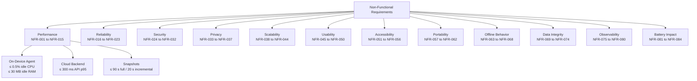
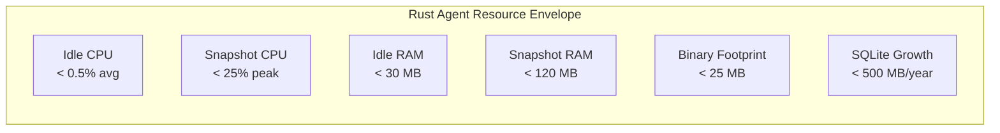

# 07. Non-Functional Requirements Specification

> Defines all measurable quality attributes DeviceLifeline must satisfy across performance, reliability, security, privacy, scalability, usability, accessibility, portability, offline behavior, data integrity, observability, and resource impact. Part of the DeviceLifeline documentation suite — see [Documentation Index](README.md).

**Status:** Draft v1 · **Authoring role:** Principal Software Architect + Senior Product Manager · **Last updated:** 2026-06-07
**Related:** [06. Functional Requirements](06-functional-requirements.md), [17. Security Requirements](17-security-requirements.md), [19. Privacy Requirements](19-privacy-requirements.md), [30. System Architecture](30-system-architecture.md), [37. Observability Strategy](37-observability-strategy.md), [41. Scalability Strategy](41-scalability-strategy.md), [53. Accessibility Requirements](53-accessibility-requirements.md)

---

## 1. Purpose & Scope

This document enumerates all non-functional requirements (NFRs) for DeviceLifeline V1 (MVP) and post-MVP phases. Each NFR carries a stable identifier (`NFR-###`), a measurable target, a verification method, and a phase tag (`MVP` or `Post-MVP`). These requirements govern the quality of the entire system: the on-device Rust agent, the Tauri/React desktop shell, the Supabase cloud backend, and the AI API integration layer.

**In scope:** Agent CPU/RAM/disk budgets, snapshot duration, idle overhead, battery impact, reliability/availability SLAs, security controls, privacy guarantees, cloud and fleet scalability, usability and accessibility minimums, portability roadmap, offline behavior, data integrity, and observability instrumentation.

**Out of scope:** Functional behavior (see [06. Functional Requirements](06-functional-requirements.md)); specific security control implementations (see [17. Security Requirements](17-security-requirements.md)); detailed privacy controls (see [19. Privacy Requirements](19-privacy-requirements.md)).

---

## 2. Assumptions

- A1: The target installation base for MVP is Windows 10 (21H2+) and Windows 11 on x86-64 hardware with at least 4 GB RAM and 500 MB free disk.
- A2: The Rust agent runs as a Windows service under a dedicated low-privilege account, not as SYSTEM.
- A3: Cloud infrastructure is hosted on Supabase (managed Postgres + Edge Functions). Uptime guarantees are bounded by Supabase SLAs.
- A4: AI inference is delegated to OpenAI/Anthropic APIs via Supabase Edge Functions. AI response time includes round-trip network latency.
- A5: "Idle" is defined as no user-initiated action and no scheduled snapshot in progress.
- A6: Battery impact is measured on a reference laptop (Intel i5-1135G7, 50 Wh battery, Windows 11 22H2).
- A7: Performance Timeline event correlation is computed on-device; LLM summarization is cloud-side.
- A8: Accessibility compliance targets WCAG 2.1 AA (see [53. Accessibility Requirements](53-accessibility-requirements.md)).

---

## 3. Performance Requirements

### 3.1 On-Device Agent Resource Budget (Rust Core)

| NFR-ID | Attribute | Target | Condition | Verification |
|--------|-----------|--------|-----------|--------------|
| NFR-001 | Agent idle CPU usage | < 0.5% (single core average over 60 s) | No snapshot in progress, no active user | Automated load test on reference hardware |
| NFR-002 | Agent peak CPU during snapshot | < 25% (single core, 95th percentile) | Full Device DNA snapshot running | Profiling via Windows Performance Monitor |
| NFR-003 | Agent idle RAM (private working set) | < 30 MB | No snapshot, no pending tasks | Task Manager / process monitor automated check |
| NFR-004 | Agent peak RAM during snapshot | < 120 MB (private working set) | Full Device DNA snapshot running | Automated memory profiler |
| NFR-005 | Agent disk footprint (binary + resources) | < 25 MB installed | MVP release build | Installer size check in CI pipeline |
| NFR-006 | SQLite local database growth per year | < 500 MB (rolling, after pruning) | Typical consumer device, daily snapshots | Automated database size audit |
| NFR-007 | Local SQLite read latency (indexed queries) | < 50 ms at p95 | Timeline queries spanning 90 days | Benchmark test suite |
| NFR-008 | Full Device DNA snapshot duration | < 90 s (p95) on reference hardware | Cold capture, all collectors enabled | Automated snapshot benchmark |
| NFR-009 | Incremental snapshot duration | < 20 s (p95) | Diff-only re-scan after initial baseline | Automated snapshot benchmark |
| NFR-010 | UI cold start time (Tauri shell to interactive) | < 3 s | App launch from Windows Start Menu | Automated startup timing test |
| NFR-011 | UI frame rate during normal navigation | ≥ 60 fps | React/Webview rendering, no heavy background task | UI profiling (Chrome DevTools protocol via Tauri) |

### 3.2 Cloud Backend Performance

| NFR-ID | Attribute | Target | Condition | Verification |
|--------|-----------|--------|-----------|--------------|
| NFR-012 | Supabase API response time (p95) | < 300 ms | Standard CRUD operations; Postgres queries | Load test via k6 |
| NFR-013 | AI Detective response latency (end-to-end) | < 12 s (p95) | Full query through Edge Function → OpenAI/Anthropic → client | Integration test with timeout assertion |
| NFR-014 | Snapshot cloud sync throughput | > 1 MB/s sustained | Typical 1–5 MB JSON payload upload | Upload benchmark test |
| NFR-015 | Health alert delivery latency | < 60 s from detection to push notification | Server-side threshold breach to client | End-to-end integration test |

---

## 4. Reliability & Availability Requirements

| NFR-ID | Attribute | Target | Condition | Verification |
|--------|-----------|--------|-----------|--------------|
| NFR-016 | Cloud backend availability | ≥ 99.5% monthly uptime | Supabase + Edge Functions, excluding scheduled maintenance | Uptime monitoring (e.g., Checkly/Better Uptime) |
| NFR-017 | Desktop agent crash rate | < 0.1% of agent-hours | All installed devices in fleet | Sentry crash rate dashboard |
| NFR-018 | Snapshot completion success rate | ≥ 99% | Scheduled + on-demand snapshots | Automated test + production telemetry |
| NFR-019 | Data durability (local SQLite) | No data loss on abnormal process termination | Agent killed mid-snapshot | WAL mode enabled; crash recovery tests |
| NFR-020 | Restore operation success rate | ≥ 95% per install item (WinGet primary path) | Setup restore on clean Windows install | QA test suite; field telemetry |
| NFR-021 | Graceful degradation | All core offline features functional when cloud unreachable | Network disconnected for > 5 min | Offline integration test |
| NFR-022 | Agent self-healing on crash | Agent restarts within 60 s via Windows Service Manager | Agent process killed externally | Service restart policy test |
| NFR-023 | Background update reliability | Update applied without data loss or service interruption | Auto-update via Tauri updater | Staged rollout smoke test |

---

## 5. Security Requirements

> Detailed controls are specified in [17. Security Requirements](17-security-requirements.md). This section records measurable NFR targets only.

| NFR-ID | Attribute | Target | Verification |
|--------|-----------|--------|--------------|
| NFR-024 | AI API key exposure | Zero secrets in the Tauri/Rust client binary | Static binary audit; SAST scan |
| NFR-025 | Authentication token lifetime | Access token ≤ 1 hour; refresh token ≤ 30 days | Supabase Auth config audit |
| NFR-026 | Encrypted data at rest (cloud) | AES-256 for all snapshot payloads in Supabase Storage | Storage encryption config audit |
| NFR-027 | Encrypted data in transit | TLS 1.2+ for all network connections | TLS audit (testssl.sh or equivalent) |
| NFR-028 | Local SQLite encryption | SQLCipher (AES-256) for on-device database | Build config + decryption attempt test |
| NFR-029 | Dependency vulnerability scan | Zero known Critical/High CVEs in release build | OWASP Dependency-Check in CI |
| NFR-030 | Code signing | All Windows binaries signed with EV code-signing cert | Signtool verification in release pipeline |
| NFR-031 | Row-level security enforcement | All Supabase tables with user data have RLS enabled | Supabase RLS audit script |
| NFR-032 | Penetration testing cadence | Annual external pentest + internal review before each major release | Pentest report on file |

---

## 6. Privacy Requirements

> Full privacy specification is in [19. Privacy Requirements](19-privacy-requirements.md). NFR targets only:

| NFR-ID | Attribute | Target | Verification |
|--------|-----------|--------|--------------|
| NFR-033 | PII minimization | No file contents, no keystrokes, no screen captures collected | Data schema audit; collector code review |
| NFR-034 | Telemetry opt-out | Full PostHog telemetry suppressed within 1 user action of opt-out | Automated opt-out integration test |
| NFR-035 | Data deletion request fulfillment | All user cloud data deleted within 30 days of verified request | Manual + automated deletion test |
| NFR-036 | Telemetry data anonymization | Device IDs pseudonymized before PostHog transmission | Data flow audit |
| NFR-037 | On-device data residency option | Enterprise tier: option to disable all cloud sync | Configuration + network traffic audit |

---

## 7. Scalability Requirements

### 7.1 Cloud Scalability

| NFR-ID | Attribute | Target | Phase | Verification |
|--------|-----------|--------|-------|--------------|
| NFR-038 | Concurrent active users | ≥ 10,000 concurrent (MVP) → 500,000 (post-MVP) | MVP / Post-MVP | Load test (k6 ramp test) |
| NFR-039 | Snapshot storage per user (cloud) | ≤ 2 GB cloud storage for 365 daily snapshots (Pro) | MVP | Storage size audit with compression |
| NFR-040 | Edge Function cold-start latency | < 500 ms cold start for AI orchestration functions | MVP | Supabase Edge Function benchmark |
| NFR-041 | Database query scale | Postgres queries remain < 300 ms p95 at 10M snapshot records | Post-MVP | Load test with synthetic data volume |

### 7.2 Fleet Scalability (Business/Technician)

| NFR-ID | Attribute | Target | Phase | Verification |
|--------|-----------|--------|-------|--------------|
| NFR-042 | Devices per Business account | ≥ 1,000 devices per organization | Post-MVP | Load test with 1,000 simulated device agents |
| NFR-043 | Fleet dashboard load time | < 5 s to render 500-device fleet overview | Post-MVP | Automated UI performance test |
| NFR-044 | Technician concurrent device views | ≥ 50 simultaneous device sessions per technician license | Post-MVP | Load test |

---

## 8. Usability Requirements

| NFR-ID | Attribute | Target | Verification |
|--------|-----------|--------|--------------|
| NFR-045 | First-run onboarding completion rate | ≥ 80% of new installs complete onboarding without help | PostHog funnel analysis (first 90 days) |
| NFR-046 | Time to first Device DNA Snapshot | < 5 min from install to first completed snapshot | PostHog event: `snapshot_completed` timestamp |
| NFR-047 | Error message comprehensibility | All error states have a plain-English title + actionable suggestion | UX review checklist; user testing |
| NFR-048 | AI Detective query response usefulness | ≥ 70% of AI responses rated "helpful" by user (1–5 scale) | In-app rating widget; PostHog |
| NFR-049 | Task success rate (core flows) | ≥ 85% unassisted task completion in usability testing (n ≥ 10 participants) | Moderated usability study |
| NFR-050 | Localization readiness | All UI strings externalized to i18n resource files from day 1 | Code review; missing-key lint |

---

## 9. Accessibility Requirements

> Full specification is in [53. Accessibility Requirements](53-accessibility-requirements.md).

| NFR-ID | Attribute | Target | Verification |
|--------|-----------|--------|--------------|
| NFR-051 | WCAG conformance level | WCAG 2.1 AA for all primary user flows | Automated axe-core scan + manual audit |
| NFR-052 | Keyboard navigability | All interactive elements reachable and operable via keyboard alone | Manual keyboard-only test |
| NFR-053 | Screen reader compatibility | Core flows pass on NVDA + Windows Narrator | Manual assistive technology test |
| NFR-054 | Color contrast ratio | ≥ 4.5:1 for normal text; ≥ 3:1 for large text and UI components | Automated contrast audit (axe-core) |
| NFR-055 | Focus indicator visibility | All focusable elements have a visible 2 px+ focus ring | Visual audit; axe-core |
| NFR-056 | Motion/animation opt-out | Respects `prefers-reduced-motion` OS setting | Browser/Webview media query test |

---

## 10. Portability Requirements

| NFR-ID | Attribute | Target | Phase | Verification |
|--------|-----------|--------|-------|--------------|
| NFR-057 | Windows 10/11 support | Full feature support on Windows 10 21H2+ and Windows 11 (x86-64) | MVP | QA matrix across both OS versions |
| NFR-058 | Windows ARM64 support | Agent and shell run natively on ARM64 (no x86 emulation) | Post-MVP (Phase 2) | ARM64 CI runner build + smoke test |
| NFR-059 | macOS support (future) | macOS 13 Ventura+ (Apple Silicon + Intel) | Post-MVP (Phase 3) | macOS CI runner; see [28. macOS Architecture Plan](28-macos-architecture-plan.md) |
| NFR-060 | Linux support (future) | Ubuntu 22.04 LTS + Fedora 38+ (x86-64) | Post-MVP (Phase 4) | Linux CI runner; see [29. Linux Architecture Plan](29-linux-architecture-plan.md) |
| NFR-061 | Tauri update compatibility | App updates must not require manual reinstall | MVP | Staged update integration test |
| NFR-062 | Multi-monitor DPI support | UI renders correctly at 100%, 125%, 150%, 200% DPI scaling | MVP | Manual + automated screenshot test at each scale factor |

---

## 11. Offline Behavior Requirements

| NFR-ID | Attribute | Target | Verification |
|--------|-----------|--------|--------------|
| NFR-063 | Snapshot capture (offline) | Device DNA Snapshot capture fully functional without network | Network disconnection integration test |
| NFR-064 | Timeline browsing (offline) | Full local Performance Timeline browsable offline | Network disconnection + UI smoke test |
| NFR-065 | Health data collection (offline) | Health metrics collected and stored locally when offline | Integration test |
| NFR-066 | Cloud sync on reconnect | All queued local events sync within 120 s of network restoration | Reconnection integration test |
| NFR-067 | AI Detective (offline) | Shows graceful "AI unavailable — network required" with cached last result | Offline integration test |
| NFR-068 | Software restore (offline) | Restore fails gracefully with clear error; no partial destructive state | Offline + restore integration test |

---

## 12. Data Integrity Requirements

| NFR-ID | Attribute | Target | Verification |
|--------|-----------|--------|--------------|
| NFR-069 | Snapshot immutability | Stored snapshots are append-only; no silent modification | Database constraint audit; write path review |
| NFR-070 | SQLite WAL mode | WAL journal mode enabled to prevent corruption on crash | DB config audit |
| NFR-071 | Snapshot checksum validation | Each snapshot carries a SHA-256 checksum validated on read | Unit + integration tests |
| NFR-072 | Cloud sync idempotency | Re-uploading a snapshot does not create duplicates | Integration test (double-upload scenario) |
| NFR-073 | Timeline event ordering | All events stored with microsecond-precision timestamps; ordering preserved | Unit test (sort invariant) |
| NFR-074 | Restore dry-run accuracy | Dry-run reports must match actual restore outcome in ≥ 98% of cases | QA dry-run vs live comparison |

---

## 13. Observability Requirements

> Full strategy in [37. Observability Strategy](37-observability-strategy.md) and [36. Logging Strategy](36-logging-strategy.md).

| NFR-ID | Attribute | Target | Verification |
|--------|-----------|--------|--------------|
| NFR-075 | Structured log format | All agent and cloud logs emit structured JSON (level, timestamp, trace_id, component) | Log format lint in CI |
| NFR-076 | Error capture | All unhandled exceptions reported to Sentry within 5 s of occurrence | Sentry integration test |
| NFR-077 | Product event coverage | All 9 core user flows emit PostHog events at start, completion, and failure | Event tracking audit against [35. Event Tracking Specification](35-event-tracking-specification.md) |
| NFR-078 | Health dashboard metrics | Key agent metrics (CPU, RAM, snapshot duration, queue depth) exposed for monitoring | Metrics endpoint test |
| NFR-079 | Trace propagation | Trace IDs propagated from Tauri IPC through Edge Functions to AI API calls | Distributed trace smoke test |
| NFR-080 | Alert threshold response | On-call alert triggered within 2 min of p99 latency exceeding 2× SLA | Alerting rule validation |

---

## 14. Battery Impact Requirements

| NFR-ID | Attribute | Target | Condition | Verification |
|--------|-----------|--------|-----------|--------------|
| NFR-081 | Idle agent battery drain | < 1% additional battery drain per hour vs baseline (no agent) | Reference laptop, screen on, idle OS | Battery drain test (Windows powercfg /batteryreport; 2-hour comparative test) |
| NFR-082 | Snapshot battery drain | < 3% additional battery drain during a full snapshot run | Reference laptop, unplugged | Measured during 90 s snapshot window |
| NFR-083 | Scheduled snapshot timing | Scheduled snapshots do not run when device is on battery below 20% SOC | Battery threshold integration test |
| NFR-084 | Background sync battery drain | Cloud sync does not increase battery drain by > 1% per hour | Measured during 1 h sync session |

---

## Diagrams

### NFR Category Coverage Map

### Agent Resource Budget Summary

---

## Risks & Mitigations

| Risk | Likelihood | Impact | Mitigation |
|------|-----------|--------|------------|
| Third-party software inventory scanning causes antivirus false-positive, elevating agent CPU | Medium | High | Codesign binary; submit to major AV vendors for whitelisting; limit scan concurrency |
| SQLite WAL file corruption on power loss on older drives | Low | High | Enable WAL + PRAGMA synchronous=NORMAL; add integrity_check on startup; maintain rolling backup |
| AI API latency spikes push AI Detective past 12 s SLA | Medium | Medium | Implement streaming responses; show progressive output; set client-side 20 s hard timeout with graceful fallback |
| Scheduled snapshots run during presentations/gaming, impacting CPU | Medium | High | Respect Windows Power Efficiency mode; check foreground app type (game, fullscreen) before starting |
| macOS/Linux portability NFRs conflict with Windows-specific Rust APIs | Low | Medium | Abstract OS-specific collectors behind trait interfaces from day 1 |
| Supabase uptime falling below 99.5% SLA | Low | High | Implement offline-first architecture; queue cloud operations locally; monitor with external uptime tool |
| Battery drain exceeds NFR-081 threshold on energy-efficient laptops | Medium | Medium | Run snapshot only when plugged in by default; configurable battery threshold |

---

## Future Considerations

- **NFR-F01:** When fleet size reaches 100,000+ devices, evaluate Supabase read-replica routing or migration to self-hosted Postgres to sustain NFR-041 query latency.
- **NFR-F02:** Introduce on-device LLM inference (local model) for AI Detective when models reach sub-2 GB size, reducing cloud dependency and improving offline NFR-067.
- **NFR-F03:** Add FIPS 140-2 validated cryptography for government/regulated-industry Business Edition deployments.
- **NFR-F04:** Define mobile app NFRs (battery, network usage, storage) when the mobile strategy matures (see [59. Future Mobile App Strategy](59-future-mobile-app-strategy.md)).
- **NFR-F05:** Adopt Web Content Accessibility Guidelines 2.2 (WCAG 2.2) when it becomes widely required by procurement criteria.

---

## Acceptance Criteria

- [ ] AC-NFR-01: Automated benchmark suite runs in CI and asserts NFR-001 through NFR-011 pass on Windows 11 reference hardware before each release candidate.
- [ ] AC-NFR-02: All 84 NFRs have a designated verification method and are tracked in the QA plan ([44. QA Plan](44-qa-plan.md)).
- [ ] AC-NFR-03: Release gate checklist requires green status on NFR-024 (no AI keys in binary), NFR-028 (SQLite encrypted), and NFR-030 (code-signed binary).
- [ ] AC-NFR-04: Battery drain test (NFR-081) is executed on physical reference hardware before each major release; result is within target.
- [ ] AC-NFR-05: WCAG 2.1 AA axe-core automated scan passes with zero Critical violations for all primary screens before launch.
- [ ] AC-NFR-06: Load test confirms NFR-038 (10,000 concurrent users) with p95 API response time within NFR-012 target.
- [ ] AC-NFR-07: Offline integration test suite confirms NFR-063 through NFR-068 pass on disconnected network.
- [ ] AC-NFR-08: SQLite WAL mode and checksum validation (NFR-070, NFR-071) confirmed by automated database configuration audit in CI.
