# 08. User Flow Documentation

> Step-by-step user flows with Mermaid flowcharts for all primary DeviceLifeline interactions, including onboarding, snapshot management, setup restore, Performance Timeline, AI Detective, health alerts, crash explanation, recovery/rollback, and subscription upgrade. Part of the DeviceLifeline documentation suite — see [Documentation Index](README.md).

**Status:** Draft v1 · **Authoring role:** Senior UX Designer + Senior Product Manager · **Last updated:** 2026-06-07
**Related:** [06. Functional Requirements](06-functional-requirements.md), [09. Information Architecture](09-information-architecture.md), [11. MVP Definition](11-mvp-definition.md), [13. Monetization Strategy](13-monetization-strategy.md), [50. UI/UX Specification](50-ui-ux-specification.md), [51. Wireframe Documentation](51-wireframe-documentation.md)

---

## 1. Purpose & Scope

This document captures the end-to-end user journey for every primary DeviceLifeline flow at the task level. Each flow is described with numbered steps, a Mermaid flowchart, decision branches, error paths, and edge cases. Flows cover MVP scope and are labelled `[Post-MVP]` where they extend into later phases.

Flows documented here:
1. First-Run Onboarding + First Device DNA Snapshot
2. Creating and Scheduling Snapshots
3. Exporting a Setup
4. Restoring a Setup on a New Machine
5. Browsing the Performance Timeline + Drilling into a Correlation
6. Asking the AI Detective
7. Receiving and Acting on a Health Alert
8. Viewing a Crash Explanation
9. Recovery / Rollback
10. Upgrading / Subscribing (Stripe / Paystack)

---

## 2. Assumptions

- A1: The user has downloaded and run the DeviceLifeline installer (signed `.exe`).
- A2: Internet connectivity is available during onboarding and account creation; offline flows are noted explicitly.
- A3: The Rust agent is installed as a Windows service at the end of the installer flow.
- A4: Supabase Auth handles account creation (email/password and OAuth options).
- A5: All flows assume Windows 10/11 (MVP). macOS/Linux flows are post-MVP.
- A6: "Setup file" refers to a `.dlsetup` export bundle (JSON + metadata) generated by the DNA Engine.
- A7: Free-tier users hit paywalls at specific steps; these are called out inline.

---

## 3. Flow Conventions

| Symbol | Meaning |
|--------|---------|
| Step numbered `N.` | Sequential user or system action |
| `[SYSTEM]` | Automated action requiring no user input |
| `[DECISION]` | Branch point based on state or user choice |
| `[ERROR]` | Error condition with recovery path |
| `[EDGE]` | Documented edge case |
| `[Post-MVP]` | Feature not in V1 scope |

---

## 4. Flow 1 — First-Run Onboarding + First Device DNA Snapshot

### Description
A new user installs DeviceLifeline for the first time, creates an account, grants necessary permissions, and completes their first Device DNA Snapshot.

### Steps

1. User downloads installer from devicelifeline.com (or Microsoft Store).
2. User runs the signed `.exe` installer.
3. [SYSTEM] Installer extracts Tauri shell and Rust agent binaries.
4. [SYSTEM] Installer registers the Rust agent as a Windows Service (`DeviceLifelineAgent`).
5. [SYSTEM] Installer launches DeviceLifeline desktop app.
6. App displays Welcome screen with value proposition and "Get Started" CTA.
7. [DECISION] Does user have an existing account?
   - **Yes:** → Step 10 (Sign In).
   - **No:** → Step 8 (Create Account).
8. User enters email + password (or clicks OAuth — Google/Microsoft).
9. [SYSTEM] Supabase Auth creates account; sends verification email.
10. User signs in; [SYSTEM] auth token stored securely (OS credential store).
11. App displays Permission Setup screen: explains what data is collected and why.
12. [DECISION] User grants system-level permissions (UAC prompt for agent elevation)?
   - **Yes:** → Step 13.
   - **No (denied):** → App shows limited-mode warning; core scanning disabled. User can retry. [EDGE: User must re-open permissions later from Settings > Agent > Grant Permissions]
13. [DECISION] User accepts Privacy & Data Policy?
   - **Yes:** → Step 14.
   - **No:** → App exits gracefully; agent stays installed but passive.
14. App shows Snapshot Preference screen: automatic schedule (recommended: daily at 2 AM) or manual only.
15. User confirms preferences. [SYSTEM] Agent writes schedule to config.
16. App shows "Let's take your first snapshot" prompt with estimated duration.
17. User clicks "Start Snapshot."
18. [SYSTEM] Agent begins Device DNA capture across all collectors (apps, services, startup items, drivers, browser extensions, hardware fingerprint).
19. App shows real-time progress bar with collector names cycling.
20. [ERROR: Collector failure] If any collector fails (e.g., WMI timeout), [SYSTEM] logs warning, skips that collector, continues others. User sees partial-snapshot notice after completion.
21. [SYSTEM] Snapshot completes. Results written to local SQLite.
22. [DECISION] Cloud sync enabled (account verified, network available)?
   - **Yes:** [SYSTEM] Snapshot uploaded to Supabase Storage.
   - **No:** [SYSTEM] Snapshot queued for upload when connection restored.
23. App transitions to Dashboard with first Snapshot card displayed.
24. App shows contextual tooltip tour of key areas (dismissable).
25. [SYSTEM] PostHog event `onboarding_completed` fired.

### Edge Cases
- **EDGE-1A:** Email verification link not clicked → App allows local use but locks cloud sync until verified.
- **EDGE-1B:** Agent service fails to start (rare, permission conflict) → Installer shows diagnostic link; prompts reboot.
- **EDGE-1C:** Device already has a DeviceLifeline install (reinstall) → Existing local database preserved; account re-linked.
- **EDGE-1D:** Snapshot takes > 3 min (very large software inventory) → Progress bar updates; no timeout in MVP.

### Flowchart

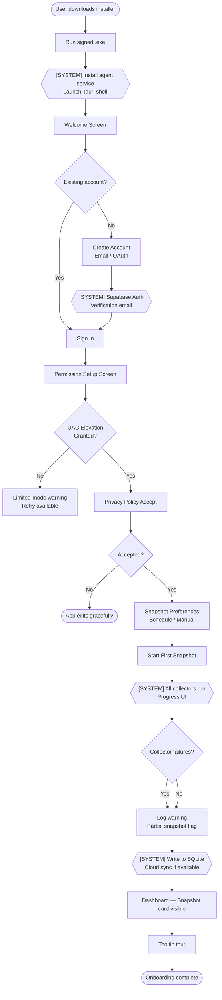

---

## 5. Flow 2 — Creating and Scheduling Snapshots

### Description
An existing user takes an on-demand snapshot and/or modifies the snapshot schedule.

### Steps

1. User opens DeviceLifeline.
2. [DECISION] User wants on-demand snapshot OR schedule change?
   - **On-demand:** → Step 3.
   - **Schedule change:** → Step 8.
3. User navigates to Snapshots section.
4. User clicks "Take Snapshot Now."
5. [DECISION] Previous snapshot taken < 10 min ago?
   - **Yes:** App shows warning "A recent snapshot already exists. Take another?" User confirms.
   - **No:** → Step 6.
6. [SYSTEM] Agent starts capture. Progress UI shown.
7. [SYSTEM] Snapshot stored; cloud sync queued/immediate.
8. For schedule change: User opens Settings > Snapshot Schedule.
9. User sets frequency (hourly / daily / weekly / event-triggered), time window, and battery threshold.
10. [SYSTEM] Agent updates Windows Task Scheduler entry and local config file.
11. Confirmation toast shown.

### Edge Cases
- **EDGE-2A:** User takes snapshot while previous snapshot is still running → Queued; second snapshot starts after first completes.
- **EDGE-2B:** Schedule set to run at a time device is typically off → Agent catches up on next boot (catch-up snapshot).
- **EDGE-2C:** Free-tier user attempts to set schedule to hourly (Pro feature) → Paywall modal shown.

### Flowchart

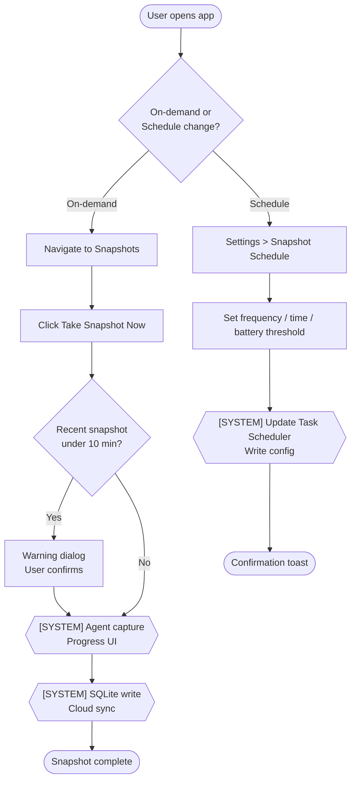

---

## 6. Flow 3 — Exporting a Setup

### Description
A Pro+ user exports their current or historical Device DNA Snapshot as a portable `.dlsetup` file for transfer or backup.

### Steps

1. User navigates to Snapshots.
2. User selects a snapshot (current or historical).
3. User clicks "Export Setup."
4. [DECISION] Tier check — is user Pro or higher?
   - **No (Free):** Paywall modal explaining Pro required. CTA to upgrade.
   - **Yes:** → Step 5.
5. App shows Export Configuration modal:
   - Choose scope: All apps / Developer tools only / Browser extensions only / Custom selection.
   - Toggle: Include system config (startup items, services, power settings).
   - Toggle: Include hardware fingerprint metadata.
   - File name field (pre-filled: `DeviceLifeline_Export_YYYY-MM-DD.dlsetup`).
6. User clicks "Generate Export."
7. [SYSTEM] Agent serializes selected snapshot data to JSON, wraps in `.dlsetup` bundle with manifest and checksum.
8. System file-save dialog opens. User chooses save location.
9. File saved. Confirmation with file size and item count shown.
10. Optional: "Share to Cloud" — uploads `.dlsetup` to Supabase Storage for cross-device access [Pro].

### Edge Cases
- **EDGE-3A:** Large snapshot (1000+ items) — export takes > 5 s → Progress indicator shown.
- **EDGE-3B:** User selects custom scope with zero items → "Nothing selected" validation error before export starts.
- **EDGE-3C:** Disk full → OS error surfaced with plain-English message and suggestion to choose alternate location.

### Flowchart

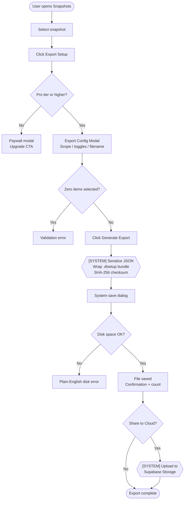

---

## 7. Flow 4 — Restoring a Setup on a New Machine

### Description
A user sets up a new or freshly installed Windows machine and restores their software environment from a `.dlsetup` file or cloud-linked account.

### Steps

1. User installs DeviceLifeline on the new machine.
2. User completes onboarding (Flow 1, skip first snapshot).
3. User navigates to Recovery Center > Restore Setup.
4. [DECISION] Source of setup?
   - **Local file:** User browses for `.dlsetup` file. → Step 5.
   - **Cloud (linked account):** [SYSTEM] Fetches list of cloud-stored setups. User selects. → Step 5.
5. [SYSTEM] App validates `.dlsetup` checksum. If invalid → error shown with option to re-download.
6. App shows Restore Preview: list of all items categorized (WinGet apps, Store apps, browser extensions, dev tools, system config).
7. [DECISION] User reviews and deselects any items they don't want restored.
8. User clicks "Dry Run" (optional but recommended).
9. [SYSTEM] Agent checks WinGet availability, Store availability, package IDs against current registry. Reports estimated success rate.
10. User clicks "Start Restore."
11. [SYSTEM] Agent begins installation sequence:
    - WinGet installs run in parallel (configurable concurrency, default 3).
    - Microsoft Store installs queued.
    - Vendor installer fallbacks triggered for items not in WinGet.
    - Browser extensions noted for manual install (extensions cannot be auto-installed in MVP).
12. Progress UI shows: per-item status (queued / installing / installed / failed / skipped).
13. [ERROR: Individual item failure] Any install failure: logged, skipped, flagged in final report. Restore continues for remaining items.
14. Restore complete. Summary shown: X installed, Y failed, Z skipped.
15. [SYSTEM] Failure report saved to local SQLite. User can export failure list for manual follow-up.
16. [DECISION] Restore system configuration (startup items, power settings)?
    - **Yes:** [SYSTEM] Agent applies config changes; may require reboot.
    - **No:** Skipped.

### Edge Cases
- **EDGE-4A:** WinGet not available on target machine (fresh Windows 10 install without App Installer) → Agent downloads and installs App Installer first, then retries.
- **EDGE-4B:** Incompatible app version (package no longer in WinGet registry) → Attempts latest available version; flags as "version substitution" in report.
- **EDGE-4C:** Restore started with battery below 20% → Warning shown; user can override or wait to plug in.
- **EDGE-4D:** Network drops mid-restore → Agent retries each item up to 3 times with exponential backoff; pauses queue if no network detected; resumes automatically.
- **EDGE-4E:** User cancels mid-restore → Already-installed items remain; partial state flagged in report.

### Flowchart

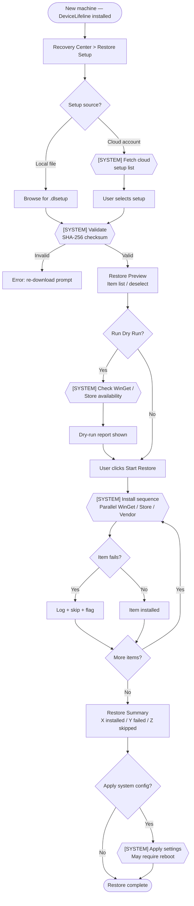

---

## 8. Flow 5 — Browsing the Performance Timeline + Drilling into a Correlation

### Description
A user explores the Performance Timeline to understand historical performance changes and investigates a specific correlated event.

### Steps

1. User opens DeviceLifeline and navigates to Performance Timeline.
2. [SYSTEM] Timeline renders, showing the last 30 days by default (configurable to 90/365).
3. Timeline displays events as swim lanes: Software Changes, Driver/Windows Updates, Performance Metrics, Hardware Events.
4. User scrolls left/right to browse time; zoom controls available (day / week / month).
5. User spots a highlighted correlation marker (e.g., orange dot labeled "Startup +35%").
6. User clicks the correlation marker.
7. Correlation detail panel opens, showing:
   - Event that occurred (e.g., "Docker Desktop 4.28 installed — June 10")
   - Detected performance impact (e.g., "Startup time: 18 s → 24 s; +35%")
   - Confidence score (e.g., 87%)
   - Contributing factors listed
   - Suggested actions ("Disable Docker startup services")
8. User clicks "Ask AI Detective about this" — auto-populates AI Detective query.
9. [DECISION] User clicks "Apply Suggested Fix"?
   - **Yes:** Flow transitions to Recovery Center (Flow 9).
   - **No:** User closes panel and continues browsing.

### Edge Cases
- **EDGE-5A:** No performance data collected yet (first 24 hours) → Timeline shows empty state with explanation.
- **EDGE-5B:** Correlation confidence below 40% → Shown with "Low confidence" badge; AI Detective recommended.
- **EDGE-5C:** User filters timeline to a single event type → Other swim lanes hidden; filter chip shown with clear option.

### Flowchart

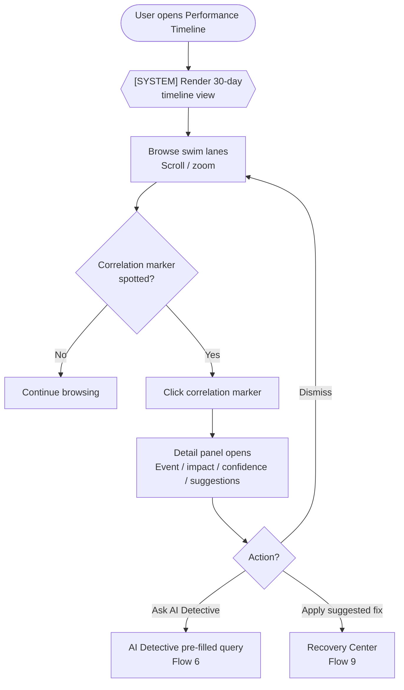

---

## 9. Flow 6 — Asking the AI Detective

### Description
A user submits a natural-language question to the AI Detective and reviews the diagnostic response.

### Steps

1. User navigates to AI Detective (sidebar or Dashboard widget).
2. User types a question (e.g., "Why has my PC been slow since last Tuesday?").
3. [DECISION] Is user on Pro tier?
   - **No (Free):** Shows paywall after first query limit (1 free query/month in MVP).
   - **Yes:** → Step 4.
4. User submits query.
5. [SYSTEM] Client pre-processes query: extracts device context from local SQLite (timeline events, health metrics, recent snapshots) — no raw personal file data included.
6. [SYSTEM] Summarized context + user query sent to Supabase Edge Function (AI orchestration layer).
7. [SYSTEM] Edge Function calls OpenAI/Anthropic API; streams response back.
8. App displays streaming response in Detective panel:
   - Summary of likely cause(s)
   - Supporting evidence with timeline references
   - Confidence score per hypothesis
   - Suggested actions (clickable: "Apply fix," "View in Timeline," "Show me more")
9. User clicks a suggestion or dismisses.
10. [SYSTEM] PostHog event `ai_detective_query_submitted` and `ai_detective_response_rated` (after rating widget interaction).

### Edge Cases
- **EDGE-6A:** AI API timeout (> 20 s) → Graceful timeout message; option to retry or rephrase.
- **EDGE-6B:** No relevant timeline data (new install) → AI Detective explains it needs more history; suggests waiting 7 days.
- **EDGE-6C:** User query contains personal/sensitive text → Edge Function strips PII tokens before API call (server-side).
- **EDGE-6D:** Offline → "AI Detective requires an internet connection" notice with last cached result shown if available.

### Flowchart

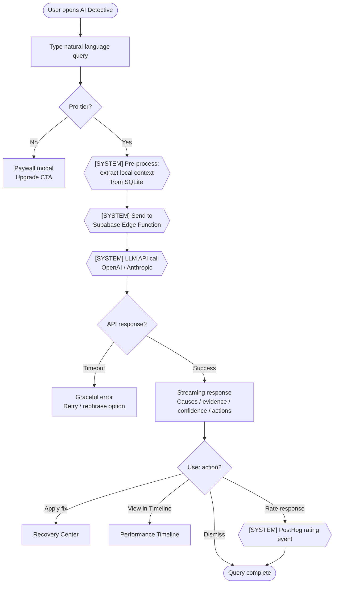

---

## 10. Flow 7 — Receiving and Acting on a Health Alert

### Description
The system detects a health anomaly (e.g., SSD health degrading) and surfaces an actionable alert to the user.

### Steps

1. [SYSTEM] Health Intelligence agent collector runs on schedule (every 15 min for hardware health in MVP).
2. [SYSTEM] SSD health score drops below threshold (e.g., SMART attribute crossing warning level).
3. [SYSTEM] Supabase Edge Function evaluates threshold rules → generates alert record.
4. [SYSTEM] Push notification delivered via Windows notification center: "SSD Health Warning — Action recommended."
5. User clicks notification → DeviceLifeline opens to Health Intelligence section.
6. Alert card shown: device name, metric, current value, threshold, severity (Warning / Critical), plain-English explanation.
7. User reads explanation (e.g., "Your SSD has 87% total bytes written. Typical lifespan is 90%–95%. Consider backing up soon.").
8. User clicks "What should I do?" → AI Detective pre-populated with context.
9. [DECISION] User takes action?
   - **Acknowledge:** Alert marked as acknowledged; will resurface at next threshold breach.
   - **Dismiss (7 days):** Snoozed; resurfaces in 7 days.
   - **Act:** User follows recommended steps (backup, replacement checklist).
10. [SYSTEM] Alert status logged to SQLite and synced to Supabase.

### Edge Cases
- **EDGE-7A:** Notification disabled by user (Windows notification settings) → In-app badge on Health tile.
- **EDGE-7B:** Multiple simultaneous alerts → Grouped notification; alert center shows list.
- **EDGE-7C:** Alert triggered on a device not connected to cloud → Alert stored locally; syncs on reconnect.

### Flowchart

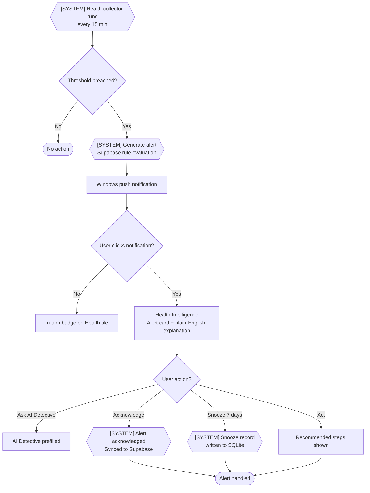

---

## 11. Flow 8 — Viewing a Crash Explanation

### Description
After a crash or BSOD, the user reviews a plain-English explanation generated by Crash Intelligence.

### Steps

1. [SYSTEM] Windows Event Viewer / BSOD dump detected by agent (event watcher on Windows event log channels).
2. [SYSTEM] Crash Intelligence collector parses crash data: event ID, driver faulting module, stop code, memory dump summary.
3. [SYSTEM] Crash record stored in SQLite; cloud sync queued.
4. [SYSTEM] In-app notification: "A crash was detected. See your Crash Report."
5. User opens DeviceLifeline → navigates to Crash Intelligence.
6. Crash list shown (most recent first): timestamp, crash type (BSOD / App Crash / Driver Fault), severity.
7. User selects a crash event.
8. Crash detail view shows:
   - Plain-English summary: "Your PC crashed because of a faulty driver: NVIDIA Display Driver (nvlddmkm.sys). This driver is known to cause BSOD on Windows 11 with driver version 540.x."
   - Technical detail accordion (for power users): stop code, faulting address, call stack summary.
   - Correlated timeline events (e.g., "Driver updated 2 days before first crash").
   - Recommended actions: "Update NVIDIA driver" / "Roll back driver."
9. User clicks recommended action → Recovery Center (Flow 9) or external link to driver download.

### Edge Cases
- **EDGE-8A:** No crash dumps found (dump writing disabled in Windows) → Crash Intelligence shows "No crash data available" with link to enable memory dump via Settings.
- **EDGE-8B:** Crash cause unknown (driver data insufficient) → "Cause could not be determined. Contact DeviceLifeline support" with option to submit anonymized report.
- **EDGE-8C:** Multiple crashes same cause → Grouped under "Recurring issue" banner.

### Flowchart

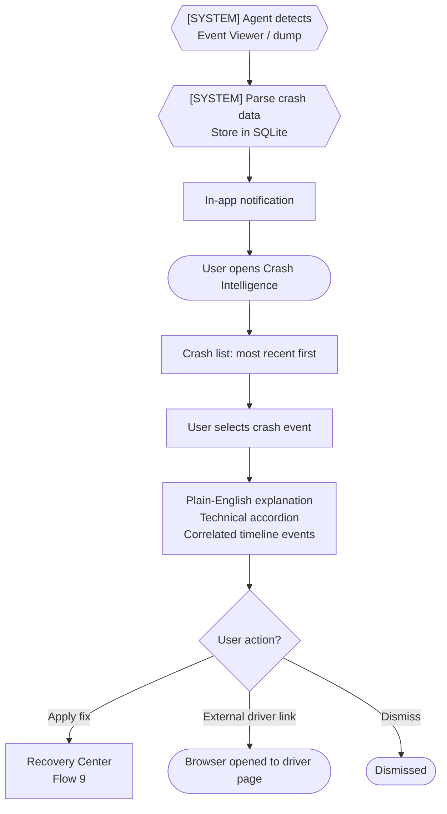

---

## 12. Flow 9 — Recovery / Rollback

### Description
A user restores a previous system configuration or rolls back a specific change identified as problematic.

### Steps

1. User navigates to Recovery Center (or arrives from Timeline / Crash Intelligence suggested action).
2. Recovery Center shows:
   - Restore a full Setup (Flow 4).
   - Roll back a specific change (e.g., undo a driver update, remove a software install).
   - Restore system configuration (startup items, services, power settings).
3. [DECISION] User selects rollback type:
   - **Software uninstall:** WinGet uninstall or Windows uninstall API called.
   - **Driver rollback:** Windows Device Manager driver rollback triggered.
   - **System config restore:** Previous config snapshot applied.
4. User reviews proposed changes.
5. User clicks "Preview Changes."
6. [SYSTEM] Agent computes diff between current state and target state.
7. User clicks "Apply Rollback."
8. [SYSTEM] Agent applies changes. Progress shown.
9. [DECISION] Reboot required?
   - **Yes:** User prompted to reboot. Post-reboot verification run automatically.
   - **No:** Changes confirmed immediately.
10. Rollback recorded as a Timeline event: "Rollback applied — Docker Desktop removed — June 15."

### Edge Cases
- **EDGE-9A:** Driver rollback not available (only one version installed) → Message shown; manual download link provided.
- **EDGE-9B:** Rollback causes cascade dependency conflict → Agent lists conflicts; user must resolve or abort.
- **EDGE-9C:** Rollback interrupted by crash → Next agent startup detects incomplete rollback; offers resume or abort.

### Flowchart

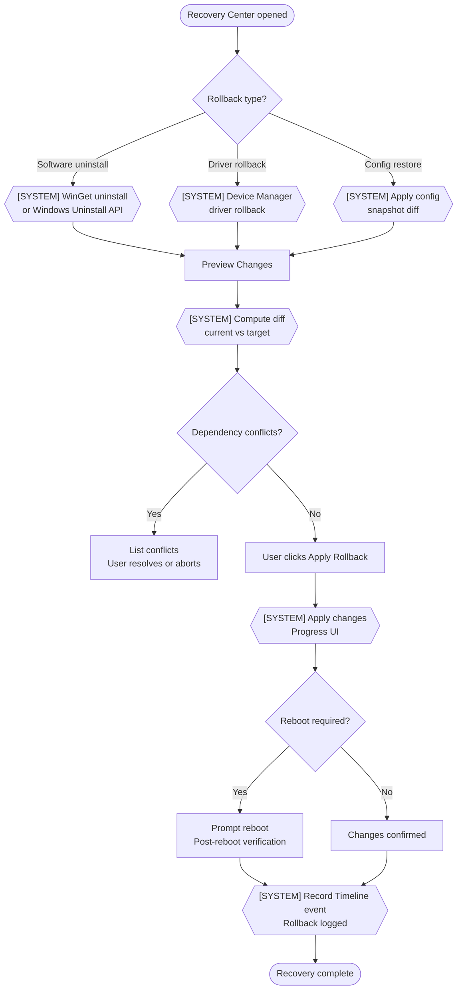

---

## 13. Flow 10 — Upgrading / Subscribing (Stripe / Paystack)

### Description
A Free-tier user upgrades to Pro (or higher) through the in-app paywall.

### Steps

1. User hits a paywall (e.g., clicks Export Setup, Schedule Snapshot, or AI Detective over limit).
2. Paywall modal displayed: explains what they're missing, lists Pro features, shows pricing.
3. User clicks "Upgrade to Pro."
4. [DECISION] User's billing region?
   - **Africa / Paystack region:** Paystack checkout flow.
   - **All other regions:** Stripe checkout flow.
5. In-app web view or redirect opens to hosted checkout page:
   - Stripe: Stripe Checkout (hosted, PCI-compliant).
   - Paystack: Paystack Checkout (hosted).
6. User enters payment details, reviews plan, clicks "Subscribe."
7. [SYSTEM] Payment provider processes payment.
8. [DECISION] Payment successful?
   - **Yes:** → Step 9.
   - **Failed:** Error returned to user (card declined, etc.); retry or use different method.
9. [SYSTEM] Webhook received by Supabase Edge Function (Stripe `checkout.session.completed` or Paystack `subscription.create`).
10. [SYSTEM] User entitlement updated in Supabase (`subscription_tier = 'pro'`; `valid_until` set).
11. [SYSTEM] Tauri app receives real-time entitlement update via Supabase Realtime channel.
12. App UI unlocks Pro features immediately. Success banner shown: "Welcome to Pro!"
13. [SYSTEM] PostHog event `subscription_started` fired with tier and payment_provider properties.

### Edge Cases
- **EDGE-10A:** Webhook delivery fails → Supabase retry with exponential backoff (up to 24 h); user can manually trigger entitlement refresh from Settings > Account.
- **EDGE-10B:** User cancels before payment → Checkout closed; free tier remains. No charge.
- **EDGE-10C:** Subscription lapses (payment failure) → User notified by email; 7-day grace period; Pro features still active; after grace period, features locked (data preserved).
- **EDGE-10D:** User on Business tier managed by employer → Personal subscription not available; directed to IT contact.

### Flowchart

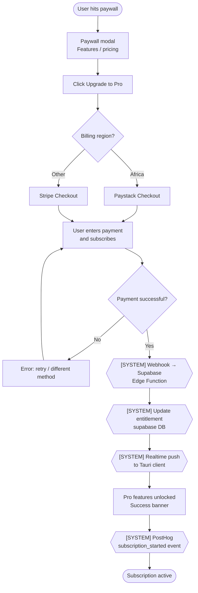

---

## Diagrams

The primary diagrams appear inline with each flow above. The overview below maps flows to product sections:

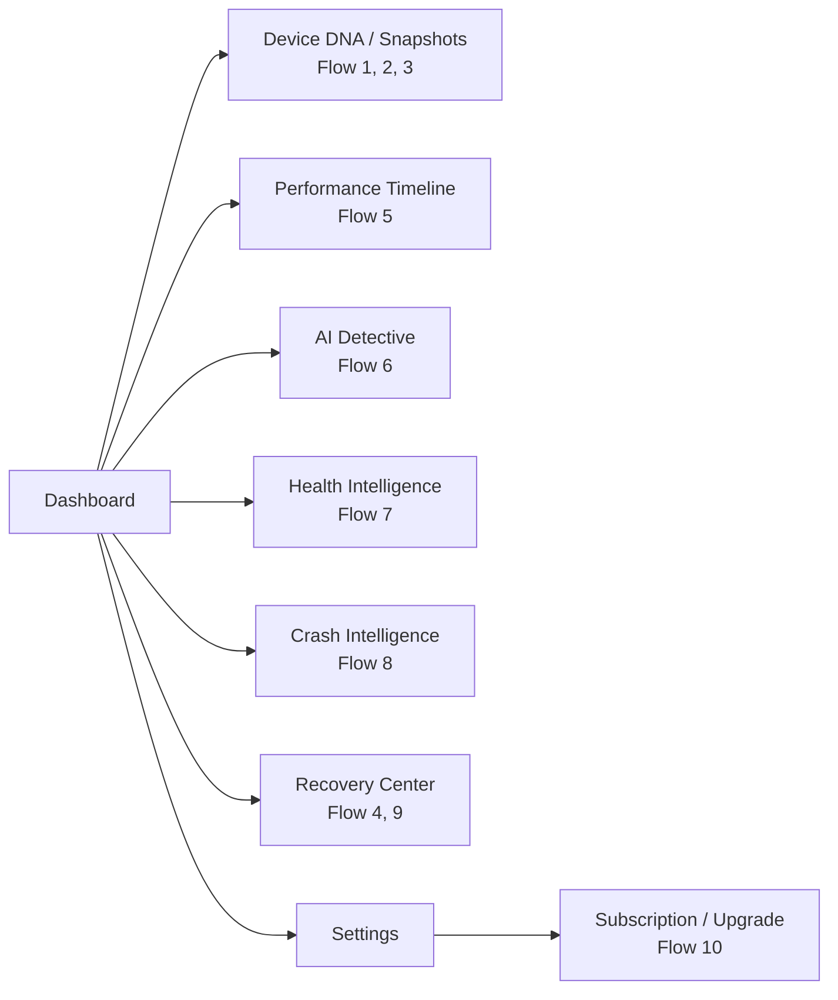

---

## Risks & Mitigations

| Risk | Likelihood | Impact | Mitigation |
|------|-----------|--------|------------|
| WinGet package unavailability causes restore failures > 5% | Medium | High | Maintain fallback to vendor installer URLs in snapshot manifest; display clear failure report |
| AI Detective response latency degrades onboarding perception | Medium | Medium | Show progress indicator; stream tokens; set 20 s hard timeout |
| Paywall friction causes early churn before value demonstrated | Medium | High | Ensure meaningful free-tier experience; offer 14-day Pro trial on signup |
| Stripe/Paystack webhook failures leave users in wrong entitlement state | Low | High | Manual entitlement refresh in Settings; webhook retry mechanism; support override |
| UAC denial during onboarding leaves agent non-functional | Medium | High | Clear explanation of why UAC needed; retry prompt; link to Help documentation |
| Crash Intelligence misidentifies cause → user takes wrong action | Medium | Medium | Confidence score always shown; "Report incorrect diagnosis" feedback option |

---

## Future Considerations

- **FC-01:** Restore flow to support macOS Homebrew and Linux apt/dnf package managers [Post-MVP, Phase 3/4].
- **FC-02:** AI Detective to support follow-up conversational queries (multi-turn) rather than single-shot [Post-MVP].
- **FC-03:** Fleet-level restore flow for Business Edition: IT admin triggers restore on multiple devices simultaneously [Post-MVP].
- **FC-04:** Browser extension auto-installation via browser extension API (Chrome/Firefox policy deploy) rather than manual prompting [Post-MVP].
- **FC-05:** Subscription flow to support team billing and seat management for Business Edition [Post-MVP].
- **FC-06:** Mobile companion app flows (view alerts, read crash reports) [Post-MVP — see 59. Future Mobile App Strategy](59-future-mobile-app-strategy.md)].

---

## Acceptance Criteria

- [ ] AC-08-01: All 10 primary flows are documented with numbered steps, Mermaid flowchart, and at least 3 edge cases each.
- [ ] AC-08-02: Every flow identifies the tier gate (Free / Pro / Developer / etc.) at the decision point where the paywall applies.
- [ ] AC-08-03: Every `[SYSTEM]` step in every flow maps to a corresponding functional requirement in [06. Functional Requirements](06-functional-requirements.md).
- [ ] AC-08-04: All Mermaid flowcharts render without syntax errors on GitHub.
- [ ] AC-08-05: Offline behavior is explicitly documented in every flow where network connectivity is relevant.
- [ ] AC-08-06: The restore flow (Flow 4) covers WinGet fallback, battery check, and network interruption edge cases.
- [ ] AC-08-07: The subscription flow (Flow 10) covers both Stripe and Paystack paths and the webhook failure edge case.
- [ ] AC-08-08: UX designer and engineering lead have reviewed and signed off on all flows before Sprint 1 begins.
