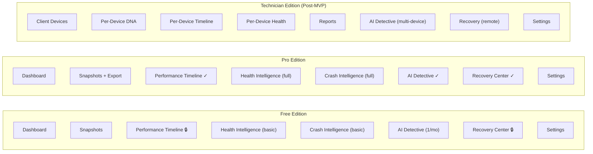

# 09. Information Architecture

> Defines the app sitemap, navigation model, screen hierarchy, content/object taxonomy, labeling conventions, and edition-specific IA variations for DeviceLifeline. Part of the DeviceLifeline documentation suite — see [Documentation Index](README.md).

**Status:** Draft v1 · **Authoring role:** Senior UX Designer + Principal Software Architect · **Last updated:** 2026-06-07
**Related:** [08. User Flows](08-user-flows.md), [10. Feature Breakdown Structure](10-feature-breakdown-structure.md), [11. MVP Definition](11-mvp-definition.md), [50. UI/UX Specification](50-ui-ux-specification.md), [51. Wireframe Documentation](51-wireframe-documentation.md), [52. Component Library](52-component-library-specification.md)

---

## 1. Purpose & Scope

This document defines:
- The complete application sitemap (all navigable screens/views)
- Primary and secondary navigation models
- Screen hierarchy and parent–child relationships
- The content/object taxonomy (canonical names and definitions for all data objects)
- Labeling and naming conventions
- How IA differs across product editions (Free, Pro, Developer, Technician, Business)

Scope covers the Tauri desktop application. The Supabase cloud console (admin/ops tooling) and any future mobile app are out of scope.

---

## 2. Assumptions

- A1: Navigation is persistent left sidebar (primary) + top bar (context/account) in all editions.
- A2: All screens within a section share the section's URL-fragment-style routing within Tauri's React SPA.
- A3: Edition gating is applied at the navigation item level (items hidden or locked with upgrade prompt, not absent from DOM).
- A4: Screen names used here are the canonical labels that must appear verbatim in UI (see Section 6).
- A5: "View" and "Screen" are used interchangeably in this document; a "Panel" is a secondary pane within a screen.
- A6: Technician Edition and Business Edition replace, rather than extend, certain navigation areas with edition-specific views.

---

## 3. Primary Navigation Model

DeviceLifeline uses a **persistent left sidebar** with icon + label navigation, always visible. The top bar provides device/account context, notifications, and global search.

### 3.1 Sidebar Sections (MVP)

| Order | Section Label | Icon | Available To | Notes |
|-------|--------------|------|-------------|-------|
| 1 | Dashboard | Grid | All tiers | Home; summary widgets |
| 2 | Snapshots | Camera | All tiers | Snapshot list and management |
| 3 | Performance Timeline | Activity | Pro+ | Locked for Free (upgrade prompt) |
| 4 | Health Intelligence | Heart | All tiers (basic) / Pro+ (full) | Basic score free; full history Pro |
| 5 | Crash Intelligence | Alert Triangle | All tiers (basic) | Basic event list free |
| 6 | AI Detective | Sparkle/Wand | Pro+ (1 free/month) | Paywall after free quota |
| 7 | Recovery Center | Refresh/Shield | Pro+ | Free: view only; Pro: execute |
| 8 | Settings | Gear | All tiers | |

### 3.2 Top Bar Elements

| Element | Description |
|---------|-------------|
| Device selector | Dropdown: current active device (supports multi-device in Pro+) |
| Notification bell | Alert badge + popover list of unread alerts |
| Account avatar | Opens Account panel (profile, subscription, sign-out) |
| Global search | Command-K search across snapshots, events, AI queries |

### 3.3 Secondary Navigation (within sections)

Each top-level section has its own sub-navigation (tabs or in-page links). Defined in Section 4 (Screen Hierarchy).

---

## 4. Screen Hierarchy

```
DeviceLifeline Desktop App
├── Dashboard (Home)
│   ├── Summary widgets: Last Snapshot, Health Score, Recent Alerts, Quick Actions
│   └── Activity Feed (recent system events)
│
├── Snapshots
│   ├── Snapshot List (default sub-view)
│   │   ├── Snapshot Detail (per-snapshot full view)
│   │   │   ├── Software Inventory tab
│   │   │   ├── System Configuration tab
│   │   │   ├── Browser Environment tab
│   │   │   ├── Developer Environment tab
│   │   │   └── Hardware Fingerprint tab
│   │   └── Snapshot Diff View (compare two snapshots)
│   └── Export Setup (modal/drawer over Snapshot List)
│
├── Performance Timeline [Pro+]
│   ├── Timeline View (default: 30-day swim lanes)
│   │   ├── Correlation Detail Panel (side panel on marker click)
│   │   └── Event Filter Panel
│   └── Timeline Settings (zoom, visible lanes, date range)
│
├── Health Intelligence
│   ├── Overview (Health Scores: CPU, RAM, SSD, GPU, Battery, Network)
│   ├── Metric Detail (per-metric history chart)
│   │   └── Alert History Panel
│   └── Alert Center (all alerts list, acknowledge/snooze)
│
├── Crash Intelligence
│   ├── Crash List (all crashes, most-recent first)
│   │   └── Crash Detail View
│   │       ├── Plain-English Explanation panel
│   │       ├── Technical Details accordion
│   │       └── Correlated Timeline Events panel
│   └── Crash Settings (dump path, reporting preferences)
│
├── AI Detective [Pro+; 1 free query/month]
│   ├── Query Interface (input + streaming response)
│   ├── Query History (past queries + responses)
│   └── Context Viewer (what data was sent for this query)
│
├── Recovery Center [Pro+]
│   ├── Restore Setup (from file or cloud)
│   │   ├── Setup Source Selection
│   │   ├── Restore Preview (item list + deselect)
│   │   ├── Dry Run Results
│   │   └── Restore Progress + Summary
│   ├── Rollback (change-specific)
│   │   ├── Rollback Target Selection
│   │   ├── Rollback Preview
│   │   └── Rollback Progress
│   └── Restore History (past restores/rollbacks)
│
└── Settings
    ├── Account (profile, subscription, billing, sign-out)
    ├── Agent (permissions, service status, collectors)
    ├── Snapshot Schedule (frequency, time, battery threshold)
    ├── Cloud Sync (enable/disable, conflict resolution)
    ├── Notifications (alert thresholds, push preferences)
    ├── Privacy & Telemetry (opt-in/out, data deletion)
    ├── Appearance (theme: light/dark/system, font size)
    └── About (version, licenses, update check)
```

---

## 5. Edition-Specific IA Variations

### 5.1 Free Edition

- Performance Timeline: visible in sidebar but locked; shows upgrade modal on click.
- AI Detective: accessible; shows 1-query-per-month badge; paywall after quota.
- Recovery Center: visible; Restore Setup and Rollback disabled (Pro required); Restore History shows past restores from before downgrade.
- Health Intelligence: basic health scores and current metrics free; historical charts and alert management Pro.

### 5.2 Pro Edition

Full MVP IA as described above. Multi-device support: device selector in top bar shows all linked devices.

### 5.3 Developer Edition [Post-MVP]

Adds to Pro IA:
- **Workspace Templates** section (under Snapshots or as top-level item)
  - Template Library
  - Create Template
  - Apply Template
- **Dev Environment** sub-tab in Snapshot Detail (expanded: SDK versions, package manager configs, shell profiles)

### 5.4 Technician Edition [Post-MVP]

Replaces single-device model with a multi-device diagnostic workspace:
- **Client Devices** (replaces Device Selector) — full device list with search/filter
  - Device Profile (per-device version of all standard sections)
  - Diagnostic Report Generator
  - Remote Snapshot Request
- **Reports** (new top-level section)
  - Report List
  - Report Builder
  - Report Preview / Export
- Recovery Center: enhanced with remote-apply capability

### 5.5 Business Edition [Post-MVP]

Fleet-management overlay on top of Technician IA:
- **Fleet Dashboard** (replaces Dashboard as default landing)
  - Fleet Health Overview (aggregate scores)
  - Compliance Status (software standards)
  - Onboarding Queue
- **Policies** (new top-level section)
  - Policy List
  - Policy Builder (required/optional software + config rules)
  - Compliance Report
- **Devices** (renamed from Client Devices; includes bulk actions)
- Settings: adds **Organization** tab (team members, roles, SSO configuration)

---

## 6. Content / Object Taxonomy

These are the canonical data objects in DeviceLifeline. Names must be used consistently across UI, docs, API, and database. All IDs are snake_case in code; display labels are Title Case.

| Object | Canonical Name | Definition | Created By |
|--------|---------------|------------|-----------|
| Snapshot | Device DNA Snapshot | A complete point-in-time record of a device's software, hardware, and configuration state | Rust agent (scheduled or on-demand) |
| Snapshot Item | Snapshot Item | A single entry within a Device DNA Snapshot (e.g., one installed application) | Part of snapshot capture |
| Timeline Event | Timeline Event | A discrete occurrence recorded in the Performance Timeline (install, update, metric spike, etc.) | Rust agent event watchers |
| Correlation | Correlation | A detected causal link between a Timeline Event and a performance or health change, with a confidence score | On-device correlation engine |
| Health Metric | Health Metric | A single measured value for a device subsystem (CPU temperature, SSD SMART attribute, etc.) | Health Intelligence collectors |
| Health Score | Health Score | An aggregate 0–100 score for a device subsystem computed from Health Metrics | Health Intelligence scoring engine |
| Alert | Health Alert | A user-facing notification triggered when a Health Metric or Health Score crosses a threshold | Alert engine (cloud-side) |
| Crash Event | Crash Event | A recorded system or application crash parsed from Windows Event Log or memory dump | Crash Intelligence collector |
| AI Query | Detective Query | A user-submitted natural-language question submitted to AI Detective | User |
| AI Response | Detective Response | The AI-generated diagnostic response to a Detective Query | AI orchestration (Supabase Edge Function + LLM) |
| Setup Export | Setup File | A portable `.dlsetup` bundle containing a serialized Device DNA Snapshot scope for restore | Export engine |
| Restore Job | Restore Job | A record of a setup restore or rollback operation, including status and per-item results | Restore engine |
| Device | Device | A registered computer with DeviceLifeline installed, linked to a user account | Account registration |
| Environment | Environment | A named developer workspace template capturing language runtimes, tools, and configs [Post-MVP] | Developer Edition |
| Policy | Policy | A Business Edition rule set defining required/optional software and config standards [Post-MVP] | Business Edition admin |
| Report | Diagnostic Report | A structured export of device history and health findings for Technician Edition [Post-MVP] | Technician Edition |

---

## 7. Labeling and Naming Conventions

### 7.1 Screen and Section Labels

| Rule | Example |
|------|---------|
| Top-level nav items: Title Case, noun or noun phrase | "Performance Timeline", "Health Intelligence", "AI Detective" |
| Sub-navigation tabs: Title Case | "Software Inventory", "System Configuration" |
| Action buttons: Verb + noun (imperative) | "Take Snapshot", "Export Setup", "Start Restore" |
| Destructive actions: explicit verb | "Delete Snapshot", "Remove Device" |
| Status badges: Sentence case | "In progress", "Completed", "Failed" |
| Confirmation dialogs: plain English with consequence stated | "Delete this snapshot? This cannot be undone." |

### 7.2 Data Object Display Names

| Object | List View Label | Detail View Title |
|--------|----------------|------------------|
| Device DNA Snapshot | "Snapshot — [Date]" | "Device DNA Snapshot — [Device] — [Date]" |
| Timeline Event | "[Event type] — [Date]" | "[Full event description]" |
| Health Alert | "[Severity]: [Metric]" | "[Metric] Alert — [Device]" |
| Crash Event | "[Crash type] — [Date]" | "Crash Report — [Date]" |
| Restore Job | "Restore — [Date]" | "Restore Job — [Source Setup] — [Status]" |

### 7.3 Prohibited Terms (use canonical alternatives)

| Avoid | Use instead |
|-------|------------|
| "Backup" | "Device DNA Snapshot" or "Export" |
| "Sync" (for snapshots) | "Upload" or "Cloud sync" |
| "Delete" for snapshots | "Archive" (snapshots are immutable) |
| "Machine" | "Device" |
| "PC" in UI copy | "Device" (portability-friendly) |
| "AI" alone | "AI Detective" (in product context) |

---

## 8. Navigation Patterns

### 8.1 Deep Linking

Every screen supports deep-linkable routes within the Tauri SPA (hash router or memory router). Routes follow the pattern:

```
/dashboard
/snapshots
/snapshots/:snapshotId
/snapshots/:snapshotId/diff/:compareId
/timeline
/timeline?date=2026-05-01&zoom=week
/health
/health/:metricType
/crashes
/crashes/:crashId
/detective
/detective/:queryId
/recovery
/recovery/restore
/recovery/rollback/:eventId
/settings/:tab
```

### 8.2 Contextual Actions

Each object in a list view supports a contextual action menu (right-click or kebab icon):
- Device DNA Snapshot: View, Export Setup, Compare with..., Archive
- Timeline Event: View Detail, Ask AI Detective, Mark as False Positive
- Health Alert: Acknowledge, Snooze, Ask AI Detective
- Crash Event: View Detail, Ask AI Detective, Dismiss

### 8.3 Cross-Section Navigation Patterns

| From | To | Trigger |
|------|----|---------|
| Timeline Correlation Marker | AI Detective (pre-filled) | "Ask AI Detective" button in detail panel |
| Health Alert | Health Metric Detail | "View metric history" link |
| Crash Event Detail | Performance Timeline | "View correlated events" link |
| Crash Event / Health Alert | Recovery Center | "Apply recommended fix" button |
| Any paywall | Settings > Account > Subscription | Upgrade CTA button |

---

## Diagrams

### Full Navigation Tree

```mermaid
graph TD
    APP["DeviceLifeline App"]

    APP --> DASH["Dashboard"]
    APP --> SNAP["Snapshots"]
    APP --> TL["Performance Timeline\n[Pro+]"]
    APP --> HI["Health Intelligence"]
    APP --> CI["Crash Intelligence"]
    APP --> AI["AI Detective\n[Pro+]"]
    APP --> RC["Recovery Center\n[Pro+]"]
    APP --> SET["Settings"]

    DASH --> DW1["Last Snapshot Widget"]
    DASH --> DW2["Health Score Widget"]
    DASH --> DW3["Recent Alerts Widget"]
    DASH --> DW4["Activity Feed"]

    SNAP --> SL["Snapshot List"]
    SNAP --> EXP["Export Setup"]
    SL --> SD["Snapshot Detail"]
    SD --> SI["Software Inventory Tab"]
    SD --> SC["System Config Tab"]
    SD --> BE["Browser Environment Tab"]
    SD --> DE["Dev Environment Tab"]
    SD --> HF["Hardware Fingerprint Tab"]
    SL --> DIFF["Snapshot Diff View"]

    TL --> TV["Timeline View"]
    TL --> TS["Timeline Settings"]
    TV --> CDP["Correlation Detail Panel"]
    TV --> EFP["Event Filter Panel"]

    HI --> HOV["Health Overview"]
    HI --> HMD["Metric Detail"]
    HI --> HAC["Alert Center"]
    HMD --> AHP["Alert History Panel"]

    CI --> CL["Crash List"]
    CI --> CRS["Crash Settings"]
    CL --> CDV["Crash Detail View"]
    CDV --> CEX["Explanation Panel"]
    CDV --> CTD["Technical Details"]
    CDV --> CCE["Correlated Events Panel"]

    AI --> QI["Query Interface"]
    AI --> QH["Query History"]
    AI --> CXV["Context Viewer"]

    RC --> RST["Restore Setup"]
    RC --> RB["Rollback"]
    RC --> RH["Restore History"]
    RST --> SS["Source Selection"]
    RST --> RP["Restore Preview"]
    RST --> DR["Dry Run Results"]
    RST --> RPG["Restore Progress"]

    SET --> SA["Account"]
    SET --> SAG["Agent"]
    SET --> SSC["Snapshot Schedule"]
    SET --> SCS["Cloud Sync"]
    SET --> SN["Notifications"]
    SET --> SPT["Privacy & Telemetry"]
    SET --> SAP["Appearance"]
    SET --> SAB["About"]
```



### Edition IA Comparison



---

## Risks & Mitigations

| Risk | Likelihood | Impact | Mitigation |
|------|-----------|--------|------------|
| Navigation labels inconsistent across docs/code, causing developer confusion | High | Medium | Canonical label table (Section 6) enforced in code review; linter for UI string keys |
| Edition gating implemented as hidden DOM elements, leaking locked feature details | Medium | Low | Use `hidden` + `aria-hidden` consistently; conduct security review of JS bundles |
| Deep-link routes change between releases, breaking shared links | Medium | Medium | Version routes; implement redirect mapping for changed routes |
| Technician/Business edition IA overwhelming for consumer users who receive wrong build | Low | Medium | Edition determined at build/runtime from subscription tier; never shown wrong IA |
| Information overload on Dashboard for power users with many alerts | Medium | Medium | Dashboard widgets are dismissable/configurable; user can pin preferred widgets |

---

## Future Considerations

- **FC-01:** Web dashboard for Business Edition admins (browser-based, not Tauri) with its own IA — separate spec needed [Post-MVP].
- **FC-02:** Mobile companion app IA (simplified view of health, alerts, and snapshots) [Post-MVP — see 59. Future Mobile App Strategy](59-future-mobile-app-strategy.md)].
- **FC-03:** Command palette (Command-K) should evolve to support natural-language navigation ("Take me to my last snapshot from June") [Post-MVP].
- **FC-04:** Personalized Dashboard with AI-suggested widgets based on usage patterns [Post-MVP].
- **FC-05:** macOS/Linux editions will require OS-specific IA adaptations (e.g., Homebrew environment in Developer Edition) [Post-MVP].

---

## Acceptance Criteria

- [ ] AC-09-01: Every screen in the hierarchy table has a corresponding entry in [51. Wireframe Documentation](51-wireframe-documentation.md).
- [ ] AC-09-02: Every canonical object name in Section 6 is used verbatim in the UI string resource file (no synonyms).
- [ ] AC-09-03: Deep-link route table in Section 8.1 is implemented and tested in Tauri router configuration.
- [ ] AC-09-04: Edition-gating matrix (Section 5) is verified against [14. Subscription Plans](14-subscription-plans.md) with no discrepancies.
- [ ] AC-09-05: Navigation tree Mermaid diagram renders correctly on GitHub and matches the implemented sidebar.
- [ ] AC-09-06: Prohibited terms list (Section 7.3) is added to UI copy review checklist and enforced before launch.
- [ ] AC-09-07: Technician and Business edition IA variations reviewed by respective persona representatives before post-MVP implementation.
- [ ] AC-09-08: Contextual action menus (Section 8.2) are fully enumerated in [52. Component Library](52-component-library-specification.md).
