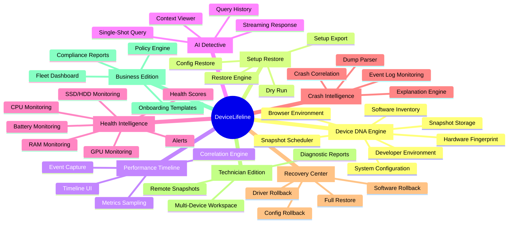
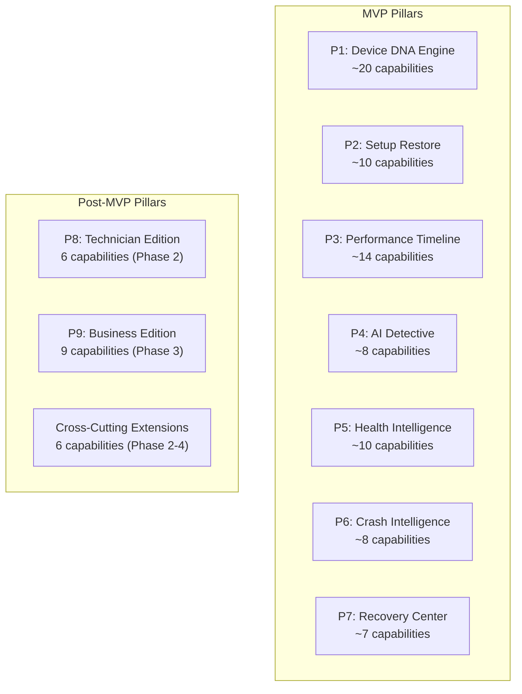
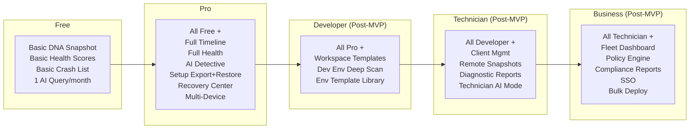

# 10. Feature Breakdown Structure

> Hierarchical decomposition of all DeviceLifeline product capabilities across 9 pillars, from pillar to feature to sub-feature to capability, with MVP/post-MVP tagging and edition assignments. Part of the DeviceLifeline documentation suite — see [Documentation Index](README.md).

**Status:** Draft v1 · **Authoring role:** Senior Product Manager + Principal Software Architect · **Last updated:** 2026-06-07
**Related:** [06. Functional Requirements](06-functional-requirements.md), [09. Information Architecture](09-information-architecture.md), [11. MVP Definition](11-mvp-definition.md), [12. Product Roadmap](12-product-roadmap.md), [14. Subscription Plans](14-subscription-plans.md)

---

## 1. Purpose & Scope

This document provides the complete Feature Breakdown Structure (FBS) for DeviceLifeline — a hierarchical decomposition of all product capabilities from the nine strategic pillars down to individual implementation-level capabilities. It serves as the master feature registry for product management, sprint planning, and roadmap communication.

Each feature entry carries:
- A stable feature ID (`FBS-P#-F##`)
- Phase tag (`MVP` or `Post-MVP + phase`)
- Edition tag (which subscription tier unlocks it)
- Brief description

---

## 2. Assumptions

- A1: "MVP" means V1 launch scope. All MVP features must be shippable in Phase 1.
- A2: Post-MVP features are tagged with the phase in which they are planned (Phase 2–5).
- A3: "All" in the Edition column means available to all tiers (Free through Business).
- A4: Features tagged "Pro+" are available to Pro, Developer, Technician, and Business.
- A5: Features tagged "Developer+" are available to Developer, Technician, and Business editions.
- A6: "Technician+" means Technician and Business editions only.
- A7: The FBS is additive — higher tiers include all lower-tier features.

---

## 3. Pillar Summary

| Pillar # | Pillar Name | MVP? | Description |
|----------|------------|------|-------------|
| P1 | Device DNA Engine | Yes | Complete machine snapshot capture |
| P2 | One-Click Setup Restore | Yes | Recreate a setup on any machine |
| P3 | Performance Timeline | Yes (basic) | Historical change + performance correlation |
| P4 | AI Detective | Yes (basic) | Natural-language troubleshooting |
| P5 | Health Intelligence | Yes (basic) | Hardware + system health monitoring |
| P6 | Crash Intelligence | Yes (basic) | Crash and BSOD parsing + explanation |
| P7 | Recovery Center | Yes (basic) | Configuration restore + rollback |
| P8 | Technician Edition | No (Phase 2) | Professional diagnostic toolkit |
| P9 | Business Edition | No (Phase 3) | Fleet management + compliance |

---

## 4. Pillar 1 — Device DNA Engine

The core capture engine that produces Device DNA Snapshots.

| Feature ID | Feature | Sub-Feature / Capability | Phase | Edition |
|-----------|---------|--------------------------|-------|---------|
| FBS-P1-F01 | Software Inventory Collector | Enumerate all installed Win32 applications via registry + WMI | MVP | All |
| FBS-P1-F01 | Software Inventory Collector | Enumerate Microsoft Store apps via PackageManager API | MVP | All |
| FBS-P1-F01 | Software Inventory Collector | Detect WinGet-managed packages | MVP | All |
| FBS-P1-F01 | Software Inventory Collector | Record version, publisher, install date, install source per item | MVP | All |
| FBS-P1-F02 | System Configuration Collector | Capture startup items (Task Scheduler, registry Run keys, service auto-starts) | MVP | All |
| FBS-P1-F02 | System Configuration Collector | Capture Windows services (name, display name, start type, state) | MVP | All |
| FBS-P1-F02 | System Configuration Collector | Capture power plan settings | MVP | All |
| FBS-P1-F02 | System Configuration Collector | Capture network adapter configurations (SSID lists, DNS, static/DHCP) | MVP | All |
| FBS-P1-F03 | Browser Environment Collector | Detect installed browsers (Chrome, Edge, Firefox, Brave, Opera) | MVP | All |
| FBS-P1-F03 | Browser Environment Collector | Enumerate browser extensions with name, version, enabled state | MVP | All |
| FBS-P1-F03 | Browser Environment Collector | Detect browser profiles (names, existence — no data) | MVP | All |
| FBS-P1-F04 | Developer Environment Collector | Detect language runtimes: Node.js, Python, Ruby, Go, Rust, Java, .NET SDK versions | MVP | Pro+ |
| FBS-P1-F04 | Developer Environment Collector | Detect package managers: npm, pip, cargo, gem, maven, gradle | MVP | Pro+ |
| FBS-P1-F04 | Developer Environment Collector | Detect IDEs and editors: VS Code, Visual Studio, JetBrains, Neovim, etc. | MVP | Pro+ |
| FBS-P1-F04 | Developer Environment Collector | Detect WSL distros and their versions | MVP | Pro+ |
| FBS-P1-F05 | Hardware Fingerprint Collector | Capture CPU model/cores/speed, RAM capacity/slots, GPU model/VRAM | MVP | All |
| FBS-P1-F05 | Hardware Fingerprint Collector | Capture storage devices: model, capacity, type (SSD/HDD/NVMe), interface | MVP | All |
| FBS-P1-F05 | Hardware Fingerprint Collector | Capture Windows version, build number, edition, locale | MVP | All |
| FBS-P1-F06 | Snapshot Scheduler | Schedule snapshots: daily (default), hourly, weekly | MVP | All (hourly: Pro+) |
| FBS-P1-F06 | Snapshot Scheduler | Event-triggered snapshots (pre/post Windows Update, pre/post software install) | MVP | Pro+ |
| FBS-P1-F06 | Snapshot Scheduler | Battery threshold respect (skip if below X%) | MVP | All |
| FBS-P1-F07 | Snapshot Storage | Store full snapshots in local SQLite | MVP | All |
| FBS-P1-F07 | Snapshot Storage | Store incremental diff snapshots | MVP | All |
| FBS-P1-F07 | Snapshot Storage | SQLite WAL mode + SQLCipher encryption | MVP | All |
| FBS-P1-F08 | Snapshot Comparison | Diff two snapshots: show added/removed/changed items | MVP | Pro+ |
| FBS-P1-F09 | Cloud Snapshot Sync | Upload snapshots to Supabase Storage | MVP | Pro+ |
| FBS-P1-F10 | Snapshot Pruning | Configurable retention policy; auto-prune old snapshots | MVP | All |
| FBS-P1-F11 | Environment Templates | Save a snapshot scope as a reusable dev workspace template | Post-MVP (Phase 2) | Developer+ |
| FBS-P1-F12 | Cross-Platform Collector Abstraction | Trait-based collector interface supporting macOS/Linux future collectors | Post-MVP (Phase 3) | All |

---

## 5. Pillar 2 — One-Click Setup Restore

Recreates a software environment from a `.dlsetup` export.

| Feature ID | Feature | Sub-Feature / Capability | Phase | Edition |
|-----------|---------|--------------------------|-------|---------|
| FBS-P2-F01 | Setup Export | Export snapshot scope to `.dlsetup` bundle (JSON + manifest + checksum) | MVP | Pro+ |
| FBS-P2-F01 | Setup Export | Configurable scope: all / dev tools / browser extensions / custom | MVP | Pro+ |
| FBS-P2-F01 | Setup Export | Cloud upload of `.dlsetup` for cross-device access | MVP | Pro+ |
| FBS-P2-F02 | Setup Restore Engine | Parse and validate `.dlsetup` checksum | MVP | Pro+ |
| FBS-P2-F02 | Setup Restore Engine | WinGet install path (primary) | MVP | Pro+ |
| FBS-P2-F02 | Setup Restore Engine | Microsoft Store install path (secondary) | MVP | Pro+ |
| FBS-P2-F02 | Setup Restore Engine | Vendor installer fallback path | MVP | Pro+ |
| FBS-P2-F02 | Setup Restore Engine | Parallel install execution (configurable concurrency, default 3) | MVP | Pro+ |
| FBS-P2-F02 | Setup Restore Engine | Per-item retry logic (3 retries with backoff) | MVP | Pro+ |
| FBS-P2-F02 | Setup Restore Engine | Failure report (failed / skipped items with reasons) | MVP | Pro+ |
| FBS-P2-F03 | Restore Preview + Dry Run | Pre-restore availability check (WinGet lookup) | MVP | Pro+ |
| FBS-P2-F03 | Restore Preview + Dry Run | Dry-run report with estimated success rate | MVP | Pro+ |
| FBS-P2-F04 | System Config Restore | Restore startup items, services, power settings from snapshot | MVP | Pro+ |
| FBS-P2-F05 | Browser Extension List | Display browser extension list from restore (manual user install; no auto-install in MVP) | MVP | Pro+ |
| FBS-P2-F06 | Browser Extension Auto-Install | Chrome / Firefox policy-based extension auto-install | Post-MVP (Phase 2) | Pro+ |
| FBS-P2-F07 | macOS Restore (Homebrew) | Homebrew-based restore for macOS | Post-MVP (Phase 3) | Pro+ |
| FBS-P2-F08 | Linux Restore (apt/dnf) | apt/dnf-based restore for Linux | Post-MVP (Phase 4) | Pro+ |
| FBS-P2-F09 | Fleet Restore | IT admin triggers restore on multiple devices simultaneously | Post-MVP (Phase 3) | Business |
| FBS-P2-F10 | WinGet Availability Bootstrap | Auto-install App Installer if WinGet not present on target | MVP | Pro+ |

---

## 6. Pillar 3 — Performance Timeline

The primary product differentiator: tracks system changes over time with performance correlation.

| Feature ID | Feature | Sub-Feature / Capability | Phase | Edition |
|-----------|---------|--------------------------|-------|---------|
| FBS-P3-F01 | Timeline Event Capture | Detect and record software installs/removals (WMI event watcher) | MVP | All |
| FBS-P3-F01 | Timeline Event Capture | Detect and record driver updates (Windows event log) | MVP | All |
| FBS-P3-F01 | Timeline Event Capture | Detect and record Windows Updates | MVP | All |
| FBS-P3-F01 | Timeline Event Capture | Detect and record startup item changes | MVP | All |
| FBS-P3-F01 | Timeline Event Capture | Detect and record service start type changes | MVP | All |
| FBS-P3-F01 | Timeline Event Capture | Detect hardware changes (device add/remove) | MVP | All |
| FBS-P3-F02 | Performance Metrics Sampling | Sample startup time (Windows Event 100 from Microsoft-Windows-Diagnostics-Performance) | MVP | All |
| FBS-P3-F02 | Performance Metrics Sampling | Sample RAM usage baseline (daily average) | MVP | All |
| FBS-P3-F02 | Performance Metrics Sampling | Sample CPU usage baseline (daily average) | MVP | All |
| FBS-P3-F02 | Performance Metrics Sampling | Sample disk I/O baseline | MVP | Pro+ |
| FBS-P3-F03 | Correlation Engine | Statistical correlation: event → metric change within configurable window | MVP | Pro+ |
| FBS-P3-F03 | Correlation Engine | Confidence score per correlation (0–100%) | MVP | Pro+ |
| FBS-P3-F03 | Correlation Engine | Multi-factor correlation (multiple events contributing to one change) | Post-MVP (Phase 2) | Pro+ |
| FBS-P3-F04 | Timeline UI — Swim Lanes | Render swim lanes per event category | MVP | Pro+ |
| FBS-P3-F04 | Timeline UI — Swim Lanes | Zoom: day / week / month / year | MVP | Pro+ |
| FBS-P3-F04 | Timeline UI — Swim Lanes | Correlation markers (highlighted, labeled, clickable) | MVP | Pro+ |
| FBS-P3-F04 | Timeline UI — Swim Lanes | Event filter panel (show/hide lanes) | MVP | Pro+ |
| FBS-P3-F05 | Correlation Detail Panel | Event description, metric delta, confidence, contributing factors | MVP | Pro+ |
| FBS-P3-F05 | Correlation Detail Panel | Suggested actions linked to Recovery Center | MVP | Pro+ |
| FBS-P3-F06 | Timeline AI Annotations | LLM-generated plain-English summaries of correlation clusters | Post-MVP (Phase 2) | Pro+ |
| FBS-P3-F07 | Custom Event Markers | User can pin custom notes/events to timeline | Post-MVP (Phase 2) | Pro+ |
| FBS-P3-F08 | Performance Baseline | Establish baseline on first install; re-baseline after major changes | Post-MVP (Phase 2) | All |

---

## 7. Pillar 4 — AI Detective

Natural-language diagnostics powered by LLM APIs.

| Feature ID | Feature | Sub-Feature / Capability | Phase | Edition |
|-----------|---------|--------------------------|-------|---------|
| FBS-P4-F01 | Single-Shot Query | Accept natural-language question from user | MVP | Pro+ (1/mo free) |
| FBS-P4-F01 | Single-Shot Query | Pre-process: extract relevant device context from SQLite | MVP | Pro+ |
| FBS-P4-F01 | Single-Shot Query | Route to Supabase Edge Function (no AI keys on-device) | MVP | Pro+ |
| FBS-P4-F01 | Single-Shot Query | Stream response back to client | MVP | Pro+ |
| FBS-P4-F02 | Response Structure | Likely cause(s) with confidence scores | MVP | Pro+ |
| FBS-P4-F02 | Response Structure | Supporting evidence (timeline event references) | MVP | Pro+ |
| FBS-P4-F02 | Response Structure | Suggested actions (clickable, linked to Recovery Center / Timeline) | MVP | Pro+ |
| FBS-P4-F03 | Query History | Store past queries and responses locally | MVP | Pro+ |
| FBS-P4-F04 | Context Viewer | Show user what device data was sent for a query (transparency) | MVP | Pro+ |
| FBS-P4-F05 | Pre-filled Queries | Timeline and Health surfaces pre-fill query from context | MVP | Pro+ |
| FBS-P4-F06 | Multi-Turn Conversation | Follow-up questions maintaining conversation context | Post-MVP (Phase 2) | Pro+ |
| FBS-P4-F07 | Proactive Insights | AI Detective surfaces unsolicited insights when anomalies detected | Post-MVP (Phase 2) | Pro+ |
| FBS-P4-F08 | Multi-Device Diagnosis | Diagnose across all devices in account simultaneously | Post-MVP (Phase 2) | Pro+ |
| FBS-P4-F09 | Technician-Mode Queries | Structured diagnostic queries for technicians with richer technical output | Post-MVP (Phase 2) | Technician+ |
| FBS-P4-F10 | Local LLM Option | On-device inference for privacy-sensitive queries | Post-MVP (Phase 4) | Pro+ |

---

## 8. Pillar 5 — Health Intelligence

Hardware and system health monitoring, scoring, and predictive alerting.

| Feature ID | Feature | Sub-Feature / Capability | Phase | Edition |
|-----------|---------|--------------------------|-------|---------|
| FBS-P5-F01 | CPU Health Monitoring | Temperature, utilization trend, throttling detection | MVP | All |
| FBS-P5-F02 | RAM Health Monitoring | Usage trend, leak detection patterns, available RAM trend | MVP | All |
| FBS-P5-F03 | SSD/HDD Health Monitoring | SMART attribute polling (reallocated sectors, wear level, CRC errors) | MVP | All |
| FBS-P5-F03 | SSD/HDD Health Monitoring | NVMe health via NVMe Management Interface | MVP | All |
| FBS-P5-F04 | GPU Health Monitoring | Temperature, driver error rate, VRAM usage | MVP | All |
| FBS-P5-F05 | Battery Health Monitoring | Charge cycle count, design capacity vs current capacity | MVP | All |
| FBS-P5-F06 | Network Health Monitoring | Packet loss, latency trend, adapter errors | MVP | All |
| FBS-P5-F07 | Health Score Engine | Aggregate 0–100 score per subsystem; color coding (green/amber/red) | MVP | All |
| FBS-P5-F08 | Basic Health Alerts | Threshold-based alerts for critical conditions (free tier: 3 alert types) | MVP | All |
| FBS-P5-F09 | Full Alert Management | Configurable thresholds per metric, alert history, acknowledge/snooze | MVP | Pro+ |
| FBS-P5-F10 | Health Trend Charts | Historical charts (7/30/90 day) per metric | MVP | Pro+ |
| FBS-P5-F11 | Predictive Failure Alerts | ML-based failure prediction (SSD wear, battery degradation) | Post-MVP (Phase 2) | Pro+ |
| FBS-P5-F12 | Thermal Profiling | Long-term thermal analysis, throttling history | Post-MVP (Phase 2) | Pro+ |

---

## 9. Pillar 6 — Crash Intelligence

Crash and BSOD capture, parsing, and plain-English explanation.

| Feature ID | Feature | Sub-Feature / Capability | Phase | Edition |
|-----------|---------|--------------------------|-------|---------|
| FBS-P6-F01 | Event Log Monitoring | Watch Windows Event Log channels: System, Application, Security | MVP | All |
| FBS-P6-F01 | Event Log Monitoring | Detect BSOD events (BugCheck, BlueScreen) | MVP | All |
| FBS-P6-F01 | Event Log Monitoring | Detect application crashes (Fault Bucket events) | MVP | All |
| FBS-P6-F01 | Event Log Monitoring | Detect driver failures (service control manager events) | MVP | All |
| FBS-P6-F02 | Memory Dump Parser | Parse Windows minidump files (.dmp) for stop code + faulting module | MVP | All |
| FBS-P6-F03 | Crash Explanation Engine | Translate stop codes + faulting modules to plain-English summaries | MVP | All |
| FBS-P6-F03 | Crash Explanation Engine | Look up known driver issues in curated knowledge base | MVP | All |
| FBS-P6-F03 | Crash Explanation Engine | LLM-enhanced explanation for novel crash signatures | MVP | Pro+ |
| FBS-P6-F04 | Crash Correlation | Link crash events to preceding timeline events (e.g., driver update 2 days prior) | MVP | Pro+ |
| FBS-P6-F05 | Crash Grouping | Group recurring crashes by signature | Post-MVP (Phase 2) | All |
| FBS-P6-F06 | Anonymized Crash Reporting | Submit anonymized crash signatures to DeviceLifeline knowledge base | Post-MVP (Phase 2) | All (opt-in) |

---

## 10. Pillar 7 — Recovery Center

Configuration restore, software rollback, and system state recovery.

| Feature ID | Feature | Sub-Feature / Capability | Phase | Edition |
|-----------|---------|--------------------------|-------|---------|
| FBS-P7-F01 | Software Rollback | Uninstall a specific application via WinGet or Windows Uninstall API | MVP | Pro+ |
| FBS-P7-F02 | Driver Rollback | Trigger Windows Device Manager driver rollback | MVP | Pro+ |
| FBS-P7-F03 | System Config Rollback | Restore previous startup items, services, power settings from snapshot diff | MVP | Pro+ |
| FBS-P7-F04 | Rollback Preview | Show diff between current and target state before applying | MVP | Pro+ |
| FBS-P7-F05 | Rollback History | Log all rollbacks as Timeline Events | MVP | Pro+ |
| FBS-P7-F06 | Full Setup Restore | Invoke Pillar 2 restore from within Recovery Center | MVP | Pro+ |
| FBS-P7-F07 | Restore Dry Run | Pre-flight check before any restore operation | MVP | Pro+ |
| FBS-P7-F08 | Remote Rollback | IT admin triggers rollback on a remote device | Post-MVP (Phase 3) | Business |
| FBS-P7-F09 | System Restore Point Integration | Create a Windows System Restore Point before applying any recovery action | Post-MVP (Phase 2) | Pro+ |

---

## 11. Pillar 8 — Technician Edition [Post-MVP, Phase 2]

Professional toolkit for repair shops and MSPs.

| Feature ID | Feature | Sub-Feature / Capability | Phase | Edition |
|-----------|---------|--------------------------|-------|---------|
| FBS-P8-F01 | Multi-Device Workspace | Manage and switch between multiple client devices | Post-MVP Ph2 | Technician+ |
| FBS-P8-F02 | Remote Snapshot Request | Request a Device DNA Snapshot from a client device | Post-MVP Ph2 | Technician+ |
| FBS-P8-F03 | Diagnostic Report Generator | Generate branded PDF/HTML device health + history report | Post-MVP Ph2 | Technician+ |
| FBS-P8-F04 | Repair Recommendations | AI-generated repair priority list based on device health | Post-MVP Ph2 | Technician+ |
| FBS-P8-F05 | Client Management | Add/remove client devices; notes and labels per device | Post-MVP Ph2 | Technician+ |
| FBS-P8-F06 | Technician-Mode AI Detective | Richer technical AI responses for professional diagnostics | Post-MTV Ph2 | Technician+ |

---

## 12. Pillar 9 — Business Edition [Post-MVP, Phase 3]

Fleet management and software compliance for organizations.

| Feature ID | Feature | Sub-Feature / Capability | Phase | Edition |
|-----------|---------|--------------------------|-------|---------|
| FBS-P9-F01 | Fleet Dashboard | Aggregate health scores, compliance status, alert summary across all fleet devices | Post-MVP Ph3 | Business |
| FBS-P9-F02 | Policy Engine | Define required/optional software + config rules per device group | Post-MVP Ph3 | Business |
| FBS-P9-F03 | Compliance Reporting | Per-device and fleet-wide compliance reports | Post-MVP Ph3 | Business |
| FBS-P9-F04 | Onboarding Templates | Assign a setup template to a new device for automated provisioning | Post-MVP Ph3 | Business |
| FBS-P9-F05 | Bulk Restore/Deploy | Apply a setup or policy change to multiple devices simultaneously | Post-MVP Ph3 | Business |
| FBS-P9-F06 | Team Management | Invite members, assign roles (admin, viewer, technician) | Post-MVP Ph3 | Business |
| FBS-P9-F07 | SSO Integration | SAML 2.0 / OIDC enterprise SSO support | Post-MVP Ph3 | Business |
| FBS-P9-F08 | Asset Inventory | Fleet-wide software and hardware asset register, exportable | Post-MVP Ph3 | Business |
| FBS-P9-F09 | Alert Escalation | Route device alerts to IT ticketing systems (Jira, ServiceNow) | Post-MVP Ph4 | Business |

---

## 13. Cross-Cutting Capabilities

Features that span pillars:

| Feature ID | Feature | Description | Phase | Edition |
|-----------|---------|-------------|-------|---------|
| FBS-CC-F01 | Cloud Sync Engine | Sync local SQLite data to Supabase with conflict resolution | MVP | Pro+ |
| FBS-CC-F02 | Offline-First Architecture | All read operations function without network | MVP | All |
| FBS-CC-F03 | Auto-Update (Tauri Updater) | Silent background app updates with rollback | MVP | All |
| FBS-CC-F04 | Stripe Subscription | Card payments and subscription management globally | MVP | Pro+ |
| FBS-CC-F05 | Paystack Subscription | Local payment methods for Africa | MVP | Pro+ |
| FBS-CC-F06 | PostHog Analytics | Privacy-respecting product analytics | MVP | All (opt-in) |
| FBS-CC-F07 | Sentry Error Reporting | Automatic crash/error capture and reporting | MVP | All |
| FBS-CC-F08 | i18n Framework | Externalized UI strings for future localization | MVP | All |
| FBS-CC-F09 | Accessibility (WCAG 2.1 AA) | Keyboard nav, screen reader, contrast compliance | MVP | All |
| FBS-CC-F10 | Multi-Device Account | Link multiple devices to one account | MVP | Pro+ |
| FBS-CC-F11 | Localization (non-English) | Translated UI for key markets | Post-MVP Ph2 | All |
| FBS-CC-F12 | macOS Platform Support | macOS Ventura+ (Apple Silicon + Intel) | Post-MVP Ph3 | All |
| FBS-CC-F13 | Linux Platform Support | Ubuntu 22.04 + Fedora 38 | Post-MVP Ph4 | All |

---

## Diagrams

### Feature Breakdown Mindmap (Top 3 Levels)

### MVP vs Post-MVP Feature Volume by Pillar

### Edition Feature Matrix

---

## Risks & Mitigations

| Risk | Likelihood | Impact | Mitigation |
|------|-----------|--------|------------|
| MVP scope creep from "nice-to-have" sub-features | High | High | All MVP features locked to FBS table; change requests require product review |
| Developer Environment collector reliability varies by language ecosystem | Medium | Medium | Prioritize top 5 runtimes (Node, Python, .NET, Java, Go) for MVP; others post-MVP |
| Correlation Engine produces low-confidence or false correlations in MVP | Medium | High | Show confidence score always; "Low confidence" badge; AI Detective recommended |
| WinGet API changes break restore engine | Medium | High | Abstract WinGet calls behind installer interface; add integration tests against WinGet staging |
| Business Edition scope is too broad for Phase 3 delivery | Medium | Medium | Deliver MSP-focused subset first (fleet visibility); defer policy engine to Phase 4 |

---

## Future Considerations

- **FC-01:** Mobile companion app will require a separate FBS defining mobile-specific capabilities [see 59. Future Mobile App Strategy](59-future-mobile-app-strategy.md)].
- **FC-02:** AI Agent Mode (autonomous background remediation without user input) is a long-term post-MVP capability [see 58. Future AI Agent Strategy](58-future-ai-agent-strategy.md)].
- **FC-03:** As Windows API surface evolves (e.g., new SMART interfaces, new event log schema), collector capabilities will need versioned updates.
- **FC-04:** Developer Edition packaging system deep-scan (devcontainer, Dockerfile, Nix flake detection) is a high-value post-MVP capability worth prioritizing in Phase 2 if developer persona growth is strong.

---

## Acceptance Criteria

- [ ] AC-10-01: Every MVP feature in this FBS has a corresponding functional requirement in [06. Functional Requirements](06-functional-requirements.md) with a matching ID cross-reference.
- [ ] AC-10-02: Edition tags in this FBS are fully consistent with the subscription plan tiers defined in [14. Subscription Plans](14-subscription-plans.md).
- [ ] AC-10-03: Phase tags are consistent with the phased roadmap in [12. Product Roadmap](12-product-roadmap.md).
- [ ] AC-10-04: Sprint 1 backlog can be derived from MVP-tagged features in this document without additional product discovery.
- [ ] AC-10-05: All post-MVP features are marked `[Post-MVP]` with a phase number; no ambiguously dated features.
- [ ] AC-10-06: The mindmap and matrix diagrams render without syntax errors on GitHub.
- [ ] AC-10-07: Technician and Business Edition features (P8, P9) are reviewed and approved by personas from [04. User Personas](04-user-personas.md) before Phase 2/3 planning.
