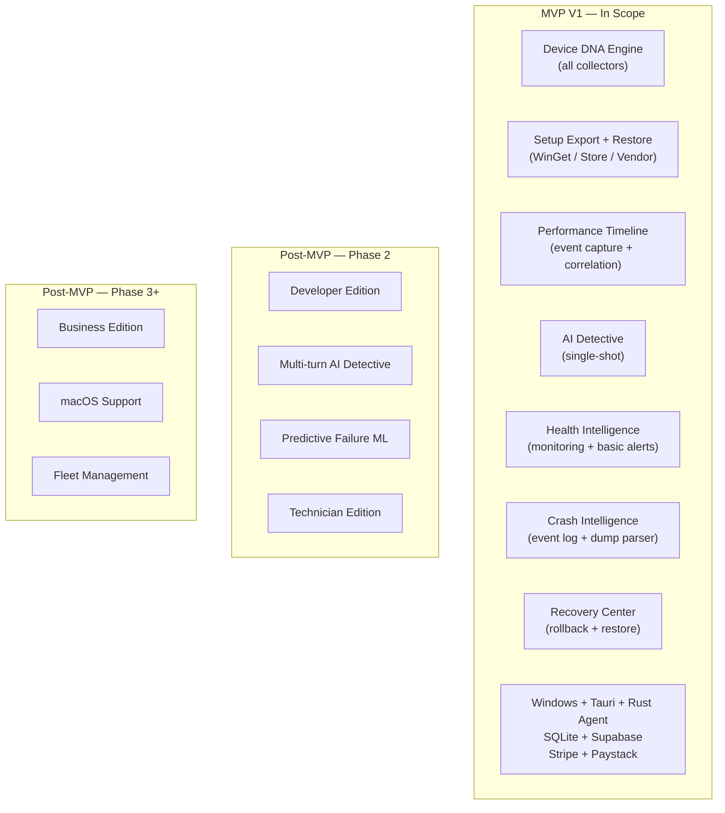
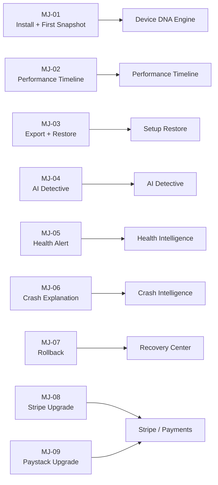

# 11. MVP Definition

> Defines the precise V1 launch scope for DeviceLifeline — what is in, what is explicitly out, the MVP user journeys, success criteria, constraints, and rationale for deferrals. Part of the DeviceLifeline documentation suite — see [Documentation Index](README.md).

**Status:** Draft v1 · **Authoring role:** Senior Product Manager + Principal Software Architect · **Last updated:** 2026-06-07
**Related:** [03. Product Requirements Document](03-product-requirements-document.md), [06. Functional Requirements](06-functional-requirements.md), [10. Feature Breakdown Structure](10-feature-breakdown-structure.md), [12. Product Roadmap](12-product-roadmap.md), [08. User Flows](08-user-flows.md), [14. Subscription Plans](14-subscription-plans.md)

---

## 1. Purpose & Scope

This document is the authoritative definition of DeviceLifeline V1 — the Minimum Viable Product. It establishes:
- A precise, bounded list of in-scope and out-of-scope capabilities
- The MVP user journeys that must work end-to-end at launch
- Measurable success criteria and exit metrics that determine when MVP is "done"
- Constraints under which MVP must ship
- Explicit rationale for every deferred feature (to prevent scope creep debates)

All other documents in this suite must respect the MVP boundary defined here. When a document covers a post-MVP feature, it must be labeled `[Post-MVP]`.

---

## 2. Assumptions

- A1: MVP targets Windows 10 21H2+ and Windows 11 on x86-64 hardware only.
- A2: MVP targets individual consumers, power users, and developers as the primary segments. Technician and Business editions are post-MVP.
- A3: MVP ships two subscription tiers: Free and Pro. Developer, Technician, Business tiers are post-MVP.
- A4: The MVP is validated through a closed beta (target: 200+ users, 60-day beta period) before public launch.
- A5: "Ship" means: publicly downloadable installer, signed binary, working payments (Stripe + Paystack), working cloud sync, and live support channel.
- A6: MVP success is measured at 90 days post-launch (see Section 7).

---

## 3. MVP Mission Statement

> V1 of DeviceLifeline gives a Windows user — for the first time — a complete living history of their device: what software is installed, how performance has changed over time, what caused those changes, how healthy their hardware is, and how to recover from problems or move to a new machine in minutes.

---

## 4. In-Scope Features (MVP)

### 4.1 Device DNA Engine (P1) — FULL MVP scope

| # | Capability | Notes |
|---|-----------|-------|
| 1 | Software inventory: Win32 apps, Store apps, WinGet packages | Version, publisher, install date, install source |
| 2 | System configuration: startup items, services, power settings, network adapters | Snapshot + change tracking |
| 3 | Browser environment: installed browsers, extensions, profiles | Chrome, Edge, Firefox, Brave, Opera |
| 4 | Developer environment: runtimes (Node, Python, .NET, Java, Go, Rust, Ruby), package managers, IDEs, WSL distros | Pro tier only |
| 5 | Hardware fingerprint: CPU, RAM, GPU, storage, OS version | Unique device identifier |
| 6 | Full snapshots: write to local SQLite (WAL + SQLCipher) | Append-only, SHA-256 checksum |
| 7 | Incremental diff snapshots | Bandwidth-efficient after initial baseline |
| 8 | Scheduled snapshots: daily default (configurable), event-triggered | Hourly schedule is Pro; battery threshold respected |
| 9 | Snapshot pruning with configurable retention | Default: 90 days |
| 10 | Cloud sync: upload snapshots to Supabase Storage | Pro tier; offline queue |

### 4.2 One-Click Setup Restore (P2) — Core scope (Pro)

| # | Capability | Notes |
|---|-----------|-------|
| 11 | Setup export to `.dlsetup` bundle (JSON + manifest + SHA-256) | Configurable scope |
| 12 | Cloud storage of `.dlsetup` for cross-device access | Pro tier |
| 13 | Restore engine: WinGet primary, Microsoft Store secondary, vendor installer fallback | Parallel execution; per-item retry |
| 14 | WinGet availability bootstrap (auto-install App Installer if missing) | |
| 15 | Restore preview + dry run (availability check before install) | |
| 16 | Per-item failure report (failed / skipped items with reasons) | |
| 17 | System config restore (startup items, services, power settings) | |
| 18 | Browser extension list display (manual user install; no auto-install) | MVP limitation |

### 4.3 Performance Timeline (P3) — Core scope (Pro for UI; event capture for all)

| # | Capability | Notes |
|---|-----------|-------|
| 19 | Timeline event capture: software installs/removals, driver updates, Windows Updates, startup changes, service changes, hardware changes | All tiers |
| 20 | Performance metrics sampling: startup time, RAM/CPU baselines, disk I/O | Startup time and basics: all; disk I/O: Pro |
| 21 | On-device correlation engine: statistical event→metric correlation with confidence score | Pro |
| 22 | Timeline UI: swim lanes, zoom (day/week/month), correlation markers, event filter panel | Pro |
| 23 | Correlation detail panel: event, metric delta, confidence, contributing factors, suggested actions | Pro |

### 4.4 AI Detective (P4) — Basic scope

| # | Capability | Notes |
|---|-----------|-------|
| 24 | Single-shot natural-language query | Pro (1 free/month for Free tier) |
| 25 | On-device context extraction (timeline, health metrics, snapshot diffs sent as structured summary) | No raw file data; privacy-safe |
| 26 | Supabase Edge Function AI orchestration (OpenAI + Anthropic; no keys on-device) | |
| 27 | Streaming response with causes, evidence, confidence, suggested actions | |
| 28 | Query history (local storage) | |
| 29 | Context viewer (transparency: what was sent) | |

### 4.5 Health Intelligence (P5) — Basic scope

| # | Capability | Notes |
|---|-----------|-------|
| 30 | Health monitoring: CPU temp/utilization, RAM usage, SSD/HDD SMART, NVMe health, GPU temp, battery charge cycle/capacity, network health | All tiers |
| 31 | Health score engine: 0–100 per subsystem, color coded | All tiers |
| 32 | Basic alerts: 3 predefined threshold types free (SSD warning, battery critical, RAM critical) | All tiers |
| 33 | Full alert management: configurable thresholds, alert history, acknowledge/snooze | Pro |
| 34 | Health trend charts: 7/30/90-day per metric | Pro |

### 4.6 Crash Intelligence (P6) — Basic scope

| # | Capability | Notes |
|---|-----------|-------|
| 35 | Windows Event Log monitoring: BSOD, app crashes, driver failures | All tiers |
| 36 | Memory dump parser: stop code + faulting module from minidump | All tiers |
| 37 | Plain-English crash explanation + known driver issue lookup | All tiers |
| 38 | LLM-enhanced explanation for novel crash signatures | Pro |
| 39 | Crash-to-timeline correlation | Pro |

### 4.7 Recovery Center (P7) — Core scope (Pro)

| # | Capability | Notes |
|---|-----------|-------|
| 40 | Software rollback: uninstall via WinGet / Windows Uninstall API | Pro |
| 41 | Driver rollback: Windows Device Manager driver rollback | Pro |
| 42 | System config rollback: restore from snapshot diff | Pro |
| 43 | Rollback preview (diff: current → target) | Pro |
| 44 | Rollback history logged as Timeline Events | Pro |
| 45 | Full setup restore (Pillar 2) invocable from Recovery Center | Pro |

### 4.8 Platform & Infrastructure

| # | Capability | Notes |
|---|-----------|-------|
| 46 | Tauri desktop shell (Windows 10/11 x86-64) | Signed binary |
| 47 | Rust agent as Windows Service (low-privilege) | < 30 MB idle RAM, < 0.5% idle CPU |
| 48 | SQLite local database (WAL + SQLCipher AES-256) | |
| 49 | Supabase Auth (email/password + OAuth: Google, Microsoft) | |
| 50 | Supabase Postgres + Edge Functions + Storage + Realtime | |
| 51 | Stripe subscriptions (global) | Pro tier only |
| 52 | Paystack subscriptions (Africa) | Pro tier only |
| 53 | PostHog analytics (opt-in, privacy-first) | |
| 54 | Sentry crash/error reporting | |
| 55 | Auto-update (Tauri updater) | |
| 56 | WCAG 2.1 AA accessibility | |
| 57 | Offline-first: all read operations work without network | |

---

## 5. Explicitly Out-of-Scope for MVP

The following are **not** in V1. They may not be prototyped, promised, or implied in MVP marketing or documentation.

| # | Deferred Feature | Rationale | Planned Phase |
|---|-----------------|-----------|---------------|
| 1 | macOS support | Platform abstraction requires separate OS collectors, testing, App Store process. Windows-first focus essential for quality. | Phase 3 |
| 2 | Linux support | Same as macOS; lower initial market priority. | Phase 4 |
| 3 | Developer Edition tier | Requires workspace template engine and deep dev-env diff tooling beyond MVP scope. | Phase 2 |
| 4 | Technician Edition | Multi-client management, remote snapshot, report generator are significant engineering work. | Phase 2 |
| 5 | Business Edition | Fleet management, policy engine, SSO, bulk deploy — large, distinct product surface. | Phase 3 |
| 6 | Browser extension auto-install | Browser extension policy APIs require per-browser implementation and enterprise config. | Phase 2 |
| 7 | Multi-turn AI Detective conversation | Multi-turn requires session management and context window management beyond single-query MVP. | Phase 2 |
| 8 | Proactive AI insights (unsolicited) | Requires reliable anomaly detection baseline before proactive triggers are trustworthy. | Phase 2 |
| 9 | Predictive failure alerts (ML) | ML model training requires field data volume not available at launch. | Phase 2 |
| 10 | Windows System Restore Point integration before rollback | Valuable safety net but not blocking core rollback UX. | Phase 2 |
| 11 | Fleet remote rollback / bulk deploy | Business Edition dependency. | Phase 3 |
| 12 | Localization (non-English UI) | English-only acceptable for MVP; i18n framework in place for fast follow. | Phase 2 |
| 13 | Custom event markers on Timeline | Nice-to-have; doesn't affect core diagnostic value. | Phase 2 |
| 14 | Performance baseline re-establishment | Requires research into reliable baseline-shift detection; risk of false alerts. | Phase 2 |
| 15 | Multi-factor correlation (multiple events → one change) | Single-factor correlation ships in MVP; multi-factor adds complexity without validated need. | Phase 2 |
| 16 | LLM Timeline annotations (cluster summaries) | Post-baseline AI enhancement. | Phase 2 |
| 17 | Mobile companion app | Separate app, separate platform. | Phase 4+ |
| 18 | Web dashboard (Business admin portal) | Business Edition prerequisite. | Phase 3 |
| 19 | Alert escalation to ticketing systems (Jira, ServiceNow) | Business Edition only. | Phase 4 |
| 20 | On-device local LLM inference | Model sizes and hardware requirements not viable in MVP timeframe. | Phase 4 |
| 21 | ARM64 Windows native support | ARM64 market share growing but not blocking MVP. x86 emulation acceptable initially. | Phase 2 |
| 22 | Anonymized community crash knowledge base | Requires sufficient user volume to be useful; privacy design needs additional review. | Phase 2 |
| 23 | devcontainer / Dockerfile / Nix flake detection | Developer Edition scope. | Phase 2 |

---

## 6. MVP User Journeys

These are the end-to-end journeys that must work flawlessly at launch. All are derived from [08. User Flows](08-user-flows.md).

| Journey ID | Journey Name | Persona | Success Condition |
|-----------|-------------|---------|-----------------|
| MJ-01 | Install → First Device DNA Snapshot | All | User completes onboarding and sees a full snapshot within 5 minutes of install |
| MJ-02 | Browse Performance Timeline → Identify a change that slowed down my PC | Consumer / Power User | User finds a correlated event and understands the cause without help documentation |
| MJ-03 | Export my setup → Restore on a new machine | Consumer / Developer | 90%+ of WinGet-available apps install successfully; user rates experience 4+/5 |
| MJ-04 | Ask AI Detective "Why is my PC slow?" | Consumer | AI returns a useful, specific answer with timeline references within 12 seconds |
| MJ-05 | Receive SSD health warning → Understand what to do | Consumer | Alert fires before SSD reaches critical state; plain-English explanation is actionable |
| MJ-06 | BSOD occurs → User reads plain-English explanation | Consumer | Crash recorded and explained within 2 minutes of reboot |
| MJ-07 | Roll back a bad software update | Power User | Rollback completes cleanly; Timeline records the rollback event |
| MJ-08 | Upgrade from Free to Pro (Stripe) | All | Checkout → Pro features unlocked within 60 seconds; no billing errors |
| MJ-09 | Upgrade from Free to Pro (Paystack) | African market user | Same success condition as MJ-08 via Paystack |

---

## 7. MVP Success Criteria & Exit Metrics

These are the measurable thresholds that define a successful MVP. Measured at **90 days post-public launch**.

### 7.1 Acquisition & Activation

| Metric | Target | Source |
|--------|--------|--------|
| Total installs | ≥ 5,000 | Installer download telemetry |
| Onboarding completion rate (first snapshot) | ≥ 75% | PostHog: `onboarding_completed` event |
| D7 retention (users active 7 days after install) | ≥ 40% | PostHog: daily active device |
| D30 retention | ≥ 20% | PostHog |

### 7.2 Core Feature Engagement (Pro)

| Metric | Target | Source |
|--------|--------|--------|
| Pro conversion rate (Free → Pro within 30 days) | ≥ 5% of installs | Stripe / Paystack + PostHog |
| Restore jobs completed successfully (≥ 90% item success rate) | ≥ 80% of restore jobs | PostHog: `restore_completed` event |
| AI Detective queries rated "helpful" (4+ out of 5) | ≥ 65% | In-app rating widget |
| Performance Timeline viewed at least once per active Pro user per week | ≥ 50% of Pro users | PostHog: `timeline_viewed` |

### 7.3 Quality

| Metric | Target | Source |
|--------|--------|--------|
| Agent crash rate | < 0.1% of agent-hours | Sentry |
| App (Tauri shell) crash rate | < 0.5% of sessions | Sentry |
| Snapshot success rate | ≥ 99% | PostHog: `snapshot_completed` / `snapshot_failed` |
| P1 / P2 bug count at launch | 0 P1 bugs; < 5 P2 bugs | QA tracking |

### 7.4 Revenue

| Metric | Target | Source |
|--------|--------|--------|
| Monthly Recurring Revenue (MRR) at 90 days | ≥ $3,000 USD | Stripe + Paystack dashboards |
| Churn rate (month 1 Pro cancellation) | < 10% | Stripe / Paystack |

---

## 8. MVP Constraints

| Constraint | Detail |
|-----------|--------|
| Platform | Windows 10 21H2+ and Windows 11, x86-64 only |
| Team size | Defined by current engineering capacity; no external contractors in beta phase |
| Timeline | MVP beta: M0+8 weeks; MVP public launch: M0+16 weeks (see [12. Product Roadmap](12-product-roadmap.md)) |
| Security | All AI keys off-device; SQLite encrypted; code-signed binary required at launch |
| Privacy | No file contents, no keystrokes, no screen captures ever collected; telemetry opt-in by default |
| Legal | Terms of Service and Privacy Policy published before public launch |
| Support | At least one async support channel (email/Discord) live at launch |
| Payments | Both Stripe and Paystack fully functional and tested before launch |

---

## 9. Deferred Feature Rationale Summary

The deferrals above follow two principles:

**Principle 1 — Platform Focus Over Breadth:** Windows is the dominant platform for the target personas. Building macOS/Linux support before Windows is mature would split engineering effort and reduce quality on all platforms.

**Principle 2 — Business Complexity Deferred:** Technician and Business editions require distinct UX surfaces (fleet dashboards, client management, policy engines) that are meaningfully different products, not extensions. Building them before the core product is validated wastes resources and risks building the wrong feature set.

**Principle 3 — AI Safety First:** Proactive AI features (unsolicited insights, predictive failure ML) require a data baseline that only exists after the product has been in the field for several months. Launching them prematurely risks user-facing errors that erode trust in the AI surface.

---

## Diagrams

### MVP Scope Boundary

### MVP Journey Coverage Map

---

## Risks & Mitigations

| Risk | Likelihood | Impact | Mitigation |
|------|-----------|--------|------------|
| Scope creep from stakeholder pressure to add post-MVP features before launch | High | High | This document is the boundary; all scope changes require formal product decision + roadmap update |
| WinGet coverage gaps cause restore to fail for popular apps | Medium | High | Vendor installer fallback; curated fallback URLs for top 100 apps; failure report with manual steps |
| Performance Timeline correlation engine produces low-quality results on diverse hardware | Medium | High | Set confidence score threshold; AI Detective serves as secondary; user feedback loop from day 1 |
| Stripe/Paystack integration delays block monetization at launch | Low | High | Start payment integration in sprint 1; run parallel to feature work |
| Beta user volume insufficient to validate metrics | Medium | Medium | Recruit from developer communities, Windows forums, tech subreddits; targeted social outreach |
| Privacy compliance (GDPR/CCPA) not ready at launch | Low | High | Legal review in week 2; Privacy Policy and data deletion flow shipped with MVP |

---

## Future Considerations

- **FC-01:** V1.1 scope (the first post-MVP release) should focus on the highest-impact deferrals: browser extension auto-install, multi-turn AI Detective, and Windows ARM64 support.
- **FC-02:** The MVP success metrics (Section 7) feed directly into Phase 2 planning — if restore success rate < 80%, Phase 2 must prioritize restore engine improvements before new features.
- **FC-03:** Developer Edition in Phase 2 should be co-designed with at least 5 developer beta users from the MVP cohort.
- **FC-04:** If Paystack conversion rate significantly exceeds Stripe conversion rate, re-evaluate pricing for African market in post-MVP billing strategy.

---

## Acceptance Criteria

- [ ] AC-11-01: Every MVP capability in Section 4 has a corresponding entry in [10. Feature Breakdown Structure](10-feature-breakdown-structure.md) tagged `MVP`.
- [ ] AC-11-02: Every out-of-scope item in Section 5 has a planned phase assigned and rationale documented.
- [ ] AC-11-03: All 9 MVP user journeys (Section 6) are covered by flows in [08. User Flows](08-user-flows.md).
- [ ] AC-11-04: All success metrics in Section 7 have a data source (PostHog, Stripe, Sentry) and are instrumented before beta launch.
- [ ] AC-11-05: This document is reviewed and signed off by the engineering lead and product lead before beta begins.
- [ ] AC-11-06: No feature tagged `Post-MVP` in this document appears in V1 sprint backlog without a formal scope-change decision on file.
- [ ] AC-11-07: MVP constraints table (Section 8) is incorporated into the team's Definition of Done for the MVP milestone.
