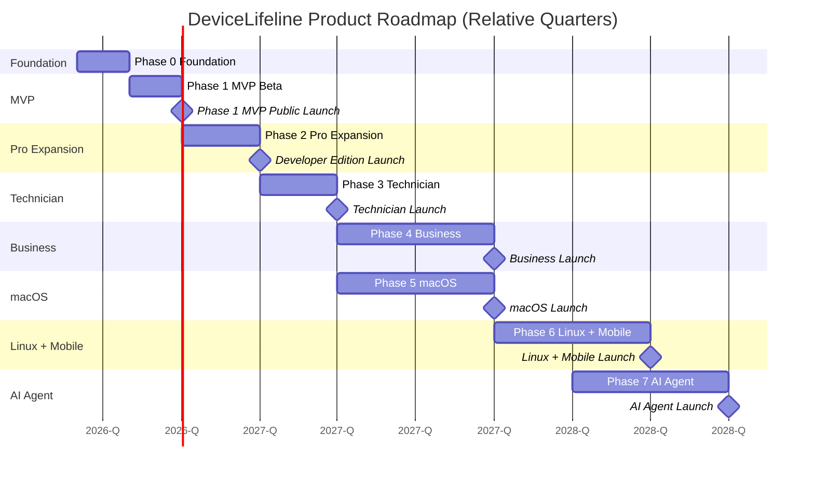
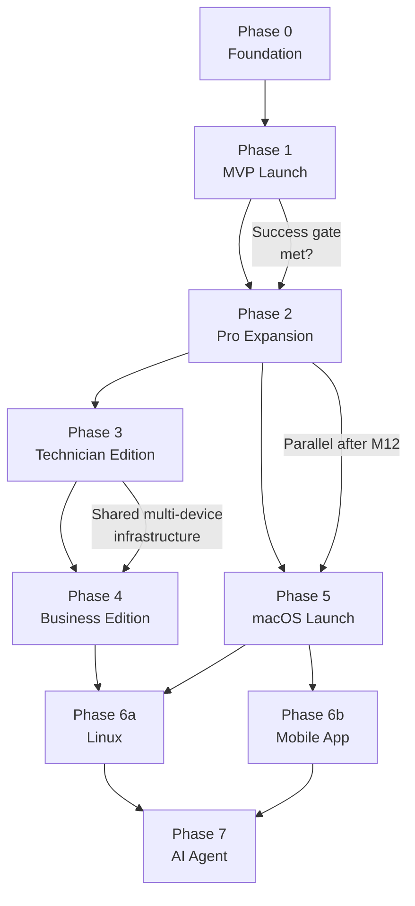
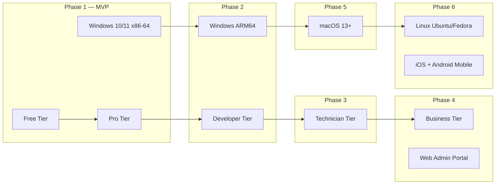

# 12. Product Roadmap

> Phased product roadmap from MVP through Platform Maturity, covering all edition launches, platform expansions, AI evolution, and future mobile/agent strategies, with a Mermaid Gantt and milestone dependencies. Part of the DeviceLifeline documentation suite — see [Documentation Index](README.md).

**Status:** Draft v1 · **Authoring role:** Senior Product Manager + Principal Software Architect · **Last updated:** 2026-06-07
**Related:** [11. MVP Definition](11-mvp-definition.md), [10. Feature Breakdown Structure](10-feature-breakdown-structure.md), [13. Monetization Strategy](13-monetization-strategy.md), [14. Subscription Plans](14-subscription-plans.md), [15. Competitive Analysis](15-competitive-analysis.md), [56. Technician Edition Specification](56-technician-edition-specification.md), [57. Business Edition Specification](57-business-edition-specification.md), [58. Future AI Agent Strategy](58-future-ai-agent-strategy.md), [59. Future Mobile App Strategy](59-future-mobile-app-strategy.md), [60. Final Implementation Roadmap](60-final-implementation-roadmap.md)

---

## 1. Purpose & Scope

This document defines the multi-phase product roadmap for DeviceLifeline from inception through platform maturity. It provides:
- Phase-by-phase themes, deliverables, and milestones
- Edition launch sequence and dependency mapping
- Platform expansion schedule (Windows → macOS → Linux → Mobile)
- AI capability evolution arc
- A Mermaid Gantt chart showing relative phasing in quarters

**Phasing convention:** M0 = project kick-off (today: 2026-06-07). All timing is relative (quarters = ~13 weeks). Calendar dates are illustrative examples based on M0. Precise dates are managed in the team's project tracker.

---

## 2. Assumptions

- A1: Engineering team is small (4–8 people) at MVP; grows with revenue.
- A2: Each phase gate requires the prior phase's success metrics to be met or explicitly waived by product leadership.
- A3: Roadmap phases are sequential for platform work but concurrent for edition expansions (Technician and Business can be developed in parallel after Phase 1).
- A4: macOS support (Phase 3) is contingent on a successful Windows MVP with sufficient revenue to fund platform expansion.
- A5: Phase timing assumes no major third-party dependency breakage (WinGet API, Supabase, OpenAI/Anthropic API stability).
- A6: "Quarter" = Q1 (M0–M3), Q2 (M3–M6), Q3 (M6–M9), Q4 (M9–M12), Q5 (M12–M15), Q6 (M15–M18), etc.

---

## 3. Roadmap Overview

| Phase | Name | Quarters | Theme | Key Outputs |
|-------|------|----------|-------|-------------|
| 0 | Foundation | M0–M2 | Build core platform | Architecture, dev environment, CI/CD, tech spike |
| 1 | MVP Launch | M2–M4 | Ship & validate | V1 public launch, Free + Pro tiers, Windows only |
| 2 | Pro Expansion | M4–M7 | Deepen Pro + Developer Edition | Developer tier, multi-turn AI, macOS planning |
| 3 | Technician Edition | M7–M10 | Serve repair shops & MSPs | Technician Edition launch, remote diagnostics |
| 4 | Business Edition | M10–M14 | Serve organizations | Business Edition launch, fleet management, SSO |
| 5 | macOS Launch | M12–M17 | Cross-platform | macOS 13+ support, Homebrew restore, App Store |
| 6 | Linux + Mobile | M17–M22 | Platform completeness | Linux support, Mobile companion app (iOS/Android) |
| 7 | AI Agent | M20+ | Autonomous intelligence | AI Agent mode, local LLM, proactive remediation |

---

## 4. Phase 0 — Foundation (M0–M2)

**Theme:** Build the technical foundation. No user-facing features ship in Phase 0.

### Deliverables

| Deliverable | Description |
|-------------|-------------|
| Monorepo setup | Tauri + Rust agent + React/TypeScript frontend in a single repo with CI |
| Rust agent scaffold | Windows Service scaffold, IPC interface, SQLite connection, first collector (software inventory) |
| Tauri shell scaffold | Basic window, IPC bridge, React SPA with routing, Tailwind CSS, component library skeleton |
| Supabase project | Database schema v1, Auth, Storage buckets, Edge Function scaffold |
| CI/CD pipeline | GitHub Actions: build, lint, test, Sentry upload, Tauri bundle |
| Development environment | Team onboarding guide, local dev setup, signing certificate procurement |
| Tech spikes | Performance Timeline correlation algorithm prototype; WinGet install engine prototype |

### Milestones

- **MS-0.1:** All collectors produce a complete Device DNA Snapshot in dev (M0+3 weeks)
- **MS-0.2:** First end-to-end: Rust → SQLite → Tauri IPC → React UI renders snapshot (M0+5 weeks)
- **MS-0.3:** Supabase Auth working; snapshot uploads to Storage (M0+7 weeks)

### Dependencies

- Windows EV code-signing certificate acquired before MS-0.3
- Supabase project provisioned by M0+1 week

---

## 5. Phase 1 — MVP Launch (M2–M4)

**Theme:** Ship the first version users love. Validate core loops.

### Deliverables

| Deliverable | Description |
|-------------|-------------|
| All Device DNA collectors complete | Software, system config, browser, developer env, hardware |
| Performance Timeline | Event capture, metrics sampling, correlation engine, swim-lane UI |
| Setup Export + Restore | `.dlsetup` export, WinGet/Store/vendor install engine, dry run, progress UI |
| Health Intelligence (basic) | All health collectors, health score engine, 3 free alert types, Pro trend charts |
| Crash Intelligence (basic) | Event log monitor, dump parser, plain-English explanation, Pro LLM enhancement |
| AI Detective (basic) | Single-shot query, Edge Function orchestration, streaming response |
| Recovery Center (basic) | Software/driver/config rollback, preview, history |
| Free + Pro subscription | Stripe + Paystack integration, entitlement system, paywall gates |
| Onboarding | First-run wizard, permission setup, first snapshot flow |
| Accessibility | WCAG 2.1 AA; keyboard nav; NVDA compatibility |
| Closed beta | 200+ users; 60-day beta; bug bash; metrics baseline |
| Public launch | Signed installer, website, pricing page, support channel |

### Milestones

- **MS-1.1:** Feature-complete internal build (M2+4 weeks)
- **MS-1.2:** Closed beta opens (M2+6 weeks)
- **MS-1.3:** Beta retrospective + go/no-go decision (M3+4 weeks)
- **MS-1.4:** Public launch v1.0.0 (M4)

### Success Gate to Phase 2

- Onboarding completion ≥ 75%
- D30 retention ≥ 20%
- Pro conversion ≥ 5%
- Agent crash rate < 0.1%
- Snapshot success rate ≥ 99%
- MRR ≥ $3,000 at 90 days post-launch

### Dependencies

- Phase 0 complete and all MS-0.x milestones hit
- Privacy Policy + Terms of Service published
- Stripe + Paystack accounts verified and webhook endpoints live

---

## 6. Phase 2 — Pro Expansion (M4–M7)

**Theme:** Deepen the Pro experience; launch Developer Edition; improve AI quality.

### Deliverables

| Deliverable | Description |
|-------------|-------------|
| Developer Edition tier | Workspace Templates, dev env deep scan (devcontainer, Dockerfile, Nix detection), template library |
| Multi-turn AI Detective | Follow-up conversational queries (session management, context window) |
| Proactive AI Insights | AI surfaces unsolicited anomalies when confidence is high |
| Browser extension auto-install | Chrome/Firefox extension policy deploy |
| Windows ARM64 native support | ARM64 Rust agent + Tauri build target |
| Predictive failure alerts (v1) | SSD wear prediction; battery degradation curve |
| Performance baseline re-establishment | Detect major system changes; re-anchor baseline |
| Multi-factor correlation | Multiple events contributing to one performance change |
| LLM Timeline annotations | Plain-English cluster summaries on Timeline |
| Windows System Restore Point | Create System Restore Point before any recovery action |
| Custom event markers | User notes on Timeline |
| Localization framework | First non-English locale (French or Spanish) |
| Community crash knowledge base | Anonymized crash signature crowd-sourcing (opt-in) |

### Milestones

- **MS-2.1:** Developer Edition in beta (M4+4 weeks)
- **MS-2.2:** Multi-turn AI Detective shipped (M5)
- **MS-2.3:** ARM64 build in beta (M5+4 weeks)
- **MS-2.4:** Developer Edition public launch (M6)
- **MS-2.5:** Predictive failure alerts shipped (M7)

### Dependencies

- Phase 1 MVP success gate met
- Developer persona user interviews (n ≥ 10) before Developer Edition design freeze
- OpenAI/Anthropic multi-turn API design validated

---

## 7. Phase 3 — Technician Edition (M7–M10)

**Theme:** Serve repair technicians and MSPs with professional-grade tools.

### Deliverables

| Deliverable | Description |
|-------------|-------------|
| Technician Edition tier | Multi-client workspace, client management, device labels |
| Remote Snapshot Request | Request a DNA snapshot from a client device remotely |
| Diagnostic Report Generator | Branded PDF/HTML health + history report export |
| Repair Recommendations | AI-generated repair priority list |
| Technician-mode AI Detective | Richer technical responses; technician-specific prompts |
| Remote rollback | IT/technician triggers rollback on client device |
| macOS Architecture + Planning | Tech spike; Homebrew integration prototype; macOS collectors prototype |
| Technician mobile preview | Technician-focused read-only mobile companion (view-only, not full app) |

### Milestones

- **MS-3.1:** Technician Edition internal beta (M7+4 weeks)
- **MS-3.2:** Remote Snapshot capability live (M8)
- **MS-3.3:** Diagnostic Report Generator live (M8+4 weeks)
- **MS-3.4:** Technician Edition public launch (M10)
- **MS-3.5:** macOS collectors prototype complete (M10)

### Dependencies

- Phase 2 Developer Edition stable
- Technician persona discovery: 5+ repair shop interviews before design freeze
- Remote device communication security review complete

---

## 8. Phase 4 — Business Edition (M10–M14)

**Theme:** Serve organizations with fleet management, compliance, and onboarding tooling.

### Deliverables

| Deliverable | Description |
|-------------|-------------|
| Business Edition tier | Per-device licensing, team management, roles |
| Fleet Dashboard | Aggregate health scores, compliance status, onboarding queue |
| Policy Engine v1 | Define required/optional software + config rules; per-device compliance check |
| Compliance Reporting | Per-device + fleet-wide reports; exportable CSV/PDF |
| Onboarding Templates | New device provisioning from template |
| Bulk Restore/Deploy | Apply setup or policy to multiple devices simultaneously |
| SSO Integration | SAML 2.0 / OIDC; tested with Azure AD, Okta, Google Workspace |
| Asset Inventory | Fleet-wide software/hardware register; exportable |
| Alert Escalation (v1) | Webhook-based alert forwarding to Jira/ServiceNow |
| Web Admin Portal | Browser-based Business admin dashboard (separate from Tauri app) |

### Milestones

- **MS-4.1:** Business Edition closed beta with 3 pilot organizations (M10+4 weeks)
- **MS-4.2:** Fleet Dashboard + Policy Engine v1 live (M11+4 weeks)
- **MS-4.3:** SSO integration live (M12+4 weeks)
- **MS-4.4:** Business Edition public launch (M14)

### Dependencies

- Phase 3 Technician Edition stable (shared multi-device infrastructure)
- 3 pilot organizations recruited for closed beta
- Legal: enterprise terms, DPA templates ready
- Supabase RLS audit for multi-tenant data isolation

---

## 9. Phase 5 — macOS Launch (M12–M17)

**Theme:** Expand DeviceLifeline to macOS with full feature parity to Windows Pro.

### Deliverables

| Deliverable | Description |
|-------------|-------------|
| macOS Rust agent | macOS collectors: software (Homebrew, App Store, manually installed), system config, browser env, hardware | 
| macOS system config | LaunchAgents/LaunchDaemons, login items, network config |
| Homebrew restore | Brew install engine; brew bundle support |
| macOS App Store restore | mas-cli or MAS API integration |
| macOS health monitoring | CPU (powermetrics), SSD SMART, battery (pmset), thermal |
| macOS crash reports | crash logs, panic logs, Console.app event parsing |
| Tauri macOS builds | Apple Silicon + Intel; notarized + code-signed |
| Mac App Store distribution | MAS submission + review |
| macOS-specific IA adaptations | See [28. macOS Architecture Plan](28-macos-architecture-plan.md) |

### Milestones

- **MS-5.1:** macOS alpha (internal, Apple Silicon) (M12+6 weeks)
- **MS-5.2:** macOS beta (public, Intel + Apple Silicon) (M14+4 weeks)
- **MS-5.3:** macOS public launch (M17)

### Dependencies

- Phase 5 can run in parallel with Phase 4 (Business Edition) after M12
- Apple Developer Program membership + notarization certificate
- Sufficient engineering capacity (new hire or contractor for macOS-specific work)

---

## 10. Phase 6 — Linux + Mobile (M17–M22)

**Theme:** Complete platform coverage; launch mobile companion app.

### Deliverables

| Deliverable | Description |
|-------------|-------------|
| Linux Rust agent | apt/dpkg, rpm/dnf collectors; systemd service management |
| Linux health monitoring | hwmon, smartctl, upower |
| Linux Tauri builds | .deb, .rpm, .AppImage packages |
| Mobile companion app (iOS + Android) | Read-only view: health alerts, crash reports, snapshot summary; Push notifications | 
| Mobile health alert push | Real-time health alert delivery to mobile |

### Milestones

- **MS-6.1:** Linux alpha (Ubuntu 22.04) (M17+4 weeks)
- **MS-6.2:** Linux beta (M19)
- **MS-6.3:** Mobile companion app beta (M20)
- **MS-6.4:** Linux + Mobile public launch (M22)

### Dependencies

- Phase 5 macOS stable (shared cross-platform agent architecture)
- Mobile: React Native or Expo selected (separate mobile strategy — see [59. Future Mobile App Strategy](59-future-mobile-app-strategy.md))
- Linux: Snap/Flatpak packaging decision finalized

---

## 11. Phase 7 — AI Agent Mode (M20+)

**Theme:** Move from diagnostic to autonomous — the AI acts, not just advises.

### Deliverables

| Deliverable | Description |
|-------------|-------------|
| Autonomous Remediation Engine | AI Agent triggers recovery actions autonomously within user-defined permission bounds |
| Local LLM Integration | On-device inference (< 4 GB model) for privacy-sensitive queries and offline AI |
| Continuous Monitoring Intelligence | AI watches Performance Timeline 24/7; surfaces insights proactively |
| Predictive Maintenance Automation | Auto-schedules maintenance (disk cleanup, startup optimization) based on health trends |
| AI Agent Strategy | See [58. Future AI Agent Strategy](58-future-ai-agent-strategy.md) |

### Milestones

- **MS-7.1:** AI Agent Mode alpha (limited permissions scope) (M20+4 weeks)
- **MS-7.2:** Local LLM integration beta (M22)
- **MS-7.3:** AI Agent Mode public launch (M24+)

### Dependencies

- Reliable anomaly detection baseline from 12+ months of field data
- Legal/privacy review of autonomous action model
- User consent and permission framework designed

---

## 12. Platform Expansion Summary

```
Windows 10/11 (x86-64) → MVP (Phase 1)
Windows ARM64            → Phase 2
macOS 13+ (AS + Intel)   → Phase 5
Linux (Ubuntu/Fedora)    → Phase 6
iOS + Android (mobile)   → Phase 6
```

---

## 13. Edition Launch Timeline

```
Free tier     → Phase 1 (MVP)
Pro tier      → Phase 1 (MVP)
Developer     → Phase 2
Technician    → Phase 3
Business      → Phase 4
```

---

## Diagrams

### Phase Gantt Chart (Relative Timing)



### Dependency Graph



### Edition + Platform Matrix by Phase



---

## 14. Risks & Mitigations

| Risk | Likelihood | Impact | Mitigation |
|------|-----------|--------|------------|
| Phase 1 success metrics not met, blocking Phase 2 investment | Medium | High | Define "waiver" criteria for Phase 2 investment decision; track metrics weekly post-launch |
| macOS development underestimated — platform-specific APIs require longer than planned | High | Medium | macOS tech spike in Phase 3; hire macOS-specialist if revenue permits |
| Business Edition closed beta pilots not recruited in time | Medium | High | Begin enterprise sales outreach in Phase 2; offer pilot program incentives |
| Competitive response: established players add timeline/AI features | Medium | High | Accelerate Phase 2 AI improvements; deepen correlation quality as moat |
| Phase 7 AI Agent raises safety/liability concerns for autonomous actions | Medium | High | Define strict permission model; agent acts only within explicit user bounds; legal review before launch |
| Phasing too aggressive for available engineering headcount | High | Medium | Phase 4 and Phase 5 explicitly designed as parallel tracks; validate headcount before committing to overlap |
| Supabase pricing / vendor lock-in becomes an issue at scale | Low | Medium | Abstract Supabase behind internal SDK; evaluate self-hosted option at 100k MAU |

---

## 15. Future Considerations

- **FC-01:** Consider acquiring or partnering with a hardware vendor (refurbishers, repair chains) to embed DeviceLifeline in device provisioning workflows — accelerates Business Edition adoption.
- **FC-02:** Enterprise procurement cycles (Phase 4) typically require SOC 2 Type II certification. Begin SOC 2 preparation in Phase 3.
- **FC-03:** If AI API costs become prohibitive at scale, evaluate fine-tuned smaller models hosted on self-managed infrastructure.
- **FC-04:** DeviceLifeline API (public) for third-party integrations (MSP platforms, ticketing systems, RMM tools) is a post-Phase 4 opportunity.
- **FC-05:** The Final Implementation Roadmap (see [60. Final Implementation Roadmap](60-final-implementation-roadmap.md)) translates this product roadmap into sprint-level engineering planning.

---

## Acceptance Criteria

- [ ] AC-12-01: Every phase has a defined theme, list of deliverables, numbered milestones, and a dependency statement.
- [ ] AC-12-02: The Gantt chart renders on GitHub and accurately reflects the relative phase ordering with no circular dependencies.
- [ ] AC-12-03: Edition launch sequence (Free/Pro → Developer → Technician → Business) is consistent with [14. Subscription Plans](14-subscription-plans.md) and [10. Feature Breakdown Structure](10-feature-breakdown-structure.md).
- [ ] AC-12-04: Phase 1 success gate metrics match the exit metrics defined in [11. MVP Definition](11-mvp-definition.md) Section 7.
- [ ] AC-12-05: All post-MVP features referenced in this roadmap appear in [10. Feature Breakdown Structure](10-feature-breakdown-structure.md) with matching phase tags.
- [ ] AC-12-06: Platform expansion milestones (macOS, Linux) are cross-referenced in [28. macOS Architecture Plan](28-macos-architecture-plan.md) and [29. Linux Architecture Plan](29-linux-architecture-plan.md).
- [ ] AC-12-07: This roadmap is reviewed quarterly by product leadership and updated to reflect learned information from field data.
- [ ] AC-12-08: [60. Final Implementation Roadmap](60-final-implementation-roadmap.md) is derived from and consistent with this document for Phase 1 and Phase 2 planning.
