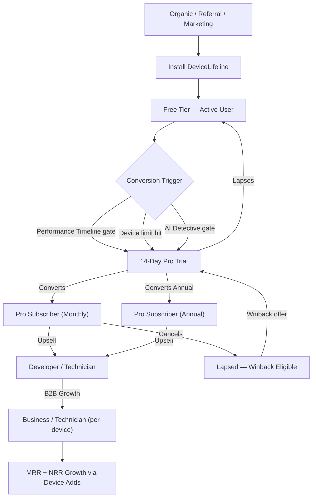
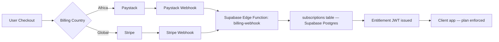

# 13. Monetization Strategy

> Defines DeviceLifeline's pricing philosophy, value metric, tier structure, payment rails, and revenue-model framework. Part of the DeviceLifeline documentation suite — see [Documentation Index](README.md).

**Status:** Draft v1 · **Authoring role:** Principal PM (Monetization) · **Last updated:** 2026-06-07
**Related:** [14. Subscription Plans](14-subscription-plans.md), [15. Competitive Analysis](15-competitive-analysis.md), [18. Compliance Requirements](18-compliance-requirements.md), [57. Business Edition Specification](57-business-edition-specification.md), [56. Technician Edition Specification](56-technician-edition-specification.md)

---

## 1. Purpose & Scope

This document establishes the monetization foundation for DeviceLifeline: the philosophical framework guiding pricing decisions, the primary value metric, the boundary between free and paid experiences, the five subscription tiers, payment infrastructure, regional strategy, and the drivers of a sustainable recurring-revenue model. It does not contain fabricated revenue forecasts; it defines the levers and logic an operator can use to model outcomes. Detailed per-plan feature matrices live in [Subscription Plans](14-subscription-plans.md).

**In scope:** pricing philosophy, value metric, tier rationale, trial/freemium conversion strategy, upsell and cross-sell paths, B2B licensing model, payment rails (Stripe + Paystack), regional pricing strategy, churn and retention levers, and revenue-model drivers.

**Out of scope:** product features (see PRD), technical billing implementation (see API Specification), compliance obligations for payment data (see [Compliance Requirements](18-compliance-requirements.md)).

---

## 2. Assumptions

- A1: Windows is the V1 platform; pricing logic must also accommodate future macOS/Linux expansion without a full pricing redesign.
- A2: The primary international payment processor is Stripe; Paystack handles African markets (Nigeria, Ghana, Kenya, South Africa, and expanding).
- A3: DeviceLifeline competes in the prosumer and SMB software market, not the enterprise RMM market (post-MVP), so pricing must be accessible to individuals and small teams.
- A4: AI Detective and Performance Timeline are perceived as the highest-value features and serve as the primary upsell gates.
- A5: The Technician and Business tiers sell primarily on a per-device model, consistent with RMM-adjacent tooling norms.
- A6: Annual billing discounts will be offered to reduce churn and improve cash flow predictability.
- A7: Regional purchasing-power parity (PPP) adjustments are required for African, South/Southeast Asian, and Eastern European markets to avoid total addressable market exclusion.
- A8: Free tier must be genuinely useful to drive organic acquisition, but structurally limited to create real pull toward paid tiers.
- A9: App Store / Microsoft Store distribution may constrain payment routing; direct billing via Stripe/Paystack is preferred for subscriptions.

---

## 3. Pricing Philosophy

### 3.1 Core Principle: Value-Aligned Pricing

DeviceLifeline prices on **delivered value, not feature lists.** Every tier boundary is drawn at a point where the user has already received meaningful value and faces a natural growth ceiling that the next tier removes. Pricing should feel like a logical unlock, not an artificial paywall.

The guiding questions for every pricing decision:

1. **Has the user experienced genuine value before the paywall?** (Free tier must satisfy this.)
2. **Is the paid feature worth the price delta for the target persona?** (Willingness-to-pay must exceed friction.)
3. **Does the price reflect the market segment, not just the feature count?** (B2B per-device is higher than consumer.)

### 3.2 Value Metric: Per Managed Device

The primary value metric is the **number of devices under active management**. This is chosen because:

- It scales linearly with the benefit received (more devices = more value protected).
- It is auditable and defensible (device count is a system-level fact).
- It aligns well with both consumer expansion (user gets a second PC) and B2B growth (technician takes on new clients, business onboards more employees).
- It avoids the "seat vs. usage" ambiguity common in SaaS that leads to billing disputes.

**Device definition:** An "active device" is a machine on which the DeviceLifeline agent has been installed, authenticated to a user account, and has produced at least one Device DNA Snapshot within the current billing period.

### 3.3 Transparency Commitment

Pricing is published publicly. There are no "call for pricing" gates for any tier below Business Enterprise (which may require custom contracts post-MVP). Upgrade/downgrade paths are self-serve. Cancellation is immediate and requires no human interaction.

---

## 4. Free-vs-Paid Boundary

The Free tier exists to demonstrate core value and drive word-of-mouth. The paid boundary is drawn to protect the highest-differentiating capabilities while ensuring the Free experience remains honest and genuinely useful.

| Capability | Free | First Paid Gate (Pro) |
|---|---|---|
| Device DNA Snapshot (point-in-time) | Yes — 1 device, last 30 days | Unlimited history |
| Software inventory | Yes — current state | Historical diffs |
| Basic health score (CPU, RAM, disk) | Yes — current readings | Trend history + alerts |
| Performance Timeline | No | Yes — full correlated timeline |
| AI Detective queries | No | Yes — included queries/month |
| Setup Export (Device DNA export) | Yes — manual, single snapshot | Automated + scheduled |
| One-Click Setup Restore | No | Yes |
| Multi-device management | No | Up to plan limit |
| Cloud sync / backup | No | Yes |
| Crash Intelligence | No | Yes |
| Recovery Center | No | Yes |
| Technician reports | No | Technician tier |
| Fleet management | No | Business tier |

**Key gate choice rationale:** Performance Timeline and AI Detective are the features that most directly solve the "why is my PC slow / what changed?" pain point. Gating them at Pro creates a strong pull mechanism: users experience the problem (slow PC, mystery crash) in the Free tier and understand that the answer lives one tier up.

---

## 5. The Five Tiers

See [Subscription Plans](14-subscription-plans.md) for the complete feature matrix and pricing table. Summary rationale below.

### 5.1 Free

**Target persona:** Casual consumer trying DeviceLifeline for the first time; cost-sensitive users who will refer paid users.
**Purpose:** Acquisition and brand trust. The Free tier is permanent (not a trial). It demonstrates the Device DNA concept and basic health intelligence on a single device with limited history.
**Conversion lever:** The user experiences Performance Timeline being locked when they notice their PC is slower than last month.

### 5.2 Pro

**Target persona:** Individual consumer, gamer, power user, enthusiast.
**Purpose:** Full single-user experience — the "individual subscription" that most consumers will land on.
**Value unlock:** Performance Timeline, AI Detective, Setup Restore, Crash Intelligence, Health alerts, up to 3 devices, 2 years history.
**Conversion lever from Pro:** User gets a second PC or wants a developer-oriented experience (workstation templates, environment sync).

### 5.3 Developer

**Target persona:** Software developer, DevOps engineer, freelance developer, technical power user.
**Purpose:** Developer-specific superpowers: workstation environment replication, dev tool inventory, SDK/language tracking, package manager state, workspace templates.
**Value unlock:** Everything in Pro plus developer-layer inventory, environment snapshot/restore, workspace templates, priority AI query allocation.
**Cross-sell path:** Developer users who manage other developers' machines naturally evolve to Technician or Business.

### 5.4 Technician

**Target persona:** PC repair technicians, MSP engineers, IT freelancers, computer repair shops.
**Purpose:** Multi-client device management, professional diagnostic reports, repair workflow integration.
**Value unlock:** Manage up to N client devices (see plan limits), customer-facing diagnostic reports, device history per client, Technician Dashboard.
**Pricing model:** Per-device, billed monthly or annually. See [Subscription Plans](14-subscription-plans.md).
**Conversion lever from Technician:** Shop grows, hires staff, needs multi-seat access → Business.

### 5.5 Business

**Target persona:** SMBs, internal IT teams, HR/onboarding teams.
**Purpose:** Fleet-level device management, compliance, onboarding automation, asset visibility.
**Value unlock:** Per-device fleet licensing, role-based access control, deployment templates, software compliance checks, bulk onboarding, API access (post-MVP).
**Pricing model:** Per managed device per month, minimum seat/device floor, annual contracts encouraged.

---

## 6. Trial and Freemium Conversion Strategy

### 6.1 Trial Mechanism

- **Pro/Developer trials:** 14-day full-feature trial on first sign-up, no credit card required. After 14 days, the account reverts to Free unless upgraded. Trial is one-time per account.
- **Technician/Business trials:** 14-day trial with up to 5 managed devices, initiated with a valid business email. Sales-assist touchpoint at day 7.
- All trials are tracked in PostHog with trial-start, feature-engagement, and conversion/lapse events.

### 6.2 Freemium Conversion Triggers

Conversion prompts are surfaced contextually — not on login, but at the moment of value realization:

| Trigger | Prompt |
|---|---|
| User opens Performance Timeline tab | "Timeline is a Pro feature. See what changed on [device name] — upgrade to Pro." |
| AI Detective query attempted | "AI Detective is included in Pro. Ask your first question — 14-day free trial." |
| User installs second device | "You have 1 free device slot. Add a second device with Pro." |
| Health alert generated | "Full alert history requires Pro. Don't lose this insight." |
| Setup Export attempted (auto) | "Scheduled exports are a Pro feature." |

### 6.3 Activation Sequence

The goal is to get a new user to a "moment of belief" (MoB) within 7 days:

1. **Day 0:** Install → Device DNA Snapshot runs automatically → user sees their software inventory (Free).
2. **Day 1:** First Health Score displayed → user sees CPU/RAM/disk metrics (Free).
3. **Day 2–3:** Background Performance Timeline data collection starts (no UI for Free users — invisible).
4. **Day 7:** In-app nudge: "Your device has generated 7 days of timeline data. Upgrade to Pro to see what changed this week."
5. **Day 14:** Trial expiry reminder with a single-click upgrade CTA.

---

## 7. Upsell and Cross-Sell Paths

### 7.1 Upsell Paths (within DeviceLifeline)

```
Free → Pro:          Primary upsell. Triggered by Performance Timeline / AI Detective gate.
Pro → Developer:     Triggered by developer-specific features (workstation templates, env sync).
Pro → Technician:    Triggered by "add a client device" attempt. User realizes they need client management.
Technician → Business: Triggered by team size growth, need for RBAC, or fleet > plan device cap.
Developer → Business:  Triggered when developer wants to manage org-wide dev environments.
```

### 7.2 Cross-Sell Paths (future, post-MVP)

- **Extended History Add-on:** Purchase additional years of Performance Timeline history beyond plan default.
- **AI Query Pack:** Additional AI Detective query credits above plan allocation (for power users).
- **Priority Support Add-on:** Elevated SLA, available to Pro and above.
- **White-label Reports (Technician):** Branded PDF diagnostic reports for client-facing use.

### 7.3 Plan Limit Enforcement as a Soft Gate

When a user approaches a plan limit (e.g., 80% of device slots used), the UI surfaces a contextual upgrade card with a single CTA. Hard enforcement (blocking the add action) only triggers at 100% of limit, with an immediate upgrade flow available without losing the in-progress action.

---

## 8. B2B Licensing: Technician and Business Per-Device Model

### 8.1 Technician Licensing

Technicians purchase device slots in blocks. A "managed device" is a client machine that has been associated with the Technician's account and has had at least one scan in the billing period.

- Devices are added/removed from the Technician Dashboard at any time.
- Billing is prorated for mid-cycle additions.
- Removed devices retain read-only history for 90 days (configurable post-MVP) before purging.
- Technician Edition is multi-seat-aware: a shop owner can invite up to N technician users to collaborate (see plan limits).

### 8.2 Business Licensing

Business accounts license per managed endpoint. Pricing is per device per month, with a minimum floor (e.g., 10 devices minimum).

- **Device inventory:** Automatically populated from agent deployments.
- **License reconciliation:** Monthly automated audit; over-provisioned accounts are charged for actual device count; under-provisioned accounts see a grace period with an in-app alert.
- **Custom contracts:** Organizations with 100+ devices may negotiate annual custom pricing (post-MVP, handled by a sales layer).
- **Deployment:** MSI/MSIX package for enterprise deployment via GPO, Intune, or similar (post-MVP).

### 8.3 Entitlement Enforcement

Subscription status and entitlements are resolved server-side via Supabase and pushed to the client on auth/session refresh. The local SQLite cache holds an entitlement token (signed JWT) with a TTL of 24 hours, allowing offline use within entitled bounds. See [Security Requirements](17-security-requirements.md) for token handling.

---

## 9. Payment Rails

### 9.1 Stripe (Global)

Stripe is the primary payment processor for all markets outside Africa.

- **Products:** Each tier maps to a Stripe Product with Monthly and Annual Price objects. See [Subscription Plans](14-subscription-plans.md) for the product/price mapping.
- **Billing:** Subscription billing via Stripe Billing. Invoices generated for B2B tiers.
- **Payment methods:** Cards (Visa, Mastercard, Amex), Google Pay, Apple Pay (where applicable), SEPA Debit (EU), BACS (UK), ACH (US).
- **Webhook integration:** Stripe webhooks → Supabase Edge Function → update `subscriptions` table → entitlement refresh.
- **SCA compliance:** Stripe handles Strong Customer Authentication for EU/UK card transactions automatically.
- **Failed payments:** Stripe's Smart Retries handle dunning; after the retry window (configurable, recommend 7 days), the subscription downgrades to Free with a grace period.

### 9.2 Paystack (Africa)

Paystack handles African markets to enable local payment methods and reduce currency friction.

- **Supported markets (launch):** Nigeria (NGN), Ghana (GHS), Kenya (KES), South Africa (ZAR).
- **Payment methods:** Cards, bank transfers, USSD, mobile money (where supported by Paystack).
- **Subscription management:** Paystack Plans map to DeviceLifeline tiers; webhooks → Supabase Edge Function → same entitlement pipeline as Stripe.
- **Currency:** Prices displayed in local currency; conversion from USD base prices using regular (quarterly) rate reviews.
- **Failed payments:** Paystack retry logic; 5-day grace period before downgrade.

### 9.3 Unified Billing Abstraction

From the application's perspective, payment-processor-specific details are abstracted behind a Supabase Edge Function billing layer. The client never holds payment credentials. The billing layer exposes:

- `GET /billing/status` — current subscription, next renewal, payment method summary.
- `POST /billing/portal` — redirect to Stripe/Paystack customer portal for self-serve management.
- `POST /billing/checkout` — initiate upgrade/downgrade checkout session.

---

## 10. Regional Pricing and PPP Adjustments

### 10.1 Base Prices (USD)

All prices are anchored to USD. See [Subscription Plans](14-subscription-plans.md) for the full table.

### 10.2 Regional Adjustment Strategy

Purchasing-power parity adjustments are applied to avoid total addressable market exclusion in lower-income markets. Adjustments are expressed as a percentage of the USD base price:

| Region | Adjustment Range | Notes |
|---|---|---|
| North America, Western Europe, Australia | 100% (no adjustment) | Base price |
| Eastern Europe | 60–75% | Applied via Stripe |
| Latin America | 55–70% | Applied via Stripe |
| Africa (Paystack markets) | 40–60% | Paystack local pricing; set in local currency |
| South/Southeast Asia | 50–70% | India, Indonesia, Vietnam — future via Stripe |
| Middle East | 80–90% | UAE/Gulf at near-parity; others adjusted |

PPP adjustments are implemented as separate Stripe Price objects per region (using Stripe's currency presentation) or as distinct Paystack Plans. Eligibility is determined by billing address country at checkout.

### 10.3 Price Review Cadence

Regional prices are reviewed quarterly against currency movements and competitive benchmarks. Material changes (>15%) require a 30-day advance notice to existing subscribers with a lock-in period for annual plans.

---

## 11. Churn and Retention Levers

### 11.1 Leading Indicators of Churn Risk

Tracked via PostHog behavioral signals:

| Signal | Churn Risk Level |
|---|---|
| Zero sessions in last 14 days | High |
| No device scan in 30 days | High |
| No AI Detective queries in 60 days (Pro+) | Medium |
| Failed payment (1 retry) | High |
| Downgrade attempt initiated | High |
| Support ticket opened without resolution | Medium |

### 11.2 Retention Interventions

| Intervention | Trigger | Channel |
|---|---|---|
| "Your device has new health alerts" | Device health degraded, user inactive 7+ days | Email + in-app |
| "Performance Timeline: 3 changes this week" | Weekly digest if user inactive | Email |
| Win-back offer (10% off annual) | Subscription cancelled < 30 days ago | Email |
| Pause subscription option | Downgrade flow initiated | In-app |
| Annual plan lock-in reminder | Annual renewal 30 days out | Email |
| Feature tutorial for underused features | AI Detective never used after 30 days on Pro | In-app tooltip |

### 11.3 Pause Mechanism

Pro and above subscribers can pause their subscription for up to 90 days (once per 12 months). During pause: account reverts to Free experience; data is retained; on resume, full plan restores. This reduces hard cancellations for seasonal users (e.g., users who switch jobs, students between semesters).

### 11.4 Winback Program

Lapsed subscribers (cancelled ≤ 90 days ago) are eligible for a winback offer: one month at 50% off or a 30-day full-feature trial extension on return. Managed via Stripe coupon codes applied at checkout. Eligibility verified server-side.

---

## 12. Revenue-Model Framework

This section describes the revenue levers and their interdependencies. It is not a forecast; it is a framework for building one.

### 12.1 Revenue Drivers

```
Monthly Recurring Revenue (MRR) =
  Σ (Active Subscribers per Tier × Effective Monthly Price per Tier)
  + Σ (Active Managed Devices in B2B Tiers × Per-Device Price)
```

Key driver variables:

| Driver | What Moves It |
|---|---|
| Free → Paid conversion rate | Activation quality, paywall placement, trial UX |
| Average Revenue Per User (ARPU) | Tier mix, annual vs. monthly ratio, add-on uptake |
| B2B device count per account | Technician client growth, Business fleet growth |
| Gross Revenue Retention (GRR) | Churn rate, plan downgrade rate |
| Net Revenue Retention (NRR) | GRR + expansion (device adds, tier upgrades) |
| Payment failure recovery rate | Dunning effectiveness |

### 12.2 Tier Economic Profile

| Tier | Revenue per Account | Margin Profile | Growth Lever |
|---|---|---|---|
| Free | $0 (acquisition cost) | Negative (infra cost) | Volume for referral + conversion |
| Pro | Low-Mid | High (self-serve, low support) | Feature engagement → annual |
| Developer | Mid | High | Workspace template virality |
| Technician | Mid-High | Mid (per-device complexity) | Client device count |
| Business | High | Mid (support cost higher) | Device fleet growth + multi-year contracts |

### 12.3 Annual vs. Monthly Mix

Annual subscriptions are targeted at ≥40% of paid subscriber base. Levers:
- Annual price set at 2 months free equivalent (e.g., 10 months price for 12 months).
- Annual checkout is the default presentation (monthly available via toggle).
- Renewal reminders at 60, 30, and 7 days.
- Annual plan locks in pricing for the period even if prices increase mid-term.

### 12.4 Cost Structure Considerations

Revenue model sustainability depends on:

- **AI API costs:** OpenAI/Anthropic API calls are the highest variable cost per active user. AI Detective query limits per tier are set to bound this cost. Usage telemetry (PostHog) tracks actual query rates vs. plan limits.
- **Supabase infrastructure:** Cloud storage, database compute, and Edge Function invocations scale with user count and sync frequency.
- **Payment processing fees:** Stripe ~2.9% + $0.30/transaction; Paystack similar. Annual plans reduce per-transaction frequency.
- **Free tier infra cost:** Bounded by 30-day history limit and 1-device cap, limiting SQLite sync volume.

---

## Diagrams

### Revenue Flow: User Acquisition to MRR



### Payment Rail Routing



---

## Risks & Mitigations

| Risk | Likelihood | Impact | Mitigation |
|---|---|---|---|
| Free tier too generous — insufficient conversion pull | Medium | High | Instrument conversion funnel in PostHog; adjust gates within 60 days of launch if conversion <3% |
| AI API cost overrun on Free/trial users | Medium | High | Hard query limits on Free (0) and trial (5/day); rate limiting in Edge Function |
| Stripe payment failure cascade (dunning failure) | Low | High | Configure Smart Retries; send payment failure email D0, D3, D7; grace period downgrade |
| Paystack webhook reliability | Medium | Medium | Idempotent webhook handler with retry; fallback polling for Paystack subscription status |
| Regional pricing arbitrage (VPN abuse) | Low | Medium | Billing address, not IP, determines pricing; Stripe Radar for anomaly detection |
| Plan pricing undercuts free trial motivation | Low | Medium | Annual framing as default; trials are full-feature not watered-down |
| Churn spike on price increase | Medium | Medium | Annual subscribers locked in; monthly subscribers get 60-day notice; grandfather active plans 6 months |
| Microsoft Store payment policy conflict | Medium | Medium | In-app purchase compliance research pre-submission; direct billing via web preferred for subscriptions |

---

## Future Considerations

- **Usage-based AI add-on:** Once AI Detective usage patterns are well-understood (6+ months of data), introduce a metered add-on for users exceeding plan query allocations rather than hard blocking.
- **Enterprise tier:** Organizations with 100+ devices likely need custom contracts, SSO (SAML), dedicated support SLAs, and procurement-compatible invoicing. Design post-MVP.
- **Marketplace / API monetization:** Post-MVP, a developer API tier could unlock programmatic access to Device DNA data, creating a B2B2B monetization layer.
- **Referral program:** Tracked referral links with conversion bonuses (one month free per referred Pro subscriber) — post-MVP.
- **macOS/Linux pricing:** Maintain parity with Windows pricing at launch; do not introduce a separate SKU unless platform-specific value merits differentiation.
- **Reseller / MSP channel:** Wholesale pricing for MSPs managing large fleets (post-MVP, following Business Edition maturity).

---

## Acceptance Criteria

- AC-MON-001: The five tiers (Free, Pro, Developer, Technician, Business) are documented with rationale, target persona, and value unlock in this document.
- AC-MON-002: The free-vs-paid boundary table is complete and references at least four specific feature gates.
- AC-MON-003: Stripe and Paystack are both specified as payment rails with their webhook integration path described.
- AC-MON-004: At least four African markets are named for Paystack coverage.
- AC-MON-005: Regional PPP adjustment ranges are documented for at least five regions.
- AC-MON-006: At least six churn-risk signals and five retention interventions are enumerated.
- AC-MON-007: The revenue-model framework defines MRR formula and at least six driver variables.
- AC-MON-008: At least four upsell paths are documented.
- AC-MON-009: The pause mechanism and winback program are described with specific parameters (duration, discount).
- AC-MON-010: All Mermaid diagrams render without syntax errors.
- AC-MON-011: The document cross-links to [Subscription Plans](14-subscription-plans.md), [Security Requirements](17-security-requirements.md), and [Compliance Requirements](18-compliance-requirements.md).
