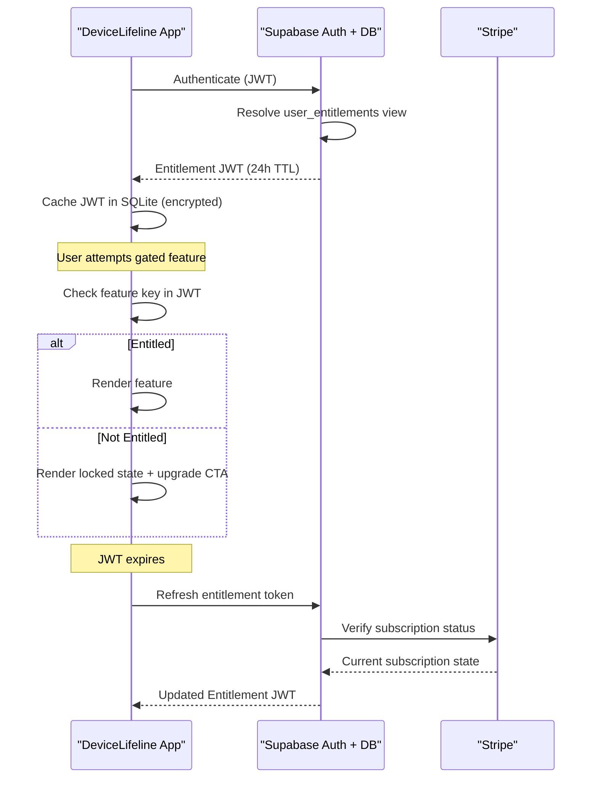

# 14. Subscription Plans

> Detailed plan matrix, feature entitlements, pricing, device/seat limits, and Stripe/Paystack product mapping for all five DeviceLifeline tiers. Part of the DeviceLifeline documentation suite — see [Documentation Index](README.md).

**Status:** Draft v1 · **Authoring role:** Principal PM (Monetization) · **Last updated:** 2026-06-07
**Related:** [13. Monetization Strategy](13-monetization-strategy.md), [17. Security Requirements](17-security-requirements.md), [34. API Specification](34-api-specification.md), [57. Business Edition Specification](57-business-edition-specification.md), [56. Technician Edition Specification](56-technician-edition-specification.md)

---

## 1. Purpose & Scope

This document specifies all five DeviceLifeline subscription plans in engineering-actionable detail: per-plan feature availability, quantitative limits, sample prices (monthly and annual), seat vs. device model, entitlement-to-feature mapping, and how each plan maps to payment-processor objects in Stripe and Paystack. This document is the authoritative entitlement reference for the billing subsystem, client-side feature gating, and the Supabase `entitlements` schema.

**In scope:** Plan definitions, feature matrices, pricing structure, limit tables, Stripe/Paystack product/price identifiers (illustrative — actual IDs assigned at account setup), entitlement enforcement model.

**Out of scope:** Pricing philosophy and upsell strategy (see [Monetization Strategy](13-monetization-strategy.md)), payment security (see [Security Requirements](17-security-requirements.md)), legal/compliance of billing (see [Compliance Requirements](18-compliance-requirements.md)).

---

## 2. Assumptions

- A1: Sample prices in this document are in USD and are planning targets, not launch commitments. Final prices require competitive validation prior to launch (see [Competitive Analysis](15-competitive-analysis.md)).
- A2: Annual pricing is presented as effective monthly cost (total annual ÷ 12) alongside a separate annual total.
- A3: Entitlement checking occurs server-side (Supabase) and is propagated to the client via a signed JWT with a 24-hour TTL; local SQLite caches the token for offline use.
- A4: The Technician and Business per-device prices are for managed/monitored client or fleet devices, not the technician's or admin's own device (which is included in base seat).
- A5: "AI queries" refers to AI Detective natural-language diagnostic queries routed through Supabase Edge Functions to OpenAI/Anthropic. Limits are per calendar month, resetting on the billing date.
- A6: "History retention" refers to the depth of Performance Timeline data stored in cloud sync. Local SQLite may retain more data (device-permitting) but cloud history is bounded by plan.
- A7: Stripe product/price IDs below use a readable naming convention; actual IDs will be alphanumeric strings assigned by Stripe at creation.

---

## 3. Plan Overview

### 3.1 Summary Table

| | Free | Pro | Developer | Technician | Business |
|---|---|---|---|---|---|
| **Price (monthly)** | $0 | $9.99/mo | $14.99/mo | From $29.99/mo | From $4.99/device/mo |
| **Price (annual, eff. monthly)** | $0 | $7.99/mo ($95.88/yr) | $11.99/mo ($143.88/yr) | From $23.99/mo | From $3.99/device/mo |
| **Devices included** | 1 | 3 | 5 | Seat + up to 25 client devices | Min 10 fleet devices |
| **History retention** | 30 days | 2 years | 5 years | 5 years | 7 years |
| **AI queries/month** | 0 | 30 | 100 | 150 | 200/device seat |
| **Seats (users)** | 1 | 1 | 1 | 1–3 (plan) | 5+ (role-based) |
| **Setup Restore** | No | Yes | Yes | Yes | Yes |
| **Performance Timeline** | No | Yes | Yes | Yes | Yes |
| **AI Detective** | No | Yes | Yes | Yes | Yes |
| **Developer Environment Sync** | No | No | Yes | No | No |
| **Technician Dashboard** | No | No | No | Yes | No |
| **Fleet Management** | No | No | No | No | Yes |
| **Priority Support** | No | No | No | Yes | Yes |
| **API Access** | No | No | No | No | Post-MVP |

---

## 4. Per-Plan Detail

### 4.1 Free Plan

**Target persona:** Casual consumer, first-time installer, cost-sensitive user.
**Purpose:** Acquisition, demonstration of core value.

#### Entitlements

| Feature | Entitlement Detail |
|---|---|
| Device DNA Snapshot | Yes — 1 device, on-demand only |
| Software inventory | Yes — current state only, no historical diffs |
| Hardware inventory | Yes — current state only |
| Basic health score | Yes — CPU, RAM, disk, battery (current reading) |
| Health trend history | No |
| Health alerts | No |
| Performance Timeline | No |
| AI Detective | No |
| Crash Intelligence | No |
| Recovery Center | No |
| Setup Export (manual) | Yes — single snapshot, manual trigger |
| Setup Restore | No |
| Cloud sync | No |
| Scheduled scans | No (manual only) |
| Browser/extension inventory | Yes — current state |
| Developer environment inventory | No |
| Multi-device management | No |
| Technician Dashboard | No |
| Fleet management | No |

#### Limits

| Limit | Value |
|---|---|
| Active devices | 1 |
| Cloud history | 30 days |
| AI queries/month | 0 |
| Snapshots stored (cloud) | 1 (latest only) |
| Scan frequency | On-demand only |
| Support | Community forum only |

#### Stripe/Paystack Mapping

| Processor | Object | Identifier (illustrative) |
|---|---|---|
| Stripe | Product | `prod_devicelifeline_free` |
| Stripe | Price | `price_free_usd` (amount: $0.00/month) |
| Paystack | Plan | `plan_free_ngn` (equivalent zero-charge) |

> Note: The Free plan is not billed but must exist as a Stripe Product for entitlement-state transitions (downgrades land here).

---

### 4.2 Pro Plan

**Target persona:** Individual consumer, gamer, power user, general enthusiast.
**Purpose:** Full single-user DeviceLifeline experience.

#### Pricing

| Billing Period | Price | Savings vs. Monthly |
|---|---|---|
| Monthly | $9.99/month | — |
| Annual | $95.88/year ($7.99/month effective) | ~20% |

#### Entitlements

| Feature | Entitlement Detail |
|---|---|
| Device DNA Snapshot | Yes — all managed devices, scheduled + on-demand |
| Software inventory | Yes — full history + diffs |
| Hardware inventory | Yes — full history + change detection |
| Basic health score | Yes |
| Health trend history | Yes — up to 2 years |
| Health alerts | Yes — configurable thresholds |
| Performance Timeline | Yes — full correlated timeline, 2 years |
| AI Detective | Yes — 30 queries/month |
| Crash Intelligence | Yes |
| Recovery Center | Yes |
| Setup Export | Yes — scheduled + manual |
| Setup Restore | Yes |
| Cloud sync | Yes |
| Scheduled scans | Yes — daily background scans |
| Browser/extension inventory | Yes — full history |
| Developer environment inventory | No |
| Multi-device management | Up to 3 devices |
| Email digest/reports | Weekly summary email |
| Priority Support | No |

#### Limits

| Limit | Value |
|---|---|
| Active devices | 3 |
| Cloud history | 2 years |
| AI queries/month | 30 |
| Concurrent sessions | 2 |
| Support | Email (48-hour SLA) |

#### Stripe/Paystack Mapping

| Processor | Object | Identifier (illustrative) |
|---|---|---|
| Stripe | Product | `prod_devicelifeline_pro` |
| Stripe | Price (monthly) | `price_pro_monthly_usd` ($9.99/month) |
| Stripe | Price (annual) | `price_pro_annual_usd` ($95.88/year) |
| Paystack | Plan (NGN monthly) | `plan_pro_monthly_ngn` (NGN equivalent at PPP rate) |
| Paystack | Plan (NGN annual) | `plan_pro_annual_ngn` |

---

### 4.3 Developer Plan

**Target persona:** Software developer, DevOps engineer, technical power user.
**Purpose:** Developer-layer inventory, environment replication, workstation templates.

#### Pricing

| Billing Period | Price | Savings vs. Monthly |
|---|---|---|
| Monthly | $14.99/month | — |
| Annual | $143.88/year ($11.99/month effective) | ~20% |

#### Entitlements

All Pro entitlements, plus:

| Feature | Entitlement Detail |
|---|---|
| Developer environment inventory | Yes — IDEs, SDKs, package managers, runtimes, CLI tools |
| Environment snapshot/restore | Yes — dev environment-specific restore |
| Workspace templates | Yes — create, export, import workstation templates |
| Package manager state tracking | Yes — npm global, pip, cargo, brew (post-MVP), choco, winget |
| AI Detective — developer context | Yes — dev-specific query enrichment (dependency conflicts, SDK versions) |
| AI queries/month | 100 |
| Active devices | 5 |
| Cloud history | 5 years |
| Priority AI queue | Yes — lower latency routing |
| Environment diff view | Yes — compare current env to snapshot |

#### Limits

| Limit | Value |
|---|---|
| Active devices | 5 |
| Cloud history | 5 years |
| AI queries/month | 100 |
| Workspace templates | 20 |
| Support | Email (24-hour SLA) |

#### Stripe/Paystack Mapping

| Processor | Object | Identifier (illustrative) |
|---|---|---|
| Stripe | Product | `prod_devicelifeline_developer` |
| Stripe | Price (monthly) | `price_developer_monthly_usd` ($14.99/month) |
| Stripe | Price (annual) | `price_developer_annual_usd` ($143.88/year) |
| Paystack | Plan (NGN monthly) | `plan_developer_monthly_ngn` |
| Paystack | Plan (NGN annual) | `plan_developer_annual_ngn` |

---

### 4.4 Technician Plan

**Target persona:** PC repair technician, IT freelancer, MSP engineer, computer repair shop.
**Purpose:** Multi-client device management, professional diagnostic reporting, repair workflow.

#### Pricing

Per-seat model with included client device slots. Additional device blocks purchasable as add-ons.

| Component | Monthly | Annual (effective/mo) |
|---|---|---|
| Base seat (1 technician user, includes 25 client device slots) | $29.99/mo | $23.99/mo ($287.88/yr) |
| Additional device block (+10 devices) | $9.99/mo add-on | $7.99/mo add-on |
| Additional technician seat | $14.99/mo/seat | $11.99/mo/seat |

#### Entitlements

All Pro entitlements (applied to technician's own device), plus:

| Feature | Entitlement Detail |
|---|---|
| Technician Dashboard | Yes — client device list, health summary, open issues |
| Client device management | Yes — up to 25 devices (base); expandable |
| Client Device DNA Snapshot | Yes — full snapshots per client device |
| Client Performance Timeline | Yes — 5 years per client device |
| Diagnostic Report generation | Yes — PDF/HTML reports for client handoff |
| White-label reports | No (post-MVP add-on) |
| Repair workflow notes | Yes — per-device notes, work log |
| Remote scan initiation | No (post-MVP) |
| Multi-technician access | Up to 3 seats (base plan) |
| AI Detective | Yes — 150 queries/month (shared across devices) |
| Client history retention | 5 years per client device |
| Priority support | Yes — 12-hour SLA |

#### Limits

| Limit | Value |
|---|---|
| Client devices (base) | 25 |
| Technician seats (base) | 3 |
| AI queries/month | 150 |
| Client history | 5 years |
| Report exports | Unlimited |
| Support | Email + priority (12-hour SLA) |

#### Stripe/Paystack Mapping

| Processor | Object | Identifier (illustrative) |
|---|---|---|
| Stripe | Product (base) | `prod_devicelifeline_technician` |
| Stripe | Price (monthly) | `price_technician_monthly_usd` ($29.99) |
| Stripe | Price (annual) | `price_technician_annual_usd` ($287.88) |
| Stripe | Price (device add-on monthly) | `price_technician_devices_addon_monthly` ($9.99/10 devices) |
| Stripe | Price (seat add-on monthly) | `price_technician_seat_addon_monthly` ($14.99/seat) |
| Paystack | Plan (NGN monthly) | `plan_technician_monthly_ngn` |

---

### 4.5 Business Plan

**Target persona:** SMB IT team, HR/onboarding, operations manager, internal IT admin.
**Purpose:** Fleet device management, software compliance, onboarding automation, asset visibility.

#### Pricing

Per-managed-device model with a minimum floor. Seat access for admin users is separate.

| Component | Monthly | Annual (effective/mo) |
|---|---|---|
| Per managed device (minimum 10 devices) | $4.99/device/mo | $3.99/device/mo |
| Admin seats (included) | 5 included | 5 included |
| Additional admin seat | $9.99/mo/seat | $7.99/mo/seat |

**Minimum monthly commitment:** $49.90 (10 devices × $4.99).

**Volume pricing (post-MVP):**

| Device Count | Per-Device Price (Monthly) | Per-Device Price (Annual) |
|---|---|---|
| 10–49 | $4.99 | $3.99 |
| 50–149 | $3.99 | $3.29 |
| 150–499 | $3.49 | $2.79 |
| 500+ | Custom (contact sales) | Custom |

#### Entitlements

All Pro entitlements (per enrolled device), plus:

| Feature | Entitlement Detail |
|---|---|
| Fleet Management Dashboard | Yes — all enrolled devices, health summary, alert triage |
| Device enrollment | Yes — agent deployment via installer package + enrollment token |
| Onboarding templates | Yes — deploy standard software config to new devices |
| Software compliance monitoring | Yes — flag devices missing required software or running non-compliant versions |
| Asset visibility | Yes — full hardware/software inventory across fleet |
| Role-Based Access Control (RBAC) | Yes — Admin, Viewer, Device Manager roles |
| AI Detective — fleet context | Yes — fleet-wide queries ("Which devices are running outdated drivers?") |
| AI queries/month | 200 per admin seat |
| Device history | 7 years |
| Bulk actions | Yes — bulk scan, bulk report |
| API access | Post-MVP |
| SSO / SAML | Post-MVP |
| Dedicated support | Priority + dedicated CSM (post-MVP for 100+ device accounts) |
| SLA | 8-hour response (email), 4-hour (for critical fleet issues, post-MVP) |

#### Limits

| Limit | Value |
|---|---|
| Minimum devices | 10 |
| Admin seats (base) | 5 |
| AI queries/month | 200/admin seat |
| Device history | 7 years |
| Concurrent API calls | Post-MVP defined |
| Support | Priority email + SLA |

#### Stripe/Paystack Mapping

| Processor | Object | Identifier (illustrative) |
|---|---|---|
| Stripe | Product | `prod_devicelifeline_business` |
| Stripe | Price (per device monthly) | `price_business_perdevice_monthly_usd` ($4.99/unit/month) |
| Stripe | Price (per device annual) | `price_business_perdevice_annual_usd` ($3.99/unit/month) |
| Stripe | Metered usage type | `usage_type: metered` — quantity = active device count |
| Stripe | Admin seat add-on | `price_business_seat_addon_monthly` ($9.99/seat) |
| Paystack | Plan | `plan_business_monthly_ngn` (per-device equivalent) |

> Stripe metered billing: At end of each billing period, Supabase reports actual active device count to Stripe via `POST /v1/subscription_items/{id}/usage_records`. Reconciliation job runs on the 28th of each month.

---

## 5. Feature Comparison Table (Full Matrix)

| Feature | Free | Pro | Developer | Technician | Business |
|---|---|---|---|---|---|
| **Inventory & Snapshots** | | | | | |
| Software inventory (current) | Yes | Yes | Yes | Yes | Yes |
| Software inventory (historical diffs) | No | Yes | Yes | Yes | Yes |
| Hardware inventory (current) | Yes | Yes | Yes | Yes | Yes |
| Hardware inventory (historical) | No | Yes | Yes | Yes | Yes |
| Browser / extension inventory | Current | Full | Full | Full | Full |
| Developer env inventory | No | No | Yes | No | No |
| Device DNA Snapshot (scheduled) | No | Yes | Yes | Yes | Yes |
| Device DNA Snapshot (on-demand) | Yes | Yes | Yes | Yes | Yes |
| **Health Intelligence** | | | | | |
| Basic health score | Yes | Yes | Yes | Yes | Yes |
| Health trend history | No | 2 yr | 5 yr | 5 yr | 7 yr |
| Health alerts (configurable) | No | Yes | Yes | Yes | Yes |
| Predictive failure alerts | No | Yes | Yes | Yes | Yes |
| GPU health monitoring | No | Yes | Yes | Yes | Yes |
| Battery health tracking | Yes | Yes | Yes | Yes | Yes |
| **Performance Timeline** | | | | | |
| Timeline (history depth) | No | 2 yr | 5 yr | 5 yr | 7 yr |
| Correlation engine | No | Yes | Yes | Yes | Yes |
| Change event annotations | No | Yes | Yes | Yes | Yes |
| **AI Detective** | | | | | |
| AI queries/month | 0 | 30 | 100 | 150 | 200/seat |
| Developer context enrichment | No | No | Yes | No | No |
| Fleet-wide AI queries | No | No | No | No | Yes |
| **Crash Intelligence** | | | | | |
| Crash log parsing | No | Yes | Yes | Yes | Yes |
| BSOD analysis | No | Yes | Yes | Yes | Yes |
| Driver failure detection | No | Yes | Yes | Yes | Yes |
| **Recovery Center** | | | | | |
| Setup Export (manual) | Yes | Yes | Yes | Yes | Yes |
| Setup Export (scheduled) | No | Yes | Yes | Yes | Yes |
| One-Click Setup Restore | No | Yes | Yes | Yes | Yes |
| Environment restore (dev tools) | No | No | Yes | No | No |
| Workspace templates | No | No | Yes (20) | No | No |
| **Cloud Sync** | | | | | |
| Cloud backup | No | Yes | Yes | Yes | Yes |
| Cloud history depth | 30 d | 2 yr | 5 yr | 5 yr | 7 yr |
| **Multi-Device & Team** | | | | | |
| Max own devices | 1 | 3 | 5 | Own device | Own device |
| Client/fleet devices | No | No | No | 25 base | Min 10 |
| Team seats | 1 | 1 | 1 | 3 base | 5 base |
| RBAC | No | No | No | Basic | Yes |
| **B2B Features** | | | | | |
| Technician Dashboard | No | No | No | Yes | No |
| Diagnostic reports (PDF/HTML) | No | No | No | Yes | No |
| Fleet Management Dashboard | No | No | No | No | Yes |
| Onboarding templates | No | No | No | No | Yes |
| Software compliance monitoring | No | No | No | No | Yes |
| Bulk scan / actions | No | No | No | No | Yes |
| API access | No | No | No | No | Post-MVP |
| SSO / SAML | No | No | No | No | Post-MVP |
| **Support** | | | | | |
| Community forum | Yes | Yes | Yes | Yes | Yes |
| Email support | No | 48 hr | 24 hr | 12 hr | Priority |
| Priority support | No | No | No | Yes | Yes |
| Dedicated CSM | No | No | No | No | Post-MVP (100+) |

---

## 6. Entitlement Model and In-App Enforcement

### 6.1 Entitlement Schema (Supabase)

The `user_entitlements` view (derived from `subscriptions`, `subscription_items`, and `plan_features` tables) resolves what a given user account is entitled to at any moment.

Illustrative schema shape:

```
user_entitlements view:
  user_id           uuid
  plan_id           text          -- 'free' | 'pro' | 'developer' | 'technician' | 'business'
  status            text          -- 'active' | 'trialing' | 'past_due' | 'cancelled'
  device_limit      integer       -- max own devices
  client_device_limit integer     -- max client/fleet devices (0 for consumer plans)
  history_years     integer       -- cloud history depth in years
  ai_queries_monthly integer      -- monthly query cap
  features          text[]        -- array of feature keys, e.g. ['performance_timeline', 'ai_detective', 'setup_restore']
  seats             integer       -- team seat count
  trial_ends_at     timestamptz
  current_period_end timestamptz
  processor         text          -- 'stripe' | 'paystack'
  processor_sub_id  text          -- Stripe subscription ID or Paystack sub code
```

### 6.2 Client-Side Entitlement Token

On successful authentication, Supabase issues a signed entitlement JWT:

```
{
  "sub": "<user_id>",
  "plan": "pro",
  "features": ["performance_timeline", "ai_detective", "setup_restore", "crash_intelligence", "health_alerts", "cloud_sync"],
  "device_limit": 3,
  "ai_queries_remaining": 28,
  "history_years": 2,
  "exp": <24h from issue>,
  "iat": <now>
}
```

- Token is stored in the local SQLite `auth_cache` table (encrypted at rest; see [Security Requirements](17-security-requirements.md)).
- On each app launch, the Rust agent validates token signature and expiry. If expired (>24h) and offline, the app operates in a degraded-entitlement mode (read-only history, no AI queries, no new syncs) for up to 72 hours before requiring re-authentication.
- On token refresh (online), the app fetches the latest entitlement from Supabase, updates the local cache, and re-renders any affected UI.

### 6.3 Feature Key Registry

| Feature Key | Plans Granting Access |
|---|---|
| `performance_timeline` | pro, developer, technician, business |
| `ai_detective` | pro, developer, technician, business |
| `setup_restore` | pro, developer, technician, business |
| `crash_intelligence` | pro, developer, technician, business |
| `health_alerts` | pro, developer, technician, business |
| `health_trends` | pro, developer, technician, business |
| `cloud_sync` | pro, developer, technician, business |
| `scheduled_scans` | pro, developer, technician, business |
| `developer_env_inventory` | developer |
| `workspace_templates` | developer |
| `env_restore` | developer |
| `technician_dashboard` | technician |
| `diagnostic_reports` | technician |
| `client_device_management` | technician |
| `fleet_management` | business |
| `onboarding_templates` | business |
| `software_compliance` | business |
| `fleet_ai_queries` | business |
| `rbac` | business |
| `api_access` | (post-MVP) business |

### 6.4 UI Enforcement Pattern

Feature-gated UI elements follow a consistent pattern:

1. **Locked state:** Feature UI is visible but rendered in a "locked" visual state (muted, lock icon).
2. **Contextual upgrade prompt:** Hovering or clicking a locked feature surfaces an inline upgrade card with the plan name and price, and a single CTA ("Upgrade to Pro — from $9.99/month").
3. **Trial CTA:** If the user has not yet used their trial, the CTA reads "Start 14-day free trial."
4. **Hard gate:** Attempting to execute a feature action (e.g., API call) without entitlement is rejected by the Supabase Edge Function with HTTP 402 (Payment Required) and a structured error body:

```json
{
  "error": "FEATURE_NOT_ENTITLED",
  "feature": "performance_timeline",
  "required_plan": "pro",
  "upgrade_url": "https://devicelifeline.com/upgrade"
}
```

---

## 7. Plan Transitions

### 7.1 Upgrade

- Immediate: upgraded entitlements take effect within one Supabase Edge Function invocation of Stripe webhook receipt (target <30 seconds).
- Proration: Stripe calculates prorated credit for remaining days on the current plan; the difference is charged immediately.

### 7.2 Downgrade

- Effective at end of current billing period (not immediate), unless user explicitly requests immediate downgrade.
- On immediate downgrade: data above new plan limits is frozen (read-only, not deleted) for 30 days to allow export.
- Client receives a downgrade notification event and UI refreshes entitlements.

### 7.3 Cancellation

- Effective at end of current billing period.
- Account transitions to Free plan at period end.
- Data above Free limits enters a 30-day read-only grace period, then is pruned to Free limits (local data not affected — only cloud sync data).
- Winback email sequence initiates 3 days post-cancellation (see [Monetization Strategy](13-monetization-strategy.md)).

### 7.4 Trial to Paid

- No-card trial: 14 days. At trial end, if no payment method added, account transitions to Free automatically.
- With card on file: transitions to paid automatically at trial end; user receives email notification 48 hours prior.

---

## Diagrams

### Plan Entitlement Resolution Flow



### Plan Transition State Machine

```mermaid
stateDiagram-v2
    [*] --> Free : Install + Register
    Free --> Trialing : Start 14-day trial
    Trialing --> Pro : Convert (add payment)
    Trialing --> Free : Trial expires (no conversion)
    Free --> Pro : Direct upgrade
    Pro --> Developer : Upgrade
    Pro --> Technician : Upgrade
    Pro --> Free : Downgrade / Cancel (period end)
    Developer --> Pro : Downgrade
    Developer --> Technician : Change plan
    Technician --> Business : Upgrade
    Technician --> Pro : Downgrade
    Business --> Technician : Downgrade
    Business --> Free : Cancel (period end)
    Pro --> PastDue : Payment failure
    PastDue --> Pro : Payment recovered
    PastDue --> Free : Retry window exceeded
```



---

## Risks & Mitigations

| Risk | Likelihood | Impact | Mitigation |
|---|---|---|---|
| Entitlement token out-of-sync after downgrade | Medium | High | Webhook handler marks token stale; client forced to refresh on next API call |
| Stripe metered usage reporting failure (Business plan) | Low | High | Supabase cron job re-reports usage daily; idempotency key prevents double-billing |
| Plan limits not enforced server-side (client bypass) | Medium | High | All feature-gated actions validate entitlement in Supabase Edge Function; client-side is display only |
| AI query count desync across devices | Medium | Medium | AI query count tracked server-side in `ai_usage` table per billing period; client reads from API |
| Paystack plan ID mismatch after API update | Low | Medium | Paystack plan IDs stored in environment config, not hardcoded; tested on staging before each release |
| Free → Paid conversion below target | Medium | High | PostHog funnel tracking; A/B test upgrade prompt placement within 60 days of launch |

---

## Future Considerations

- **Usage-based AI add-on:** When users consistently hit AI query limits, introduce a metered overage or query pack add-on rather than forcing full plan upgrade.
- **Family / multi-account plan:** A household plan (e.g., 5 devices, 1 account) is a natural extension of the Pro plan for multi-PC households.
- **Enterprise tier:** 100+ device accounts need custom contracts, dedicated infrastructure, SOC 2 compliance documentation, and procurement-compatible invoicing.
- **NFR for plan limit storage:** As device and user counts grow, `ai_usage` and `active_devices` tables will need time-series partitioning in Supabase Postgres.
- **Paystack additional markets:** Expand to Ghana, Kenya, Rwanda, Egypt as Paystack coverage grows.
- **Stripe Tax:** Enable Stripe Tax for automated VAT/GST calculation in EU, UK, Australia.

---

## Acceptance Criteria

- AC-PLANS-001: All five plans (Free, Pro, Developer, Technician, Business) are documented with per-feature entitlement detail.
- AC-PLANS-002: Each plan has a pricing table with both monthly and annual options and effective monthly cost stated.
- AC-PLANS-003: A Stripe Product and at least one Price object are named (illustratively) for each plan.
- AC-PLANS-004: Paystack Plans are named for all consumer plans in at least one African currency.
- AC-PLANS-005: The full feature comparison matrix covers all major feature categories and all five plans.
- AC-PLANS-006: The entitlement JWT schema is defined with all required fields.
- AC-PLANS-007: The feature key registry lists all gated features and the plans that unlock them.
- AC-PLANS-008: The UI enforcement pattern (locked state → upgrade prompt → hard gate with 402 error) is described.
- AC-PLANS-009: Plan transition flows (upgrade, downgrade, cancel, trial-to-paid) are documented.
- AC-PLANS-010: The Business plan metered billing mechanism (Stripe metered usage reporting) is described.
- AC-PLANS-011: Mermaid diagrams render without syntax errors.
