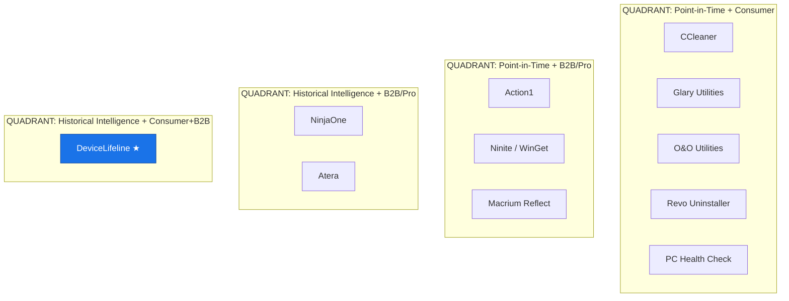
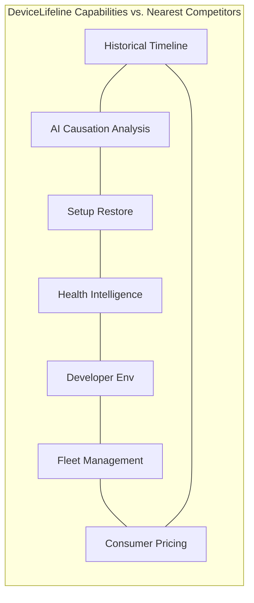
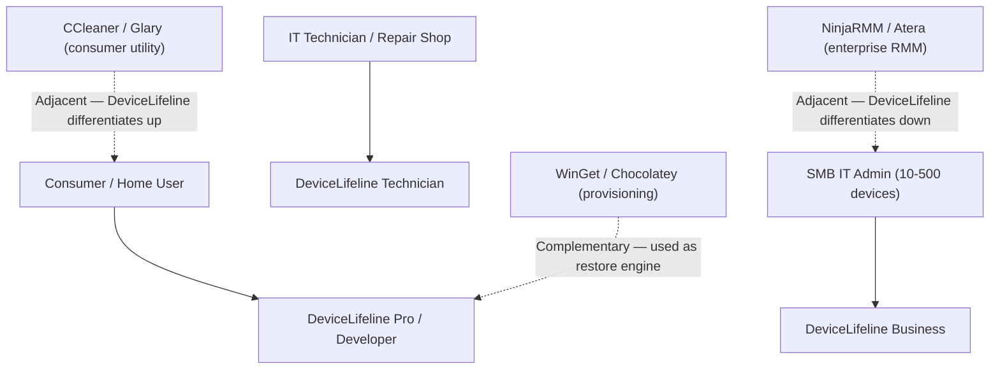

# 15. Competitive Analysis

> Positions DeviceLifeline against the relevant competitive landscape across consumer utilities, package managers, OEM diagnostics, browser sync tools, backup solutions, and RMM/fleet platforms. Part of the DeviceLifeline documentation suite — see [Documentation Index](README.md).

**Status:** Draft v1 · **Authoring role:** Competitive Strategist · **Last updated:** 2026-06-07
**Related:** [13. Monetization Strategy](13-monetization-strategy.md), [14. Subscription Plans](14-subscription-plans.md), [03. Product Requirements Document](03-product-requirements-document.md), [02. Product Vision](02-product-vision.md)

---

## 1. Purpose & Scope

This document defines DeviceLifeline's competitive position across the markets it intersects: consumer PC utilities, package management/provisioning tools, OEM health checks, browser/profile sync, disk imaging/backup, and professional RMM/fleet management platforms. It provides a feature comparison matrix, a positioning map, DeviceLifeline's differentiation thesis, and a SWOT analysis. The goal is to give the product, marketing, and sales teams a defensible, evidence-based competitive narrative.

**In scope:** Competitive product profiles, feature matrix, positioning analysis, SWOT, differentiation narrative.
**Out of scope:** Pricing of competitors in detail (competitive pricing intelligence is volatile and maintained separately), legal/IP comparison, reseller channel analysis.

---

## 2. Assumptions

- A1: Competitive landscape is assessed as of Q2 2026. The PC utility and RMM markets evolve rapidly; this document should be reviewed quarterly.
- A2: DeviceLifeline V1 targets Windows. Competitive positioning on macOS and Linux is deferred to those platform plans.
- A3: "RMM/fleet" competitors are addressed primarily in the context of the Technician and Business tiers; they are not direct consumer competitors.
- A4: AI-native features in competing products are assumed to be either absent or superficial in V1 competitive timeframe; this assumption should be revisited.
- A5: The competitive frame is defined by the problem DeviceLifeline solves ("understanding, restoring, and managing device lifecycle") not by any single feature category.

---

## 3. Competitive Landscape Overview

DeviceLifeline occupies a unique intersection of three problem spaces:

1. **PC optimization and diagnostics** (CCleaner, Glary Utilities, O&O)
2. **Software lifecycle and provisioning** (WinGet, Chocolatey, Ninite, Revo Uninstaller)
3. **Device lifecycle intelligence and fleet management** (NinjaOne, Atera, Action1 for B2B; PC Health Check for OEM)

No existing product occupies all three simultaneously, and none has the core differentiator: a **correlated historical Performance Timeline** paired with an **AI Detective** that explains causation. This is the competitive moat.

---

## 4. Competitor Profiles

### 4.1 CCleaner (Piriform / Avast)

**Category:** Consumer PC optimization/cleaning utility
**Strengths:** Brand recognition, 20+ year market presence, large install base, registry cleaning, junk file removal, startup manager, driver updater (premium), scheduled cleaning.
**Weaknesses:** Privacy concerns and trust damage (Avast data-selling controversy). No historical timeline. No causal analysis. Cleaning metaphor is increasingly questioned (registry cleaners have limited real-world impact). No setup restore or environment replication. Free version is substantially feature-locked.
**Business model:** Freemium; CCleaner Professional ($29.95/year); bundled AV upsell.
**DeviceLifeline contrast:** DeviceLifeline does not clean or delete files — it records, explains, and restores. The "cleaning" paradigm is reactive and destructive; DeviceLifeline's paradigm is historical, diagnostic, and constructive. CCleaner cannot answer "why did my PC slow down last week?"

### 4.2 Glary Utilities (Glarysoft)

**Category:** Consumer PC maintenance suite
**Strengths:** All-in-one suite (registry, junk, startup, uninstaller, disk analysis), freemium, low price point ($39.95/year Pro).
**Weaknesses:** No timeline. No AI. No setup restore. No developer tooling. Largely feature-equivalent to CCleaner. Low differentiation within its category. No cloud sync or cross-device management.
**DeviceLifeline contrast:** Glary Utilities is a collection of point-in-time maintenance tools; DeviceLifeline is a longitudinal intelligence platform.

### 4.3 O&O Software (O&O ShutUp10, O&O Defrag, O&O AppBuster)

**Category:** Windows privacy, defragmentation, and app management utilities
**Strengths:** Strong privacy/telemetry focus (ShutUp10 is well-regarded). O&O Defrag has deep disk optimization. German engineering pedigree and credibility with privacy-conscious users.
**Weaknesses:** Fragmented product portfolio (separate apps for each function). No historical intelligence. No AI. No setup restore. No cloud. No multi-device.
**DeviceLifeline contrast:** O&O addresses specific subsystems; DeviceLifeline is the unified operating memory layer. DeviceLifeline can learn from O&O's privacy messaging for the European market.

### 4.4 Revo Uninstaller (VS Revo Group)

**Category:** Application uninstaller and installer tracker
**Strengths:** Deep uninstall (leftover registry entries, files), forced uninstall, real-time install monitor (tracks what an installer writes), Hunter Mode.
**Weaknesses:** Single-purpose (uninstalling). No performance timeline. No AI. No setup restore or setup export. No cloud sync. No device history beyond install logs.
**DeviceLifeline contrast:** Revo's install monitor is interesting but limited to individual app events. DeviceLifeline correlates all change events — installs, driver updates, Windows updates, configuration changes — into a unified causal timeline.

### 4.5 Ninite / Chocolatey / WinGet (Package Management / Provisioning)

**Category:** Windows application provisioning and package management
**Strengths:**
- **Ninite:** Simple batch installer for common apps; zero-config; used by IT admins for quick setups.
- **Chocolatey:** Broad package registry; CLI-first; widely used in IT/DevOps environments; Chocolatey for Business adds management features.
- **WinGet:** Microsoft-native; integrated into Windows; growing package registry; CLI and manifest-based.
**Weaknesses:** None provide historical intelligence, diagnostics, or AI. Provisioning without monitoring. No timeline. No health intelligence. No configuration capture beyond app installation. WinGet lacks a management UI; Chocolatey for Business is complex to manage.
**DeviceLifeline contrast:** DeviceLifeline uses WinGet as a restore engine (not a competitor — it's a dependency). Ninite and Chocolatey solve "install apps fast"; DeviceLifeline solves "understand what changed, why performance degraded, and restore the full environment." These tools are complementary, not zero-sum. DeviceLifeline's restore engine can leverage WinGet/Chocolatey as back-ends.

### 4.6 PC Health Check (Microsoft)

**Category:** OEM/OS health and upgrade compatibility tool
**Strengths:** Built into Windows 11; zero cost; covers Windows Update readiness, TPM checks, basic performance metrics.
**Weaknesses:** Extremely limited scope (primarily Windows 11 upgrade gating). No history. No AI. No timeline. No diagnostics. No setup restore. No developer tooling. No B2B features. Not a general-purpose diagnostic tool.
**DeviceLifeline contrast:** PC Health Check is a Microsoft compliance tool. DeviceLifeline is a lifetime operating intelligence platform. Not a meaningful competitive threat but a signal that Microsoft is aware of the health-check category.

### 4.7 Browser / Profile Sync Tools (Chrome Sync, Edge Sync, Firefox Sync)

**Category:** Browser profile synchronization
**Strengths:** Native to browsers; zero-cost; syncs bookmarks, extensions, passwords, tabs across devices.
**Weaknesses:** Browser-siloed — only syncs browser data, not system environment, installed apps, or OS configuration. No diagnostics. No history beyond browser data. Cannot restore a full workstation.
**DeviceLifeline contrast:** Browser sync is a component of what DeviceLifeline captures (browser environment inventory), not a competitor to the full platform. DeviceLifeline records browser extension state as part of the Device DNA Snapshot.

### 4.8 Macrium Reflect (Paramount Software)

**Category:** Disk imaging and backup
**Strengths:** Gold standard for Windows disk imaging; bare-metal restore; incremental/differential backups; highly reliable for full system restore.
**Weaknesses:** Block-level backup is expensive in storage; restores replace the entire disk state, not selective configuration; no intelligence layer (cannot explain what changed or why); no AI; no performance timeline; no developer environment awareness; not suited for "move to a new PC" scenarios (image is hardware-dependent without P2V).
**DeviceLifeline contrast:** Macrium Reflect is a disaster recovery / full backup tool. DeviceLifeline is a configuration intelligence and selective restore tool. They are complementary: Macrium for full disk recovery; DeviceLifeline for understanding what changed and selectively restoring a software/configuration environment. DeviceLifeline should recommend backup tools alongside its own restore capabilities.

### 4.9 NinjaOne (formerly NinjaRMM)

**Category:** Professional RMM (Remote Monitoring and Management)
**Target market:** MSPs, IT departments (50–5,000 endpoints)
**Strengths:** Comprehensive RMM feature set (remote control, patch management, scripting, ticketing integration, endpoint monitoring, backup, AV integration). Strong MSP ecosystem. Mature product.
**Weaknesses:** Enterprise pricing ($3–6/device/month with significant minimum commitments); complex onboarding; not designed for consumer use or individual technicians; no AI-native diagnostics; no Performance Timeline concept; no setup restore for individuals; overkill for SMB and consumer.
**DeviceLifeline contrast:** NinjaOne is positioned above DeviceLifeline's Technician/Business tiers in complexity and price. DeviceLifeline's Technician Edition targets the single/small-shop technician who cannot afford or justify NinjaRMM. DeviceLifeline's Business Edition targets SMB internal IT (10–500 devices) where NinjaRMM is overkill.

### 4.10 Atera

**Category:** All-in-one RMM + PSA for MSPs
**Target market:** MSPs, IT service providers
**Strengths:** All-in-one (RMM + ticketing + billing + remote access); fixed pricing per technician (not per endpoint — a key differentiator in the MSP market); AI Co-Pilot for ticket triage.
**Weaknesses:** Per-technician pricing scales poorly for large MSPs; remote access integrated but sometimes criticised for reliability; not consumer-facing; no performance causation analysis; AI is focused on ticket management, not device diagnostics.
**DeviceLifeline contrast:** Atera's per-technician pricing model is interesting but its scope is MSP workflow management (tickets, billing, remote access). DeviceLifeline's Technician Edition focuses on device intelligence (history, diagnostics, AI Detective, reports) rather than full MSP workflow. Potential future integration story: DeviceLifeline as a diagnostic plugin for Atera.

### 4.11 Action1

**Category:** Cloud-based patch management and RMM
**Target market:** IT admins, SMB and enterprise, patch management-focused
**Strengths:** Strong patch management; free tier for up to 200 endpoints (aggressive acquisition strategy); cloud-native; simple deployment.
**Weaknesses:** Primarily patch-focused; limited diagnostics depth; no performance timeline; no AI Detective; no setup restore; no developer environment awareness.
**DeviceLifeline contrast:** Action1's free-up-to-200-endpoints model is notable as a competitive pressure on DeviceLifeline's Business tier pricing. However, Action1 solves patch compliance, not device intelligence. DeviceLifeline complements Action1 in that DeviceLifeline can explain why a patch caused performance degradation.

---

## 5. Feature Comparison Matrix

| Feature | DeviceLifeline | CCleaner | Glary | O&O | Revo | WinGet/Ninite | PC Health Check | Macrium | NinjaOne | Atera | Action1 |
|---|---|---|---|---|---|---|---|---|---|---|---|
| **Performance Timeline (historical)** | Yes | No | No | No | No | No | No | No | No | No | No |
| **AI-native diagnostics / causation** | Yes | No | No | No | No | No | No | No | Limited | Ticket AI only | No |
| **Device DNA Snapshot** | Yes | No | No | No | No | No | No | No | Limited | No | No |
| **Setup Restore (apps + config)** | Yes | No | No | No | No | Partial (apps only) | No | Partial (image) | No | No | No |
| **Software inventory (historical)** | Yes | No | No | No | Partial | No | No | No | Yes | Yes | Yes |
| **Crash Intelligence / BSOD analysis** | Yes | No | No | No | No | No | No | No | Partial | No | No |
| **Health Intelligence + alerts** | Yes | Partial | Partial | No | No | No | Partial | No | Yes | Yes | Yes |
| **Developer env inventory/restore** | Yes (Dev+) | No | No | No | No | Partial | No | No | No | No | No |
| **Multi-device (consumer)** | Yes | No | No | No | No | No | No | No | N/A | N/A | N/A |
| **Fleet management (B2B)** | Yes | No | No | No | No | No | No | No | Yes | Yes | Yes |
| **Remote access / control** | No (post-MVP) | No | No | No | No | No | No | No | Yes | Yes | Yes |
| **Patch management** | No (post-MVP) | No | No | No | No | No | No | No | Yes | Yes | Yes |
| **Ticketing / PSA** | No | No | No | No | No | No | No | No | Partial | Yes | No |
| **Registry cleaning / junk removal** | No (by design) | Yes | Yes | Yes | Partial | No | No | No | No | No | No |
| **Disk imaging / bare-metal restore** | No | No | No | No | No | No | No | Yes | No | No | No |
| **Cloud sync of device history** | Yes | No | No | No | No | No | No | No | No | No | No |
| **Natural language query interface** | Yes | No | No | No | No | No | No | No | No | No | No |
| **Consumer pricing (individual)** | $0–$14.99/mo | $29.95/yr | $39.95/yr | ~$30–50/yr | $24.95/yr | Free | Free | $69.95/yr | N/A | N/A | N/A |
| **B2B pricing** | $4.99/device/mo | No | No | No | No | No | No | No | ~$3–6/device/mo | Per tech | Free (≤200) |
| **Windows first-class** | Yes | Yes | Yes | Yes | Yes | Yes | Yes | Yes | Yes | Yes | Yes |
| **Open-source / free (limited)** | Free tier | Freemium | Freemium | Free | Freemium | WinGet free | Free | Freemium | No | Trial | Free (≤200) |

---

## 6. Positioning Map

DeviceLifeline is positioned on two axes:
- **X-axis:** Point-in-time tool → Longitudinal/historical intelligence
- **Y-axis:** Consumer-only → B2B / professional



**Narrative:** DeviceLifeline is the only product that combines deep historical intelligence (Performance Timeline, correlated change events, AI causation analysis) with a consumer-accessible pricing model while also extending into B2B via the Technician and Business Editions. NinjaOne/Atera have historical data but are complex, expensive, and consumer-inaccessible. CCleaner and peers have broad consumer reach but zero longitudinal intelligence. DeviceLifeline owns the unoccupied quadrant.

---

## 7. DeviceLifeline Differentiation Thesis

### 7.1 The "Operating Memory" Concept

Every competing product answers one of these questions in isolation:
- "What's on my PC right now?" (inventory tools)
- "How do I clean/speed up my PC?" (optimization tools)
- "How do I install software faster?" (package managers)
- "How do I back up my PC?" (backup tools)
- "How do I manage my fleet?" (RMM tools)

DeviceLifeline is the first product that answers the question every PC user eventually asks: **"What happened to my computer?"**

This is the "operating memory" concept: the computer remembers its own history, explains its own changes, and can restore itself to any prior state. This is not incrementally better than existing tools; it is a categorically different product.

### 7.2 The Triad Moat

DeviceLifeline's defensibility rests on three interlocking capabilities that individually could be copied but are extremely difficult to replicate together:

```
Performance Timeline  +  AI Detective  +  Device DNA Engine
        ↓                     ↓                  ↓
"What changed"         "Why it mattered"   "What the device is"
        ↓_____________↓_______________↓
              = Device Operating Memory
```

Any competitor attempting to replicate one pillar without the others produces an inferior product:
- A timeline without AI is just a log file viewer.
- AI without timeline data lacks the temporal context to explain causation (it hallucinates).
- Device DNA without timeline is a one-time snapshot with no continuity.

### 7.3 Category-Creation Strategy

DeviceLifeline should NOT market against CCleaner or PC utilities. It should create a new category: **Computer Operating Intelligence**. The competitive framing is:

- NOT "a better PC cleaner"
- NOT "a smarter antivirus"
- IS "the memory your computer never had"
- IS "the only tool that explains why your PC is slow, not just that it is"

This positions DeviceLifeline above the utility category, commands higher pricing, and makes direct feature comparisons with CCleaner irrelevant.

---

## 8. SWOT Analysis

### Strengths

| # | Strength |
|---|---|
| S1 | Unique combination of Performance Timeline + AI Detective — no direct competitor |
| S2 | Category-creating positioning ("operating memory") is defensible and narrative-friendly |
| S3 | Lightweight Tauri/Rust architecture — low system footprint vs. bloated competitors |
| S4 | Privacy-first design (local SQLite as source of truth, opt-in telemetry) appeals to privacy-conscious users in an era of data scandals (cf. CCleaner/Avast) |
| S5 | Covers consumer and B2B within a single product — unusually broad TAM |
| S6 | AI integration is architecture-first (Edge Function routing, not bolted-on chatbot) |
| S7 | Open extension points (WinGet integration, future Homebrew/apt) vs. proprietary install mechanisms |

### Weaknesses

| # | Weakness |
|---|---|
| W1 | No established brand — CCleaner has 20+ years; NinjaRMM has deep MSP relationships |
| W2 | AI Detective quality depends on OpenAI/Anthropic; latency and cost are external risks |
| W3 | Windows-only at launch limits TAM for developer persona (many use macOS) |
| W4 | No remote access / control — limits Technician Edition vs. full RMM platforms |
| W5 | No patch management at launch — Business Edition lacks a core IT function |
| W6 | Cold-start problem: Performance Timeline requires sustained installation to generate insights (Day 0 experience is less compelling) |
| W7 | B2B sales motion (Technician, Business) requires different customer acquisition than consumer |

### Opportunities

| # | Opportunity |
|---|---|
| O1 | Privacy-backlash against Avast/CCleaner creates market opening for trust-first positioning |
| O2 | AI PC narrative (Copilot+, Microsoft AI features) primes users to expect AI in utility software |
| O3 | Remote-work permanence means individuals manage their own devices without IT support → underserved consumer pain |
| O4 | African tech market growth + Paystack integration for a severely underserved region |
| O5 | Developer persona is underserved — no tool understands the dev environment holistically |
| O6 | RMM market consolidation (NinjaOne, Atera acquisitions) leaves the SMB/micro-shop segment poorly served |
| O7 | Microsoft's deprecation of legacy tools (e.g., PC Health Check limitations) creates a vacuum |

### Threats

| # | Threat |
|---|---|
| T1 | Microsoft could integrate deeper PC intelligence into Windows itself (Recall feature precedent) |
| T2 | CCleaner / Avast could attempt to rebuild trust and add AI features |
| T3 | NinjaOne or Atera could develop a lower-cost consumer-adjacent tier |
| T4 | OpenAI / Anthropic API cost inflation could destroy unit economics of AI Detective |
| T5 | Anti-malware tools (Defender, ESET) expanding into configuration monitoring could add competitive pressure |
| T6 | Microsoft Store policy changes could restrict privileged agent capabilities (required for Rust core) |
| T7 | Developer persona shift to cloud-based dev environments (GitHub Codespaces) could reduce local workstation value |

---

## 9. Go-to-Market Competitive Messaging

| Audience | Competitive Hook | Key Message |
|---|---|---|
| Consumer (casual) | CCleaner / Glary users | "Don't just clean your PC — understand it. CCleaner can't tell you why your PC got slow. DeviceLifeline can." |
| Consumer (power/gamer) | Frustrated troubleshooters | "You shouldn't need a forum post to find out that your GPU driver update broke your FPS. DeviceLifeline finds it for you." |
| Developer | Missing workstation backup | "Reinstalling your dev environment after a crash shouldn't take a day. DeviceLifeline snapshots it and restores it in minutes." |
| Technician | NinjaRMM too expensive | "You don't need a $200/month RMM platform for your repair shop. DeviceLifeline Technician Edition is built for you." |
| Business IT | Action1 patch-focused | "Action1 tells you if patches are installed. DeviceLifeline tells you what those patches did to your performance." |

---

## Diagrams

### Competitive Feature Coverage Radar (Conceptual)



### Market Segment Map



---

## Risks & Mitigations

| Risk | Likelihood | Impact | Mitigation |
|---|---|---|---|
| Microsoft Recall / Windows AI features directly compete | Medium | High | Monitor Microsoft AI PC roadmap; emphasize cross-device, cross-OS, and B2B capabilities Microsoft cannot provide natively |
| CCleaner rebuilds trust and adds AI timeline features | Low | High | Maintain 12–18 month feature development lead; build network effects (device history is sticky data) |
| Competitive analysis is stale within 6 months | High | Medium | Quarterly competitive review; assign competitive intelligence owner |
| NinjaOne launches a SMB-accessible tier | Low | Medium | Accelerate Business Edition differentiation (AI Detective for fleet, developer-awareness) |
| Action1's free-200-endpoint tier pressures Business pricing | Medium | Medium | Emphasize intelligence differentiation; Action1 does not explain causation |

---

## Future Considerations

- **macOS competitive analysis:** Once macOS development begins, analyze iStatMenus, CleanMyMac X, Homebrew, and Jamf (enterprise) as additional competitors.
- **AI PC competitors:** As Microsoft Copilot+ features mature, continuously assess overlap with Performance Timeline and AI Detective.
- **Integration partners vs. competitors:** WinGet, Chocolatey, and Ninite are better positioned as integration partners (restore engine back-ends) than competitors. Formalize partnership narrative post-MVP.
- **Analyst relations:** Target G2, Capterra, and Product Hunt as visibility channels where DeviceLifeline can establish category leadership before incumbents respond.

---

## Acceptance Criteria

- AC-COMP-001: All eleven competitor categories (CCleaner, Glary, O&O, Revo, Ninite/Choco/WinGet, PC Health Check, browser sync, Macrium, NinjaOne, Atera, Action1) are profiled.
- AC-COMP-002: The feature comparison matrix covers at least 15 features across all competitors.
- AC-COMP-003: DeviceLifeline's differentiation thesis (operating memory / triad moat) is articulated.
- AC-COMP-004: A SWOT analysis with at least 4 items per quadrant is present.
- AC-COMP-005: Competitive messaging by audience segment (consumer, developer, technician, business) is documented.
- AC-COMP-006: The positioning quadrant is represented in a Mermaid diagram.
- AC-COMP-007: The document cross-links to [Monetization Strategy](13-monetization-strategy.md) and [Subscription Plans](14-subscription-plans.md).
- AC-COMP-008: A quarterly review cadence for competitive intelligence is recommended.
