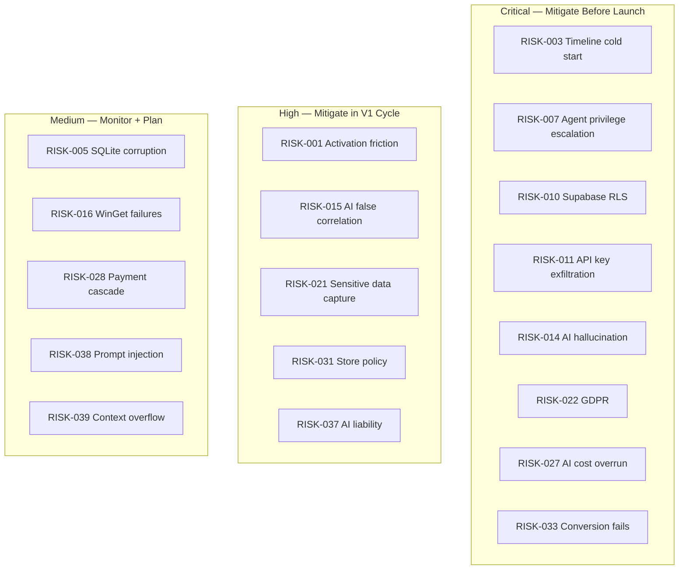

# 16. Risk Analysis

> Comprehensive risk register covering product, technical, security, privacy, market, operational, legal/compliance, and AI-specific risks for DeviceLifeline, with likelihood/impact ratings and mitigations. Part of the DeviceLifeline documentation suite — see [Documentation Index](README.md).

**Status:** Draft v1 · **Authoring role:** Principal PM (Monetization) + Security Architect · **Last updated:** 2026-06-07
**Related:** [17. Security Requirements](17-security-requirements.md), [18. Compliance Requirements](18-compliance-requirements.md), [19. Privacy Requirements](19-privacy-requirements.md), [13. Monetization Strategy](13-monetization-strategy.md), [22. AI Diagnostics Design](22-ai-diagnostics-design.md)

---

## 1. Purpose & Scope

This document is the master risk register for DeviceLifeline. It enumerates risks across eight domains — product, technical, security, privacy, market, operational, legal/compliance, and AI-specific — and assigns each risk a stable identifier (RISK-###), likelihood, impact, mitigation strategy, and owner role. The register informs sprint planning, architecture decisions, compliance posture, and investor/stakeholder risk disclosures.

**In scope:** All risks relevant to V1 MVP and the post-MVP roadmap at a planning-horizon level. Risks are documented regardless of current mitigation status.
**Out of scope:** Incident response procedures (see [Security Requirements](17-security-requirements.md)), disaster recovery (see Disaster Recovery Plan doc 42), detailed compliance procedures (see [Compliance Requirements](18-compliance-requirements.md)).

---

## 2. Assumptions

- A1: Likelihood and impact ratings are qualitative (Low / Medium / High) based on expert judgment at time of writing. Ratings should be reviewed quarterly and updated with empirical data as the product matures.
- A2: "Owner" refers to the functional role accountable for mitigation, not a named individual.
- A3: Risks are assessed relative to V1 MVP launch and near-term post-MVP horizon (0–18 months).
- A4: The Rust privileged agent operating on end-user Windows machines is treated as the highest-privilege component and warrants the most security-focused risk entries.
- A5: AI risks (hallucinated diagnoses, false correlations) are classified separately because they have unique disclosure and liability implications.

---

## 3. Risk Rating Definitions

| Likelihood | Definition |
|---|---|
| Low | Unlikely in normal operating conditions; would require multiple failures or unlikely external events |
| Medium | Plausible; could occur under foreseeable conditions without active mitigation |
| High | Likely to occur at some point without mitigation; well-precedented in similar products |

| Impact | Definition |
|---|---|
| Low | Minor disruption; recoverable quickly; no user harm or reputational damage |
| Medium | Noticeable disruption; moderate user harm; reputational concern; recoverable with effort |
| High | Severe disruption; significant user harm, legal exposure, or reputational damage; may threaten product viability |

---

## 4. Risk Matrix

```mermaid
graph TD
    subgraph "HIGH IMPACT"
        subgraph "HIGH Likelihood"
            R014["RISK-014: AI hallucination (diagnostic)"]
            R003["RISK-003: Performance Timeline cold start"]
            R027["RISK-027: AI API cost overrun"]
        end
        subgraph "MEDIUM Likelihood"
            R007["RISK-007: Rust agent privilege escalation"]
            R010["RISK-010: Supabase RLS misconfiguration"]
            R022["RISK-022: GDPR non-compliance"]
            R031["RISK-031: Microsoft Store policy block"]
            R033["RISK-033: Free→Paid conversion fails"]
        end
        subgraph "LOW Likelihood"
            R008["RISK-008: Supply-chain attack (crates/npm)"]
            R011["RISK-011: AI key exfiltration"]
            R025["RISK-025: Microsoft Recall competes directly"]
        end
    end
    subgraph "MEDIUM IMPACT"
        subgraph "HIGH Likelihood"
            R001["RISK-001: Activation friction (cold-start UX)"]
            R015["RISK-015: AI false correlation"]
            R028["RISK-028: Stripe payment failure cascade"]
        end
        subgraph "MEDIUM Likelihood"
            R005["RISK-005: SQLite corruption"]
            R016["RISK-016: WinGet restore failure"]
            R023["RISK-023: CCPA right-to-delete failure"]
            R029["RISK-029: Churn spike on price change"]
            R035["RISK-035: PostHog data leak"]
        end
        subgraph "LOW Likelihood"
            R009["RISK-009: Tauri IPC injection attack"]
            R030["RISK-030: Paystack webhook unreliable"]
        end
    end
    subgraph "LOW IMPACT"
        subgraph "HIGH Likelihood"
            R002["RISK-002: Poor Day-0 experience"]
            R020["RISK-020: Competitive analysis staleness"]
        end
        subgraph "MEDIUM Likelihood"
            R006["RISK-006: Background agent CPU/RAM overhead"]
            R017["RISK-017: Chocolatey/WinGet package unavailable"]
        end
        subgraph "LOW Likelihood"
            R019["RISK-019: Tauri webview zero-day"]
            R024["RISK-024: Paystack regional downtime"]
        end
    end
```

---

## 5. Product Risks

| ID | Risk | Likelihood | Impact | Mitigation | Owner |
|---|---|---|---|---|---|
| RISK-001 | **Activation friction:** New users don't reach a "moment of belief" within 7 days; churn before experiencing core value. The Performance Timeline requires days of data accumulation before it becomes meaningful. | High | Medium | Design Day-0 flow to surface partial value immediately (snapshot, health score, software inventory) even before timeline is populated. Day-7 nudge campaign. Instrument funnel in PostHog; iterate within 60 days of launch. | Product |
| RISK-002 | **Poor Day-0 experience:** Initial Device DNA Snapshot takes longer than expected on slow hardware or large software inventories, leading to user abandonment. | High | Low | Show a live progress indicator with item counts. Cap initial scan time to 5 minutes for MVP; deeper scans run in background. A/B test scan messaging. | Product / Engineering |
| RISK-003 | **Performance Timeline cold-start:** The timeline's core value (correlations, AI-powered causation) requires weeks of data. Users who evaluate quickly may not see the differentiating value and conclude the product is unremarkable. | High | High | Seed the timeline with historical data where available (Event Viewer history, Windows Update history, MSI install logs). Show "historical import" as a day-0 win. Clearly communicate the "data flywheel" — value improves over time. | Product |
| RISK-004 | **Feature scope creep:** The feature breadth (9 pillars) creates pressure to expand V1 beyond MVP. Late features delay launch and dilute quality. | Medium | Medium | Enforce MVP boundary strictly in sprint planning. Maintain a "post-MVP parking lot" in product roadmap. Product owner has veto on scope additions within a quarter. | Product |
| RISK-005 | **SQLite data corruption:** Local SQLite database corrupted by abrupt shutdown, OS crash, or hardware failure. Loss of device history is a high-trust violation for a product whose value proposition is history. | Medium | Medium | WAL mode for SQLite. Daily integrity checks via Rust agent. Cloud sync as recovery path. Export / backup reminder in UI. Document recovery procedure. | Engineering |
| RISK-006 | **Agent performance overhead:** Background Rust agent uses excessive CPU/RAM during scan cycles, degrading the very performance it is monitoring. | Medium | Low | Benchmark agent overhead during development (target <2% CPU avg, <100MB RAM). Adaptive scan scheduling (reduce frequency during high system load). User-configurable scan scheduling. | Engineering |

---

## 6. Technical Risks

| ID | Risk | Likelihood | Impact | Mitigation | Owner |
|---|---|---|---|---|---|
| RISK-007 | **Rust agent privilege escalation:** The system-level Rust agent runs with elevated Windows privileges (required for hardware/driver access, WMI queries, etc.). A vulnerability in the agent code could be exploited for privilege escalation to SYSTEM. | Medium | High | Least-privilege design: request only the specific Windows capabilities needed (see [Security Requirements](17-security-requirements.md), SEC-001 through SEC-010). Code review for all WinAPI calls. Static analysis (cargo-audit, clippy). Fuzz testing of input parsers. Signed binaries only. See RISK-008. | Security / Engineering |
| RISK-008 | **Supply-chain attack (Rust crates / npm):** A malicious dependency introduced via a compromised crate or npm package could execute arbitrary code in the agent or UI context. | Low | High | Pin all dependency versions in `Cargo.lock` and `package-lock.json`. Run `cargo-audit` and `npm audit` in CI. Review all direct dependency additions in code review. Subscribe to GitHub Security Advisories for key crates. Consider reproducible builds. | Engineering / Security |
| RISK-009 | **Tauri IPC injection:** Malicious input passed through Tauri IPC commands could trigger command injection or expose Rust APIs to the webview. | Low | Medium | Strict input validation on all Tauri command handlers (see [Security Requirements](17-security-requirements.md), SEC-020). Allowlist-based Tauri command surface. UI rendered in sandboxed webview; JS cannot directly call system APIs. | Engineering / Security |
| RISK-010 | **Supabase RLS misconfiguration:** Incorrectly configured Row-Level Security policies in Supabase Postgres could allow one user to read another user's device data, snapshots, or subscription state. | Medium | High | RLS is mandatory for all user-data tables (no exceptions). RLS policies reviewed in code review. Automated integration tests assert cross-user data isolation. Security audit of RLS policies prior to launch. See [Security Requirements](17-security-requirements.md), SEC-030. | Engineering / Security |
| RISK-011 | **AI API key exfiltration:** OpenAI/Anthropic API keys inadvertently shipped in the client binary, UI bundle, or environment config could be extracted and abused, leading to financial exposure and potential data leakage. | Low | High | API keys are **never in the client**. All LLM calls route through Supabase Edge Functions. Edge Function secrets managed via Supabase Vault. Regular audit of build artifacts for credential strings. See [Security Requirements](17-security-requirements.md), SEC-015. | Engineering / Security |
| RISK-012 | **Tauri auto-update vulnerability:** The auto-update mechanism could be hijacked to deliver a malicious binary if the update server is compromised or if update integrity verification is absent. | Low | High | Code signing for all binaries (Windows Authenticode). Update manifests signed separately. Verify signature before applying update. HTTPS-only update channel. See [Security Requirements](17-security-requirements.md), SEC-025. | Engineering / Security |
| RISK-013 | **Supabase outage or service degradation:** DeviceLifeline's cloud features (sync, AI Detective, entitlement checks) depend on Supabase availability. Extended outage degrades or blocks key features. | Low | Medium | Offline-first design: local SQLite is source of truth; cloud sync is async and non-blocking. Entitlement JWT cached locally for 24h (72h degraded mode). Monitor Supabase status; alert on latency spikes via Sentry. Evaluate Supabase uptime SLA for Business Edition. | Engineering / Operations |
| RISK-016 | **WinGet / restore failure:** Setup Restore depends on WinGet (and optionally Chocolatey) to reinstall applications. WinGet package unavailability, version conflicts, or installer errors cause restore failures. | Medium | Medium | Validate WinGet package availability at snapshot time (warn if a package is not in WinGet registry). Provide fallback to direct download URL for known packages. Present restore as "best-effort" with a post-restore validation checklist. Log restore errors per package. | Engineering / Product |
| RISK-017 | **Package unavailable at restore time:** An app snapshotted in a Device DNA was available in WinGet at snapshot time but has been removed or renamed by restore time. | Medium | Low | Store package manifest (name, version, publisher URL, alternate install method) at snapshot time. Flag unresolvable packages in restore preview UI. Allow manual install path override. | Engineering |

---

## 7. Security Risks

See [Security Requirements](17-security-requirements.md) for full STRIDE threat model and SEC-### controls. The following summarizes the highest-priority security risks for the risk register.

| ID | Risk | Likelihood | Impact | Mitigation | Owner |
|---|---|---|---|---|---|
| RISK-007 | Rust agent privilege escalation | Medium | High | (See Section 6 above) | Security |
| RISK-008 | Supply-chain attack | Low | High | (See Section 6 above) | Security |
| RISK-009 | Tauri IPC injection | Low | Medium | (See Section 6 above) | Security |
| RISK-010 | Supabase RLS misconfiguration | Medium | High | (See Section 6 above) | Security |
| RISK-011 | AI API key exfiltration | Low | High | (See Section 6 above) | Security |
| RISK-012 | Auto-update vulnerability | Low | High | (See Section 6 above) | Security |
| RISK-018 | **Session token theft:** A stolen Supabase JWT could allow an attacker to access a user's device history, snapshots, and subscription state. | Low | High | Short JWT TTL (1h for access tokens); refresh token rotation. Device binding on session (user-agent + IP heuristics). Revoke-all-sessions feature. MFA option (post-MVP). | Security |
| RISK-019 | **Tauri webview zero-day:** A zero-day in the underlying OS webview (WebView2 on Windows) could be exploited to break the sandboxing and access Rust APIs. | Low | Medium | Keep WebView2 updated via Windows Update dependency. Monitor CVEs for WebView2. Tauri IPC allowlist minimizes attack surface. | Engineering |
| RISK-020 | **PostHog analytics data breach:** PostHog product analytics event data could be exfiltrated if PostHog is compromised or misconfigured, revealing user behavior patterns. | Low | Medium | PostHog is opt-in (privacy-first; see [Privacy Requirements](19-privacy-requirements.md)). Events are anonymized at collection. No PII in PostHog event payloads (device fingerprinting uses salted hashes). | Privacy / Engineering |

---

## 8. Privacy Risks

See [Privacy Requirements](19-privacy-requirements.md) and [Compliance Requirements](18-compliance-requirements.md) for full privacy controls.

| ID | Risk | Likelihood | Impact | Mitigation | Owner |
|---|---|---|---|---|---|
| RISK-021 | **Sensitive data in snapshots:** Device DNA Snapshots may capture sensitive information inadvertently — environment variables (API keys, passwords), browser extension data, or file paths containing PII. | Medium | High | Scan configuration: explicitly exclude environment variable values (capture names only, not values). Browser extension inventory captures IDs and names, not user data. File path collection excludes user home directory contents. Privacy review of snapshot schema pre-launch. See [Privacy Requirements](19-privacy-requirements.md). | Privacy / Engineering |
| RISK-022 | **GDPR non-compliance:** Processing EU user data without proper legal basis, failing to honor data subject rights (erasure, portability), or lacking adequate DPAs with sub-processors could result in GDPR fines. | Medium | High | Establish legal basis (contract performance for core features; consent for analytics). Implement data subject rights workflows (right to erasure, portability). Sign DPAs with all sub-processors (OpenAI, Anthropic, Supabase, Stripe, Paystack, PostHog, Sentry). See [Compliance Requirements](18-compliance-requirements.md). | Legal / Privacy |
| RISK-023 | **CCPA right-to-delete failure:** A California user requests deletion of all personal data; incomplete deletion across Supabase, Stripe, PostHog, and Sentry sub-processors leads to CCPA violation. | Medium | Medium | Implement a coordinated deletion workflow: Supabase cascade delete → Stripe customer anonymization → PostHog person deletion → Sentry person deletion. Document deletion confirmation trail. Test quarterly. See [Compliance Requirements](18-compliance-requirements.md). | Legal / Engineering |
| RISK-035 | **PostHog event data leaks PII:** A developer accidentally adds a PII field (email, device name) to a PostHog event payload, violating the privacy policy and potentially GDPR. | Medium | Medium | Pre-commit hook or CI lint for PostHog event schemas. PostHog event schema reviewed in PR checklist. Privacy policy explicitly lists what is and is not tracked. | Engineering / Privacy |

---

## 9. Market Risks

| ID | Risk | Likelihood | Impact | Mitigation | Owner |
|---|---|---|---|---|---|
| RISK-024 | **Paystack regional downtime:** Paystack experiences downtime in a key African market, blocking payment processing and subscription renewals. | Low | Low | Grace period (5 days) before subscription downgrade on payment failure. Monitor Paystack status page. Communicate proactively to affected users. | Operations |
| RISK-025 | **Microsoft Recall competes directly:** Microsoft's Recall feature (AI-powered screen history) evolves into a broader PC intelligence platform that overlaps significantly with DeviceLifeline's Performance Timeline and AI Detective. | Low | High | Monitor Microsoft Recall roadmap closely. Emphasize DeviceLifeline's cross-device, cross-user, and B2B capabilities that Microsoft cannot provide. Push to establish market presence and user loyalty before Recall matures. | Product / Strategy |
| RISK-026 | **Developer persona undermined by cloud dev shift:** A significant portion of the Developer persona moves to cloud-based development environments (GitHub Codespaces, Daytona, Gitpod), reducing the value of local workstation management. | Medium | Medium | Track cloud IDE adoption metrics. Prioritize local/hybrid developer workflows initially. Post-MVP: explore integration with cloud dev environments (export local config to seed a Codespace). | Product |
| RISK-027 | **AI API cost overrun:** Unexpectedly high AI Detective usage (particularly in trial users and the Developer tier) drives OpenAI/Anthropic API costs above sustainable unit economics. | High | High | Strict query limits per tier (enforced server-side in Edge Functions). Rate limiting per user per day. Pre-processing (on-device context reduction) before API call reduces token count. Monitor cost-per-query in real time. Alert at 80% of projected AI budget. | Engineering / Finance |
| RISK-033 | **Free→Paid conversion fails:** Free tier is too comfortable; users do not convert at target rates (target: ≥3% monthly free→paid), making the Free tier a pure cost center. | Medium | High | Instrument conversion funnel from Day 0. Contextual upgrade prompts at moment of gate encounter. A/B test gate placement and messaging. Review and tighten Free tier limits if conversion <2% at 90 days. | Product / Growth |

---

## 10. Operational Risks

| ID | Risk | Likelihood | Impact | Mitigation | Owner |
|---|---|---|---|---|---|
| RISK-028 | **Stripe payment failure cascade:** A widespread payment processing failure (Stripe outage or card network disruption) causes mass payment failures, triggering dunning workflows and degrading user accounts. | High | Medium | Stripe's built-in Smart Retries. Grace period before downgrade. Status page communication. Do not downgrade accounts during Stripe's published incident windows. | Operations |
| RISK-029 | **Churn spike on price change:** A price increase for existing subscribers triggers cancellations, particularly in price-sensitive markets. | Medium | Medium | 60-day advance notice. Grandfather annual plan subscribers at locked rate for plan term. Offer loyalty discount for multi-year subscribers. | Product / Finance |
| RISK-030 | **Paystack webhook reliability:** Paystack webhooks fail to deliver or arrive out of order, causing incorrect subscription state in Supabase. | Medium | Medium | Idempotent webhook handler with deduplication key. Polling fallback for Paystack subscription status (daily reconciliation job). Alert on webhook delivery failures. | Engineering |
| RISK-031 | **Microsoft Store policy blocks subscription model:** Microsoft Store policies for Windows apps may restrict direct in-app subscription payment flows, requiring Microsoft's In-App Purchase (IAP) mechanism and 15-30% revenue share. | Medium | High | Distribute via direct installer (website, GitHub Releases) as primary channel. Microsoft Store distribution is supplementary. For Store version, gate subscription management in the web portal (outside Store context). Legal review of Store policies pre-submission. | Product / Legal |
| RISK-032 | **Key personnel dependency:** Critical architecture and security knowledge concentrated in one or two engineers; departure creates product risk. | Medium | Medium | Architecture Decision Records (ADRs) maintained for all key decisions. Security documentation maintained in this suite. Cross-training in security and Rust agent development. | Engineering / HR |

---

## 11. Legal and Compliance Risks

| ID | Risk | Likelihood | Impact | Mitigation | Owner |
|---|---|---|---|---|---|
| RISK-022 | GDPR non-compliance | Medium | High | (See Section 8 above) | Legal |
| RISK-023 | CCPA right-to-delete failure | Medium | Medium | (See Section 8 above) | Legal |
| RISK-034 | **Antivirus false positive:** The Rust agent binary is flagged as malware by Windows Defender or third-party AV, preventing installation or triggering removal. | Medium | Medium | Code signing with EV certificate reduces AV false positives. Submit signed binary to major AV vendors for whitelisting before launch. Use reputable code signing CA. Monitor VirusTotal for detections on each release. | Engineering / Operations |
| RISK-036 | **Terms of Service violation (OpenAI/Anthropic):** DeviceLifeline's use of OpenAI/Anthropic APIs to analyze user device data may violate API terms if data handling, logging, or retention practices are non-compliant. | Low | High | Review API terms for both providers before launch. Ensure Edge Functions do not log raw user device data to provider-accessible logs. Enable zero-retention via API provider settings where available. DPA with API providers where applicable. | Legal / Engineering |
| RISK-037 | **AI diagnostic liability:** A user takes a damaging action (e.g., uninstalling a critical driver, wiping a partition) based on an incorrect AI Detective recommendation. | Low | High | AI Detective outputs include explicit confidence scores and a disclaimer: "This is informational; take manual verification steps before making changes." No AI output triggers automatic system modification. Terms of Service include AI limitation disclaimer. | Legal / Product |

---

## 12. AI-Specific Risks

| ID | Risk | Likelihood | Impact | Mitigation | Owner |
|---|---|---|---|---|---|
| RISK-014 | **AI hallucination (diagnostic):** AI Detective confidently reports a root cause (e.g., "RISK-014: Your Firefox update caused your SSD failure") that is factually incorrect, potentially misleading the user into harmful remediation actions. | High | High | Never display AI output without a confidence score and an explicit human-verification disclaimer. AI responses include: (a) confidence percentage, (b) supporting evidence from the timeline, (c) "Verify before acting" callout. Use structured prompts that require the AI to cite specific timeline events, not fabricate context. Post-processing validation layer rejects conclusions not anchored in timeline data. | AI / Product / Legal |
| RISK-015 | **AI false correlation:** The AI reports a correlation between two events (e.g., "Chrome update → startup slowdown") that is coincidental rather than causal, eroding user trust if the advice is followed without improvement. | High | Medium | Use language that distinguishes correlation from causation ("This event coincided with..."; "May be related to..."; "Confidence: 62%"). Present multiple hypotheses ranked by confidence. Provide "was this helpful?" feedback after each AI response to tune future outputs. | AI / Product |
| RISK-038 | **AI prompt injection:** Malicious software on the user's device writes data (e.g., to a monitored log file or registry key) designed to manipulate AI Detective's analysis — a prompt injection via device telemetry. | Low | Medium | On-device pre-processing in Rust normalizes and sanitizes collected data before sending to Edge Function. Edge Function applies input length limits and format validation. The LLM prompt explicitly instructs the model to treat collected data as untrusted input data, not instructions. | Security / Engineering |
| RISK-039 | **Context window overflow:** A device with very large history (many installs, many crashes, dense timeline) generates a context payload that exceeds the LLM context window, causing truncation and incomplete analysis. | Medium | Medium | On-device pre-processing summarizes and prioritizes timeline events by relevance to the query before sending to the API. Implement a relevance ranking step (embedding similarity or keyword scoring) to select the top N events. Test with synthetic large-history devices. | Engineering / AI |
| RISK-040 | **AI model deprecation:** OpenAI or Anthropic deprecates a model version used by DeviceLifeline, requiring emergency migration that may change response format or quality. | Medium | Medium | Abstract model selection to configuration (not hardcoded). Maintain tested fallback model. Monitor provider deprecation notices. Run parallel comparison tests before migrating production traffic. | Engineering |

---

## 13. Risk Summary Table

| ID | Risk Name | Domain | Likelihood | Impact | Priority |
|---|---|---|---|---|---|
| RISK-003 | Performance Timeline cold start | Product | High | High | Critical |
| RISK-007 | Rust agent privilege escalation | Security | Medium | High | Critical |
| RISK-010 | Supabase RLS misconfiguration | Security | Medium | High | Critical |
| RISK-011 | AI API key exfiltration | Security | Low | High | Critical |
| RISK-014 | AI hallucination | AI | High | High | Critical |
| RISK-022 | GDPR non-compliance | Compliance | Medium | High | Critical |
| RISK-027 | AI API cost overrun | Market | High | High | Critical |
| RISK-033 | Free→Paid conversion fails | Market | Medium | High | Critical |
| RISK-001 | Activation friction | Product | High | Medium | High |
| RISK-008 | Supply-chain attack | Security | Low | High | High |
| RISK-012 | Auto-update vulnerability | Security | Low | High | High |
| RISK-015 | AI false correlation | AI | High | Medium | High |
| RISK-021 | Sensitive data in snapshots | Privacy | Medium | High | High |
| RISK-025 | Microsoft Recall competes | Market | Low | High | High |
| RISK-031 | Microsoft Store policy | Operational | Medium | High | High |
| RISK-037 | AI diagnostic liability | Legal | Low | High | High |
| RISK-005 | SQLite corruption | Technical | Medium | Medium | Medium |
| RISK-016 | WinGet restore failure | Technical | Medium | Medium | Medium |
| RISK-023 | CCPA right-to-delete | Compliance | Medium | Medium | Medium |
| RISK-028 | Stripe payment failure | Operational | High | Medium | Medium |
| RISK-038 | AI prompt injection | Security/AI | Low | Medium | Medium |
| RISK-039 | Context window overflow | AI | Medium | Medium | Medium |

---

## Diagrams

### Risk Priority Matrix

---

## Risks & Mitigations (Meta)

| Risk | Likelihood | Impact | Mitigation |
|---|---|---|---|
| Risk register becomes stale and not maintained | High | Medium | Assign a risk owner role; require register review in each quarterly planning cycle; embed risk review in sprint retrospective for critical risks |
| Mitigations are documented but not implemented | Medium | High | All Critical-priority mitigations must have a corresponding ticket in the backlog with an acceptance criterion before V1 launch |
| New risk categories emerge (e.g., new AI regulations) | Medium | High | Monitor regulatory landscape (EU AI Act, FTC AI guidelines); schedule a specific AI-risk review every 6 months |

---

## Future Considerations

- **Quantitative risk scoring:** As DeviceLifeline accumulates real incident data, transition from qualitative (Low/Medium/High) to quantitative likelihood × impact scoring (e.g., expected loss per year) for insurance and investor risk reporting.
- **EU AI Act compliance:** If DeviceLifeline's AI Detective is classified as a "high-risk AI system" under EU AI Act (unlikely for V1 but worth monitoring), additional conformity assessment obligations apply.
- **SOC 2 Type II:** Business Edition customers will increasingly request SOC 2 Type II reports as a procurement requirement. Begin SOC 2 readiness (controls documentation, access reviews) post-MVP to target certification within 18 months.
- **Bug bounty program:** Post-launch, establish a bug bounty or responsible disclosure program to discover security risks not captured in this document.
- **Penetration testing:** Commission an independent penetration test of the Rust agent, Tauri IPC surface, and Supabase Edge Functions before Business Edition GA.

---

## Acceptance Criteria

- AC-RISK-001: All eight risk domains (product, technical, security, privacy, market, operational, legal/compliance, AI-specific) have at least two RISK-### entries.
- AC-RISK-002: Every risk entry has likelihood, impact, mitigation, and owner role fields populated.
- AC-RISK-003: The risk summary table categorizes risks into Critical, High, and Medium priority tiers.
- AC-RISK-004: AI-specific risks (hallucination, false correlation, prompt injection, context overflow) are documented with AI-appropriate mitigations.
- AC-RISK-005: The document cross-links to [Security Requirements](17-security-requirements.md), [Privacy Requirements](19-privacy-requirements.md), and [Compliance Requirements](18-compliance-requirements.md).
- AC-RISK-006: RISK-014 (AI hallucination) and RISK-037 (AI diagnostic liability) include product-design mitigations (confidence scores, disclaimers) not just legal mitigations.
- AC-RISK-007: The Mermaid risk priority diagram renders without syntax errors.
- AC-RISK-008: GDPR (RISK-022) and CCPA (RISK-023) risks have legal/compliance-specific mitigations.
