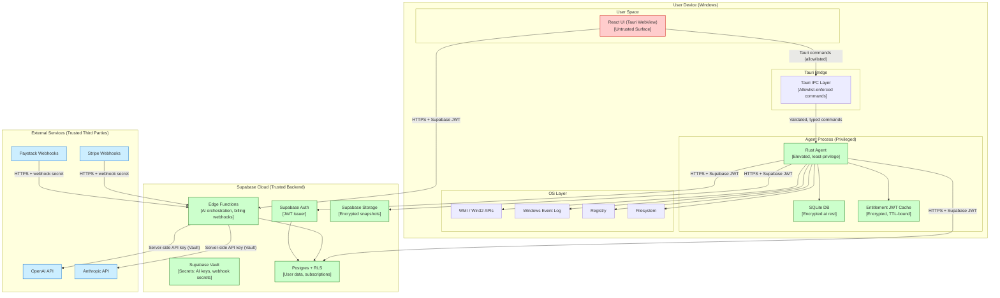
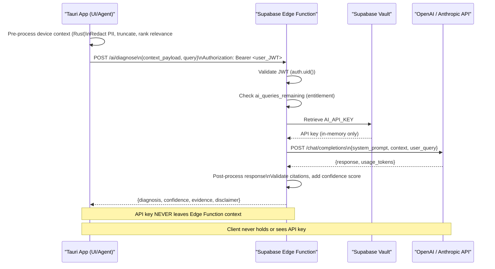
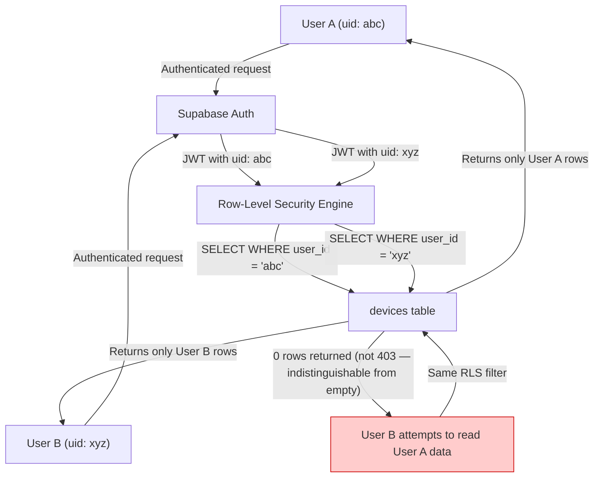

# 17. Security Requirements

> Threat model (STRIDE), trust-boundary architecture, and SEC-### security requirements for the DeviceLifeline privileged Rust agent and Supabase cloud backend. Part of the DeviceLifeline documentation suite — see [Documentation Index](README.md).

**Status:** Draft v1 · **Authoring role:** Security Architect · **Last updated:** 2026-06-07
**Related:** [16. Risk Analysis](16-risk-analysis.md), [18. Compliance Requirements](18-compliance-requirements.md), [19. Privacy Requirements](19-privacy-requirements.md), [30. System Architecture](30-system-architecture.md), [32. Database Design](32-database-design.md)

---

## 1. Purpose & Scope

This document establishes the security architecture and engineering requirements for DeviceLifeline. It covers the STRIDE threat model across all system components, defines SEC-### security requirements with acceptance criteria, and specifies controls for the highest-risk attack surfaces: the privileged Rust agent, the Tauri IPC layer, the Supabase cloud backend, AI API key protection, encryption at rest and in transit, authentication and session management, Supabase Row-Level Security, code signing and auto-update, software supply-chain, and incident response hooks.

**In scope:** On-device agent security, Tauri/React UI security, Supabase backend security (RLS, Edge Functions, Vault), AI API security, auth/session, encryption, update security, supply-chain, and incident response for V1 and post-MVP.
**Out of scope:** Physical device security, corporate network security (not in DeviceLifeline's control), detailed penetration test procedures.

---

## 2. Assumptions

- A1: The Rust agent runs with a dedicated Windows service account (not SYSTEM). It requests specific elevated capabilities only when needed (e.g., WMI queries, driver enumeration) via a separate privileged helper process or UAC prompt.
- A2: The React UI (Tauri webview) is treated as an untrusted surface — it may be compromised by an XSS or content injection. All trust boundaries enforce this.
- A3: The Supabase project uses Row-Level Security on all user-data tables; no table is publicly readable.
- A4: No secret material (API keys, database URLs, private keys) is ever bundled in the client distribution.
- A5: The OpenAI and Anthropic API keys are stored exclusively in Supabase Edge Function secrets (Supabase Vault).
- A6: All network communication between the agent/app and Supabase uses TLS 1.2+.
- A7: Code signing uses a valid EV (Extended Validation) certificate from a trusted CA.
- A8: The threat model is assessed for Windows V1. macOS/Linux threat models will be extensions of this document.

---

## 3. STRIDE Threat Model

STRIDE categories applied to the DeviceLifeline component architecture:

| Component | Threat (S) Spoofing | Threat (T) Tampering | Threat (R) Repudiation | Threat (I) Info Disclosure | Threat (D) Denial of Service | Threat (E) Elevation of Privilege |
|---|---|---|---|---|---|---|
| Rust Agent (on-device) | Impersonate agent binary | Tamper with SQLite DB | No audit log for agent actions | Sensitive data in SQLite | Agent resource exhaustion | Privilege escalation to SYSTEM |
| Tauri IPC | Malicious webview impersonates trusted caller | Tamper with IPC message payload | — | Expose Rust APIs to injected JS | IPC flooding | WebView context gains Rust-level access |
| React UI | — | DOM manipulation via XSS | — | Auth tokens in memory/localStorage | — | — |
| Supabase Auth | Token forgery | JWT manipulation | No auth event log | User data exposed via token | Auth service DoS | Bypass auth → access other users' data |
| Supabase Edge Function | — | Tamper with AI prompt | — | AI response leaks other users' data | Function DoS | Edge Function gains DB admin access |
| Supabase Postgres (RLS) | — | — | No change audit trail | Cross-user data exposure via RLS bypass | — | INSERT/UPDATE on protected rows |
| AI API (OpenAI/Anthropic) | — | Prompt injection via device data | — | API key exfiltration | API rate limit exhaustion | — |
| Auto-update | Impersonate update server | Replace update binary | — | — | Block updates (DoS) | Execute arbitrary code via update |
| Payment Webhook | Impersonate Stripe/Paystack | Tamper with event body | False payment events | — | Webhook flooding | Grant unauthorized subscription |

---

## 4. Trust Boundary Architecture

**Trust boundary rules:**
1. The React UI (WebView) is explicitly untrusted. The Tauri IPC allowlist is the security perimeter between the UI and the Rust agent.
2. The Supabase Edge Function layer is the only component that may communicate with AI API providers.
3. Secrets (API keys, webhook signing secrets) exist only in Supabase Vault; they are never injected into client builds or environment files shipped with the installer.
4. All cross-boundary communication (device → Supabase) uses HTTPS with certificate pinning consideration.

---

## 5. Security Requirements

### 5.1 Least-Privilege Agent Design

| ID | Requirement |
|---|---|
| SEC-001 | The Rust agent MUST run under a dedicated Windows service account with minimum required privileges. It MUST NOT run as SYSTEM or as the logged-in user's Administrator account as a default. |
| SEC-002 | The agent MUST use a separate privileged helper process (UAC-elevated, short-lived) for operations requiring elevation (e.g., driver enumeration, hardware SMART queries). The helper exits after completing the specific operation. |
| SEC-003 | The agent MUST request Windows capabilities (COM interfaces, WMI namespaces, Event Log access) via the minimum required scope. All WMI queries MUST be scoped to the specific namespace and class, not wildcard access. |
| SEC-004 | The Tauri IPC command allowlist MUST enumerate every Rust function callable from the UI. Any function not on the allowlist MUST be inaccessible from the webview context. The allowlist is reviewed in code review for every new command addition. |
| SEC-005 | The Rust agent MUST validate the authenticity of the requesting process before accepting IPC commands from the Tauri webview (Tauri's built-in isolation model enforced; no direct socket exposure to external processes). |

### 5.2 Secrets Handling

| ID | Requirement |
|---|---|
| SEC-010 | OpenAI and Anthropic API keys MUST be stored exclusively in Supabase Vault (or equivalent secrets management in the Edge Function environment). They MUST NOT appear in any client-side code, environment files shipped with the installer, Tauri app config, or SQLite database. |
| SEC-011 | Supabase anon key (public key) and project URL are the only credentials shipped in the client. All database access via the anon key MUST be governed by RLS policies (see SEC-030). |
| SEC-012 | Webhook signing secrets (Stripe webhook secret, Paystack webhook secret) MUST be stored in Supabase Vault and accessed only within Edge Functions. |
| SEC-013 | Supabase service role key MUST NEVER be used client-side. It is restricted to server-side administrative operations (migration scripts, cron jobs) in a secure execution environment. |
| SEC-014 | CI/CD pipelines MUST NOT log secret values. Secrets in CI MUST use the provider's secret storage (GitHub Actions Secrets, etc.) and be accessed via environment injection, never hard-coded in pipeline YAML. |
| SEC-015 | A pre-commit hook and CI job MUST scan the repository for credential patterns (API key regexes, high-entropy strings). Any detection MUST block the commit/merge and notify the security owner. |

### 5.3 Encryption at Rest

| ID | Requirement |
|---|---|
| SEC-020 | The local SQLite database MUST be encrypted using SQLCipher (AES-256-CBC) or equivalent. The encryption key MUST be derived from a device-bound secret (e.g., DPAPI on Windows) combined with a per-installation random salt. The key MUST NOT be stored in plaintext on disk. |
| SEC-021 | The entitlement JWT cache stored in SQLite MUST be encrypted as part of the encrypted database (inherits SEC-020). |
| SEC-022 | Device DNA Snapshot files uploaded to Supabase Storage MUST be encrypted server-side. Supabase Storage AES-256 encryption at rest is enabled for the storage bucket. |
| SEC-023 | Supabase Postgres data (user accounts, subscriptions, device metadata) is encrypted at rest via Supabase's managed Postgres (AES-256 at the infrastructure level). Application-level encryption is applied to any particularly sensitive fields (e.g., stored OAuth tokens for integrations). |
| SEC-024 | No unencrypted sensitive user data is written to Windows temporary files, application log files, or crash dumps. Log files MUST be sanitized before writing (see logging requirements in doc 36). |

### 5.4 Encryption in Transit

| ID | Requirement |
|---|---|
| SEC-025 | All HTTP communication between the agent/app and Supabase MUST use TLS 1.2 at minimum; TLS 1.3 preferred. Certificate validation MUST be enforced; self-signed certificates MUST be rejected. |
| SEC-026 | The Tauri app MUST NOT make unencrypted HTTP requests to any external service. Any HTTP (non-TLS) URL in app configuration is a build-time error. |
| SEC-027 | Communication between the Rust agent and local SQLite is in-process (no network socket). No local network ports are opened by the agent for external connection. |
| SEC-028 | Certificate pinning SHOULD be considered for Supabase API requests in the Rust agent (evaluated for V1; mandatory for post-MVP). The risk of certificate substitution attacks on corporate proxy networks informs this decision. |

### 5.5 Authentication and Session Management

| ID | Requirement |
|---|---|
| SEC-030 | Supabase Auth is the sole authentication provider for V1. Email/password and OAuth (Google, GitHub) are supported sign-in methods. |
| SEC-031 | Access tokens (JWTs) MUST have a maximum TTL of 1 hour. Refresh tokens MUST be rotated on each use (Supabase Auth option: "Rotation enabled"). |
| SEC-032 | The refresh token MUST be stored in the OS credential store (Windows Credential Manager via the `keyring` crate) — NOT in a plaintext file, NOT in the registry without encryption. |
| SEC-033 | Supabase Auth MUST be configured to detect and block suspicious session activity: rapid geographic changes, concurrent sessions from multiple locations (configurable alert threshold). |
| SEC-034 | The app MUST provide a "sign out all devices" function that revokes all active sessions for the user account via Supabase Auth's admin token revocation endpoint. |
| SEC-035 | Password reset flows MUST use time-limited tokens (expire in 1 hour). Password strength requirements: minimum 12 characters. Breach password check using haveibeenpwned API is RECOMMENDED. |
| SEC-036 | Multi-factor authentication (MFA) via TOTP MUST be supported as an optional feature for Pro and above (post-MVP for V1; required for Business Edition). |

### 5.6 Supabase Row-Level Security

| ID | Requirement |
|---|---|
| SEC-040 | RLS MUST be enabled on all tables in the Supabase Postgres database. No table is exempt, including lookup/reference tables (read-only reference tables may use a public select policy but no insert/update/delete). |
| SEC-041 | All user-data tables (devices, snapshots, timeline_events, health_samples, subscriptions, ai_query_log) MUST enforce a read policy equivalent to: `auth.uid() = user_id`. Users can only read their own rows. |
| SEC-042 | For Technician Edition: client device data MUST enforce a policy that grants access to rows where the `technician_account_id` matches the authenticated technician's account. Client users do not have direct access to rows managed by their technician. |
| SEC-043 | For Business Edition: fleet device data MUST enforce a policy that grants access to rows where the `organization_id` matches the authenticated user's organization AND the user has the required RBAC role (Admin or DeviceManager). |
| SEC-044 | RLS policies MUST be tested with automated integration tests that assert cross-user and cross-organization data isolation. These tests MUST run in CI against a Supabase test project before each deployment. |
| SEC-045 | The Supabase service role is exempt from RLS (Supabase default). Service-role usage MUST be restricted to administrative scripts and cron jobs, logged, and not accessible from Edge Functions that handle user requests. |

### 5.7 Code Signing and Secure Auto-Update

| ID | Requirement |
|---|---|
| SEC-050 | All DeviceLifeline binaries (Rust agent, Tauri app shell, installer) MUST be signed with an EV (Extended Validation) code signing certificate before distribution. Unsigned binaries MUST NOT be distributed. |
| SEC-051 | The Windows installer (MSIX or NSIS) MUST be signed with the same EV certificate. |
| SEC-052 | Tauri's built-in auto-update mechanism MUST be configured with a separate signing key for update manifests. The update manifest signing private key MUST NOT be the same as the installer signing key. |
| SEC-053 | Auto-update checks MUST be performed over HTTPS. The update manifest URL MUST be pinned to the DeviceLifeline distribution domain; wildcard or user-configurable update URLs are not permitted. |
| SEC-054 | Before applying an auto-update, the Tauri updater MUST verify the signature on both the update manifest and the update binary. A signature verification failure MUST abort the update, log the failure, and alert the user. |
| SEC-055 | Update binaries MUST include a SHA-256 hash in the signed manifest. The hash is verified after download, before execution. |
| SEC-056 | A security update (critical vulnerability fix) MUST be deployable within 24 hours of discovery. The auto-update system MUST support "forced update" designation for critical security patches. |

### 5.8 Software Supply Chain

| ID | Requirement |
|---|---|
| SEC-060 | All Rust crate dependencies MUST be pinned to exact versions in `Cargo.lock`. `Cargo.lock` MUST be committed to the repository. |
| SEC-061 | All npm/Node.js dependencies MUST be pinned in `package-lock.json`. `package-lock.json` MUST be committed. |
| SEC-062 | `cargo audit` (using RustSec Advisory Database) MUST run in CI on every pull request and every main branch commit. Any HIGH or CRITICAL advisory MUST block the merge until resolved or explicitly suppressed with documented justification. |
| SEC-063 | `npm audit` MUST run in CI. HIGH or CRITICAL vulnerabilities in production dependencies MUST block deployment. |
| SEC-064 | A Software Bill of Materials (SBOM) in SPDX or CycloneDX format MUST be generated for each release as a release artifact. |
| SEC-065 | New direct dependency additions (Cargo or npm) MUST be reviewed in pull requests for license compatibility and origin reputation (GitHub star count, maintenance status, known history). |

### 5.9 Input Validation

| ID | Requirement |
|---|---|
| SEC-070 | All data collected by the Rust agent from the Windows system (registry values, file paths, event log entries, WMI query results) MUST be treated as untrusted input and validated/sanitized before storage in SQLite or transmission to Supabase. |
| SEC-071 | All Tauri IPC command parameters MUST be strongly typed (Rust types with serde deserialization). Deserialization failures MUST return a structured error to the UI — they MUST NOT panic the agent process. |
| SEC-072 | All inputs to Supabase Edge Functions (including AI Detective query payloads) MUST be validated for type, length, and format before processing. Payloads exceeding defined limits (e.g., max query string length: 2,000 characters) MUST be rejected with HTTP 400. |
| SEC-073 | The AI Detective Edge Function MUST treat the device context data payload as untrusted input, not as instructions. The LLM system prompt MUST explicitly instruct the model to treat the context block as data to analyze, never as commands to follow (prompt injection mitigation). |
| SEC-074 | SQL queries in Supabase Edge Functions MUST use parameterized queries exclusively. String concatenation into SQL strings is prohibited and enforced via code review and static analysis. |

### 5.10 Incident Response Hooks

| ID | Requirement |
|---|---|
| SEC-080 | Sentry is configured as the crash/error reporting provider for both the Tauri app and Supabase Edge Functions. All uncaught exceptions are reported to Sentry with sanitized context (PII stripped from Sentry events; see [Privacy Requirements](19-privacy-requirements.md)). |
| SEC-081 | Security-relevant events MUST be logged to a dedicated Supabase security audit log table: failed auth attempts (>3 in 5 minutes → alert), unusual snapshot access patterns, RLS policy violation attempts, payment webhook signature failures. |
| SEC-082 | A security alert workflow MUST be configured: critical Sentry alerts AND security audit log anomalies trigger a PagerDuty/Slack/email notification to the security owner within 15 minutes. |
| SEC-083 | A public security contact (`security@devicelifeline.com` or equivalent) MUST be established before launch. A Coordinated Vulnerability Disclosure (CVD) policy MUST be published at `devicelifeline.com/security`. |
| SEC-084 | A security incident response runbook MUST be documented (in the internal wiki, not in this public-facing document) covering: detection → containment → investigation → communication → remediation steps for the most likely incident types (credential compromise, data breach, malicious update). |
| SEC-085 | Data breach notification capability MUST be in place before launch: ability to identify all users affected by a given data set, draft notification email, and initiate GDPR 72-hour notification workflow. See [Compliance Requirements](18-compliance-requirements.md). |

---

## 6. Security Testing Requirements

| ID | Requirement |
|---|---|
| SEC-090 | Static Application Security Testing (SAST): `cargo clippy --deny warnings` and a SAST tool (e.g., Semgrep with Rust and JS rules) MUST run in CI on every pull request. |
| SEC-091 | Dynamic Analysis: Fuzz testing MUST be applied to the Rust agent's input parsers (WMI result parsers, registry value parsers, event log parsers) using `cargo-fuzz` or AFL. Fuzz targets MUST be maintained alongside the parser code. |
| SEC-092 | Dependency Scanning: `cargo audit` and `npm audit` in CI (see SEC-062, SEC-063). |
| SEC-093 | Integration Security Tests: The RLS policy test suite (SEC-044) runs in CI. |
| SEC-094 | Pre-launch penetration test: An independent penetration test of the Rust agent, Tauri IPC surface, and Supabase Edge Functions MUST be conducted before Business Edition GA (or before 1,000 active users on any paid plan, whichever comes first). |
| SEC-095 | VirusTotal submission: Each release binary MUST be submitted to VirusTotal before distribution. Any detections must be investigated and resolved or documented before release. |

---

## 7. Security Responsibilities Matrix

| Component | Security Owner | Review Required | Cadence |
|---|---|---|---|
| Rust agent privilege model | Lead Security Engineer | Architecture + code review | Each agent release |
| Tauri IPC allowlist | Lead Engineer | Code review | Each new command |
| RLS policies | Lead Engineer + Security | Code review + automated test | Each DB migration |
| Edge Function secrets | DevOps | Configuration review | Each function deployment |
| EV code signing | DevOps | Certificate validity check | Monthly + each release |
| Supply-chain (audit/SBOM) | Engineering | CI automated | Every PR |
| Incident response runbook | Security Owner | Tabletop exercise | Quarterly |
| Penetration test | External firm | Formal report | Pre-launch + annually |

---

## Diagrams

### AI Request Trust Boundary (Preventing Key Exfiltration)

### Supabase RLS Data Isolation

---

## Risks & Mitigations

| Risk | Likelihood | Impact | Mitigation |
|---|---|---|---|
| EV certificate expires unnoticed | Low | High | Certificate expiry calendar alerts 90, 30, 7 days before expiry; renewal is a release-blocking checklist item |
| RLS policy bypassed via Supabase service role in Edge Function | Low | High | Service role strictly forbidden in user-request-handling Edge Functions; enforced via code review and Supabase audit log monitoring |
| Prompt injection via collected device data | Low | Medium | System prompt instructs model to treat context as data; on-device sanitization before sending; input length limits |
| Auto-update private key compromise | Low | High | Private key stored in hardware security module (HSM) or equivalent; offline storage for signing key; key rotation plan documented |
| New Rust CVE in agent dependencies | Medium | High | cargo-audit in CI; Dependabot alerts; patch SLA: Critical ≤ 24h, High ≤ 7 days |

---

## Future Considerations

- **Certificate pinning for agent-to-Supabase calls:** Implement in post-MVP to protect against corporate proxy MITM attacks. Requires an opt-out mechanism for enterprise environments that use SSL inspection.
- **Hardware-bound device identity:** For Business Edition, use TPM-based device attestation to bind the agent to a specific hardware instance, preventing unauthorized device re-registration.
- **MFA enforcement for Business Edition:** TOTP or FIDO2/WebAuthn MFA should be mandatory (not optional) for Business Edition admin accounts.
- **Zero-trust agent model:** Post-MVP, investigate a zero-trust architecture where the agent authenticates each operation individually rather than using a long-lived service account.
- **SOC 2 Type II:** Security controls documented here form the basis of SOC 2 compliance evidence. Begin formal SOC 2 readiness engagement after Business Edition GA.
- **AI security policy:** As EU AI Act and similar regulations mature, the AI Detective's security and transparency controls may need to be formalized in a separate AI security policy document.

---

## Acceptance Criteria

- AC-SEC-001: All eight STRIDE threat categories are mapped to all major system components in the threat model table.
- AC-SEC-002: The trust boundary diagram shows all cross-boundary communication paths and identifies trusted vs. untrusted zones.
- AC-SEC-003: SEC-010 through SEC-015 (secrets handling) prohibit AI API keys in the client and specify Supabase Vault as the storage location.
- AC-SEC-004: SEC-020 through SEC-024 specify SQLite encryption method (SQLCipher/AES-256) and key derivation approach (DPAPI + salt).
- AC-SEC-005: SEC-040 through SEC-045 require RLS on all tables with specific per-user and per-organization isolation policies.
- AC-SEC-006: SEC-050 through SEC-056 require EV code signing and specify the auto-update signature verification chain.
- AC-SEC-007: SEC-060 through SEC-065 require cargo-audit and npm audit in CI with blocking severity thresholds.
- AC-SEC-008: SEC-080 through SEC-085 define incident response hooks including Sentry configuration, security audit logging, alert workflow, and breach notification capability.
- AC-SEC-009: The AI request trust boundary sequence diagram shows that API keys never leave the Edge Function context.
- AC-SEC-010: The document cross-links to [Risk Analysis](16-risk-analysis.md) and [Compliance Requirements](18-compliance-requirements.md).
