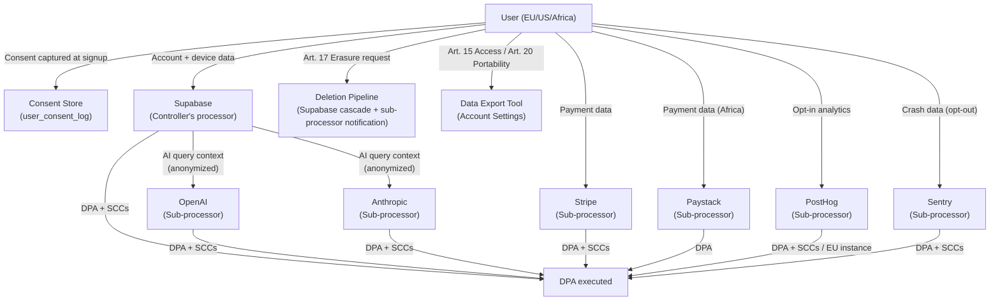

# 18. Compliance Requirements

> GDPR, CCPA/CPRA, SOC 2 readiness, data-processing roles, sub-processor register, data subject rights, telemetry consent, and distribution policy obligations for DeviceLifeline. Part of the DeviceLifeline documentation suite — see [Documentation Index](README.md).

**Status:** Draft v1 · **Authoring role:** Principal PM (Monetization) + Security Architect · **Last updated:** 2026-06-07
**Related:** [17. Security Requirements](17-security-requirements.md), [19. Privacy Requirements](19-privacy-requirements.md), [20. Data Retention Policies](20-data-retention-policies.md), [21. Device Telemetry Strategy](21-device-telemetry-strategy.md), [16. Risk Analysis](16-risk-analysis.md)

---

## 1. Purpose & Scope

This document specifies DeviceLifeline's compliance obligations and the controls required to meet them. It covers GDPR (EU/EEA/UK), CCPA/CPRA (California), SOC 2 Type II readiness (for Business Edition), data-processing role classification, the sub-processor register with DPA status, data subject rights procedures, telemetry consent architecture, Microsoft Store distribution obligations, and regional compliance considerations.

**In scope:** All compliance frameworks applicable to DeviceLifeline's product, payment processing, analytics, and AI API usage as of V1 and near-term post-MVP.
**Out of scope:** Employment/HR compliance, corporate governance, financial audit requirements unrelated to customer data, and compliance frameworks that do not yet apply (e.g., SOC 2 pre-audit state; HIPAA not applicable as DeviceLifeline does not process health data).

---

## 2. Assumptions

- A1: DeviceLifeline is incorporated and operated as a software company subject to international data protection law when processing EU/UK personal data and California personal information.
- A2: "Personal data" in this document refers to any information relating to an identified or identifiable natural person (GDPR definition). DeviceLifeline's primary personal data categories are: account data, device identifiers, and behavioral/telemetry data.
- A3: Supabase, OpenAI, Anthropic, Stripe, Paystack, PostHog, and Sentry are all sub-processors (they process personal data on DeviceLifeline's behalf).
- A4: DeviceLifeline is the Data Controller for consumer (Free/Pro/Developer) user data. For Technician and Business accounts, DeviceLifeline is a Data Processor for client/employee device data processed on behalf of the technician/business account holder.
- A5: GDPR compliance requires a lawful basis for each processing activity. The primary lawful bases are: contract performance (account management, feature delivery) and legitimate interests (security, fraud prevention). Analytics and telemetry require consent.
- A6: V1 does not process special categories of personal data (health data, biometric data, financial account data beyond payment method tokens held by Stripe/Paystack).
- A7: SOC 2 audit is post-MVP but controls documentation begins now to reduce future audit prep effort.

---

## 3. Data-Processing Role Classification

### 3.1 DeviceLifeline as Data Controller

DeviceLifeline acts as a **Data Controller** for:
- Consumer account data (Free, Pro, Developer tiers): email address, account preferences, subscription status, device metadata, snapshots, performance timeline, AI query history.
- Marketing and analytics data collected via PostHog and processed in connection with the product.

As Data Controller, DeviceLifeline determines the purposes and means of processing and bears primary accountability for compliance.

### 3.2 DeviceLifeline as Data Processor

DeviceLifeline acts as a **Data Processor** for:
- **Technician Edition:** Device data and diagnostic information belonging to the technician's clients. The technician (or their business) is the Data Controller for their clients' device data. DeviceLifeline processes this data on the technician's instructions.
- **Business Edition:** Employee device data managed by the business IT admin. The business entity is the Data Controller; DeviceLifeline processes on the business's behalf.

**Consequence:** Technician and Business tier customers must be provided with a Data Processing Agreement (DPA) before they may use DeviceLifeline to process their clients'/employees' personal data. The DPA is presented and agreed to during the Technician/Business tier onboarding flow.

### 3.3 Sub-processor Role

DeviceLifeline engages sub-processors to deliver the service. Each sub-processor processes personal data on DeviceLifeline's behalf (DeviceLifeline acting as controller or as a processor of a controller's data).

---

## 4. Sub-Processor Register

### 4.1 Register Table

| Sub-Processor | Purpose | Data Processed | Location / Transfer Mechanism | DPA Status | Privacy Policy |
|---|---|---|---|---|---|
| **Supabase** | Cloud backend: Postgres DB, Auth, Storage, Edge Functions, Realtime | Account data, device snapshots, performance timeline, AI query logs, subscription state | US (primarily AWS us-east-1); SCCs for EU data transfers | DPA via Supabase's standard DPA at signup | [supabase.com/privacy](https://supabase.com/privacy) |
| **OpenAI** | AI Detective query processing: LLM inference for diagnostic reasoning | Anonymized/sanitized device context (no direct PII; see data minimization below), AI query text | US; SCCs for EU transfers | OpenAI DPA available at api.openai.com; execute before EU launch | [openai.com/privacy](https://openai.com/privacy) |
| **Anthropic** | AI Detective query processing: LLM inference (secondary/fallback provider) | Same as OpenAI | US; SCCs for EU transfers | Anthropic DPA: request via business agreements channel | [anthropic.com/privacy](https://anthropic.com/privacy) |
| **Stripe** | Payment processing (global): subscription billing, invoicing, payment method storage | Name, email, billing address, payment method token (Stripe stores card data; DeviceLifeline never holds raw card numbers), transaction history | US/EU (Stripe processes in multiple regions); SCCs available | Stripe DPA automatically executed at account signup per Stripe's terms | [stripe.com/privacy](https://stripe.com/privacy) |
| **Paystack** | Payment processing (Africa): subscription billing, local payment methods | Name, email, billing address, payment method reference (Africa region) | Africa/EU; Paystack's standard DPA | Paystack DPA available in partner agreements | [paystack.com/privacy](https://paystack.com/privacy) |
| **PostHog** | Product analytics: feature engagement, conversion funnel, session events | Pseudonymized user events (device-level, not name/email); PostHog person records linked to `user_id` hash | EU instance available; EU deployment RECOMMENDED for GDPR alignment | PostHog DPA available at posthog.com/dpa | [posthog.com/privacy](https://posthog.com/privacy) |
| **Sentry** | Error and crash reporting: exception traces, performance monitoring | Anonymized error context: stack traces, device OS/version, app version; NO PII (enforced by Sentry SDK config; see SEC-080) | US; SCCs; Sentry EU instance available | Sentry DPA executed at account creation | [sentry.io/privacy](https://sentry.io/privacy) |

### 4.2 DPA Execution Checklist (Pre-Launch)

- [ ] Supabase DPA — accepted during account setup (auto-executed with Supabase terms)
- [ ] OpenAI DPA — must be explicitly requested and executed via OpenAI's business process before EU user launch
- [ ] Anthropic DPA — must be requested via Anthropic business agreements channel before EU user launch
- [ ] Stripe DPA — auto-executed with Stripe Master Services Agreement at account creation
- [ ] Paystack DPA — include in Paystack partner agreement review
- [ ] PostHog DPA — execute via PostHog's DPA request form; configure EU instance for GDPR alignment
- [ ] Sentry DPA — executed at account creation; confirm EU data residency option if required

### 4.3 Sub-processor Change Notification

DeviceLifeline will:
1. Maintain this register as the authoritative sub-processor list.
2. Notify existing customers (email + in-app) at least 30 days before adding or materially changing a sub-processor.
3. Publish the current sub-processor list on the DeviceLifeline privacy/legal portal.

---

## 5. GDPR Compliance

### 5.1 Lawful Basis Register

| Processing Activity | Lawful Basis | Notes |
|---|---|---|
| Account creation and authentication | Contract performance (Art. 6(1)(b)) | Necessary to provide the service |
| Billing and payment processing | Contract performance | Necessary to deliver paid tiers |
| Device DNA Snapshots, Performance Timeline, Health Intelligence | Contract performance | Core product functionality |
| AI Detective queries | Contract performance | Core feature for paid tiers |
| Cloud sync of device data | Contract performance | Necessary for multi-device and restore features |
| Product analytics (PostHog events) | Consent (Art. 6(1)(a)) | Opt-in required; separate consent from product use |
| Crash/error reporting (Sentry) | Legitimate interests (Art. 6(1)(f)) | Necessary for product quality and security; minimal PII; user can opt out |
| Security monitoring and fraud prevention | Legitimate interests | Necessary for platform security |
| Marketing communications | Consent | Separate opt-in; unsubscribe at any time |
| Sub-processor transfers (all above) | Appropriate safeguards: SCCs or adequacy decision | SCCs executed with each sub-processor |

### 5.2 Records of Processing Activities (RoPA)

DeviceLifeline must maintain a RoPA (Art. 30 GDPR). The RoPA is an internal document (not published here) that enumerates all processing activities, purposes, categories of data subjects, categories of data, transfers, and retention periods. The sub-processor register (Section 4) and data retention policies ([Data Retention Policies](20-data-retention-policies.md)) are inputs to the RoPA.

**COMP-001:** A formal RoPA document must be created and maintained internally, separate from this public-facing document. It must be reviewed quarterly and updated when processing activities change.

### 5.3 Data Protection Officer (DPO)

Under GDPR Art. 37, a DPO is mandatory for organizations that systematically monitor data subjects at large scale. DeviceLifeline's monitoring of device behavior may constitute large-scale systematic monitoring as the user base grows.

**COMP-002:** Legal counsel must assess the DPO requirement threshold within 90 days of launch. Until a formal DPO is appointed (or the requirement is documented as not applying), a Privacy Lead role within the founding team is designated as the primary GDPR contact.

### 5.4 GDPR Data Subject Rights Implementation

| Right | Mechanism | Target Response Time |
|---|---|---|
| **Art. 15 — Access** | User can download a full data export (account data, all snapshots, timeline, AI query history) from the Account Settings page (self-serve). | Immediate (self-serve) |
| **Art. 16 — Rectification** | User can update account profile data (name, email, preferences) directly in settings. | Immediate (self-serve) |
| **Art. 17 — Erasure ("right to be forgotten")** | User initiates account deletion from settings. Cascaded delete runs across: Supabase Postgres (user data, device data, snapshots, timeline), Supabase Storage (snapshot files), Stripe (customer anonymized per Stripe data retention policy), PostHog (person deletion API), Sentry (person deletion). Confirmation email sent when complete. | Completed within 30 days of request; self-serve initiation is immediate |
| **Art. 18 — Restriction of processing** | User can disable cloud sync (local data only) and opt out of all analytics/telemetry. Core service continues with local-only mode. | Immediate (settings toggle) |
| **Art. 20 — Portability** | Data export includes all structured personal data in a machine-readable format (JSON). Export available on demand from settings. | Immediate (self-serve) |
| **Art. 21 — Objection** | User can object to processing based on legitimate interests (crash reporting, security telemetry) and opt out. Marketing opt-out available at any time. | Immediate (opt-out toggle) |
| **Art. 22 — Automated decisions** | AI Detective results are informational and explicitly not used for automated legal or significant decisions about users. Disclosed in Privacy Policy and AI Detective UI. | — |

**COMP-003:** All Art. 15, 17, and 20 rights must be exercisable self-serve from the Account Settings page without requiring contact with support, for V1 launch.

### 5.5 Data Transfers to Third Countries

Supabase (US), OpenAI (US), Anthropic (US), and Stripe (US) are all based in the US (not an EU adequacy country). Transfers rely on Standard Contractual Clauses (SCCs — 2021 EU SCCs). DPAs with each sub-processor must include or incorporate SCCs.

For UK transfers (post-Brexit GDPR equivalent): The UK's International Data Transfer Agreement (IDTA) or UK SCCs apply. This is an addendum to the EU SCC process.

**COMP-004:** Before onboarding EU/UK users, confirm that SCCs (EU) and IDTAs (UK) are executed with Supabase, OpenAI, Anthropic, Stripe, PostHog, and Sentry.

---

## 6. CCPA / CPRA Compliance

### 6.1 Applicability

CCPA/CPRA applies to DeviceLifeline if it meets any of the CPRA thresholds (annually: ≥25,000 CA consumers' personal information, ≥$25M gross annual revenue, or ≥50% revenue from selling personal information). DeviceLifeline is likely to trigger the consumer data volume threshold as it grows. CPRA compliance is required from V1 as a best-practice to avoid remediation.

### 6.2 CCPA Categories of Personal Information Collected

| Category | Examples | Collected by DeviceLifeline |
|---|---|---|
| Identifiers | Name, email, user ID, device ID | Yes (account creation, device registration) |
| Commercial information | Subscription status, transaction history | Yes (billing records) |
| Internet/network activity | Device software usage, browser extension inventory | Yes (Device DNA Snapshots) |
| Geolocation (coarse) | Billing country (from payment address) | Yes (for regional pricing) |
| Audio/visual (not applicable) | — | No |
| Professional/employment | Technician business name (if provided) | Optional |
| Sensitive personal information | — | No (CPRA category; not collected) |

### 6.3 CCPA Data Subject Rights

| Right | Implementation |
|---|---|
| **Right to Know** | Privacy Policy lists all categories of personal information collected. Data export (Art. 20-equivalent) available in Account Settings. |
| **Right to Delete** | Same deletion workflow as GDPR Art. 17 (Section 5.4 above). |
| **Right to Correct** | Account settings self-serve rectification. |
| **Right to Opt-Out of Sale/Sharing** | DeviceLifeline does NOT sell personal information. No "Do Not Sell or Share My Personal Information" link is required if no sale/sharing occurs. Confirm with legal counsel prior to launch. |
| **Right to Limit Use of Sensitive Personal Information** | Not applicable (no sensitive PI collected under CPRA definition). |
| **Non-Discrimination** | Users who exercise CCPA rights must not be charged different prices or denied service. DeviceLifeline's self-serve rights mechanisms do not affect subscription status. |

**COMP-005:** Legal counsel must confirm whether DeviceLifeline's PostHog analytics data sharing constitutes "sharing for cross-context behavioral advertising" under CPRA. If so, a "Do Not Share" opt-out mechanism is required.

### 6.4 CCPA Privacy Notice

DeviceLifeline's Privacy Policy must include CCPA-required disclosures: categories of PI collected, purposes of collection, categories of third parties to whom PI is disclosed, and consumer rights. The policy must be accessible via a prominent link on the website and in the app.

---

## 7. SOC 2 Type II Readiness (Business Edition)

### 7.1 Scope and Timeline

SOC 2 Type II certification is not required for V1 MVP but is a procurement requirement for mid-market and enterprise Business Edition customers. Target: begin SOC 2 readiness engagement 6 months post-Business Edition GA; achieve SOC 2 Type II report within 18 months of Business Edition GA.

**Trust Service Criteria (TSC) in scope:**
- **Security (CC):** Mandatory for all SOC 2 reports.
- **Availability (A):** Relevant given Business Edition fleet management uptime dependency.
- **Confidentiality (C):** Relevant for device data processed on behalf of Business customers.
- **Privacy (P):** Relevant given the nature of device data collected.

### 7.2 Key Controls to Begin Documenting Now

These controls, already referenced in this document suite, form the basis of SOC 2 evidence:

| Control Area | Controls | Reference |
|---|---|---|
| Access Control | SEC-030 to SEC-036 (auth/session), SEC-040 to SEC-045 (RLS) | [Security Requirements](17-security-requirements.md) |
| Change Management | SEC-050 to SEC-056 (code signing, auto-update), SEC-060 to SEC-065 (supply chain) | [Security Requirements](17-security-requirements.md) |
| Risk Assessment | Full risk register | [Risk Analysis](16-risk-analysis.md) |
| Monitoring / Logging | SEC-080 to SEC-085 (incident response, Sentry, audit logs) | [Security Requirements](17-security-requirements.md) |
| Vendor Management | Sub-processor register with DPA status (Section 4 above) | This document |
| Data Classification | Privacy requirements, data retention | [Privacy Requirements](19-privacy-requirements.md), [Data Retention Policies](20-data-retention-policies.md) |
| Incident Response | SEC-084 (incident runbook) | [Security Requirements](17-security-requirements.md) |
| Business Continuity | Disaster Recovery Plan | Doc 42 |

**COMP-006:** Assign a SOC 2 readiness owner role. Begin controls gap assessment using the AICPA Trust Services Criteria checklist within 3 months of Business Edition GA.

### 7.3 Evidence Collection Infrastructure

Before initiating SOC 2 audit:
- Access review evidence: quarterly user access reviews in Supabase and CI/CD systems.
- Change management logs: GitHub PR merge history, deployment logs.
- Incident logs: Sentry alert history, security audit log in Supabase.
- Vendor DPA tracking: this document (Section 4.2 checklist) updated as DPAs are executed.

---

## 8. Telemetry Consent Architecture

See [Device Telemetry Strategy](21-device-telemetry-strategy.md) for full telemetry design. Compliance requirements for telemetry:

### 8.1 Consent Tiers

| Telemetry Type | Legal Basis | Consent Required | Default |
|---|---|---|---|
| Core product telemetry (crash reports via Sentry) | Legitimate interests | Opt-out (not pre-consent required) | ON |
| Product analytics (PostHog feature engagement) | Consent | Opt-in consent required | OFF until consent given |
| AI query usage telemetry (query count, latency, model used) | Contract performance | No separate consent required | ON (billing/limit enforcement) |
| Device performance data (aggregated, non-identifiable) for product improvement | Consent | Opt-in | OFF |

**COMP-007:** The first-run experience MUST present a consent screen for product analytics (PostHog) and optional performance data telemetry before any such data is collected. The consent choice must be stored and honored across sessions. Changing the consent choice must be available in Account Settings at any time.

### 8.2 Consent Record-Keeping

Consent records must be stored in the Supabase `user_consent_log` table:

```
user_consent_log:
  id                uuid PK
  user_id           uuid FK → users
  consent_type      text  -- 'analytics' | 'performance_telemetry' | 'marketing_email'
  granted           boolean
  granted_at        timestamptz
  revoked_at        timestamptz (nullable)
  consent_version   text  -- version of consent text at time of grant
  ip_country        text  -- billing/registration country (not precise IP)
```

**COMP-008:** Consent records must be retained for the life of the account + 3 years as evidence of compliance (GDPR Art. 7(1) — controller must demonstrate consent was obtained).

### 8.3 Cookie and Tracking

DeviceLifeline is primarily a desktop application, not a website. Cookie compliance (ePrivacy Directive) applies to the marketing website and the web-based billing portal.

- The marketing website (`devicelifeline.com`) MUST implement a cookie consent banner before placing any non-essential cookies (analytics, marketing pixels).
- The Stripe billing portal (stripe.com domain) is governed by Stripe's own cookie policy.
- The in-app WebView does not use browser cookies for authentication (Supabase JWT is stored in SQLite, not cookies).

---

## 9. Microsoft Store / Distribution Policy Obligations

### 9.1 Microsoft Store Submission Policies

If DeviceLifeline is distributed via the Microsoft Store (Windows app), the following policy obligations apply:

| Policy Area | Requirement | DeviceLifeline Consideration |
|---|---|---|
| **Privacy policy** | A privacy policy URL is mandatory for Store listing | Publish privacy policy at `devicelifeline.com/privacy` before Store submission |
| **In-app purchases** | Microsoft Store may require use of Microsoft's in-app purchase (IAP) API for digital goods. Subscriptions may fall under this requirement | Seek legal review; direct billing via web is preferred to avoid Store IAP requirements. Consider a "web-only subscription" model where the Store app prompts users to subscribe via the DeviceLifeline website |
| **Revenue share** | Microsoft Store takes 15% commission (reduced from 30% for apps meeting certain criteria) | Factor into pricing model if Store distribution is used |
| **Agent capabilities** | Elevated Win32 API access may require a packaged (MSIX) application with declared capabilities | Declare required capabilities in the app manifest; some capabilities require Microsoft partner certification |
| **Background execution** | The Rust agent runs as a background process; Store policies restrict background execution for non-certified apps | Background task certification may be required; alternative: distribute agent as a separate Win32 service outside the Store context |
| **System modification** | Apps that modify system settings, registry, or startup items require specific disclosure | Disclose in Store listing description; document in user consent flow |
| **Data collection disclosure** | Store requires disclosure of data collection practices in the store listing and privacy policy | Complete the Microsoft Store privacy data collection questionnaire accurately |

**COMP-009:** A dedicated Microsoft Store policy review must be completed by a developer with Windows app distribution experience before Store submission. Store distribution is optional for V1; direct installer distribution is the primary channel.

### 9.2 Direct Installer Distribution

DeviceLifeline can be distributed as a signed MSIX or NSIS installer via the DeviceLifeline website and GitHub Releases. This avoids Store policy constraints but requires:
- EV code signing (SEC-050) to avoid SmartScreen warnings.
- Clear privacy policy and terms of service linked in the installer and first-run experience.
- Users must explicitly authorize installation of a system agent (UAC prompt with clear explanation).

---

## 10. Regional Compliance Considerations

### 10.1 European Union (GDPR)

Primary framework: See Section 5. Key additional requirements:
- **Data residency preference:** EU users may prefer or require EU data residency. Investigate Supabase EU instance configuration for EU user data (post-MVP; document as a compliance roadmap item).
- **Local representative:** If DeviceLifeline does not have an EU establishment but processes EU user data, an Art. 27 EU Representative may be required. Assess against user volume thresholds.

### 10.2 United Kingdom (UK GDPR + PECR)

- UK GDPR (post-Brexit data protection law) mirrors EU GDPR substantively. The same controls apply.
- PECR (Privacy and Electronic Communications Regulations) applies to cookies and electronic marketing. See Section 8.3.
- A UK Representative may be required (similar to Art. 27 EU Rep) if no UK establishment.

### 10.3 United States — California (CCPA/CPRA)

See Section 6. Additional state privacy laws (Colorado CPA, Virginia VCDPA, Connecticut CTDPA, Texas TDPSA, etc.) are functionally similar to CCPA. A baseline CCPA-compliant approach (opt-out of sale, data rights, privacy notice) provides substantial multi-state compliance coverage.

### 10.4 Africa (NDPR — Nigeria, PDPA — Ghana, PDPA — Kenya, POPIA — South Africa)

- **Nigeria NDPR (2019):** Requires a Data Protection Officer (DPO), privacy policy, and lawful basis for processing. Applies to organizations processing Nigerian residents' data.
- **South Africa POPIA (2021):** Effective from July 2021. Requires an Information Officer (equivalent to DPO), processing conditions broadly similar to GDPR, and data breach notification within 72 hours to the Information Regulator.
- **Ghana / Kenya:** Emerging frameworks; GDPR-equivalent practices provide a reasonable baseline.

**COMP-010:** Before enabling Paystack payments and marketing to African markets, conduct a lightweight legal review of NDPR (Nigeria) and POPIA (South Africa) requirements. GDPR-compliant practices provide a strong baseline but local-specific requirements (Information Officer designation, local registration) must be assessed.

### 10.5 India (DPDP Act 2023)

India's Digital Personal Data Protection Act 2023 came into force. It requires:
- Consent for personal data processing.
- Data fiduciary registration for certain categories.
- Data localization requirements for certain categories of sensitive data (finalization pending rules).

**COMP-011:** Before launching in India, conduct a legal review of DPDP Act requirements, particularly regarding data localization and fiduciary registration.

---

## 11. Compliance Governance

### 11.1 Compliance Roles

| Role | Responsibility |
|---|---|
| Privacy Lead (founding team) | GDPR contact point, privacy impact assessments, DPA execution, consent architecture oversight |
| Legal Counsel | GDPR/CCPA legal advice, Store policy review, DPA negotiation, breach notification |
| Security Owner | SOC 2 readiness, incident response, security controls documentation |
| Engineering Lead | Implementing data rights workflows, consent recording, deletion pipelines |
| CEO / Product Lead | Final sign-off on privacy policy, Terms of Service, compliance trade-off decisions |

### 11.2 Compliance Calendar

| Activity | Cadence | Owner |
|---|---|---|
| Sub-processor register review | Quarterly | Privacy Lead |
| DPA status check (all sub-processors) | Quarterly | Privacy Lead |
| Data subject rights workflow test (deletion, export) | Monthly (automated) + Quarterly (manual) | Engineering |
| Consent record audit | Quarterly | Privacy Lead |
| Competitive regulatory scan (new laws, guidance) | Monthly | Legal Counsel |
| SOC 2 controls gap review | Quarterly (post-Business Edition GA) | Security Owner |
| Penetration test | Annually + pre-major-release | Security Owner |

---

## Diagrams

### Data Flow and Compliance Layer



### GDPR Data Subject Rights Flow

```mermaid
sequenceDiagram
    participant User as "User"
    participant App as "DeviceLifeline App"
    participant Supabase as "Supabase"
    participant Processors as "Sub-processors\n(Stripe, PostHog, Sentry)"

    User->>App: Request account deletion (Art. 17)
    App->>App: Display confirmation + data export offer
    User->>App: Confirm deletion
    App->>Supabase: DELETE cascade (user, devices, snapshots, timeline, AI logs)
    Supabase-->>App: Deletion confirmed
    App->>Stripe: Anonymize customer record (via Stripe API)
    App->>PostHog: DELETE /persons/{distinct_id}
    App->>Sentry: DELETE /users/{user_id}
    Processors-->>App: Deletion confirmations
    App-->>User: Deletion confirmation email
    App->>Supabase: Record deletion event in audit_log
    Note over App,Supabase: Completed within 30 days; self-serve initiation is immediate
```

---

## Risks & Mitigations

| Risk | Likelihood | Impact | Mitigation |
|---|---|---|---|
| DPA not executed with OpenAI/Anthropic before EU launch | Medium | High | Add DPA execution to pre-launch checklist (COMP-004); block EU user onboarding until confirmed |
| Sub-processor adds a new downstream processor without notification | Low | Medium | Review sub-processor privacy policies and DPAs for sub-processor change notification clauses; monitor provider changelogs |
| GDPR Art. 17 deletion not cascading to all sub-processors | Medium | High | Automated deletion pipeline with per-processor confirmation tracking; quarterly test of full deletion workflow |
| CCPA "sharing" determination triggers opt-out requirement | Medium | Medium | Legal review of PostHog data sharing pre-launch (COMP-005); add "Do Not Share" mechanism if required |
| Microsoft Store IAP policy forces revenue share | Medium | High | Use web-based subscription model for Store version; legal review of Store policies before submission (COMP-009) |
| Africa-specific regulation (NDPR/POPIA) not assessed | Medium | Medium | Legal review before Paystack market activation (COMP-010) |
| SOC 2 audit evidence not collected from Day 1 | High | Medium | Use this document and Security Requirements as evidence foundation; implement audit log (SEC-081) from Day 1 |

---

## Future Considerations

- **EU Data Residency:** As GDPR enforcement evolves and EU customer volume grows, configure Supabase EU-hosted instance for EU user data to simplify transfer compliance and address data residency requirements from enterprise Business customers.
- **EU AI Act:** If DeviceLifeline's AI Detective functionality is classified under EU AI Act risk tiers (particularly "limited risk" transparency obligations for AI systems that interact with humans), specific disclosure and logging requirements may apply.
- **ISO 27001:** Post-SOC 2, ISO 27001 certification may be required for EU public sector or large enterprise Business customers.
- **ePrivacy Regulation:** The EU's proposed ePrivacy Regulation (replacing the current ePrivacy Directive) may strengthen cookie/tracking requirements. Monitor and adapt the telemetry consent architecture accordingly.
- **Biometric data (future):** If DeviceLifeline were to add voice commands or face-recognition features (not planned), these would constitute special categories of personal data under GDPR, triggering explicit consent and DPIA requirements.
- **DPIA (Data Protection Impact Assessment):** As DeviceLifeline's systematic device monitoring grows, a formal DPIA under GDPR Art. 35 may be required. A DPIA should be conducted before any significant new processing activity (e.g., fleet behavioral analytics at scale).

---

## Acceptance Criteria

- AC-COMP-001: Data controller vs. data processor roles are correctly classified for all five plan tiers.
- AC-COMP-002: All seven sub-processors are listed with purpose, data processed, transfer mechanism, and DPA status.
- AC-COMP-003: GDPR lawful basis is documented for every identified processing activity.
- AC-COMP-004: All six GDPR data subject rights (Art. 15, 16, 17, 18, 20, 21) have an implementation mechanism and target response time specified.
- AC-COMP-005: Standard Contractual Clauses (SCCs) are identified as the transfer mechanism for US sub-processors handling EU data.
- AC-COMP-006: CCPA categories of personal information and all five CPRA rights are addressed.
- AC-COMP-007: SOC 2 Trust Service Criteria scope (Security, Availability, Confidentiality, Privacy) is identified and mapped to existing control documentation.
- AC-COMP-008: Telemetry consent tiers are defined with opt-in vs. opt-out classification and storage mechanism (user_consent_log schema).
- AC-COMP-009: Microsoft Store policy obligations are enumerated with at least one mitigation strategy.
- AC-COMP-010: At least four regional compliance frameworks (GDPR, CCPA, NDPR/POPIA, DPDP) are addressed.
- AC-COMP-011: The GDPR deletion cascade diagram includes all seven sub-processors.
- AC-COMP-012: The document cross-links to [Privacy Requirements](19-privacy-requirements.md), [Data Retention Policies](20-data-retention-policies.md), [Device Telemetry Strategy](21-device-telemetry-strategy.md), and [Security Requirements](17-security-requirements.md).
