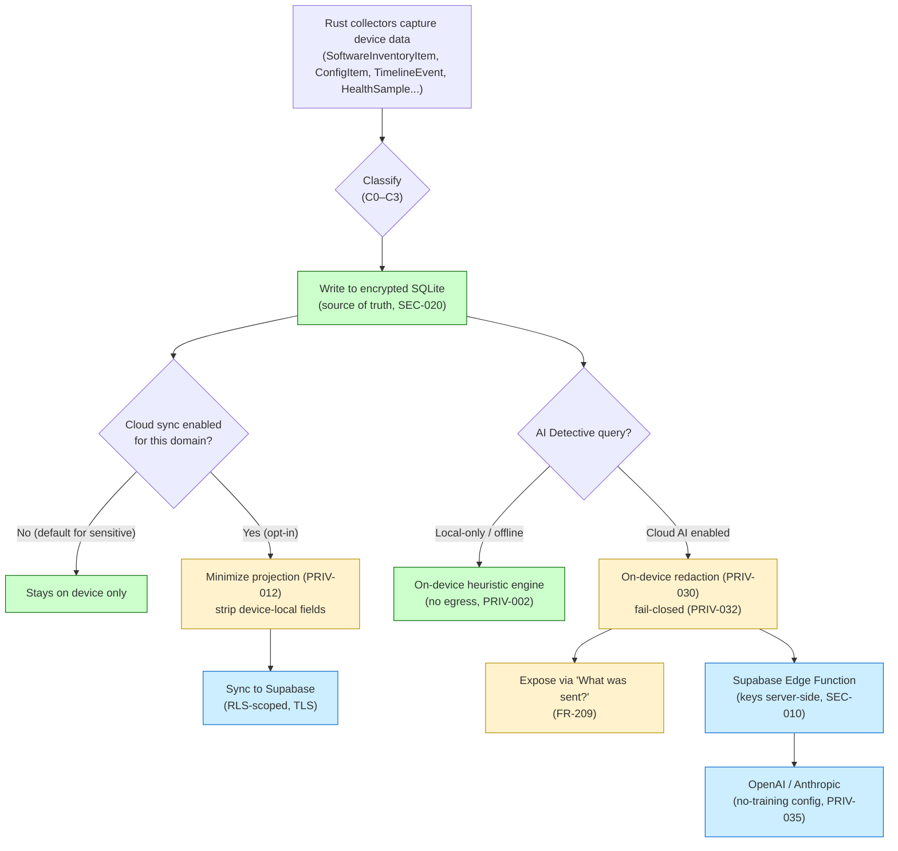

# 19. Privacy Requirements

> Privacy-by-design requirements (PRIV-###), the device data inventory and classification, on-device-first processing rules, AI data-handling and redaction-before-egress contracts, consent management, and user sync controls for DeviceLifeline. Part of the DeviceLifeline documentation suite — see [Documentation Index](README.md).

**Status:** Draft v1 · **Authoring role:** Privacy Architect + Staff Backend Engineer · **Last updated:** 2026-06-07
**Related:** [17. Security Requirements](17-security-requirements.md), [18. Compliance Requirements](18-compliance-requirements.md), [20. Data Retention Policies](20-data-retention-policies.md), [21. Device Telemetry Strategy](21-device-telemetry-strategy.md), [22. AI Diagnostics Design](22-ai-diagnostics-design.md)

---

## 1. Purpose & Scope

DeviceLifeline is, by design, a system that reads deeply into a user's computer: every installed application, every startup item and service, browser profiles and extensions, developer toolchains, hardware health, and a multi-month historical record of how the machine changed. That depth is the product's value — and its single largest privacy obligation. This document defines the **privacy requirements (PRIV-###)** that govern how that data is collected, classified, stored, minimized, processed, transmitted, and deleted.

Where [18. Compliance Requirements](18-compliance-requirements.md) maps obligations to legal frameworks (GDPR, CCPA/CPRA, regional laws), this document defines the **engineering-level privacy controls** that make those obligations true in code. It is the privacy contract for the locked stack: a Rust core that collects, a local SQLite store as the source of truth, opt-in sync to Supabase, and AI orchestration through Supabase Edge Functions to OpenAI/Anthropic.

**In scope:** Data inventory and classification of all device-derived data; privacy-by-design and on-device-first principles; data minimization; opt-in telemetry posture; pseudonymization; user controls over what syncs to Supabase; the exact AI data-handling and PII-redaction contract before data leaves the device; consent management; and regional handling — for V1 and near-term post-MVP.
**Out of scope:** The full legal framework mapping (see Doc 18), the retention schedule per store (see [20. Data Retention Policies](20-data-retention-policies.md)), the telemetry signal catalog and sampling design (see [21. Device Telemetry Strategy](21-device-telemetry-strategy.md)), and the security controls that protect this data (encryption, RLS, key handling — see [17. Security Requirements](17-security-requirements.md)).

---

## 2. Assumptions

- A1: The local SQLite database is the **source of truth**. Cloud sync to Supabase is an opt-in convenience (cross-device, restore portability, cloud AI context), not a precondition for core functionality (FR-014).
- A2: A user can run DeviceLifeline in **local-only mode** — full Device DNA, Performance Timeline, and Health Intelligence work with no data ever leaving the device (other than authenticated license validation, which carries no device-content payload).
- A3: AI Detective requires a network round-trip because API keys are server-side only (SEC-010). On-device pre-processing and redaction (FR-202, FR-203) is therefore the privacy perimeter for AI.
- A4: DeviceLifeline does **not** collect document contents, file contents, message contents, keystrokes, screen captures, or clipboard data. It collects *metadata about the machine's configuration and behavior*, not the user's personal files.
- A5: The product is primarily a desktop application; web-surface privacy (cookies, marketing pixels) is confined to the marketing site and billing portal and is governed by Doc 18 §8.3.
- A6: Device data inherently contains incidental personal data (usernames embedded in file paths, hostnames, account names). This is treated as personal data and redacted/pseudonymized per the rules below.
- A7: V1 does not process special-category data (health-in-the-medical-sense, biometric, financial account numbers). "Health" in DeviceLifeline means *machine* health (CPU/SSD/battery), not the data subject's health.

---

## 3. Privacy Principles (Privacy by Design)

DeviceLifeline adopts the seven foundational principles of Privacy by Design, operationalized for this stack:

| # | Principle | How DeviceLifeline operationalizes it |
|---|---|---|
| P1 | **Proactive, not reactive** | Privacy controls (redaction, consent gates, local-only mode) ship in V1, not retrofitted. PII redaction is enforced in the Rust pre-processor before any AI egress (FR-203). |
| P2 | **Privacy as the default** | Cloud sync OFF by default for the most sensitive domains; product analytics (PostHog) OFF until opt-in (COMP-007); the most private posture requires zero user action. |
| P3 | **Privacy embedded into design** | The architecture is local-first (A1). The cloud is opt-in. Sensitive processing (collection, diffing, correlation, health scoring) happens on-device in Rust. |
| P4 | **Full functionality (positive-sum)** | Local-only mode is not a degraded mode for core pillars. The user does not trade the Performance Timeline or Health Intelligence for privacy. Only cross-device/cloud-AI features require sync. |
| P5 | **End-to-end security** | Encrypted SQLite (SEC-020), TLS in transit (SEC-025), encrypted Storage (SEC-022), RLS isolation (SEC-040). See [17. Security Requirements](17-security-requirements.md). |
| P6 | **Visibility & transparency** | The "What was sent?" panel (FR-209) shows the exact redacted payload sent to AI. A Privacy Dashboard shows what is collected, what syncs, and lets the user export/delete. |
| P7 | **Respect for user privacy** | Granular per-domain sync toggles, opt-in telemetry, self-serve export and deletion (COMP-003), and a plain-English privacy notice. |

### 3.1 On-Device-First Processing (the core privacy posture)

**PRIV-001:** All collection, snapshot diffing, timeline correlation, and health scoring MUST be performed on-device in the Rust core. The cloud (Supabase) is used for storage/sync and AI orchestration only — never as the only place a computation can occur for core pillars.

**PRIV-002:** Core local features (Device DNA snapshotting, Performance Timeline, basic Health Intelligence, local AI heuristic fallback per [22. AI Diagnostics Design](22-ai-diagnostics-design.md) §9) MUST function with zero outbound device-content transmission. License/entitlement checks are exempt but MUST NOT carry device-content payloads.

**PRIV-003:** A "Local-Only Mode" account setting MUST exist. When enabled, the sync engine is disabled for all device-content domains, the AI Detective falls back to the offline heuristic engine, and the UI clearly indicates local-only operation.

---

## 4. Data Inventory & Classification

### 4.1 Classification scheme

| Class | Label | Definition | Default handling |
|---|---|---|---|
| C0 | **Public/Non-personal** | Reference data, software catalog metadata, no link to a person or device | No restriction |
| C1 | **Pseudonymous device data** | Machine configuration/behavior keyed to a random `device_id`/`user_id`, no direct identifiers in payload | Local by default; opt-in sync; redacted before AI |
| C2 | **Personal data** | Directly or indirectly identifies a person: email, account name, billing data, raw hostnames/usernames | Minimized, access-controlled (RLS), redacted before AI |
| C3 | **Sensitive content** | Free-text the user typed (AI query text, support messages) — may contain anything | Redacted on-device before egress; local query history not synced (FR-210) |

> DeviceLifeline holds **no C-special** (GDPR special-category) data in V1 (A7).

### 4.2 Device data inventory

Every data category the system touches, with its class, where it originates, where it lives, and whether it syncs. Retention per store is defined in [20. Data Retention Policies](20-data-retention-policies.md); this table fixes the **classification and egress posture**.

| Data Category | Canonical entities | Class | Origin (collector) | Default store | Syncs to Supabase? | Sent to AI? (after redaction) |
|---|---|---|---|---|---|---|
| **Software inventory** | `SoftwareInventoryItem` | C1 (paths/publisher may be C2) | Rust registry/WMI/WinGet/AppX collectors (FR-061) | SQLite | Opt-in (Pro) | Yes — summarized + redacted |
| **System configuration** | `ConfigItem` (startup, service, power, network) | C1 | Rust registry/WMI/service collectors | SQLite | Opt-in (Pro) | Yes — summarized + redacted |
| **Browser environment** | `BrowserProfile`, `BrowserExtension` | C1 (profile names/dirs may be C2) | Rust browser-profile collector | SQLite | **Opt-in, OFF by default** (heightened sensitivity) | Only if user enables; redacted |
| **Developer environment** | `DevEnvironmentItem`, `EnvironmentTemplate` | C1 (project paths may be C2) | Rust dev-env collector | SQLite | Opt-in (Developer tier) | Only if user enables; redacted |
| **Device DNA snapshot** | `DeviceDNASnapshot` | C1 | Rust snapshot composer ([24. Device DNA Design](24-device-dna-design.md)) | SQLite | Opt-in (Pro); Storage blob | Summary only; never full blob |
| **Performance timeline** | `TimelineEvent` | C1 | Rust collectors + correlation engine (FR-156) | SQLite | Opt-in (Pro) (FR-168) | Last 90 days, redacted (FR-202) |
| **Health samples / scores** | `HealthSample`, `HealthMetric`, `HealthScore` | C1 | Rust health collectors (FR-236) | SQLite | Opt-in (Pro) (FR-245) | Last 30 days, aggregated (FR-202) |
| **Crash data** | `CrashEvent` | C1 (dump metadata may be C2) | Event Log / minidump parser (FR-276) | SQLite | Opt-in (Pro) | Stop code + faulting module only |
| **AI query content** | `DiagnosisSession`, `DiagnosisFinding` | C3 (query text), C1 (findings) | User free-text + assembled context | SQLite (local history, FR-210) | **Query text NOT synced**; finding metadata optional | Query text + redacted context |
| **Account & identity** | `User`, `Account` | C2 | User registration (Supabase Auth) | Supabase | N/A (originates in cloud) | Never |
| **Subscription/licensing** | `Subscription`, `Plan`, `Entitlement`, `LicenseSeat` | C2 | Stripe/Paystack + Supabase | Supabase | N/A | Never |
| **Fleet/org data** | `FleetGroup`, `Policy`, `AuditLog` | C2 | Business Edition admin | Supabase | N/A (post-MVP) | Never |
| **Product analytics** | PostHog events | C1 (pseudonymous) | App instrumentation ([35. Event Tracking](35-event-tracking-specification.md)) | PostHog | Opt-in (COMP-007) | Never |
| **Crash/error telemetry** | Sentry events | C1 (PII-stripped, SEC-080) | Tauri/Edge runtime | Sentry | Opt-out | Never |

**PRIV-004:** Browser environment and developer environment domains are classified as **heightened-sensitivity C1** and MUST default to **sync OFF** even when the user has enabled cloud sync for other domains. Enabling their sync requires a distinct, explicit toggle.

**PRIV-005:** AI query text (C3) MUST NOT be synced to Supabase as identifiable content. Only a one-way query *hash* and anonymized rating may be stored cloud-side for product analytics (FR-208). Local query history (FR-210) stays on-device.

---

## 5. Data Minimization

**PRIV-010:** Collectors MUST capture only the fields enumerated in the functional spec for each domain (e.g., FR-062 software fields). Collectors MUST NOT capture file *contents*, document bodies, or any data field not required for a documented feature.

**PRIV-011:** The AI context payload MUST be minimized before egress: summarized (not raw rows), bounded windows (timeline ≤ 90 days, health ≤ 30 days, snapshot summary not full blob — FR-202), relevance-ranked, and truncated to the model token budget. Raw SQLite tables are never shipped.

**PRIV-012:** Supabase sync MUST transmit only the columns required for the cloud feature. Internal-only or device-local diagnostic fields MUST be excluded from the sync projection.

**PRIV-013:** Pseudonymous identifiers MUST be used in preference to direct identifiers wherever a feature does not require the real value (e.g., PostHog person keyed to a hashed `user_id`, not email — see Doc 18 §4).

**PRIV-014:** Free-text fields exposed to the user (AI query input) MUST carry an inline privacy hint discouraging entry of secrets/credentials, and MUST be subject to the redaction pipeline (§7) regardless.

---

## 6. Pseudonymization & Identifiers

| Identifier | Type | Where used | Privacy treatment |
|---|---|---|---|
| `user_id` | UUID (Supabase Auth) | Cloud rows, RLS key | Direct key cloud-side; **hashed** for PostHog person id |
| `device_id` | Random UUID (per install) | SQLite + cloud device rows | Not derived from hardware serials in V1; rotates on reinstall |
| `account_id` / `organization_id` | UUID | Business/Technician scoping | RLS-scoped (SEC-042, SEC-043) |
| `query_hash` | SHA-256 of normalized query | AI analytics | One-way; cannot reconstruct query text |
| `snapshot_id` | UUID | DNA snapshot identity | No personal data in the identifier itself |

**PRIV-020:** The `device_id` MUST be a randomly generated UUID stored locally, NOT a hardware serial, MAC address, or other hardware-bound identifier in V1. (Hardware-bound attestation is a Business Edition post-MVP item — see SEC Future Considerations.)

**PRIV-021:** Where data is used for analytics or AI rating, it MUST be pseudonymized (hashed/aggregated) such that it cannot be trivially re-identified to a natural person without access to the controlled join key held in Supabase.

**PRIV-022:** Re-identification of pseudonymized analytics data MUST require privileged Supabase access governed by RLS/service-role policy (SEC-045); it MUST NOT be possible from the analytics tool (PostHog) alone.

---

## 7. AI Data Handling & Redaction Before Egress

This is the highest-stakes privacy boundary in the product: the moment device-derived data leaves the device for an LLM. The full diagnostic design is in [22. AI Diagnostics Design](22-ai-diagnostics-design.md); the **privacy contract** is defined here.

### 7.1 What is and is not sent

**Sent to OpenAI/Anthropic (via Supabase Edge Function only):**
- The user's natural-language query text (C3), after redaction.
- A **redacted, summarized** context payload: bounded timeline-event descriptions (last 90 days), Device DNA summary (counts, notable items — not the full blob), aggregated health readings (last 30 days), and crash stop-code/faulting-module metadata.

**Never sent to AI:**
- Email, account name, billing data, payment tokens (C2 identity).
- Full file contents, document bodies, clipboard, screenshots.
- The full Device DNA blob or raw SQLite tables.
- Raw, unredacted file paths, usernames, hostnames, IP addresses, or serials.

### 7.2 Mandatory on-device redaction (the redaction contract)

**PRIV-030:** Before any payload leaves the device for AI, the Rust pre-processor MUST apply deterministic redaction (FR-203), replacing at minimum:

| Pattern | Replacement token | Examples redacted |
|---|---|---|
| Windows user profile paths | `<file_path>` | `C:\Users\jane.doe\AppData\...` → `C:\Users\<username>\AppData\...` then `<file_path>` |
| Usernames / account names | `<username>` | `jane.doe`, `DESKTOP-7H3\jane` |
| Hostnames / machine names | `<hostname>` | `DESKTOP-7H3K2L1` |
| IPv4 / IPv6 addresses | `<ip_address>` | `192.168.1.42`, `fe80::1` |
| Email addresses | `<email>` | embedded support/account strings |
| Hardware serials / UUIDs that are identifiers | `<serial>` | disk serials, BIOS serials |
| High-entropy secret-like tokens | `<redacted_secret>` | API keys, tokens accidentally in paths |

**PRIV-031:** Redaction MUST run **on-device, before transmission** — never server-side as the first line of defense. (Edge-side validation per SEC-072 is a defense-in-depth secondary check, not the primary control.)

**PRIV-032:** Redaction MUST be **fail-closed**: if the redactor cannot confidently process a field (parse error, unexpected format), that field MUST be dropped or fully masked rather than sent raw. A redaction failure MUST NOT silently leak the raw value.

**PRIV-033:** The redaction ruleset (regex catalog + masking logic) MUST be unit-tested and fuzz-tested (aligns with SEC-091) against a corpus of representative paths, hostnames, and secret patterns, with measured precision/recall targets (target ≥ 0.98 recall on the known PII corpus).

**PRIV-034:** The exact payload transmitted MUST be inspectable by the user via the "What was sent?" panel (FR-209) **after** redaction, so the user sees precisely what the model received.

**PRIV-035:** AI providers MUST be configured (contractually and via API parameters where available) so that DeviceLifeline data is **not used to train provider models** (e.g., OpenAI API data is not used for training by default; confirm Anthropic equivalent). This requirement is tracked against the DPAs in Doc 18 §4.

**PRIV-036:** The Edge Function MUST treat the context block as **data, not instructions** (SEC-073), and MUST NOT echo back into responses any raw value that redaction was meant to remove.

### 7.3 AI egress flow (privacy view)

See the sequence diagram in §10. The privacy invariants are: (1) redaction precedes egress; (2) keys never leave the Edge Function (SEC-010); (3) no identity data (C2) is in the payload; (4) the user can audit the payload (FR-209).

---

## 8. User Controls Over Sync (Granular Privacy Dashboard)

**PRIV-040:** The app MUST provide a **Privacy Dashboard** (in Settings & Privacy, MOD-14) exposing, at minimum:

```
Privacy & Data Controls
├── Local-Only Mode ............................. [ off ]   (PRIV-003)
├── Cloud Sync (master) ......................... [ off ]   default off for new accounts
│    ├── Software inventory ..................... [ — ]
│    ├── System configuration ................... [ — ]
│    ├── Browser environment .................... [ off ]   heightened (PRIV-004)
│    ├── Developer environment .................. [ off ]   heightened (PRIV-004)
│    ├── Device DNA snapshots (Storage blob) ..... [ — ]
│    ├── Performance timeline ................... [ — ]
│    ├── Health samples ......................... [ — ]
│    └── Crash data ............................. [ — ]
├── AI Detective
│    ├── Enable cloud AI (vs local heuristic) .... [ off ]  (PRIV-003 fallback)
│    ├── Show "What was sent?" by default ........ [ on  ]  (FR-209)
│    └── Include browser/dev data in AI context .. [ off ]  (PRIV-004)
├── Telemetry
│    ├── Product analytics (PostHog) ............. [ off ]  opt-in (COMP-007)
│    ├── Performance telemetry (aggregate) ....... [ off ]  opt-in
│    └── Crash reporting (Sentry) ................ [ on  ]  opt-out (legit. interest)
├── My Data
│    ├── Export all my data (JSON) ............... [ → ]    (COMP-003, Art. 20)
│    ├── Delete cloud data (keep local) .......... [ → ]
│    └── Delete account & all data .............. [ → ]    (COMP-003, Art. 17)
└── Consent history ............................. [ → ]    (user_consent_log)
```

**PRIV-041:** Disabling sync for a domain MUST stop future sync **and** offer to purge already-synced cloud copies of that domain (linking to the deletion mechanics in [20. Data Retention Policies](20-data-retention-policies.md)).
**PRIV-042:** Toggling any control MUST take effect within the current session (no restart) and MUST be recorded in `user_consent_log` where it constitutes a consent change (COMP-008).
**PRIV-043:** The dashboard MUST present, in plain English, *what each domain contains* and *why it might sync* so consent is informed (P6).

---

## 9. Consent Management

**PRIV-050:** A first-run consent screen MUST capture analytics/performance-telemetry consent **before** any such data is collected (COMP-007). Core local functionality MUST NOT be gated on granting these optional consents.

**PRIV-051:** Consent MUST be **granular and unbundled**: product use, analytics, performance telemetry, and marketing email are separate choices (GDPR freely-given requirement).

**PRIV-052:** Consent records MUST be written to the Supabase `user_consent_log` table (schema defined in Doc 18 §8.2): `consent_type`, `granted`, `granted_at`, `revoked_at`, `consent_version`, `ip_country`.

**PRIV-053:** Withdrawal of consent MUST be as easy as granting it (single toggle in the Privacy Dashboard) and MUST stop the corresponding processing promptly.

**PRIV-054:** When consent text changes materially, the new `consent_version` MUST be recorded and, for material changes, re-consent MUST be requested.

---

## 10. Diagrams

### 10.1 Data egress decision flow (collection → store → optional sync/AI)



### 10.2 AI redaction boundary (privacy view of the AI request)

```mermaid
sequenceDiagram
    participant User as "User"
    participant Rust as "Rust Core (on-device)"
    participant UI as "React UI"
    participant Edge as "Supabase Edge Function"
    participant LLM as "OpenAI / Anthropic"

    User->>UI: Types NL query (C3)
    UI->>Rust: Request context assembly
    Rust->>Rust: Assemble bounded context\n(timeline 90d, health 30d, DNA summary)
    Rust->>Rust: Redact PII (PRIV-030) — fail-closed (PRIV-032)
    Rust-->>UI: Redacted payload
    UI->>UI: Render "What was sent?" (FR-209)
    UI->>Edge: POST redacted payload + query (TLS, user JWT)
    Edge->>Edge: Defense-in-depth validation (SEC-072)
    Edge->>LLM: Prompt (context = data, not instructions)
    LLM-->>Edge: Structured findings
    Edge-->>UI: DiagnosisFindings (no raw PII echoed, PRIV-036)
    Note over Rust,LLM: Identity (C2) never enters payload; keys never leave Edge
```

---

## 11. Risks & Mitigations

| Risk | Likelihood | Impact | Mitigation |
|---|---|---|---|
| Incidental PII (username in path) leaks to LLM | Medium | High | Deterministic on-device redaction (PRIV-030), fail-closed (PRIV-032), tested corpus ≥0.98 recall (PRIV-033), user-visible payload (FR-209) |
| User pastes a secret/credential into the AI query box | Medium | High | Inline privacy hint (PRIV-014), high-entropy token redaction (PRIV-030), local-only query history (FR-210) |
| Browser/dev data synced unexpectedly | Low | Medium | Heightened domains default OFF (PRIV-004); distinct explicit toggle; sync projection audited |
| AI provider uses data for training | Low | High | No-training API configuration + DPA (PRIV-035, Doc 18 §4) |
| Redaction regression after a refactor | Medium | High | Redaction unit + fuzz tests in CI (PRIV-033, SEC-091); release-blocking |
| Pseudonymous analytics re-identified | Low | Medium | Hashed ids (PRIV-021), join key gated by RLS/service-role (PRIV-022, SEC-045) |
| Consent not honored across sessions | Low | High | Consent persisted to `user_consent_log` (PRIV-052); enforced at collection time; quarterly audit (Doc 18 §11.2) |
| "Delete cloud data" leaves orphaned Storage blobs | Medium | Medium | Cascade includes Supabase Storage (Doc 18 §5.4); deletion test in CI (Doc 20) |

---

## 12. Future Considerations

- **On-device LLM / local inference:** A small local model for AI Detective would eliminate AI egress entirely for privacy-maximalist users (ties to [22. AI Diagnostics Design](22-ai-diagnostics-design.md) and Doc 58).
- **Differential privacy for aggregate telemetry:** Apply DP noise to product-improvement aggregates so individual devices are unrecoverable from cohort stats.
- **Client-side encryption of synced DNA blobs:** End-to-end encrypt Storage blobs with a user-held key so even DeviceLifeline cannot read snapshot contents at rest.
- **Federated correlation:** Improve correlation models from device-side gradients without centralizing raw timelines.
- **Per-domain retention overrides in the Privacy Dashboard:** Let users set their own retention windows below the platform default (extends Doc 20).
- **EU AI Act transparency log:** If AI Detective is classed as limited-risk, add a transparency/decision log (Doc 18 Future Considerations).

---

## 13. Acceptance Criteria

- AC-PRIV-001: A complete device data inventory exists, each category assigned a class (C0–C3), an origin collector, a default store, a sync posture, and an AI-egress posture (§4.2).
- AC-PRIV-002: On-device-first processing is mandated (PRIV-001) and Local-Only Mode is specified (PRIV-003) with core pillars functioning with zero device-content egress (PRIV-002).
- AC-PRIV-003: Data minimization rules constrain collection, sync projection, and AI payload (PRIV-010–PRIV-013).
- AC-PRIV-004: The AI redaction contract enumerates every PII pattern → token mapping, is on-device and fail-closed, and is tested (PRIV-030–PRIV-033).
- AC-PRIV-005: The transmitted AI payload is user-inspectable via "What was sent?" (PRIV-034 / FR-209).
- AC-PRIV-006: Heightened-sensitivity domains (browser, dev environment) default to sync OFF (PRIV-004).
- AC-PRIV-007: A granular Privacy Dashboard with per-domain sync toggles, AI controls, telemetry toggles, and export/delete actions is specified (PRIV-040).
- AC-PRIV-008: Consent is granular, unbundled, opt-in for analytics, withdrawable, and logged to `user_consent_log` (PRIV-050–PRIV-054).
- AC-PRIV-009: Pseudonymization uses random `device_id` (not hardware serial) and one-way `query_hash` (PRIV-020, PRIV-021).
- AC-PRIV-010: The document cross-links to [17. Security Requirements](17-security-requirements.md), [18. Compliance Requirements](18-compliance-requirements.md), [20. Data Retention Policies](20-data-retention-policies.md), [21. Device Telemetry Strategy](21-device-telemetry-strategy.md), and [22. AI Diagnostics Design](22-ai-diagnostics-design.md).
