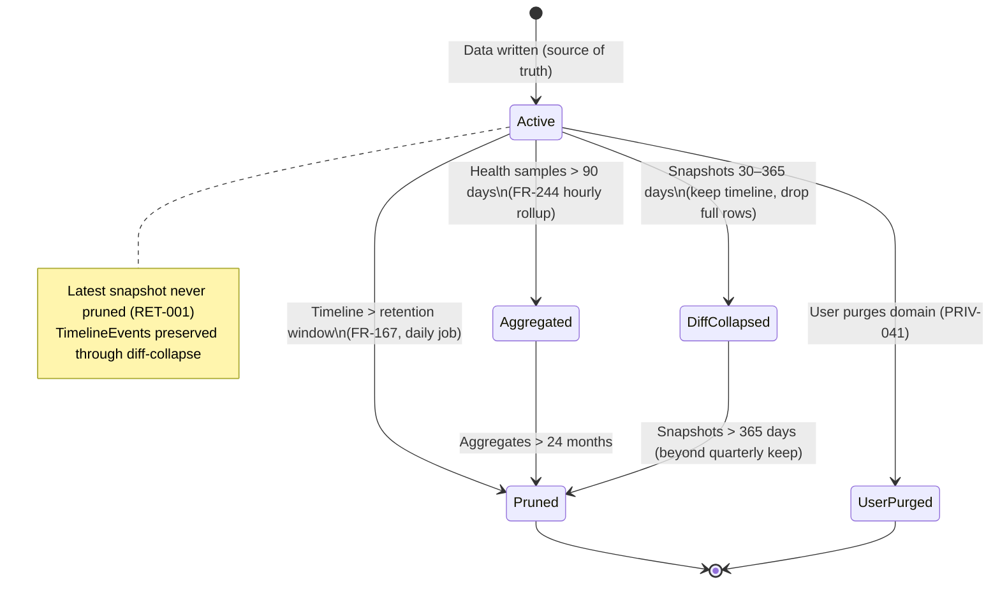
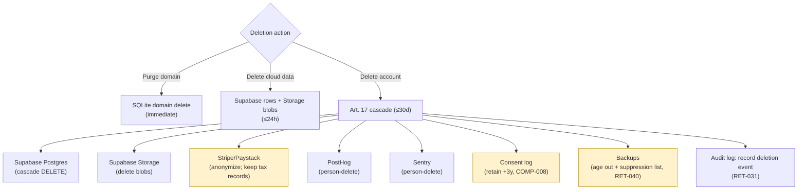

# 20. Data Retention Policies

> Retention schedule per data category across each store (local SQLite, Supabase, PostHog, Sentry), retention-by-tier, purge and deletion mechanics, user-initiated deletion and account closure, backup retention, and anonymized analytics for DeviceLifeline. Part of the DeviceLifeline documentation suite — see [Documentation Index](README.md).

**Status:** Draft v1 · **Authoring role:** Privacy Architect + Staff Backend Engineer · **Last updated:** 2026-06-07
**Related:** [18. Compliance Requirements](18-compliance-requirements.md), [19. Privacy Requirements](19-privacy-requirements.md), [21. Device Telemetry Strategy](21-device-telemetry-strategy.md), [32. Database Design](32-database-design.md), [42. Disaster Recovery Plan](42-disaster-recovery-plan.md)

---

## 1. Purpose & Scope

This document defines **how long DeviceLifeline keeps each kind of data, in each store, and how that data is purged or deleted** — both automatically (scheduled retention) and on demand (user-initiated deletion, account closure). Retention is a privacy control (data minimization over time, GDPR storage-limitation principle Art. 5(1)(e)) and an engineering control (bounding local SQLite growth and cloud cost).

DeviceLifeline spans four stores with different ownership and lifecycle: the **local SQLite** database (the source of truth, on the user's machine), **Supabase** (opt-in cloud sync: Postgres + Storage), **PostHog** (opt-in product analytics), and **Sentry** (opt-out crash/error reporting). Each has a distinct retention regime.

**In scope:** Per-category retention across all four stores; retention-by-tier (Free vs Pro vs Developer/Technician/Business); automatic purge mechanics; user-initiated deletion and account closure cascades; backup retention; and the anonymization path for long-term analytics — for V1 and near-term post-MVP.
**Out of scope:** The classification of the data itself (see [19. Privacy Requirements](19-privacy-requirements.md) §4), the telemetry signal catalog (see [21. Device Telemetry Strategy](21-device-telemetry-strategy.md)), the legal frameworks behind these durations (see [18. Compliance Requirements](18-compliance-requirements.md)), and the DR/backup *infrastructure* design (see [42. Disaster Recovery Plan](42-disaster-recovery-plan.md)).

---

## 2. Assumptions

- A1: Local SQLite is the source of truth; deleting cloud data never deletes the user's local data, and vice versa, unless the user explicitly requests both (A1 of Doc 19).
- A2: Retention windows align with the functional spec already set: timeline events default ≥ 365 days local (FR-167); health samples ≥ 90 days local with hourly aggregation thereafter (FR-244); local AI query history capped at the last 50 queries (FR-210).
- A3: Free tier keeps shorter cloud history; Pro and above keep longer history. Local retention is user-controllable (FR-167).
- A4: "Deletion" means making data irrecoverable through normal operations within the stated SLA; backups age out separately per §7.
- A5: Account closure triggers the GDPR Art. 17 erasure cascade defined in Doc 18 §5.4 across Supabase, Stripe/Paystack, PostHog, and Sentry.
- A6: Retention durations are configurable server-side (per-tier defaults) without a client release; user-facing local windows are configurable in-app within safe bounds.
- A7: Anonymized/aggregated analytics that contain no personal data and cannot be re-identified fall outside personal-data retention limits and may be kept for trend analysis (§8).

---

## 3. Retention Principles

| # | Principle | Implication |
|---|---|---|
| R1 | **Keep only as long as useful + lawful** | Each category has a justified maximum; nothing is kept "just in case." |
| R2 | **Local-first, longest locally** | The richest history lives on-device where the user controls it; cloud retention is bounded and tier-gated. |
| R3 | **Tier-scaled cloud retention** | Free gets a short cloud window; paid tiers get longer, matching product value. |
| R4 | **Aggregate, then prune** | High-volume series (health samples) are downsampled to preserve trends while shrinking footprint (FR-244). |
| R5 | **Deletion is real and cascading** | User-initiated deletion cascades across all stores and sub-processors (Doc 18 §5.4). |
| R6 | **Backups age out** | Backups are retained for DR only, on a fixed rotation, then destroyed (§7). |
| R7 | **Sensitive content gets the shortest leash** | AI query text (C3) is local-only and capped; never accumulated cloud-side as identifiable content (PRIV-005). |

---

## 4. Master Retention Schedule (category → store → retention → deletion)

The authoritative table. Durations are **defaults**; tier overrides in §5. "Trigger" is what initiates deletion of an item.

| Data category (entity) | Store | Default retention | Deletion trigger / mechanism |
|---|---|---|---|
| **Software inventory** (`SoftwareInventoryItem`) | SQLite | Current state + change history kept while related snapshots/timeline persist | Superseded by newer snapshot diff; pruned with parent snapshot (§4.1) |
| **System configuration** (`ConfigItem`) | SQLite | As above | Pruned with parent snapshot |
| **Browser env** (`BrowserProfile`, `BrowserExtension`) | SQLite | As above | Pruned with parent snapshot; user can purge domain (PRIV-041) |
| **Developer env** (`DevEnvironmentItem`) | SQLite | As above | Pruned with parent snapshot; user can purge domain |
| **Device DNA snapshots** (`DeviceDNASnapshot`) | SQLite | Last **N** snapshots retained (default keep last 30 + 1 per month older); older diff-collapsed | Snapshot retention job (§4.1) |
| **Device DNA snapshots** (blob) | Supabase Storage | Pro: last 10 full blobs; Free: latest 1 (if synced) | Storage lifecycle delete; cascades on domain/account deletion |
| **Performance timeline** (`TimelineEvent`) | SQLite | **≥ 365 days** (user-configurable, FR-167) | Daily prune of events older than window |
| **Performance timeline** (`TimelineEvent`) | Supabase Postgres | Free: 30 days; Pro+: 400 days | Scheduled purge (pg cron / Edge) by `created_at` |
| **Health samples** (`HealthSample`) | SQLite | **≥ 90 days** raw; older → hourly aggregates (FR-244) | Daily aggregate-then-prune job |
| **Health samples** (`HealthSample`) | Supabase Postgres | Free: 14 days; Pro+: 180 days raw + 24 mo aggregates | Scheduled purge + rollup |
| **Health scores** (`HealthScore`, `HealthMetric`) | SQLite / Supabase | Mirrors health samples | Pruned with samples |
| **Crash data** (`CrashEvent`) | SQLite | 180 days | Daily prune by timestamp |
| **Crash data** (`CrashEvent`) | Supabase Postgres | Pro+: 180 days (if synced) | Scheduled purge |
| **AI sessions** (`DiagnosisSession`, `DiagnosisFinding`) | SQLite | Last **50** queries (FR-210) | Ring-buffer eviction (oldest dropped) |
| **AI query text** (C3) | Supabase | **Not stored as content**; only `query_hash` + rating (PRIV-005, FR-208) | N/A (never persisted as content) |
| **AI usage/limits** (counts) | Supabase Postgres | Rolling 90 days for limit enforcement + billing | Scheduled purge after 90 days |
| **Account & identity** (`User`, `Account`) | Supabase Postgres | Life of account | Deleted on account closure cascade (Doc 18 §5.4) |
| **Subscription/licensing** (`Subscription`, `Entitlement`, `LicenseSeat`) | Supabase + Stripe/Paystack | Life of account; **financial records 7 years** (legal/tax) post-closure (anonymized where possible) | Account data deleted; financial/tax records retained per statutory minimum then purged |
| **Consent log** (`user_consent_log`) | Supabase Postgres | Life of account **+ 3 years** (COMP-008) | Purged 3 years after account closure |
| **Audit log** (`AuditLog`, security events SEC-081) | Supabase Postgres | 12 months (security), then archived/aggregated | Scheduled archive + purge |
| **Fleet/org data** (`FleetGroup`, `Policy`) | Supabase Postgres | Life of org account (post-MVP) | Deleted on org closure |
| **Product analytics** | PostHog | Free: aggregate retained; raw events **12 months**, then aggregated | PostHog retention config + person-delete API |
| **Crash/error telemetry** | Sentry | **90 days** (default Sentry retention) | Sentry auto-expiry + person-delete API |
| **Cloud backups** (Supabase PITR/snapshots) | Supabase / DR store | PITR window + snapshot rotation (§7) | Automatic rotation expiry |

### 4.1 Snapshot retention & diff-collapsing (local)

To keep the full Device DNA history useful without unbounded SQLite growth:

```
Snapshot retention policy (local, default):
  - Keep ALL snapshots for the last 30 days (full fidelity).
  - For 30–365 days old: keep one snapshot per calendar month;
    intermediate snapshots are "diff-collapsed" — the full row set is
    removed but the TimelineEvents derived from their diffs are retained
    (timeline is the durable history; see [23. Performance Timeline Design](23-performance-timeline-design.md)).
  - Older than 365 days: keep one snapshot per quarter (or per user config).
  - The most recent snapshot is NEVER pruned (needed as the diff baseline,
    see [24. Device DNA Design](24-device-dna-design.md)).
```

**RET-001:** The snapshot retention job MUST never delete the latest snapshot and MUST preserve `TimelineEvent` rows even when their source snapshots are diff-collapsed, so the Performance Timeline (the primary differentiator) is not silently truncated.

---

## 5. Retention by Tier

Cloud retention scales with tier; local retention is user-controlled and identical across tiers (the user owns their disk).

| Category (cloud) | Free | Pro | Developer | Technician | Business |
|---|---|---|---|---|---|
| Timeline events (Supabase) | 30 days | 400 days | 400 days | 400 days / client | 400 days / device |
| Health samples (Supabase) | 14 days | 180 days raw + 24 mo agg | 180 days + 24 mo agg | same | same + fleet rollups |
| DNA snapshot blobs (Storage) | latest 1 | last 10 | last 10 + templates | last 10 / client device | per-policy / device |
| Crash data (Supabase) | not synced | 180 days | 180 days | 180 days / client | 180 days / device |
| AI usage records | n/a (preview cap) | 90 days | 90 days | 90 days | 90 days |
| Audit log | — | — | — | 12 months | 12 months |

**RET-010:** Tier downgrade (e.g., Pro → Free) MUST trigger a grace period (default 30 days) during which cloud data above the new tier's limit is retained read-only, then purged to the lower tier's window. The user MUST be notified and offered an export before purge.
**RET-011:** Local retention windows (timeline, health) MUST be user-configurable in Settings within safe bounds (e.g., timeline 90–1095 days; health 30–365 days raw) regardless of tier (FR-167, FR-244).

---

## 6. Purge & Deletion Mechanics

### 6.1 Scheduled purge (automatic)

| Store | Mechanism | Cadence |
|---|---|---|
| **SQLite (on-device)** | Rust scheduler runs retention jobs (prune timeline, aggregate-then-prune health, snapshot retention, AI ring-buffer) | Daily, low-priority, deferred under battery/idle constraints (see [21. Device Telemetry Strategy](21-device-telemetry-strategy.md)) |
| **Supabase Postgres** | `pg_cron` job or scheduled Edge Function deletes rows past tier window; `VACUUM`/partition drop for high-volume tables | Daily |
| **Supabase Storage** | Storage lifecycle/cleanup job removes blobs past the tier's keep-count | Daily |
| **PostHog** | Native retention config (raw event expiry) + scheduled aggregation export | Per PostHog config |
| **Sentry** | Native 90-day expiry | Automatic |

**RET-020:** High-volume tables (`health_samples`, `timeline_events`) SHOULD be **time-partitioned** in Postgres so retention is a partition-drop (fast, low-lock) rather than a row-by-row delete. Local SQLite uses indexed `created_at` range deletes within a transaction.
**RET-021:** Local purge jobs MUST be resumable and idempotent; a job interrupted by shutdown/sleep MUST resume safely without double-processing or corrupting indexes.

### 6.2 User-initiated deletion (self-serve)

Three distinct user actions, each with defined scope (exposed in the Privacy Dashboard, PRIV-040):

| Action | Scope | SLA |
|---|---|---|
| **Purge a domain locally** | Delete one domain (e.g., browser env) from SQLite | Immediate |
| **Delete cloud data (keep local)** | Delete all synced rows + Storage blobs from Supabase; local SQLite untouched (PRIV-041) | Immediate initiation; complete ≤ 24h |
| **Delete account & all data** | Full Art. 17 cascade (below) | Immediate initiation; complete ≤ 30 days (COMP-003) |

### 6.3 Account closure cascade (Art. 17)

Account deletion executes the cascade specified in Doc 18 §5.4 and visualized there. Summary of stores touched and what is **retained** by exception:

| Store | Action on account closure | Exception (retained) |
|---|---|---|
| Supabase Postgres | Cascade DELETE user, devices, snapshots, timeline, health, crash, AI usage | Consent log kept +3 yrs (COMP-008); anonymized financial summary per tax law |
| Supabase Storage | Delete all DNA blobs for the user | — |
| Stripe / Paystack | Anonymize customer; retain invoices per tax/legal (≈7 yrs) | Financial records (statutory) |
| PostHog | Person-delete API (distinct_id) | Pre-aggregated, de-identified cohort stats (§8) |
| Sentry | Person-delete API; events expire ≤ 90 days | — |
| Local SQLite | App offers local wipe of auth tokens + (optional) full local data wipe (FR-021) | User may choose to keep local data |

**RET-030:** The deletion pipeline MUST track per-store completion and emit a confirmation only when all in-scope stores confirm (Doc 18 sequence diagram). Failures MUST be retried and surfaced to the Privacy Lead if unresolved within SLA.
**RET-031:** Account closure MUST record a deletion event in the audit log (the audit row itself is retained per audit retention, but contains no restored personal data).

---

## 7. Backup Retention

Backups exist for disaster recovery only and have their own bounded lifecycle (full DR design in [42. Disaster Recovery Plan](42-disaster-recovery-plan.md)).

| Backup type | Store | Retention | Notes |
|---|---|---|---|
| Supabase Postgres PITR (WAL) | Supabase managed | Rolling PITR window (e.g., 7 days) | Continuous; supports point-in-time restore |
| Supabase daily snapshot | Supabase managed / DR | 30 days rolling | Daily logical/physical snapshot |
| Weekly archival snapshot | Cold storage (DR) | 90 days | Long-horizon recovery |
| Local SQLite (user-controlled) | User device | User-managed | Not a DeviceLifeline cloud backup; user may export |

**RET-040:** Deleted personal data MAY persist in backups until the backup naturally ages out (a standard, disclosed practice). The Privacy Policy MUST disclose this; restored backups MUST NOT silently resurrect data the user deleted — a **re-deletion / suppression list** MUST be applied after any restore that predates a deletion request.
**RET-041:** Backup retention windows MUST be fixed and documented; backups MUST be encrypted at rest (SEC-022/023) and access-restricted.

---

## 8. Anonymized & Aggregated Analytics

Some value (product trends, fleet benchmarks, model improvement signals) does not require personal data to persist. Such data may be kept beyond personal-data windows **only if** it is irreversibly de-identified.

**RET-050:** Before retaining analytics past the raw window, data MUST be aggregated/de-identified such that re-identification of an individual or single device is infeasible (k-anonymity threshold, removal of join keys). This aligns with PostHog raw-event expiry → aggregate retention.
**RET-051:** AI rating/usage analytics MUST be keyed to `query_hash` and pseudonymous ids only (PRIV-005, PRIV-021); raw query text is never retained cloud-side as content.
**RET-052:** De-identified aggregates that contain no personal data (A7) are exempt from the deletion cascade (they describe no individual) but their generation pipeline MUST be documented for audit.

---

## 9. Diagrams

### 9.1 Local SQLite retention lifecycle



### 9.2 Deletion fan-out across stores



---

## 10. Risks & Mitigations

| Risk | Likelihood | Impact | Mitigation |
|---|---|---|---|
| SQLite grows unbounded on heavy machines | Medium | Medium | Daily aggregate-then-prune + snapshot diff-collapse (FR-244, §4.1); partition-style range deletes (RET-020) |
| Timeline silently truncated when snapshots collapse | Medium | High | Preserve `TimelineEvent` through diff-collapse (RET-001) |
| Deleted data resurrected by a backup restore | Low | High | Suppression/re-deletion list applied post-restore (RET-040); disclosed in policy |
| Tier downgrade purges data the user still wanted | Medium | Medium | 30-day grace + export offer before purge (RET-010) |
| Deletion cascade misses a sub-processor | Medium | High | Per-store completion tracking + retry (RET-030); quarterly deletion test (Doc 18 §11.2) |
| Statutory financial-record retention conflicts with erasure | Low | Medium | Anonymize then retain only statutory financial fields (§4 subscription row; Doc 18) |
| Local purge job corrupts DB if interrupted | Low | High | Idempotent, resumable, transactional jobs (RET-021) |

---

## 11. Future Considerations

- **User-configurable cloud retention:** Let paid users tune cloud windows (shorter for privacy, longer for analysis) within tier ceilings.
- **Legal hold mechanism:** For Business/Technician, support suspending purge on specific records under legal hold.
- **Cold-tier archival for power users:** Compressed, client-encrypted long-horizon timeline archive (ties to Doc 19 Future Considerations).
- **Right-to-be-forgotten verification report:** Auto-generate a per-request deletion certificate enumerating stores touched.
- **Region-specific retention overrides:** Shorter defaults where local law mandates (e.g., data-localization regions, Doc 18 §10).
- **Differential-privacy aggregates:** Strengthen §8 de-identification with DP noise.

---

## 12. Acceptance Criteria

- AC-RET-001: A master retention schedule maps every data category to each store (SQLite, Supabase, PostHog, Sentry) with a default retention and a deletion trigger (§4).
- AC-RET-002: Retention-by-tier is specified with Free shorter than Pro+ for cloud categories, and local windows user-configurable (§5).
- AC-RET-003: Snapshot diff-collapsing preserves the Performance Timeline and never deletes the latest snapshot (RET-001).
- AC-RET-004: Automatic purge mechanics are defined per store with cadence, and high-volume tables use partitioning/range deletes (§6.1, RET-020).
- AC-RET-005: Three user-initiated deletion actions (purge domain, delete cloud, delete account) are defined with scope and SLA (§6.2).
- AC-RET-006: The account-closure cascade enumerates every store and its exceptions (consent +3y, statutory financial records) (§6.3).
- AC-RET-007: Backup retention windows are fixed and a post-restore suppression mechanism prevents resurrection of deleted data (RET-040).
- AC-RET-008: Anonymized analytics retention requires irreversible de-identification before long-term retention (RET-050).
- AC-RET-009: The deletion fan-out and local retention lifecycle are shown as diagrams.
- AC-RET-010: The document cross-links to [18. Compliance Requirements](18-compliance-requirements.md), [19. Privacy Requirements](19-privacy-requirements.md), [21. Device Telemetry Strategy](21-device-telemetry-strategy.md), and [42. Disaster Recovery Plan](42-disaster-recovery-plan.md).
