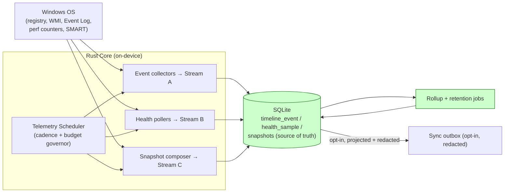
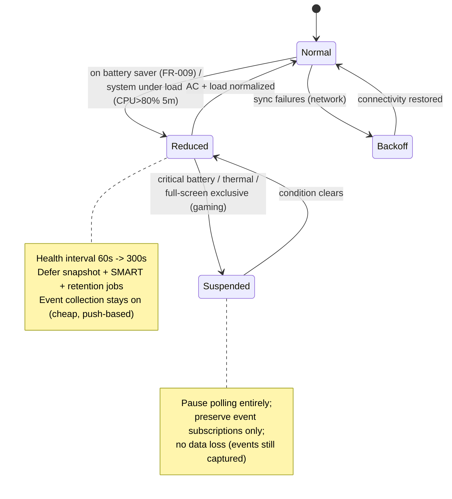
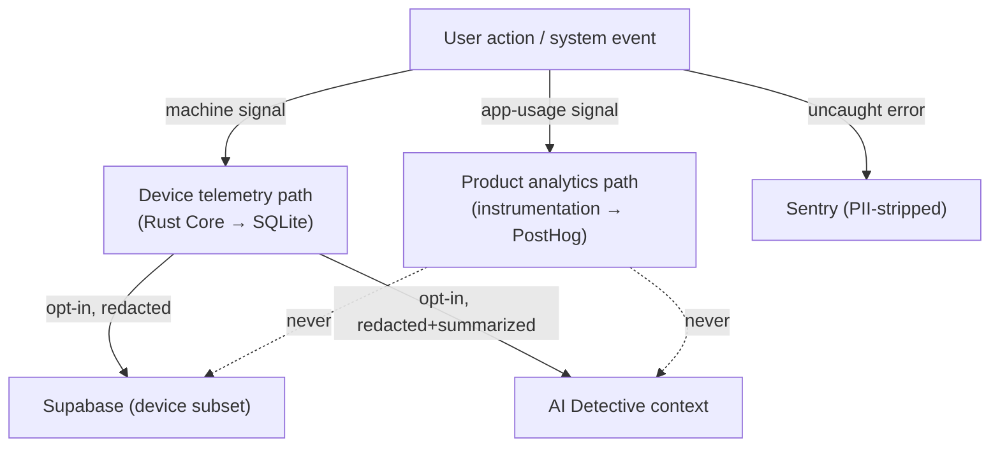
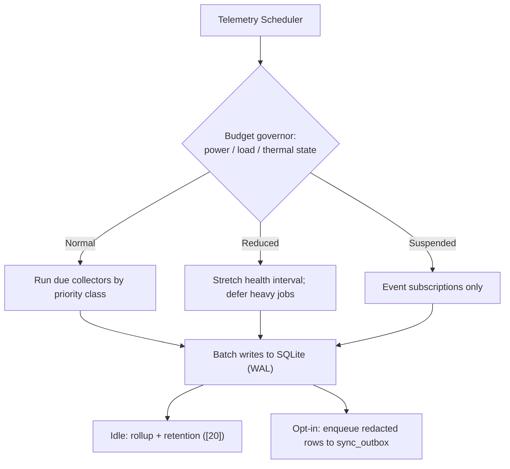

# 21. Device Telemetry Strategy

> The device-signal collection strategy for DeviceLifeline's Rust Core: what signals are sampled, at what intervals, how they batch and (optionally) sync to Supabase, opt-in telemetry levels, the on-device telemetry event schema, bandwidth/battery budgets, and the firm distinction between *device telemetry* (the substrate of Timeline, Health, and AI) and *product analytics* (PostHog). Part of the DeviceLifeline documentation suite — see [Documentation Index](README.md).

**Status:** Draft v1 · **Authoring role:** Staff Backend Engineer + AI Systems Designer · **Last updated:** 2026-06-07
**Related:** [19. Privacy Requirements](19-privacy-requirements.md), [20. Data Retention Policies](20-data-retention-policies.md), [22. AI Diagnostics Design](22-ai-diagnostics-design.md), [23. Performance Timeline Design](23-performance-timeline-design.md), [24. Device DNA Design](24-device-dna-design.md), [32. Database Design](32-database-design.md), [35. Event Tracking Specification](35-event-tracking-specification.md)

---

## 1. Purpose & Scope

DeviceLifeline's value comes from continuously observing how a machine behaves over time. This document specifies the **device telemetry strategy** — the engineering plan for *what* the Rust Core samples from the operating system, *how often*, *how it is batched and stored*, *whether and how it syncs to Supabase*, and the *resource budgets* that keep a always-on collector from becoming the very problem it diagnoses.

Device telemetry is the raw material that feeds three of the product's pillars: the **Performance Timeline** ([23](23-performance-timeline-design.md)), **Health Intelligence**, and the **AI Detective** ([22](22-ai-diagnostics-design.md)). This document defines the collection layer beneath all three; those documents define how the signals are interpreted.

A central goal of this document is to draw a hard line between **device telemetry** (signals *about the user's machine*, stored locally in SQLite first, opt-in to sync) and **product analytics** (signals *about how the user uses the DeviceLifeline app*, sent to PostHog, governed by [35. Event Tracking Specification](35-event-tracking-specification.md)). These are different data, different stores, different consent, and different lifecycles. Conflating them is the most common way a privacy-first product accidentally becomes a surveillance product.

**In scope:** The device-signal catalog and sampling cadence; the on-device telemetry event schema; batching, buffering, and opt-in sync to Supabase; opt-in telemetry levels; CPU/RAM/disk/bandwidth/battery budgets and adaptive throttling; the telemetry↔analytics boundary; and the collector scheduler model — for V1 + near-term post-MVP.
**Out of scope:** Product-analytics event taxonomy (see [35](35-event-tracking-specification.md)); the *classification* and consent legal basis of each category (see [19. Privacy Requirements](19-privacy-requirements.md) §4 and [18. Compliance Requirements](18-compliance-requirements.md) §8); retention durations per store (see [20. Data Retention Policies](20-data-retention-policies.md)); how signals are *correlated* (see [23](23-performance-timeline-design.md)) or *scored for health/AI* (see [22](22-ai-diagnostics-design.md)).

---

## 2. Assumptions

- A1: SQLite is the **local source of truth** for all device telemetry. Sampling never blocks on the network; the network is reached only by the opt-in batched sync path ([32. Database Design](32-database-design.md) §7).
- A2: The Rust Core runs as a privileged-but-minimal on-device service (SEC-001); collectors use the narrowest OS scope possible (SEC-003) and treat all OS-returned data as untrusted input (SEC-070).
- A3: Device telemetry sampling is **on by default** because it is the product's core function (the user installed a device-history tool); however, raw samples stay local and *cloud sync* of those samples is opt-in (PRIV-002, FR-245, FR-168). Product analytics (PostHog) is **off** until consent (COMP-007).
- A4: Windows is the first-class platform; collectors are Windows-specific (registry, WMI, Event Log, performance counters, SMART via `DeviceIoControl`). macOS/Linux collectors are future ([28](28-macos-architecture-plan.md), [29](29-linux-architecture-plan.md)) but emit into the **same telemetry schema**.
- A5: The reference device for budget targets is a mid-range 2022 laptop (4-core/8-thread CPU, 8 GB RAM, SATA/NVMe SSD, on battery and AC). Budgets are P95 ceilings on that device.
- A6: Telemetry must degrade gracefully: a collector that errors, times out, or hits a permission wall logs a skip and never crashes the agent (SEC-071) or aborts a sampling cycle.
- A7: "Telemetry" in this document means **device telemetry** unless explicitly prefixed "product". The two are kept lexically distinct throughout to avoid the conflation risk in §7.

---

## 3. Telemetry Taxonomy: Three Streams

The Rust Core produces three logically distinct streams. They differ in cadence, volume, and downstream consumer.

| Stream | What it captures | Cadence | Primary consumer | Default store |
|---|---|---|---|---|
| **A. Event telemetry** | Discrete state-change events: installs, removals, driver/OS updates, startup/service changes, hardware attach/detach, power-plan changes | Event-driven (push from OS) + reconciled via snapshot diff | Performance Timeline ([23](23-performance-timeline-design.md)) | `timeline_event` (SQLite) |
| **B. Health telemetry** | Continuous numeric series: CPU/RAM/disk/GPU/battery/network utilization + temperatures + SMART attributes | Polled at fixed intervals (default 60 s) | Health Intelligence; AI context | `health_sample` (SQLite, local-only) |
| **C. Snapshot telemetry** | Full periodic inventory: software, config, browser, dev-env (a Device DNA Snapshot) | Scheduled (default daily) + triggered | Device DNA Engine ([24](24-device-dna-design.md)); diffing produces Stream A | `device_dna_snapshot` + children (SQLite) |

> **Stream B (`health_sample`) is local-only and never syncs raw.** Only computed `health_score` rollups may sync (opt-in). This is both a privacy control (PRIV-011) and a cloud-cost control ([32](32-database-design.md) §6). This is the single most important volume decision in the telemetry design.



---

## 4. Device Signal Catalog & Sampling Intervals

The authoritative catalog of device signals, grounded in the functional spec (FR-156, FR-158, FR-236, FR-238). "Interval" is the **default**; all intervals are user-configurable within safe bounds (§6.3) and adapt under the budget governor (§6).

### 4.1 Stream A — Event signals (event-driven)

| Signal group | Source mechanism | Trigger | TimelineEvent type | FR |
|---|---|---|---|---|
| App install / removal / version change | Registry Uninstall keys + WMI + AppX; reconciled by snapshot diff | OS event + diff | `software_install` / `software_removal` | FR-156, FR-061 |
| Windows Update (KB, classification) | Event Log (Setup channel) + WUA | OS event | `os_update` | FR-156 |
| Driver update | Event Log (System) + SetupAPI device log | OS event | `driver_update` | FR-156 |
| Startup item add/remove | Registry Run/RunOnce notify + Task Scheduler + Startup folder watch | Change notify + diff | `startup_change` | FR-064, FR-156 |
| Service start-type / state change | Service Control Manager enumeration; diff | Poll-on-snapshot + diff | `service_change` | FR-063, FR-156 |
| Hardware attach/detach | WMI device events (`Win32_DeviceChangeEvent`) | OS event | `hardware_change` | FR-156 |
| Power-plan change | `powercfg` / power notifications | OS event | `config_change` | FR-065, FR-156 |
| Performance degradation (derived) | Computed by correlation engine ([23](23-performance-timeline-design.md)) | Derived | `perf_degradation` | FR-159 |

Event collectors prefer **OS-pushed notifications** (registry change notifications, WMI event subscriptions, Event Log subscriptions) over polling, falling back to **diff-on-snapshot** for signals without a reliable push (e.g., service start-type changes are reconciled when the daily snapshot diffs against the prior one — see [24](24-device-dna-design.md) §6).

### 4.2 Stream B — Health signals (polled)

| Signal | Default interval (active) | Default interval (idle) | Unit | Source | FR |
|---|---|---|---|---|---|
| CPU utilization | 60 s | 300 s | % | Perf counters | FR-236 |
| CPU temperature (per-core) | 60 s | 300 s | °C | WMI / OHM provider | FR-236 |
| RAM utilization | 60 s | 300 s | GB / % | Perf counters | FR-236 |
| Disk read/write throughput | 60 s | 300 s | MB/s | Perf counters | FR-158, FR-236 |
| Disk busy % | 60 s | 300 s | % | Perf counters | FR-236 |
| GPU utilization / temp / VRAM | 60 s | 300 s | % / °C / MB | NVAPI / ADL | FR-236 |
| Battery % + charge state | 60 s | 300 s | % | `IOCTL_BATTERY_QUERY_INFORMATION` | FR-240 |
| Network send/recv throughput | 60 s | 300 s | MB/s | Perf counters | FR-236 |
| Network latency / packet loss | 300 s | disabled on idle | ms / % | ICMP to configurable targets | FR-249 |
| SMART attributes (05, 09, B2, C5, C6) | 3600 s (hourly) | 6 h | raw | `DeviceIoControl` `IOCTL_STORAGE_QUERY_PROPERTY` | FR-238 |
| Boot time | per boot | per boot | s | Event Log ID 6013 + startup correlation | FR-158 |

**Active vs. idle** is determined by `GetLastInputInfo` + foreground-session state. SMART is sampled slowly because its values move on the scale of days, not seconds; over-sampling SMART wastes I/O for no signal.

### 4.3 Stream C — Snapshot signals (scheduled)

Full Device DNA capture cadence and the four capture domains are specified in [24. Device DNA Design](24-device-dna-design.md). Telemetry-relevant defaults: **daily** scheduled snapshot (configurable 6 h–7 days, or manual-only, FR-071), plus **triggered** snapshots `pre_install` / `post_install` (so the timeline can attribute change to a specific install) and `manual`.

---

## 5. Telemetry Event Schema (On-Device)

All three streams normalize into rows in SQLite (full DDL in [32. Database Design](32-database-design.md) §4). This section specifies the **logical telemetry envelope** the collectors emit internally before persistence, so collectors, the scheduler, and the sync projector share one contract.

### 5.1 Internal telemetry envelope (illustrative)

```jsonc
// Emitted by every collector; persisted into the appropriate SQLite table.
{
  "envelope_version": 1,
  "device_id": "f3c1a2b4-...",          // random UUID, NOT hardware-derived (PRIV-020)
  "stream": "health",                    // "event" | "health" | "snapshot_ref"
  "collector": "perf_counters",          // which collector produced this
  "sampled_at": "2026-06-07T10:00:00Z",  // UTC ISO-8601
  "schema_version": 3,                   // collector output schema
  "skipped": false,                      // true => a graceful skip (A6); payload absent
  "skip_reason": null,                   // e.g., "permission_denied", "timeout", "unavailable"
  "payload": {                           // shape depends on stream/collector
    "cpu_pct": 18.4, "ram_pct": 61.2, "disk_busy_pct": 7.0,
    "gpu_pct": 3.1, "battery_pct": 88, "net_mbps": 0.4,
    "temps": { "cpu_core_avg": 52.0, "gpu": 41.0 }
  }
}
```

### 5.2 Event-stream payload (illustrative)

```jsonc
{
  "stream": "event",
  "collector": "startup_watcher",
  "sampled_at": "2026-06-07T09:14:22Z",
  "payload": {
    "event_type": "startup_change",       // matches TimelineEvent enum
    "action": "added",
    "summary": "Startup item added: Docker Desktop",
    "subject_ref": { "kind": "startup_item", "name": "Docker Desktop",
                     "location": "HKCU\\...\\Run" },
    "detected_via": "registry_change_notification",
    "severity": "notice"
  }
}
```

### 5.3 Schema rules

- **TEL-001:** Every telemetry envelope MUST carry `device_id`, `stream`, `collector`, `sampled_at` (UTC), `schema_version`, and an explicit `skipped` flag. A missing sample is recorded as a `skipped` envelope, never as silence — gaps must be distinguishable from "value was zero."
- **TEL-002:** Collectors MUST be **forward-compatible**: an envelope with a newer `schema_version` than a consumer understands MUST be stored verbatim and skipped by that consumer, never dropped.
- **TEL-003:** No raw secret, credential, file content, document body, clipboard, or screen content is ever a telemetry payload field (PRIV-010, A4 of [19](19-privacy-requirements.md)). Collectors capture *metadata about configuration and behavior*, not user content.
- **TEL-004:** Incidental personal data captured in event payloads (usernames in paths, hostnames) is stored locally as-is but MUST pass through the redaction projector (§7.3 of [19](19-privacy-requirements.md), PRIV-030) before any sync or AI egress.

---

## 6. Resource Budgets & Adaptive Throttling

An always-on collector must be invisible. The **budget governor** in the Telemetry Scheduler enforces hard ceilings and degrades cadence under pressure.

### 6.1 Budget ceilings (reference device, P95)

| Resource | Idle ceiling | Active ceiling | Hard cap (any state) | Enforcement |
|---|---|---|---|---|
| CPU (agent process, avg) | < 0.5% | < 2% | 5% sustained → throttle | Sampling-cycle cost meter |
| Working-set RAM (agent) | < 80 MB | < 150 MB | 250 MB → shed buffers | Allocator watermark |
| Disk writes (telemetry) | < 5 MB/h | < 20 MB/h | batched + WAL coalesced | Write batching (§6.4) |
| Sync bandwidth (when syncing) | n/a | < 2 MB / sync cycle | 10 MB/day soft cap | Sync batch sizing (§6.5) |
| Battery draw attributable | negligible | < 1%/h additional | defer heavy work on battery saver | Power-state gating |

### 6.2 Adaptive throttling triggers (highest precedence first)



- **TEL-010:** Under **Reduced** mode, health polling stretches to the idle interval, snapshot/SMART/retention jobs defer to the next idle window, but **event collection remains active** because it is push-based and near-free.
- **TEL-011:** Under **Suspended** mode (critical battery, thermal throttle, or detected full-screen exclusive app such as a game — to honor the gamer persona), polling pauses; OS event subscriptions persist so no discrete state change is missed.
- **TEL-012:** The governor MUST be **non-blocking**: budget checks run on the scheduler thread and never stall the OS or the UI.

### 6.3 User-configurable bounds

| Setting | Default | Min | Max |
|---|---|---|---|
| Health sample interval (active) | 60 s | 15 s | 600 s |
| Health sample interval (idle) | 300 s | 60 s | 3600 s |
| Snapshot interval | 24 h | 6 h | 7 d / manual |
| Network check | on | off | — |
| "Pause telemetry while gaming" | on | off | — |

### 6.4 Write batching (local)

Health samples are written in **coalesced batches** (default every 5 polling cycles or 30 s, whichever first) inside a single SQLite transaction under WAL, so the always-on poller produces a steady, low write rate rather than per-sample fsyncs (A4 of [32](32-database-design.md)).

### 6.5 Sync batching (cloud, opt-in)

When cloud sync is enabled for a domain, the Sync Agent drains the `sync_outbox` ([32](32-database-design.md) §7) on a cadence and size budget:

- **TEL-013:** Sync batches default to **every 15 minutes when online** (aligns FR-168, FR-245), max ~256 rows or ~2 MB per cycle, gzip-compressed, redacted before enqueue (PRIV-012, PRIV-030).
- **TEL-014:** Raw `health_sample` rows are **never** placed in the outbox; only `health_score` rollups and `timeline_event`/`crash_event`/`alert` rows are syncable (and only if the user opted in for that domain).
- **TEL-015:** Sync uses exponential backoff on failure (Backoff state) and is resumable; an interrupted sync never double-applies (idempotent upsert keyed by row id).

---

## 7. Device Telemetry vs. Product Analytics (the hard boundary)

This is the section every reviewer should read twice. DeviceLifeline collects two completely different kinds of data, and they must never be confused, merged, or co-mingled.

| Dimension | **Device telemetry** (this doc) | **Product analytics** ([35](35-event-tracking-specification.md)) |
|---|---|---|
| Question it answers | "What is happening *on the user's machine*?" | "How is the user *using the DeviceLifeline app*?" |
| Examples | CPU temp, a Docker install event, SSD wear, a boot-time series | "Opened Timeline screen", "Clicked Restore", "Upgrade prompt shown" |
| Producer | Rust Core collectors | App instrumentation (React UI + Core hooks) |
| Primary store | **SQLite (local, source of truth)** | **PostHog** |
| Goes to cloud? | Opt-in per domain; raw health never | Opt-in (consent) per COMP-007 |
| Default state | Sampling ON (local), sync OFF/opt-in | OFF until consent |
| Consent basis | Product function; sync = consent | Consent (Art. 6(1)(a)) |
| Sent to AI? | Yes — redacted, summarized ([22](22-ai-diagnostics-design.md)) | **Never** |
| Identifier | random `device_id` | hashed `user_id` person key |
| Governing doc | 21 (this), 19, 20 | 35, 19, 18 |

- **TEL-020:** Device telemetry MUST NOT be sent to PostHog, and product-analytics events MUST NOT be written into the device telemetry tables. They are separate pipelines with separate consent. (A boot-time series is device telemetry; "user viewed the boot-time chart" is product analytics.)
- **TEL-021:** A single user action may legitimately produce *both* a device-telemetry record and a product-analytics event, but they are emitted on **separate paths to separate stores** and are not joined client-side.
- **TEL-022:** Crash/error reporting (Sentry, SEC-080) is a third, distinct stream (PII-stripped, opt-out) and is neither device telemetry nor product analytics; it carries no device-content payload.



---

## 8. Opt-In Telemetry Levels

DeviceLifeline exposes telemetry posture as discrete, plain-English levels in the Privacy Dashboard (PRIV-040), mapping to concrete sync/analytics behavior. Levels affect *what leaves the device*, never *whether the local product works* (PRIV-002).

| Level | Local sampling | Cloud sync (device data) | Product analytics (PostHog) | Crash reporting (Sentry) | AI Detective |
|---|---|---|---|---|---|
| **L0 — Local-Only** (PRIV-003) | Full | OFF (all domains) | OFF | OFF (or local crash log only) | Offline heuristic only ([22](22-ai-diagnostics-design.md) §9) |
| **L1 — Private Cloud** (default for new accounts before opt-ins) | Full | OFF until per-domain opt-in | OFF until consent | ON (opt-out) | Cloud AI when explicitly enabled |
| **L2 — Synced** | Full | ON for selected domains | per consent | ON | Cloud AI enabled |
| **L3 — Help Improve** | Full | ON | ON + anonymized perf aggregates (opt-in) | ON | Cloud AI enabled |

- **TEL-030:** Opt-in levels MUST be reversible at any time and take effect within the session (PRIV-042). Downgrading a level MUST stop the corresponding egress promptly and offer to purge already-synced data (PRIV-041, [20](20-data-retention-policies.md) §6.2).
- **TEL-031:** "Anonymized performance aggregates" (L3) are device-telemetry-derived but irreversibly de-identified before egress ([20](20-data-retention-policies.md) §8, RET-050); they are not raw `health_sample` data.
- **TEL-032:** Telemetry-level changes that constitute consent changes MUST be written to `user_consent_log` (PRIV-052, COMP-008).

---

## 9. Collector Scheduler Model

The Telemetry Scheduler is the Rust Core component that owns cadence, budget, and ordering for all collectors.

- **Single owner:** one scheduler coordinates all collectors to prevent thundering-herd polling and to serialize against the installer/snapshot composer (shared single-writer discipline with the Restore Engine, [25](25-restore-engine-design.md) §Risks).
- **Priority classes:** event subscriptions (always-on, cheap) > health poll (cadenced) > snapshot (scheduled, heavy) > retention/rollup jobs (idle-only, deferrable). Lower classes yield to higher under the budget governor.
- **Jitter:** scheduled jobs carry randomized jitter (±10%) to avoid synchronized wakeups and to spread sync load across a fleet (helps Supabase, [41. Scalability Strategy](41-scalability-strategy.md)).
- **Catch-up:** after Suspended/sleep, the scheduler reconciles via a snapshot diff rather than back-filling fabricated samples (no invented data points; gaps remain visible per TEL-001).



---

## Diagrams

(Primary diagrams are embedded inline: three streams §3, throttling state machine §6.2, telemetry-vs-analytics boundary §7, scheduler §9.) Consolidated end-to-end flow:

```mermaid
sequenceDiagram
    participant OS as Windows OS
    participant Sched as Telemetry Scheduler
    participant Coll as Collectors
    participant SQ as SQLite (local truth)
    participant Sync as Sync Agent
    participant Sup as Supabase
    Sched->>Coll: tick (respecting budget governor)
    OS-->>Coll: pushed events + polled counters + SMART
    Coll->>SQ: batched envelopes (events / health_sample / snapshot)
    Note over SQ: raw health_sample is local-only forever
    SQ->>SQ: idle rollup -> health_score; retention prune
    opt domain sync enabled (opt-in)
        SQ->>Sync: drain outbox (redacted, projected)
        Sync->>Sup: gzip batch (<=2MB/15min, backoff on fail)
    end
```

---

## Risks & Mitigations

| Risk | Likelihood | Impact | Mitigation |
|---|---|---|---|
| Always-on collector noticeably slows the machine | Medium | High | Hard budget ceilings + adaptive throttling (§6); pause-while-gaming (TEL-011); batched writes (TEL-013) |
| `health_sample` volume bloats SQLite | High | Medium | Local-only raw; aggregate-then-prune (FR-244, [20](20-data-retention-policies.md)); coalesced batch writes |
| Raw health data accidentally synced to cloud | Medium | High | Outbox excludes raw health by construction (TEL-014); privacy review gate ([19](19-privacy-requirements.md)) |
| Device telemetry conflated with product analytics | Medium | High | Hard boundary §7 (TEL-020/021); separate pipelines, stores, consent; reviewer checklist in AC |
| Sampling gap mistaken for "value = 0" | Medium | Medium | Explicit `skipped` envelopes (TEL-001); no fabricated catch-up points (§9) |
| Collector permission wall / WMI error crashes cycle | Low | High | Graceful skip + structured error (A6, SEC-071); fuzz-tested parsers (SEC-091) |
| Battery drain on laptops | Medium | Medium | Power-state gating; Suspended mode on battery saver (TEL-010/011); SMART sampled hourly |
| Fleet-wide synchronized sync overloads Supabase | Low | Medium | Per-device jitter (§9); batch caps; backoff ([41](41-scalability-strategy.md)) |
| Over-sampling SMART causes needless disk I/O | Low | Low | Hourly SMART cadence; values change on day scale (§4.2) |

---

## Future Considerations

- **eBPF-style / ETW deep tracing** for finer event attribution on Windows (Event Tracing for Windows providers) to sharpen Timeline causal hints ([23](23-performance-timeline-design.md)).
- **On-device anomaly pre-filtering** so only statistically interesting health windows are retained at full resolution (adaptive resolution), shrinking storage further.
- **Differential-privacy aggregation** for L3 "Help Improve" cohort metrics ([19](19-privacy-requirements.md) Future Considerations).
- **Adaptive sampling driven by AI** — increase cadence around a suspected regression, decrease when stable.
- **macOS/Linux collectors** emitting the identical telemetry envelope (no schema change) ([28](28-macos-architecture-plan.md), [29](29-linux-architecture-plan.md)).
- **Battery-impact self-report** surfaced to the user (DeviceLifeline showing its own footprint — dogfooding Health Intelligence on itself).

---

## Acceptance Criteria

- [ ] AC-TEL-001: Three telemetry streams (event, health, snapshot) are defined with cadence, source, and downstream consumer (§3, §4).
- [ ] AC-TEL-002: Raw `health_sample` is specified as local-only and never synced; only `health_score` rollups may sync (TEL-014, §3).
- [ ] AC-TEL-003: A telemetry event envelope schema is specified with mandatory fields and an explicit `skipped` flag (TEL-001, §5).
- [ ] AC-TEL-004: Resource budgets (CPU/RAM/disk/bandwidth/battery) are given as numeric ceilings with an adaptive throttling state machine (§6).
- [ ] AC-TEL-005: The device-telemetry vs. product-analytics boundary is explicit, with a rule that the two pipelines never merge (TEL-020/021, §7).
- [ ] AC-TEL-006: Opt-in telemetry levels (L0–L3) map to concrete sync/analytics/AI behavior and are reversible (§8, TEL-030).
- [ ] AC-TEL-007: Collectors degrade gracefully (skip, never crash; events survive Suspended mode) (A6, TEL-010/011).
- [ ] AC-TEL-008: Sync is batched, redacted, size-capped, jittered, and resumable (TEL-013/015, §6.5, §9).
- [ ] AC-TEL-009: User-configurable sampling bounds are specified with safe min/max (§6.3).
- [ ] AC-TEL-010: The document cross-links to [19](19-privacy-requirements.md), [20](20-data-retention-policies.md), [22](22-ai-diagnostics-design.md), [23](23-performance-timeline-design.md), [24](24-device-dna-design.md), [32](32-database-design.md), and [35](35-event-tracking-specification.md).
