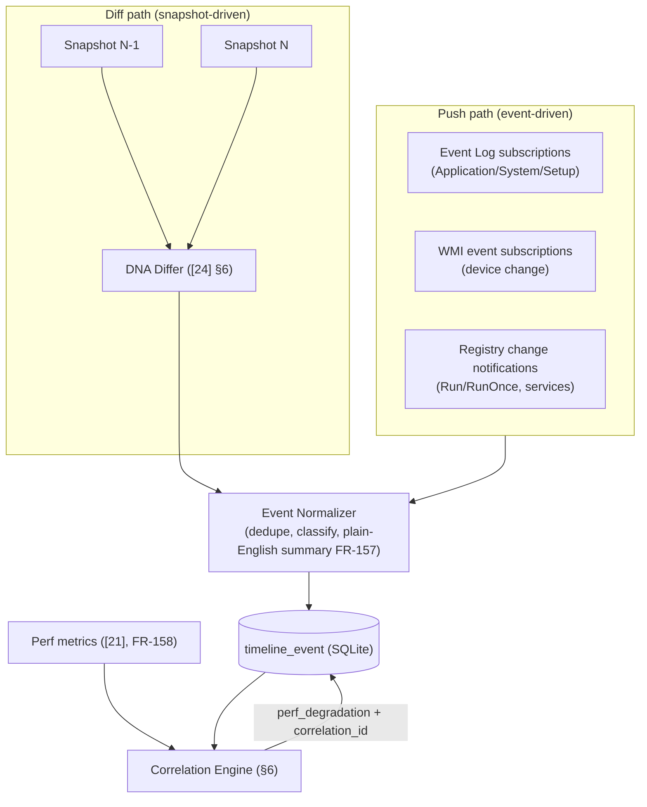
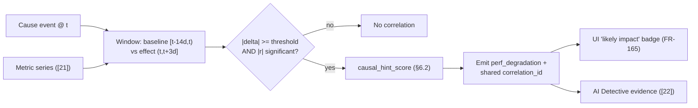
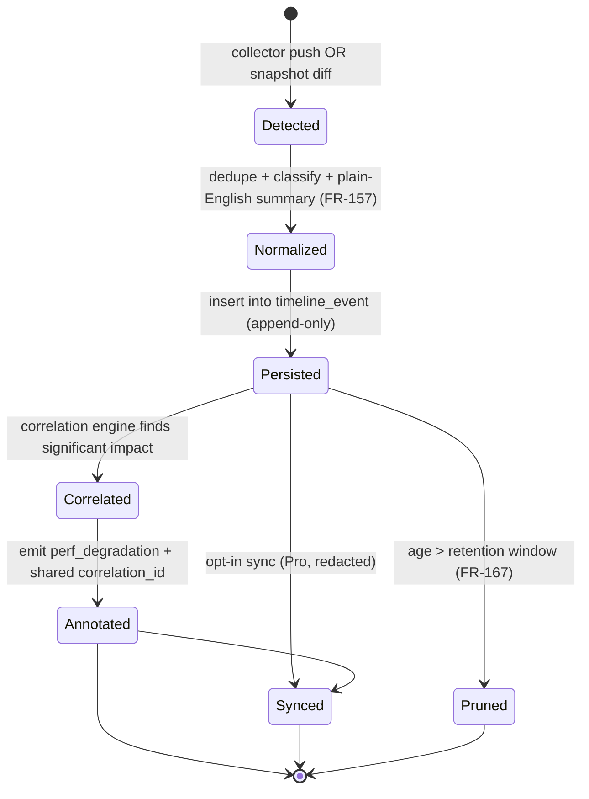

# 23. Performance Timeline Design

> The design of the Performance Timeline — DeviceLifeline's primary differentiator: the TimelineEvent model and types, the Rust collectors and change-detection-via-snapshot-diffing that produce events, the correlation engine that links cause to effect with a causal-hint score, baseline/regression detection, the SQLite storage schema and indexes for high-volume events, query patterns, and the UI data shape. Includes the worked Docker example. Part of the DeviceLifeline documentation suite — see [Documentation Index](README.md).

**Status:** Draft v1 · **Authoring role:** Principal Software Architect + AI Systems Designer · **Last updated:** 2026-06-07
**Related:** [24. Device DNA Design](24-device-dna-design.md), [21. Device Telemetry Strategy](21-device-telemetry-strategy.md), [22. AI Diagnostics Design](22-ai-diagnostics-design.md), [32. Database Design](32-database-design.md), [33. Entity Relationship Design](33-entity-relationship-design.md), [25. Restore Engine Design](25-restore-engine-design.md), [06. Functional Requirements](06-functional-requirements.md)

---

## 1. Purpose & Scope

The **Performance Timeline** is product pillar #3 and the platform's **primary differentiator**: where ordinary utilities show a computer's *current* state, DeviceLifeline shows *what changed, when it changed, why it changed, and what impact it caused.* This document specifies how that living history is built: the `TimelineEvent` model, the Rust collectors and the snapshot-diff change-detection that produce events, the **correlation engine** that links a change (e.g., a software install) to a performance effect (e.g., a boot-time regression) with a quantified **causal-hint score**, baseline and regression detection, the SQLite storage design for what is inherently a high-volume append stream, the query patterns the UI relies on, and the UI data shape.

The Timeline is the backbone the rest of the product reasons over: its events and causal hints are the strongest evidence the **AI Detective** consumes ([22](22-ai-diagnostics-design.md) §5), and its history is what the **Recovery Center** rolls back to. This document defines the engine; [22](22-ai-diagnostics-design.md) defines how the AI interprets its outputs and [24](24-device-dna-design.md) defines the snapshots that feed change detection.

**In scope (MVP):** the `TimelineEvent` entity and its nine types; event sources and Rust collectors; change detection by diffing consecutive `DeviceDNASnapshot`s; performance-metric collection for impact measurement; the correlation engine (windowing, baseline, regression detection, causal-hint scoring per FR-159); the SQLite schema sketch + indexes + retention interplay; query patterns and the UI data shape (FR-160–FR-166); and the worked Docker example.
**Out of scope:** Snapshot capture mechanics and the four DNA domains (see [24. Device DNA Design](24-device-dna-design.md)); the *collection cadence/budgets* of the underlying signals (see [21. Device Telemetry Strategy](21-device-telemetry-strategy.md)); LLM interpretation/answering (see [22](22-ai-diagnostics-design.md)); physical partitioning of the cloud mirror (see [32. Database Design](32-database-design.md) §6); and Crash Intelligence correlation (Post-MVP, FR-278, reuses this engine).

---

## 2. Assumptions

- A1: SQLite is the local source of truth; the Timeline is fully functional offline. Cloud sync of `timeline_event` is opt-in (Pro, FR-168) and additive.
- A2: Plain-English event descriptions are generated by a **deterministic rule engine in Rust, not an LLM** (FR-157) — the Timeline must be trustworthy and offline-capable; the LLM only *narrates over* it in the AI Detective.
- A3: Event sources are Windows Event Log (Application/System/Setup channels), WMI event subscriptions, registry change notifications, and **snapshot diffing** for changes without a reliable OS push (FR-156).
- A4: Performance metrics for impact measurement (boot time, CPU/RAM/disk) are collected per [21](21-device-telemetry-strategy.md) (FR-158); raw `health_sample` stays local, and the correlation engine reads aggregated trends.
- A5: Correlation is a **causal *hint*, not proof.** The engine quantifies association strength and labels confidence (FR-159); it never asserts certainty. Multi-cause causality is an MVP simplification via `correlation_id` ([33](33-entity-relationship-design.md)); a richer `Correlation` entity is post-MVP.
- A6: The nine canonical `event_type` values are fixed: `software_install`, `software_removal`, `driver_update`, `os_update`, `startup_change`, `service_change`, `hardware_change`, `perf_degradation`, `config_change`.
- A7: Timeline volume is moderate per device (tens–hundreds of events/day) but unbounded over time; storage and query design must assume years of history with daily pruning bounded by retention ([20](20-data-retention-policies.md), FR-167).

---

## 3. The TimelineEvent Model

A `TimelineEvent` is an immutable, append-only record that something changed (or a derived observation that performance shifted). Events are never edited; corrections are new events. (Schema in [32](32-database-design.md) §4.3; logical shape in [33](33-entity-relationship-design.md).)

### 3.1 Event types & sources

| `event_type` | Meaning | Primary source | Detection |
|---|---|---|---|
| `software_install` | An application was installed | Registry/WMI/AppX + snapshot diff (FR-061) | OS event + diff |
| `software_removal` | An application was uninstalled | same | diff |
| `driver_update` | A device driver changed version | Event Log (System) + SetupAPI | OS event |
| `os_update` | Windows Update applied (KB) | Event Log (Setup) + WUA | OS event |
| `startup_change` | Startup item added/removed/toggled | Registry Run keys + Task Scheduler + Startup folder (FR-064) | change notify + diff |
| `service_change` | Service start-type/state changed | Service Control Manager enumeration (FR-063) | diff |
| `hardware_change` | Device attached/detached/changed | WMI `Win32_DeviceChangeEvent` | OS event |
| `config_change` | Power plan / network config changed | `powercfg`, WMI/netsh (FR-065) | OS event + diff |
| `perf_degradation` | **Derived**: a metric regressed materially | correlation engine (this doc §6) | computed |

> `perf_degradation` is special: it is **synthesized by the correlation engine**, not collected. It represents "boot time rose 37%" as a first-class timeline citizen so the UI can plot it and the AI can cite it.

### 3.2 Event fields (per FR-157)

```jsonc
{
  "event_id": "te_01HZ...",            // UUID
  "device_id": "f3c1...",
  "occurred_at": "2026-05-29T14:02:11Z", // UTC
  "event_type": "software_install",
  "source": "system",                   // system | user | derived
  "summary": "Installed Docker Desktop 4.31.0",  // deterministic plain English (FR-157)
  "payload": {                          // raw metadata JSON (typed per event_type)
    "name": "Docker Desktop", "version": "4.31.0",
    "publisher": "Docker Inc.", "install_source": "winget:Docker.DockerDesktop"
  },
  "related_software_item_id": "swi_77", // FK when applicable
  "correlation_id": "corr_91af",        // links cause<->effect (nullable)
  "severity": "notice"                  // info | notice | warning
}
```

- **TL-001:** Events are immutable and append-only; the table is insert-only (no LWW conflicts on sync, [32](32-database-design.md) §7).
- **TL-002:** `summary` MUST be generated deterministically in Rust (FR-157) — same inputs always produce the same human-readable string — so the Timeline reads identically offline and online.
- **TL-003:** Incidental PII in `payload` (paths/usernames) is stored locally as-is but redacted before sync or AI egress (PRIV-030).

---

## 4. Event Production: Collectors + Change Detection

Events arrive two ways: **pushed** by the OS (fast, precise timestamp) and **derived** by diffing snapshots (reliable, catches everything the OS didn't surface). The two are reconciled so each real change yields exactly one event.



### 4.1 Collectors (Rust Core)

| Collector | Produces | Mechanism |
|---|---|---|
| Software watcher | install/removal/version change | Registry Uninstall + WMI + AppX; reconciled by diff |
| Driver watcher | `driver_update` | Event Log System channel + SetupAPI device log |
| Update watcher | `os_update` | Event Log Setup channel + Windows Update Agent |
| Startup watcher | `startup_change` | Registry change notify (Run keys) + Task Scheduler + Startup folder watcher |
| Service watcher | `service_change` | SCM enumeration diffed across snapshots |
| Hardware watcher | `hardware_change` | WMI `Win32_DeviceChangeEvent` |
| Config watcher | `config_change` | power/network notifications + diff |

Collectors prefer push; whatever push misses, the daily snapshot diff catches (defense in depth — a change is never silently lost).

### 4.2 Change detection via snapshot diffing

The DNA differ ([24](24-device-dna-design.md) §6) compares snapshot N against N−1 per domain and emits a typed change set. The Event Normalizer turns each change into a `TimelineEvent`:

```jsonc
// Differ output (illustrative) → normalized into TimelineEvents
{
  "from_snapshot": "dna_120", "to_snapshot": "dna_121",
  "software": { "added": [ { "name": "Docker Desktop", "version": "4.31.0" } ],
                "removed": [], "changed": [] },
  "startup":  { "added": [ { "name": "Docker Desktop", "location": "HKCU\\...\\Run" } ] },
  "services": { "added": [ { "name": "com.docker.service", "start_type": "automatic" } ] },
  "config":   { "changed": [] }
}
```

### 4.3 Deduplication & reconciliation

- **TL-010:** When both push and diff observe the same change, the Normalizer **deduplicates** by `(event_type, subject identity, time window)` and keeps the push event's precise timestamp, marking the diff as confirmation — never two events for one change.
- **TL-011:** Each `software_install`/`software_removal` links to its `related_software_item_id` so restore and AI can join event ↔ inventory.

---

## 5. Performance Metrics for Impact Measurement

To say a change *caused* an effect, the engine needs a measurable effect. Metrics are collected per [21](21-device-telemetry-strategy.md) (FR-158): **boot time** (s, from Event Log 6013 + startup correlation), CPU/RAM 5-min averages, disk throughput. These feed the correlation engine as time series; the engine compares pre-change vs. post-change windows.

| Metric | Use in correlation | Notes |
|---|---|---|
| Boot time | Primary impact signal for startup/service changes | most user-visible; high signal-to-noise |
| CPU avg | Background-load regressions | noisier; needs longer windows |
| RAM avg | Memory-pressure regressions | |
| Disk throughput / busy% | I/O regressions, indexing storms | |
| Health subsystem score ([22](22-ai-diagnostics-design.md) §10) | Corroborating context | deterministic, already computed |

---

## 6. The Correlation Engine

The correlation engine is the heart of the differentiator. It answers: *for each change event, did a performance metric regress in a way that this change plausibly explains, and how strong is that hint?*

### 6.1 Windowing & baseline

For a candidate **cause event** at time `t`:

1. **Baseline window:** aggregate the target metric over `[t − B, t)` (default B = 14 days, or all available if newer) → `baseline = robust mean` (median to resist outliers).
2. **Effect window:** aggregate over `(t, t + E]` (default E = 3 days; boot time uses next N boots) → `effect`.
3. **Delta:** `delta_pct = (effect − baseline) / baseline`.
4. **Significance:** require both a **magnitude** threshold (`|delta_pct| ≥ 15%` default for boot time) and a **statistical** threshold. Per FR-159, association strength uses Pearson correlation of the change indicator vs. the metric over the window, with bands High `|r| ≥ 0.6`, Medium `0.4–0.6`, Low otherwise.

### 6.2 Causal-hint scoring

A regression that is merely contemporaneous is weak evidence; the engine boosts hints that have a **plausible mechanism**. The `causal_hint_score` (0.0–1.0) blends statistical association with mechanism plausibility and isolation:

```
causal_hint_score =
    0.40 * magnitude_factor        # normalized |delta_pct| past threshold
  + 0.30 * association_strength    # Pearson |r| (FR-159), normalized
  + 0.20 * mechanism_prior         # does this change type plausibly affect this metric?
  + 0.10 * isolation_factor        # were there FEW other concurrent changes? (fewer => higher)

clamp to [0,1]; then:
  - if many concurrent candidate causes in the effect window -> spread/penalize (ambiguous)
  - if mechanism_prior == 0 (implausible pairing) -> cap at 0.3 ("May be related")
```

**Mechanism priors** (illustrative, table-driven and tunable server-side):

| Cause `event_type` | Boot time | CPU | RAM | Disk |
|---|---|---|---|---|
| `startup_change` (added) | **high** | med | med | low |
| `service_change` (→ automatic) | **high** | med | med | low |
| `software_install` (with startup/service) | high | med | med | med |
| `driver_update` | med | med | low | med |
| `os_update` | med | med | low | med |
| `hardware_change` | low | low | low | med |

### 6.3 Emitting correlations

When a hint clears the threshold, the engine:

1. Synthesizes a `perf_degradation` event at the effect time (`summary`: "Boot time +37%").
2. Assigns a shared `correlation_id` to **both** the cause event and the `perf_degradation` event ([33](33-entity-relationship-design.md): `TimelineEvent` N:N via `correlation_id`).
3. Records the `causal_hint_score` and confidence band in the `perf_degradation` payload.
4. Surfaces a "likely impact" badge on the cause event in the UI (FR-165) — e.g., "Boot time +37%".

These causal hints are exactly what the AI Detective ranks highest ([22](22-ai-diagnostics-design.md) §5.2) and what feeds its reconciled confidence (§7.4 of [22](22-ai-diagnostics-design.md)).

### 6.4 Baseline & regression detection (ongoing)

Beyond per-event correlation, the engine maintains rolling baselines per metric and flags **regressions** even without an obvious single cause:

- **TL-020:** A regression detector compares the current rolling window to the established baseline; a sustained material regression with no single dominant cause still emits a `perf_degradation` event flagged "cause unclear," prompting the user toward the AI Detective.
- **TL-021:** Baselines are **adaptive**: after a confirmed legitimate change (e.g., the user *wanted* Docker autostart), the baseline re-anchors so the same steady state isn't re-flagged forever.



---

## 7. Worked Example — Docker Install → +35% Boot Time

The canonical scenario from the product vision, traced end to end:

| Step | What happens |
|---|---|
| 1 | **May 29:** User installs Docker Desktop. Software watcher (push) + next daily snapshot diff both observe it; deduped to one `software_install` event (`summary`: "Installed Docker Desktop 4.31.0"). |
| 2 | The same install adds a startup entry and an automatic service → `startup_change` ("Startup item added: Docker Desktop") and `service_change` ("Service com.docker.service set to automatic"). |
| 3 | **May 30+:** Boot-time metric (Event Log 6013) rises from a 14-day baseline of ~24 s to ~33 s across the next boots. |
| 4 | Correlation engine: baseline 24 s, effect 33 s → `delta_pct = +37%` (≥15% magnitude); Pearson \|r\| over the window ≥ 0.6 (High). Mechanism prior for `startup_change`→boot is **high**; isolation factor moderate (Docker was the dominant change that day). |
| 5 | `causal_hint_score ≈ 0.82`. Engine emits a `perf_degradation` event ("Boot time +37%") and assigns shared `correlation_id = corr_91af` to the Docker `software_install`/`startup_change`/`service_change` and the `perf_degradation`. |
| 6 | **UI:** the Docker install marker shows a red "Boot time +37%" badge (FR-165); clicking opens the detail panel with the correlation annotation and a "Ask AI Detective" link pre-seeded (FR-163). |
| 7 | **AI Detective** (if asked "why is boot slow?"): retriever ranks `corr_91af` top; LLM returns "Docker Desktop's startup service most likely slowed boot," `confidenceScore ≈ 0.82` (corroborated by the deterministic causal hint, [22](22-ai-diagnostics-design.md) §7.4). Recommended action: set Docker to start manually; optionally a `RestorePlan` to disable the startup item ([25](25-restore-engine-design.md)). |

This is the product's core promise made concrete: *what changed (Docker), when (May 29), why boot got slow (its autostart service), and how to recover (disable autostart).*

---

## 8. Storage Schema & Indexes (high-volume)

Full DDL in [32. Database Design](32-database-design.md) §4.3; this section explains the **Timeline-specific** storage and indexing rationale.

```sql
-- (mirrors 32 §4.3) the high-volume append table
CREATE TABLE timeline_event (
  id            TEXT PRIMARY KEY,
  device_id     TEXT NOT NULL,
  occurred_at   TEXT NOT NULL,            -- UTC ISO-8601
  event_type    TEXT NOT NULL,            -- 9-value enum (§3.1)
  source        TEXT NOT NULL DEFAULT 'system',
  summary       TEXT NOT NULL,            -- deterministic plain English
  payload       TEXT,                     -- JSON
  related_software_item_id TEXT,
  correlation_id TEXT,                     -- links cause<->effect
  severity      TEXT NOT NULL DEFAULT 'info',
  updated_at    TEXT NOT NULL,
  deleted_at    TEXT,
  sync_state    TEXT NOT NULL DEFAULT 'pending'
);
-- the workhorse index: device + time range scans (timeline render)
CREATE INDEX ix_tl_device_time ON timeline_event(device_id, occurred_at DESC);
-- category-filtered views (FR-164)
CREATE INDEX ix_tl_type ON timeline_event(device_id, event_type, occurred_at DESC);
-- pull both halves of a correlation cheaply
CREATE INDEX ix_tl_corr ON timeline_event(correlation_id);
```

### 8.1 Indexing & query rationale

- **`ix_tl_device_time`** serves the dominant query — "render the timeline for this device over [range]" — as an index range scan ordered by time, enabling the ≤ 2 s 90-day render target (FR-162).
- **`ix_tl_type`** serves category filters (FR-164) without a full scan.
- **`ix_tl_corr`** makes "fetch the cause(s) and effect(s) sharing this correlation" O(matches), powering the detail panel and AI evidence join.
- **Display aggregation:** the UI pre-aggregates events to **hourly buckets** for the chart overview (FR-162), drilling into raw events only on zoom/click — so a multi-year timeline renders from a small bucketed query, not millions of rows.
- **Retention interplay:** daily pruning by `occurred_at` past the window (≥365 days default, FR-167) keeps the table bounded; crucially, **`TimelineEvent` rows survive snapshot diff-collapse** (RET-001, [20](20-data-retention-policies.md)) — the Timeline is the durable history even after source snapshots are collapsed.

### 8.2 Cloud mirror (opt-in)

When synced (Pro, FR-168), events upsert to the partitioned `timeline_event` cloud table (monthly `PARTITION BY RANGE (occurred_at)`, [32](32-database-design.md) §6.1), redacted at outbox-build time (PRIV-030). Append-only → no sync conflicts (TL-001).

---

## 9. Query Patterns & UI Data Shape

The React UI (recharts or equivalent, FR-160) reads via the Tauri bridge. Key query patterns the Rust Core exposes:

| Pattern | Query shape | Backed by |
|---|---|---|
| Render window | events + bucketed metrics for `(device_id, [from,to])` | `ix_tl_device_time` + hourly buckets |
| Category filter | add `event_type IN (...)` | `ix_tl_type` |
| Event detail | one event + its correlation partners | PK + `ix_tl_corr` |
| Impact badges | events whose `correlation_id` has a `perf_degradation` partner | `ix_tl_corr` |
| Free preview | last 7 days, read-only (FR-166) | `ix_tl_device_time` |

### 9.1 UI data shape (illustrative)

```typescript
interface TimelineView {
  range: { from: string; to: string };          // FR-161 (7/30/90/180/custom)
  metricSeries: {                                // overlaid line series (FR-160)
    bootTimeSec: Array<{ t: string; v: number }>;
    cpuPct?: Array<{ t: string; v: number }>;
  };
  events: Array<{
    eventId: string;
    occurredAt: string;
    type: TimelineEventType;                     // 9-value enum
    summary: string;
    severity: "info" | "notice" | "warning";
    impactBadge?: { label: string; deltaPct: number;
                    confidence: "high" | "medium" | "low" };  // FR-165
    correlationId?: string;
  }>;
}

interface TimelineEventDetail {                  // slide-in panel (FR-163)
  event: TimelineView["events"][number];
  correlation?: {
    correlationId: string;
    causeSummary: string;
    effectSummary: string;       // e.g., "Boot time +37%"
    causalHintScore: number;     // 0-1
    confidenceLabel: "Likely cause" | "Possible cause" | "May be related";
  };
  aiSeedQuery: string;           // pre-seeds AI Detective (FR-163 / FR-213)
}
```

- **Tiering:** Free tier sees a 7-day blurred preview with an upgrade prompt (FR-166); full timeline is Pro (FR-161).
- **Cross-feature:** event markers deep-link into the AI Detective with a pre-seeded query (FR-163/FR-213), and crash markers (Post-MVP) overlay on the same axis (FR-280).

---

## Diagrams

(Primary diagrams inline: production pipeline §4, correlation flow §6.4.) Timeline event lifecycle:



---

## Risks & Mitigations

| Risk | Likelihood | Impact | Mitigation |
|---|---|---|---|
| Correlation asserts a false cause | Medium | High | Causal *hint* framing (A5); magnitude + statistical thresholds (FR-159); isolation penalty + mechanism priors (§6.2); confidence bands; never "certain" |
| Concurrent changes make causality ambiguous | High | Medium | Isolation factor lowers score; spread across candidates; surface "cause unclear" (TL-020) |
| Push + diff double-count a change | Medium | Medium | Dedup by subject+window, keep push timestamp (TL-010) |
| OS push misses a change | Medium | Medium | Snapshot diff backstop catches it (§4) |
| Timeline render slow on long histories | Medium | High | `ix_tl_device_time`; hourly display buckets; ≤2s 90-day target (FR-162) |
| Table grows unbounded | Medium | Medium | Daily prune by retention (FR-167); events survive diff-collapse but are themselves bounded (RET-001) |
| Noisy metrics (CPU) yield spurious regressions | Medium | Medium | Robust (median) baselines; longer windows for noisy metrics; magnitude gate |
| Baseline never re-anchors after a wanted change | Low | Medium | Adaptive baseline re-anchoring (TL-021) |
| PII in event payload leaks on sync | Medium | High | Redaction at outbox build (PRIV-030); append-only redacted projection |

---

## Future Considerations

- **Dedicated `Correlation` entity** replacing `correlation_id` for multi-cause/multi-effect graphs with weighted edges ([33](33-entity-relationship-design.md) Future Considerations).
- **ETW deep tracing** to attribute regressions to specific processes/services more precisely ([21](21-device-telemetry-strategy.md) Future Considerations).
- **Fleet baselines** (Business Edition): compare a device's regression against a cohort of similar devices to separate "this machine" from "this update broke everyone."
- **Crash correlation** once Crash Intelligence ships (FR-278) — same engine, crash clusters as effects.
- **Predictive regressions:** flag changes *likely* to regress based on aggregate history before the user feels it.
- **User feedback loop:** "was this correlation right?" ratings tune mechanism priors and thresholds.

---

## Acceptance Criteria

- [ ] AC-TL-001: The `TimelineEvent` model with all nine `event_type` values and required fields (FR-157) is specified, immutable/append-only (§3, TL-001).
- [ ] AC-TL-002: Events are produced by both OS push and snapshot diff, deduplicated to one event per real change (§4, TL-010).
- [ ] AC-TL-003: Plain-English summaries are deterministic (Rust, no LLM) (TL-002, FR-157).
- [ ] AC-TL-004: The correlation engine windows baseline vs. effect, applies magnitude + statistical (Pearson, FR-159) thresholds, and emits a `causal_hint_score` (§6.1–6.2).
- [ ] AC-TL-005: Correlations link cause and effect via a shared `correlation_id` and synthesize a `perf_degradation` event (§6.3, [33](33-entity-relationship-design.md)).
- [ ] AC-TL-006: Baseline/regression detection handles "cause unclear" regressions and adaptive re-anchoring (TL-020/021).
- [ ] AC-TL-007: The worked Docker example traces install → +37% boot → correlation → UI badge → AI evidence end to end (§7).
- [ ] AC-TL-008: The SQLite schema sketch includes device-time, type, and correlation indexes supporting the ≤2s 90-day render target (§8, FR-162).
- [ ] AC-TL-009: TimelineEvents survive snapshot diff-collapse so the history is durable (§8.1, RET-001).
- [ ] AC-TL-010: Query patterns and the UI data shape (filters, detail panel, impact badge, AI seed, Free preview) are specified (§9, FR-160–166).
- [ ] AC-TL-011: The document cross-links to [24](24-device-dna-design.md), [21](21-device-telemetry-strategy.md), [22](22-ai-diagnostics-design.md), [32](32-database-design.md), [33](33-entity-relationship-design.md), and [25](25-restore-engine-design.md).
