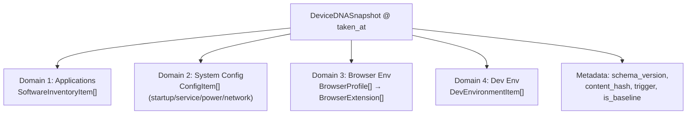
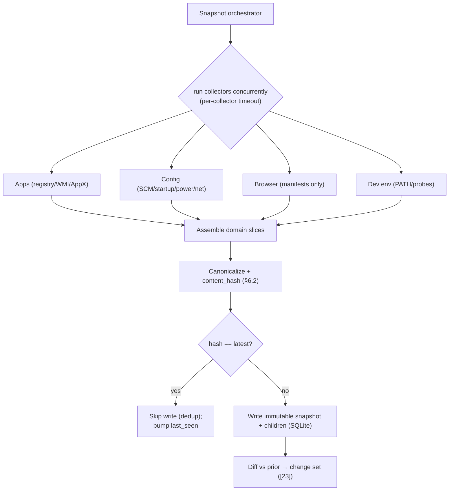
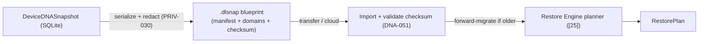
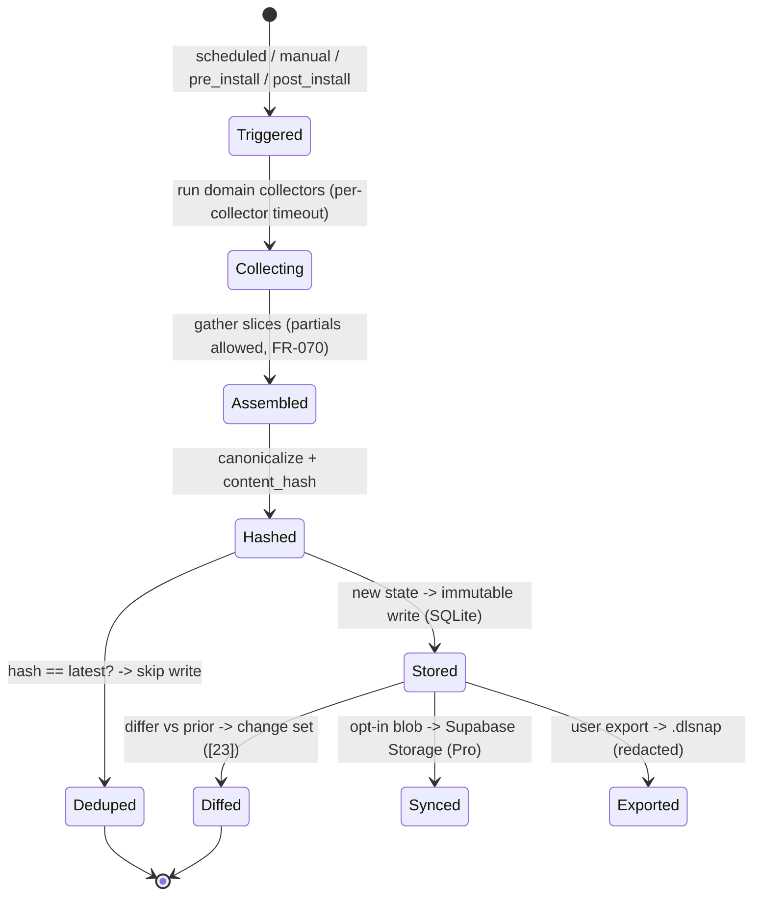

# 24. Device DNA Design

> The design of the Device DNA Engine: the four capture domains (applications/software, system configuration, browser environment, developer environment), the DeviceDNASnapshot structure, the per-domain Rust collectors (Windows registry, WMI, Event Log, WinGet, performance counters), snapshot diffing and fingerprinting, scheduling, storage, and the exportable DNA blueprint format (the `.dlsnap` JSON schema) consumed by the Restore Engine. Part of the DeviceLifeline documentation suite — see [Documentation Index](README.md).

**Status:** Draft v1 · **Authoring role:** Principal Software Architect + Staff Backend Engineer · **Last updated:** 2026-06-07
**Related:** [25. Restore Engine Design](25-restore-engine-design.md), [23. Performance Timeline Design](23-performance-timeline-design.md), [21. Device Telemetry Strategy](21-device-telemetry-strategy.md), [22. AI Diagnostics Design](22-ai-diagnostics-design.md), [27. Windows Architecture Plan](27-windows-architecture-plan.md), [32. Database Design](32-database-design.md), [33. Entity Relationship Design](33-entity-relationship-design.md), [19. Privacy Requirements](19-privacy-requirements.md)

---

## 1. Purpose & Scope

The **Device DNA Engine** is product pillar #1 and the foundation the entire platform stands on. It captures a complete, point-in-time blueprint of a machine — **what is installed, how it is configured, what the browser environment looks like, and what the developer environment contains** — and stores it as an immutable **DeviceDNASnapshot**. Snapshots are the raw material for everything else: diffing consecutive snapshots feeds the **Performance Timeline** ([23](23-performance-timeline-design.md)), snapshot summaries feed the **AI Detective** ([22](22-ai-diagnostics-design.md)), and a snapshot (or a filtered export of one) is what the **Restore Engine** ([25](25-restore-engine-design.md)) replays to recreate a setup on a new machine.

This document specifies the four capture domains, the snapshot data structure, the per-domain Rust collectors and the exact Windows mechanisms they use, snapshot **diffing** (the change-detection that produces timeline events) and **fingerprinting** (content-hash identity + dedup), capture scheduling, on-device storage, and the **exportable DNA blueprint** — the portable `.dlsnap` format (FR-069) and its JSON schema, which is the contract between the DNA Engine (producer) and the Restore Engine (consumer).

**In scope (MVP):** the four domains; the `DeviceDNASnapshot` + child-entity structure; Windows collectors (registry, WMI, Event Log, WinGet/AppX, performance counters, SCM, SMART); per-collector timeouts and partial-result handling (FR-070); diffing algorithm and change-set output; fingerprinting/dedup; scheduling and triggers (FR-071); storage in SQLite + optional Storage blob (FR-068/FR-076); and the `.dlsnap` blueprint JSON schema (FR-069).
**Out of scope:** How diffs become correlated timeline events (see [23. Performance Timeline Design](23-performance-timeline-design.md)); how the blueprint is *replayed* to install/configure (see [25. Restore Engine Design](25-restore-engine-design.md)); collection cadence governance/budgets (see [21. Device Telemetry Strategy](21-device-telemetry-strategy.md)); the privacy classification of captured data (see [19. Privacy Requirements](19-privacy-requirements.md) §4); and physical DB layout/sync (see [32. Database Design](32-database-design.md)).

---

## 2. Assumptions

- A1: SQLite is the local source of truth; snapshots are written locally first and (opt-in, Pro) the full blob may sync to Supabase Storage (FR-076); the summary metadata syncs to Postgres ([32](32-database-design.md) §5.2).
- A2: Collectors run in the Rust Core with least privilege (SEC-001/003); operations needing elevation use the short-lived privileged helper (SEC-002, [27](27-windows-architecture-plan.md)). All OS output is untrusted input, validated/sanitized before storage (SEC-070, SEC-071).
- A3: A full snapshot MUST complete in ≤ 30 s P99 on the reference device (FR-070), enforced by **per-collector timeouts**; a collector that times out yields a logged partial result rather than failing the whole snapshot.
- A4: Snapshots are **immutable** and identified by a UUID + content hash; identical consecutive snapshots are deduplicated by hash ([32](32-database-design.md) §4.2).
- A5: Snapshots contain **no secrets/credentials** — collectors never read password stores, tokens, cookies, or file contents (A8 of [25](25-restore-engine-design.md), PRIV-010); incidental PII (paths/usernames) is captured locally but redacted before any egress (PRIV-030).
- A6: Windows is first-class; collectors are Windows-specific but emit into an **OS-neutral snapshot schema** so macOS/Linux ([28](28-macos-architecture-plan.md), [29](29-linux-architecture-plan.md)) can populate the same structure later with no schema change.
- A7: The blueprint (`.dlsnap`) is **versioned** (`schema_version`); older blueprints are forward-migrated before the Restore Engine plans against them (A2 of [25](25-restore-engine-design.md)).

---

## 3. The Four Capture Domains

The Device DNA Engine captures exactly four domains (product pillar #1). Each maps to canonical entities ([33](33-entity-relationship-design.md)) and a privacy posture ([19](19-privacy-requirements.md) §4).

| Domain | Canonical entities | What is captured | Privacy posture ([19](19-privacy-requirements.md)) |
|---|---|---|---|
| **1. Applications / Software** | `SoftwareInventoryItem` | Installed apps: name, version, publisher, install date, install location, install source (WinGet id / MS Store id / vendor / unknown) (FR-062) | C1 (paths/publisher may be C2); opt-in sync (Pro) |
| **2. System Configuration** | `ConfigItem` (startup, service, power, network) | Startup items, Windows services + start types, power plan, network adapters/DNS (FR-063–065) | C1; opt-in sync |
| **3. Browser Environment** | `BrowserProfile`, `BrowserExtension` | Installed browsers, profiles, and per-profile extensions (id, name, version, enabled) (FR-066) | **Heightened C1**; sync OFF by default (PRIV-004) |
| **4. Developer Environment** | `DevEnvironmentItem` | Languages/runtimes, SDKs, package managers, IDEs + extensions, version managers, WSL distros (FR-067) | Heightened C1; opt-in (Developer tier) |

> A `DeviceDNASnapshot` is the **union** of one capture across all four domains at a moment in time — a complete blueprint, not a partial scan.



---

## 4. DeviceDNASnapshot Structure

(Physical SQLite schema in [32](32-database-design.md) §4.2; logical model in [33](33-entity-relationship-design.md).)

A snapshot is a parent row plus child rows per domain:

```jsonc
// Logical snapshot (in-memory / pre-serialization shape)
{
  "snapshot_id": "dna_01HZ...",          // UUID
  "device_id": "f3c1...",                // random UUID (PRIV-020)
  "taken_at": "2026-06-07T03:00:00Z",    // UTC
  "trigger": "scheduled",                // scheduled | manual | pre_install | post_install
  "schema_version": 3,
  "content_hash": "sha256:9af2...",      // fingerprint over canonicalized domains (§6.2)
  "is_baseline": false,
  "label": "Before GPU upgrade",         // optional user label (FR-075), max 100 chars
  "domains": {
    "software": [ { "id":"swi_77","name":"Docker Desktop","version":"4.31.0",
                    "publisher":"Docker Inc.","install_date":"2026-05-29",
                    "install_location":"C:\\Program Files\\Docker",
                    "source":"winget","package_id":"Docker.DockerDesktop" } ],
    "config": [ { "id":"cfg_1","category":"startup","key":"Docker Desktop",
                  "value":"...","enabled":true },
                { "id":"cfg_2","category":"service","key":"com.docker.service",
                  "value":"automatic","enabled":true },
                { "id":"cfg_3","category":"power","key":"active_plan",
                  "value":"Balanced (GUID)" } ],
    "browser": [ { "id":"bp_1","browser":"edge","profile_name":"Default",
                   "extensions":[ {"id":"be_1","ext_store_id":"ghbm...","name":"Google Translate",
                                   "version":"2.0","enabled":true } ] } ],
    "dev_env": [ { "id":"dev_1","kind":"language","name":"Node.js","version":"20.11.1",
                   "path":"C:\\Program Files\\nodejs" },
                 { "id":"dev_2","kind":"ide","name":"VS Code","version":"1.90",
                   "extensions":["rust-lang.rust-analyzer","esbenp.prettier-vscode"] } ]
  }
}
```

- **DNA-001:** A snapshot is immutable once written (A4); the latest snapshot is never pruned (it is the diff baseline — RET-001, [20](20-data-retention-policies.md)).
- **DNA-002:** Every snapshot carries `schema_version`; consumers (differ, Restore Engine) forward-migrate older snapshots before use (A7).

---

## 5. Per-Domain Collectors (Rust Core)

Collectors run concurrently under the Telemetry Scheduler ([21](21-device-telemetry-strategy.md) §9) with **per-collector timeouts** so the 30 s P99 budget (FR-070) holds even if one source is slow. Each collector emits its domain slice; a partial/failed collector logs a skip and the snapshot proceeds with the rest (A3).

| Domain | Collector | Windows mechanism | Notes |
|---|---|---|---|
| Applications | App enumerator | Registry `HKLM/HKCU ...\Uninstall`; WMI `Win32_Product` (async, non-blocking); AppX/MSIX (`Get-AppxPackage` equivalent) (FR-061) | WMI async to avoid Event Log spam; WinGet id mapped via local manifest cache (FR-062) |
| Applications | Source resolver | `winget` manifest cache; MS Store product ids | Tags each app's install `source` for restore |
| System Config | Service collector | Service Control Manager API (FR-063) | name, display, start type, state, binary path |
| System Config | Startup collector | Registry Run/RunOnce (HKLM+HKCU); Task Scheduler (enabled triggers); Startup folders (FR-064) | feeds startup-impact correlation ([23](23-performance-timeline-design.md)) |
| System Config | Power/network collector | `powercfg` equivalent; WMI / netsh (FR-065) | power plan GUID; adapter + DNS config |
| Browser Env | Browser collector | Read extension manifest directories for Chrome/Edge/Firefox/Brave/Opera (FR-066) | **no browser process access**; manifests only; heightened privacy (PRIV-004) |
| Dev Env | Dev-toolchain collector | PATH + registry + well-known install dirs; CLI version probes (FR-067) | Node/npm, Python/pip, Rust/cargo, Java/JAVA_HOME, VS Code + extensions, Docker, Git config, WSL distros, Scoop/Choco/Brew |
| (Shared) | Perf-counter / SMART | Performance counters; SMART via `DeviceIoControl` `IOCTL_STORAGE_QUERY_PROPERTY` (FR-238) | feeds Health context, not the four DNA domains directly, but captured alongside |
| (Shared) | Event Log reader | Event Log (Application/System/Setup) | corroborates install/update timing for the differ + Timeline |

### 5.1 Collector contract & resilience

- **DNA-010:** Each collector declares a **timeout** and a **required-elevation** flag; the engine runs non-elevated collectors directly and batches any elevated work into one short-lived helper invocation (SEC-002) to minimize UAC prompts.
- **DNA-011:** A collector MUST return either a domain slice or a structured skip (`{ skipped: true, reason }`); it MUST NOT panic the agent (SEC-071). Parsers for registry/WMI/Event Log output are fuzz-tested (SEC-091).
- **DNA-012:** All collected strings are sanitized/validated before storage (SEC-070); binary/oversized values are bounded or dropped.



---

## 6. Snapshot Diffing & Fingerprinting

### 6.1 Diffing (change detection)

The **DNA Differ** compares snapshot N against N−1 per domain and emits a typed change set — the raw material the Performance Timeline normalizes into `TimelineEvent`s ([23](23-performance-timeline-design.md) §4.2).

- **Matching keys** per domain (stable identity for added/removed/changed classification):
  - Software: `(name, publisher)` (version compared for `changed`).
  - Config: `(category, key)` (value/enabled compared).
  - Browser: `(browser, profile_name, ext_store_id)`.
  - Dev env: `(kind, name)` (version/path compared).
- **Output** per domain: `added[]`, `removed[]`, `changed[] {from, to}`.

```jsonc
// Differ output (consumed by the Timeline normalizer, [23] §4.2)
{
  "from_snapshot": "dna_120", "to_snapshot": "dna_121",
  "software": { "added": [{ "name":"Docker Desktop","version":"4.31.0" }], "removed": [], "changed": [] },
  "config":   { "added": [{ "category":"service","key":"com.docker.service","value":"automatic" },
                          { "category":"startup","key":"Docker Desktop" }],
                "removed": [], "changed": [] },
  "browser":  { "added": [], "removed": [], "changed": [] },
  "dev_env":  { "added": [], "removed": [], "changed": [] }
}
```

- **DNA-020:** Diffing is **deterministic** and order-independent (domains are sorted by matching key before compare) so the same pair of snapshots always yields the same change set.
- **DNA-021:** The differ also powers the UI snapshot diff view (FR-074, post-MVP) and the Restore Engine's "diff vs. current device" planning step ([25](25-restore-engine-design.md) §4.1).

### 6.2 Fingerprinting (identity & dedup)

Each snapshot has a `content_hash` = SHA-256 over a **canonicalized** serialization of the four domains (keys sorted, volatile fields like `taken_at` excluded). This gives:

- **Dedup:** if a new capture's hash equals the latest snapshot's, the engine **skips writing a duplicate** and just bumps `last_seen` — a machine that doesn't change doesn't accumulate identical snapshots (storage + sync savings, [32](32-database-design.md) §6.2).
- **Integrity:** the hash is the manifest checksum in the `.dlsnap` export (FR-069) — import validates it before the Restore Engine trusts the blueprint.
- **Per-domain sub-hashes:** each domain also carries its own hash so the differ and UI can cheaply detect "which domain(s) changed" without a full compare.

- **DNA-022:** The `content_hash` MUST be stable across runs for identical state (canonical serialization, excluded volatile fields) and MUST change if any captured field in any domain changes.

---

## 7. Scheduling & Triggers

Capture cadence is owned by the Telemetry Scheduler ([21](21-device-telemetry-strategy.md) §9) under the budget governor.

| Trigger | When | `trigger` value | Purpose |
|---|---|---|---|
| Scheduled | default daily; configurable 6 h–7 days or manual-only (FR-071) | `scheduled` | the steady history baseline |
| Manual | user clicks "Snapshot now" | `manual` | on-demand capture (e.g., "before I change something") |
| Pre-install | before a Restore/Install action | `pre_install` | so the Timeline can attribute change to that action ([23](23-performance-timeline-design.md)) |
| Post-install | after a Restore/Install action | `post_install` | captures the resulting state for diffing |

- **DNA-030:** Scheduled snapshots respect battery saver and load (deferred under Reduced/Suspended, [21](21-device-telemetry-strategy.md) §6.2); a deferred snapshot runs at the next idle window — gaps are acceptable because the diff still captures net change.
- **DNA-031:** Pre/post-install snapshots bracket Restore Engine jobs so the resulting timeline events are attributable to the restore ([25](25-restore-engine-design.md) §11 mirrors restore as timeline events).
- **DNA-032:** The first snapshot is taken at onboarding completion (FR-049) and marked `is_baseline = true`.

---

## 8. Storage

| Tier | Where | What |
|---|---|---|
| Local (always) | SQLite `device_dna_snapshot` + child tables ([32](32-database-design.md) §4.2) | full snapshot, immutable, source of truth |
| Cloud blob (opt-in, Pro) | Supabase Storage, encrypted at rest AES-256 (SEC-022, FR-076) | serialized `.dlsnap` blob; `storage_path` recorded on the row |
| Cloud metadata (opt-in) | Supabase Postgres `device_dna_snapshot` mirror ([32](32-database-design.md) §5.2) | summary row (id, taken_at, hash, schema_version) for cross-device + fleet |

- **Retention:** local keeps the last N snapshots with **diff-collapse** of older ones (keep timeline, drop full rows; RET-001, [20](20-data-retention-policies.md) §4.1); latest snapshot never pruned (DNA-001). Free local cap 30, Pro 365 (FR-077).
- **Dedup** (§6.2) bounds growth; `content_hash` prevents storing identical captures.
- **DNA-040:** Full snapshot blobs are **never** sent to the AI (only summaries, PRIV-011); the blob syncs to Storage only when the user opts in (FR-076).

---

## 9. The Exportable DNA Blueprint (`.dlsnap`)

The blueprint is the portable, versioned export of a snapshot — the contract the **Restore Engine** consumes ([25](25-restore-engine-design.md) A1) and the artifact users move between machines (pillar #2). Per FR-069 it is an archive containing a human-readable JSON manifest, compressed domain data, and a SHA-256 checksum of the manifest.

### 9.1 `.dlsnap` archive layout

```
my-setup.dlsnap                  (zip-style container, versioned)
├── manifest.json                 (human-readable; schema below; checksummed)
├── domains/
│   ├── software.json
│   ├── config.json
│   ├── browser.json
│   └── dev_env.json
└── checksum.txt                  (sha256 of manifest.json — = content_hash, §6.2)
```

### 9.2 `manifest.json` JSON schema sketch (the producer↔consumer contract)

```jsonc
{
  "$schema": "https://devicelifeline.app/schemas/dlsnap/v1.json",
  "blueprint_version": 1,                 // .dlsnap format version (FR-069)
  "schema_version": 3,                    // snapshot content schema (DNA-002)
  "snapshot_id": "dna_01HZ...",
  "exported_at": "2026-06-07T12:00:00Z",
  "source_device": {                      // redacted on export (PRIV-030)
    "os": "Windows 11", "os_version": "10.0.22631",
    "hostname": "<hostname>", "device_id": "f3c1..."
  },
  "content_hash": "sha256:9af2...",       // MUST equal checksum.txt; validated on import
  "counts": { "software": 137, "config": 41, "browser_extensions": 12, "dev_items": 18 },
  "domains_ref": {                        // domain bodies live in domains/*.json
    "software": "domains/software.json",
    "config":   "domains/config.json",
    "browser":  "domains/browser.json",
    "dev_env":  "domains/dev_env.json"
  },
  "restore_hints": {                      // consumed by Restore Engine planner ([25] §4.2)
    "requires_winget": true,
    "has_unresolved_sources": true,       // some apps source="unknown" → manual
    "developer_edition_template": false
  }
}
```

### 9.3 Domain body example (`software.json`)

```jsonc
{
  "domain": "software",
  "schema_version": 3,
  "items": [
    { "name": "Docker Desktop", "version": "4.31.0", "publisher": "Docker Inc.",
      "source": "winget", "package_id": "Docker.DockerDesktop",
      "install_location": "<file_path>",          // redacted on export
      "restore": { "provider": "winget", "id": "Docker.DockerDesktop", "version_policy": "pin" } },
    { "name": "Acme Internal Tool", "version": "2.1", "publisher": "Acme Corp",
      "source": "unknown", "package_id": null,
      "restore": { "provider": null, "resolution": "manual" } }   // → UNRESOLVED in planner
  ]
}
```

- **DNA-050:** The blueprint MUST be self-describing and versioned (`blueprint_version` + `schema_version`); the Restore Engine rejects/forward-migrates mismatches before planning (A7, [25](25-restore-engine-design.md) A2).
- **DNA-051:** Import MUST validate `content_hash` against `checksum.txt` and reject malformed/tampered archives (FR-112) before any restore.
- **DNA-052:** Export MUST run the redaction pass (paths/usernames/hostnames → tokens, PRIV-030) so a shared blueprint carries no incidental PII; the blueprint contains **no secrets** by construction (A5).
- **DNA-053:** Each software item carries a `restore` hint (provider + id + version policy, or `resolution: manual`) so the Restore planner can classify resolution status directly ([25](25-restore-engine-design.md) §4.2 `RESOLVED`/`UNRESOLVED`). A filtered subset becomes an `EnvironmentTemplate` (Developer/Business, [25](25-restore-engine-design.md) §12).



---

## Diagrams

(Primary diagrams inline: domains §3, collector orchestration §5, diff/fingerprint flow §5/§6, blueprint flow §9.3.) Snapshot lifecycle:



---

## Risks & Mitigations

| Risk | Likelihood | Impact | Mitigation |
|---|---|---|---|
| Snapshot exceeds 30 s budget | Medium | Medium | Per-collector timeouts + concurrency + partial results (DNA-010, FR-070) |
| A slow/locked WMI query stalls capture | Medium | Medium | Async non-blocking WMI (FR-061); timeout → skip with logged reason (DNA-011) |
| Collector crashes the agent on malformed OS data | Low | High | Untrusted-input validation (SEC-070); no-panic contract (SEC-071); fuzz-tested parsers (SEC-091) |
| Identical snapshots bloat storage | Medium | Medium | Content-hash dedup; skip duplicate writes (§6.2, DNA-022) |
| Browser/dev data captured then leaked | Medium | High | Manifests only (no process/cookies); heightened domains sync OFF (PRIV-004); export redaction (DNA-052) |
| Incidental PII in exported blueprint | Medium | High | Mandatory redaction on export (DNA-052, PRIV-030) |
| Tampered/corrupt `.dlsnap` imported | Low | High | Checksum validation on import (DNA-051, FR-112) |
| Blueprint schema drift breaks restore | Medium | Medium | Versioned blueprint + forward migration before planning (DNA-050) |
| Latest snapshot pruned, breaking diff baseline | Low | High | Latest never pruned (DNA-001, RET-001) |
| Secrets accidentally captured | Low | Critical | Collectors never read credential stores/file contents (A5); review gate ([19](19-privacy-requirements.md)) |

---

## Future Considerations

- **macOS/Linux collectors** populating the identical four-domain schema (Homebrew/apt sources) — no structural change ([28](28-macos-architecture-plan.md), [29](29-linux-architecture-plan.md)).
- **Richer config domain:** scheduled tasks, firewall rules, certificates (non-secret), default-app associations.
- **Snapshot diff UI** (FR-074) and "what changed since" timelines built directly on §6.1.
- **Client-side encrypted blobs:** end-to-end encrypt `.dlsnap` in Storage with a user-held key ([19](19-privacy-requirements.md) Future Considerations).
- **Hardware-bound device fingerprint** (Business attestation) replacing the random `device_id` where org policy requires (SEC Future Considerations, PRIV-020).
- **Cross-device template diffing:** compare a device's DNA against an `EnvironmentTemplate` to report drift (Business standardization, [57](57-business-edition-specification.md)).

---

## Acceptance Criteria

- [ ] AC-DNA-001: The four capture domains are specified with their canonical entities, captured fields, and privacy posture (§3).
- [ ] AC-DNA-002: The `DeviceDNASnapshot` structure (parent + per-domain children + metadata) is defined and immutable (§4, DNA-001).
- [ ] AC-DNA-003: Per-domain Rust collectors are specified with their exact Windows mechanisms (registry, WMI, Event Log, WinGet/AppX, SCM, perf counters, SMART) (§5).
- [ ] AC-DNA-004: Collectors have per-collector timeouts, partial-result handling, and a no-panic/skip contract to meet the 30 s P99 budget (§5.1, DNA-010/011, FR-070).
- [ ] AC-DNA-005: Snapshot diffing is deterministic, per-domain, and emits an added/removed/changed change set consumed by the Timeline (§6.1, DNA-020).
- [ ] AC-DNA-006: Fingerprinting via `content_hash` provides dedup, integrity, and per-domain change detection (§6.2, DNA-022).
- [ ] AC-DNA-007: Scheduling/triggers (scheduled/manual/pre_install/post_install) and battery/load deferral are specified (§7, DNA-030/031).
- [ ] AC-DNA-008: Storage spans local SQLite (truth), opt-in Storage blob, and cloud metadata, with dedup, retention diff-collapse, and "latest never pruned" (§8, DNA-040).
- [ ] AC-DNA-009: The exportable `.dlsnap` blueprint format and `manifest.json` JSON schema are specified, including restore hints, checksum validation, redaction, and versioning (§9, DNA-050/051/052/053, FR-069).
- [ ] AC-DNA-010: The blueprint is the explicit producer→consumer contract with the Restore Engine, including resolution hints (§9.3, [25](25-restore-engine-design.md)).
- [ ] AC-DNA-011: The document cross-links to [25](25-restore-engine-design.md), [23](23-performance-timeline-design.md), [21](21-device-telemetry-strategy.md), [22](22-ai-diagnostics-design.md), [27](27-windows-architecture-plan.md), [32](32-database-design.md), [33](33-entity-relationship-design.md), and [19](19-privacy-requirements.md).
