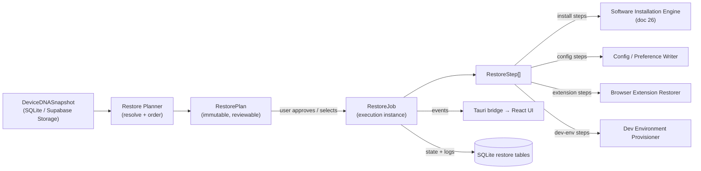
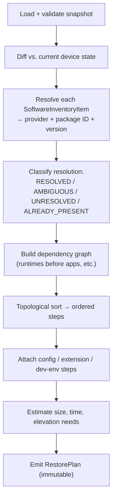
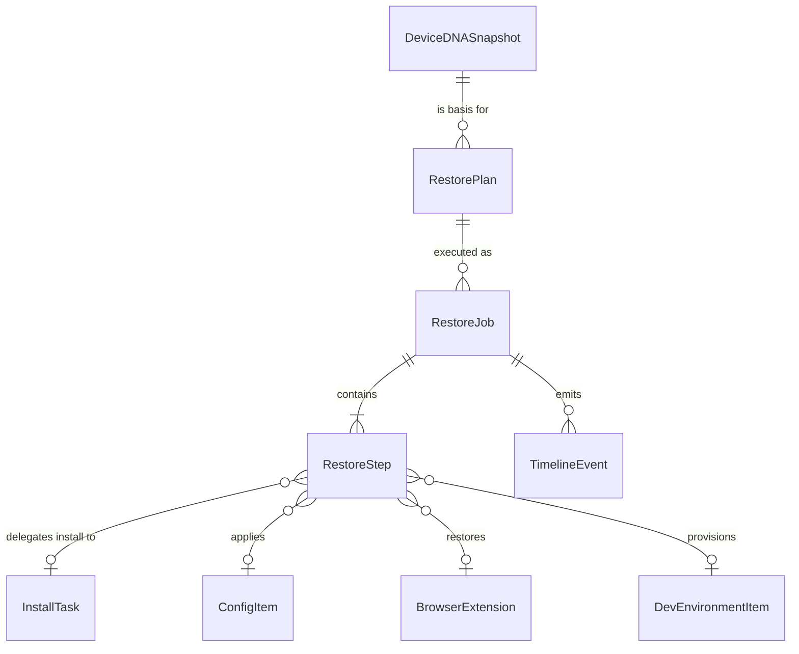
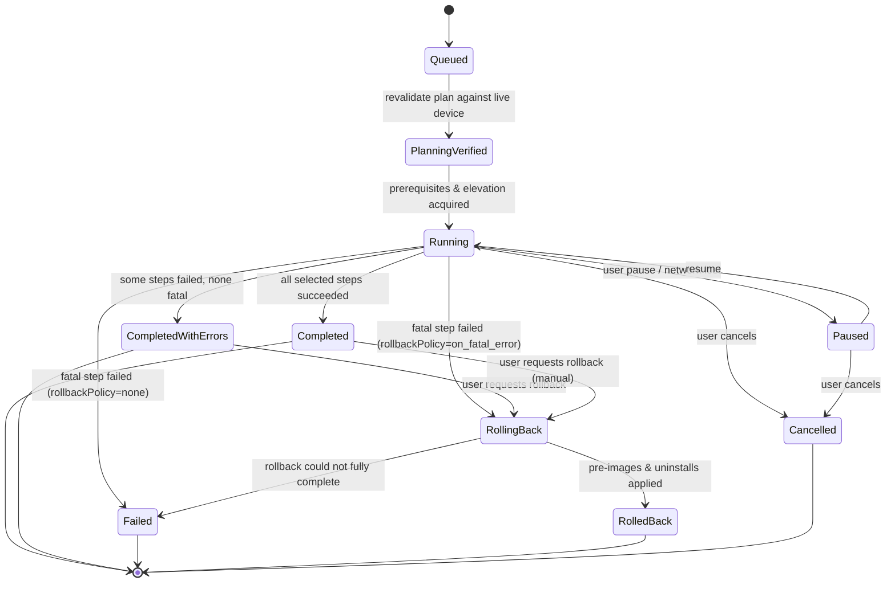
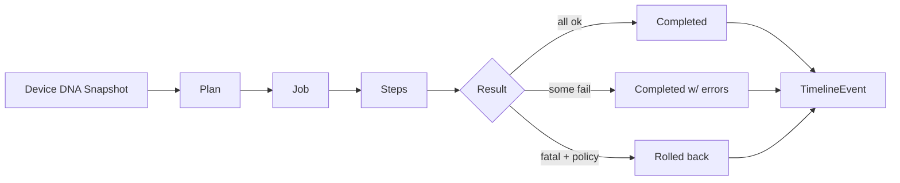

# 25. Restore Engine Design

> Design of the Restore Engine that powers One-Click Setup Restore: turning a Device DNA Snapshot into a reproducible, idempotent, rollback-safe sequence of installs, configuration writes, browser-extension and dev-environment restoration. Part of the DeviceLifeline documentation suite — see [Documentation Index](README.md).

**Status:** Draft v1 · **Authoring role:** Principal Software Architect · **Last updated:** 2026-06-07
**Related:** [24. Device DNA Design](24-device-dna-design.md), [26. Software Installation Engine Design](26-software-installation-engine-design.md), [27. Windows Architecture Plan](27-windows-architecture-plan.md), [30. System Architecture](30-system-architecture.md), [32. Database Design](32-database-design.md), [33. Entity Relationship Design](33-entity-relationship-design.md), [07. Non-Functional Requirements](07-non-functional-requirements.md)

---

## 1. Purpose & Scope

The Restore Engine is the on-device subsystem that consumes a **Device DNA Snapshot** (or a selectively filtered export of one) and recreates that machine state on a target device. It is the engine behind product pillar #2, **One-Click Setup Restore**, and a core capability of the **Recovery Center**.

This document specifies:

- The **planning phase** that resolves `SoftwareInventoryItem`s to installable sources/IDs and computes a dependency-ordered execution plan.
- The **`RestorePlan` → `RestoreJob` → `RestoreStep`** data model and lifecycle.
- Execution delegation to the [Software Installation Engine](26-software-installation-engine-design.md) for the install portion, plus the Restore Engine's own handling of **configuration/preferences**, **browser extensions**, and **dev-environment** restoration.
- **Idempotency**, **conflict handling**, **progress reporting**, **partial/selective restore**, and **rollback**.

**In scope (MVP):** Windows-only restore of applications (WinGet/Store/vendor), user-scoped configuration items, browser extensions for Chromium-family browsers, dev-environment item re-provisioning (language runtimes, SDKs, package managers, IDE extensions), progress reporting to the UI, selective restore, and best-effort rollback.

**Out of scope:** Full disk imaging / bit-for-bit cloning (DeviceLifeline restores *setup*, not a disk image); migration of user data files/documents (V1 restores environment, not personal files); cross-OS restore (a Windows snapshot restored to macOS) — see [28. Future macOS Architecture Plan](28-macos-architecture-plan.md); secret/credential migration (passwords, tokens) which is explicitly excluded for security reasons.

---

## 2. Assumptions

- **A1:** The source artifact is a validated `DeviceDNASnapshot` produced by the Device DNA Engine ([24](24-device-dna-design.md)), versioned by a `schema_version`, and either resident in local SQLite or pulled from Supabase Storage.
- **A2:** The target device runs the Rust Core with the same or newer snapshot `schema_version`; older snapshots are upgraded by a forward-migration pass before planning.
- **A3:** The actual mechanics of *installing* a package are owned by the [Software Installation Engine](26-software-installation-engine-design.md); the Restore Engine orchestrates, sequences, and reconciles but does not itself shell out to WinGet.
- **A4:** Restore runs with the privilege model defined in [27. Windows Architecture Plan](27-windows-architecture-plan.md): the Rust Core requests elevation per-step only when a step's provider declares it necessary.
- **A5:** A restore targets a single device at a time in MVP. Fleet-wide push of an `EnvironmentTemplate` is post-MVP (Business Edition, [57](57-business-edition-specification.md)).
- **A6:** Network is available for package downloads; the engine degrades gracefully (queue + resume) on intermittent connectivity.
- **A7:** Restore is **non-destructive by default** — it never uninstalls existing software or overwrites a user config without an explicit conflict-resolution decision.
- **A8:** Secrets are never present in a snapshot (enforced upstream by Device DNA redaction), so restore never handles credential material.

---

## 3. Restore Engine Responsibilities & Position



The Restore Engine is a Rust Core module. It is **stateful and resumable**: every `RestoreJob` and `RestoreStep` is persisted to SQLite so an interrupted restore (reboot, crash, power loss) can resume from the last durable checkpoint rather than restarting.

---

## 4. Phase 1 — Planning

Planning transforms a snapshot into an **immutable, reviewable `RestorePlan`**. Planning performs **no side effects** on the system; it can be run, inspected, diffed against the current machine, and edited (selective restore) before any execution.

### 4.1 Planning pipeline



### 4.2 Resolution: from inventory item to installable

Each `SoftwareInventoryItem` carries provenance captured at snapshot time (`source`, `package_id`, `version`, publisher, install location, detection signals). The planner resolves it to a concrete install instruction via the Installation Engine's provider catalog:

| Resolution status | Meaning | Plan behavior |
|---|---|---|
| `RESOLVED` | Exactly one provider + package ID maps confidently | Add install step |
| `ALREADY_PRESENT` | Same package + compatible version already installed | Skip (record as satisfied) |
| `AMBIGUOUS` | Multiple candidate IDs (e.g., two WinGet IDs match) | Mark for user selection; default to highest-confidence candidate |
| `UNRESOLVED` | No known provider/source (e.g., a sideloaded EXE with no registry entry) | Flag as **manual**; surface download hint if `installer_url` was captured |
| `BLOCKED` | Policy/entitlement disallows (e.g., Business `Policy`) | Exclude with reason |

Resolution confidence is a 0–1 score derived from matching `package_id`, publisher, and product-name similarity. The threshold for auto-`RESOLVED` is **≥ 0.85**; below that the item becomes `AMBIGUOUS`.

### 4.3 Dependency ordering

The planner builds a directed acyclic graph of steps and topologically sorts it. Ordering rules (highest priority first):

1. **Platform prerequisites** (e.g., VC++ redistributables, .NET runtime, WebView2) before dependent apps.
2. **Language runtimes / package managers** (Node, Python, Rust toolchain, Git) before tools that depend on them.
3. **Applications** in dependency order where declared; otherwise grouped by provider to maximize batch efficiency.
4. **Configuration steps** after their owning application is installed.
5. **Browser extension steps** after the owning browser is installed.
6. **Dev-environment package installs** (e.g., `npm`/`pip` global packages, IDE extensions) after their runtime/host is present.

If a cycle is detected (should not occur from captured data), the planner breaks it at the lowest-confidence edge and logs a planning warning.

### 4.4 Illustrative `RestorePlan` contract

```jsonc
{
  "plan_id": "rp_01HZX...",
  "snapshot_id": "dna_01HZ...",
  "schema_version": 3,
  "target_device_id": "dev_01HY...",
  "created_at": "2026-06-07T10:12:00Z",
  "summary": {
    "total_steps": 47,
    "install_steps": 31,
    "config_steps": 9,
    "extension_steps": 5,
    "dev_env_steps": 2,
    "estimated_download_bytes": 5837237760,
    "estimated_duration_seconds": 1850,
    "requires_elevation": true,
    "unresolved_count": 3
  },
  "steps": [
    {
      "step_id": "rs_0001",
      "kind": "install",
      "depends_on": [],
      "resolution": "RESOLVED",
      "provider": "winget",
      "package_id": "Microsoft.VCRedist.2015+.x64",
      "target_version": "14.40.33810",
      "version_policy": "pin",
      "requires_elevation": true,
      "selected": true
    },
    {
      "step_id": "rs_0014",
      "kind": "config",
      "depends_on": ["rs_0009"],
      "config_ref": "cfg_terminal_settings",
      "scope": "user",
      "conflict_policy": "prompt",
      "selected": true
    }
  ],
  "unresolved": [
    { "inventory_item_id": "swi_77", "name": "Acme Internal Tool", "reason": "UNRESOLVED",
      "hint": { "installer_url": null, "publisher": "Acme Corp" } }
  ]
}
```

A `RestorePlan` is **immutable** once emitted. Selective restore mutates a *copy* (toggling `selected` and resolving `AMBIGUOUS` choices), producing a new `plan_id`.

---

## 5. Phase 2 — Execution Model (`RestorePlan` → `RestoreJob` → `RestoreStep`)

A `RestoreJob` is a single execution attempt of a `RestorePlan`. It owns ordered `RestoreStep` instances cloned from the plan's selected steps. Re-running a failed plan creates a **new** `RestoreJob` against the same `plan_id` (preserving audit history).

### 5.1 Entity relationships



`InstallTask` is owned by the [Software Installation Engine](26-software-installation-engine-design.md); an install-kind `RestoreStep` holds a reference to the `InstallTask` it spawned, decoupling restore orchestration from install mechanics.

### 5.2 Step kinds

| `kind` | Handler | Idempotency key | Rollback action |
|---|---|---|---|
| `install` | Installation Engine ([26](26-software-installation-engine-design.md)) | `provider:package_id:target_version` | Uninstall *only if* this job installed it (tracked) |
| `config` | Config/Preference Writer | `config_ref:scope:target_path` | Restore pre-image captured before write |
| `extension` | Browser Extension Restorer | `browser:profile:extension_id` | Remove extension if added by this job |
| `dev_env` | Dev Environment Provisioner | `tool:ecosystem:identifier` | Provider-specific (e.g., `npm uninstall -g`) |
| `prerequisite` | Installation Engine | same as `install` | Generally retained (shared dependency) |

### 5.3 Illustrative `RestoreJob` / `RestoreStep` shapes

```typescript
type RestoreJobStatus =
  | "queued" | "planning_verified" | "running"
  | "paused" | "completed" | "completed_with_errors"
  | "failed" | "rolling_back" | "rolled_back" | "cancelled";

interface RestoreJob {
  jobId: string;
  planId: string;
  snapshotId: string;
  targetDeviceId: string;
  status: RestoreJobStatus;
  mode: "full" | "selective" | "resume";
  rollbackPolicy: "none" | "on_fatal_error" | "manual";
  startedAt?: string;
  finishedAt?: string;
  progress: { completedSteps: number; totalSteps: number; bytesDownloaded: number };
  steps: RestoreStep[];
}

type RestoreStepStatus =
  | "pending" | "blocked" | "in_progress" | "succeeded"
  | "skipped" | "failed" | "needs_user" | "rolled_back";

interface RestoreStep {
  stepId: string;
  jobId: string;
  kind: "install" | "config" | "extension" | "dev_env" | "prerequisite";
  status: RestoreStepStatus;
  dependsOn: string[];
  idempotencyKey: string;
  installTaskId?: string;          // set for install/prerequisite kinds
  preImageRef?: string;            // pointer to pre-write backup (config/extension)
  attempt: number;
  lastError?: { class: string; message: string; retriable: boolean };
  startedAt?: string;
  finishedAt?: string;
}
```

---

## 6. Restore Lifecycle (State Machine)



**`PlanningVerified` gate:** Because a plan may be hours or days old, the engine re-diffs the plan against the live device before running. Steps whose preconditions changed (now `ALREADY_PRESENT`, or now `BLOCKED`) are re-classified, and the user is shown the delta if it is material.

---

## 7. Configuration & Preference Restoration

Configuration restoration applies captured `ConfigItem`s (startup items, power settings, environment variables, app preference files, terminal/shell profiles). Each `ConfigItem` declares a **scope** (`user` | `machine`) and a **medium** (`registry` | `file` | `env` | `os_setting`).

- **Pre-image capture:** Before writing, the engine snapshots the current value (`preImageRef`) so the step is reversible.
- **Conflict policy** per item: `prompt` (default for user-visible prefs), `overwrite`, `merge` (for additive structures like PATH entries — de-duplicated), or `skip_if_exists`.
- **Machine-scope** writes require elevation and are gated behind an explicit confirmation in the UI.
- **Sensitive medium guardrails:** Registry writes are constrained to an allowlist of known DeviceLifeline-managed keys plus application keys present in the snapshot; arbitrary registry restoration is rejected.

```jsonc
// Illustrative ConfigItem restore directive (PATH merge example)
{
  "config_ref": "cfg_user_path",
  "medium": "env",
  "scope": "user",
  "key": "PATH",
  "operation": "merge",
  "values_to_ensure": ["%USERPROFILE%\\.cargo\\bin", "C:\\tools\\bin"],
  "dedupe": true,
  "conflict_policy": "merge"
}
```

---

## 8. Browser Extension Restoration

For Chromium-family browsers (Chrome, Edge, Brave) the engine restores **extensions** (not their data) per `BrowserProfile`:

- Each `BrowserExtension` is identified by store `extension_id` + source store (Chrome Web Store / Edge Add-ons).
- **MVP mechanism:** Force-install/allowlist via the browser's `ExtensionInstallForcelist` / `ExtensionSettings` policy keys so the browser installs the extension on next launch — this avoids fragile direct-CRX injection and respects store integrity.
- The engine writes profile-scoped policy, records a `preImageRef` of prior policy, and reports completion when the browser confirms install (polled) or marks `needs_user` if the browser is not installed yet (dependency ordering normally prevents this).
- Firefox uses its own add-on policy mechanism; captured but flagged lower-confidence in MVP.

> **MVP boundary:** Restoring extension *settings/state* and syncing signed-in browser profiles is **post-MVP**. V1 restores the *set of extensions*, not their internal configuration.

---

## 9. Dev-Environment Restoration

Dev-environment restoration provisions `DevEnvironmentItem`s captured by the Device DNA Engine: language runtimes, SDKs, package managers, global packages, and IDE extensions.

| Dev item type | Restore strategy | Delegated to |
|---|---|---|
| Language runtime (Node, Python, Go, Rust) | Install via Installation Engine, pin major.minor | [26](26-software-installation-engine-design.md) |
| Package manager (npm, pip, cargo, pnpm) | Ensure present (often bundled with runtime) | Dev Env Provisioner |
| Global packages (`npm -g`, `pipx`, `cargo install`) | Re-install from captured name@version list | Dev Env Provisioner |
| IDE / editor extensions (VS Code, JetBrains) | CLI-driven extension install from captured ID list | Dev Env Provisioner |
| Version managers (nvm, pyenv) | Install manager, then re-create captured versions | Dev Env Provisioner |

Global-package restoration is **batched** and **idempotent**: re-running re-checks installed versions and only installs deltas. Failures here are non-fatal by default (classified `completed_with_errors`) because a single broken global package should not abort the whole restore.

```jsonc
// Illustrative dev_env step payload
{
  "tool": "vscode",
  "ecosystem": "editor_extensions",
  "items": [
    { "id": "rust-lang.rust-analyzer", "version": "any" },
    { "id": "esbenp.prettier-vscode", "version": "any" }
  ],
  "on_item_failure": "continue"
}
```

---

## 10. Idempotency & Conflict Handling

**Idempotency is a first-class invariant.** Every step has an `idempotencyKey`; before acting, the handler checks live state:

1. **Already-satisfied check** — if the desired end-state already exists (package present at compatible version, config value already equal, extension already installed), the step short-circuits to `succeeded`/`skipped` without side effects.
2. **At-most-once mutation** — handlers record what *they* changed (e.g., "this job installed package X") so rollback and re-runs never touch pre-existing state they didn't create.
3. **Re-run safety** — a `mode: "resume"` job skips `succeeded` steps and retries only `failed`/`pending`/`needs_user` ones.

**Conflict matrix (config/extension):**

| Existing state | Snapshot value | Default resolution |
|---|---|---|
| Absent | Present | Apply (no conflict) |
| Present, equal | Present | Skip (`ALREADY_PRESENT`) |
| Present, different (user-visible pref) | Present | `prompt` |
| Present, different (additive, e.g. PATH) | Present | `merge` |
| Present | Absent in snapshot | No action (restore never removes) |

---

## 11. Progress Reporting

The `RestoreJob` emits structured events over the Tauri bridge ([27](27-windows-architecture-plan.md), [30](30-system-architecture.md)) to the React UI, and mirrors them as `TimelineEvent`s so a restore is itself part of the device's history.

```typescript
// Events emitted on channel "restore://progress"
type RestoreEvent =
  | { type: "job_started"; jobId: string; totalSteps: number }
  | { type: "step_started"; stepId: string; label: string; kind: string }
  | { type: "step_progress"; stepId: string; pct: number; bytes?: number }
  | { type: "step_finished"; stepId: string; status: RestoreStepStatus }
  | { type: "needs_user"; stepId: string; prompt: ConflictPrompt }
  | { type: "job_finished"; jobId: string; status: RestoreJobStatus;
      summary: { succeeded: number; skipped: number; failed: number } };
```

- **Coarse + fine progress:** overall % (completed/total steps, byte-weighted) plus per-step progress (download/extract/configure).
- **Throttling:** `step_progress` events are coalesced to ≤ 4/sec per step to avoid UI flooding.
- **Resumable UI:** because state lives in SQLite, reopening the app mid-restore rehydrates the live view.

---

## 12. Partial / Selective Restore

Selective restore lets the user (or a Technician/Business policy) restore a subset:

- **Selection granularity:** by category (apps only, configs only, dev-env only, extensions only), by individual step, or by saved **filter** (e.g., "developer tools only").
- Toggling `selected=false` on a step automatically deselects dependents (and re-selecting a dependent re-selects its prerequisites) to keep the graph consistent.
- Selective restore validates that the chosen subset is still a valid DAG (no orphaned dependents) before producing the executable plan copy.

This is the foundation for **`EnvironmentTemplate`** (a curated, reusable subset of a snapshot) used by the **Developer** and **Business** editions — template-based fleet restore is post-MVP.

---

## 13. Rollback

Rollback uses the `preImageRef` and install-provenance recorded during execution.

```mermaid
sequenceDiagram
    participant U as React UI
    participant RJ as RestoreJob (Rust Core)
    participant SIE as Installation Engine
    participant CFG as Config Writer
    U->>RJ: requestRollback(jobId)
    RJ->>RJ: status = rolling_back; reverse step order
    loop steps in reverse (only those this job mutated)
        alt install/prerequisite step
            RJ->>SIE: uninstall(packageId) [only if installed by this job]
            SIE-->>RJ: result
        else config/extension step
            RJ->>CFG: restore(preImageRef)
            CFG-->>RJ: result
        end
        RJ->>U: step_finished(rolled_back | failed)
    end
    RJ-->>U: job_finished(rolled_back | failed)
```

**Rollback guarantees & limits:**

- Rollback is **best-effort and bounded**: it reverses only mutations this job made and never deletes user data created *after* the restore.
- Shared `prerequisite` installs are retained by default (uninstalling a shared runtime could break unrelated software) — surfaced as a rollback note.
- Some operations are inherently not perfectly reversible (e.g., an installer that ran post-install migrations). Such steps are tagged `irreversible: true` at plan time and excluded from automatic rollback with a clear UI warning.
- Rollback failure transitions the job to `Failed` with a per-step rollback report; the user retains a manual remediation list.

---

## Diagrams

(Primary diagrams are embedded inline: responsibilities §3, planning pipeline §4.1, entity model §5.1, lifecycle state machine §6, rollback sequence §13.) Summary data-flow:



---

## Risks & Mitigations

| Risk | Likelihood | Impact | Mitigation |
|---|---|---|---|
| Package ID resolution maps to wrong/abandoned package | Medium | High | Confidence threshold ≥ 0.85; publisher cross-check; `AMBIGUOUS` requires user confirm; pin versions; telemetry on resolution misses |
| Partial restore leaves a half-configured environment | Medium | Medium | Durable per-step checkpoints; resumable jobs; `completed_with_errors` surfaces exact failures + remediation list |
| Rollback cannot fully reverse an installer side effect | Medium | Medium | Tag `irreversible` steps at plan time; capture pre-images for config; explicit UI warnings; retain shared prerequisites |
| Snapshot is stale vs. target device | High | Low | `PlanningVerified` re-diff gate before execution; show material delta |
| Elevation prompts overwhelm/confuse user | Medium | Medium | Batch elevation; request once for a contiguous block of machine-scope steps ([27](27-windows-architecture-plan.md)) |
| Browser policy-based extension install blocked by enterprise policy | Low | Medium | Detect existing managed policy; fall back to `needs_user` with guidance |
| Long-running restore interrupted by reboot/power loss | Medium | Medium | WAL-backed SQLite state; resume mode; idempotent steps |
| Restore unintentionally overwrites a user's customized config | Low | High | Non-destructive default; `prompt` conflict policy; pre-image backups |
| Concurrent restore + scheduled snapshot contention | Low | Low | Single-writer lock on installer/scheduler; snapshots deferred during active job |

---

## Future Considerations

- **Cross-machine `EnvironmentTemplate`s** and fleet push for Business Edition ([57](57-business-edition-specification.md)).
- **Cross-OS restore mapping** (a logical app/runtime maps to WinGet on Windows, Homebrew on macOS) — see [28](28-macos-architecture-plan.md), [29](29-linux-architecture-plan.md).
- **Differential restore** that only applies the delta between a snapshot and the live machine ("bring this PC up to that state").
- **Restore dry-run / simulation report** exportable for technician sign-off ([56](56-technician-edition-specification.md)).
- **User-data-aware restore** (opt-in migration of selected config/data files) with explicit consent flows ([19. Privacy Requirements](19-privacy-requirements.md)).
- **AI-assisted resolution** of `UNRESOLVED`/`AMBIGUOUS` items via the AI Orchestration layer ([22](22-ai-diagnostics-design.md)).

---

## Acceptance Criteria

- [ ] AC-01: Given a valid `DeviceDNASnapshot`, the planner produces a `RestorePlan` with every `SoftwareInventoryItem` classified into exactly one resolution status.
- [ ] AC-02: The `RestorePlan` is immutable; selective edits yield a new `plan_id`.
- [ ] AC-03: Dependency ordering guarantees runtimes/prerequisites precede dependent apps; the emitted step order is a valid topological sort.
- [ ] AC-04: A `RestoreJob` persists all step state to SQLite such that an interrupted job can `resume` without repeating `succeeded` steps.
- [ ] AC-05: Re-running a completed plan against an already-restored machine results in all steps `skipped`/`succeeded` with no side effects (idempotency).
- [ ] AC-06: Install steps delegate to the Installation Engine via a referenced `InstallTask` ([26](26-software-installation-engine-design.md)); the Restore Engine never invokes WinGet directly.
- [ ] AC-07: Config steps capture a `preImageRef` before any write and honor the per-item conflict policy.
- [ ] AC-08: Browser extensions are restored via browser policy mechanism per `BrowserProfile`, not direct CRX injection.
- [ ] AC-09: Selective restore enforces DAG validity (no orphaned dependents) before execution.
- [ ] AC-10: Progress events are emitted over the Tauri bridge, throttled to ≤ 4/sec/step, and mirrored as a `TimelineEvent`.
- [ ] AC-11: Rollback reverses only mutations made by the job, retains shared prerequisites by default, and skips steps tagged `irreversible`.
- [ ] AC-12: A `PlanningVerified` re-diff runs before execution and surfaces any material delta to the user.
- [ ] AC-13: No step ever handles credential/secret material (verified by review against the redaction guarantee).
- [ ] AC-14: All restore outcomes (`completed`, `completed_with_errors`, `failed`, `rolled_back`) are distinguishable in the UI with an actionable remediation list where applicable.
