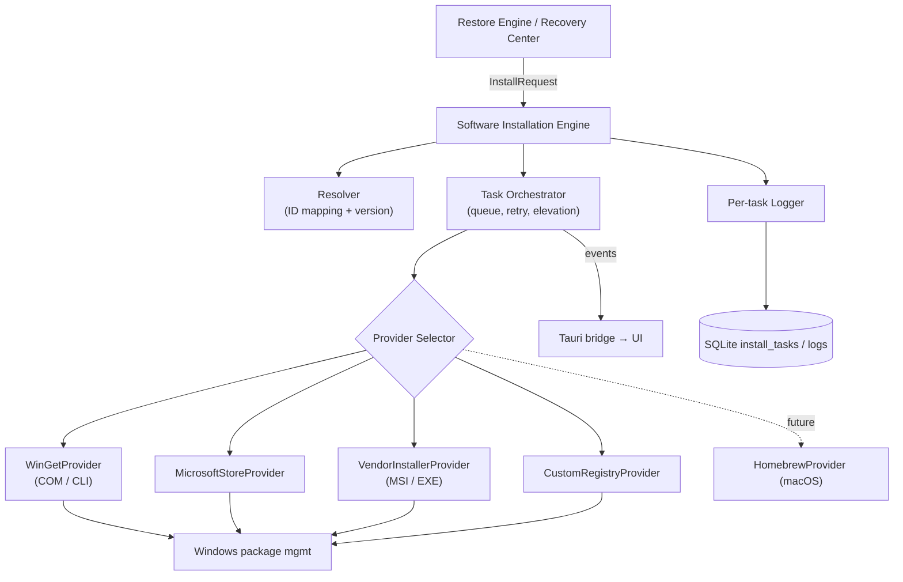
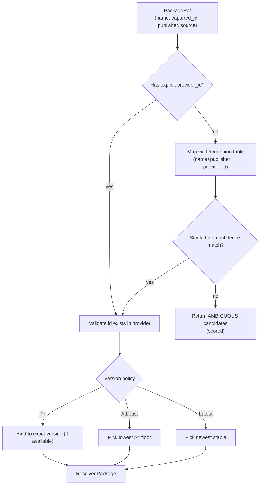
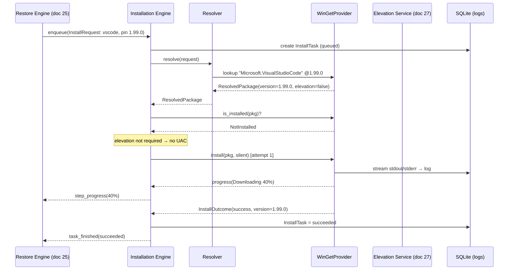
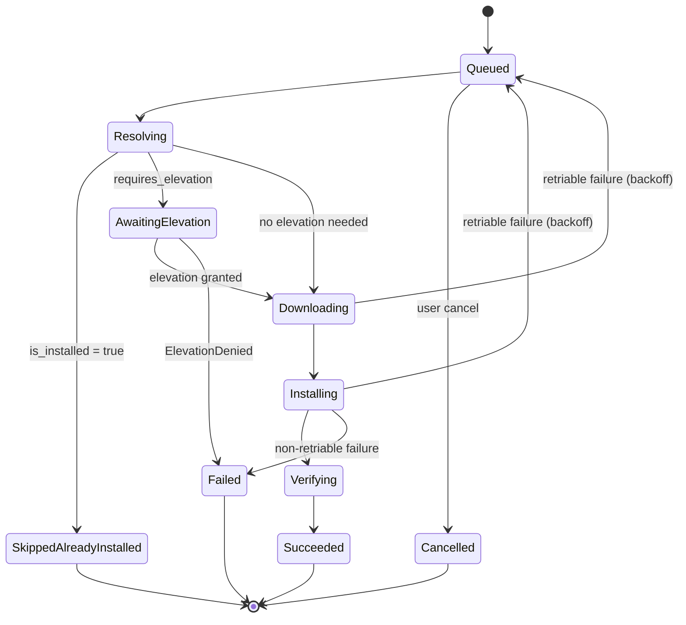

# 26. Software Installation Engine Design

> Design of the Software Installation Engine: a provider abstraction over WinGet, Microsoft Store, vendor installers, and custom registries that performs package resolution, silent/unattended installation, version pinning, retries, failure classification, elevation, and per-task logging. Part of the DeviceLifeline documentation suite — see [Documentation Index](README.md).

**Status:** Draft v1 · **Authoring role:** Principal Software Architect · **Last updated:** 2026-06-07
**Related:** [25. Restore Engine Design](25-restore-engine-design.md), [24. Device DNA Design](24-device-dna-design.md), [27. Windows Architecture Plan](27-windows-architecture-plan.md), [28. Future macOS Architecture Plan](28-macos-architecture-plan.md), [30. System Architecture](30-system-architecture.md), [36. Logging Strategy](36-logging-strategy.md), [07. Non-Functional Requirements](07-non-functional-requirements.md)

---

## 1. Purpose & Scope

The Software Installation Engine (SIE) is the Rust Core subsystem that **actually installs software** on the device. It exposes a single, provider-agnostic interface — `InstallProvider` — implemented per package source. Its primary consumer is the [Restore Engine](25-restore-engine-design.md), but it is also used for one-off installs from the **Recovery Center** and for `EnvironmentTemplate` provisioning.

This document specifies:

- The **`InstallProvider` abstraction** and its concrete implementations: **WinGet (primary)**, **Microsoft Store**, **vendor installers**, and **custom registries**.
- **Package resolution & ID mapping** from an abstract package reference to a provider-specific identifier.
- **Silent/unattended orchestration**, **version pinning**, **retries with backoff**, **failure classification**, **UAC/elevation**, and **per-task logging**.
- The **`InstallTask`** model and lifecycle.
- A clearly-future **Homebrew (macOS)** provider.

**In scope (MVP):** Windows install via WinGet COM/CLI and Microsoft Store; vendor-installer execution for captured EXE/MSI; a custom-registry provider for enterprise/curated catalogs; full task lifecycle, retry, and logging.

**Out of scope:** Deciding *what* to install or *in what order* (owned by the [Restore Engine](25-restore-engine-design.md)); license/entitlement enforcement (owned by cloud — see [34. API Specification](34-api-specification.md)); package authoring/publishing; OS/driver updates (handled by Windows Update, not the SIE in V1).

---

## 2. Assumptions

- **A1:** The caller (typically a `RestoreStep`) supplies a resolved `InstallRequest` containing a provider hint, package reference, and version policy; the SIE re-validates before acting.
- **A2:** WinGet (`winget`/`Microsoft.Management.Deployment` COM API) is present on supported Windows 10 21H2+/Windows 11 targets, or is bootstrapped by the agent if missing (see §11).
- **A3:** Elevation follows the privilege model in [27. Windows Architecture Plan](27-windows-architecture-plan.md): the Rust Core runs with least privilege and acquires elevation per-task only when a provider declares it necessary.
- **A4:** Network egress to package CDNs (WinGet sources, Store, vendor URLs) is permitted; the engine is resilient to transient failures.
- **A5:** Each install runs as a discrete, observable `InstallTask` with its own log stream persisted to SQLite and optionally to Sentry breadcrumbs on failure.
- **A6:** macOS/Homebrew is **future / post-MVP**; its provider is specified for interface-completeness only.
- **A7:** The engine never bypasses store integrity or code-signing checks; it disables prompts (silent) but not security validation.

---

## 3. Architecture Overview



The SIE is **stateless across process restarts only at the orchestration layer**; task state itself is durable in SQLite so an interrupted install resumes or is safely retried.

---

## 4. The `InstallProvider` Abstraction

Every package source implements one trait. The orchestrator depends only on this contract, so adding macOS Homebrew or a new vendor channel later requires no orchestrator changes.

```rust
// Illustrative interface shape (NOT production source) — Rust-flavored pseudocode.
pub enum ProviderId { WinGet, MicrosoftStore, VendorInstaller, CustomRegistry, Homebrew /* future */ }

pub struct InstallRequest {
    pub task_id: String,
    pub package_ref: PackageRef,        // abstract reference (name, ids, publisher)
    pub version_policy: VersionPolicy,  // Pin(ver) | AtLeast(ver) | Latest
    pub silent: bool,                   // always true in MVP automated flows
    pub custom_args: Option<Vec<String>>,
    pub source_override: Option<String>,// e.g. a custom registry URL
}

pub struct ResolvedPackage {
    pub provider: ProviderId,
    pub provider_package_id: String,    // e.g. "Microsoft.PowerToys"
    pub resolved_version: String,
    pub requires_elevation: bool,
    pub download_size_bytes: Option<u64>,
    pub silent_args: Vec<String>,       // provider-derived silent switches
}

pub enum InstallProgress { Resolving, Downloading{pct:u8}, Installing{pct:Option<u8>}, Verifying }

pub struct InstallOutcome {
    pub success: bool,
    pub installed_version: Option<String>,
    pub exit_code: Option<i32>,
    pub failure: Option<FailureClass>,
    pub log_ref: String,
}

pub trait InstallProvider {
    fn id(&self) -> ProviderId;
    fn is_available(&self) -> bool;                                   // provider present on host?
    fn resolve(&self, req: &InstallRequest) -> Result<ResolvedPackage, ResolveError>;
    fn is_installed(&self, pkg: &ResolvedPackage) -> InstalledState;  // idempotency check
    fn install(&self, pkg: &ResolvedPackage,
               progress: &dyn Fn(InstallProgress)) -> InstallOutcome;
    fn uninstall(&self, pkg: &ResolvedPackage) -> InstallOutcome;     // for rollback
    fn classify_failure(&self, raw: &RawResult) -> FailureClass;      // provider-specific mapping
}
```

### 4.1 Provider matrix

| Provider | Mechanism | Silent mode | Version pinning | Uninstall (rollback) | Elevation | MVP |
|---|---|---|---|---|---|---|
| **WinGet** | `Microsoft.Management.Deployment` COM (preferred) → `winget.exe` CLI fallback | `--silent --accept-package-agreements --accept-source-agreements` | `--version <v>`, `--pin` | `winget uninstall` | Per-package | ✅ Primary |
| **Microsoft Store** | MSIX deployment / `winget` Store source | Inherent (MSIX) | Store-managed; best-effort pin | Package removal | Usually none | ✅ |
| **Vendor installer** | Execute captured/downloaded MSI/EXE | MSI `/qn /norestart`; EXE per known switch table | Limited (version implicit in installer) | MSI product-code uninstall; EXE best-effort | Typically required | ✅ |
| **Custom registry** | Curated JSON/YAML catalog → resolves to one of the above + signed URL | Inherited from underlying installer | Catalog-declared | Inherited | Inherited | ✅ (Business/Technician) |
| **Homebrew** | `brew install <formula/cask>` | Inherent | `@version` formulae | `brew uninstall` | No (user-scope) | 🔮 Future ([28](28-macos-architecture-plan.md)) |

---

## 5. Package Resolution & ID Mapping

Resolution converts an abstract `PackageRef` (as captured by the Device DNA Engine) into a `ResolvedPackage`.



### 5.1 ID-mapping table

The engine maintains a versioned **ID-mapping catalog** (synced from Supabase, cached locally) that maps logical packages to provider-specific IDs and known silent switches:

```jsonc
{
  "catalog_version": "2026.06.01",
  "entries": [
    {
      "logical": "google-chrome",
      "publisher": "Google LLC",
      "providers": {
        "winget": { "id": "Google.Chrome", "elevation": true },
        "vendor": { "url_template": null, "silent_args": ["/silent","/install"] }
      },
      "aliases": ["chrome", "Google Chrome"]
    },
    {
      "logical": "vscode",
      "providers": {
        "winget": { "id": "Microsoft.VisualStudioCode", "elevation": false },
        "store":  { "id": null }
      }
    }
  ]
}
```

Confidence scoring mirrors the Restore Engine's resolution ([25 §4.2](25-restore-engine-design.md)): exact `provider_package_id` match → 1.0; publisher + normalized-name match → high; fuzzy name only → lower. Below the auto threshold the SIE returns `AMBIGUOUS` candidates for the caller to disambiguate (the Restore Engine surfaces these to the user).

---

## 6. The `InstallTask` Model

```typescript
type InstallTaskStatus =
  | "queued" | "resolving" | "awaiting_elevation"
  | "downloading" | "installing" | "verifying"
  | "succeeded" | "failed" | "cancelled" | "skipped_already_installed";

interface InstallTask {
  taskId: string;
  parentStepId?: string;            // RestoreStep that spawned it (doc 25)
  provider: "winget" | "store" | "vendor" | "custom" | "homebrew";
  packageRef: { name: string; capturedId?: string; publisher?: string };
  resolvedPackageId?: string;
  versionPolicy: { kind: "pin" | "at_least" | "latest"; version?: string };
  resolvedVersion?: string;
  silent: boolean;
  requiresElevation: boolean;
  status: InstallTaskStatus;
  attempt: number;
  maxAttempts: number;              // default 3
  backoff: { strategy: "exponential"; baseMs: 2000; capMs: 60000; jitter: true };
  exitCode?: number;
  failure?: { class: FailureClass; message: string; retriable: boolean };
  logRef: string;                   // pointer to per-task log in SQLite
  startedAt?: string;
  finishedAt?: string;
}
```

`InstallTask` is the durable unit. The Restore Engine references it by `taskId`; the SIE owns its lifecycle.

---

## 7. Install Sequence (Worked Example)



Failure path (illustrative): if `install` returns a transient `FailureClass::NetworkTimeout`, the orchestrator schedules attempt 2 after exponential backoff; if it returns `FailureClass::PackageNotFound`, it is non-retriable and fails immediately.

---

## 8. Silent / Unattended Orchestration

- **All automated installs are silent.** Each provider contributes the correct switches (WinGet `--silent`; MSI `/qn /norestart`; EXE via a curated per-vendor switch table in the catalog).
- **No reboots without consent:** `--norestart` / `/norestart` is forced; if a package *requires* a reboot, the task completes with a `reboot_pending` flag surfaced to the user rather than auto-rebooting.
- **Source/license agreement auto-accept** for WinGet is enabled only for unattended flows and recorded in the task log for auditability.
- **Concurrency:** installs run with a bounded concurrency limit (default **2** concurrent tasks) to avoid installer mutual-exclusion failures and resource contention; dependency-linked tasks are serialized by the Restore Engine's ordering.

---

## 9. Version Pinning

| Policy | Behavior | Use case |
|---|---|---|
| `pin` | Install the *exact* captured version; fail or warn if unavailable | Reproducing a known-good environment ([25](25-restore-engine-design.md)) |
| `at_least` | Install the lowest available version ≥ floor | Security-minded restores |
| `latest` | Install newest stable | Fresh setup where exact parity is unimportant |

For WinGet, `pin` uses `--version` and may apply `winget pin add` so a later `winget upgrade --all` does not silently move a pinned package. If the exact version is no longer in the source, the SIE returns `VersionUnavailable` and the caller decides (downgrade policy / nearest version / user prompt). Pin decisions and any fallback are logged.

---

## 10. Retries, Backoff & Failure Classification

### 10.1 Backoff

Default policy: **exponential backoff with full jitter**, `base = 2s`, `cap = 60s`, `maxAttempts = 3`, only for **retriable** failure classes. Formula: `delay = rand(0, min(cap, base * 2^(attempt-1)))`.

### 10.2 Failure taxonomy

Each provider maps raw results (exit codes, HRESULTs, WinGet error strings, MSI codes) into a stable `FailureClass`:

| `FailureClass` | Example raw signal | Retriable | Default handling |
|---|---|---|---|
| `NetworkTimeout` | WinGet `0x8a15...` download timeout | ✅ | Backoff + retry |
| `SourceUnavailable` | WinGet source unreachable | ✅ | Backoff + retry (then fail) |
| `PackageNotFound` | No matching ID/version | ❌ | Fail; bubble for re-resolution |
| `VersionUnavailable` | Pinned version missing | ❌ | Fail; caller decides fallback |
| `HashMismatch` | Installer integrity check failed | ❌ | Fail hard (security) |
| `ElevationDenied` | User declined UAC | ❌ | Fail; mark `needs_user` |
| `DiskFull` | MSI 1603 / ENOSPC | ❌ | Fail; surface remediation |
| `RebootRequired` | MSI 3010 | ➖ | Mark `reboot_pending`, treat as success-pending |
| `AlreadyInstalled` | WinGet "already installed" | ➖ | Map to `skipped_already_installed` |
| `InstallerError` | Generic non-zero MSI/EXE code | ⚠️ conditional | Retry once if unknown; else fail with code |
| `Cancelled` | User/cancel signal | ❌ | Mark cancelled |

`HashMismatch` is **never** retried or worked around — it is a security stop.

---

## 11. UAC / Elevation

Elevation policy is defined fully in [27. Windows Architecture Plan](27-windows-architecture-plan.md); the SIE's contract:

- Each `ResolvedPackage` declares `requires_elevation`.
- The orchestrator **batches** contiguous elevated tasks so the user sees as few UAC prompts as possible (the Restore Engine groups machine-scope steps for the same reason — [25 §13 risk row](25-restore-engine-design.md)).
- Elevated work runs in a separate, short-lived elevated helper invoked over a brokered channel; the main agent stays least-privilege.
- `ElevationDenied` is non-retriable and surfaces as `needs_user`.
- **WinGet bootstrap:** if WinGet is absent, the SIE installs the App Installer / `Microsoft.DesktopAppInstaller` dependency (Store/MSIX) as an elevated prerequisite before proceeding; if bootstrap fails, dependent install tasks fail with a clear `SourceUnavailable` + remediation.

---

## 12. Per-Task Logging

Every `InstallTask` owns a structured log stream (see [36. Logging Strategy](36-logging-strategy.md)):

```jsonc
// Illustrative per-task log record
{
  "task_id": "it_01HZ...",
  "ts": "2026-06-07T10:14:22.451Z",
  "phase": "installing",
  "provider": "winget",
  "level": "info",
  "event": "provider_stdout",
  "message": "Successfully installed",
  "attempt": 1,
  "redacted": true        // file paths/usernames scrubbed per privacy policy
}
```

- Logs are stored in SQLite (`install_task_logs`) keyed by `task_id`, rolled up into the `RestoreJob` log, and **path/PII-redacted** per [19. Privacy Requirements](19-privacy-requirements.md).
- On failure, the last N lines + the `FailureClass` are attached as **Sentry breadcrumbs** (no PII) to aid diagnosis ([37. Observability Strategy](37-observability-strategy.md)).
- Logs are exportable (technician troubleshooting, [56](56-technician-edition-specification.md)).

---

## 13. Future Homebrew (macOS) Provider 🔮

Documented for interface-completeness; implementation is **post-MVP** ([28. Future macOS Architecture Plan](28-macos-architecture-plan.md)).

- Implements the same `InstallProvider` trait — `brew` formulae and casks.
- `resolve`: `brew info --json`; `is_installed`: `brew list`; `install`: `brew install <name>[@version]`; `uninstall`: `brew uninstall`.
- Version pinning via versioned formulae (`node@20`) or `brew pin`; many formulae are latest-only (documented limitation).
- Typically **no elevation** (Homebrew is user-scoped), simplifying the elevation path on macOS.
- The Resolver gains a Homebrew column in the ID-mapping catalog so a single logical package (e.g., `vscode`) maps to `Microsoft.VisualStudioCode` (WinGet) *and* `visual-studio-code` (cask), enabling future cross-OS restore.

---

## Diagrams

(Architecture §3, resolution flow §5, install sequence §7 are the primary diagrams.) Install task lifecycle:



---

## Risks & Mitigations

| Risk | Likelihood | Impact | Mitigation |
|---|---|---|---|
| WinGet absent or outdated on target | Medium | High | Detect + bootstrap App Installer; CLI/COM fallback; clear remediation on bootstrap failure |
| Vendor EXE has unknown silent switches | Medium | Medium | Curated per-vendor switch table in catalog; default to documented generic switches; mark `needs_user` if unknown |
| Pinned version no longer in source | Medium | Medium | `VersionUnavailable` class; caller-chosen fallback (nearest/latest/prompt); log decision |
| Installer integrity (hash) mismatch | Low | High | `HashMismatch` is a hard security stop — never retried/bypassed |
| Excessive UAC prompts harm UX | Medium | Medium | Batch elevated tasks; brokered elevated helper; request once per contiguous block |
| Concurrent installers conflict (mutex) | Medium | Medium | Bounded concurrency (default 2); serialize dependency-linked tasks |
| Silent flag suppresses a required EULA acceptance unexpectedly | Low | Medium | Auto-accept only for unattended flows; record acceptance in audit log |
| Auto-reboot disrupts user | Low | High | Force `--norestart`; never auto-reboot; surface `reboot_pending` |
| Provider raw errors not mapped → opaque failures | Medium | Low | Maintain `FailureClass` mapping per provider; `InstallerError` catch-all with retained exit code; telemetry on unmapped codes |
| Logs leak file paths / usernames | Low | Medium | Redaction layer before persistence ([19](19-privacy-requirements.md)); Sentry breadcrumbs PII-free |

---

## Future Considerations

- **HomebrewProvider** (macOS) and Linux package-manager providers (apt/dnf/pacman + flatpak/snap) implementing the same trait ([28](28-macos-architecture-plan.md), [29](29-linux-architecture-plan.md)).
- **Winget configuration (DSC)** integration to declaratively converge complex environments.
- **Parallel download / install pipelining** with smarter dependency-aware scheduling.
- **Signed custom-registry catalogs** with publisher trust pinning for Business/Technician editions.
- **Delta/upgrade-in-place** flows distinct from clean install.
- **Provider health telemetry** (resolution miss rate, failure-class distribution) feeding catalog improvements.

---

## Acceptance Criteria

- [ ] AC-01: All providers implement a single `InstallProvider` trait; the orchestrator depends only on that contract.
- [ ] AC-02: WinGet is the primary provider via COM with CLI fallback; Store, vendor, and custom-registry providers are available in MVP.
- [ ] AC-03: `resolve` maps an abstract `PackageRef` to a provider-specific ID via the versioned ID-mapping catalog, with confidence scoring and `AMBIGUOUS` handling.
- [ ] AC-04: `is_installed` enables idempotent skips (`skipped_already_installed`) without side effects.
- [ ] AC-05: All automated installs run silently and never auto-reboot (`--norestart`/`/norestart`); `reboot_pending` is surfaced instead.
- [ ] AC-06: Version pinning is enforced where the provider supports it; missing pinned versions yield `VersionUnavailable` rather than silently installing another version.
- [ ] AC-07: Retriable failures use exponential backoff with jitter (base 2s, cap 60s, max 3 attempts); non-retriable failures fail immediately.
- [ ] AC-08: Raw provider results are mapped to a stable `FailureClass`; `HashMismatch` is never retried or bypassed.
- [ ] AC-09: Elevation is requested per-task only when declared, runs via a brokered elevated helper, and is batched to minimize UAC prompts.
- [ ] AC-10: WinGet is bootstrapped if absent; failure to bootstrap produces a clear remediation message.
- [ ] AC-11: Every `InstallTask` produces a structured, PII-redacted log persisted to SQLite and attaches failure breadcrumbs to Sentry.
- [ ] AC-12: `InstallTask` state is durable so an interrupted install can be safely retried/resumed.
- [ ] AC-13: A future `HomebrewProvider` can be added without modifying the orchestrator (interface stability verified).
- [ ] AC-14: `uninstall` is implemented per provider to support Restore Engine rollback ([25 §13](25-restore-engine-design.md)).
