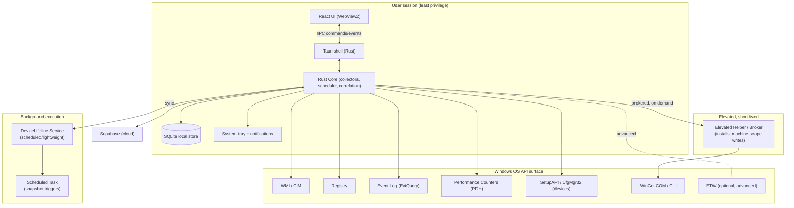
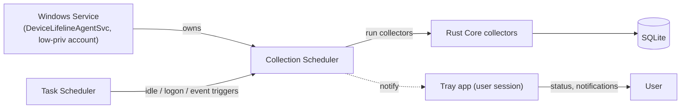
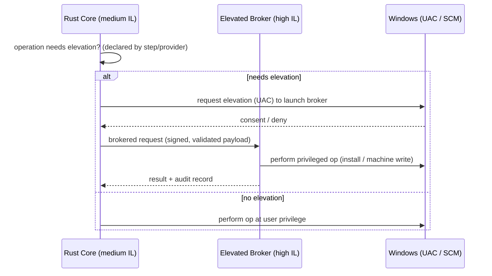
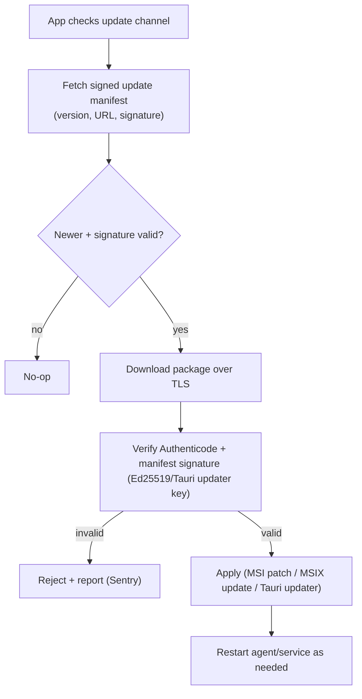

# 27. Windows Architecture Plan

> First-class Windows architecture for DeviceLifeline: how the Rust Core binds to Windows APIs, how Tauri packages and ships, the background execution and elevation model, secure auto-update, SmartScreen/Defender posture, and code signing. Part of the DeviceLifeline documentation suite — see [Documentation Index](README.md).

**Status:** Draft v1 · **Authoring role:** Staff Systems Engineer · **Last updated:** 2026-06-07
**Related:** [25. Restore Engine Design](25-restore-engine-design.md), [26. Software Installation Engine Design](26-software-installation-engine-design.md), [24. Device DNA Design](24-device-dna-design.md), [30. System Architecture](30-system-architecture.md), [17. Security Requirements](17-security-requirements.md), [28. Future macOS Architecture Plan](28-macos-architecture-plan.md), [40. Deployment Strategy](40-deployment-strategy.md), [07. Non-Functional Requirements](07-non-functional-requirements.md)

---

## 1. Purpose & Scope

Windows is DeviceLifeline's **first-class, MVP platform**. This document specifies the Windows-specific architecture: the OS API surface the Rust Core consumes, how the Tauri shell packages and installs, the background execution model that keeps the device's "operating memory" current, the privilege/elevation model, secure auto-update, and the trust/signing posture required to ship a privileged desktop agent that Windows and its users will accept.

**In scope (MVP):** Windows 10 (21H2+) and Windows 11, x86-64 (with an ARM64 note); Rust Core ↔ Windows API bindings for the Device DNA, Performance Timeline, and Health Intelligence collectors; Tauri packaging (MSI/MSIX); background execution; elevation; auto-update; code signing; SmartScreen/Defender reputation.

**Out of scope:** Per-collector field schemas (see [24. Device DNA Design](24-device-dna-design.md)); install mechanics (see [26](26-software-installation-engine-design.md)); macOS/Linux (see [28](28-macos-architecture-plan.md), [29](29-linux-architecture-plan.md)); cloud/CI deployment pipeline internals (see [38. DevOps Architecture](38-devops-architecture.md), [40. Deployment Strategy](40-deployment-strategy.md)).

---

## 2. Assumptions

- **A1:** Minimum supported OS: Windows 10 21H2 (build 19044) and Windows 11; primary architecture x86-64; ARM64 is a stretch target (see §12).
- **A2:** WebView2 runtime is present or bootstrapped (Tauri uses the Edge/Chromium WebView2 on Windows).
- **A3:** The Rust Core runs **least-privilege** by default and elevates per-operation, not as a perpetual SYSTEM process.
- **A4:** The product ships under an **EV (Extended Validation) code-signing certificate** to accelerate SmartScreen reputation and enable kernel-adjacent trust where needed.
- **A5:** Background collection cadence and resource budgets follow [07. NFRs](07-non-functional-requirements.md) (idle CPU < 0.5%, idle RAM < 30 MB).
- **A6:** WinGet (App Installer) is the primary install backend ([26](26-software-installation-engine-design.md)).
- **A7:** Telemetry is opt-in/configurable and privacy-first ([19. Privacy Requirements](19-privacy-requirements.md), [21. Device Telemetry Strategy](21-device-telemetry-strategy.md)).

---

## 3. Windows Component Architecture

**Process model:** one **user-session** process tree (Tauri shell + WebView2 UI + in-process Rust Core), a **background** mechanism for unattended collection, and an **on-demand elevated broker** for the rare privileged operation. This keeps the perpetually-running surface least-privilege and the elevated surface small and auditable ([17. Security Requirements](17-security-requirements.md)).

---

## 4. Rust Core ↔ Windows API Bindings

The Rust Core accesses Windows via the official `windows`/`windows-sys` crates (Rust projections of the Windows API) plus targeted COM interop. Mapping of collector → API:

| Capability | Windows API / mechanism | Rust binding approach | Privilege |
|---|---|---|---|
| Installed software inventory | Registry uninstall keys; WinGet `list`; MSI (`MsiEnumProducts`) | `windows` registry + WinGet COM | User (some machine keys need elevation) |
| System config (services, startup, power, network) | WMI/CIM, Registry, `powrprof`, IP Helper | WMI via COM; registry; targeted Win32 | User / elevated for machine scope |
| Browser environment | Per-profile files + registry; browser policy keys | File + registry reads | User |
| Dev environment | PATH/env, registry, file probes (SDK/runtime markers) | env + file probes | User |
| Health samples (CPU/RAM/disk/GPU/battery/net) | PDH counters; WMI `Win32_PerfFormattedData_*`; `GetSystemPowerStatus`; SMART via WMI/`DeviceIoControl` | PDH + WMI; `DeviceIoControl` for SMART | User; SMART may need elevation |
| Crash / event interpretation | Windows Event Log (`EvtQuery`/`EvtNext`), WER, minidump metadata | `windows` Event Log APIs | User (some channels need elevation) |
| Hardware/driver topology & changes | SetupAPI / CfgMgr32 device enumeration; WMI `Win32_PnPEntity` | SetupAPI + WMI | User |
| Software install/uninstall | WinGet COM (`Microsoft.Management.Deployment`) / CLI; MSI; EXE | COM + process exec | Elevated (per package) |
| Advanced trace (optional) | ETW sessions | `windows` ETW APIs | Elevated |

**Binding principles:**

- Prefer **COM/PDH/Event Log APIs** over shelling out to CLIs for performance and reliability; CLI (e.g., `winget.exe`) is a fallback path.
- All Windows calls are wrapped in safe Rust adapters with explicit error mapping to the engine's `FailureClass`/collector-error taxonomy.
- Collectors are **time-boxed** and **cancellable** to respect snapshot duration budgets ([07. NFR-008/009](07-non-functional-requirements.md)).
- WMI queries are scoped/projected (select only needed columns) to limit cost; long enumerations stream rather than buffer.

---

## 5. Tauri Packaging (MSI / MSIX)

Tauri produces native Windows installers. DeviceLifeline ships **two channels**:

| Format | Built via | Pros | Use case |
|---|---|---|---|
| **MSI** (WiX, Tauri default) | `tauri build` → WiX | Full control of services/scheduled tasks, per-machine install, mature enterprise deployment (GPO/SCCM/Intune) | Primary distribution (direct download, Business/Technician) |
| **MSIX** | Tauri MSIX / packaging | Clean install/uninstall, Store eligibility, auto-update via Store, stronger isolation | Microsoft Store channel + modern managed deployment |

- **WebView2 bootstrap:** the installer ensures the WebView2 Evergreen runtime is present (download-and-install if missing), so the React UI always has a renderer.
- **Per-machine install** is the default for the agent (so the background mechanism and machine-scope features work); a per-user fallback is documented for restricted environments.
- **Installer responsibilities:** lay down the binary, register the background execution mechanism (§6), create the SQLite store directory under a protected path, register file associations for `.dnasnapshot` exports, and write uninstall logic that cleanly removes the service/task and (optionally) local data.
- **Bundle size budget:** installed footprint targets the NFR (< 25 MB for binary + resources, [07. NFR-005](07-non-functional-requirements.md)); WebView2 is shared OS runtime, not bundled.

---

## 6. Background Execution Model

The device's "operating memory" requires **reliable, low-overhead background collection** even when the UI is closed. Three Windows mechanisms were evaluated:

| Option | Runs without login? | Resource control | Elevation | Verdict |
|---|---|---|---|---|
| **Windows Service** | Yes | Strong (SCM, recovery actions) | Can run as low-priv service account | Chosen for the **collection scheduler** |
| **Scheduled Task** | Yes (configurable triggers) | Good (event/idle/time triggers, throttling) | Configurable | Chosen for **trigger orchestration** (idle, logon, event-driven snapshots) |
| **Tray app only** | No (needs user session) | Weak | User | Used for **UI/notifications**, not core collection |

**Selected hybrid model:**

- **Service** = always-available, resource-governed host for the scheduler and lightweight periodic sampling (e.g., health samples on a cadence).
- **Scheduled Tasks** = event-driven triggers (system idle, user logon, "software installed" event, Windows Update completion) that ask the service to capture an incremental snapshot or a `TimelineEvent` — this is core to the **Performance Timeline** differentiator.
- **Tray app** = user-session presence for notifications/alerts and quick actions; it is **not** required for collection to run.
- **Resource governance:** background work honors idle budgets ([07. NFR-001/002](07-non-functional-requirements.md)); CPU/IO is throttled, snapshots prefer system-idle windows, and work yields under user activity or battery saver.

---

## 7. Elevation & Privilege Model

**Principles:**

- **Least privilege by default.** The continuously-running surface (UI, in-session core, background sampling) operates at standard/medium integrity. SYSTEM/perpetual-admin is avoided.
- **On-demand, short-lived elevation.** Privileged work (software installs, machine-scope config writes, some SMART/Event Log channels) is delegated to a **separate elevated broker** process, invoked only when needed and terminated after.
- **Prompt batching.** The Restore/Install engines batch contiguous elevated operations so the user faces minimal UAC prompts ([25 §13](25-restore-engine-design.md), [26 §11](26-software-installation-engine-design.md)).
- **Brokered, validated IPC.** Requests to the broker are integrity-checked and constrained to an allowlist of operations; the broker never executes arbitrary commands from the renderer.
- **Service account.** If the background service needs more than user rights for specific sampling, it runs under a **dedicated low-privilege service account** with only the rights it requires — not LocalSystem where avoidable ([17. Security Requirements](17-security-requirements.md)).

---

## 8. Secure Auto-Update

- **Tauri's built-in updater** (signed update artifacts with a private signing key; public key embedded in the app) is the baseline for the MSI/direct channel; **MSIX** updates flow through the **Microsoft Store** when distributed there.
- **Double verification:** transport TLS **and** package signature (Authenticode + Tauri updater signature). An update with a bad signature is rejected and reported.
- **Staged rollout & channels:** `stable` and `beta` channels; percentage-based staged rollout with the ability to halt a bad release ([45. Release Management Plan](45-release-management-plan.md)).
- **Rollback:** updater retains the prior version to allow rollback on failed post-update health check.
- **Service/task continuity:** updates that touch the background service re-register it idempotently; an interrupted update never leaves the device without a working agent (transactional MSI / MSIX semantics).

---

## 9. SmartScreen & Microsoft Defender Considerations

A privileged installer that touches WMI, the registry, and runs other installers will be scrutinized by SmartScreen and Defender. Posture:

- **EV code-signing certificate** to bootstrap SmartScreen reputation immediately (EV-signed binaries gain reputation faster than OV).
- **Stable signing identity** across releases so reputation accrues; never rotate the publisher identity casually.
- **Defender/AV behavioral friction:** because the agent enumerates processes/registry and launches installers, it can trip heuristic AV. Mitigations: ship clean, signed binaries; submit to Microsoft (and major AV vendors) for allowlisting/false-positive clearance; document expected behaviors; avoid patterns that resemble malware (no process injection, no unsigned dynamic code, no obfuscation).
- **Windows Defender Application Control / WDAC & enterprise allowlisting:** provide publisher info and hashes so enterprise admins can allowlist DeviceLifeline ([57. Business Edition](57-business-edition-specification.md)).
- **MSIX isolation** on the Store channel reduces AV friction via the packaged-app model.
- **Telemetry of update/install blocks** so SmartScreen/Defender false-positives are detected quickly in the field.

---

## 10. Code Signing

| Artifact | Signed with | Verification point |
|---|---|---|
| Main executable + Rust Core DLLs | EV Authenticode cert | OS load + SmartScreen |
| MSI installer | EV Authenticode cert | Install time + SmartScreen |
| MSIX package | Authenticode (Store-managed where via Store) | Install + Store |
| Auto-update payloads | Authenticode **and** Tauri updater signature | Updater verify step |
| Elevated broker binary | EV Authenticode cert | Launch (high-IL process) |

- **Signing happens in CI** with the key held in an HSM/secure key vault, never on developer machines ([38. DevOps Architecture](38-devops-architecture.md)).
- **Timestamping** every signature so binaries remain valid after certificate expiry.
- The **elevated broker is signed and its identity verified** before the core will hand it privileged work.

---

## 11. ARM64 Note

Windows-on-ARM is a **stretch target**, not MVP. The Rust Core and Tauri both support ARM64 builds; the main risks are WinGet/vendor-installer availability for ARM64 packages and emulated-x64 behavior. ARM64 is gated behind demand and CI capacity; documented here so build/packaging design (§5, §10) keeps the door open with multi-arch artifacts.

---

## Diagrams

(Component architecture §3, background execution §6, elevation sequence §7, and auto-update flow §8 are the primary diagrams.)

---

## Risks & Mitigations

| Risk | Likelihood | Impact | Mitigation |
|---|---|---|---|
| SmartScreen flags installer (low reputation) | High (early) | High | EV cert; stable identity; submit for reputation; staged rollout; monitor block telemetry |
| Defender/AV false-positive on a privileged agent | Medium | High | Clean signed binaries; vendor allowlisting submissions; avoid malware-like patterns; document behavior |
| Privilege escalation via the elevated broker | Low | High | Minimal allowlisted operations; validated brokered IPC; signed broker; no arbitrary command exec ([17](17-security-requirements.md)) |
| Background collection violates idle budget / drains battery | Medium | Medium | Idle-triggered scheduling; throttling; yield under user activity/battery saver ([07. NFR](07-non-functional-requirements.md)) |
| WebView2 runtime missing on target | Low | Medium | Installer bootstraps Evergreen WebView2 |
| Auto-update ships a broken build | Medium | High | Staged rollout + halt; signature verification; post-update health check + rollback to prior version |
| WMI/Event Log API cost spikes during snapshot | Medium | Medium | Scoped/projected queries; streaming; time-boxed cancellable collectors |
| Code-signing key compromise | Low | High | HSM-held key; CI-only signing; timestamping; revocation + re-sign plan ([42. DR](42-disaster-recovery-plan.md)) |
| Running as LocalSystem expands attack surface | Low | High | Dedicated low-priv service account; elevate per-op via broker instead |
| ARM64 package gaps break restore on ARM devices | Medium | Low | ARM64 stretch-only; detect arch; fall back / warn for unavailable packages |

---

## Future Considerations

- **ARM64 first-class** support with multi-arch CI and arch-aware package resolution ([26](26-software-installation-engine-design.md)).
- **ETW-based deep tracing** for advanced performance correlation (Performance Timeline, [23](23-performance-timeline-design.md)).
- **Winget DSC / Configuration** for declarative machine convergence.
- **WDAC/AppLocker-friendly packaging** profiles for high-security enterprises ([57](57-business-edition-specification.md)).
- **Kernel-assisted health signals** (e.g., storage/SMART deep telemetry) where justified, with the trust posture that entails.
- Cross-platform convergence with [28. macOS](28-macos-architecture-plan.md) and [29. Linux](29-linux-architecture-plan.md) plans sharing the Rust Core.

---

## Acceptance Criteria

- [ ] AC-01: The Rust Core accesses WMI, Registry, Event Log, PDH, SetupAPI, and WinGet via documented bindings, with each collector time-boxed and cancellable.
- [ ] AC-02: The continuously-running surface operates at least privilege; no perpetual LocalSystem/admin process.
- [ ] AC-03: Privileged operations are delegated to a separate, signed, short-lived elevated broker over validated, allowlisted IPC.
- [ ] AC-04: UAC prompts are batched for contiguous elevated operations.
- [ ] AC-05: The product ships both MSI and MSIX, bootstraps WebView2, and meets the installed-footprint NFR.
- [ ] AC-06: Background collection runs without an open UI via a Windows Service + Scheduled Task hybrid and honors idle/battery resource budgets.
- [ ] AC-07: Auto-update verifies both TLS transport and package signature (Authenticode + updater key), supports staged rollout with halt, and can roll back on a failed post-update health check.
- [ ] AC-08: All shipped binaries, installers, update payloads, and the broker are EV/Authenticode-signed in CI with an HSM-held key and timestamped.
- [ ] AC-09: A documented SmartScreen/Defender reputation and allowlisting plan exists with field block-telemetry monitoring.
- [ ] AC-10: Uninstall cleanly removes the service/scheduled task and offers local-data removal.
- [ ] AC-11: Multi-arch build artifacts are produced such that ARM64 can be enabled without re-architecting packaging/signing.
