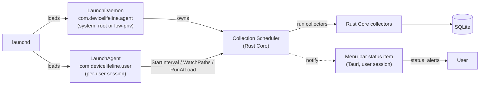
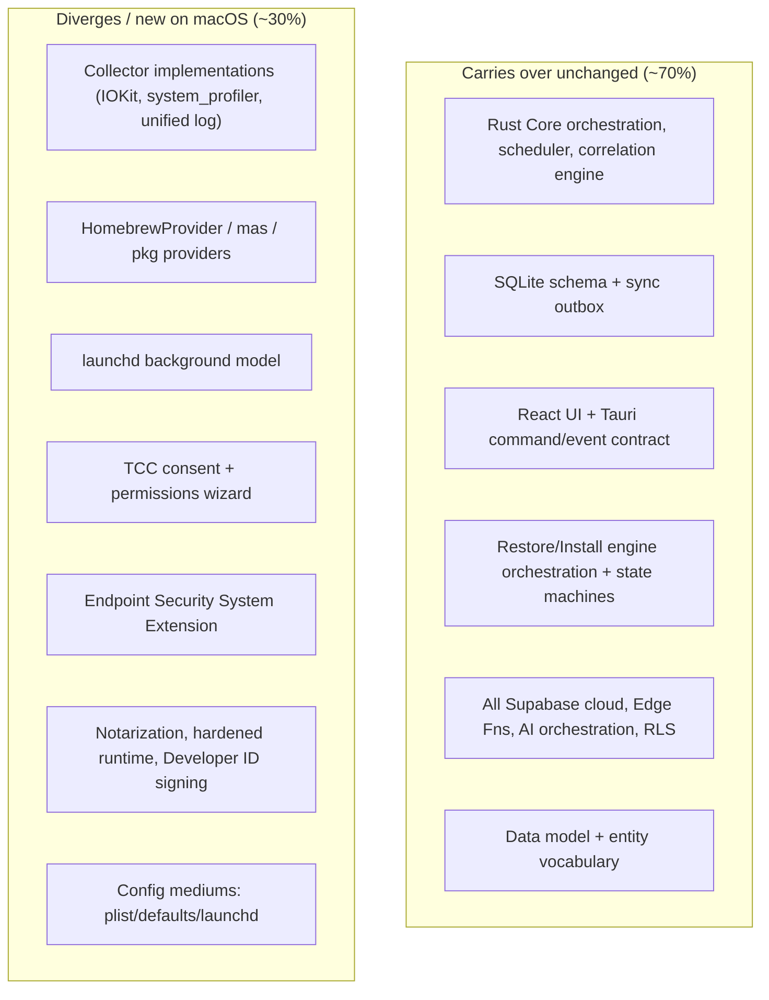

# 28. Future macOS Architecture Plan

> The **post-MVP** plan for bringing DeviceLifeline to macOS: the macOS equivalents of every Windows subsystem (Homebrew, launchd, system_profiler/IOKit, Endpoint Security, TCC, notarization, hardened runtime, sandboxing), what carries over unchanged from the Rust Core vs. what diverges, and an effort estimate. Part of the DeviceLifeline documentation suite — see [Documentation Index](README.md).

**Status:** Draft v1 · **Authoring role:** Staff Systems Engineer · **Last updated:** 2026-06-07
**Related:** [27. Windows Architecture Plan](27-windows-architecture-plan.md), [29. Future Linux Architecture Plan](29-linux-architecture-plan.md), [26. Software Installation Engine Design](26-software-installation-engine-design.md), [25. Restore Engine Design](25-restore-engine-design.md), [30. System Architecture](30-system-architecture.md), [24. Device DNA Design](24-device-dna-design.md), [17. Security Requirements](17-security-requirements.md), [12. Product Roadmap](12-product-roadmap.md)

---

## 1. Purpose & Scope

> **This is a FUTURE / post-MVP plan.** Windows is DeviceLifeline's first-class V1 platform ([27. Windows Architecture Plan](27-windows-architecture-plan.md)). macOS is **not in the MVP** ([11. MVP Definition](11-mvp-definition.md)). This document exists so the Rust Core, data model, and cloud are built today in a way that does not have to be re-architected to add macOS later — it is a forward-compatibility contract, not a build order.

This document specifies how DeviceLifeline's locked stack (Tauri shell, React UI, Rust Core, SQLite, Supabase) maps onto macOS, the macOS-native API surface each collector and the installer must use, the platform's security/permission regime (TCC, notarization, hardened runtime, sandboxing), and a realistic effort estimate for a macOS port.

**In scope:** macOS API/mechanism equivalents for DNA collection, Performance Timeline, Health Intelligence, Crash Intelligence, and the install/restore engines; packaging, code signing, notarization, and auto-update on macOS; the background execution model (launchd); the permission model (TCC, Endpoint Security); a carry-over vs. divergence analysis against the Rust Core; and a phased effort estimate.

**Out of scope:** macOS UI/UX deltas (the React UI is largely shared — platform chrome notes only); iOS/iPadOS companion apps (see [59. Future Mobile App Strategy](59-future-mobile-app-strategy.md)); the canonical data model, which is OS-agnostic ([33. Entity Relationship Design](33-entity-relationship-design.md)).

---

## 2. Assumptions

- **A1:** macOS support targets **macOS 13 Ventura and newer**, on **Apple Silicon (arm64) first**, with Intel (x86-64) as a universal-binary stretch.
- **A2:** The **Rust Core is the portability seam.** Platform-specific code lives behind trait boundaries (`Collector`, `InstallProvider`, `Scheduler`, `ElevationBroker`) so macOS is a new set of implementations, not a fork. This is a design constraint imposed **now** on the Windows build.
- **A3:** **Homebrew** is the primary macOS install backend, mirroring WinGet's role on Windows; the `HomebrewProvider` already has an interface stub in [26. Software Installation Engine Design](26-software-installation-engine-design.md) §13.
- **A4:** DeviceLifeline ships **outside the Mac App Store first** (Developer ID + notarization), because App Sandbox would block the system-inspection capabilities the product depends on. A future sandboxed Store build is a separate, reduced-capability SKU.
- **A5:** All cloud behavior (Supabase, Edge Functions, AI orchestration, sync, RLS) is **identical** to Windows; only the on-device half changes. AI keys still never ship on-device ([17. Security Requirements](17-security-requirements.md)).
- **A6:** The canonical entities (`DeviceDNASnapshot`, `SoftwareInventoryItem`, `TimelineEvent`, `HealthSample`, etc.) are unchanged; macOS only adds new enum *values* (e.g., `source = "homebrew"`), never new entity shapes ([33. Entity Relationship Design](33-entity-relationship-design.md) Future Considerations).
- **A7:** macOS will require **explicit user consent (TCC)** for several data sources; the product must function with graceful degradation when a permission is denied.

---

## 3. Platform Equivalence Map (Windows → macOS)

This is the heart of the port: every Windows mechanism from [27](27-windows-architecture-plan.md) and its macOS counterpart.

| Capability | Windows (V1, [27](27-windows-architecture-plan.md)) | macOS equivalent | Notes / divergence |
|---|---|---|---|
| Installed software inventory | Registry uninstall keys, WinGet `list`, MSI | `/Applications` + `system_profiler SPApplicationsDataType`; Homebrew (`brew list`); receipts (`pkgutil --pkgs`); Mac App Store (`mas`) | No registry; app discovery is filesystem + receipts + bundle `Info.plist` |
| System config (services, startup, power, network) | WMI, Registry, `powrprof`, IP Helper | `launchctl` (launch agents/daemons), `pmset`, `scutil`/`networksetup`, login items (`SMAppService`) | "Services" ≈ launchd jobs; "startup items" ≈ login items + LaunchAgents |
| Browser environment | Profile files + policy keys | Same profile-file approach (Chrome/Edge/Brave/Safari) under `~/Library/Application Support`; Safari via its own profile/extension model | Chromium logic ports directly; Safari extensions are App-Store-distributed (divergent) |
| Dev environment | PATH/env, registry, file probes | PATH/env, `~/.zprofile`/`~/.zshrc`, Homebrew prefixes, `xcode-select`, version managers (nvm/pyenv/rbenv) | Shell-config parsing differs (zsh default); Xcode/CLT detection is macOS-specific |
| Health samples (CPU/RAM/disk/GPU/battery/net) | PDH, WMI perf, `GetSystemPowerStatus`, SMART | `host_statistics`/`sysctl`, `IOKit` (IOPMPowerSource for battery, `IOKit` storage for SMART-like), `powermetrics` (elevated), `nettop`/`netstat` | IOKit replaces WMI/PDH; SSD wear via `smartctl`/IOKit; GPU via IOKit/Metal counters |
| Crash / event interpretation | Event Log, WER, minidumps | Unified logging (`os_log`/`log show --predicate`), `~/Library/Logs/DiagnosticReports/*.crash`/`.ips`, `ReportCrash` | `.ips` JSON crash reports replace minidumps/Event Viewer |
| Hardware/driver topology | SetupAPI/CfgMgr32, WMI PnP | `IOKit` registry (`ioreg`), `system_profiler SPHardwareDataType` | No "drivers" concept the same way; kexts/DriverKit extensions are rare and managed |
| Software install / uninstall | WinGet COM/CLI, MSI, EXE | **Homebrew** (`brew install`/`uninstall`, formulae + casks), `mas` for App Store, `.pkg`/`.dmg` for vendor | Homebrew is user-scope (usually no elevation) — simplifies the elevation path |
| Advanced tracing | ETW | `DTrace`/`os_signpost`/Instruments, Endpoint Security event stream | Endpoint Security framework is the structured "what changed" feed |
| Background execution | Windows Service + Scheduled Task + tray | **launchd**: LaunchDaemon (system) + LaunchAgent (user) + menu-bar (status item) | launchd unifies service + scheduling; see §5 |
| Elevation | UAC + elevated broker | **Authorization Services** / privileged helper installed via `SMJobBless`/`SMAppService` | A signed privileged helper is the macOS broker analog of [27](27-windows-architecture-plan.md) §7 |
| Permissions gate | (mostly implicit) | **TCC** (Transparency, Consent & Control) prompts for Full Disk Access, etc. | New, mandatory consent layer with no Windows equivalent — see §6 |

---

## 4. Rust Core on macOS — API Bindings

The Rust Core uses native-API crates analogous to the Windows `windows` crate:

| Concern | Binding approach (illustrative) | Privilege |
|---|---|---|
| System metrics (CPU/mem/load) | `sysctl`/`host_statistics` via `libc`/`mach2`/`sysinfo` crate | User |
| Battery, power, thermal | `IOKit` via `io-kit-sys`/`core-foundation` (IOPMPowerSource, SMC) | User; `powermetrics` needs root |
| Storage health (SSD wear) | `IOKit` storage + `smartctl` shell fallback | Elevated for some SMART attributes |
| GPU | `IOKit` / Metal device query | User |
| Crash reports | Parse `.ips`/`.crash` under `~/Library/Logs/DiagnosticReports`; `log show` predicate queries | User (Full Disk Access via TCC for some paths) |
| App inventory | Filesystem walk of `/Applications` + bundle `Info.plist`; `pkgutil`; `mas list`; `brew list` | User |
| Config / launchd | `launchctl` enumeration; parse `.plist` jobs; `SMAppService` for login items | User; LaunchDaemons need elevation to write |
| "What changed" events | **Endpoint Security** (ES) client framework | Requires ES entitlement + user approval (§6) |

**Binding principles** carry over verbatim from [27 §4](27-windows-architecture-plan.md): prefer native frameworks over shelling out, wrap every call in a safe Rust adapter with explicit error→`FailureClass` mapping, and keep collectors time-boxed and cancellable per [07. Non-Functional Requirements](07-non-functional-requirements.md).

---

## 5. Background Execution — launchd

Where Windows used a **Service + Scheduled Task + tray** hybrid ([27 §6](27-windows-architecture-plan.md)), macOS uses **launchd**, which unifies "run as a service" and "run on a schedule/trigger" in one mechanism.



- **LaunchDaemon** = always-available, system-scope host for periodic sampling and the scheduler (analog of the Windows Service).
- **LaunchAgent** = per-user-session triggers via `StartInterval`, `WatchPaths` (e.g., watch `/Applications` and Homebrew prefixes for install events → emit a `TimelineEvent`), `RunAtLoad`, and idle/login triggers (analog of Scheduled Tasks).
- **Menu-bar status item** = user-session presence/notifications (analog of the Windows tray app); not required for collection.
- **Resource governance** is identical in intent to Windows: honor idle budgets, throttle under user activity / Low Power Mode ([07. NFR-001/002](07-non-functional-requirements.md)).

---

## 6. Permissions: TCC & Endpoint Security (the biggest divergence)

macOS imposes a **mandatory, user-mediated consent layer** that Windows does not. This is the single largest UX and engineering difference for the port.

### 6.1 TCC (Transparency, Consent & Control)

| Data source | TCC permission required | Degradation if denied |
|---|---|---|
| Crash logs, some app data under `~/Library` | **Full Disk Access** | Crash Intelligence + parts of DNA degrade to what is readable without FDA |
| Files/folders the user selects | Files & Folders | Restore of user-selected config paths limited |
| Automation of other apps (e.g., browser) | Automation / Apple Events | Browser-extension restore falls back to policy/manual |
| Screen/recording (not needed in MVP-equivalent) | Screen Recording | n/a — avoided |

**Design rule:** every collector declares the TCC permission it needs; the app provides a **first-run permissions wizard** that explains *why* each is requested and deep-links to System Settings → Privacy & Security. Denied permissions degrade gracefully and are surfaced as a "limited visibility" state, never a hard failure.

### 6.2 Endpoint Security (ES) framework

The **Endpoint Security framework** is macOS's structured "what changed" feed — process exec, file events, mount events — and is the natural source for **Performance Timeline** events ([23. Performance Timeline Design](23-performance-timeline-design.md)) and change detection, replacing Windows Event Log + ETW.

- Requires the **`com.apple.developer.endpoint-security.client` entitlement**, which Apple grants only to approved developers, plus explicit user approval of a System Extension.
- The ES client runs in a **System Extension** (a separate, signed, notarized bundle) — a meaningful additional packaging/approval burden.
- **MVP-equivalent fallback:** if ES is not yet approved, derive timeline events from **snapshot diffs + launchd/`WatchPaths` + unified-log polling**, exactly as the Windows path can fall back from ETW to Event Log + diffing. ES is an enhancement, not a hard dependency.

```mermaid
sequenceDiagram
    participant User
    participant App as DeviceLifeline (menu bar)
    participant TCC as macOS TCC
    participant Core as Rust Core
    User->>App: First run / enable feature
    App->>User: Explain why Full Disk Access is needed
    App->>TCC: Trigger permission prompt (deep link to Settings)
    User->>TCC: Grant / Deny
    TCC-->>Core: Capability available / denied
    alt granted
        Core->>Core: Full DNA + Crash Intelligence
    else denied
        Core->>Core: Limited collection; mark "limited visibility"
        App-->>User: Banner: some insights unavailable until granted
    end
```

---

## 7. Packaging, Signing, Notarization & Auto-Update

| Concern | Windows ([27](27-windows-architecture-plan.md)) | macOS |
|---|---|---|
| Installer format | MSI / MSIX | `.dmg` (drag-install) and/or signed `.pkg` (for the privileged helper + System Extension) |
| Signing | EV Authenticode | **Developer ID Application** + **Developer ID Installer** certificates |
| OS trust gate | SmartScreen reputation | **Notarization** (stapled ticket) + **Gatekeeper**; **Hardened Runtime** required for notarization |
| Privileged helper | Signed elevated broker | `SMAppService`/`SMJobBless` privileged helper, signed + notarized |
| Background reg. | Service + Scheduled Task | LaunchDaemon/LaunchAgent plists registered by installer/`SMAppService` |
| Auto-update | Tauri updater (signed) / Store | Tauri updater (signed) for direct channel; Sparkle is the macOS-idiomatic alternative if richer macOS UX is needed |

- **Hardened Runtime** is mandatory for notarization and requires declaring entitlements (e.g., ES client, JIT for WebView2-equivalent WKWebView). Each entitlement is justified and minimized ([17. Security Requirements](17-security-requirements.md)).
- **Notarization in CI:** the same HSM-held-key, CI-only signing discipline from [27 §10](27-windows-architecture-plan.md) applies; add an `xcrun notarytool` submit + staple step ([38. DevOps Architecture](38-devops-architecture.md)).
- **Tauri on macOS** uses **WKWebView** (not WebView2); the React UI is otherwise unchanged. This is a runtime difference the shell abstracts, not a UI rewrite.

---

## 8. Install/Restore on macOS

The [Restore Engine](25-restore-engine-design.md) and [Software Installation Engine](26-software-installation-engine-design.md) are **OS-agnostic orchestrators**; only providers and config mediums change:

- **`HomebrewProvider`** implements the existing `InstallProvider` trait ([26 §13](26-software-installation-engine-design.md)): `resolve` via `brew info --json`, `is_installed` via `brew list`, `install`/`uninstall` via `brew`. Casks cover GUI apps; formulae cover CLI tools. Usually **no elevation** (user-scope prefix) — a real UX win over Windows UAC batching.
- **`MacAppStoreProvider`** (via `mas`) and a **`PkgInstallerProvider`** (signed `.pkg`/`.dmg`) round out vendor coverage.
- **Config restoration** mediums shift from `registry|file|env|os_setting` to **`plist|file|env|launchd|defaults`** (`defaults write` for app preferences) — additive enum values, same `ConfigItem` shape and `preImageRef` reversibility contract from [25 §7](25-restore-engine-design.md).
- **Browser-extension restore**: Chromium-family logic ports directly (policy-based force-install); **Safari** extensions are App-Store-distributed and cannot be force-installed — flagged `needs_user`/lower-confidence, consistent with [25 §8](25-restore-engine-design.md)'s Firefox handling.
- **Cross-OS restore** (a Windows snapshot applied to a Mac) becomes possible because the ID-mapping catalog already carries both `winget` and `homebrew` IDs per logical package ([26 §5.1](26-software-installation-engine-design.md)); this is an explicit future capability, not MVP.

---

## 9. Carry-Over vs. Divergence Analysis



| Layer | Carries over? | Divergence detail |
|---|---|---|
| Cloud (Supabase, Edge Fns, AI, sync, RLS, billing) | ✅ 100% | None — cloud is OS-agnostic |
| Data model / entity vocabulary | ✅ 100% | Add enum values only (`source=homebrew`, config mediums) |
| Rust Core orchestration (scheduler, correlation, engine state machines) | ✅ High | None structurally; new platform impls behind traits |
| React UI | ✅ High | Platform chrome (menu bar vs. tray), WKWebView vs. WebView2 |
| Collectors | ❌ Rewrite | IOKit/system_profiler/unified-log replace WMI/PDH/Event Log |
| Install providers | ⚠️ New impls | New providers, same trait |
| Background execution | ❌ Rewrite | launchd replaces Service + Scheduled Task |
| Permissions | ❌ New | TCC + ES consent has no Windows analog |
| Packaging/signing | ❌ New | Notarization + hardened runtime + Developer ID |

**Net:** roughly **70% of the codebase and 100% of the cloud carry over**; the macOS-specific work concentrates in collectors, the background model, packaging, and the (new) permission layer — *provided* the trait seams (A2) are honored in the V1 Windows build.

---

## 10. Effort Estimate (post-MVP)

Rough order-of-magnitude for a small platform team (2–3 engineers), assuming the Rust Core trait seams are already in place. Phasing is relative ([12. Product Roadmap](12-product-roadmap.md)).

| Phase | Scope | Est. effort |
|---|---|---|
| **M-mac.0 — Foundations** | macOS build/CI, Tauri+WKWebView shell, Developer ID signing + notarization pipeline, app skeleton runs | 3–4 weeks |
| **M-mac.1 — Core collection** | DNA collector (apps/config/dev/browser), Health Intelligence via IOKit/sysctl, SQLite parity, first-run TCC wizard | 6–8 weeks |
| **M-mac.2 — Install/Restore** | `HomebrewProvider` + `mas`/`pkg` providers, config mediums (plist/defaults/launchd), restore parity | 5–6 weeks |
| **M-mac.3 — Timeline/Crash** | Crash Intelligence (`.ips` parsing), Performance Timeline via diffs + `WatchPaths` (ES fallback path) | 4–5 weeks |
| **M-mac.4 — Endpoint Security** | ES System Extension + entitlement approval, richer change feed | 4–6 weeks (gated on Apple approval) |
| **M-mac.5 — Hardening/Beta** | Permission edge cases, notarization staple/rollback, beta + reputation | 3–4 weeks |
| **Total** | | **~6–8 calendar months** |

The Apple entitlement-approval lead time (ES, Developer ID) and notarization automation are the main schedule risks, not the code itself.

---

## Diagrams

(launchd background model §5, TCC consent sequence §6.2, and carry-over/divergence map §9 are the primary diagrams.) High-level macOS component view:

```mermaid
graph TD
    subgraph "User session"
        UI["React UI (WKWebView)"]
        TAURI["Tauri shell (Rust)"]
        CORE["Rust Core (collectors, scheduler, engines)"]
        SQLITE[("SQLite")]
        MB["Menu-bar status item"]
    end
    subgraph "launchd-managed"
        DAEMON["LaunchDaemon (scheduler/sampling)"]
        AGENT["LaunchAgent (triggers)"]
    end
    subgraph "Signed System Extension"
        ESX["Endpoint Security client"]
    end
    subgraph "Privileged"
        HELPER["SMAppService privileged helper<br/>(pkg installs, daemon writes)"]
    end
    subgraph "macOS API surface"
        IOKIT["IOKit"]
        SP["system_profiler"]
        ULOG["Unified logging / .ips"]
        BREW["Homebrew / mas / pkg"]
        LCTL["launchctl / defaults"]
    end
    UI <--> TAURI <--> CORE
    CORE <--> SQLITE
    CORE --> MB
    CORE --> DAEMON --> AGENT
    CORE -->|brokered| HELPER
    CORE --> IOKIT & SP & ULOG & LCTL
    HELPER --> BREW
    ESX -.events.-> CORE
    CORE -->|sync (identical to Windows)| CLOUD["Supabase"]
```

---

## Risks & Mitigations

| Risk | Likelihood | Impact | Mitigation |
|---|---|---|---|
| Apple denies/ delays Endpoint Security entitlement | Medium | High | Ship with diff + `WatchPaths` + unified-log fallback (ES is an enhancement, not a dependency); apply for entitlement early |
| TCC denials leave product feeling broken | High | Medium | First-run permissions wizard with rationale; graceful "limited visibility" degradation, never hard failure |
| Notarization/hardened-runtime entitlement creep harms trust | Medium | Medium | Minimize + justify each entitlement; CI-only signing; security review gate ([17](17-security-requirements.md)) |
| Rust Core not actually portable (Windows-isms leaked past traits) | Medium | High | Enforce trait seams in V1 (A2); CI builds a stub macOS target early to catch leakage |
| Homebrew formula/cask coverage gaps for some apps | Medium | Low | `mas` + `pkg` providers as complements; mark unresolved as manual ([25](25-restore-engine-design.md), [26](26-software-installation-engine-design.md)) |
| Safari extension model blocks restore parity | Medium | Low | Document divergence; `needs_user` fallback; Chromium-family fully supported |
| System Extension packaging adds release complexity | Medium | Medium | Separate signed/notarized bundle; automate in CI; gate behind feature flag |
| Universal-binary (Intel) maintenance cost | Low | Low | arm64-first; Intel as stretch only; CI matrix optional |

---

## Future Considerations

- **Mac App Store SKU** (sandboxed, reduced-capability) as a distribution complement to the Developer ID build.
- **Cross-OS restore** (Windows ↔ macOS) leveraging the shared ID-mapping catalog ([26 §5.1](26-software-installation-engine-design.md)).
- **Apple Silicon-specific health signals** (SMC/`powermetrics` thermal & power efficiency) feeding Health Intelligence.
- **MDM integration** (Jamf, Kandji) for Business Edition fleet deployment on macOS ([57. Business Edition](57-business-edition-specification.md)).
- **Convergence doc** with [29. Linux](29-linux-architecture-plan.md) once both platforms exist, to formalize the shared trait surface.

---

## Acceptance Criteria

- [ ] AC-01: This document is unambiguously labeled **post-MVP** and does not imply macOS is part of V1.
- [ ] AC-02: Every Windows mechanism in [27](27-windows-architecture-plan.md) §3–§10 has a stated macOS equivalent in §3.
- [ ] AC-03: The plan keeps the canonical data model unchanged, adding only enum values (not new entities), consistent with [33](33-entity-relationship-design.md).
- [ ] AC-04: The `HomebrewProvider` plan conforms to the `InstallProvider` trait defined in [26](26-software-installation-engine-design.md) without orchestrator changes.
- [ ] AC-05: The background model uses launchd (LaunchDaemon + LaunchAgent + menu bar) and honors the idle/battery budgets in [07](07-non-functional-requirements.md).
- [ ] AC-06: The TCC permission model and graceful-degradation behavior are specified, including a first-run consent flow.
- [ ] AC-07: Endpoint Security is positioned as an enhancement with a defined fallback so the product works before/without the entitlement.
- [ ] AC-08: Packaging covers Developer ID signing, hardened runtime, and notarization, reusing the CI-only/HSM signing discipline from [27](27-windows-architecture-plan.md).
- [ ] AC-09: A carry-over vs. divergence analysis (§9) and an effort estimate (§10) are present.
- [ ] AC-10: Cloud behavior (Supabase, AI key handling, RLS, sync) is stated to be identical to Windows, with no on-device secret exposure.
