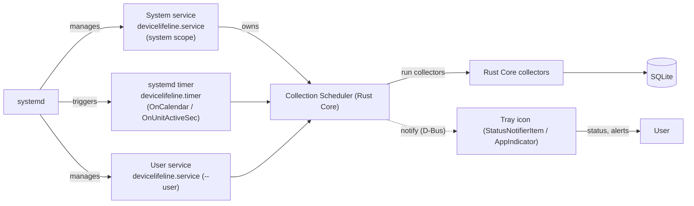
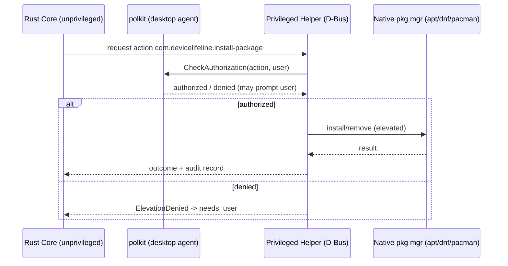
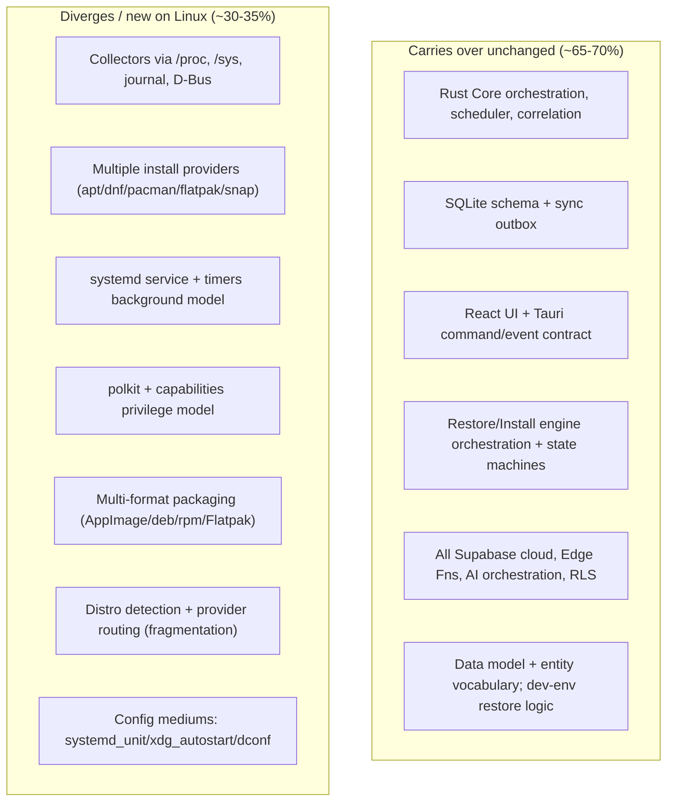

# 29. Future Linux Architecture Plan

> The **post-MVP** plan for bringing DeviceLifeline to Linux: the distro / package-manager matrix (apt, dnf, pacman + flatpak/snap), systemd for background execution, `/proc` and `sysfs` for health, packaging (AppImage / deb / rpm / Flatpak), the polkit permission model, and a carry-over vs. divergence analysis against the Rust Core with an effort estimate. Part of the DeviceLifeline documentation suite — see [Documentation Index](README.md).

**Status:** Draft v1 · **Authoring role:** Staff Systems Engineer · **Last updated:** 2026-06-07
**Related:** [27. Windows Architecture Plan](27-windows-architecture-plan.md), [28. Future macOS Architecture Plan](28-macos-architecture-plan.md), [26. Software Installation Engine Design](26-software-installation-engine-design.md), [25. Restore Engine Design](25-restore-engine-design.md), [30. System Architecture](30-system-architecture.md), [24. Device DNA Design](24-device-dna-design.md), [17. Security Requirements](17-security-requirements.md), [12. Product Roadmap](12-product-roadmap.md)

---

## 1. Purpose & Scope

> **This is a FUTURE / post-MVP plan.** Windows is DeviceLifeline's first-class V1 platform ([27. Windows Architecture Plan](27-windows-architecture-plan.md)); macOS is the next future target ([28. Future macOS Architecture Plan](28-macos-architecture-plan.md)). Linux is **not in the MVP** ([11. MVP Definition](11-mvp-definition.md)) and is generally expected to follow macOS. This document is a forward-compatibility contract so the Rust Core, data model, and cloud do not have to be re-architected to add Linux later.

This document specifies how DeviceLifeline's locked stack (Tauri shell, React UI, Rust Core, SQLite, Supabase) maps onto Linux. The defining Linux challenge is **fragmentation**: many distributions, multiple package managers, and several packaging formats. The plan addresses that explicitly with a distro/package-manager matrix, a systemd-based background model, `/proc`+`sysfs` health collection, multi-format packaging, and a polkit privilege model.

**In scope:** the distro and package-manager support matrix; Linux API/mechanism equivalents for DNA collection, Performance Timeline, Health Intelligence, and Crash Intelligence; the install/restore provider story across native + universal package managers; packaging (AppImage / deb / rpm / Flatpak); background execution via systemd; the permission model (polkit, capabilities); a carry-over vs. divergence analysis against the Rust Core; and a phased effort estimate.

**Out of scope:** the canonical data model (OS-agnostic, [33. Entity Relationship Design](33-entity-relationship-design.md)); the cloud half (identical to Windows/macOS); desktop-environment-specific UI theming beyond noting Tauri's WebKitGTK renderer; server/headless Linux fleet agents (a distinct future SKU — noted in Future Considerations).

---

## 2. Assumptions

- **A1:** Initial Linux support targets **desktop Linux** on **x86-64** (arm64 stretch), validated against a small **tier-1 distro set**: **Ubuntu/Debian (apt), Fedora (dnf), and Arch (pacman)**, plus the universal formats **Flatpak** and **Snap**.
- **A2:** The **Rust Core trait seams** (`Collector`, `InstallProvider`, `Scheduler`, `ElevationBroker`) introduced for Windows ([27](27-windows-architecture-plan.md)) and reused for macOS ([28](28-macos-architecture-plan.md)) are the same seams Linux plugs into. Linux is new implementations, not a fork.
- **A3:** **No single Linux install backend dominates** the way WinGet (Windows) or Homebrew (macOS) does. The `InstallProvider` abstraction therefore fans out to **multiple native providers** (apt/dnf/pacman) plus **universal providers** (Flatpak/Snap), selected by detected distro/runtime.
- **A4:** DeviceLifeline ships **multiple package formats** to cover fragmentation, with **Flatpak as the primary recommended channel** (sandboxed, distro-agnostic) and **AppImage** as a no-install portable fallback; native **.deb/.rpm** for users who prefer system integration.
- **A5:** All cloud behavior (Supabase, Edge Functions, AI orchestration, sync, RLS, billing) is **identical** to Windows/macOS; only the on-device half changes. AI keys never ship on-device ([17. Security Requirements](17-security-requirements.md)).
- **A6:** The canonical entities are unchanged; Linux adds new enum *values* only (e.g., `source ∈ {apt, dnf, pacman, flatpak, snap}`), never new entity shapes ([33](33-entity-relationship-design.md) Future Considerations).
- **A7:** Tauri on Linux uses **WebKitGTK** (not WebView2/WKWebView); the React UI is otherwise shared. Renderer quirks (WebKitGTK versions) are a known compatibility surface.

---

## 3. Distro & Package-Manager Matrix

Fragmentation is managed by detecting the environment at runtime and routing to the right providers.

| Distro family | Native pkg mgr | Inventory query | Install/uninstall | Service mgr | Tier |
|---|---|---|---|---|---|
| Debian / Ubuntu / Mint / Pop!_OS | **apt / dpkg** | `dpkg-query -W`, `apt list --installed` | `apt-get install/remove` (elevated) | systemd | **Tier 1** |
| Fedora / RHEL / CentOS Stream | **dnf / rpm** | `rpm -qa`, `dnf list installed` | `dnf install/remove` (elevated) | systemd | **Tier 1** |
| Arch / Manjaro / EndeavourOS | **pacman** | `pacman -Q` | `pacman -S/-R` (elevated) | systemd | **Tier 1** |
| openSUSE | zypper / rpm | `zypper se --installed-only` | `zypper in/rm` | systemd | Tier 2 |
| Any (universal) | **Flatpak** | `flatpak list` | `flatpak install/uninstall` (user-scope possible) | n/a | **Tier 1 (universal)** |
| Any (universal) | **Snap** | `snap list` | `snap install/remove` (elevated via snapd) | snapd | Tier 1 (universal) |
| Language ecosystems | npm/pip/cargo/etc. | per-tool | per-tool | n/a | Dev-env (shared logic with [25](25-restore-engine-design.md) §9) |

**Routing rule:** the Rust Core detects the distro (via `/etc/os-release`) and available managers at startup, builds the active provider set, and prefers **Flatpak** for GUI apps where available (consistency across distros) while using the **native manager** for system packages and CLI tools. Universal-format apps and native-package apps coexist in inventory with their `source` recorded for faithful restore.

---

## 4. Rust Core on Linux — Health & Collection via /proc and sysfs

Linux exposes system state primarily through the **`/proc`** and **`/sys`** pseudo-filesystems — a clean, fast, dependency-light source that maps directly onto Health Intelligence and DNA collection.

| Capability | Windows ([27](27-windows-architecture-plan.md)) | Linux source | Privilege |
|---|---|---|---|
| CPU / load / memory | PDH, WMI perf | `/proc/stat`, `/proc/meminfo`, `/proc/loadavg` | User |
| Per-process | WMI | `/proc/<pid>/*` | User (other users' detail may need root) |
| Disk / IO | PDH, WMI | `/proc/diskstats`, `/sys/block/*`, `statvfs` | User |
| SSD/HDD health (SMART) | WMI/`DeviceIoControl` | `smartctl` (smartmontools), `/sys/class/nvme` | Often elevated |
| Battery / power | `GetSystemPowerStatus` | `/sys/class/power_supply/*` | User |
| GPU | WMI | `/sys/class/drm/*`, vendor tools (`nvidia-smi`, `radeontop`) | User |
| Thermal | WMI | `/sys/class/thermal/*`, `/sys/class/hwmon/*` | User |
| Network | IP Helper | `/proc/net/*`, `/sys/class/net/*`, `rtnetlink` | User |
| Installed software | Registry, WinGet | dpkg/rpm/pacman DBs, `flatpak/snap list` | User |
| Config (services, startup) | WMI, Registry | systemd units (`systemctl`), XDG autostart (`~/.config/autostart`), shell rc files | User; system units need elevation |
| Crash / events | Event Log, WER | `journalctl` (systemd journal), `dmesg`/`/dev/kmsg`, core dumps (`/var/lib/systemd/coredump`, `coredumpctl`) | User (some need elevation) |
| Hardware topology | SetupAPI, WMI PnP | `lspci`/`lsusb`, `/sys/devices/*`, `udev` | User |
| "What changed" feed | ETW / Event Log | `fanotify`/`inotify` (file watches), `udev` events, journal | User (fanotify global needs caps) |

**Binding principles** carry over from [27 §4](27-windows-architecture-plan.md): prefer direct pseudo-filesystem reads over shelling out (use `smartctl`/`journalctl` only where no clean file interface exists), wrap calls in safe Rust adapters with explicit error→`FailureClass` mapping, and keep collectors time-boxed and cancellable ([07. Non-Functional Requirements](07-non-functional-requirements.md)). The Rust ecosystem (`procfs`, `sysinfo`, `nix`, `zbus` for D-Bus) provides the needed bindings.

---

## 5. Background Execution — systemd

Where Windows used a Service + Scheduled Task + tray ([27 §6](27-windows-architecture-plan.md)) and macOS used launchd ([28 §5](28-macos-architecture-plan.md)), Linux uses **systemd**, which provides both long-running services and timers.



- **System service** (`devicelifeline.service`) = always-available host for periodic sampling and the scheduler (analog of the Windows Service / macOS LaunchDaemon).
- **systemd timers** (`devicelifeline.timer`, `OnCalendar`/`OnUnitActiveSec`) = scheduled/interval triggers (analog of Scheduled Tasks); event-driven snapshots come from `inotify`/`udev`/journal watches → emit `TimelineEvent`.
- **User service** (`systemctl --user`) handles per-session, user-scope collection (browser, dev env, user config) without elevation.
- **Tray** via `StatusNotifierItem`/AppIndicator over D-Bus = optional user presence/notifications; not required for collection.
- **Resource governance** uses systemd's native controls (`CPUQuota=`, `IOWeight=`, `MemoryMax=`, `Nice=`) plus the same idle/battery-aware throttling intent as [07. NFR-001/002](07-non-functional-requirements.md) — a Linux advantage, since cgroup limits are first-class.

---

## 6. Permissions — polkit & Linux Capabilities

Linux's privilege story is **polkit + capabilities + (optionally) sudo**, replacing UAC ([27 §7](27-windows-architecture-plan.md)) and macOS Authorization Services ([28 §6](28-macos-architecture-plan.md)).

- **Least privilege by default**, identical principle to Windows/macOS: the continuously-running surface is unprivileged; privileged work (package installs, system-unit writes, some SMART reads) is brokered.
- **polkit** is the elevation broker analog: a small **privileged helper** registers polkit **actions** (e.g., `com.devicelifeline.install-package`) with their own authorization rules; the unprivileged core requests an action and the desktop's polkit agent prompts the user — the Linux equivalent of a batched UAC/Authorization prompt.
- **Capabilities over root:** where a specific capability suffices (e.g., `CAP_DAC_READ_SEARCH` for broad read, `CAP_NET_ADMIN`), grant the narrow capability via systemd (`AmbientCapabilities=`) instead of running as full root.
- **D-Bus** is the IPC fabric for talking to system services (systemd, NetworkManager, UPower, packagekit) and to the privileged helper — the brokered, validated, allowlisted channel from [17. Security Requirements](17-security-requirements.md).
- **PackageKit** (D-Bus) is an optional abstraction that itself fronts apt/dnf/zypper with polkit-mediated auth — usable to reduce per-manager elevation glue.



---

## 7. Packaging — AppImage / deb / rpm / Flatpak

To absorb fragmentation, DeviceLifeline ships **multiple formats**, each with trade-offs:

| Format | Built via | Pros | Cons | Role |
|---|---|---|---|---|
| **Flatpak** | `flatpak-builder` + Flathub | Distro-agnostic, sandboxed, robust runtime, easy updates | Sandbox portals restrict system inspection; needs `--filesystem`/portal grants | **Primary recommended** desktop channel |
| **AppImage** | Tauri AppImage / `appimagetool` | Single portable file, no install, runs broadly | No auto-integration; updates via AppImageUpdate; no sandbox | **No-install fallback** / trials |
| **.deb** | `cargo-deb` / Tauri | Native integration on Debian/Ubuntu; APT updates | Per-family build | Native channel (apt distros) |
| **.rpm** | `cargo-generate-rpm` / Tauri | Native integration on Fedora/RHEL | Per-family build | Native channel (dnf distros) |
| **AUR** (community) | PKGBUILD | Idiomatic on Arch | Community-maintained | Arch convenience |

- **Sandbox tension:** Flatpak's strength (sandboxing) is also the core challenge — a *system-inspection* tool must request broad portal/filesystem permissions (`--filesystem=host`, device access), which partially defeats the sandbox and prompts user trust decisions. The **.deb/.rpm** native builds avoid this for users who want full visibility with system integration; the trade-off is documented and surfaced to the user (mirrors the macOS TCC/limited-visibility pattern in [28 §6](28-macos-architecture-plan.md)).
- **Auto-update:** Flatpak/Snap update through their stores; deb/rpm via the system updater or a signed DeviceLifeline repo; AppImage via AppImageUpdate; the Tauri updater covers the AppImage/direct path. All channels verify signatures (transport TLS + package signature), consistent with [27 §8](27-windows-architecture-plan.md).
- **Signing:** GPG-signed repos/packages for deb/rpm; Flathub signing for Flatpak; the same **CI-only, HSM-held-key** discipline from [27 §10](27-windows-architecture-plan.md) and [38. DevOps Architecture](38-devops-architecture.md).

---

## 8. Install/Restore on Linux

The [Restore Engine](25-restore-engine-design.md) and [Software Installation Engine](26-software-installation-engine-design.md) orchestrators are unchanged; Linux adds providers and config mediums:

- **Native providers** — `AptProvider`, `DnfProvider`, `PacmanProvider` — each implements the existing `InstallProvider` trait ([26 §4](26-software-installation-engine-design.md)) (`resolve`/`is_installed`/`install`/`uninstall`/`classify_failure`). Elevation is brokered via polkit (§6).
- **Universal providers** — `FlatpakProvider` (user-scope installs possible → often no elevation) and `SnapProvider` (via snapd, elevated).
- **Provider selection:** the resolver gains apt/dnf/pacman/flatpak/snap columns in the ID-mapping catalog ([26 §5.1](26-software-installation-engine-design.md)); a single logical package (e.g., `vscode`) can map to a native package, a Flatpak app ID (`com.visualstudio.code`), or a Snap — chosen by the active distro/runtime. This is the **same multi-ID mechanism** that enables cross-OS restore with Windows/macOS.
- **Config mediums** shift from Windows `registry|file|env|os_setting` to **`file|env|systemd_unit|xdg_autostart|dconf`** (`dconf`/`gsettings` for GNOME app prefs) — additive enum values, same `ConfigItem` shape and `preImageRef` reversibility from [25 §7](25-restore-engine-design.md).
- **Browser-extension restore**: Chromium-family policy-based force-install ports directly (managed-policy JSON under `/etc/opt/chrome/policies` or `~/.config`); Firefox uses its policy mechanism — same handling as [25 §8](25-restore-engine-design.md).
- **Dev-environment restore** is the **most portable** part: language runtimes and global packages (npm/pip/cargo) behave almost identically across OSes ([25 §9](25-restore-engine-design.md)).

---

## 9. Carry-Over vs. Divergence Analysis



| Layer | Carries over? | Divergence detail |
|---|---|---|
| Cloud (Supabase, Edge Fns, AI, sync, RLS, billing) | ✅ 100% | None — OS-agnostic |
| Data model / entity vocabulary | ✅ 100% | Add enum values only (sources, config mediums) |
| Rust Core orchestration / engine state machines | ✅ High | New platform impls behind traits |
| React UI | ✅ High | WebKitGTK renderer quirks; tray via StatusNotifierItem |
| Collectors | ❌ Rewrite | `/proc`+`/sys`+journal+D-Bus replace WMI/PDH/Event Log |
| Install providers | ❌ Several new | Fan-out to 5 providers + distro routing (more than mac/Win) |
| Background execution | ❌ Rewrite | systemd service + timers; cgroup resource limits |
| Permissions | ❌ New | polkit + capabilities replace UAC |
| Packaging/signing | ❌ New + multiple | AppImage/deb/rpm/Flatpak vs. single MSI |

**Net:** roughly **65–70% carries over** and **100% of the cloud carries over**, slightly less reuse than macOS because of (a) the multi-provider install fan-out and (b) multi-format packaging driven by fragmentation. The trait seams (A2) again make this additive rather than a rewrite.

---

## 10. Effort Estimate (post-MVP)

Rough order-of-magnitude for a small platform team (2–3 engineers), assuming the Rust Core trait seams and the macOS port already exist (so the abstractions are battle-tested). Phasing is relative ([12. Product Roadmap](12-product-roadmap.md)).

| Phase | Scope | Est. effort |
|---|---|---|
| **M-lin.0 — Foundations** | Linux build/CI (tier-1 distro matrix), Tauri+WebKitGTK shell, AppImage build, signing/repo setup | 3–4 weeks |
| **M-lin.1 — Core collection** | DNA + Health Intelligence via `/proc`+`/sys`+D-Bus; SQLite parity; distro detection + provider routing | 6–8 weeks |
| **M-lin.2 — Install/Restore** | apt/dnf/pacman + Flatpak/Snap providers; polkit helper; config mediums (systemd/xdg/dconf) | 6–8 weeks (more providers than mac) |
| **M-lin.3 — Timeline/Crash** | Crash Intelligence via journal/coredumpctl/dmesg; Performance Timeline via diffs + inotify/udev | 4–5 weeks |
| **M-lin.4 — Packaging breadth** | deb + rpm + Flatpak (Flathub) channels, sandbox portal handling, per-channel auto-update | 4–5 weeks |
| **M-lin.5 — Hardening/Beta** | Distro-specific edge cases, capability minimization, beta across tier-1 distros | 4–5 weeks |
| **Total** | | **~7–9 calendar months** |

The dominant cost drivers are **fragmentation testing** (a real distro/version matrix in CI) and the **multi-provider install surface**, not the core collection code.

---

## Diagrams

(systemd background model §5, polkit elevation sequence §6, and carry-over/divergence map §9 are the primary diagrams.) High-level Linux component view:

```mermaid
graph TD
    subgraph "User session"
        UI["React UI (WebKitGTK)"]
        TAURI["Tauri shell (Rust)"]
        CORE["Rust Core (collectors, scheduler, engines)"]
        SQLITE[("SQLite")]
        TRAY["Tray (StatusNotifierItem)"]
    end
    subgraph "systemd-managed"
        SYS["devicelifeline.service (system)"]
        TIMER["devicelifeline.timer"]
        USR["devicelifeline.service --user"]
    end
    subgraph "Privileged (brokered)"
        HELPER["polkit privileged helper (D-Bus)"]
    end
    subgraph "Linux sources"
        PROC["/proc + /sys"]
        JRNL["journald / coredumpctl / dmesg"]
        DBUS["D-Bus (systemd, UPower, NetworkManager)"]
        PMS["apt / dnf / pacman / flatpak / snap"]
        UNITS["systemd units / dconf / xdg autostart"]
    end
    UI <--> TAURI <--> CORE
    CORE <--> SQLITE
    CORE --> TRAY
    CORE --> SYS --> TIMER
    CORE --> USR
    CORE -->|polkit action| HELPER
    CORE --> PROC & JRNL & DBUS & UNITS
    HELPER --> PMS
    CORE -->|sync (identical to Windows/macOS)| CLOUD["Supabase"]
```

---

## Risks & Mitigations

| Risk | Likelihood | Impact | Mitigation |
|---|---|---|---|
| Distro fragmentation explodes test/support cost | High | High | Constrain to a tier-1 distro set (A1); Flatpak primary for consistency; CI matrix; document unsupported distros |
| No dominant package manager → large provider surface | High | Medium | One `InstallProvider` trait, many impls; route by distro; Flatpak/Snap universal fallback |
| Flatpak sandbox blocks system inspection | High | Medium | Request needed portals/`--filesystem`; offer native deb/rpm for full visibility; surface "limited visibility" like macOS TCC |
| WebKitGTK version differences break the UI | Medium | Medium | Test across tier-1 WebKitGTK versions; pin minimum; graceful UI degradation |
| Elevation UX inconsistent across desktop polkit agents | Medium | Low | Use standard polkit actions; batch privileged ops; D-Bus brokered helper |
| Rust Core portability assumptions break on Linux | Medium | High | Trait seams enforced since V1 (A2); early stub Linux CI target |
| SMART/thermal access requires elevation on some setups | Medium | Low | Capability-scoped reads; degrade gracefully; mark metrics unavailable |
| Packaging/signing across 4 formats is error-prone | Medium | Medium | Automate every channel in CI; signed repos; per-channel verification |

---

## Future Considerations

- **Headless / server Linux fleet agent** (no Tauri UI, CLI + daemon only) for Business Edition server fleets ([57. Business Edition](57-business-edition-specification.md)) — a distinct SKU reusing the Rust Core.
- **Immutable-distro support** (Fedora Silverblue, NixOS, SteamOS) where `rpm-ostree`/Nix replace mutable package managers — new providers on the same trait.
- **Cross-OS restore** spanning Windows ↔ macOS ↔ Linux via the shared ID-mapping catalog ([26 §5.1](26-software-installation-engine-design.md)).
- **eBPF-based change tracing** as a richer "what changed" feed (analog to ETW/Endpoint Security) where kernels support it.
- **Convergence doc** with [27. Windows](27-windows-architecture-plan.md) and [28. macOS](28-macos-architecture-plan.md) to formalize the shared trait surface once all three platforms exist.

---

## Acceptance Criteria

- [ ] AC-01: This document is unambiguously labeled **post-MVP** and positions Linux after macOS.
- [ ] AC-02: A distro / package-manager matrix (§3) defines a tier-1 support set and a runtime provider-routing rule for fragmentation.
- [ ] AC-03: Health and DNA collection are specified via `/proc`, `/sys`, journald, and D-Bus, mapped from their Windows equivalents.
- [ ] AC-04: Background execution uses systemd services + timers with cgroup resource controls honoring [07](07-non-functional-requirements.md) budgets.
- [ ] AC-05: The privilege model uses polkit + capabilities (least privilege, brokered helper, D-Bus), consistent with [17](17-security-requirements.md).
- [ ] AC-06: Packaging covers AppImage, deb, rpm, and Flatpak, with the sandbox-vs-visibility trade-off documented and signed/verified updates.
- [ ] AC-07: Install providers (apt/dnf/pacman/flatpak/snap) conform to the `InstallProvider` trait in [26](26-software-installation-engine-design.md) without orchestrator changes.
- [ ] AC-08: The canonical data model is unchanged, adding only enum values (sources, config mediums), consistent with [33](33-entity-relationship-design.md).
- [ ] AC-09: A carry-over vs. divergence analysis (§9) and an effort estimate (§10) are present and contrast with the macOS plan.
- [ ] AC-10: Cloud behavior (Supabase, AI key handling, RLS, sync) is stated to be identical to Windows/macOS, with no on-device secret exposure.
