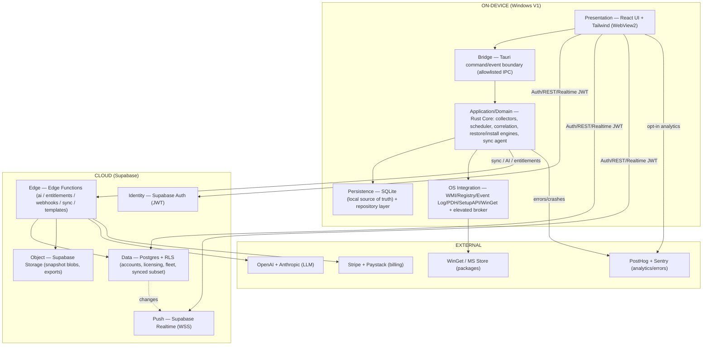
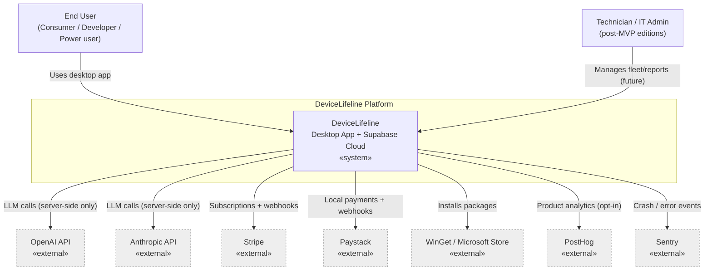
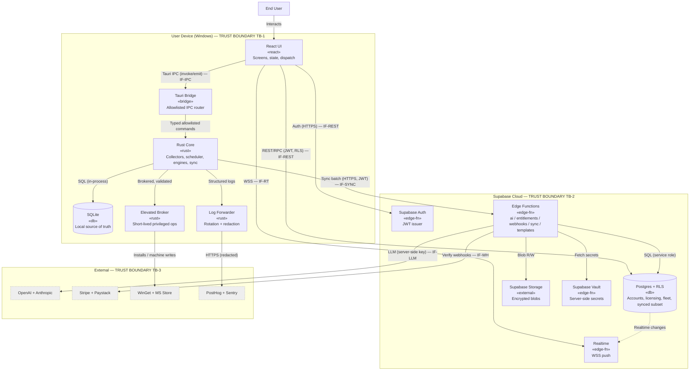
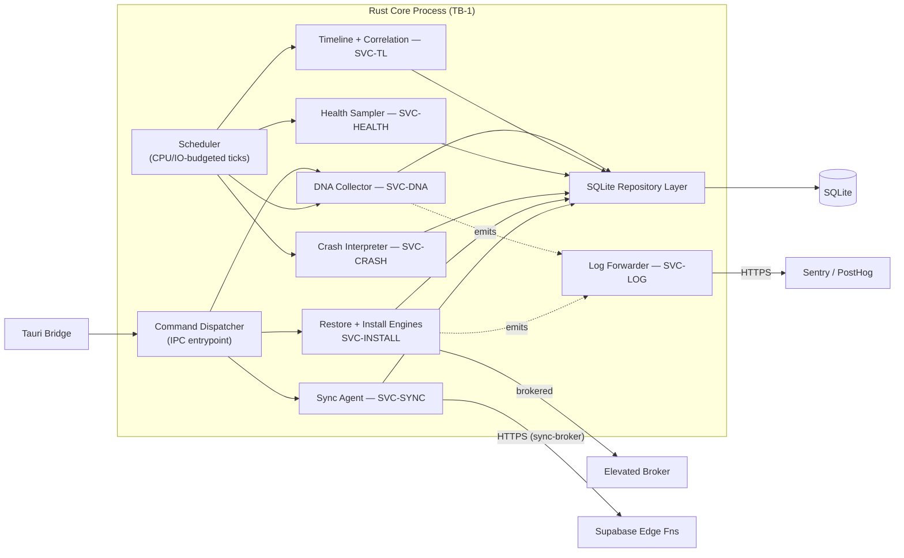
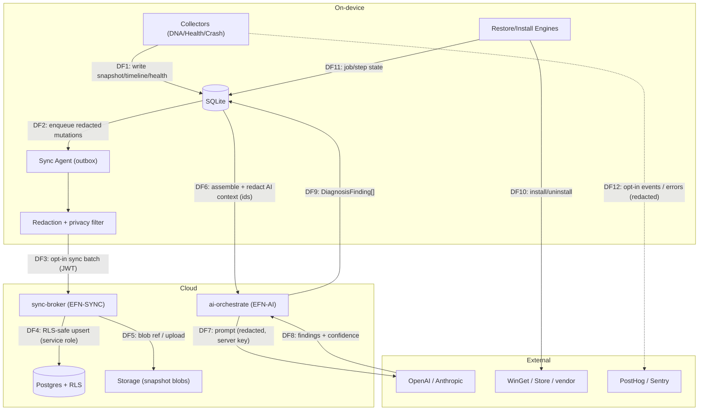
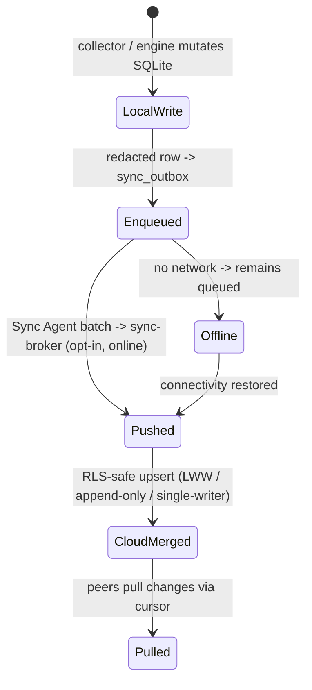
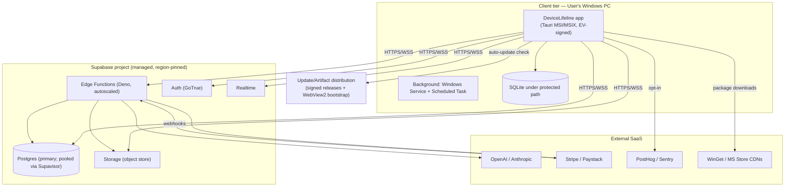

# 30. System Architecture Document

> The holistic, authoritative architecture for DeviceLifeline: the on-device half (Tauri shell + React UI + Rust Core + SQLite), the cloud half (Supabase: Postgres/Auth/Storage/Edge Functions/Realtime/RLS), and the external services (OpenAI/Anthropic, Stripe/Paystack, PostHog, Sentry, WinGet). Covers layering, the offline-first + sync model, trust boundaries, deployment topology, and key data flows, with C4-style Mermaid diagrams. Part of the DeviceLifeline documentation suite — see [Documentation Index](README.md).

**Status:** Draft v1 · **Authoring role:** Principal Software Architect · **Last updated:** 2026-06-07
**Related:** [31. Service Architecture Diagram Specification](31-service-architecture-diagram-spec.md), [32. Database Design](32-database-design.md), [33. Entity Relationship Design](33-entity-relationship-design.md), [27. Windows Architecture Plan](27-windows-architecture-plan.md), [17. Security Requirements](17-security-requirements.md), [34. API Specification](34-api-specification.md), [22. AI Diagnostics Design](22-ai-diagnostics-design.md), [21. Device Telemetry Strategy](21-device-telemetry-strategy.md)

---

## 1. Purpose & Scope

This document is the **single, narrative source of truth for DeviceLifeline's system architecture**. It explains how the locked stack fits together end to end, the layering and responsibilities of each part, the **offline-first** data philosophy and the **local↔cloud sync** model, the **trust boundaries** that keep the privileged on-device agent and the cloud safe, the **deployment topology**, and the **key data flows** that realize the product pillars (Device DNA, Performance Timeline, AI Detective, Restore).

It is the **decisions-and-rationale** companion to [31. Service Architecture Diagram Specification](31-service-architecture-diagram-spec.md): where document 31 is the *diagram contract* (the exact, maintained C4 diagrams + service inventory + interface catalog), this document **narrates the architecture and its trade-offs** and re-renders the high-level C4 views for self-containment. Physical data layout lives in [32. Database Design](32-database-design.md); the logical model in [33. Entity Relationship Design](33-entity-relationship-design.md).

**In scope:** end-to-end layering; component responsibilities; offline-first + sync; trust boundaries and the secret-handling posture; deployment topology (V1, Windows-first); the principal data flows (snapshot, timeline, health, AI diagnosis, restore, billing, telemetry); cross-platform forward-compatibility at the architecture level.

**Out of scope:** the maintained diagram governance and full service/interface registry (see [31](31-service-architecture-diagram-spec.md)); DDL, partitioning, RLS SQL, and sync wire details (see [32](32-database-design.md)); API wire formats (see [34. API Specification](34-api-specification.md)); CI/CD and infra provisioning (see [38. DevOps Architecture](38-devops-architecture.md), [39. Infrastructure Requirements](39-infrastructure-requirements.md), [40. Deployment Strategy](40-deployment-strategy.md)).

---

## 2. Assumptions

- **A1:** The locked stack is authoritative: **Tauri** shell, **React + TypeScript + Tailwind** UI, **Rust Core** agent, on-device **SQLite**, **Supabase** (Postgres/Auth/Storage/Edge Functions/Realtime/RLS), **OpenAI + Anthropic** via Edge Functions, **WinGet/Store/vendor** installs, **Stripe + Paystack** billing, **PostHog** analytics, **Sentry** errors. **Windows is first-class V1**; macOS/Linux are future ([28](28-macos-architecture-plan.md), [29](29-linux-architecture-plan.md)).
- **A2:** **SQLite on-device is the local source of truth** for device history. The app is fully functional offline; the cloud is an **opt-in mirror + coordination layer**, not a hard dependency for core local features ([32](32-database-design.md) A1).
- **A3:** **No AI key, billing secret, or service-role key ships in the client.** All privileged third-party calls are brokered by **Supabase Edge Functions** ([17. Security Requirements](17-security-requirements.md)).
- **A4:** The **Rust Core is the privileged collector/installer/scheduler**; the **React UI is an untrusted surface** reachable only through the **allowlisted Tauri command boundary** ([27](27-windows-architecture-plan.md)).
- **A5:** Identifiers are **client-generated UUID v4** so records are created offline and reconciled on sync without server round-trips ([33](33-entity-relationship-design.md) A2).
- **A6:** Tenancy is enforced in the cloud by **Row-Level Security** keyed on `account_id`, derived from the verified JWT — never from client input ([32](32-database-design.md) §RLS).
- **A7:** Telemetry is **privacy-first and opt-in**; raw `HealthSample` data never leaves the device; PII is redacted before any upload ([19. Privacy Requirements](19-privacy-requirements.md), [21. Device Telemetry Strategy](21-device-telemetry-strategy.md)).
- **A8:** Canonical service IDs (`SVC-*`, `EFN-*`, `EXT-*`, `IF-*`) and diagram IDs (`DGM-*`) are owned by [31](31-service-architecture-diagram-spec.md); this document reuses them.

---

## 3. Architectural Principles

| ID | Principle | Rationale |
|---|---|---|
| **AP-01** | **Offline-first; local is the source of truth** | The device's "operating memory" must work with no network; cloud is an opt-in projection (A2). |
| **AP-02** | **Least privilege on device; small, brokered elevated surface** | A privileged agent that touches WMI/registry/installers must minimize its attack surface ([27 §7](27-windows-architecture-plan.md)). |
| **AP-03** | **Secrets never on the client; broker via Edge Functions** | LLM/billing/service-role keys stay server-side; the client holds only a user JWT (A3). |
| **AP-04** | **Privacy by design; minimize what leaves the device** | On-device pre-processing + redaction; raw health stays local; sync is opt-in and filtered (A7). |
| **AP-05** | **Portability seam in the Rust Core** | OS-specific code lives behind traits so macOS/Linux are additive, not rewrites ([28](28-macos-architecture-plan.md), [29](29-linux-architecture-plan.md)). |
| **AP-06** | **Clear trust boundaries = clear contracts** | Each boundary (UI↔Core, Core↔Cloud, Cloud↔External) is a typed, auditable interface (§7, [34](34-api-specification.md)). |
| **AP-07** | **Eventually consistent sync with explicit conflict rules** | Distributed device data needs deterministic merge (LWW / append-only / single-writer) ([32 §7](32-database-design.md)). |
| **AP-08** | **Stateless cloud compute; state in Postgres/Storage** | Edge Functions scale horizontally; durable state is in managed Supabase services ([41. Scalability Strategy](41-scalability-strategy.md)). |

---

## 4. Layered View

DeviceLifeline is a **two-tier system** (on-device + cloud) talking to **external services**, organized into layers:

- **Presentation (React)** renders all screens, holds view state, dispatches Tauri commands, and subscribes to Core events; it talks to Supabase directly only for Auth/REST/Realtime under the user's JWT.
- **Bridge (Tauri)** is the **only** path from the untrusted UI to the privileged Core — an allowlisted `invoke`/`emit` router (AP-02, AP-06).
- **Application/Domain (Rust Core)** is the heart: it runs collectors (DNA, health, crash), derives timeline + correlations, executes the Restore/Install engines ([25](25-restore-engine-design.md), [26](26-software-installation-engine-design.md)), and runs the Sync Agent.
- **Persistence (SQLite)** is the durable local store and source of truth (AP-01); a repository layer mediates access (single writer, WAL).
- **OS Integration** is the platform-specific binding surface + the short-lived **elevated broker** for privileged ops ([27](27-windows-architecture-plan.md)).
- The **cloud layers** are managed Supabase services; **Edge Functions** are the only place privileged external calls and service-role writes happen (AP-03, AP-08).

---

## 5. Component Responsibilities (summary)

The authoritative, ID'd inventory lives in [31 §4](31-service-architecture-diagram-spec.md). Summary of the principal components:

| Component | ID ([31](31-service-architecture-diagram-spec.md)) | Responsibility |
|---|---|---|
| React UI | SVC-UI | Screens, state, dispatch Tauri commands, Supabase Auth/Realtime, opt-in PostHog |
| Tauri Bridge | SVC-BRIDGE | Allowlisted command router + event emitter (UI↔Core) |
| Rust Core Orchestrator | SVC-CORE | Lifecycle, command dispatch, scheduler tick, supervision |
| DNA Collector | SVC-DNA | Build `DeviceDNASnapshot` (software/config/browser/dev) |
| Timeline Engine | SVC-TL | Derive `TimelineEvent`s from diffs + OS events; correlations |
| Health Sampler | SVC-HEALTH | Sample metrics → `HealthSample`/`HealthScore` (raw local-only) |
| Crash Interpreter | SVC-CRASH | Parse Event Log/BSOD/crashes → `CrashEvent` |
| Install/Restore Executor | SVC-INSTALL | Run `RestoreJob`/`RestoreStep`/`InstallTask` via providers |
| Sync Agent | SVC-SYNC | Push/pull opt-in cloud subset; conflict resolution; outbox |
| Local Store | SVC-SQLITE | On-device source of truth |
| Log/Telemetry Forwarder | SVC-LOG | Structured logs; Sentry + PostHog forwarding (redacted) |
| Edge Functions | EFN-AI / EFN-LIC / EFN-STRIPE / EFN-PAYSTACK / EFN-SYNC / EFN-TPL | AI orchestration, entitlements, billing webhooks, sync broker, templates |
| Postgres + RLS | SVC-PG | Accounts, licensing, fleet, synced device subset |
| Auth / Storage / Realtime | SVC-AUTH / SVC-STORAGE / SVC-RT | Identity, blobs, push |

---

## Diagrams

The following are **C4-style** views (System Context → Container → Component) plus a data-flow diagram, re-rendered here for self-containment. They are kept consistent with the canonical set (`DGM-C1/C2/C3*`) maintained in [31 §5](31-service-architecture-diagram-spec.md).

### 6.1 C4 Level 1 — System Context

### 6.2 C4 Level 2 — Container Diagram (with trust boundaries)

> Trust boundaries **TB-1/TB-2/TB-3** align 1:1 with the container subgraphs in [31 §5.2](31-service-architecture-diagram-spec.md) and the boundaries in [17. Security Requirements](17-security-requirements.md) §4. No secret (LLM/billing/service-role) ever crosses into TB-1 (the device); the device holds only the user's JWT.

### 6.3 C4 Level 3 — Key Component View (Rust Core)

> Component views for the React UI (`DGM-C3b`) and Edge Functions (`DGM-C3c`) are maintained in [31 §5.4–§5.5](31-service-architecture-diagram-spec.md); they are referenced rather than duplicated here.

### 6.4 Data-Flow Diagram — principal flows

| Flow | What | Privacy/trust note |
|---|---|---|
| DF1 | Collectors persist snapshots/timeline/health to SQLite | Stays on device; raw health never leaves (AP-04) |
| DF2–DF5 | Opt-in sync: outbox → redaction → sync-broker → Postgres/Storage | RLS by `account_id` from JWT; PII stripped pre-upload (A6, A7) |
| DF6–DF9 | AI Detective: on-device context assembly → Edge Fn → LLM → findings | LLM key server-side only; context redacted; ids not raw PII (A3) |
| DF10–DF11 | Restore/Install execution against package sources | Brokered elevation; job state durable for resume ([25](25-restore-engine-design.md)) |
| DF12 | Telemetry/errors | Opt-in; redacted; no raw health/PII ([21](21-device-telemetry-strategy.md)) |

---

## 7. Offline-First & Sync Model

DeviceLifeline is **local-first by design** (AP-01). Every core local capability — capturing a `DeviceDNASnapshot`, building the **Performance Timeline**, sampling **Health Intelligence**, running a **Restore** — works with **no network**. The cloud adds **multi-device, fleet, sharing, server-side AI, and licensing**, but is never required for the device to function locally.

- **Source of truth:** SQLite on-device. The cloud holds a **privacy-filtered, opt-in mirror** plus cloud-authoritative data (accounts, licensing, fleet, templates).
- **Push:** every syncable mutation enqueues a **redacted** row into a `sync_outbox`; the **Sync Agent** batches and POSTs to the `sync-broker` Edge Function (`EFN-SYNC`).
- **Pull:** the Sync Agent sends per-entity cursors; the broker returns changes for cross-device/fleet data.
- **Conflict resolution** (deterministic, AP-07): **last-writer-wins** by `client_updated_at` for mutable rows; **append-only** for `TimelineEvent`/`CrashEvent`/`AuditLog` (no conflicts); **single-writer** for device-owned `RestoreJob`/`DiagnosisFinding`.
- **What never syncs:** raw `HealthSample` (only `HealthScore` rollups); secrets (none exist in snapshots); anything the user opted out of.

The full mechanism — outbox/cursor tables, payload shapes, the sync sequence, and RLS — is specified in [32. Database Design](32-database-design.md) §7–§8. Architecturally, the key property is **eventual consistency with explicit, per-entity merge rules**, so an offline device reconciles cleanly when it reconnects.

---

## 8. Trust Boundaries & Security Posture

Three boundaries structure the security model (aligned with [17. Security Requirements](17-security-requirements.md) §4 and [31 §5.2](31-service-architecture-diagram-spec.md)):

| Boundary | Separates | Key controls |
|---|---|---|
| **TB-1 (Device)** | Untrusted UI ⟷ privileged Rust Core ⟷ elevated broker | Allowlisted Tauri IPC; least-privilege Core; short-lived, signed, brokered elevation; SQLite encrypted at rest ([27](27-windows-architecture-plan.md)) |
| **TB-2 (Cloud)** | Client (user JWT) ⟷ Edge Functions / Postgres / Storage | RLS default-deny keyed on `account_id` from JWT; service-role only inside Edge Functions; secrets in Supabase Vault |
| **TB-3 (External)** | Cloud ⟷ OpenAI/Anthropic/Stripe/Paystack | Server-side keys only; signed webhooks verified; egress allowlist; never proxied through the device |

**Secret-handling invariant (AP-03):** the device holds **only the user's JWT**. LLM keys, billing secrets, and the Postgres service-role key live **exclusively** in Supabase Vault and are used **only** by Edge Functions. The AI Detective therefore works by the device assembling and **redacting** context locally (sending ids/aggregates, not raw PII), the Edge Function fetching the key server-side, calling the LLM, and returning `DiagnosisFinding`s — the device never sees the key and the LLM never sees raw PII ([22. AI Diagnostics Design](22-ai-diagnostics-design.md)).

---

## 9. Deployment Topology (V1, Windows-first)

- **Client tier:** a single signed Windows app per device (MSI/MSIX) with a background service + scheduled task ([27 §5–§6](27-windows-architecture-plan.md)); SQLite under a protected path; auto-update via signed releases ([27 §8](27-windows-architecture-plan.md)).
- **Cloud tier:** one **managed Supabase project** (region-pinned for data residency, [18. Compliance Requirements](18-compliance-requirements.md)); Postgres primary with **Supavisor pooling**; **stateless, autoscaled Edge Functions** (AP-08); Storage for snapshot blobs/exports.
- **External SaaS:** reached only as described (LLM/billing via Edge Functions; package CDNs + analytics direct from the appropriate layer).
- **Scale path:** read replicas, partition automation, and CDN/queue additions are post-MVP levers in [41. Scalability Strategy](41-scalability-strategy.md); DR in [42. Disaster Recovery Plan](42-disaster-recovery-plan.md).

---

## 10. Key Data Flows (narrative)

1. **Snapshot capture (DF1):** Scheduler triggers `SVC-DNA`; collectors read WMI/Registry/files; a `DeviceDNASnapshot` + child items is written to SQLite (immutable, content-hashed). Optionally synced (DF2–DF5).
2. **Performance Timeline:** `SVC-TL` diffs successive snapshots and ingests OS events to emit `TimelineEvent`s and **correlations** (e.g., install → startup-time regression), the product's primary differentiator ([23. Performance Timeline Design](23-performance-timeline-design.md)).
3. **Health Intelligence:** `SVC-HEALTH` samples metrics → raw `HealthSample` (local-only) → rolled up to `HealthScore` (syncable), feeding predictive alerts.
4. **AI Detective (DF6–DF9):** the Core assembles + **redacts** context; `EFN-AI` fetches the LLM key from Vault, calls OpenAI/Anthropic, returns `DiagnosisFinding`s with confidence; persisted locally ([22](22-ai-diagnostics-design.md)).
5. **Restore (DF10–DF11):** a `DeviceDNASnapshot` → `RestorePlan` → `RestoreJob`/`RestoreStep`; install steps delegate to `SVC-INSTALL`'s providers (WinGet/Store/vendor); state is durable for resume/rollback ([25](25-restore-engine-design.md), [26](26-software-installation-engine-design.md)).
6. **Billing:** the UI initiates checkout (Stripe/Paystack); provider webhooks hit `EFN-STRIPE`/`EFN-PAYSTACK`, which update `Subscription`/`LicenseSeat`; `EFN-LIC` resolves `Plan→Entitlement` and mints an entitlement claim ([14. Subscription Plans](14-subscription-plans.md)).
7. **Telemetry (DF12):** opt-in, redacted product analytics to PostHog and errors to Sentry; never raw health/PII ([21](21-device-telemetry-strategy.md)).

---

## 11. Cross-Platform Forward Compatibility

The architecture is deliberately **portable at the Core seam** (AP-05). The cloud half (Supabase, Edge Functions, AI orchestration, RLS, billing) and the data model are **100% OS-agnostic**; only the on-device collectors, install providers, background model, packaging, and permission layer change per platform. The macOS ([28](28-macos-architecture-plan.md)) and Linux ([29](29-linux-architecture-plan.md)) plans plug new implementations into the same `Collector`/`InstallProvider`/`Scheduler`/`ElevationBroker` traits — **no change to this system architecture**, the data flows, or the trust boundaries. This is why the V1 Windows build enforces those trait seams even though only Windows ships first.

---

## Risks & Mitigations

| Risk | Likelihood | Impact | Mitigation |
|---|---|---|---|
| Cloud outage breaks the app | Low | High | Offline-first (AP-01); core local features need no network; sync resumes from outbox |
| Secret leakage to the device | Low | Critical | AP-03: secrets only in Vault, only used by Edge Functions; device holds only a JWT; review gate ([17](17-security-requirements.md)) |
| Cross-account data leak via RLS misconfig | Medium | Critical | Default-deny RLS; `account_id` from JWT only; automated RLS test suite ([32 §8](32-database-design.md), [43. Testing Strategy](43-testing-strategy.md)) |
| Privileged broker abused for escalation | Low | High | Minimal allowlisted ops; validated brokered IPC; signed broker ([27 §7](27-windows-architecture-plan.md)) |
| Sync conflicts cause silent data loss | Medium | High | Per-entity merge rules (LWW/append-only/single-writer); conflict rows flagged ([32 §7](32-database-design.md)) |
| PII reaches cloud/LLM before redaction | Medium | High | Redaction at outbox-build + AI-context assembly; raw health local-only ([19](19-privacy-requirements.md)) |
| Diagrams/architecture drift from code | High | Medium | [31](31-service-architecture-diagram-spec.md) governance: PRs adding services/interfaces must update diagrams |
| Stack lock-in to Supabase | Medium | Medium | Postgres/REST/standard JWT keep portability; Edge Fns are thin brokers; documented exit options ([39](39-infrastructure-requirements.md)) |
| Rust Core accumulates Windows-isms past traits | Medium | High | Enforce portability seam (AP-05) in V1; early stub macOS/Linux CI targets |

---

## Future Considerations

- **macOS & Linux clients** as new device-tier containers sharing the cloud and Core seam ([28](28-macos-architecture-plan.md), [29](29-linux-architecture-plan.md)).
- **Mobile companion** as a thin client talking only to Supabase, no Rust Core ([59. Future Mobile App Strategy](59-future-mobile-app-strategy.md)).
- **Autonomous AI remediation agents** appearing as new Edge Functions + a Core "agent executor" component ([58. Future AI Agent Strategy](58-future-ai-agent-strategy.md)).
- **Fleet-scale read path** (read replicas, caching, queues) and partition automation as Business Edition load grows ([41. Scalability Strategy](41-scalability-strategy.md), [57. Business Edition](57-business-edition-specification.md)).
- **Self-hostable Supabase** option for enterprises with data-residency mandates ([18. Compliance Requirements](18-compliance-requirements.md)).
- **Structurizr/DSL-generated C4** if hand-maintained Mermaid outgrows the suite (with [31](31-service-architecture-diagram-spec.md) staying the rendered contract).

---

## Acceptance Criteria

- [ ] AC-01: The document presents C4-style Context (§6.1), Container (§6.2), and a key Component (§6.3) view plus a data-flow diagram (§6.4), all rendering on GitHub.
- [ ] AC-02: Layering (§4) covers presentation → bridge → domain → persistence → OS on device, and edge/data/identity/object/push in cloud.
- [ ] AC-03: The offline-first model and the local↔cloud sync (push/pull, per-entity conflict rules) are described and consistent with [32 §7–§8](32-database-design.md).
- [ ] AC-04: Trust boundaries TB-1/TB-2/TB-3 are defined and aligned with [17. Security Requirements](17-security-requirements.md) §4 and [31 §5.2](31-service-architecture-diagram-spec.md).
- [ ] AC-05: The secret-handling invariant (no LLM/billing/service-role key on the device; brokered via Edge Functions) is stated and reflected in every diagram.
- [ ] AC-06: A deployment topology (§9) for the Windows-first V1 is provided, including background execution and managed Supabase.
- [ ] AC-07: The principal data flows (snapshot, timeline, health, AI, restore, billing, telemetry) are enumerated with privacy/trust notes.
- [ ] AC-08: Service/diagram IDs reuse the canonical registry in [31](31-service-architecture-diagram-spec.md) (no conflicting names).
- [ ] AC-09: Cross-platform forward compatibility via the Rust Core trait seam is documented and tied to [28](28-macos-architecture-plan.md)/[29](29-linux-architecture-plan.md) without changing the core architecture.
- [ ] AC-10: The MVP boundary is respected; post-MVP elements (editions, macOS/Linux, fleet scale, AI agents) are labeled as future.
