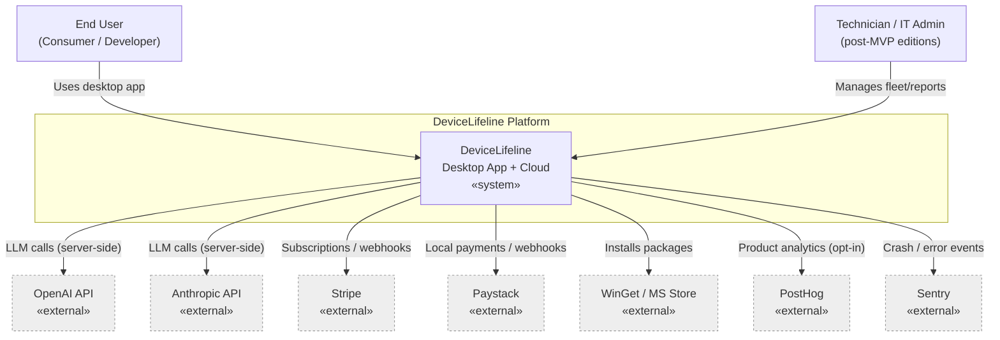
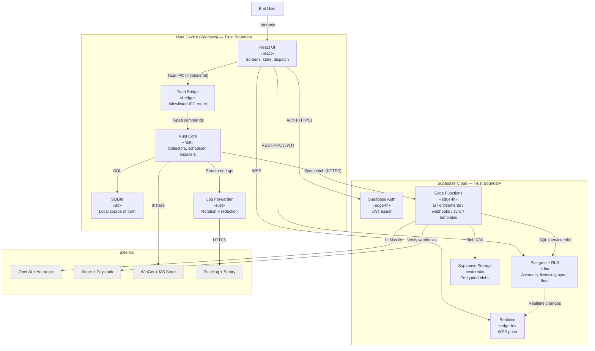
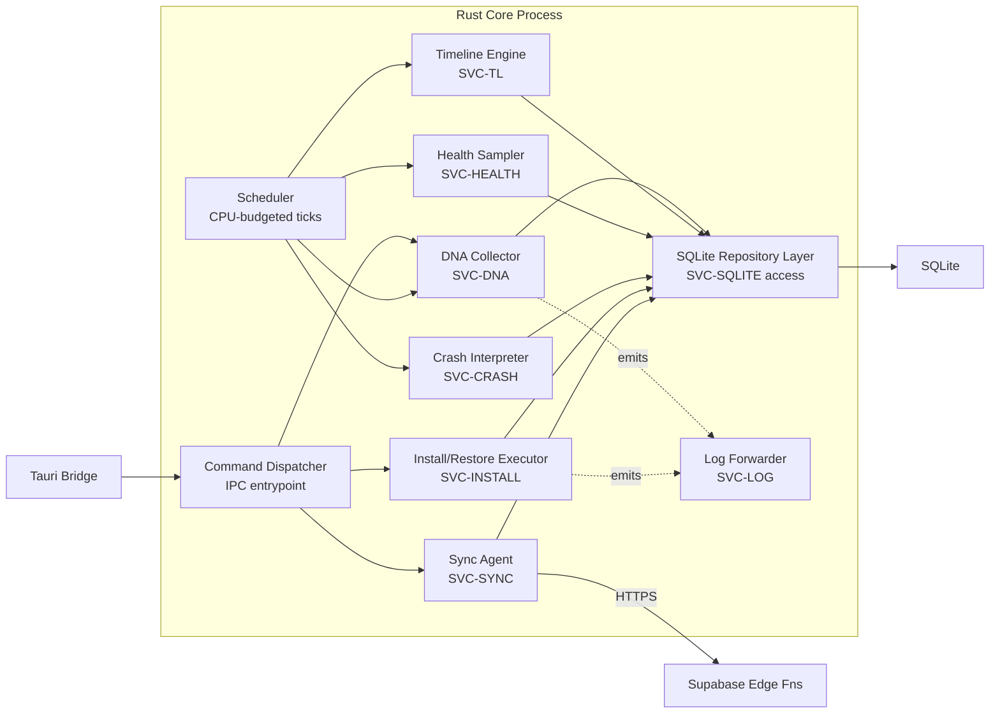
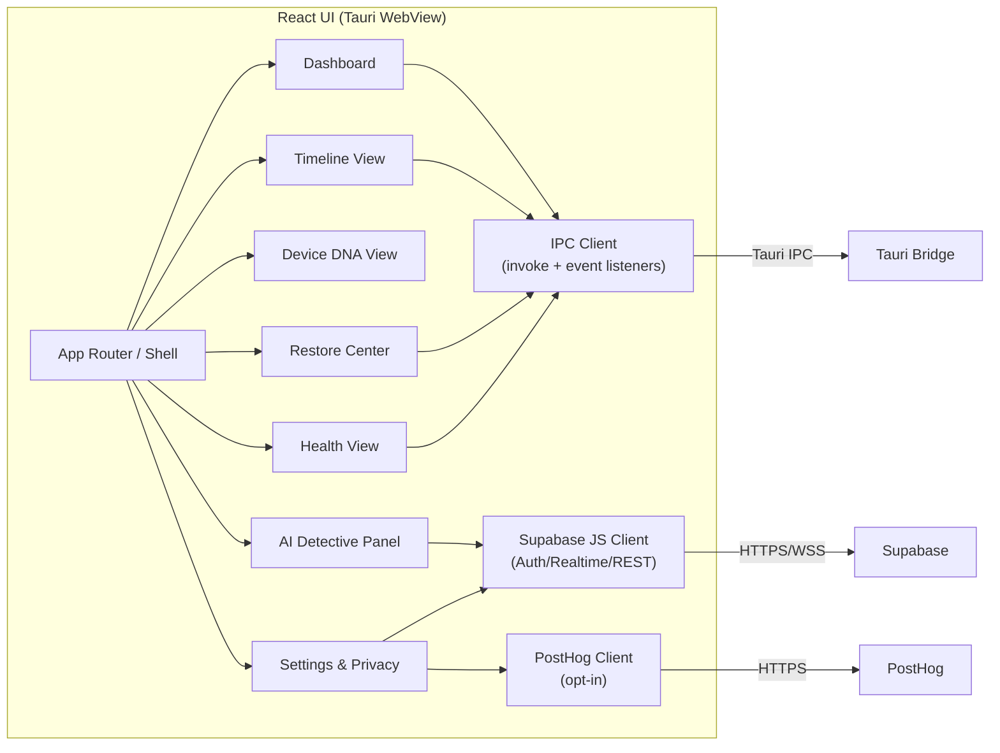
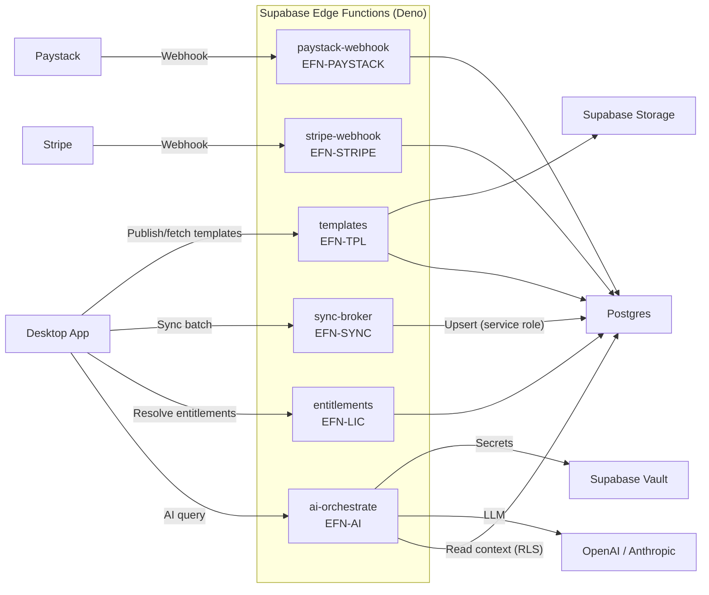
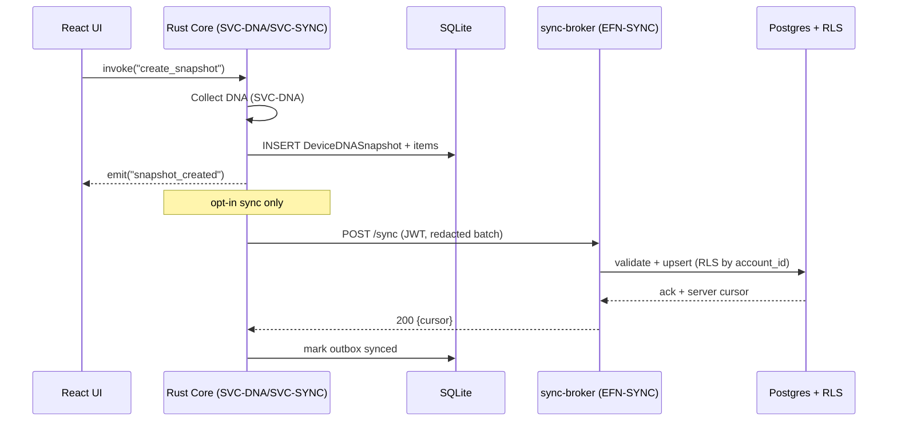
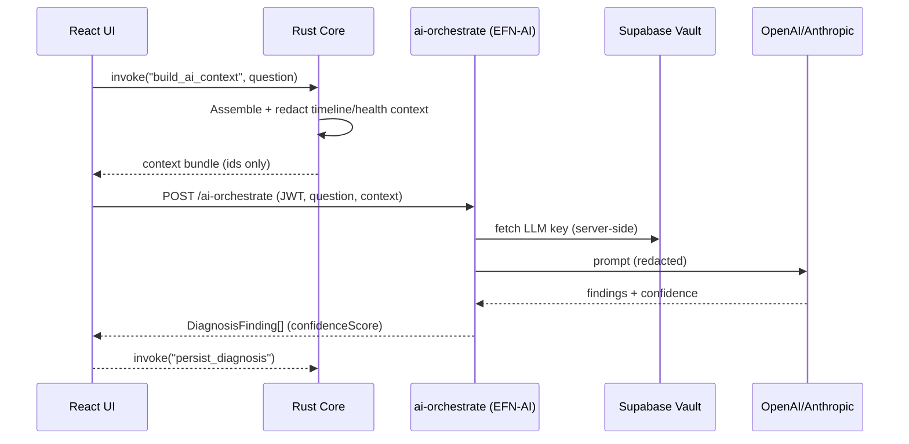

# 31. Service Architecture Diagram Specification

> The canonical set of C4 architecture diagrams (context, container, component) for DeviceLifeline, the maintained service inventory, and the responsibilities/interfaces between every on-device module, Supabase Edge Function, and external service. Part of the DeviceLifeline documentation suite — see [Documentation Index](README.md).

**Status:** Draft v1 · **Authoring role:** Principal Software Architect · **Last updated:** 2026-06-07
**Related:** [30. System Architecture](30-system-architecture.md), [32. Database Design](32-database-design.md), [34. API Specification](34-api-specification.md), [36. Logging Strategy](36-logging-strategy.md), [37. Observability Strategy](37-observability-strategy.md)

---

## 1. Purpose & Scope

This document defines the **canonical architecture diagrams** that the DeviceLifeline engineering team maintains as the visual source of truth, the conventions for keeping them in sync with the code, and the authoritative **service inventory** with each service's responsibility and interfaces.

It complements [30. System Architecture](30-system-architecture.md): where document 30 narrates the architecture decisions and trade-offs, this document is the **diagram contract** — the exact diagrams (using the C4 model: System Context → Container → Component), the elements they must contain, and the rules for evolving them.

**In scope:** C4 Level 1 (Context), Level 2 (Container), and Level 3 (Component) diagrams; the service inventory for the on-device Rust modules, the React UI, the Tauri bridge, every Supabase Edge Function, and external services; the interface catalog between services; diagram-maintenance governance. Windows V1 is first-class.

**Out of scope:** C4 Level 4 (code) diagrams (covered implicitly by [47. Coding Standards](47-coding-standards.md) and [48. Folder Structure Specification](48-folder-structure-specification.md)); deployment topology (see [40. Deployment Strategy](40-deployment-strategy.md)); the data model (see [33. Entity Relationship Design](33-entity-relationship-design.md)).

---

## 2. Assumptions

- A1: Diagrams are authored as **Mermaid in markdown** so they version alongside code and render natively on GitHub. No binary diagram files (Visio/Lucid exports) are the source of truth.
- A2: The architecture follows the **locked stack**: Tauri shell, React+TypeScript UI, Rust core agent, on-device SQLite, Supabase (Postgres/Auth/Storage/Edge Functions/Realtime/RLS), OpenAI + Anthropic via Edge Functions, Stripe + Paystack for billing, PostHog analytics, Sentry crash reporting.
- A3: **No AI API key, billing secret, or service-role key ships in the client.** All privileged third-party calls are brokered by Supabase Edge Functions.
- A4: The on-device Rust core is the **privileged collector/installer/scheduler**; the React UI is an untrusted surface reached only through the allowlisted Tauri command boundary.
- A5: SQLite is the **local source of truth** for snapshots, timeline, and health samples; Supabase mirrors a privacy-filtered, opt-in subset for cross-device and AI features.
- A6: The C4 model is the chosen diagramming framework. Each level zooms into the prior: Context (system + actors), Container (deployable/runnable units), Component (modules inside a container).
- A7: Diagrams describe **V1 plus near-term post-MVP** services; post-MVP-only services are explicitly tagged in the inventory.

---

## 3. Diagram Governance & Conventions

### 3.1 The canonical diagram set

DeviceLifeline maintains exactly these diagrams as the visual contract. Each has a stable ID.

| Diagram ID | C4 Level | Name | Lives in | Owner |
|---|---|---|---|---|
| DGM-C1 | L1 Context | System Context | this doc §5.1 | Principal Architect |
| DGM-C2 | L2 Container | Container Diagram | this doc §5.2 | Principal Architect |
| DGM-C3a | L3 Component | Rust Core component view | this doc §5.3 | Staff Backend Eng |
| DGM-C3b | L3 Component | React UI component view | this doc §5.4 | Frontend Lead |
| DGM-C3c | L3 Component | Supabase Edge Functions view | this doc §5.5 | Backend Lead |
| DGM-SEQ1 | Dynamic | Snapshot → sync sequence | this doc §5.6 | Staff Backend Eng |
| DGM-SEQ2 | Dynamic | AI Detective query sequence | this doc §5.7 | Backend Lead |

### 3.2 Conventions

- **Direction:** Context/Container use `graph TD`; component diagrams use `graph LR` when wide; dynamic views use `sequenceDiagram`.
- **Element naming:** `[Service Name\n«stereotype»\nresponsibility]`. Stereotypes: `«rust»`, `«react»`, `«edge-fn»`, `«db»`, `«external»`, `«bridge»`.
- **Edge labels** state the protocol/interface: `Tauri IPC`, `HTTPS/REST`, `HTTPS/RPC`, `WSS/Realtime`, `Webhook`, `WMI`, `SQL`.
- **Trust boundaries** are drawn as `subgraph` clusters and align 1:1 with [17. Security Requirements](17-security-requirements.md) §4.
- **Color/tag discipline:** post-MVP elements carry a `:::postmvp` class; external systems carry `:::external`.
- **Change rule:** any PR that adds a service, an Edge Function, or a cross-boundary interface MUST update the relevant diagram in the same PR (enforced in review checklist — see [45. Release Management Plan](45-release-management-plan.md)).

---

## 4. Service Inventory

### 4.1 On-device services (inside the Rust core process unless noted)

| Service ID | Service | Stereotype | Responsibility | Key interfaces |
|---|---|---|---|---|
| SVC-UI | React UI | «react» | Render all screens; dispatch Tauri commands; subscribe to events | Tauri IPC (out), Supabase JS client (Auth/Realtime), PostHog JS |
| SVC-BRIDGE | Tauri Bridge | «bridge» | Allowlisted command router + event emitter between UI and Rust | Tauri `invoke`/`emit` |
| SVC-CORE | Rust Core Orchestrator | «rust» | Process lifecycle, command dispatch, scheduler tick, service supervision | Tauri commands (in), internal module calls |
| SVC-DNA | DNA Collector | «rust» | Build a `DeviceDNASnapshot`: software inventory, config items, browser + dev environment | WMI/Win32, Registry, filesystem; writes SQLite |
| SVC-TL | Timeline Engine | «rust» | Derive `TimelineEvent`s from snapshot diffs + OS events; compute correlations | SQLite read/write; OS Event Log |
| SVC-HEALTH | Health Sampler | «rust» | Sample CPU/RAM/disk/GPU/battery/network → `HealthSample`/`HealthScore` | Perf counters, SMART; writes SQLite |
| SVC-CRASH | Crash Interpreter | «rust» | Parse Event Viewer/BSOD/driver/app crashes → `CrashEvent` | Windows Event Log; writes SQLite |
| SVC-INSTALL | Install/Restore Executor | «rust» | Run `RestoreJob`/`RestoreStep`/`InstallTask` via WinGet/MS Store/vendor | WinGet CLI, MS Store, process exec; writes SQLite |
| SVC-SYNC | Sync Agent | «rust» | Push/pull the opt-in cloud subset; conflict resolution; outbox | Supabase REST/RPC + Storage; reads/writes SQLite |
| SVC-SQLITE | Local Store | «db» | On-device source of truth (snapshots, timeline, health, jobs, outbox) | SQL (in-process) |
| SVC-LOG | Local Log/Telemetry Forwarder | «rust» | Structured logs, log rotation, Sentry + PostHog forwarding | File I/O; HTTPS to Sentry/PostHog |

### 4.2 Cloud services (Supabase)

| Service ID | Service | Stereotype | Responsibility | Key interfaces |
|---|---|---|---|---|
| SVC-AUTH | Supabase Auth | «edge-fn» | Issue/refresh JWTs; user identity | GoTrue REST; JWT |
| SVC-PG | Supabase Postgres + RLS | «db» | Cloud store: accounts, licensing, synced subset, fleet, templates | PostgREST, SQL, RLS |
| SVC-STORAGE | Supabase Storage | «external» | Encrypted snapshot blobs, support bundles, report exports | S3-style REST |
| SVC-RT | Supabase Realtime | «edge-fn» | Push fleet/job/alert changes to subscribed clients | WSS |
| EFN-AI | `ai-orchestrate` Edge Fn | «edge-fn» | Broker `DiagnosisSession` → OpenAI/Anthropic; prompt assembly, redaction | HTTPS in; OpenAI/Anthropic out |
| EFN-LIC | `entitlements` Edge Fn | «edge-fn» | Resolve `Plan`→`Entitlement`; mint entitlement JWT; seat checks | HTTPS in; SQL |
| EFN-STRIPE | `stripe-webhook` Edge Fn | «edge-fn» | Verify Stripe signature; update `Subscription`/`LicenseSeat` | Webhook in; SQL |
| EFN-PAYSTACK | `paystack-webhook` Edge Fn | «edge-fn» | Verify Paystack signature; update `Subscription` | Webhook in; SQL |
| EFN-SYNC | `sync-broker` Edge Fn | «edge-fn» | Server-side validation/merge for batched sync; RLS-safe upsert | HTTPS in; SQL |
| EFN-TPL | `templates` Edge Fn | «edge-fn» | Publish/fetch shared `EnvironmentTemplate`s (Developer/Business) | HTTPS in; SQL/Storage |

### 4.3 External services

| Service ID | Service | Used by | Purpose |
|---|---|---|---|
| EXT-OPENAI | OpenAI API | EFN-AI | LLM diagnosis/summarization/NL query |
| EXT-ANTHROPIC | Anthropic API | EFN-AI | LLM diagnosis (routing/fallback) |
| EXT-STRIPE | Stripe | EFN-STRIPE, SVC-UI | Global card subscriptions |
| EXT-PAYSTACK | Paystack | EFN-PAYSTACK, SVC-UI | Africa/local payment methods |
| EXT-WINGET | WinGet | SVC-INSTALL | Primary Windows package source |
| EXT-STORE | Microsoft Store | SVC-INSTALL | Store-app installs |
| EXT-POSTHOG | PostHog | SVC-UI, SVC-LOG | Product analytics ([35](35-event-tracking-specification.md)) |
| EXT-SENTRY | Sentry | SVC-LOG, SVC-UI, Edge Fns | Crash/error reporting ([36](36-logging-strategy.md)) |

---

## 5. Diagrams

### 5.1 DGM-C1 — System Context (C4 Level 1)

### 5.2 DGM-C2 — Container Diagram (C4 Level 2)

### 5.3 DGM-C3a — Rust Core Component View (C4 Level 3)

### 5.4 DGM-C3b — React UI Component View (C4 Level 3)

### 5.5 DGM-C3c — Supabase Edge Functions Component View (C4 Level 3)

### 5.6 DGM-SEQ1 — Snapshot → Cloud Sync (dynamic)

### 5.7 DGM-SEQ2 — AI Detective Query (dynamic)

---

## 6. Interface Catalog (cross-boundary contracts)

| Interface ID | From → To | Protocol | Contract source |
|---|---|---|---|
| IF-IPC | UI → Tauri Bridge → Rust Core | Tauri IPC (invoke/emit) | [34. API Specification](34-api-specification.md) §Tauri |
| IF-REST | UI → Supabase Postgres | HTTPS/PostgREST + JWT | [34](34-api-specification.md) §Supabase |
| IF-RPC | UI/Core → Edge Functions | HTTPS/RPC + JWT | [34](34-api-specification.md) §Edge |
| IF-RT | Supabase Realtime → UI | WSS | [34](34-api-specification.md) §Realtime |
| IF-SYNC | Core → sync-broker | HTTPS batch + JWT | [32. Database Design](32-database-design.md) §Sync |
| IF-WH | Stripe/Paystack → Edge Fns | Signed webhook | [34](34-api-specification.md) §Webhooks |
| IF-LLM | ai-orchestrate → OpenAI/Anthropic | HTTPS (server-side key) | [22. AI Diagnostics Design](22-ai-diagnostics-design.md) |
| IF-PKG | Install Executor → WinGet/Store | CLI/process | [26. Software Installation Engine Design](26-software-installation-engine-design.md) |

---

## Risks & Mitigations

| Risk | Likelihood | Impact | Mitigation |
|---|---|---|---|
| Diagrams drift from implemented architecture | High | Medium | PR review checklist requires diagram update when a service/interface changes; quarterly architecture review against DGM-C2 |
| Mermaid renders inconsistently across tools | Medium | Low | Validate in GitHub preview before merge; keep labels simple; avoid unsupported syntax |
| Component diagrams become too dense to read | Medium | Medium | Enforce one container per component diagram; split if >12 nodes |
| New Edge Function added without inventory entry | Medium | Medium | §4.2 is the registry; CI lint checks `supabase/functions/*` against the table |
| Trust boundaries in diagrams diverge from security doc | Low | High | Boundaries cross-referenced to [17](17-security-requirements.md) §4; both owned by same review gate |
| Post-MVP services blur the MVP picture | Medium | Low | Post-MVP elements tagged `:::postmvp`; MVP-only render available by removing tagged nodes |

---

## Future Considerations

- **macOS/Linux containers** ([28](28-macos-architecture-plan.md), [29](29-linux-architecture-plan.md)): add platform-specific collector components without changing the cloud container row.
- **AI Agent services** ([58. Future AI Agent Strategy](58-future-ai-agent-strategy.md)): autonomous remediation agents would appear as new Edge Functions + a Core "agent executor" component.
- **Mobile companion** ([59. Future Mobile App Strategy](59-future-mobile-app-strategy.md)): a new client container talking only to Supabase (no Rust core).
- **Structurizr/DSL export:** if the suite outgrows hand-maintained Mermaid, generate C4 diagrams from a DSL while keeping this doc as the rendered contract.
- **Auto-generated dependency graph** from the Rust workspace and `supabase/functions` to diff against DGM-C3a/c.

---

## Acceptance Criteria

- [ ] AC-01: All seven canonical diagrams (DGM-C1, C2, C3a, C3b, C3c, SEQ1, SEQ2) are present and render without error on GitHub.
- [ ] AC-02: Every service in §4 appears in at least one diagram and vice versa (no orphans).
- [ ] AC-03: Each Supabase Edge Function named in the [API Specification](34-api-specification.md) has a row in §4.2 and a node in DGM-C3c.
- [ ] AC-04: Trust-boundary subgraphs in DGM-C2 match the boundaries in [17. Security Requirements](17-security-requirements.md) §4.
- [ ] AC-05: Every cross-boundary interface in §6 cites the document that defines its contract.
- [ ] AC-06: Post-MVP services are tagged and can be visually distinguished from V1 services.
- [ ] AC-07: The diagram-change governance rule (§3.2) is referenced by the release/review process.
- [ ] AC-08: No AI key, billing secret, or service-role key is depicted as flowing to the client in any diagram.
