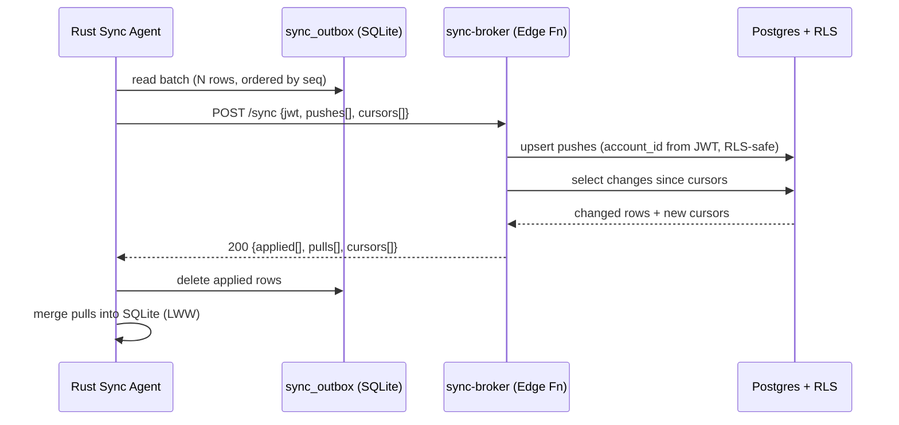
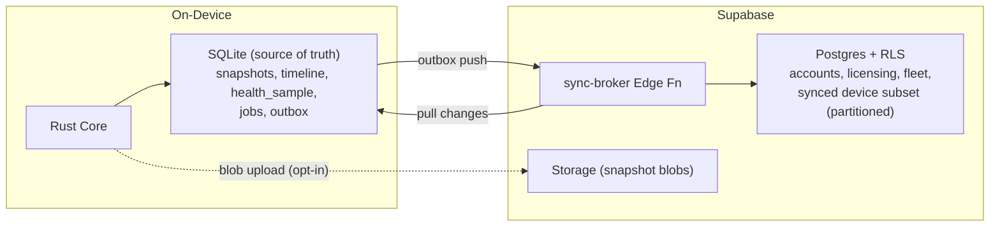
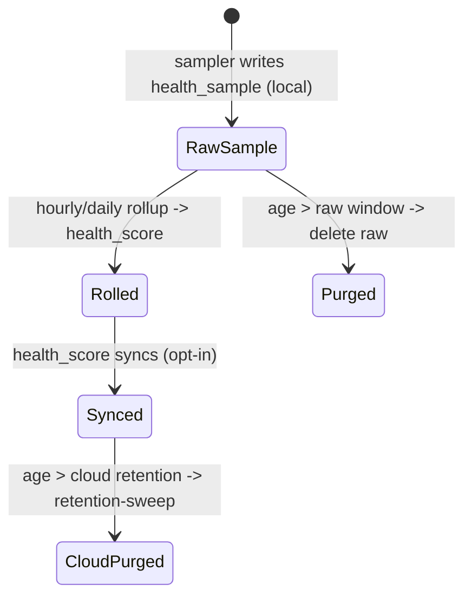

# 32. Database Design Document

> The dual-store physical database design for DeviceLifeline: the on-device SQLite schema and the cloud Supabase Postgres schema, including tables, types, keys, indexes, high-volume strategy for TimelineEvent/HealthSample, the local↔cloud sync model, Row-Level Security approach, and migration management. Part of the DeviceLifeline documentation suite — see [Documentation Index](README.md).

**Status:** Draft v1 · **Authoring role:** Data Architect + Staff Backend Engineer · **Last updated:** 2026-06-07
**Related:** [33. Entity Relationship Design](33-entity-relationship-design.md), [34. API Specification](34-api-specification.md), [17. Security Requirements](17-security-requirements.md), [20. Data Retention Policies](20-data-retention-policies.md), [30. System Architecture](30-system-architecture.md)

---

## 1. Purpose & Scope

This document specifies the **physical database design** for DeviceLifeline across its two stores: the on-device **SQLite** database (local source of truth for device history) and the cloud **Supabase Postgres** database (accounts, licensing, fleet, and the opt-in synced subset). It defines tables, column types, primary/foreign keys, indexes, the high-volume strategy for `TimelineEvent` and `HealthSample`, the local↔cloud synchronization model, the Row-Level Security (RLS) approach for per-User/Account isolation, and migration management for both stores.

It is the physical implementation of the logical model in [33. Entity Relationship Design](33-entity-relationship-design.md). Where the two differ, [33](33-entity-relationship-design.md) governs naming and [32](32-database-design.md) (this doc) governs physical layout.

**In scope:** SQLite DDL sketches, Postgres DDL sketches, indexing, partitioning/rollup/retention for high-volume tables, sync protocol and conflict resolution, RLS policy patterns, and migration tooling for V1 + near-term post-MVP.

**Out of scope:** Conceptual relationships and cardinalities (see [33](33-entity-relationship-design.md)); API wire formats (see [34](34-api-specification.md)); backup/DR specifics (see [42. Disaster Recovery Plan](42-disaster-recovery-plan.md)).

---

## 2. Assumptions

- A1: SQLite is the **local source of truth**. The app must be fully functional offline; the cloud is an opt-in mirror and coordination layer.
- A2: All identifiers are **UUID v4 stored as TEXT in SQLite** and as `uuid` in Postgres, generated client-side so records can be created offline.
- A3: Timestamps are stored as **UTC ISO-8601 TEXT in SQLite** and `timestamptz` in Postgres.
- A4: SQLite is opened with `PRAGMA journal_mode=WAL`, `foreign_keys=ON`, and `busy_timeout` set, accessed only by the Rust core (single writer, multiple readers).
- A5: SQLite at rest is encrypted via OS-level protection and/or SQLCipher; the encryption key is stored in the OS keystore (see [17](17-security-requirements.md)).
- A6: Postgres uses Supabase Auth; `auth.uid()` is available in RLS. Every tenant table carries `account_id` and, where applicable, `user_id`.
- A7: Edge Functions use the **service-role** key (bypasses RLS) only for server-validated operations (webhooks, sync merge); all client paths go through RLS-enforced PostgREST.
- A8: High-volume tables (`timeline_event`, `health_sample`) are partitioned in Postgres and pruned/rolled-up in SQLite; raw `health_sample` does not sync by default.
- A9: Migrations are forward-only and versioned; SQLite migrations run on agent start, Postgres migrations via Supabase CLI in CI ([38. DevOps Architecture](38-devops-architecture.md)).

---

## 3. Store Responsibilities

| Concern | SQLite (local) | Supabase Postgres (cloud) |
|---|---|---|
| Snapshots, inventory, config | Authoritative; full detail | Opt-in synced subset + Storage blob ref |
| Timeline events | Authoritative; full history | Synced subset; partitioned; retention-bound |
| Health samples (raw) | Authoritative; high frequency | Not synced (rollups only) |
| Health scores/alerts | Cached | Synced (drives Realtime + fleet) |
| Restore plans/jobs/steps | Authoritative for local execution | Synced for cross-device + audit |
| Accounts, users, subscriptions, seats | Read cache (entitlement JWT) | **Authoritative** |
| Fleet groups, policies, templates | Read cache | **Authoritative** |
| Audit log | Local action log | **Authoritative** append-only |

---

## 4. On-Device SQLite Schema

### 4.1 Conventions

- Table names `snake_case`, singular subject (`device`, `timeline_event`).
- Every syncable table carries: `id TEXT PK`, `updated_at TEXT`, `deleted_at TEXT NULL` (tombstone), `sync_state TEXT` (`pending|synced|conflict`), `cloud_rev INTEGER NULL`.
- `device_id` is denormalized onto child rows for fast device-scoped reads.

### 4.2 DDL sketch — core device & DNA

```sql
-- Device (one row per managed machine; usually the local machine)
CREATE TABLE device (
  id            TEXT PRIMARY KEY,           -- uuid v4
  account_id    TEXT NOT NULL,
  owner_user_id TEXT,
  fleet_group_id TEXT,
  seat_id       TEXT,
  hostname      TEXT NOT NULL,
  os            TEXT NOT NULL DEFAULT 'windows',
  os_version    TEXT NOT NULL,
  hardware_hash TEXT NOT NULL,              -- stable HW fingerprint
  last_seen_at  TEXT NOT NULL,
  updated_at    TEXT NOT NULL,
  deleted_at    TEXT,
  sync_state    TEXT NOT NULL DEFAULT 'pending'
);

CREATE TABLE device_dna_snapshot (
  id            TEXT PRIMARY KEY,
  device_id     TEXT NOT NULL REFERENCES device(id),
  taken_at      TEXT NOT NULL,
  trigger       TEXT NOT NULL CHECK (trigger IN ('scheduled','manual','pre_install','post_install')),
  schema_version INTEGER NOT NULL,
  storage_path  TEXT,                       -- Supabase Storage blob (nullable)
  content_hash  TEXT NOT NULL,              -- dedup identical snapshots
  is_baseline   INTEGER NOT NULL DEFAULT 0,
  updated_at    TEXT NOT NULL,
  deleted_at    TEXT,
  sync_state    TEXT NOT NULL DEFAULT 'pending'
);
CREATE INDEX ix_snapshot_device_time ON device_dna_snapshot(device_id, taken_at DESC);

CREATE TABLE software_inventory_item (
  id            TEXT PRIMARY KEY,
  snapshot_id   TEXT NOT NULL REFERENCES device_dna_snapshot(id),
  device_id     TEXT NOT NULL,
  name          TEXT NOT NULL,
  version       TEXT,
  publisher     TEXT,
  source        TEXT NOT NULL CHECK (source IN ('winget','msstore','vendor','unknown')),
  install_location TEXT,
  updated_at    TEXT NOT NULL
);
CREATE INDEX ix_swi_snapshot ON software_inventory_item(snapshot_id);
CREATE INDEX ix_swi_device_name ON software_inventory_item(device_id, name);

CREATE TABLE config_item (
  id            TEXT PRIMARY KEY,
  snapshot_id   TEXT NOT NULL REFERENCES device_dna_snapshot(id),
  device_id     TEXT NOT NULL,
  category      TEXT NOT NULL CHECK (category IN ('startup','service','power','network')),
  key           TEXT NOT NULL,
  value         TEXT,
  enabled       INTEGER NOT NULL DEFAULT 1,
  updated_at    TEXT NOT NULL
);
CREATE INDEX ix_config_snapshot ON config_item(snapshot_id, category);

CREATE TABLE browser_profile (
  id            TEXT PRIMARY KEY,
  snapshot_id   TEXT NOT NULL REFERENCES device_dna_snapshot(id),
  device_id     TEXT NOT NULL,
  browser       TEXT NOT NULL,
  profile_name  TEXT NOT NULL
);
CREATE TABLE browser_extension (
  id            TEXT PRIMARY KEY,
  browser_profile_id TEXT NOT NULL REFERENCES browser_profile(id),
  name          TEXT NOT NULL,
  ext_store_id  TEXT,
  version       TEXT,
  enabled       INTEGER NOT NULL DEFAULT 1
);
CREATE TABLE dev_environment_item (
  id            TEXT PRIMARY KEY,
  snapshot_id   TEXT NOT NULL REFERENCES device_dna_snapshot(id),
  device_id     TEXT NOT NULL,
  kind          TEXT NOT NULL CHECK (kind IN ('ide','sdk','language','pkg_manager','cli_tool')),
  name          TEXT NOT NULL,
  version       TEXT,
  path          TEXT
);
```

### 4.3 DDL sketch — history & health (high volume)

```sql
CREATE TABLE timeline_event (
  id            TEXT PRIMARY KEY,
  device_id     TEXT NOT NULL,
  occurred_at   TEXT NOT NULL,
  event_type    TEXT NOT NULL CHECK (event_type IN (
                  'software_install','software_removal','driver_update','os_update',
                  'startup_change','service_change','hardware_change',
                  'perf_degradation','config_change')),
  summary       TEXT NOT NULL,
  payload       TEXT,                       -- JSON
  related_software_item_id TEXT,
  correlation_id TEXT,                       -- links cause<->effect
  severity      TEXT NOT NULL DEFAULT 'info' CHECK (severity IN ('info','notice','warning')),
  updated_at    TEXT NOT NULL,
  deleted_at    TEXT,
  sync_state    TEXT NOT NULL DEFAULT 'pending'
);
CREATE INDEX ix_tl_device_time ON timeline_event(device_id, occurred_at DESC);
CREATE INDEX ix_tl_type ON timeline_event(device_id, event_type, occurred_at DESC);
CREATE INDEX ix_tl_corr ON timeline_event(correlation_id);

-- Raw, high-frequency, LOCAL ONLY (never synced)
CREATE TABLE health_sample (
  id            TEXT PRIMARY KEY,
  device_id     TEXT NOT NULL,
  sampled_at    TEXT NOT NULL,
  cpu_pct       REAL, ram_pct REAL, disk_busy_pct REAL,
  gpu_pct       REAL, battery_pct REAL, net_mbps REAL,
  temps         TEXT                        -- JSON map
);
CREATE INDEX ix_hs_device_time ON health_sample(device_id, sampled_at DESC);

-- Hourly/daily rollups (these MAY sync)
CREATE TABLE health_score (
  id            TEXT PRIMARY KEY,
  device_id     TEXT NOT NULL,
  window_start  TEXT NOT NULL,
  window_end    TEXT NOT NULL,
  subsystem     TEXT NOT NULL,              -- overall|cpu|storage|memory|gpu|battery|network
  score         INTEGER NOT NULL CHECK (score BETWEEN 0 AND 100),
  trend         TEXT NOT NULL CHECK (trend IN ('up','flat','down')),
  updated_at    TEXT NOT NULL,
  sync_state    TEXT NOT NULL DEFAULT 'pending'
);
CREATE INDEX ix_score_device_window ON health_score(device_id, subsystem, window_end DESC);

CREATE TABLE crash_event (
  id            TEXT PRIMARY KEY,
  device_id     TEXT NOT NULL,
  occurred_at   TEXT NOT NULL,
  kind          TEXT NOT NULL CHECK (kind IN ('bsod','driver','app','service')),
  code          TEXT, module TEXT,
  plain_english TEXT,
  related_event_id TEXT,
  updated_at    TEXT NOT NULL,
  sync_state    TEXT NOT NULL DEFAULT 'pending'
);
CREATE INDEX ix_crash_device_time ON crash_event(device_id, occurred_at DESC);
```

### 4.4 DDL sketch — AI & recovery + sync outbox

```sql
CREATE TABLE diagnosis_session (
  id TEXT PRIMARY KEY, device_id TEXT NOT NULL, user_id TEXT,
  question TEXT NOT NULL, model TEXT, status TEXT NOT NULL DEFAULT 'open',
  created_at TEXT NOT NULL, updated_at TEXT NOT NULL, sync_state TEXT NOT NULL DEFAULT 'pending'
);
CREATE TABLE diagnosis_finding (
  id TEXT PRIMARY KEY, session_id TEXT NOT NULL REFERENCES diagnosis_session(id),
  title TEXT NOT NULL, explanation TEXT,
  confidence_score REAL NOT NULL CHECK (confidence_score BETWEEN 0 AND 1),
  recommended_action TEXT, suggested_plan_id TEXT
);
CREATE TABLE restore_plan (
  id TEXT PRIMARY KEY, device_id TEXT, source_snapshot_id TEXT, template_id TEXT,
  name TEXT NOT NULL, kind TEXT NOT NULL CHECK (kind IN ('setup','config','environment','rollback')),
  created_by TEXT, updated_at TEXT NOT NULL, sync_state TEXT NOT NULL DEFAULT 'pending'
);
CREATE TABLE restore_job (
  id TEXT PRIMARY KEY, plan_id TEXT NOT NULL REFERENCES restore_plan(id), device_id TEXT NOT NULL,
  status TEXT NOT NULL DEFAULT 'pending', started_at TEXT, finished_at TEXT,
  updated_at TEXT NOT NULL, sync_state TEXT NOT NULL DEFAULT 'pending'
);
CREATE TABLE restore_step (
  id TEXT PRIMARY KEY, job_id TEXT NOT NULL REFERENCES restore_job(id),
  seq INTEGER NOT NULL, kind TEXT NOT NULL, status TEXT NOT NULL DEFAULT 'pending',
  install_task_id TEXT
);
CREATE TABLE install_task (
  id TEXT PRIMARY KEY, device_id TEXT NOT NULL, software_name TEXT NOT NULL,
  source TEXT NOT NULL, package_ref TEXT, action TEXT NOT NULL, status TEXT NOT NULL DEFAULT 'pending'
);
CREATE TABLE alert (
  id TEXT PRIMARY KEY, device_id TEXT NOT NULL, account_id TEXT,
  kind TEXT NOT NULL, severity TEXT NOT NULL, state TEXT NOT NULL DEFAULT 'new',
  created_at TEXT NOT NULL, updated_at TEXT NOT NULL, sync_state TEXT NOT NULL DEFAULT 'pending'
);

-- Sync outbox: every local mutation to a syncable row enqueues here
CREATE TABLE sync_outbox (
  seq           INTEGER PRIMARY KEY AUTOINCREMENT,
  entity        TEXT NOT NULL,              -- table name
  entity_id     TEXT NOT NULL,
  op            TEXT NOT NULL CHECK (op IN ('upsert','delete')),
  payload       TEXT NOT NULL,             -- redacted JSON
  enqueued_at   TEXT NOT NULL,
  attempts      INTEGER NOT NULL DEFAULT 0
);
-- Cursor of last-applied server change per entity
CREATE TABLE sync_cursor (
  entity TEXT PRIMARY KEY,
  server_cursor TEXT NOT NULL
);
```

---

## 5. Cloud Supabase Postgres Schema

### 5.1 Authoritative account/licensing tables

```sql
create table public.account (
  account_id   uuid primary key default gen_random_uuid(),
  name         text not null,
  type         text not null check (type in ('individual','technician','business')),
  owner_user_id uuid not null,
  created_at   timestamptz not null default now()
);

create table public.app_user (
  user_id    uuid primary key,             -- = auth.users.id
  account_id uuid not null references public.account(account_id),
  email      text not null,
  display_name text,
  role       text not null check (role in ('owner','admin','member','technician')),
  created_at timestamptz not null default now()
);

create table public.plan (
  plan_id uuid primary key default gen_random_uuid(),
  code    text not null unique check (code in ('free','pro','developer','technician','business')),
  name    text not null,
  billing_interval text not null check (billing_interval in ('month','year','perpetual'))
);

create table public.entitlement (
  entitlement_id uuid primary key default gen_random_uuid(),
  plan_id uuid not null references public.plan(plan_id),
  key   text not null,                      -- restore.enabled, ai.queries_per_month, ...
  value text not null,
  unique (plan_id, key)
);

create table public.subscription (
  subscription_id uuid primary key default gen_random_uuid(),
  account_id uuid not null references public.account(account_id),
  plan_id    uuid not null references public.plan(plan_id),
  provider   text not null check (provider in ('stripe','paystack')),
  provider_ref text not null,
  status     text not null check (status in ('active','past_due','canceled','trialing')),
  current_period_end timestamptz,
  created_at timestamptz not null default now()
);

create table public.license_seat (
  seat_id uuid primary key default gen_random_uuid(),
  account_id uuid not null references public.account(account_id),
  subscription_id uuid not null references public.subscription(subscription_id),
  assigned_user_id uuid,
  assigned_device_id uuid,
  status text not null check (status in ('available','assigned','revoked'))
);

create table public.fleet_group (
  fleet_group_id uuid primary key default gen_random_uuid(),
  account_id uuid not null references public.account(account_id),
  parent_group_id uuid references public.fleet_group(fleet_group_id),
  name text not null
);

create table public.policy (
  policy_id uuid primary key default gen_random_uuid(),
  account_id uuid not null references public.account(account_id),
  fleet_group_id uuid not null references public.fleet_group(fleet_group_id),
  rules jsonb not null default '{}',
  enabled boolean not null default true
);

create table public.audit_log (
  audit_id uuid primary key default gen_random_uuid(),
  account_id uuid not null references public.account(account_id),
  actor_user_id uuid,
  action text not null, target_type text, target_id text,
  created_at timestamptz not null default now()
);
```

### 5.2 Synced device-data tables (cloud mirror)

Mirror tables match the SQLite subject tables but add `account_id` for RLS and `client_updated_at`/`server_updated_at` for conflict resolution. Example for the snapshot family:

```sql
create table public.device (
  device_id uuid primary key,
  account_id uuid not null references public.account(account_id),
  owner_user_id uuid,
  fleet_group_id uuid references public.fleet_group(fleet_group_id),
  seat_id uuid,
  hostname text not null, os text not null default 'windows', os_version text not null,
  hardware_hash text not null, last_seen_at timestamptz,
  client_updated_at timestamptz not null, server_updated_at timestamptz not null default now(),
  deleted_at timestamptz
);
create index ix_device_account on public.device(account_id);

create table public.device_dna_snapshot (
  snapshot_id uuid primary key,
  device_id uuid not null references public.device(device_id),
  account_id uuid not null,
  taken_at timestamptz not null, trigger text not null,
  schema_version int not null, storage_path text, content_hash text not null,
  is_baseline boolean not null default false,
  client_updated_at timestamptz not null, server_updated_at timestamptz not null default now(),
  deleted_at timestamptz
);
create index ix_snap_account_device on public.device_dna_snapshot(account_id, device_id, taken_at desc);
```

`software_inventory_item`, `config_item`, `browser_profile`, `browser_extension`, `dev_environment_item`, `restore_plan/job/step`, `install_task`, `diagnosis_session/finding`, `health_score`, `crash_event`, and `alert` follow the same pattern (carry `account_id`, conflict timestamps, `deleted_at`).

### 5.3 EnvironmentTemplate (cloud-authoritative, shareable)

```sql
create table public.environment_template (
  template_id uuid primary key default gen_random_uuid(),
  account_id uuid not null references public.account(account_id),
  name text not null,
  kind text not null check (kind in ('developer','business')),
  definition jsonb not null,                 -- or storage_path to a blob
  visibility text not null check (visibility in ('private','account','public')),
  created_at timestamptz not null default now()
);
```

---

## 6. High-Volume Strategy: TimelineEvent & HealthSample

| Aspect | `timeline_event` | `health_sample` |
|---|---|---|
| Volume | ~tens–hundreds/day/device | ~1 sample / 15–60 s/device |
| SQLite retention | Keep full history; prune `payload` after 180 d (configurable, [20](20-data-retention-policies.md)) | Keep raw 7–30 d, then roll up to `health_score`, delete raw |
| Cloud sync | Synced subset (opt-in); partitioned | **Not synced** — only `health_score` rollups |
| Postgres partitioning | `PARTITION BY RANGE (occurred_at)` monthly | n/a (raw not stored in cloud) |
| Rollup job | n/a | Local scheduler computes hourly + daily `health_score` |

### 6.1 Postgres partitioning sketch for timeline_event

```sql
create table public.timeline_event (
  event_id uuid not null,
  device_id uuid not null,
  account_id uuid not null,
  occurred_at timestamptz not null,
  event_type text not null,
  summary text not null,
  payload jsonb,
  correlation_id text,
  severity text not null default 'info',
  client_updated_at timestamptz not null,
  server_updated_at timestamptz not null default now(),
  deleted_at timestamptz,
  primary key (event_id, occurred_at)
) partition by range (occurred_at);

-- monthly partitions created ahead of time by a scheduled job / pg_partman
create table public.timeline_event_2026_06
  partition of public.timeline_event
  for values from ('2026-06-01') to ('2026-07-01');

create index ix_tle_acct_dev_time
  on public.timeline_event (account_id, device_id, occurred_at desc);
```

### 6.2 Retention hooks

- A nightly Edge Function (`retention-sweep`, post-MVP automatable) drops timeline partitions older than the account's retention window and prunes tombstones.
- Local SQLite retention runs in the Rust scheduler; thresholds come from settings and default to [20. Data Retention Policies](20-data-retention-policies.md).
- Snapshot blobs in Storage are lifecycle-expired per the same policy; `content_hash` dedup limits storage growth.

---

## 7. Local ↔ Cloud Sync Strategy

### 7.1 Model

- **Offline-first, eventually consistent.** SQLite is authoritative for device data; the cloud mirror is a privacy-filtered, opt-in projection.
- **Push:** every syncable mutation enqueues a redacted row into `sync_outbox`. The Sync Agent batches the outbox and POSTs to the `sync-broker` Edge Function (`EFN-SYNC`).
- **Pull:** the Sync Agent sends per-entity `server_cursor` values; the broker returns rows changed since each cursor (for cross-device / fleet data).
- **Conflict resolution:** last-writer-wins by `client_updated_at`, except append-only entities (`timeline_event`, `crash_event`, `audit_log`) which are insert-only (no conflicts). Diagnosis findings and restore jobs are owned by the originating device (single-writer) to avoid merges.
- **Redaction before upload:** PII-bearing fields (paths, hostnames where opted out) are stripped/hashed per [19. Privacy Requirements](19-privacy-requirements.md); raw `health_sample` never leaves the device.

### 7.2 Sync sequence



### 7.3 Sync payload shape (illustrative)

```jsonc
{
  "device_id": "f3c1...",
  "pushes": [
    { "entity": "timeline_event", "op": "upsert",
      "row": { "event_id": "9a..", "occurred_at": "2026-06-07T10:00:00Z",
               "event_type": "software_install", "summary": "Installed Docker Desktop",
               "client_updated_at": "2026-06-07T10:00:01Z" } }
  ],
  "cursors": [ { "entity": "health_score", "server_cursor": "2026-06-06T00:00:00Z" } ]
}
```

---

## 8. Row-Level Security (RLS) Approach

### 8.1 Principles

- **Default deny:** RLS enabled on every `public` table; no table is publicly readable.
- **Tenant isolation by `account_id`:** a user can only see rows for their account. Membership is resolved from `app_user`.
- **Per-user narrowing** where required (e.g., a `member` sees only their own devices; an `owner`/`admin` sees the whole account).
- **Edge Functions** use the service-role key for server-validated writes (webhooks, sync merge) and set `account_id` explicitly from the verified JWT, never from client input.

### 8.2 Helper + policy sketch

```sql
-- Resolve the caller's account
create or replace function public.current_account_id() returns uuid
language sql stable as $$
  select account_id from public.app_user where user_id = auth.uid()
$$;

alter table public.device enable row level security;

create policy device_select on public.device
  for select using ( account_id = public.current_account_id() );

create policy device_modify on public.device
  for all using ( account_id = public.current_account_id() )
  with check ( account_id = public.current_account_id() );

-- Member-scoped read on synced device data: owners/admins see all; members see own devices
create policy snapshot_select on public.device_dna_snapshot
  for select using (
    account_id = public.current_account_id()
    and (
      exists (select 1 from public.app_user u
              where u.user_id = auth.uid() and u.role in ('owner','admin'))
      or device_id in (select device_id from public.device
                       where owner_user_id = auth.uid())
    )
  );
```

### 8.3 Coverage matrix (representative)

| Table | Read scope | Write scope |
|---|---|---|
| account, app_user | own account | owner/admin |
| subscription, license_seat | own account | service-role (webhooks) |
| device, *_snapshot, timeline_event, health_score, crash_event, alert | account; members→own devices | own account (client) / service-role (sync) |
| fleet_group, policy | own account | owner/admin |
| environment_template | account + `public` rows | creator/admin |
| audit_log | owner/admin | service-role insert only |

---

## 9. Migration Management

| Store | Tool | Trigger | Rule |
|---|---|---|---|
| SQLite | Embedded versioned migrations in Rust core (`schema_version` table) | Agent startup | Forward-only; each migration idempotent; WAL checkpoint before/after |
| Postgres | Supabase CLI migrations (`supabase/migrations/*.sql`) | CI/CD ([38](38-devops-architecture.md)) | Forward-only; reviewed; applied to staging then prod |

- **Version skew:** the Rust core declares a `min_cloud_schema` and `client_schema_version`; the sync broker rejects incompatible clients with a typed error prompting update (see [34](34-api-specification.md) error model).
- **Backfills** run as separate, resumable migration steps; large backfills on partitioned tables operate partition-by-partition.
- **Rollback:** Postgres rollbacks are forward-fix migrations (no destructive down-migrations in prod); SQLite corruptions trigger a guarded rebuild from cloud (if synced) or a fresh local DB with re-collection.

---

## Diagrams

### 10.1 Dual-store overview



### 10.2 Retention & rollup lifecycle (health)



---

## Risks & Mitigations

| Risk | Likelihood | Impact | Mitigation |
|---|---|---|---|
| SQLite corruption / data loss on device | Medium | High | WAL + integrity checks on start; guarded rebuild from cloud when synced; snapshots are immutable + hashed |
| Timeline/health volume bloats cloud cost | High | Medium | Raw health never syncs; timeline partitioned + retention sweep; opt-in sync |
| RLS misconfiguration leaks cross-account data | Medium | Critical | Default-deny; helper function pattern; automated RLS test suite ([43](43-testing-strategy.md)); no client-supplied `account_id` |
| Sync conflicts cause silent data loss | Medium | High | LWW only on mutable rows; append-only for events; single-writer for jobs/findings; conflict rows flagged `sync_state='conflict'` |
| Migration skew between client versions and cloud schema | Medium | Medium | `min_cloud_schema` negotiation; forward-only migrations; staged rollout |
| PII written to cloud before redaction | Medium | High | Redaction at outbox-build time; raw health local-only; privacy review gate ([19](19-privacy-requirements.md)) |
| Partition maintenance fails (no future partition) | Low | High | Pre-create N months ahead via scheduled job; alert if next partition missing ([37](37-observability-strategy.md)) |

---

## Future Considerations

- **pg_partman** automation for timeline partitions and detached-partition archival to cold storage.
- **CRDT-style merge** for collaboratively edited entities (e.g., shared templates) beyond LWW.
- **Columnar rollup store** (or Postgres + TimescaleDB) if cloud health analytics expand post-MVP.
- **Per-device encryption keys** and field-level encryption for the most sensitive DNA attributes.
- **macOS/Linux**: same schema; add `source`/`category` enum values; no structural change ([28](28-macos-architecture-plan.md), [29](29-linux-architecture-plan.md)).
- **Read replicas / connection pooling** (Supavisor) as fleet read load grows ([41. Scalability Strategy](41-scalability-strategy.md)).

---

## Acceptance Criteria

- [ ] AC-01: SQLite and Postgres schemas implement every entity in [33. Entity Relationship Design](33-entity-relationship-design.md) with matching names.
- [ ] AC-02: All tenant cloud tables have RLS enabled with default-deny and an `account_id` isolation policy.
- [ ] AC-03: `timeline_event` is range-partitioned by month in Postgres with a forward partition-creation mechanism.
- [ ] AC-04: Raw `health_sample` is local-only and never present in the cloud schema; only `health_score` rollups sync.
- [ ] AC-05: Every syncable table carries tombstone (`deleted_at`) and conflict timestamps; the sync outbox/cursor mechanism is defined.
- [ ] AC-06: Conflict-resolution rules are specified per entity class (LWW vs append-only vs single-writer).
- [ ] AC-07: Migrations are forward-only with a defined client/cloud schema-version negotiation.
- [ ] AC-08: No client-supplied `account_id` is trusted; Edge Functions derive it from the verified JWT.
- [ ] AC-09: Retention windows reference [20. Data Retention Policies](20-data-retention-policies.md) and are enforced in both stores.
