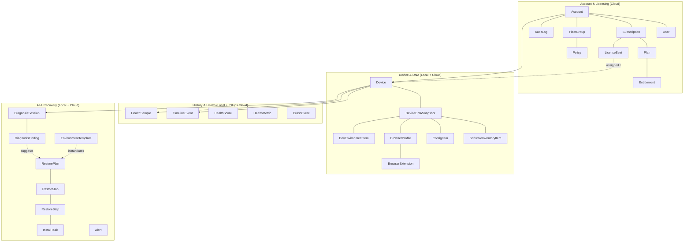
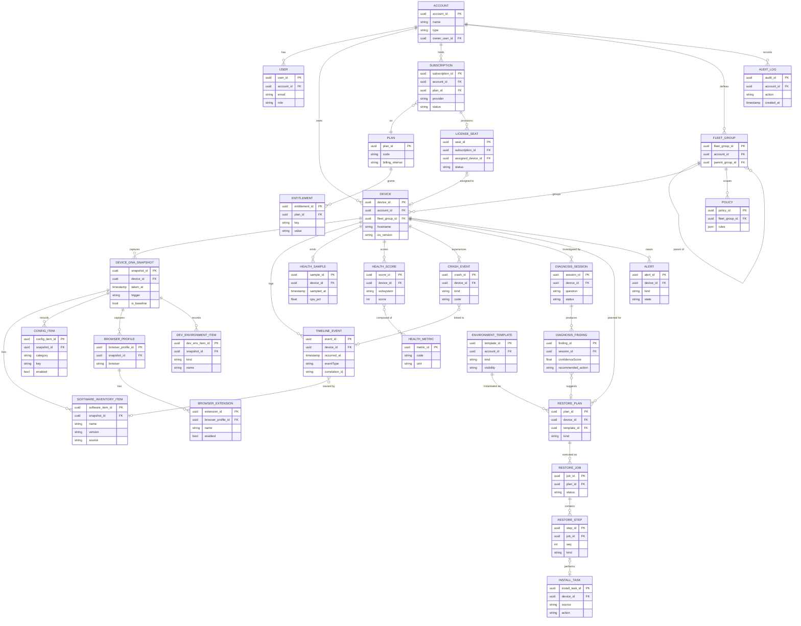
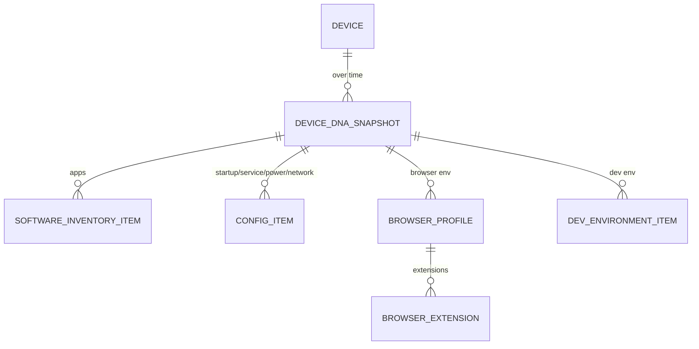

# 33. Entity Relationship Design

> The conceptual and logical data model for DeviceLifeline — every entity, its key attributes, and the relationships/cardinalities across both the on-device SQLite store and the Supabase Postgres cloud store. The centerpiece is a comprehensive Mermaid `erDiagram`. Part of the DeviceLifeline documentation suite — see [Documentation Index](README.md).

**Status:** Draft v1 · **Authoring role:** Data Architect · **Last updated:** 2026-06-07
**Related:** [32. Database Design](32-database-design.md), [34. API Specification](34-api-specification.md), [24. Device DNA Design](24-device-dna-design.md), [23. Performance Timeline Design](23-performance-timeline-design.md), [30. System Architecture](30-system-architecture.md)

---

## 1. Purpose & Scope

This document is the **logical data model of record** for DeviceLifeline. It names every entity, lists its identifying and key attributes, and defines the relationships and cardinalities between entities. It is the conceptual layer that the physical schema in [32. Database Design](32-database-design.md) implements, and the entity vocabulary that the [34. API Specification](34-api-specification.md) and the rest of the suite reuse.

Entity names here are **canonical** — other documents align to them.

**In scope:** Conceptual model (entity groups + relationships), logical model (attributes, keys, cardinalities), the residency of each entity (SQLite-local, Supabase-cloud, or both/synced), and one comprehensive ER diagram plus focused sub-diagrams.

**Out of scope:** Physical DDL, indexes, partitioning, RLS policy SQL, and migrations — all in [32. Database Design](32-database-design.md). Wire/JSON shapes are in [34](34-api-specification.md).

---

## 2. Assumptions

- A1: SQLite on-device is the **local source of truth** for device history (snapshots, timeline, health, crashes, jobs). Supabase Postgres holds cloud-authoritative data (accounts, licensing, fleet) and a privacy-filtered, opt-in mirror of device data.
- A2: Identifiers are **UUID v4** generated client-side so records can be created offline and reconciled on sync without server round-trips.
- A3: Every cloud row that belongs to a tenant carries `account_id` (and where relevant `user_id`) to drive Row-Level Security (see [32](32-database-design.md) §RLS).
- A4: A `Device` belongs to exactly one `Account`; a `User` belongs to one `Account` at a time (V1). Multi-account membership is post-MVP.
- A5: High-volume entities (`TimelineEvent`, `HealthSample`) are modeled once logically; their physical roll-up/retention strategy lives in [32](32-database-design.md).
- A6: Enumerated `TimelineEvent.eventType` values are fixed: `software_install`, `software_removal`, `driver_update`, `os_update`, `startup_change`, `service_change`, `hardware_change`, `perf_degradation`, `config_change`.
- A7: `DiagnosisFinding.confidenceScore` is a 0.0–1.0 float. AI orchestration is server-side (see [22. AI Diagnostics Design](22-ai-diagnostics-design.md)).
- A8: Soft deletes (`deleted_at`) are used for synced entities so deletions propagate; hard deletes are reserved for retention purges.

---

## 3. Entity Catalog & Residency

Residency: **L** = SQLite local only · **C** = Supabase cloud only · **L+C** = exists locally and syncs to cloud (opt-in).

### 3.1 Cloud / Account & Licensing domain

| Entity | Residency | Purpose | Key identity |
|---|---|---|---|
| User | C | A person who authenticates | `user_id` (= Supabase Auth uid) |
| Account | C | Organization/tenant owning devices, subs, seats | `account_id` |
| Subscription | C | A billing subscription (Stripe/Paystack) | `subscription_id` |
| Plan | C | A purchasable tier (Free/Pro/Developer/Technician/Business) | `plan_id` |
| Entitlement | C | A capability flag granted by a Plan | `entitlement_id` |
| LicenseSeat | C | An assignable seat consumed by a Device/User | `seat_id` |
| FleetGroup | C | A grouping of Devices (Business) | `fleet_group_id` |
| Policy | C | A rule set applied to a FleetGroup (Business) | `policy_id` |
| AuditLog | C | Append-only record of account/security actions | `audit_id` |

### 3.2 Device & DNA domain

| Entity | Residency | Purpose | Key identity |
|---|---|---|---|
| Device | L+C | A managed computer | `device_id` |
| DeviceDNASnapshot | L+C | A complete point-in-time blueprint of the device | `snapshot_id` |
| SoftwareInventoryItem | L+C | One installed app/package within a snapshot | `software_item_id` |
| ConfigItem | L+C | A startup item / service / power / network setting | `config_item_id` |
| BrowserProfile | L+C | A browser profile captured in DNA | `browser_profile_id` |
| BrowserExtension | L+C | An extension within a BrowserProfile | `extension_id` |
| DevEnvironmentItem | L+C | An IDE/SDK/language/package-manager entry | `dev_env_item_id` |

### 3.3 History & Health domain

| Entity | Residency | Purpose | Key identity |
|---|---|---|---|
| TimelineEvent | L+C | A dated, typed change/event on the device | `event_id` |
| HealthSample | L (rollups C) | A timestamped multi-metric reading | `sample_id` |
| HealthMetric | L+C | Definition/catalog of a measurable metric | `metric_id` |
| HealthScore | L+C | A derived composite/subsystem score over a window | `score_id` |
| CrashEvent | L+C | An interpreted crash/BSOD/driver/app failure | `crash_id` |

### 3.4 AI & Recovery domain

| Entity | Residency | Purpose | Key identity |
|---|---|---|---|
| DiagnosisSession | L+C | An AI Detective troubleshooting session | `session_id` |
| DiagnosisFinding | L+C | A likely-cause finding with confidenceScore | `finding_id` |
| RestorePlan | L+C | A plan to recreate a setup/state | `plan_id` |
| RestoreJob | L+C | An execution instance of a RestorePlan | `job_id` |
| RestoreStep | L+C | One ordered step within a RestoreJob | `step_id` |
| InstallTask | L+C | A package install/uninstall unit (used by steps) | `install_task_id` |
| EnvironmentTemplate | C | A shareable setup blueprint (Developer/Business) | `template_id` |
| Alert | L+C | A health/predictive/diagnosis notification | `alert_id` |

---

## 4. Key Attributes (logical)

Only identifying, foreign-key, and semantically important attributes are listed; full column types are in [32](32-database-design.md).

### 4.1 Account & licensing

- **User**: `user_id` (PK), `account_id` (FK), `email`, `display_name`, `role` (`owner|admin|member|technician`), `created_at`.
- **Account**: `account_id` (PK), `name`, `type` (`individual|technician|business`), `owner_user_id` (FK), `created_at`.
- **Subscription**: `subscription_id` (PK), `account_id` (FK), `plan_id` (FK), `provider` (`stripe|paystack`), `provider_ref`, `status` (`active|past_due|canceled|trialing`), `current_period_end`.
- **Plan**: `plan_id` (PK), `code` (`free|pro|developer|technician|business`), `name`, `billing_interval`.
- **Entitlement**: `entitlement_id` (PK), `plan_id` (FK), `key` (e.g. `restore.enabled`, `ai.queries_per_month`), `value`.
- **LicenseSeat**: `seat_id` (PK), `account_id` (FK), `subscription_id` (FK), `assigned_user_id` (FK, nullable), `assigned_device_id` (FK, nullable), `status` (`available|assigned|revoked`).
- **FleetGroup**: `fleet_group_id` (PK), `account_id` (FK), `name`, `parent_group_id` (FK, nullable, self-ref).
- **Policy**: `policy_id` (PK), `account_id` (FK), `fleet_group_id` (FK), `rules` (JSON), `enabled`.
- **AuditLog**: `audit_id` (PK), `account_id` (FK), `actor_user_id` (FK), `action`, `target_type`, `target_id`, `created_at`.

### 4.2 Device & DNA

- **Device**: `device_id` (PK), `account_id` (FK), `owner_user_id` (FK), `fleet_group_id` (FK, nullable), `seat_id` (FK, nullable), `hostname`, `os` (`windows`), `os_version`, `hardware_hash`, `last_seen_at`.
- **DeviceDNASnapshot**: `snapshot_id` (PK), `device_id` (FK), `taken_at`, `trigger` (`scheduled|manual|pre_install|post_install`), `schema_version`, `storage_path` (Supabase Storage blob, nullable), `is_baseline`.
- **SoftwareInventoryItem**: `software_item_id` (PK), `snapshot_id` (FK), `device_id` (FK), `name`, `version`, `publisher`, `source` (`winget|msstore|vendor|unknown`), `install_location`.
- **ConfigItem**: `config_item_id` (PK), `snapshot_id` (FK), `device_id` (FK), `category` (`startup|service|power|network`), `key`, `value`, `enabled`.
- **BrowserProfile**: `browser_profile_id` (PK), `snapshot_id` (FK), `device_id` (FK), `browser` (`chrome|edge|firefox|brave|other`), `profile_name`.
- **BrowserExtension**: `extension_id` (PK), `browser_profile_id` (FK), `name`, `ext_store_id`, `version`, `enabled`.
- **DevEnvironmentItem**: `dev_env_item_id` (PK), `snapshot_id` (FK), `device_id` (FK), `kind` (`ide|sdk|language|pkg_manager|cli_tool`), `name`, `version`, `path`.

### 4.3 History & health

- **TimelineEvent**: `event_id` (PK), `device_id` (FK), `occurred_at`, `eventType` (enum, A6), `summary`, `payload` (JSON), `related_software_item_id` (FK, nullable), `correlation_id` (nullable, links cause↔effect), `severity` (`info|notice|warning`).
- **HealthSample**: `sample_id` (PK), `device_id` (FK), `sampled_at`, `cpu_pct`, `ram_pct`, `disk_busy_pct`, `gpu_pct`, `battery_pct`, `net_mbps`, `temps` (JSON).
- **HealthMetric**: `metric_id` (PK), `code` (`cpu|ram|ssd_wear|hdd_health|gpu|battery_wear|net`), `unit`, `direction` (`higher_better|lower_better`).
- **HealthScore**: `score_id` (PK), `device_id` (FK), `window_start`, `window_end`, `subsystem` (`overall|cpu|storage|memory|gpu|battery|network`), `score` (0–100), `trend` (`up|flat|down`).
- **CrashEvent**: `crash_id` (PK), `device_id` (FK), `occurred_at`, `kind` (`bsod|driver|app|service`), `code`, `module`, `plain_english`, `related_event_id` (FK, nullable).

### 4.4 AI & recovery

- **DiagnosisSession**: `session_id` (PK), `device_id` (FK), `user_id` (FK), `question`, `model` (`openai|anthropic`), `status` (`open|complete|failed`), `created_at`.
- **DiagnosisFinding**: `finding_id` (PK), `session_id` (FK), `title`, `explanation`, `confidenceScore` (0.0–1.0), `recommended_action`, `suggested_plan_id` (FK → RestorePlan, nullable).
- **RestorePlan**: `plan_id` (PK), `device_id` (FK, nullable for templates), `source_snapshot_id` (FK, nullable), `template_id` (FK, nullable), `name`, `kind` (`setup|config|environment|rollback`), `created_by` (FK user).
- **RestoreJob**: `job_id` (PK), `plan_id` (FK), `device_id` (FK), `status` (`pending|running|paused|complete|failed|rolled_back`), `started_at`, `finished_at`.
- **RestoreStep**: `step_id` (PK), `job_id` (FK), `seq`, `kind` (`install|config_apply|extension|env_setup`), `status`, `install_task_id` (FK, nullable).
- **InstallTask**: `install_task_id` (PK), `device_id` (FK), `software_name`, `source` (`winget|msstore|vendor`), `package_ref`, `action` (`install|uninstall|upgrade`), `status`.
- **EnvironmentTemplate**: `template_id` (PK), `account_id` (FK), `name`, `kind` (`developer|business`), `definition` (JSON/Storage), `visibility` (`private|account|public`).
- **Alert**: `alert_id` (PK), `device_id` (FK), `account_id` (FK), `kind` (`health|predictive_failure|diagnosis|restore`), `severity` (`info|warning|critical`), `state` (`new|seen|dismissed`), `created_at`.

---

## 5. Relationship & Cardinality Summary

| Relationship | Cardinality | Notes |
|---|---|---|
| Account → User | 1 : N | A user belongs to one account (V1) |
| Account → Device | 1 : N | Device owned by exactly one account |
| Account → Subscription | 1 : N | Multiple subs possible over time |
| Subscription → Plan | N : 1 | Each sub references one plan |
| Plan → Entitlement | 1 : N | A plan grants many entitlements |
| Subscription → LicenseSeat | 1 : N | Seats provisioned by a subscription |
| LicenseSeat → Device | 0..1 : 1 | A seat may be assigned to a device |
| Account → FleetGroup | 1 : N | Business only |
| FleetGroup → FleetGroup | 1 : N | Self-referencing hierarchy |
| FleetGroup → Device | 1 : N | Devices grouped (nullable) |
| FleetGroup → Policy | 1 : N | Policies scoped to a group |
| Device → DeviceDNASnapshot | 1 : N | Many snapshots over time |
| DeviceDNASnapshot → SoftwareInventoryItem | 1 : N | Items per snapshot |
| DeviceDNASnapshot → ConfigItem | 1 : N | Config per snapshot |
| DeviceDNASnapshot → BrowserProfile | 1 : N | Profiles per snapshot |
| BrowserProfile → BrowserExtension | 1 : N | Extensions per profile |
| DeviceDNASnapshot → DevEnvironmentItem | 1 : N | Dev items per snapshot |
| Device → TimelineEvent | 1 : N | High volume |
| TimelineEvent → SoftwareInventoryItem | N : 0..1 | Optional cause link |
| TimelineEvent → TimelineEvent | N : N (via correlation_id) | Cause↔effect correlations |
| Device → HealthSample | 1 : N | Very high volume |
| Device → HealthScore | 1 : N | Windowed scores |
| HealthScore → HealthMetric | N : N | Score composed of metrics |
| Device → CrashEvent | 1 : N | |
| CrashEvent → TimelineEvent | N : 0..1 | Optional link |
| Device → DiagnosisSession | 1 : N | |
| DiagnosisSession → DiagnosisFinding | 1 : N | |
| DiagnosisFinding → RestorePlan | N : 0..1 | Suggested fix |
| Device → RestorePlan | 1 : N | |
| EnvironmentTemplate → RestorePlan | 1 : N | Template instantiated as plan |
| RestorePlan → RestoreJob | 1 : N | Re-runnable |
| RestoreJob → RestoreStep | 1 : N | Ordered steps |
| RestoreStep → InstallTask | 1 : 0..1 | Install-type steps |
| Device → Alert | 1 : N | |

---

## Diagrams

### 6.1 Conceptual domains (context map)

### 6.2 Comprehensive logical ER diagram (centerpiece)

### 6.3 Snapshot composition (focused view)

---

## 7. Modeling Notes & Decisions

- **Snapshot as aggregate root:** child items (`SoftwareInventoryItem`, `ConfigItem`, etc.) carry both `snapshot_id` and a denormalized `device_id` to support fast device-scoped queries and RLS without a join. Diffs between two snapshots generate `TimelineEvent`s rather than items being mutated in place (snapshots are immutable).
- **Correlation modeling:** `TimelineEvent.correlation_id` groups a cause (e.g., `software_install`) with its effect (`perf_degradation`), enabling the Performance Timeline narrative (see [23](23-performance-timeline-design.md)) without a heavyweight join table at MVP. A dedicated `Correlation` entity is a post-MVP refinement.
- **Health volume:** `HealthSample` is intentionally narrow and local-first; only `HealthScore` rollups sync by default to keep cloud volume bounded (physical strategy in [32](32-database-design.md)).
- **Licensing indirection:** capabilities are resolved via `Plan → Entitlement` rather than hard-coding tier checks, so plan changes don't require client releases (see [14. Subscription Plans](14-subscription-plans.md)).
- **Template vs plan:** `EnvironmentTemplate` is the shareable, account/public artifact; a `RestorePlan` is its concrete, device-targeted instantiation. This separates "what to set up" from "applying it here."
- **Soft delete + sync:** synced entities use `deleted_at` so a local deletion propagates as a tombstone; retention purges (A8) hard-delete after the window in [20. Data Retention Policies](20-data-retention-policies.md).

---

## Risks & Mitigations

| Risk | Likelihood | Impact | Mitigation |
|---|---|---|---|
| Entity names drift between this doc and [32](32-database-design.md)/[34](34-api-specification.md) | Medium | High | This doc is canonical; siblings link here; review gate checks naming |
| Snapshot child explosion bloats storage | High | Medium | Immutable snapshots + content hashing/dedup; only diffs feed timeline; retention windows |
| Correlation-via-column too weak for complex causality | Medium | Medium | Documented as MVP simplification; post-MVP `Correlation` entity planned |
| Cloud mirror leaks more PII than intended | Medium | High | L+C residency explicit per entity; opt-in sync; redaction before upload ([19](19-privacy-requirements.md)) |
| Self-referencing FleetGroup creates cycles | Low | Medium | App-level cycle check on `parent_group_id`; depth limit |
| Many-to-many HealthScore↔HealthMetric over-modeled for MVP | Low | Low | Physical join table optional; MVP may store metric breakdown as JSON |

---

## Future Considerations

- **`Correlation` entity** to replace `correlation_id` for multi-cause/multi-effect graphs and confidence-weighted edges.
- **Cross-account device transfer** (RMA, resale) with provenance retained in `AuditLog`.
- **Multi-account User membership** for MSPs managing many client accounts ([56](56-technician-edition-specification.md)).
- **Versioned `EnvironmentTemplate`** with semantic versioning and changelog.
- **macOS/Linux DNA attributes** ([28](28-macos-architecture-plan.md), [29](29-linux-architecture-plan.md)): add `source` values (`homebrew`, `apt`) without changing entity shape.

---

## Acceptance Criteria

- [ ] AC-01: Every canonical entity from the suite vocabulary appears in §3 with a residency and key identity.
- [ ] AC-02: The comprehensive `erDiagram` (§6.2) renders on GitHub and includes all entities and relationships from §5.
- [ ] AC-03: All `TimelineEvent.eventType` enum values (A6) are documented and match [23](23-performance-timeline-design.md).
- [ ] AC-04: `DiagnosisFinding` exposes `confidenceScore` as a 0.0–1.0 float.
- [ ] AC-05: Every relationship in §5 has an explicit cardinality and a corresponding edge in a diagram.
- [ ] AC-06: Residency (L / C / L+C) is defined for each entity and is consistent with the sync strategy in [32](32-database-design.md).
- [ ] AC-07: No entity name in this document conflicts with [32. Database Design](32-database-design.md) or [34. API Specification](34-api-specification.md).
- [ ] AC-08: Account/tenant-owned cloud entities carry `account_id` to enable RLS.
