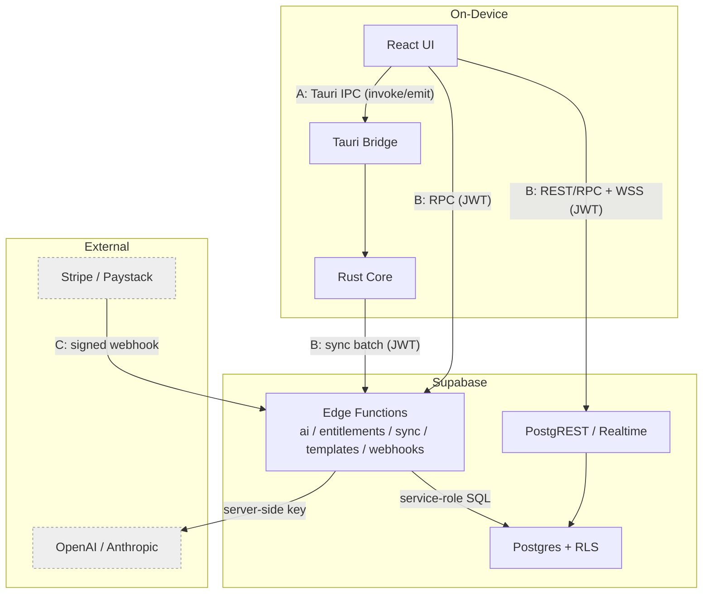
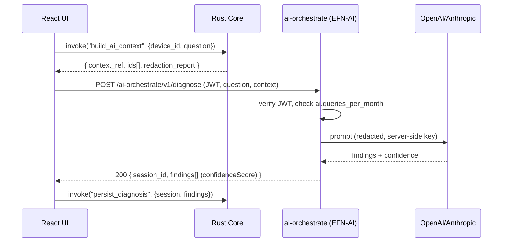
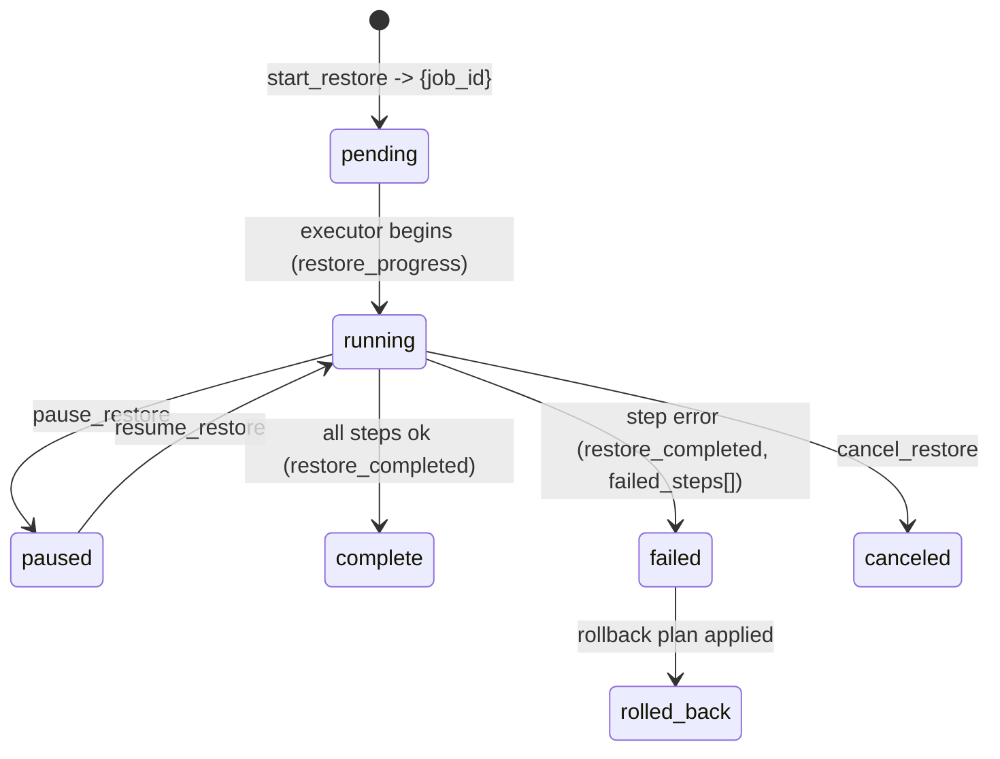

# 34. API Specification

> The contract for all three DeviceLifeline API surfaces: the on-device Tauri command/IPC API (Rust Core ↔ React), the Supabase REST/RPC + Edge Functions surface, and external inbound webhooks — including auth, error and versioning models, rate limits, and illustrative JSON request/response examples. Part of the DeviceLifeline documentation suite — see [Documentation Index](README.md).

**Status:** Draft v1 · **Authoring role:** Staff Backend Engineer + Principal Software Architect · **Last updated:** 2026-06-07
**Related:** [31. Service Architecture Diagram Spec](31-service-architecture-diagram-spec.md), [32. Database Design](32-database-design.md), [33. Entity Relationship Design](33-entity-relationship-design.md), [22. AI Diagnostics Design](22-ai-diagnostics-design.md), [17. Security Requirements](17-security-requirements.md)

---

## 1. Purpose & Scope

This document is the **interface contract of record** for DeviceLifeline. It enumerates every public surface, the operations on each, their parameters and returns, the auth model, the error model, versioning, and rate limits, with illustrative JSON shapes. It is the implementation reference for the front-end (React), the Rust core, and the Supabase Edge Functions, and it reuses the canonical entity vocabulary defined in [33. Entity Relationship Design](33-entity-relationship-design.md).

DeviceLifeline exposes **three distinct API surfaces**:

1. **Tauri command/IPC API** — typed, in-process commands and events between the React UI and the Rust Core. Never leaves the device. (§4)
2. **Supabase surface** — PostgREST REST/RPC over the cloud Postgres plus the named Edge Functions (AI orchestration, entitlements, billing webhooks, sync, templates). (§5)
3. **External inbound webhooks** — signed callbacks from Stripe and Paystack delivered to Edge Functions. (§6)

**In scope:** Operation catalogs, params/returns, auth, errors, versioning, rate limits, and illustrative request/response JSON for V1 plus near-term post-MVP. Contracts are **illustrative, not full implementations** — no application source code.

**Out of scope:** Physical schema (see [32. Database Design](32-database-design.md)); the sync conflict-resolution algorithm internals (see [32](32-database-design.md) §7); prompt construction for the LLM (see [22. AI Diagnostics Design](22-ai-diagnostics-design.md)); the diagram contract (see [31. Service Architecture Diagram Spec](31-service-architecture-diagram-spec.md)).

---

## 2. Assumptions

- A1: The **Rust Core** is the only privileged process. The React UI reaches native capability **exclusively** through the allowlisted Tauri command boundary; there is no other path to the OS, SQLite, or installers.
- A2: All cloud calls carry a **Supabase Auth JWT**. The UI talks to PostgREST/Realtime directly with the user's JWT; privileged third-party calls (LLM, billing) are brokered server-side by Edge Functions (no secrets on device — see [17. Security Requirements](17-security-requirements.md)).
- A3: Edge Functions derive `account_id`/`user_id` from the **verified JWT**, never from client-supplied body fields. Webhook handlers verify a provider signature before any write.
- A4: All identifiers are **UUID v4** generated client-side (offline-first, per [33](33-entity-relationship-design.md) A2). Timestamps are UTC ISO-8601.
- A5: REST data access is RLS-enforced PostgREST; the **service-role key** is used only inside server-validated Edge Functions (webhooks, sync merge).
- A6: A `correlation_id` (a request/trace id) is threaded across the IPC + cloud boundary for logging (see [36. Logging Strategy](36-logging-strategy.md)); it is distinct from `TimelineEvent.correlation_id` (a cause↔effect link).
- A7: Capability gating is by **Entitlement** (resolved `Plan → Entitlement`), not by hard-coded tier checks, so plan changes need no client release ([33](33-entity-relationship-design.md) §7).
- A8: Versioning, error shape, and rate limits below are uniform across surfaces unless a surface explicitly overrides them.

---

## 3. Cross-Cutting Conventions

### 3.1 Auth model

| Surface | Caller | Credential | Enforcement |
|---|---|---|---|
| Tauri IPC | React UI | None (in-process); commands are allowlisted in `tauri.conf.json` | Rust core validates args + entitlement cache; OS-privileged ops gated by capability |
| Supabase REST/RPC | React UI | User JWT (`Authorization: Bearer <jwt>`) | Row-Level Security ([32](32-database-design.md) §8) |
| Edge Functions (client-facing) | UI or Rust Core | User JWT | Function verifies JWT, resolves `account_id`, checks entitlement |
| Edge Functions (webhooks) | Stripe/Paystack | Provider HMAC signature header | Signature verify before processing; no JWT |
| Sync broker | Rust Core (Sync Agent) | User JWT + device assertion | JWT → `account_id`; device must belong to account |

JWTs are short-lived access tokens with refresh handled by the Supabase JS client. The Rust core obtains a token for sync via the UI session (passed across IPC) and refreshes through the Edge boundary; tokens are held in memory only.

### 3.2 Error model (uniform envelope)

All cloud responses (REST custom RPC, Edge Functions) and all Tauri command failures use a single typed error envelope:

```jsonc
{
  "error": {
    "code": "entitlement_required",      // stable machine code (snake_case)
    "message": "Restore is not available on the Free plan.",
    "domain": "licensing",                // licensing|auth|validation|sync|ai|install|internal
    "retryable": false,
    "correlation_id": "req_01HZX...",     // echoes the request trace id
    "details": { "required_entitlement": "restore.enabled" }
  }
}
```

Canonical error codes (representative):

| Code | HTTP (cloud) | Domain | Meaning |
|---|---|---|---|
| `unauthorized` | 401 | auth | Missing/invalid/expired JWT |
| `forbidden_rls` | 403 | auth | RLS denied (cross-account access) |
| `entitlement_required` | 402 | licensing | Plan lacks the capability |
| `rate_limited` | 429 | * | Quota exceeded; see `Retry-After` |
| `validation_failed` | 422 | validation | Bad/missing params (`details.fields`) |
| `schema_incompatible` | 409 | sync | Client/cloud schema skew ([32](32-database-design.md) §9) |
| `conflict` | 409 | sync | Concurrent write rejected |
| `ai_upstream_error` | 502 | ai | OpenAI/Anthropic failure/timeout |
| `install_source_unavailable` | n/a (IPC) | install | WinGet/Store not reachable |
| `internal_error` | 500 | internal | Unexpected; logged to Sentry |

For Tauri commands, the same envelope is returned as the `Err` payload of the command result; `retryable` and `correlation_id` are always present.

### 3.3 Versioning

| Surface | Version mechanism | Policy |
|---|---|---|
| Tauri IPC | `api_version` field in `app_info` + per-command `since` tag | Additive within a major; breaking change bumps major + migration ([45. Release Management Plan](45-release-management-plan.md)) |
| Supabase REST | PostgREST schema is versioned by DB migrations ([32](32-database-design.md) §9) | Views provide a stable façade; columns are additive |
| Edge Functions | Path prefix `/<fn>/v1/...`; `X-DL-Api-Version` response header | New major = new path segment; old kept for one deprecation window |
| Webhooks | Provider-defined event versions pinned in dashboard | Handler tolerant of unknown fields |

Clients send `X-DL-Client-Version` (app semver) and `X-DL-Schema-Version` (local SQLite schema) so the sync broker can negotiate compatibility.

### 3.4 Rate limits

| Surface / operation | Limit | Window | On exceed |
|---|---|---|---|
| REST/RPC (per user) | 120 req | 1 min | `429 rate_limited`, `Retry-After` |
| `ai-orchestrate` (per user) | Entitlement-driven (`ai.queries_per_month`); + 10/min burst | month + 1 min | `402 entitlement_required` or `429` |
| `sync-broker` (per device) | 1 batch / 10 s steady; bursts coalesced | rolling | `429`; client backs off (exp. + jitter) |
| Webhooks (per provider) | Provider-controlled; idempotent on retry | n/a | Dedup by event id |
| Tauri commands | No network limit; long ops are async + progress events | n/a | n/a |

---

## 4. Surface A — Tauri Command / IPC API (Rust Core ↔ React)

### 4.1 Shape

- **Commands** are request/response: the UI calls `invoke("command_name", args)` and awaits `Result<T, ApiError>`.
- **Events** are fire-and-forget pushes from the Rust core to the UI via `emit`/`listen` (progress, completion, alerts).
- Args/returns are typed (TypeScript on the UI, `serde` structs in Rust). Long-running work returns a job id immediately and streams progress events.
- Every command is **allowlisted**; unknown commands are rejected at the bridge.

### 4.2 Command catalog

| Command | Params (shape) | Returns | Emits | Notes |
|---|---|---|---|---|
| `app_info` | — | `{ app_version, api_version, os, schema_version }` | — | Handshake |
| `get_settings` / `update_settings` | `Settings` partial | `Settings` | `settings_changed` | Privacy/opt-in flags ([19. Privacy Requirements](19-privacy-requirements.md)) |
| `create_snapshot` | `{ trigger }` | `{ snapshot_id }` | `snapshot_progress`, `snapshot_created` | Builds a `DeviceDNASnapshot` |
| `list_snapshots` | `{ device_id?, limit, cursor? }` | `Page<SnapshotSummary>` | — | Newest-first |
| `get_snapshot` | `{ snapshot_id }` | `DeviceDNASnapshot` (+ items) | — | Full DNA detail |
| `diff_snapshots` | `{ from_id, to_id }` | `SnapshotDiff` | — | Drives timeline/restore |
| `get_timeline` | `{ device_id, from?, to?, types?[], cursor? }` | `Page<TimelineEvent>` | — | Filter by `eventType` |
| `get_correlations` | `{ event_id }` | `TimelineEvent[]` | — | Cause↔effect via `correlation_id` |
| `get_health_scores` | `{ device_id, subsystem?, window }` | `HealthScore[]` | `health_alert` | Rollups, not raw samples |
| `get_health_series` | `{ device_id, metric, from, to }` | `HealthSample[]` (downsampled) | — | Local-only data |
| `list_crashes` | `{ device_id, from?, cursor? }` | `Page<CrashEvent>` | — | Plain-English crash log |
| `build_ai_context` | `{ device_id, question }` | `{ context_ref, redaction_report }` | — | Assembles + redacts; ids only |
| `persist_diagnosis` | `{ session, findings[] }` | `{ session_id }` | — | Stores AI result locally |
| `create_restore_plan` | `{ source_snapshot_id?, template_id?, kind, name }` | `{ plan_id }` | — | See [25. Restore Engine Design](25-restore-engine-design.md) |
| `start_restore` | `{ plan_id }` | `{ job_id }` | `restore_progress`, `restore_step`, `restore_completed` | Long-running |
| `pause_restore` / `resume_restore` / `cancel_restore` | `{ job_id }` | `{ status }` | `restore_progress` | Control |
| `run_install_task` | `{ software_name, source, package_ref, action }` | `{ install_task_id }` | `install_progress`, `install_completed` | WinGet/Store/vendor ([26](26-software-installation-engine-design.md)) |
| `export_setup` | `{ snapshot_id, target }` | `{ artifact_path }` | `export_completed` | Setup export |
| `trigger_sync` | `{ reason? }` | `{ queued: bool }` | `sync_state_changed` | Manual sync nudge |
| `get_sync_status` | — | `{ pending, last_synced_at, conflicts }` | `sync_state_changed` | Outbox view |
| `open_support_bundle` | `{ redact: bool }` | `{ bundle_path }` | — | Debug bundle ([36](36-logging-strategy.md)) |

### 4.3 Event catalog

| Event | Payload (shape) | Emitted by | Purpose |
|---|---|---|---|
| `snapshot_progress` | `{ snapshot_id, phase, pct }` | DNA Collector | UI progress |
| `snapshot_created` | `{ snapshot_id, taken_at }` | DNA Collector | Refresh views |
| `restore_progress` | `{ job_id, pct, current_step }` | Install/Restore Executor | Progress bar |
| `restore_step` | `{ job_id, step_id, status }` | Executor | Per-step status |
| `restore_completed` | `{ job_id, status, failed_steps[] }` | Executor | Final state |
| `install_progress` / `install_completed` | `{ install_task_id, status, message }` | Executor | Package status |
| `health_alert` | `{ alert_id, kind, severity, summary }` | Health Sampler | Surface `Alert` |
| `sync_state_changed` | `{ pending, conflicts, last_synced_at }` | Sync Agent | Sync indicator |
| `settings_changed` | `Settings` | Core | React to opt-in toggles |

### 4.4 Illustrative IPC examples

`invoke("create_snapshot", { trigger: "manual" })` →

```jsonc
{ "snapshot_id": "8f1c2a4e-3b77-4e90-9d11-0a2b3c4d5e6f" }
```

then events:

```jsonc
// emit "snapshot_progress"
{ "snapshot_id": "8f1c...", "phase": "software_inventory", "pct": 45 }
// emit "snapshot_created"
{ "snapshot_id": "8f1c...", "taken_at": "2026-06-07T10:00:00Z" }
```

`invoke("get_timeline", { device_id: "f3c1...", types: ["software_install","perf_degradation"], cursor: null })` →

```jsonc
{
  "items": [
    { "event_id": "9a..", "occurred_at": "2026-06-07T09:58:00Z",
      "eventType": "software_install", "summary": "Installed Docker Desktop",
      "severity": "info", "correlation_id": "corr_77" },
    { "event_id": "9b..", "occurred_at": "2026-06-08T08:10:00Z",
      "eventType": "perf_degradation", "summary": "Startup time +35%",
      "severity": "warning", "correlation_id": "corr_77" }
  ],
  "next_cursor": "eyJvIjoiMjAyNi0wNi0wOCJ9"
}
```

A failure (`start_restore` on Free) returns the `Err` envelope:

```jsonc
{ "error": { "code": "entitlement_required", "domain": "licensing",
  "message": "Setup Restore requires Pro.", "retryable": false,
  "correlation_id": "req_01HZX...", "details": { "required_entitlement": "restore.enabled" } } }
```

---

## 5. Surface B — Supabase REST/RPC + Edge Functions

### 5.1 REST (PostgREST over cloud Postgres)

The UI reads/writes the **cloud-authoritative** tables (accounts, subscriptions, fleet, templates) and the synced device mirror directly via PostgREST with the user JWT; RLS scopes every row to the caller's account ([32](32-database-design.md) §8). Device data is **written via the sync broker**, not by direct REST writes, so the device remains the source of truth.

| Resource (table/view) | Methods | Notes |
|---|---|---|
| `app_user`, `account` | GET, PATCH | Self/account; owner/admin for writes |
| `subscription`, `license_seat` | GET | Read-only to client; mutated by webhooks |
| `fleet_group`, `policy` | GET, POST, PATCH, DELETE | Business; owner/admin |
| `environment_template` | GET, POST, PATCH, DELETE | Developer/Business; `visibility` rules |
| `device`, `device_dna_snapshot`, `timeline_event`, `health_score`, `crash_event`, `alert` (mirror) | GET | Read for cross-device/fleet UI; writes via `sync-broker` |

Example (read fleet devices):

```http
GET /rest/v1/device?select=device_id,hostname,last_seen_at&fleet_group_id=eq.<uuid>&order=last_seen_at.desc
Authorization: Bearer <jwt>
apikey: <anon_key>
```

```jsonc
[ { "device_id": "f3c1...", "hostname": "WIN-DEV-01", "last_seen_at": "2026-06-07T09:00:00Z" } ]
```

### 5.2 Edge Functions catalog

Each Edge Function is versioned under `/<fn>/v1`. IDs match [31. Service Architecture Diagram Spec](31-service-architecture-diagram-spec.md) §4.2.

| Function (ID) | Route | Auth | Purpose |
|---|---|---|---|
| `ai-orchestrate` (EFN-AI) | `POST /ai-orchestrate/v1/diagnose` | JWT + entitlement | Broker `DiagnosisSession` → OpenAI/Anthropic, return `DiagnosisFinding[]` |
| `entitlements` (EFN-LIC) | `POST /entitlements/v1/resolve` | JWT | Resolve `Plan → Entitlement`; mint entitlement claims; seat check |
| `stripe-webhook` (EFN-STRIPE) | `POST /stripe-webhook/v1` | Stripe signature | Update `Subscription`/`LicenseSeat` |
| `paystack-webhook` (EFN-PAYSTACK) | `POST /paystack-webhook/v1` | Paystack signature | Update `Subscription` |
| `sync-broker` (EFN-SYNC) | `POST /sync-broker/v1/batch` | JWT + device | Validate + merge batched device sync (service-role upsert) |
| `templates` (EFN-TPL) | `GET/POST /templates/v1` | JWT + entitlement | Publish/fetch shared `EnvironmentTemplate` |

### 5.3 `ai-orchestrate` — request/response

```http
POST /ai-orchestrate/v1/diagnose
Authorization: Bearer <jwt>
X-DL-Client-Version: 1.0.0
Content-Type: application/json
```

```jsonc
{
  "device_id": "f3c1...",
  "question": "Why is my PC slow since last week?",
  "context": {
    "context_ref": "ctx_2026-06-07_001",       // from build_ai_context (ids only)
    "timeline_event_ids": ["9a..", "9b.."],
    "health_score_ids": ["hs_overall_2026w23"],
    "crash_event_ids": []
  },
  "model_preference": "auto"                      // auto|openai|anthropic
}
```

Success `200`:

```jsonc
{
  "session_id": "sess_4d2...",
  "model": "anthropic",
  "findings": [
    {
      "finding_id": "find_01",
      "title": "Docker background services increasing startup load",
      "explanation": "Docker Desktop was installed 2026-06-07; startup time rose 35% the next day...",
      "confidenceScore": 0.82,
      "recommended_action": "Disable Docker autostart or create a rollback RestorePlan.",
      "suggested_plan_id": null
    }
  ],
  "usage": { "tokens_in": 1840, "tokens_out": 260, "quota_remaining": 47 }
}
```

Quota exceeded `402`:

```jsonc
{ "error": { "code": "entitlement_required", "domain": "licensing",
  "message": "Monthly AI Detective limit reached on your plan.",
  "retryable": false, "correlation_id": "req_01J0A...",
  "details": { "required_entitlement": "ai.queries_per_month", "reset_at": "2026-07-01T00:00:00Z" } } }
```

### 5.4 `entitlements` — resolve

```http
POST /entitlements/v1/resolve
Authorization: Bearer <jwt>
```

```jsonc
// response
{
  "account_id": "acc_9b...",
  "plan_code": "pro",
  "entitlements": {
    "restore.enabled": "true",
    "timeline.enabled": "true",
    "ai.queries_per_month": "50",
    "health.advanced": "true",
    "fleet.max_devices": "1"
  },
  "seats": { "total": 1, "assigned": 1 },
  "expires_at": "2026-07-07T00:00:00Z"
}
```

### 5.5 `sync-broker` — batch

```http
POST /sync-broker/v1/batch
Authorization: Bearer <jwt>
X-DL-Schema-Version: 7
```

```jsonc
{
  "device_id": "f3c1...",
  "pushes": [
    { "entity": "timeline_event", "op": "upsert",
      "row": { "event_id": "9a..", "occurred_at": "2026-06-07T10:00:00Z",
               "event_type": "software_install", "summary": "Installed Docker Desktop",
               "client_updated_at": "2026-06-07T10:00:01Z" } }
  ],
  "cursors": [ { "entity": "health_score", "server_cursor": "2026-06-06T00:00:00Z" } ]
}
```

Success `200`:

```jsonc
{
  "applied": [ { "entity": "timeline_event", "id": "9a..", "result": "upserted" } ],
  "pulls": [ { "entity": "policy", "op": "upsert", "row": { "policy_id": "pol_1", "rules": {} } } ],
  "cursors": [ { "entity": "health_score", "server_cursor": "2026-06-07T00:00:00Z" },
               { "entity": "policy", "server_cursor": "2026-06-07T10:05:00Z" } ]
}
```

Schema skew `409`:

```jsonc
{ "error": { "code": "schema_incompatible", "domain": "sync",
  "message": "Client schema 7 is below the minimum supported (8). Please update.",
  "retryable": false, "correlation_id": "req_01J0B...",
  "details": { "client_schema": 7, "min_supported": 8 } } }
```

### 5.6 `templates` — publish/fetch

```http
POST /templates/v1
Authorization: Bearer <jwt>
```

```jsonc
{ "name": "Frontend Dev Workstation", "kind": "developer",
  "visibility": "account", "definition": { "apps": ["winget://Microsoft.VisualStudioCode"], "..." : "..." } }
```

```jsonc
// 201
{ "template_id": "tpl_77...", "visibility": "account", "created_at": "2026-06-07T11:00:00Z" }
```

### 5.7 Realtime

The UI subscribes via WSS to row changes on RLS-scoped tables (`alert`, `restore_job`, `health_score`, fleet `device`) to drive live dashboards. Channel auth uses the same JWT; RLS applies to broadcast payloads.

```jsonc
// subscribe (Supabase JS, illustrative)
{ "schema": "public", "table": "alert", "event": "INSERT", "filter": "account_id=eq.<uuid>" }
```

---

## 6. Surface C — External Inbound Webhooks

### 6.1 General rules

- **Verify first:** the handler verifies the provider signature (`Stripe-Signature` / `x-paystack-signature`) against the endpoint secret **before** parsing the body. Unverified requests get `400` with no side effects.
- **Idempotent:** every event id is recorded; replays are acknowledged with `200` and no duplicate writes.
- **Fast ack:** the handler validates, enqueues durable work, and returns `2xx` quickly so the provider does not retry.
- **Service-role writes:** subscription/seat mutations use the service-role key inside the function; `account_id` is resolved from the stored provider customer mapping.

### 6.2 Stripe events handled

| Event | Effect |
|---|---|
| `checkout.session.completed` | Create/activate `Subscription`; provision `LicenseSeat`(s) |
| `customer.subscription.updated` | Update `status`, `current_period_end`, plan changes |
| `customer.subscription.deleted` | Set `status='canceled'`; revoke seats |
| `invoice.payment_failed` | Set `status='past_due'`; trigger dunning ([54. Support Operations Plan](54-support-operations-plan.md)) |

Illustrative inbound body (trimmed):

```jsonc
{
  "id": "evt_1P...",
  "type": "checkout.session.completed",
  "data": { "object": { "id": "cs_...", "customer": "cus_...",
            "subscription": "sub_...", "metadata": { "account_id": "acc_9b..." } } }
}
```

Handler response: `200 { "received": true }` (or `400 { "error": { "code": "validation_failed", "domain": "validation", ... } }` on bad signature).

### 6.3 Paystack events handled

| Event | Effect |
|---|---|
| `charge.success` | Activate/renew `Subscription` (provider `paystack`) |
| `subscription.create` | Link Paystack subscription to `Account` |
| `subscription.disable` | Set `status='canceled'` |
| `invoice.payment_failed` | Set `status='past_due'` |

---

## 7. Diagrams

### 7.1 Three surfaces overview



### 7.2 AI Detective request sequence (Surface A + B)



### 7.3 Restore command lifecycle (Surface A events)



---

## 8. Risks & Mitigations

| Risk | Likelihood | Impact | Mitigation |
|---|---|---|---|
| UI gains an unsanctioned path to OS/SQLite outside the command allowlist | Low | Critical | Tauri allowlist is explicit; no `fs`/`shell` granted to UI; review gate on `tauri.conf.json` ([17](17-security-requirements.md)) |
| Client supplies `account_id` to escalate access | Medium | Critical | Edge Functions ignore body `account_id`; derive from JWT; RLS default-deny ([32](32-database-design.md) §8) |
| Webhook spoofing creates fake subscriptions | Medium | High | Signature verify before any write; idempotent by event id; service-role only |
| LLM key leakage to device | Low | Critical | Keys live in Supabase Vault; only Edge Functions call providers ([22](22-ai-diagnostics-design.md)) |
| Sync schema skew breaks older clients silently | Medium | High | `X-DL-Schema-Version` negotiation; `schema_incompatible` typed error prompts update |
| Rate-limit thrash on flaky network | Medium | Medium | Exponential backoff + jitter; sync batches coalesced; `Retry-After` honored |
| Breaking IPC change ships without UI update | Medium | Medium | `api_version` handshake; per-command `since`; release gate ([45](45-release-management-plan.md)) |
| AI/Realtime payloads echo PII | Medium | High | Context is ids + redacted text; redaction report surfaced; RLS on Realtime |

---

## 9. Future Considerations

- **OpenAPI + Tauri TypeScript bindings** auto-generated from typed Rust/Edge contracts to keep this doc and code in lockstep.
- **gRPC-style streaming** for AI findings (token streaming) once a streaming Edge runtime is adopted.
- **Public partner API** (read-only fleet/health) for MSP integrations ([56. Technician Edition Specification](56-technician-edition-specification.md), [57. Business Edition Specification](57-business-edition-specification.md)).
- **macOS/Linux** add installer-source enums to `run_install_task` (`homebrew`, `apt`) with no contract change ([28](28-macos-architecture-plan.md), [29](29-linux-architecture-plan.md)).
- **Mobile companion** would consume Surface B only (no Rust core / IPC) ([59. Future Mobile App Strategy](59-future-mobile-app-strategy.md)).
- **Webhook fan-out** to an internal queue for heavier post-billing workflows.

---

## 10. Acceptance Criteria

- [ ] AC-01: All three surfaces (Tauri IPC, Supabase REST/RPC + Edge Functions, inbound webhooks) are enumerated with operations, params, and returns.
- [ ] AC-02: Every Edge Function in [31. Service Architecture Diagram Spec](31-service-architecture-diagram-spec.md) §4.2 has a route, auth, and example here.
- [ ] AC-03: A single uniform error envelope with stable codes is defined and used in every example.
- [ ] AC-04: The auth model specifies JWT for cloud, allowlist for IPC, and signature verification for webhooks, with no secrets on device.
- [ ] AC-05: Versioning, rate limits, and idempotency are defined for each surface.
- [ ] AC-06: Entity names and enums match [33. Entity Relationship Design](33-entity-relationship-design.md) exactly (e.g., `DiagnosisFinding.confidenceScore`, `TimelineEvent.eventType`).
- [ ] AC-07: Device data is written via the sync broker, not direct REST writes, preserving SQLite as source of truth.
- [ ] AC-08: A request `correlation_id` is threaded across IPC + cloud for logging ([36. Logging Strategy](36-logging-strategy.md)).
- [ ] AC-09: All JSON examples are illustrative contracts only — no application source code is present.
