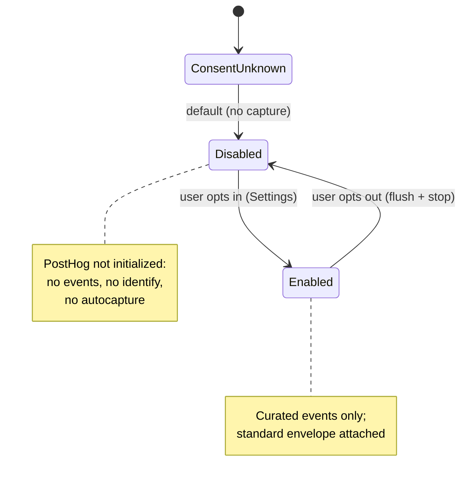
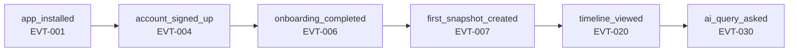
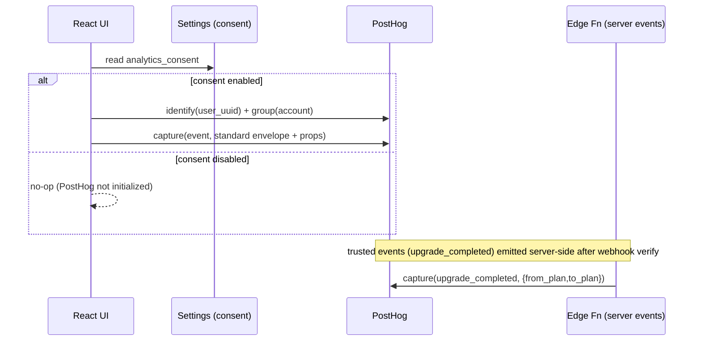
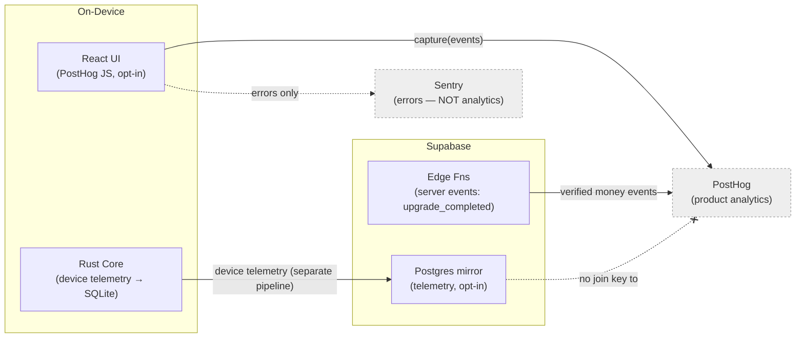

# 35. Event Tracking Specification

> The PostHog product-analytics taxonomy for DeviceLifeline: naming convention, the full event catalog, event properties, the identity/user model, the funnels and metrics enabled, and the firm boundary between product analytics and device telemetry — all privacy-first and opt-in. Part of the DeviceLifeline documentation suite — see [Documentation Index](README.md).

**Status:** Draft v1 · **Authoring role:** Staff Backend Engineer + Data Architect · **Last updated:** 2026-06-07
**Related:** [21. Device Telemetry Strategy](21-device-telemetry-strategy.md), [19. Privacy Requirements](19-privacy-requirements.md), [36. Logging Strategy](36-logging-strategy.md), [34. API Specification](34-api-specification.md), [13. Monetization Strategy](13-monetization-strategy.md)

---

## 1. Purpose & Scope

This document defines **what product-analytics events DeviceLifeline captures in PostHog, how they are named, what properties they carry, and how users are identified** — so product, growth, and engineering work from one canonical event catalog. It exists to make activation, retention, conversion, and feature-adoption measurable while staying strictly privacy-first and opt-in.

**Product analytics ≠ device telemetry.** This document covers **PostHog product analytics** (how people use the *app*: clicks, screens, funnels, conversions). It is explicitly **not** [21. Device Telemetry Strategy](21-device-telemetry-strategy.md), which covers data about the *managed computer* (health samples, inventory, timeline). The two pipelines are separate, governed differently, and never merged at the identity level (see §3 boundary and §7).

**In scope:** Naming convention; the full event catalog (onboarding, snapshot, restore, timeline, AI, health, billing, settings); standard + per-event properties; the identity/group model; consent gating; the funnels and metrics these events enable. V1 plus near-term post-MVP (tagged).

**Out of scope:** Device telemetry content/cadence ([21](21-device-telemetry-strategy.md)); error/crash reporting routing ([36. Logging Strategy](36-logging-strategy.md)); the legal basis and DSAR handling for analytics ([19. Privacy Requirements](19-privacy-requirements.md)); pricing/packaging ([13. Monetization Strategy](13-monetization-strategy.md)).

---

## 2. Assumptions

- A1: **PostHog** is the single product-analytics platform (locked stack). Events are sent from the **React UI** via the PostHog JS client; a small number of server-confirmed events (e.g., `upgrade_completed`) are emitted **server-side** from an Edge Function for trustworthiness.
- A2: Analytics is **opt-in and configurable** ([19. Privacy Requirements](19-privacy-requirements.md)). With consent off, the client captures **nothing** — no autocapture, no pageviews, no identify. Consent state is read from `Settings` ([34. API Specification](34-api-specification.md) `get_settings`).
- A3: **No device telemetry, snapshot contents, file paths, hostnames, or PII** are sent as PostHog properties. Events carry counts, enums, durations, and opaque ids only (§3, §5).
- A4: Identity uses the **Supabase Auth user id** (a UUID) as the PostHog `distinct_id`; pre-auth usage uses an anonymous device-scoped id that is **aliased** on sign-in.
- A5: **Account** is modeled as a PostHog **group** (`group_type = "account"`) so business/fleet metrics aggregate per organization ([33. Entity Relationship Design](33-entity-relationship-design.md)).
- A6: PostHog **autocapture is disabled by default**; DeviceLifeline uses an **explicit, curated event catalog** (this document) so the taxonomy stays clean and privacy-reviewable.
- A7: All events share a **standard property envelope** (§4.2) for consistent slicing (plan, edition, platform, app version).
- A8: Naming is **immutable once shipped**; renames create a new event and deprecate the old (§3.4) to protect historical funnels.

---

## 3. Conventions & Boundary

### 3.1 Naming convention

- Event names are **`snake_case`**, **`object_action`** order, past tense for completed actions: `snapshot_created`, `restore_completed`, `upgrade_completed`.
- In-progress/intent events use `_started` / `_viewed` / `_shown` / `_clicked`: `restore_started`, `timeline_viewed`, `health_alert_shown`.
- Funnel-critical events get **stable ids** (`EVT-###`) in §5 so docs and dashboards reference them unambiguously.
- Property keys are `snake_case`; enums are lowercase tokens. Booleans are prefixed `is_`/`has_`.
- Reserved PostHog properties (`$set`, `$set_once`, `$current_url`) are used only for person/group properties, never to smuggle device data.

### 3.2 Product analytics vs device telemetry (hard boundary)

| Dimension | Product analytics (this doc, PostHog) | Device telemetry ([21](21-device-telemetry-strategy.md)) |
|---|---|---|
| Subject | How the human uses the **app** | State/health of the **computer** |
| Examples | `timeline_viewed`, `ai_query_asked`, `upgrade_completed` | `HealthSample`, software inventory, `TimelineEvent` content |
| Store/pipeline | PostHog (cloud SaaS) | SQLite (local source of truth) → opt-in Supabase mirror |
| Identity | User uuid + Account group | Device id; **no PostHog linkage** |
| Consent | Analytics opt-in toggle | Separate sync/telemetry opt-in toggle |
| PII allowed | No (counts/enums/ids only) | Governed by [19](19-privacy-requirements.md) redaction; stays primarily on-device |

The two never share a payload. An event like `snapshot_created` records **that** a snapshot happened plus safe metadata (counts, duration) — never the snapshot's contents.

### 3.3 Consent gating (flow)



### 3.4 Lifecycle/governance

- New events require a row in §5 (id, properties, owner) and a privacy check ([19](19-privacy-requirements.md)) before merge.
- Renames are forbidden in place; ship a new event + mark the old `deprecated` with an end date.
- A periodic taxonomy audit reconciles live PostHog events against §5 (orphan/unknown events flagged).

---

## 4. Identity & Property Model

### 4.1 Identity model

| Concept | Mechanism | Notes |
|---|---|---|
| Anonymous (pre-auth) | PostHog-generated anon id, stored per install | Onboarding steps before sign-in attach here |
| Identified user | `identify(user_uuid)` on sign-in; `alias(anon_id)` once | `distinct_id` = Supabase Auth uid |
| Account (org) | `group("account", account_id, props)` | Enables per-org B2B metrics |
| Device | **Not** a PostHog identity | Device id may appear only as an opaque event property where essential, never as `distinct_id` |
| Sign-out | `reset()` | Prevents cross-user mixing on shared machines |

Person properties (set via `$set` / `$set_once`): `plan_code`, `edition`, `signup_source`, `is_paying`, `first_seen_at` (set_once), `os`. **No** email/name unless the user is signed in and [19](19-privacy-requirements.md) permits storing it in PostHog; default is **not** to send email.

### 4.2 Standard property envelope (on every event)

```jsonc
{
  "app_version": "1.0.0",
  "platform": "windows",            // windows | macos(future) | linux(future)
  "edition": "pro",                 // free | pro | developer | technician | business
  "plan_code": "pro",
  "account_type": "individual",     // individual | technician | business
  "is_paying": true,
  "locale": "en-US",
  "session_id": "s_01J0...",        // app session, not OS session
  "correlation_id": "req_01HZX..."  // links to logs ([36]) when relevant
}
```

These are merged into every captured event so any event can be sliced by plan/edition/platform without bespoke properties.

---

## 5. Event Catalog

Phase: **MVP** unless tagged **post-MVP**. Source: **client** (React UI) or **server** (Edge Function).

### 5.1 Onboarding & activation

| ID | Event | Source | Key properties | Fires when |
|---|---|---|---|---|
| EVT-001 | `app_installed` | client | `install_channel` | First launch after install |
| EVT-002 | `onboarding_started` | client | `step_count` | Onboarding wizard opens |
| EVT-003 | `onboarding_step_completed` | client | `step_index`, `step_name` | Each wizard step finished |
| EVT-004 | `account_signed_up` | client | `signup_source` | Account creation succeeds |
| EVT-005 | `account_signed_in` | client | `method` | Sign-in succeeds |
| EVT-006 | `onboarding_completed` | client | `duration_ms`, `device_added` | Wizard finished |
| EVT-007 | `first_snapshot_created` | client | `software_count` | First-ever `snapshot_created` for the user (activation) |

### 5.2 Device DNA & snapshots

| ID | Event | Source | Key properties | Fires when |
|---|---|---|---|---|
| EVT-010 | `snapshot_created` | client | `trigger`, `software_count`, `config_count`, `duration_ms`, `is_baseline` | A `DeviceDNASnapshot` is built |
| EVT-011 | `snapshot_viewed` | client | `snapshot_id_hash` | DNA detail screen opened |
| EVT-012 | `setup_exported` | client | `target`, `item_count` | Setup export completes |
| EVT-013 | `snapshot_compared` | client | `from_age_days`, `to_age_days`, `diff_count` | Two snapshots diffed |

### 5.3 Performance Timeline

| ID | Event | Source | Key properties | Fires when |
|---|---|---|---|---|
| EVT-020 | `timeline_viewed` | client | `range_days`, `event_count` | Timeline screen opened |
| EVT-021 | `timeline_filtered` | client | `types[]` | User filters by `eventType` |
| EVT-022 | `correlation_viewed` | client | `correlation_size` | A cause↔effect correlation expanded |
| EVT-023 | `timeline_event_opened` | client | `event_type`, `severity` | A `TimelineEvent` detail opened |

### 5.4 AI Detective

| ID | Event | Source | Key properties | Fires when |
|---|---|---|---|---|
| EVT-030 | `ai_query_asked` | client | `question_length_bucket`, `context_size` | User submits an AI Detective question (no question text) |
| EVT-031 | `ai_findings_returned` | server | `finding_count`, `top_confidence_bucket`, `model`, `latency_ms` | `ai-orchestrate` returns findings |
| EVT-032 | `ai_finding_actioned` | client | `action`, `confidence_bucket` | User acts on a `DiagnosisFinding` |
| EVT-033 | `ai_query_blocked_quota` | client | — | Query blocked by `ai.queries_per_month` |

### 5.5 Health Intelligence & Crash

| ID | Event | Source | Key properties | Fires when |
|---|---|---|---|---|
| EVT-040 | `health_dashboard_viewed` | client | `overall_score_bucket` | Health screen opened |
| EVT-041 | `health_alert_shown` | client | `kind`, `severity`, `subsystem` | An `Alert` is surfaced to the user |
| EVT-042 | `health_alert_actioned` | client | `kind`, `action` | User acts on an alert |
| EVT-043 | `crash_explained_viewed` | client | `crash_kind` | A plain-English crash explanation opened |

### 5.6 Restore & install

| ID | Event | Source | Key properties | Fires when |
|---|---|---|---|---|
| EVT-050 | `restore_started` | client | `plan_kind`, `step_count`, `from_template` | A `RestoreJob` begins |
| EVT-051 | `restore_step_failed` | client | `step_kind`, `error_code` | A `RestoreStep` fails (no path/PII) |
| EVT-052 | `restore_completed` | client | `plan_kind`, `duration_ms`, `success_steps`, `failed_steps` | A `RestoreJob` finishes |
| EVT-053 | `install_task_completed` | client | `source`, `action`, `result` | An `InstallTask` finishes |
| EVT-054 | `template_published` | client | `kind`, `visibility` | An `EnvironmentTemplate` is published (post-MVP for Business sharing) |

### 5.7 Monetization & account

| ID | Event | Source | Key properties | Fires when |
|---|---|---|---|---|
| EVT-060 | `paywall_viewed` | client | `feature`, `current_plan` | A gated feature shows the paywall |
| EVT-061 | `upgrade_started` | client | `target_plan`, `provider` | Checkout opened (Stripe/Paystack) |
| EVT-062 | `upgrade_completed` | server | `from_plan`, `to_plan`, `provider`, `mrr_band` | Verified via billing webhook ([34](34-api-specification.md) §6) |
| EVT-063 | `subscription_canceled` | server | `plan`, `reason_bucket` | Cancellation processed |
| EVT-064 | `seat_assigned` | client | `seat_count` | A `LicenseSeat` is assigned (Business) |

### 5.8 Settings, privacy & retention controls

| ID | Event | Source | Key properties | Fires when |
|---|---|---|---|---|
| EVT-070 | `analytics_consent_changed` | client | `enabled` | User toggles analytics opt-in (last event before disable) |
| EVT-071 | `sync_consent_changed` | client | `enabled` | User toggles cloud sync opt-in |
| EVT-072 | `settings_changed` | client | `setting_key` | A tracked setting changes (key only, no value) |
| EVT-073 | `support_bundle_created` | client | `redacted` | User generates a debug bundle ([36](36-logging-strategy.md)) |

---

## 6. Funnels & Metrics Enabled

### 6.1 Core funnels

| Funnel | Steps (event ids) | Measures |
|---|---|---|
| Activation | EVT-001 → EVT-004 → EVT-006 → EVT-007 | Install → signup → onboarded → first snapshot |
| AI adoption | EVT-020 → EVT-030 → EVT-031 → EVT-032 | Timeline → ask → answer → act |
| Restore success | EVT-050 → EVT-052 | Started → completed (and failure rate via EVT-051) |
| Conversion | EVT-060 → EVT-061 → EVT-062 | Paywall → checkout → paid (server-verified) |

### 6.2 Headline metrics

| Metric | Definition | Source events |
|---|---|---|
| Activation rate | % of new users reaching `first_snapshot_created` within 7 days | EVT-004, EVT-007 |
| Feature adoption (Timeline/AI/Restore) | % active users firing the feature's anchor event in a period | EVT-020 / EVT-030 / EVT-050 |
| Restore success rate | `restore_completed(success)` / `restore_started` | EVT-050, EVT-052 |
| Free→paid conversion | `upgrade_completed` / `paywall_viewed` (cohorted) | EVT-060, EVT-062 |
| Per-account engagement (B2B) | Active devices/users per account group | account group + anchor events |
| WAU/MAU & stickiness | Distinct users with any catalog event | all events |

### 6.3 Funnel diagram (activation)



### 6.4 Event flow (client → PostHog, consent-gated)



---

## Diagrams

The taxonomy's key flows are diagrammed inline where they add the most context: the **consent gating** state machine (§3.3), the **activation funnel** (§6.3), and the **consent-gated event flow** from client to PostHog with server-side money events (§6.4). The end-to-end relationship between the analytics pipeline and the rest of the platform is below.



The dashed crossed edge emphasizes the hard boundary (§3.2): the device-telemetry mirror and PostHog share **no** join key.

## 7. Privacy & Data Minimization (analytics-specific)

- **Opt-in default off.** No event, identify, or autocapture occurs until the user enables analytics ([19. Privacy Requirements](19-privacy-requirements.md)). `analytics_consent_changed(enabled=false)` is flushed, then capture stops and the client is shut down.
- **No PII / no device data in properties.** Question text, file paths, hostnames, app names from inventory, and raw metrics are **never** event properties. Use buckets (`question_length_bucket`), counts, enums, and **hashed** opaque ids (`snapshot_id_hash`).
- **Server-verified money events.** `upgrade_completed` / `subscription_canceled` are emitted server-side post-webhook so revenue analytics cannot be spoofed by the client.
- **Right to be forgotten.** A user-delete propagates a PostHog person deletion; account deletion removes the group ([19](19-privacy-requirements.md), [20. Data Retention Policies](20-data-retention-policies.md)).
- **Geography/IP.** IP-based geo may be coarsened or disabled per region policy; no precise location is collected.
- **Separation from telemetry.** PostHog ingestion endpoints are distinct from the Supabase sync path; there is no join key exposing device telemetry to PostHog.

---

## 8. Risks & Mitigations

| Risk | Likelihood | Impact | Mitigation |
|---|---|---|---|
| PII or device data leaks into event properties | Medium | High | Curated catalog only; buckets/enums/hashed ids; privacy review gate per new event ([19](19-privacy-requirements.md)) |
| Analytics fires before/without consent | Medium | High | Client not initialized until opt-in; CI test asserts no network calls when disabled |
| Event-name drift breaks historical funnels | Medium | Medium | Immutable names; deprecate-don't-rename; taxonomy audit (§3.4) |
| Client-spoofed revenue events skew metrics | Medium | Medium | Money events emitted server-side after webhook verification (EVT-062/063) |
| Autocapture pulls in unreviewed events | Low | Medium | Autocapture disabled; explicit catalog enforced |
| Product analytics conflated with telemetry in dashboards | Medium | Medium | Hard boundary (§3.2); separate pipelines/identities; documented metric sources |
| Shared-machine identity bleed | Low | Medium | `reset()` on sign-out; per-user `distinct_id` |

---

## 9. Future Considerations

- **Feature flags & experiments** via PostHog to A/B onboarding and paywall copy ([13. Monetization Strategy](13-monetization-strategy.md)).
- **Session replay** (heavily masked) — only if a privacy review approves field-level masking; off by default.
- **Reverse-ETL** of aggregate (non-PII) metrics into a warehouse for blended product + revenue analysis.
- **Edition-specific dashboards** for Technician/Business workflows ([56](56-technician-edition-specification.md), [57](57-business-edition-specification.md)).
- **macOS/Linux** add `platform` enum values only; the catalog is OS-agnostic ([28](28-macos-architecture-plan.md), [29](29-linux-architecture-plan.md)).
- **Mobile companion** events would extend this same taxonomy ([59. Future Mobile App Strategy](59-future-mobile-app-strategy.md)).

---

## 10. Acceptance Criteria

- [ ] AC-01: A single naming convention (`object_action`, snake_case, past tense) is defined and applied to every event.
- [ ] AC-02: The catalog covers onboarding, snapshots, timeline, AI, health/crash, restore/install, monetization, and settings, with stable `EVT-###` ids.
- [ ] AC-03: Every event carries the standard property envelope (plan, edition, platform, app version).
- [ ] AC-04: The identity model uses the Supabase user uuid as `distinct_id` and Account as a PostHog group; device is never an identity.
- [ ] AC-05: Analytics is opt-in with default-off; no capture/identify/autocapture occurs without consent.
- [ ] AC-06: No event property contains PII, question text, file paths, hostnames, inventory names, or raw telemetry — only counts, enums, durations, and hashed ids.
- [ ] AC-07: The product-analytics vs device-telemetry boundary (§3.2) is explicit and references [21. Device Telemetry Strategy](21-device-telemetry-strategy.md).
- [ ] AC-08: Revenue events (`upgrade_completed`, `subscription_canceled`) are server-emitted after webhook verification.
- [ ] AC-09: The catalog enables the core funnels and headline metrics in §6.
