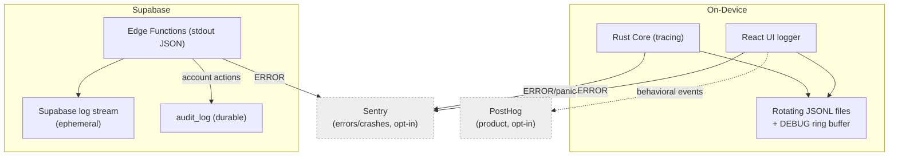
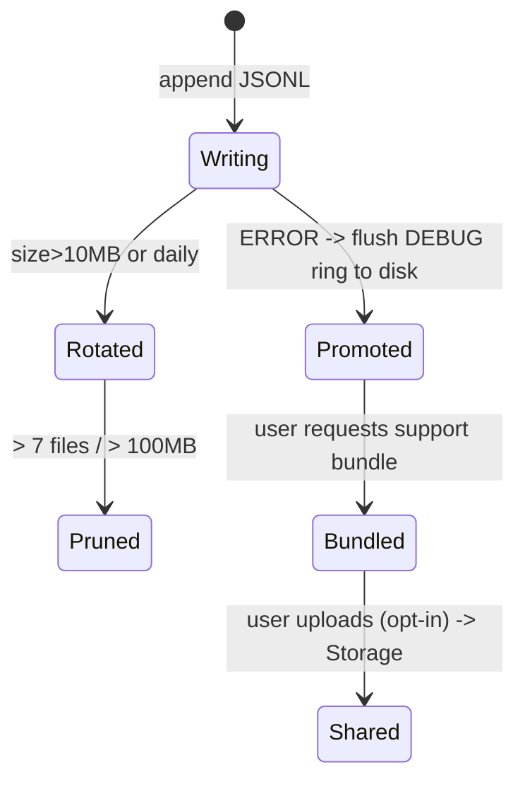
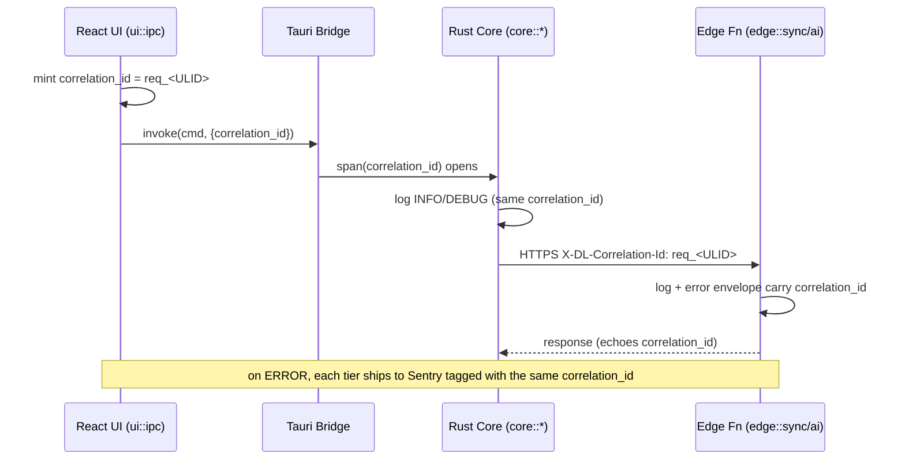

# 36. Logging Strategy

> How DeviceLifeline logs across the Rust Core, Tauri bridge, React UI, and Supabase Edge Functions: log levels, structured JSON, local rotating files, correlation IDs across the IPC + cloud boundary, routing to Sentry vs PostHog vs local-only, PII redaction, retention, and support debug bundles. Part of the DeviceLifeline documentation suite — see [Documentation Index](README.md).

**Status:** Draft v1 · **Authoring role:** Staff Backend Engineer + Principal Software Architect · **Last updated:** 2026-06-07
**Related:** [37. Observability Strategy](37-observability-strategy.md), [35. Event Tracking Specification](35-event-tracking-specification.md), [34. API Specification](34-api-specification.md), [19. Privacy Requirements](19-privacy-requirements.md), [17. Security Requirements](17-security-requirements.md)

---

## 1. Purpose & Scope

This document defines the **logging contract** for every DeviceLifeline tier so engineers can debug across the IPC + cloud boundary, support can reproduce issues, and privacy is preserved. It standardizes log levels, the structured JSON log shape, local rotating files, the **correlation id** that stitches a single user action across React → Tauri → Rust → Supabase, what routes to **Sentry** (errors/crashes) vs **PostHog** (product) vs **local-only**, **PII redaction**, retention, and **support debug bundles**.

It is the logging half of observability; metrics, tracing, dashboards, alerting, SLOs, and on-call are in [37. Observability Strategy](37-observability-strategy.md). Logging is **diagnostic**; product analytics is **behavioral** ([35. Event Tracking Specification](35-event-tracking-specification.md)) — the two are distinct streams (§3.4).

**In scope:** Level taxonomy; structured JSON fields; per-tier logger config (Rust, Tauri, React, Edge Functions); correlation/trace id propagation; routing matrix (Sentry/PostHog/local/cloud); redaction rules; rotation and retention; the support debug bundle format. V1 plus near-term post-MVP.

**Out of scope:** Sentry project setup, alerting policies, dashboards, distributed tracing/metrics, SLOs ([37](37-observability-strategy.md)); analytics event catalog ([35](35-event-tracking-specification.md)); the security model for secrets ([17. Security Requirements](17-security-requirements.md)); retention legal basis ([20. Data Retention Policies](20-data-retention-policies.md)).

---

## 2. Assumptions

- A1: The **Rust Core** uses the `tracing`/`tracing-subscriber` stack with a JSON formatter; the **React UI** uses a thin structured logger; **Edge Functions** (Deno) log structured JSON to stdout (collected by Supabase).
- A2: **All logs are structured JSON**, one object per line (JSONL), with a shared field schema (§4.1) so any tier's logs are machine-parseable and mergeable in a bundle.
- A3: **Local files are the source of truth for diagnostics.** The device keeps rotating logs offline; nothing is shipped off-device for diagnostics without consent (errors→Sentry is opt-in per [19. Privacy Requirements](19-privacy-requirements.md)).
- A4: A **`correlation_id`** is generated at the UI when a user action starts and threaded through every IPC call, Rust span, and cloud request (the same id used in the [34. API Specification](34-api-specification.md) error envelope). It is a **trace id**, distinct from `TimelineEvent.correlation_id` (a cause↔effect link).
- A5: **No secrets and no PII in logs.** Redaction happens at the logging boundary in every tier (§6). Raw `HealthSample`, snapshot contents, file paths (unless allowlisted/hashed), and credentials never enter logs.
- A6: **Sentry** receives errors/exceptions/crashes; **PostHog** receives product events; **neither** receives raw log streams. Logs route per the matrix in §5.
- A7: Log verbosity is **runtime-configurable** per tier/module without a rebuild (env var / settings flag), defaulting to `INFO` in release and `DEBUG` in dev.
- A8: Edge Function logs are **ephemeral** in Supabase; durable error context lives in Sentry, durable audit lives in the `audit_log` table ([32. Database Design](32-database-design.md)), not in log files.

---

## 3. Conventions

### 3.1 Log levels

| Level | Use | Routing default |
|---|---|---|
| `TRACE` | Hot-path detail (dev only) | Local file (dev), dropped in release |
| `DEBUG` | Diagnostic detail for support | Local file (ring buffer promoted on error) |
| `INFO` | Normal lifecycle (command start/finish, sync batch, job step) | Local file |
| `WARN` | Recoverable/degraded (retry, fallback, slow op) | Local file (+ Sentry breadcrumb) |
| `ERROR` | Operation failed; user-visible impact | Local file + **Sentry** (opt-in) |
| `FATAL`/panic | Process crash / unrecoverable | Local crash log + **Sentry** + minidump (opt-in) |

### 3.2 Module targets (Rust `tracing` targets / logical loggers)

`core::dispatch`, `core::dna`, `core::timeline`, `core::health`, `core::crash`, `core::install`, `core::sync`, `core::repo` (SQLite), `ui::ipc`, `ui::view`, `edge::ai`, `edge::sync`, `edge::billing`. Levels are settable per target (e.g., raise `core::sync` to `DEBUG` for a sync bug without flooding others).

### 3.3 The correlation id (trace id)

- Format: `req_<ULID>` minted in the React UI when a user action begins.
- Threaded: UI passes it as an IPC arg → Rust opens a `tracing` span with it → Sync Agent sends it as `X-DL-Correlation-Id` → Edge Functions echo it into their logs and the error envelope.
- Background work (scheduler ticks) mints its own `task_<ULID>` and tags the originating subsystem.

### 3.4 Logging vs analytics vs audit (three streams)

| Stream | Purpose | Destination | Doc |
|---|---|---|---|
| Logging (this doc) | Engineer/support diagnostics | Local files; errors→Sentry | [37](37-observability-strategy.md) |
| Product analytics | Behavioral metrics/funnels | PostHog (opt-in) | [35](35-event-tracking-specification.md) |
| Audit | Security/account actions of record | `audit_log` table (append-only) | [32](32-database-design.md), [17](17-security-requirements.md) |

A single action may touch all three, but each carries its own purpose-built payload; they are never collapsed into one sink.

---

## 4. Structured Log Schema

### 4.1 Shared fields (every log line, every tier)

```jsonc
{
  "ts": "2026-06-07T10:00:00.123Z",   // UTC ISO-8601, ms
  "level": "INFO",
  "tier": "rust_core",                // react_ui | tauri | rust_core | edge_fn
  "target": "core::sync",             // module/logger
  "msg": "sync batch applied",
  "correlation_id": "req_01HZX...",   // trace id (A4); null for unattributed
  "app_version": "1.0.0",
  "schema_version": 7,                 // local SQLite schema (device tiers)
  "device_id_hash": "d8a1..",         // hashed, never raw hostname
  "fields": { "pushed": 12, "pulled": 3, "duration_ms": 84 }  // event-specific
}
```

Edge-function lines add `account_id` (from JWT) and `function`/`region`; they omit `device_id_hash` unless provided. Error lines add `error.code`, `error.domain`, and a redacted `error.stack` reference (the full stack goes to Sentry, not the file).

### 4.2 Example lines

```jsonc
// React UI — user starts a restore
{ "ts":"2026-06-07T10:00:00.010Z","level":"INFO","tier":"react_ui","target":"ui::ipc",
  "msg":"invoke start_restore","correlation_id":"req_01HZX...","fields":{"plan_kind":"setup"} }

// Rust Core — step failure (ERROR → also Sentry)
{ "ts":"2026-06-07T10:00:05.500Z","level":"ERROR","tier":"rust_core","target":"core::install",
  "msg":"restore step failed","correlation_id":"req_01HZX...",
  "error":{"code":"install_source_unavailable","domain":"install"},
  "fields":{"step_kind":"install","source":"winget","attempt":2} }

// Edge Function — AI upstream timeout
{ "ts":"2026-06-07T10:00:06.000Z","level":"ERROR","tier":"edge_fn","function":"ai-orchestrate",
  "account_id":"acc_9b...","correlation_id":"req_01HZX...",
  "error":{"code":"ai_upstream_error","domain":"ai"},"fields":{"provider":"openai","latency_ms":30000} }
```

The shared `correlation_id` lets all three lines be reassembled into one trace across the boundary.

---

## 5. Routing Matrix — Sentry vs PostHog vs Local vs Cloud

| Signal | Local file | Sentry | PostHog | Supabase/cloud |
|---|---|---|---|---|
| `TRACE`/`DEBUG`/`INFO` logs | ✅ (rotating) | — | — | — |
| `WARN` | ✅ | breadcrumb only | — | — |
| `ERROR` (handled) | ✅ | ✅ event (opt-in) | — | — |
| Panic / crash / BSOD-of-app | ✅ crash log + minidump | ✅ (opt-in) | — | — |
| Edge Function logs | — | ✅ on ERROR | — | Supabase log stream (ephemeral) |
| Product/behavioral events | — | — | ✅ (opt-in, [35](35-event-tracking-specification.md)) | — |
| Security/account actions | local action log | — | — | ✅ `audit_log` (durable) |
| Support debug bundle | ✅ assembled on request | — | — | uploaded to Storage only if user shares |

Routing rules:

- **Errors → Sentry**, with the `correlation_id` as a Sentry tag and recent `DEBUG` lines attached as breadcrumbs (redacted). Release + environment tags align with [37](37-observability-strategy.md).
- **Product behavior → PostHog**, never the log stream ([35](35-event-tracking-specification.md)).
- **Everything else → local**, promoted only via an explicit, redacted support bundle (§8).
- **Edge Function** stdout is captured by Supabase (short retention); durable error context is in Sentry; durable audit in `audit_log`.



---

## 6. PII Redaction in Logs

Redaction is mandatory and applied **at the logging boundary** in every tier (not after the fact). It aligns with [19. Privacy Requirements](19-privacy-requirements.md).

### 6.1 Rules

| Data | Rule |
|---|---|
| Credentials / tokens / API keys | **Never logged**; structurally excluded; static lint forbids logging known secret fields |
| File system paths | Hashed or replaced with a category token (`<user_profile>/...`); never raw user paths unless allowlisted |
| Hostname / machine name | Replaced by `device_id_hash` |
| Email / display name / user text (e.g., AI question) | Not logged; AI question represented as length bucket (matches [35](35-event-tracking-specification.md)) |
| Snapshot contents / inventory app names | Not logged; counts only |
| Raw `HealthSample` values | Not logged; only aggregate/score where needed |
| IP address (Edge) | Truncated/region-coarsened where policy requires |

### 6.2 Mechanism

- A **redaction layer** (a `tracing` layer in Rust; a wrapper in UI/Edge) scans structured fields against an allowlist of safe keys; unknown free-text fields are dropped or hashed.
- **Allowlist over denylist:** only explicitly safe fields are emitted into `fields`; everything else must be opted-in via review.
- A CI check + unit tests assert representative log lines contain no PII patterns (emails, drive paths, secret-shaped strings).

---

## 7. Local Files, Rotation & Retention

### 7.1 Files

| File | Tier | Purpose |
|---|---|---|
| `core.jsonl` (rotating) | Rust Core | Primary device log |
| `ui.jsonl` (rotating) | React UI | Front-end diagnostics (forwarded to core writer where possible) |
| `crash/*.dmp` + `crash/*.json` | Rust Core | Minidump + context on panic |
| `debug-ring` (in-memory → file on error) | Rust Core | Last N `DEBUG` lines promoted to disk when an `ERROR` occurs |

### 7.2 Rotation & retention

| Parameter | Default | Notes |
|---|---|---|
| Rotation trigger | 10 MB or daily | Whichever first |
| Retained rotated files | 7 files | ~1 week typical |
| Max log footprint | ~100 MB cap | Oldest pruned first |
| DEBUG ring buffer | 2,000 lines | Promoted to disk on first ERROR in a session |
| Crash dumps | 5 most recent | Shared only via bundle/Sentry (opt-in) |
| Edge Function logs | Supabase platform retention (short) | Durable signal → Sentry/`audit_log` |

Retention windows reference [20. Data Retention Policies](20-data-retention-policies.md); logs are local and pruned automatically, independent of cloud retention.



---

## 8. Support Debug Bundles

When a user requests support, the Rust core assembles a **debug bundle** via the `open_support_bundle` command ([34. API Specification](34-api-specification.md) §4.2).

### 8.1 Contents (redacted by default)

```text
bundle/
  manifest.json          # app_version, os, schema_version, time range, redaction=on
  core.jsonl(.N)         # recent rotated core logs (redacted)
  ui.jsonl               # recent UI logs (redacted)
  crash/                 # most-recent minidump + context (if any)
  sync_status.json       # outbox depth, last_synced_at, conflicts (no payloads)
  health_summary.json    # scores only (no raw samples)
  redaction_report.json  # what was stripped/hashed
```

### 8.2 Rules

- **Redaction on by default;** an explicit "include diagnostic detail" toggle is gated by a clear consent prompt and still excludes secrets.
- The bundle is **written locally** and only uploaded to Supabase Storage (private, time-limited link) if the user chooses to share it.
- The bundle's `correlation_id` index lets support trace a reported action across tiers.
- Bundles inherit the redaction layer (§6); no path/PII/secret leaks even in "detailed" mode.

---

## 9. Per-Tier Configuration Summary

| Tier | Logger | Format | Sink | Level control |
|---|---|---|---|---|
| Rust Core | `tracing` + JSON layer + redaction layer | JSONL | Rotating files; Sentry on ERROR/panic | Env `DL_LOG` + settings, per-target |
| Tauri bridge | Rust `tracing` (IPC boundary spans) | JSONL | Via core writer | Inherits core |
| React UI | Thin structured logger | JSONL | Forward to core writer; Sentry JS on ERROR | Settings flag |
| Edge Functions | Deno structured console JSON | JSONL stdout | Supabase stream; Sentry on ERROR | Env per function |

---

## Diagrams

Two diagrams already anchor the strategy inline: the **routing graph** (§5) showing Sentry/PostHog/local/cloud destinations, and the **rotation lifecycle** state machine (§7.2). The diagram below shows how a single `correlation_id` stitches one user action into one trace across all four tiers — the property that makes cross-boundary debugging possible.



A support engineer can therefore filter local logs, Sentry events, and Edge logs by one `correlation_id` and reconstruct the full path of a reported action.

## 10. Risks & Mitigations

| Risk | Likelihood | Impact | Mitigation |
|---|---|---|---|
| PII/secrets leak into logs or bundles | Medium | Critical | Allowlist redaction at boundary; CI PII tests; secret-field lint; redaction on by default in bundles ([19](19-privacy-requirements.md)) |
| Logs grow unbounded and fill disk | Medium | Medium | Size/daily rotation; 100 MB cap; oldest-pruned ([§7](#7-local-files-rotation--retention)) |
| Correlation id not propagated → broken cross-tier traces | Medium | Medium | Id minted in UI, required IPC arg + `X-DL-Correlation-Id` header; lint on IPC + Edge entrypoints |
| Error noise floods Sentry (cost/alert fatigue) | Medium | Medium | Only ERROR/panic to Sentry; WARN as breadcrumb; sampling/grouping ([37](37-observability-strategy.md)) |
| Edge logs lost (ephemeral) hide root cause | Medium | Medium | Durable error → Sentry; durable account actions → `audit_log`; correlation id ties them together |
| Verbose logging hurts performance | Low | Medium | Release default `INFO`; `TRACE` dev-only; per-target control; async non-blocking writer |
| Logging conflated with analytics | Low | Medium | Three-stream separation (§3.4); logs never sent to PostHog |

---

## 11. Future Considerations

- **Optional remote log shipping** (opt-in, redacted) to a managed log store for Business/Technician fleets, gated by [19](19-privacy-requirements.md) and surfaced in [57. Business Edition Specification](57-business-edition-specification.md).
- **OpenTelemetry logs/traces** export to unify with [37. Observability Strategy](37-observability-strategy.md) once tracing is adopted end-to-end.
- **Log-derived anomaly detection** feeding Health/Crash Intelligence (post-MVP).
- **Per-tenant log encryption keys** for shared bundles in regulated environments.
- **macOS/Linux** reuse the same schema and redaction; only path-category tokens differ ([28](28-macos-architecture-plan.md), [29](29-linux-architecture-plan.md)).

---

## 12. Acceptance Criteria

- [ ] AC-01: A level taxonomy (`TRACE`→`FATAL`) and per-target controls are defined for all four tiers.
- [ ] AC-02: All logs are structured JSON sharing the field schema in §4.1, including a `correlation_id`.
- [ ] AC-03: A single `correlation_id` propagates UI → Tauri → Rust → Edge Functions and matches the [34. API Specification](34-api-specification.md) error envelope.
- [ ] AC-04: The routing matrix (§5) sends errors/crashes to Sentry, behavior to PostHog, and everything else local — with no raw logs to PostHog.
- [ ] AC-05: PII/secret redaction is mandatory at the logging boundary via an allowlist, with CI tests.
- [ ] AC-06: Local rotation, size caps, and retention are specified and independent of cloud retention ([20. Data Retention Policies](20-data-retention-policies.md)).
- [ ] AC-07: A redacted-by-default support debug bundle format is defined and produced via `open_support_bundle`.
- [ ] AC-08: Logging, product analytics, and audit are kept as three separate streams (§3.4).
- [ ] AC-09: Edge Function ephemeral logs are backstopped by durable Sentry errors and `audit_log` entries.
