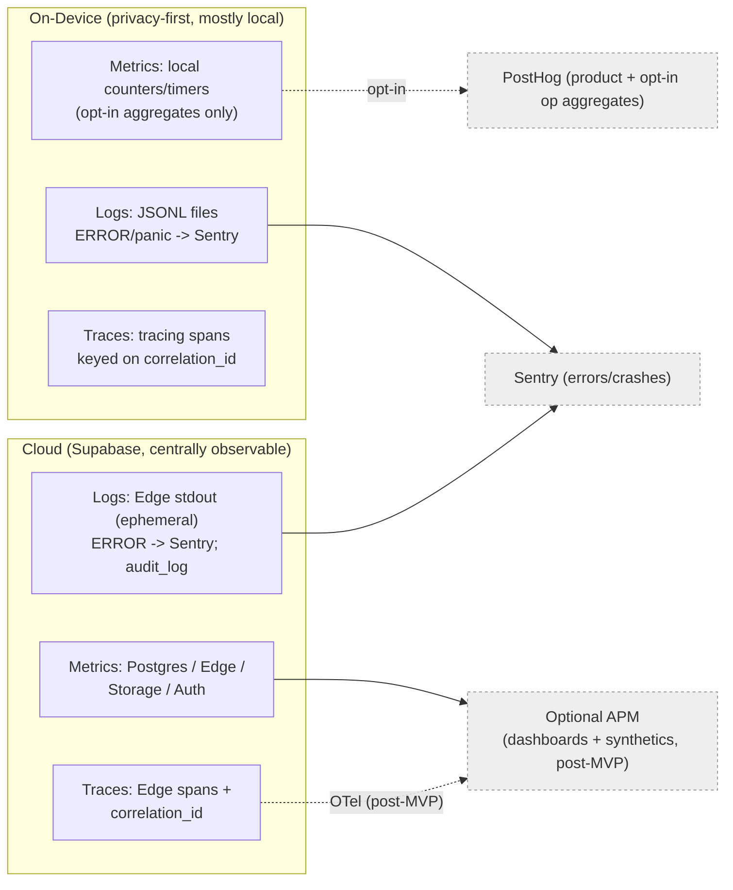
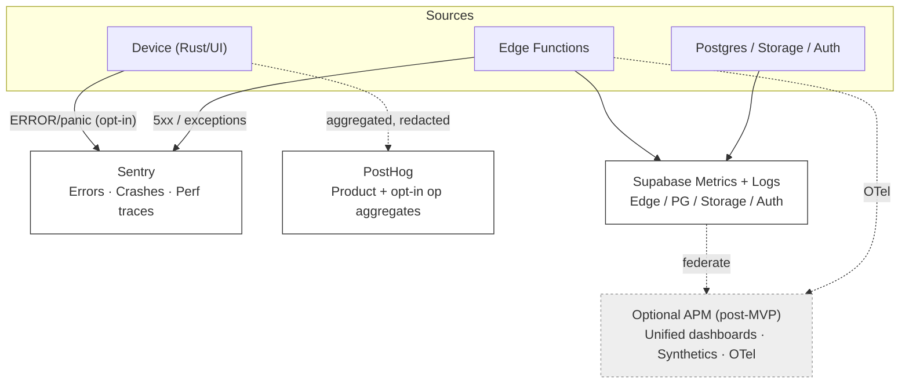
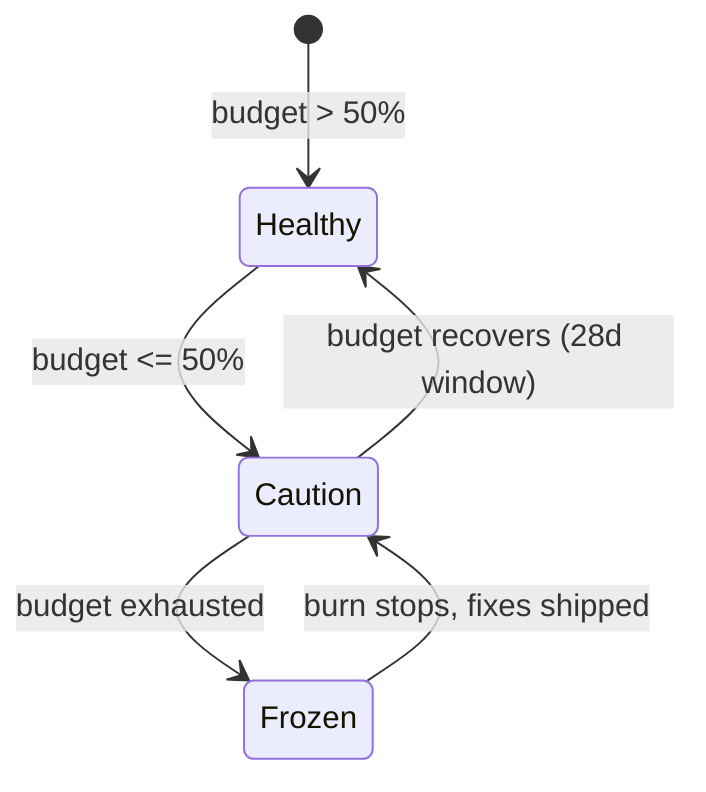

# 37. Observability Strategy

> How DeviceLifeline observes itself across the on-device agent and the Supabase cloud: the three pillars (metrics, logs, traces), what we watch (agent heartbeats, sync success, AI latency + token cost, install/restore success, crash rates, Edge Function performance), the tool mapping (Sentry / PostHog / Supabase logs+metrics / optional managed APM), the SLI/SLO catalog, dashboards, and the alerting + on-call model — all under DeviceLifeline's privacy-first, opt-in constraints. Part of the DeviceLifeline documentation suite — see [Documentation Index](README.md).

**Status:** Draft v1 · **Authoring role:** Site Reliability Engineer + Principal Software Architect · **Last updated:** 2026-06-07
**Related:** [36. Logging Strategy](36-logging-strategy.md), [35. Event Tracking Specification](35-event-tracking-specification.md), [34. API Specification](34-api-specification.md), [21. Device Telemetry Strategy](21-device-telemetry-strategy.md), [19. Privacy Requirements](19-privacy-requirements.md), [07. Non-Functional Requirements](07-non-functional-requirements.md), [38. DevOps Architecture](38-devops-architecture.md), [42. Disaster Recovery Plan](42-disaster-recovery-plan.md)

---

## 1. Purpose & Scope

This document defines **how DeviceLifeline knows whether it is healthy** — the observability contract across the two-tier system ([30. System Architecture](30-system-architecture.md)). It specifies the three pillars (metrics, logs, traces) on **device** and in the **cloud**, exactly **what** signals we capture, **where** each signal goes (Sentry / PostHog / Supabase logs+metrics / optional managed APM), a catalog of **Service Level Indicators (SLIs)** and **Service Level Objectives (SLOs)** with numeric targets, the **dashboards** that render them, and the **alerting + on-call** model that pages a human when an SLO is at risk.

It is the **metrics-traces-SLO** half of observability; the **logging** half (level taxonomy, structured JSON shape, correlation-id propagation, redaction, rotation, support bundles) lives in [36. Logging Strategy](36-logging-strategy.md) and is referenced rather than repeated. Observability here means **operational/engineering health**; **product behavior** (funnels, feature adoption) is the analytics stream in [35. Event Tracking Specification](35-event-tracking-specification.md). The numeric quality targets that several SLOs verify originate as `NFR-###` in [07. Non-Functional Requirements](07-non-functional-requirements.md).

**In scope:** the three pillars across device + cloud; the signal inventory (agent health/heartbeats, sync success, AI latency + token cost, install/restore success, crash rates, Edge Function performance); the tool routing matrix; SLIs/SLOs with targets and error budgets; dashboards; alerting policies, severities, and on-call/runbook linkage; privacy constraints on what may be observed off-device. V1 plus near-term post-MVP.

**Out of scope:** the logging contract itself ([36](36-logging-strategy.md)); the product-analytics event catalog ([35](35-event-tracking-specification.md)); CI/CD pipeline metrics ownership ([38. DevOps Architecture](38-devops-architecture.md)); infra capacity/cost sizing ([39. Infrastructure Requirements](39-infrastructure-requirements.md)); incident DR runbooks for data-loss scenarios ([42. Disaster Recovery Plan](42-disaster-recovery-plan.md), which this doc's alerting hands off to).

---

## 2. Assumptions

- **A1:** **Sentry** is the error/crash backbone (Rust panic + minidump, React JS errors, Edge Function exceptions); **PostHog** is product analytics; **Supabase** exposes platform logs + metrics (Postgres, Edge Functions, Auth, Storage, Realtime). A **managed APM** (e.g., Grafana Cloud / Better Stack / Datadog) is an **optional post-MVP** addition for unified dashboards + synthetic checks; V1 ships on the native tool dashboards.
- **A2:** **Device observability is privacy-first and opt-in.** Per-device operational metrics leave the machine **only** as aggregated, redacted PostHog events or opt-in Sentry errors ([19. Privacy Requirements](19-privacy-requirements.md), [21. Device Telemetry Strategy](21-device-telemetry-strategy.md)); raw `HealthSample` values, snapshot contents, file paths, and PII are **never** emitted as telemetry.
- **A3:** **There is no always-on agent metrics push.** The device has no fleet of servers to scrape; "agent metrics" are computed locally and surface as (a) opt-in periodic PostHog aggregates and (b) on-demand support bundles ([36 §8](36-logging-strategy.md)). The richest device telemetry is **local-only**.
- **A4:** Every cross-tier action carries the **`correlation_id`** (`req_<ULID>`) defined in [36 §3.3](36-logging-strategy.md) and the [34. API Specification](34-api-specification.md) error envelope; it is also the **trace id**, so logs, traces, and Sentry events for one action join on one key.
- **A5:** Cloud compute is **stateless, autoscaled Edge Functions** over managed Postgres ([30 §9](30-system-architecture.md)); we observe them via Supabase Edge logs/metrics + Sentry, not by managing hosts.
- **A6:** SLOs are **measured over a rolling 28-day window** with an explicit **error budget**; budget burn drives alerting and release-gating ([38 §branch→release](38-devops-architecture.md)).
- **A7:** "Availability" of a **core local feature** (snapshot, timeline, health, restore) is **not** cloud-dependent (offline-first, [30 AP-01](30-system-architecture.md)); cloud SLOs cover sync, AI, billing, and fleet — the network-dependent surfaces.
- **A8:** Token **cost** is a first-class operational signal (AI is the dominant variable cloud cost, [39 §AI](39-infrastructure-requirements.md)); it is observed per provider/model/function alongside latency.

---

## 3. The Three Pillars Across Device + Cloud

Observability rests on **metrics** (aggregatable numbers over time), **logs** (discrete structured events, [36](36-logging-strategy.md)), and **traces** (causal spans across a request). DeviceLifeline applies all three but **asymmetrically** — the device is privacy-constrained and offline-capable, the cloud is centrally observable.

| Pillar | On-device (Rust Core / Tauri / React) | Cloud (Supabase) | Tooling |
|---|---|---|---|
| **Metrics** | Computed locally (counters/gauges/timers in `tracing`); surfaced as **opt-in aggregated** PostHog events + local support bundle; never raw per-sample | Supabase Postgres/Edge/Storage/Auth metrics; derived SLI metrics from Edge logs | PostHog (aggregates) · Supabase Metrics · optional APM |
| **Logs** | Structured JSONL local files; `ERROR`/panic → Sentry (opt-in) — see [36](36-logging-strategy.md) | Edge Function stdout JSON (ephemeral) → durable `ERROR` → Sentry; `audit_log` durable | Local files · Sentry · Supabase log stream |
| **Traces** | `tracing` spans within Rust keyed on `correlation_id`; UI→Bridge→Core span tree (local) | Edge Function spans tagged with `correlation_id`; optional OTel export (post-MVP) | `tracing` (local) · Sentry performance · optional OTel→APM |

**Trace stitching (the unifying property):** one user action (e.g., a restore) mints a `correlation_id` in the UI; it threads UI → Tauri → Rust spans → `X-DL-Correlation-Id` header → Edge Function logs/spans → Sentry tags. A single id therefore reassembles **logs + traces + errors** across the boundary ([36 §3.3, §9](36-logging-strategy.md)). End-to-end distributed tracing via **OpenTelemetry** is a documented **post-MVP** unification (§11); V1 achieves correlation through the shared id rather than a managed trace backend.



---

## 4. What We Observe — Signal Inventory

Each signal has a stable ID (`OBS-###`), a definition, where it is measured, and its destination. These signals back the SLIs in §6.

### 4.1 On-device agent health

| ID | Signal | Definition / unit | Measured at | Destination |
|---|---|---|---|---|
| OBS-001 | **Agent heartbeat / liveness** | Background service emits a local heartbeat each scheduler tick; "last alive" gauge | Rust scheduler | Local; opt-in aggregate (% of expected ticks) → PostHog |
| OBS-002 | **Scheduler tick health** | Ticks completed vs scheduled; deferred-under-budget count | Rust scheduler | Local; aggregate → PostHog |
| OBS-003 | **Agent resource budget** | Idle CPU %, peak CPU during snapshot, RSS MB, disk footprint (vs `NFR-001..005`) | Rust Core | Local; bucketed aggregate → PostHog |
| OBS-004 | **Snapshot capture outcome** | Success/fail + duration (vs `NFR` snapshot duration target) | `SVC-DNA` | Local; aggregate → PostHog; fail → Sentry |
| OBS-005 | **Crash / panic rate** | App panics + minidumps per session; OS-level app crashes | Rust Core / OS | Sentry (opt-in) + local crash log |

### 4.2 Sync health

| ID | Signal | Definition / unit | Measured at | Destination |
|---|---|---|---|---|
| OBS-010 | **Sync success rate** | Successful `sync-broker` batches ÷ attempts | Sync Agent + `EFN-SYNC` | Edge metrics; opt-in aggregate → PostHog |
| OBS-011 | **Sync latency** | p50/p95/p99 round-trip per batch | Sync Agent / Edge | Edge logs → SLI; aggregate |
| OBS-012 | **Outbox depth / backlog** | Queued unsynced mutations; age of oldest | Sync Agent | Local; surfaced in support bundle |
| OBS-013 | **Conflict rate** | Conflict-flagged rows ÷ merged rows (LWW collisions) | `EFN-SYNC` | Edge logs → SLI |

### 4.3 AI Detective health & cost

| ID | Signal | Definition / unit | Measured at | Destination |
|---|---|---|---|---|
| OBS-020 | **AI end-to-end latency** | Time from `diagnose` request → `DiagnosisFinding[]` returned (p50/p95/p99) | `EFN-AI` | Edge logs → SLI; APM |
| OBS-021 | **AI upstream latency** | Provider call latency per provider/model | `EFN-AI` | Edge logs → SLI |
| OBS-022 | **AI token cost** | Prompt+completion tokens and **$ cost** per provider/model/function | `EFN-AI` | Edge logs → cost dashboard ([39](39-infrastructure-requirements.md)) |
| OBS-023 | **AI error / fallback rate** | Upstream errors, timeouts, provider-failover events ÷ requests | `EFN-AI` | Edge logs + Sentry |
| OBS-024 | **AI rate-limit hits** | `402 entitlement_required` / `429` per the [34 §3 limits](34-api-specification.md) | `EFN-AI` | Edge logs → SLI |

### 4.4 Install / Restore success

| ID | Signal | Definition / unit | Measured at | Destination |
|---|---|---|---|---|
| OBS-030 | **Restore job success rate** | Completed `RestoreJob` ÷ started; per-step success by provider | `SVC-INSTALL` | Local; aggregate → PostHog; fail → Sentry |
| OBS-031 | **Install task success rate** | Successful `InstallTask` ÷ attempted, by source (WinGet/Store/vendor) | `SVC-INSTALL` | Local; aggregate → PostHog |
| OBS-032 | **Restore duration** | Wall-clock per job; per-step timing | `SVC-INSTALL` | Local; aggregate |

### 4.5 Edge Function & Postgres performance

| ID | Signal | Definition / unit | Measured at | Destination |
|---|---|---|---|---|
| OBS-040 | **Edge Function latency** | p50/p95/p99 per function (`ai-orchestrate`, `sync-broker`, `entitlements`, webhooks) | Supabase Edge | Supabase metrics + Edge logs → SLI |
| OBS-041 | **Edge Function error rate** | 5xx ÷ total per function | Supabase Edge | Supabase metrics + Sentry |
| OBS-042 | **Edge cold starts / concurrency** | Cold-start count; concurrent invocations vs ceiling | Supabase Edge | Supabase metrics |
| OBS-043 | **Postgres health** | CPU, connections (vs pool ceiling), slow queries, replication lag, disk | Supabase Postgres | Supabase metrics |
| OBS-044 | **Partition maintenance** | Next `timeline_event` partition exists ≥ N months ahead ([32 §6](32-database-design.md)) | Scheduled check | Alert if missing |
| OBS-045 | **Webhook processing** | Stripe/Paystack webhook success, dedup, signature-failure count | `EFN-STRIPE`/`EFN-PAYSTACK` | Edge logs + Sentry |
| OBS-046 | **Storage** | Bucket size growth; upload/download error rate | Supabase Storage | Supabase metrics |

---

## 5. Tool Mapping (Routing Matrix)

Each signal class has **one primary owner** to avoid double-counting. This extends the logging routing matrix ([36 §5](36-logging-strategy.md)) to metrics + traces.

| Signal class | Sentry | PostHog | Supabase logs/metrics | Optional APM (post-MVP) |
|---|---|---|---|---|
| Errors / crashes / panics (OBS-005, OBS-023, OBS-041, OBS-045) | **Primary** | — | secondary (Edge stream) | dashboards |
| Product behavior / adoption | — | **Primary** ([35](35-event-tracking-specification.md)) | — | — |
| Opt-in device op-aggregates (OBS-001..004, 010, 030, 031) | — | **Primary** | — | mirrored panels |
| Edge/Postgres/Storage/Auth metrics (OBS-040..046) | error overlay | — | **Primary** | unified dashboards + synthetics |
| AI latency + token cost (OBS-020..024) | errors only | — | **Primary** (from Edge logs) | cost + latency panels |
| Distributed traces | performance traces | — | Edge spans | **Primary** if OTel adopted |

Rules: **errors → Sentry**; **product behavior → PostHog**; **cloud platform metrics → Supabase Metrics** (optionally federated into APM); **AI cost/latency → derived from Edge logs**; **device op-metrics → opt-in PostHog aggregates only** (never raw). A signal is never sent to two primaries.



---

## 6. SLIs & SLOs

SLOs are measured over a **rolling 28-day window**, each with an **error budget** = `(1 − SLO) × eligible events`. Budget burn drives alerting (§8) and release gating ([38](38-devops-architecture.md)). Targets that derive from quality requirements cite their `NFR-###`.

### 6.1 Cloud SLOs (network-dependent surfaces)

| ID | SLI | SLO target (28d) | Error budget | Source |
|---|---|---|---|---|
| SLO-01 | **Edge Function availability** — non-5xx ÷ total | ≥ 99.5% | 0.5% | OBS-041 |
| SLO-02 | **`sync-broker` success rate** | ≥ 99.0% (excl. client offline) | 1.0% | OBS-010 |
| SLO-03 | **`sync-broker` latency** p95 | ≤ 800 ms | — | OBS-011 |
| SLO-04 | **AI Detective end-to-end latency** p95 | ≤ 12 s (`NFR` AI response) | — | OBS-020 |
| SLO-05 | **AI success rate** (non-error, incl. failover) | ≥ 98.0% | 2.0% | OBS-023 |
| SLO-06 | **`entitlements` resolve latency** p95 | ≤ 400 ms | — | OBS-040 |
| SLO-07 | **Webhook processing success** | ≥ 99.9% (idempotent retries) | 0.1% | OBS-045 |
| SLO-08 | **Postgres connection saturation** | < 80% of pool sustained | — | OBS-043 |

### 6.2 Device SLOs (measured from opt-in aggregates; local truth in bundles)

| ID | SLI | SLO target (28d) | Source |
|---|---|---|---|
| SLO-10 | **Crash-free sessions** | ≥ 99.5% | OBS-005 |
| SLO-11 | **Snapshot capture success** | ≥ 99.0% | OBS-004 |
| SLO-12 | **Restore job success** | ≥ 95.0% (best-effort installs; partial-success surfaced) | OBS-030 |
| SLO-13 | **Install task success by source** | WinGet ≥ 95%, Store ≥ 90%, vendor ≥ 85% | OBS-031 |
| SLO-14 | **Agent idle CPU within budget** | ≥ 99% of intervals < `NFR-001` (0.5%) | OBS-003 |

> Note on device SLOs: because device metrics are opt-in aggregates (A2/A3), device SLOs are measured on the **opted-in population** and are **directional**, not contractual availability guarantees. Core local features remain functional offline regardless (A7).

### 6.3 Error-budget policy

- **Budget healthy (>50% remaining):** normal release cadence.
- **Budget < 50%:** new feature rollouts require SRE sign-off; prioritize reliability fixes.
- **Budget exhausted:** **release freeze** on the affected surface until burn stops; post-incident review ([42 §runbooks](42-disaster-recovery-plan.md)).



---

## 7. Dashboards

Dashboards are grouped by audience; each panel maps to `OBS-###`/`SLO-##`. In V1 these are built on **Supabase Metrics + Sentry + PostHog** native views; a post-MVP APM can federate them into single panes.

| Dashboard | Audience | Key panels |
|---|---|---|
| **Cloud Health** | SRE / on-call | Edge latency+errors per function (OBS-040/041), cold starts (042), SLO-01/03/06 burn |
| **AI Operations & Cost** | SRE / Eng / Finance | AI latency p95 (OBS-020), success/failover (023), **token $ by provider/model** (022), rate-limit hits (024), SLO-04/05 |
| **Sync & Fleet** | SRE / Business Edition | Sync success+latency (OBS-010/011), conflict rate (013), backlog trends, devices syncing/Account |
| **Postgres & Storage** | SRE / DBA | CPU/connections/slow queries/replication lag (OBS-043), partition-ahead check (044), storage growth (046) |
| **Reliability (Device)** | Eng / Product | Crash-free sessions (OBS-005/SLO-10), snapshot success (004), restore/install success (030/031), resource budgets (003) |
| **Release Health** | Eng / Release mgr | Per-version crash rate, error spikes post-deploy, adoption (PostHog), tied to [38](38-devops-architecture.md) rollout |
| **Billing & Webhooks** | Eng / Finance | Webhook success/dedup/signature failures (OBS-045), checkout funnel (PostHog) |

`correlation_id` is a **drill-down dimension** on every operational panel: click a failing request → jump to its logs ([36](36-logging-strategy.md)) and Sentry event.

---

## 8. Alerting & On-Call

Alerts fire on **SLO burn rate** and **hard error conditions**, route by **severity**, and link to a **runbook**. We use **multi-window burn-rate alerts** (fast + slow) to catch both acute outages and slow degradation without flapping.

### 8.1 Severities

| Sev | Meaning | Response | Channel |
|---|---|---|---|
| **SEV-1** | User-facing outage / data-loss risk (Postgres down, mass webhook failure, sync broken fleet-wide) | Page on-call immediately; incident bridge | PagerDuty/Opsgenie + Slack `#incident` |
| **SEV-2** | SLO at acute risk (fast burn), degraded but working | Page during business hours; ack < 30 min | On-call alert + Slack |
| **SEV-3** | Slow burn / capacity warning (partition gap, storage 80%, cost spike) | Ticket; next business day | Slack `#ops` |
| **SEV-4** | Informational / trend | Digest | Email/Slack digest |

### 8.2 Representative alert policies

| Alert | Condition | Sev | Runbook → |
|---|---|---|---|
| Edge availability fast burn | SLO-01 burns 2% budget in 1h **and** 5% in 6h | SEV-2 | RB: Edge Function degradation |
| Postgres down / saturated | Connections ≥ 95% pool **or** instance unreachable | SEV-1 | [42 §failover](42-disaster-recovery-plan.md) |
| AI cost spike | Daily token $ > 2× 7-day mean (OBS-022) | SEV-3 | RB: AI cost containment ([39](39-infrastructure-requirements.md)) |
| AI failover storm | OBS-023 > 10% for 15 min | SEV-2 | RB: provider failover (OpenAI↔Anthropic) |
| Sync broken fleet-wide | SLO-02 < 90% across Accounts for 15 min | SEV-1 | RB: sync incident |
| Webhook signature failures | OBS-045 signature-fail > 0 sustained | SEV-2 | RB: billing webhook ([34 §6](34-api-specification.md)) |
| Partition gap | Next month `timeline_event` partition missing (OBS-044) | SEV-3 | RB: create partition ([32 §6](32-database-design.md)) |
| Crash-rate regression | Per-version crash-free < 99% post-deploy (SLO-10) | SEV-2 | RB: rollback ([40 §rollback](40-deployment-strategy.md)) |
| Storage near quota | Bucket > 80% plan limit (OBS-046) | SEV-3 | RB: storage scale ([41](41-scalability-strategy.md)) |

### 8.3 On-call model

- A single rotating **primary on-call** (with secondary) owns SEV-1/2 acknowledgement; alerts carry the `correlation_id` and a deep link to the relevant dashboard + Sentry issue.
- **Runbooks** live alongside this suite; incident response and recovery for data-class failures hand off to [42. Disaster Recovery Plan](42-disaster-recovery-plan.md).
- Every SEV-1/2 produces a **blameless post-incident review** feeding back into SLOs, alerts, and the error-budget policy (§6.3).

---

## 9. Privacy Constraints on Observability

Observability must not become a backdoor for telemetry. The following are **hard constraints** (aligned with [19. Privacy Requirements](19-privacy-requirements.md), [21. Device Telemetry Strategy](21-device-telemetry-strategy.md)):

- **Opt-in & off by default for device metrics** beyond what is strictly needed; the user can disable analytics and error reporting independently.
- **Aggregates, not raw:** device signals leave the machine only as bucketed/aggregated values (e.g., "snapshot duration bucket 2–4s"), never raw `HealthSample` series, app/inventory names, file paths, hostnames (use `device_id_hash`), or AI question text (length bucket only).
- **Redaction at the boundary** reuses the logging redaction layer ([36 §6](36-logging-strategy.md)); the same allowlist governs telemetry fields.
- **Cardinality discipline:** no high-cardinality PII-derived dimensions in metrics labels; `account_id`/`device_id_hash` are coarse drill-downs, not exposed broadly.
- **The local support bundle** is the privacy-preserving deep-debug path: rich local detail stays on the device and is shared only with explicit consent ([36 §8](36-logging-strategy.md)).

---

## Diagrams

The pillars matrix diagram (§3), the routing graph (§5), and the error-budget state machine (§6.3) anchor the strategy. The sequence below shows one **observed AI Detective request** producing all three pillars joined by a single `correlation_id`.

```mermaid
sequenceDiagram
    participant UI as React UI
    participant Core as Rust Core
    participant Edge as ai-orchestrate (EFN-AI)
    participant LLM as OpenAI/Anthropic
    participant Obs as Observability sinks
    UI->>Core: invoke diagnose (correlation_id req_X)
    Core->>Core: tracing span + local timer (latency SLI)
    Core->>Edge: POST /ai-orchestrate/v1/diagnose (X-DL-Correlation-Id)
    Edge->>Edge: span start; record tokens+latency (OBS-020/022)
    Edge->>LLM: prompt (server-side key)
    LLM-->>Edge: completion (+token usage)
    Edge-->>Core: DiagnosisFinding[]
    Edge->>Obs: metrics (latency,cost) -> Supabase; errors -> Sentry
    Core->>Obs: opt-in aggregate -> PostHog
    Note over UI,Obs: logs + traces + metrics all tagged correlation_id=req_X
```

---

## Risks & Mitigations

| Risk | Likelihood | Impact | Mitigation |
|---|---|---|---|
| Observability leaks PII off-device | Medium | Critical | Opt-in aggregates only; reuse redaction allowlist (§9, [36 §6](36-logging-strategy.md)); cardinality discipline; CI PII tests |
| Blind spots on device (no server scrape, A3) | Medium | Medium | Local-truth support bundles; opt-in heartbeat/aggregates; crash-free + restore SLIs as proxies |
| Alert fatigue / flapping | Medium | Medium | Multi-window burn-rate alerts; severities; only SEV-1/2 page; tune thresholds in PIRs |
| AI token cost surprise | Medium | High | OBS-022 cost dashboard + spike alert; per-Entitlement caps ([34](34-api-specification.md)); failover policy |
| SLO/NFR drift (targets diverge from [07](07-non-functional-requirements.md)) | Medium | Medium | SLOs cite `NFR-###`; reviewed each release; single source of numeric targets |
| Tool sprawl (Sentry+PostHog+Supabase+APM) | Medium | Medium | One primary owner per signal class (§5); optional APM federates rather than duplicates |
| Edge logs ephemeral → lost root cause | Medium | Medium | Durable `ERROR`→Sentry, `audit_log` durable; `correlation_id` ties them ([36 §5](36-logging-strategy.md)) |
| Missing future `timeline_event` partition unnoticed | Low | High | OBS-044 partition-ahead check + SEV-3 alert ([32 §6](32-database-design.md)) |

---

## Future Considerations

- **OpenTelemetry end-to-end** (logs+traces+metrics) exported to a managed APM, unifying device spans, Edge spans, and Postgres ([36 §11](36-logging-strategy.md)).
- **Synthetic monitoring** (scripted probes of `sync-broker`, `ai-orchestrate`, Auth) from multiple regions as a first-signal-of-outage, independent of real-user traffic.
- **Per-fleet operational dashboards** for Business/Technician editions (devices-per-Account health, opt-in) ([57. Business Edition](57-business-edition-specification.md)).
- **Anomaly detection** on metrics (AI cost, crash rate, sync latency) feeding proactive alerts.
- **Real User Monitoring** for the React UI (web vitals within WebView2), privacy-gated.
- **Cost-per-active-device** and **cost-per-AI-query** unit-economics dashboards joining ops + billing ([13. Monetization Strategy](13-monetization-strategy.md)).
- **macOS/Linux** reuse the same SLI/SLO catalog; only collector source labels differ ([28](28-macos-architecture-plan.md), [29](29-linux-architecture-plan.md)).

---

## Acceptance Criteria

- [ ] AC-01: The three pillars (metrics, logs, traces) are defined for both device and cloud, with the device's privacy-constrained asymmetry made explicit (§3).
- [ ] AC-02: A signal inventory (`OBS-###`) covers agent heartbeats/health, sync, AI latency + token cost, install/restore success, crash rate, and Edge Function + Postgres performance (§4).
- [ ] AC-03: A routing matrix maps every signal class to exactly one primary tool among Sentry / PostHog / Supabase Metrics / optional APM, consistent with [36 §5](36-logging-strategy.md) (§5).
- [ ] AC-04: An SLI/SLO catalog (`SLO-##`) with numeric 28-day targets and error budgets exists for cloud and device surfaces, citing `NFR-###` where derived (§6).
- [ ] AC-05: An error-budget policy gates releases and informs alerting (§6.3, [38](38-devops-architecture.md)).
- [ ] AC-06: Dashboards are enumerated by audience with panels mapped to `OBS-###`/`SLO-##`, and `correlation_id` is a drill-down dimension (§7).
- [ ] AC-07: Alerting defines severities, multi-window burn-rate policies, on-call, and runbook hand-off to [42](42-disaster-recovery-plan.md) (§8).
- [ ] AC-08: Privacy constraints (opt-in, aggregates-only, redaction reuse, cardinality discipline) are stated and consistent with [19](19-privacy-requirements.md)/[21](21-device-telemetry-strategy.md) (§9).
- [ ] AC-09: Observability (engineering) is kept distinct from product analytics ([35](35-event-tracking-specification.md)) and from logging ([36](36-logging-strategy.md)).
- [ ] AC-10: The MVP boundary is respected; OTel, synthetics, APM federation, and per-fleet dashboards are labeled post-MVP.
