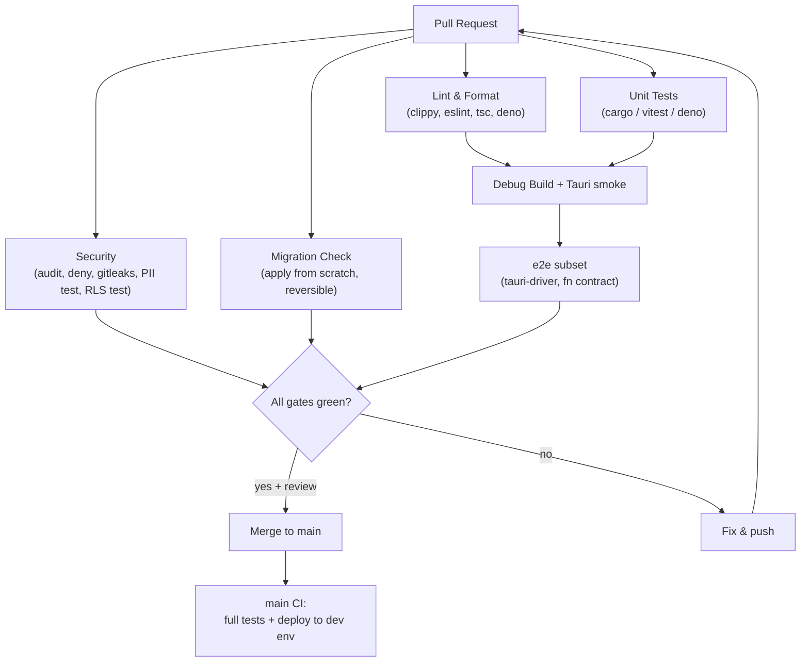
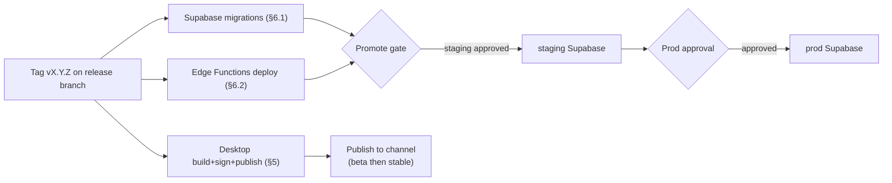
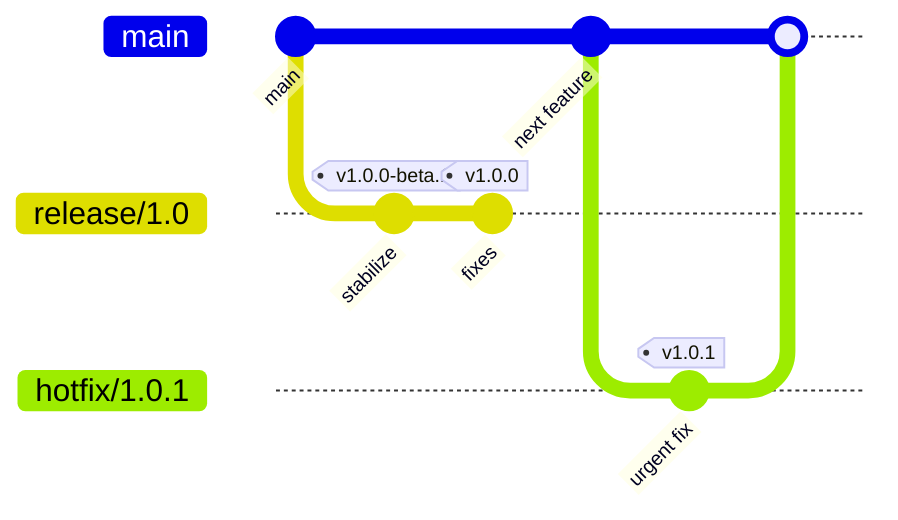
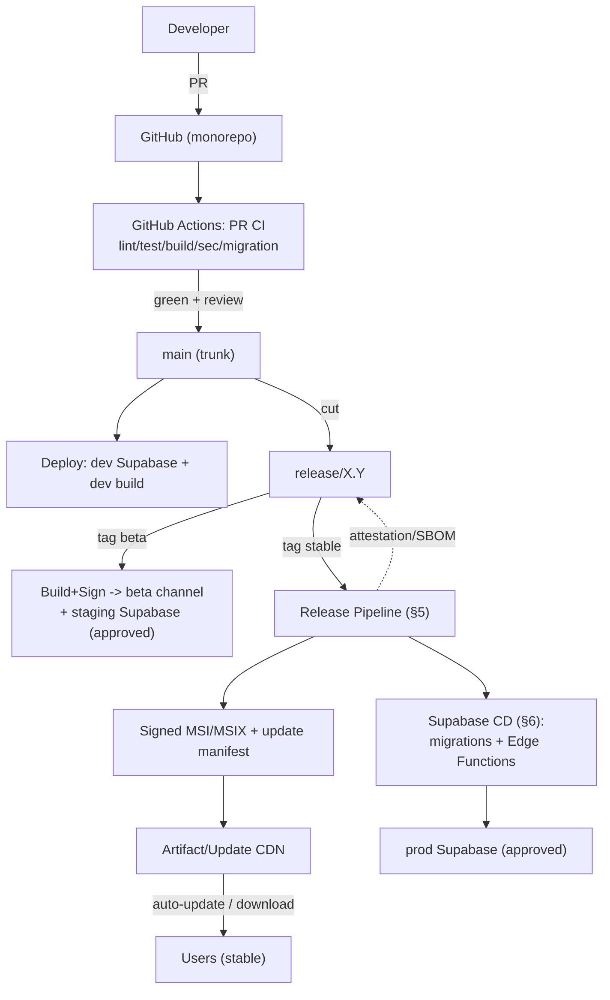

# 38. DevOps Architecture

> The CI/CD and engineering-delivery architecture for DeviceLifeline: the repository/monorepo strategy, GitHub Actions pipelines that build/lint/test the Tauri (Rust + React) desktop app, cross-compile and code-sign the Windows targets, publish artifacts, and deploy Supabase migrations + Edge Functions, plus the environment topology (dev/staging/prod), secret management, and the branch→release flow. Part of the DeviceLifeline documentation suite — see [Documentation Index](README.md).

**Status:** Draft v1 · **Authoring role:** Senior DevOps Engineer + Principal Software Architect · **Last updated:** 2026-06-07
**Related:** [40. Deployment Strategy](40-deployment-strategy.md), [39. Infrastructure Requirements](39-infrastructure-requirements.md), [37. Observability Strategy](37-observability-strategy.md), [45. Release Management Plan](45-release-management-plan.md), [43. Testing Strategy](43-testing-strategy.md), [48. Folder Structure Specification](48-folder-structure-specification.md), [17. Security Requirements](17-security-requirements.md), [30. System Architecture](30-system-architecture.md)

---

## 1. Purpose & Scope

This document defines **how DeviceLifeline code becomes signed, tested, deployable artifacts** — the CI/CD architecture for a hybrid product that is **both** a Tauri desktop application (Rust Core + React UI, Windows-first) **and** a Supabase cloud backend (Postgres schema + Edge Functions). It specifies the **repository strategy**, the **GitHub Actions** pipeline topology (build, lint, test, cross-compile Windows targets, **code signing**, artifact publishing; Supabase **migration** + **Edge Function** deploy), the **environment** model (dev/staging/prod), **secret management**, and the **branch→release** flow.

It is the **build-and-deliver** companion to [40. Deployment Strategy](40-deployment-strategy.md) (which covers *how artifacts reach users* — installers, channels, staged rollout, rollback) and to [45. Release Management Plan](45-release-management-plan.md) (cadence, versioning, sign-off). Pipeline **quality gates** consume the test suites defined in [43. Testing Strategy](43-testing-strategy.md); pipeline outputs are sized in [39. Infrastructure Requirements](39-infrastructure-requirements.md).

**In scope:** monorepo layout + tooling; CI workflows and their stages; Windows cross-compile + EV/Authenticode signing; artifact + update-manifest publishing; Supabase migration and Edge Function CD; environments and promotion; secrets (GitHub OIDC, Supabase Vault); branch model and release tagging. V1 plus near-term post-MVP (macOS/Linux build matrix stubs).

**Out of scope:** installer formats, update channels, phased rollout, feature flags, DB migration *rollout/rollback at runtime* ([40](40-deployment-strategy.md)); SLOs/alerting ([37. Observability Strategy](37-observability-strategy.md)); infra capacity/cost ([39](39-infrastructure-requirements.md)); the test cases themselves ([43](43-testing-strategy.md)); coding conventions ([47. Coding Standards](47-coding-standards.md)).

---

## 2. Assumptions

- **A1:** Source lives in **GitHub**; CI/CD is **GitHub Actions**. Windows builds run on `windows-latest` runners; Linux runners host lint/Edge/Supabase jobs. The locked stack ([30 §2](30-system-architecture.md)) is authoritative.
- **A2:** The Tauri app uses **Rust** (`cargo`) for the Core + Tauri shell and **React + TypeScript + Tailwind** (`pnpm` + Vite) for the UI; the Tauri CLI (`tauri build`) bundles the signed Windows installer. **Windows is first-class V1**; macOS/Linux jobs exist only as **stubbed/optional** matrix legs ([28](28-macos-architecture-plan.md), [29](29-linux-architecture-plan.md)).
- **A3:** **No secret ships in client code or the repo** ([17 §secrets](17-security-requirements.md), [30 AP-03](30-system-architecture.md)). LLM/billing/service-role keys live in **Supabase Vault**; CI secrets (signing cert, Supabase access token, store credentials) live in **GitHub Encrypted Secrets / Environments**, ideally fetched via **OIDC** to a cloud KMS rather than long-lived tokens.
- **A4:** There are **three long-lived environments** — `dev`, `staging`, `prod` — each a **separate Supabase project** with its own keys, and each maps to a desktop **release channel** (dev→internal, staging→beta, prod→stable) coordinated with [40](40-deployment-strategy.md).
- **A5:** Releases are **tag-driven**: a semver tag (`vX.Y.Z`) on the release branch triggers signed builds + publish; pre-releases (`vX.Y.Z-beta.N`) build to the beta channel.
- **A6:** **Database changes are migration files** (forward-only SQL with reviewed down/rollback), versioned in-repo, applied via the Supabase CLI in CI ([32 §migrations](32-database-design.md)); never applied by hand to prod.
- **A7:** Build artifacts are **reproducible enough to attribute** (version + git SHA embedded in the binary and in logs' `app_version`, [36 §4.1](36-logging-strategy.md)) and are **signed** before publish.
- **A8:** Pipelines are **fast and gated**: PR CI must pass (lint+test+build) before merge; protected branches; required reviews; no direct pushes to `main`/release branches.

---

## 3. Repository & Monorepo Strategy

DeviceLifeline is a **single monorepo** (`devicelifeline/`). Rationale: the Rust Core, Tauri shell, React UI, and Supabase backend evolve **together** and share contracts (the Tauri command/IPC API, the entity vocabulary, the sync wire shapes in [34. API Specification](34-api-specification.md)); a monorepo gives **atomic cross-cutting PRs**, one CI graph, and one source of truth for versioning. The full tree is owned by [48. Folder Structure Specification](48-folder-structure-specification.md); the DevOps-relevant top level:

```text
devicelifeline/
├─ apps/
│  └─ desktop/                 # Tauri app
│     ├─ src/                  # React + TS + Tailwind UI
│     ├─ src-tauri/            # Tauri shell (Rust) + tauri.conf.json
│     └─ package.json          # pnpm workspace member
├─ crates/
│  ├─ dl-core/                 # Rust Core: collectors, scheduler, engines, sync
│  ├─ dl-collectors-windows/   # OS-specific (trait impls) — Windows
│  └─ dl-collectors-macos/     # stub (future, behind feature flag)
├─ supabase/
│  ├─ migrations/              # forward-only SQL migrations (timestamped)
│  ├─ functions/               # Edge Functions (Deno): ai-orchestrate, sync-broker, ...
│  └─ config.toml              # Supabase project config (per-env via CI)
├─ packages/                   # shared TS (types generated from contracts)
├─ .github/workflows/          # CI/CD pipelines (this doc)
└─ Cargo.toml / pnpm-workspace.yaml
```

- **Tooling:** `cargo` workspace for crates; `pnpm` workspace for JS; **Supabase CLI** for `supabase/`. A task runner (`just`/`cargo-make`) provides identical commands locally and in CI.
- **Path-filtered CI:** jobs trigger only for changed areas (UI-only PRs skip Rust cross-compile; `supabase/migrations/**` changes trigger the DB pipeline) to keep PR feedback fast.
- **Versioning:** one product semver in `tauri.conf.json` + workspace `Cargo.toml`; Edge Functions are versioned per-function under `/<fn>/v1` ([34 §5.2](34-api-specification.md)), independent of the desktop semver but deployed from the same tag.

---

## 4. CI Pipelines (Pull-Request & Main)

PR CI is the **quality gate**; it must be green to merge. Stages run in parallel where independent (per [43](43-testing-strategy.md)).

### 4.1 PR pipeline stages

| Stage | What runs | Tooling | Gate |
|---|---|---|---|
| **Lint / format** | `cargo fmt --check`, `cargo clippy -D warnings`; `eslint`, `prettier`, `tsc --noEmit`; `deno lint` (functions); SQL lint | clippy / eslint / deno | Block on error |
| **Unit tests** | `cargo test` (Core); `vitest` (UI); `deno test` (functions) | cargo/vitest/deno | Block; coverage thresholds ([43](43-testing-strategy.md)) |
| **Build (debug)** | `cargo build` Core; `pnpm build` UI; `tauri build --debug` smoke | cargo / vite / tauri | Block |
| **Security checks** | `cargo audit` / `cargo deny`; `pnpm audit`; secret scanning; **PII-in-logs test** ([36 §6](36-logging-strategy.md)); RLS policy test suite ([32 §8](32-database-design.md)) | audit/deny/gitleaks | Block on high severity |
| **Migration check** | Spin ephemeral Postgres, apply all `supabase/migrations` from scratch; assert idempotent + reversible | Supabase CLI | Block |
| **Integration / e2e (subset)** | Tauri WebDriver smoke; Edge Function contract tests against local Supabase | tauri-driver / deno | Block on PR; full suite nightly |

### 4.2 Pipeline diagram (PR → merge → main)



- **`main` CI** runs the full test matrix (incl. nightly heavy e2e), then **auto-deploys to the `dev` environment** (Supabase `dev` project migrations + Edge Functions; an internal desktop dev build). This keeps `main` continuously deployable.

---

## 5. Release Pipeline — Desktop Build, Cross-Compile & Signing

The release pipeline is **tag-triggered** (A5). It produces **signed Windows installers** + an **update manifest** and publishes them, and it **promotes** the matching Supabase changes.

### 5.1 Build & sign stages (Windows target)

| Stage | Action | Notes |
|---|---|---|
| **Checkout + toolchain** | Pin Rust toolchain, `pnpm`, Tauri CLI; cache `cargo`/`pnpm` | Reproducible; SHA embedded |
| **Build UI** | `pnpm install --frozen-lockfile` → `pnpm build` (Vite) | Type-checked, prod bundle |
| **Cross-compile Core** | `cargo build --release` for `x86_64-pc-windows-msvc` (and `aarch64-pc-windows-msvc` post-MVP) | Matrix leg per target triple |
| **Bundle** | `tauri build` → MSI/MSIX ([40 §packaging](40-deployment-strategy.md)) | Embeds WebView2 bootstrap policy |
| **Code sign** | **Authenticode/EV signing** of the executable + installer via signing service (HSM-backed cert) | Cert never in repo; via OIDC→KMS or cloud signing API (§7) |
| **Generate update manifest** | Produce Tauri updater `latest.json` (version, signature, per-channel URLs) | Signed; consumed by auto-update ([40 §auto-update](40-deployment-strategy.md)) |
| **Publish artifacts** | Upload signed installers + manifest to **release storage / CDN**; create GitHub Release | Channel = stable/beta from tag |
| **Notarize/attest** | SBOM + provenance attestation (SLSA-style) attached to release | Supply-chain integrity |

> **Signing posture:** the Windows code-signing certificate is **EV/HSM-backed** and **never** present in the repo or a runner's filesystem; signing is performed by a dedicated **signing step** that authenticates via short-lived OIDC credentials to a cloud signing service/KMS. Unsigned artifacts are **never** published. This anchors the SmartScreen-reputation and tamper-evidence goals in [40](40-deployment-strategy.md) and [17](17-security-requirements.md).

### 5.2 Cross-platform build matrix (future)

The pipeline is authored as a **matrix** keyed on target triple so macOS (`aarch64-apple-darwin`, code-signed + notarized) and Linux (`x86_64-unknown-linux-gnu`, AppImage/`.deb`) are **additive legs**, not a new pipeline ([28](28-macos-architecture-plan.md), [29](29-linux-architecture-plan.md)). V1 enables only the Windows legs; the others are present but `continue-on-error`/skipped, exercising the portability seam ([30 AP-05](30-system-architecture.md)).

---

## 6. Supabase CD — Migrations & Edge Functions

Cloud delivery is **separate from desktop delivery** but driven from the **same tag** so a release is coherent across tiers.

### 6.1 Database migration pipeline

- Migrations are **forward-only, timestamped SQL** in `supabase/migrations/` with reviewed rollback steps ([32 §migrations](32-database-design.md)).
- **CI (PR):** apply all migrations to an **ephemeral** Postgres from scratch → assert success + reversibility + RLS tests (§4.1).
- **CD (promote):** `supabase db push` against the target environment **in order** dev → staging → prod, each behind an environment approval gate (§7). Large backfills run as **separate resumable steps**, partition-by-partition for `timeline_event` ([32 §6, §9](32-database-design.md)).
- **Expand/contract discipline:** schema changes are **backward-compatible** (add column/table first; backfill; switch reads; drop later) so an older client mid-rollout keeps working — the runtime rollout/rollback choreography is owned by [40 §migrations](40-deployment-strategy.md).

### 6.2 Edge Function deploy pipeline

- Each function (`ai-orchestrate`, `sync-broker`, `entitlements`, `stripe-webhook`, `paystack-webhook`, `templates` — [34 §5.2](34-api-specification.md)) is linted, `deno test`-ed, then deployed via `supabase functions deploy <fn>` to the target project.
- Functions are **versioned by path** (`/<fn>/v1`); a new major is a **new path segment** with the old kept for a deprecation window ([34 §versioning](34-api-specification.md)) — enabling client/function skew during rollout.
- **Secrets** (LLM keys, Stripe/Paystack secrets, service-role key) are set in the target Supabase project's **Vault**, never passed through GitHub except as the *reference/credential to set them* (§7).



---

## 7. Environments & Secret Management

### 7.1 Environment topology

| Environment | Supabase project | Desktop channel | Purpose | Promotion |
|---|---|---|---|---|
| **dev** | `dl-dev` | internal/dev build | Continuous from `main`; integration | auto on merge |
| **staging** | `dl-staging` | **beta** | Pre-prod validation, migration rehearsal, e2e | tag/pre-release + approval |
| **prod** | `dl-prod` | **stable** | Live users | tag + manual approval gate |

Each environment has **isolated** Supabase keys, Storage buckets, and billing webhooks (separate Stripe/Paystack test vs live modes). GitHub **Environments** enforce required reviewers + wait timers on `staging`/`prod` deploy jobs.

### 7.2 Secret management

| Secret class | Where it lives | How CI uses it |
|---|---|---|
| **Code-signing cert (EV)** | Cloud signing service / KMS (HSM-backed) | Signing step authenticates via **OIDC**; cert bytes never on runner |
| **Supabase access token** (CLI deploy) | GitHub Environment secret (scoped per env) | Only on the deploy job for that env |
| **LLM / billing / service-role keys** | **Supabase Vault** (per project) | **Not** used by CI app code; set once via secured admin path; Edge Functions read at runtime ([30 §8](30-system-architecture.md)) |
| **Store / distribution credentials** | GitHub Environment secret | Publish job only |
| **App-shipped config** | Public anon key + project URL only | Compiled into client (non-secret by design) |

Principles: **least-privilege, per-environment, short-lived** (prefer OIDC over static tokens); **no secret in the repo or client** ([17](17-security-requirements.md)); secret-scanning in PR CI (§4.1) blocks accidental commits; rotation runbook for cert + tokens.

---

## 8. Branch → Release Flow

A **trunk-based-with-release-branches** model balances continuous integration with controlled desktop releases.

- **`main`** = always-green trunk; every PR squash-merges after green CI + review; `main` auto-deploys to **dev**.
- **`release/X.Y`** = cut from `main` when stabilizing a version; only fixes cherry-picked in; builds to **beta**.
- **Tags:** `vX.Y.Z-beta.N` (beta channel) and `vX.Y.Z` (stable) on the release branch trigger the release + Supabase promotion pipelines.
- **`hotfix/*`** = branched from the latest stable tag for urgent prod fixes; fast-tracked through the same gates; merged back to `main` + release branch.



Versioning, cadence, changelog, and human sign-off responsibilities are owned by [45. Release Management Plan](45-release-management-plan.md); this flow is the **mechanism** those policies ride on. Release-gating against error budgets comes from [37 §6.3](37-observability-strategy.md).

---

## Diagrams

The PR pipeline graph (§4.2), the tag-driven release/Supabase promotion graph (§6), and the branch model gitGraph (§8) anchor the architecture. The diagram below shows the **end-to-end delivery topology** from commit to user + cloud, the central artifact of this document.



> Handoff: *how* `signed` artifacts reach users (installer formats, channels, staged rollout %, rollback) and *how* `supcd` is rolled out/rolled back at runtime is [40. Deployment Strategy](40-deployment-strategy.md). Pipeline health/metrics surface via [37. Observability Strategy](37-observability-strategy.md).

---

## Risks & Mitigations

| Risk | Likelihood | Impact | Mitigation |
|---|---|---|---|
| Code-signing key leak/compromise | Low | Critical | EV/HSM-backed cert; OIDC-only access; never on runner/repo; rotation runbook ([17](17-security-requirements.md)) |
| Secret committed to repo | Medium | Critical | Secret scanning gate (§4.1); pre-commit hooks; Vault for runtime secrets (§7) |
| Migration breaks prod (irreversible) | Medium | High | Apply-from-scratch CI check; expand/contract; staging rehearsal; reviewed rollback ([40](40-deployment-strategy.md)) |
| Client/Edge version skew during rollout | Medium | Medium | Path-versioned functions `/<fn>/v1`; backward-compatible schema; deprecation window ([34](34-api-specification.md)) |
| Slow CI → developer friction | Medium | Medium | Path-filtered jobs; caching; parallel stages; nightly heavy e2e off the PR path |
| Windows cross-compile/signing flakiness | Medium | Medium | Pinned toolchains; matrix isolation; retas on transient signing errors; provenance attestation |
| Wrong-environment deploy | Low | High | Per-env GitHub Environments + approvals; isolated Supabase projects/keys (§7) |
| Supply-chain (dependency) compromise | Medium | High | `cargo deny`/`pnpm audit`; lockfile-frozen installs; SBOM; pinned actions by SHA |
| macOS/Linux legs rot before launch | Medium | Low | Keep matrix legs in CI (skipped/`continue-on-error`); periodic stub builds ([28](28-macos-architecture-plan.md), [29](29-linux-architecture-plan.md)) |

---

## Future Considerations

- **Reusable composite actions / shared workflows** as the matrix grows (Windows/macOS/Linux × stable/beta).
- **Reproducible builds** + full **SLSA provenance** and signed SBOM verification at install time.
- **Ephemeral preview environments** (per-PR Supabase branch + throwaway build) for reviewers, using Supabase branching when GA.
- **Canary cloud deploys** (shift a fraction of Edge traffic to a new function version) once supported, complementing desktop phased rollout ([40](40-deployment-strategy.md)).
- **Self-hosted Windows runners** if hosted-runner signing/throughput becomes a bottleneck.
- **Auto-generated client types** from the [34. API Specification](34-api-specification.md) contracts as a CI step to prevent UI/Core/Edge drift.
- **Infrastructure-as-Code** for Supabase project config + analytics/error tooling ([39](39-infrastructure-requirements.md)).

---

## Acceptance Criteria

- [ ] AC-01: A monorepo strategy is defined (apps/crates/supabase/packages) with path-filtered CI and single-source versioning (§3, [48](48-folder-structure-specification.md)).
- [ ] AC-02: PR CI runs lint, unit tests, debug build, security/PII/RLS checks, and a from-scratch migration check, all as merge gates (§4).
- [ ] AC-03: The release pipeline cross-compiles the Windows target, **code-signs** (EV/HSM), generates a signed update manifest, and publishes artifacts (§5).
- [ ] AC-04: Supabase migrations and Edge Functions deploy from the same release tag, environment-gated dev→staging→prod, with expand/contract discipline (§6).
- [ ] AC-05: Three isolated environments (dev/staging/prod) map to desktop channels and separate Supabase projects with approval gates (§7.1).
- [ ] AC-06: Secret management keeps signing keys in a KMS/signing service (OIDC), runtime secrets in Supabase Vault, and **no secret in repo/client** (§7.2, [17](17-security-requirements.md), [30 AP-03](30-system-architecture.md)).
- [ ] AC-07: A trunk-based branch→release flow (main → release/X.Y → tags, hotfix) is specified and tied to [45](45-release-management-plan.md) (§8).
- [ ] AC-08: Pipeline diagrams render on GitHub (PR CI, release/Supabase promotion, branch model, end-to-end topology).
- [ ] AC-09: Hand-offs are explicit: artifact delivery/rollout to [40](40-deployment-strategy.md), pipeline health to [37](37-observability-strategy.md), test cases to [43](43-testing-strategy.md).
- [ ] AC-10: The MVP boundary is respected; macOS/Linux matrix legs, preview envs, canary cloud deploys, and IaC are labeled post-MVP.
