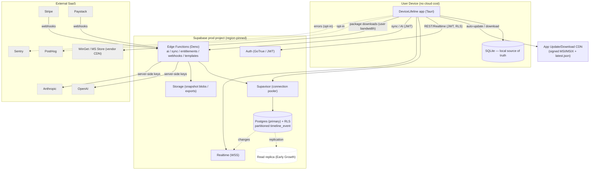
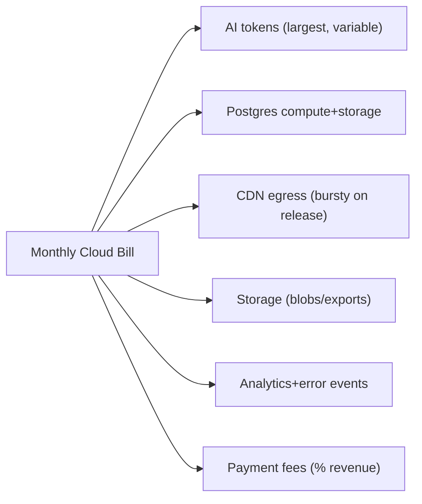

# 39. Infrastructure Requirements

> The complete infrastructure inventory for DeviceLifeline: every cloud and third-party component (Supabase Postgres/Storage/Auth/Edge Functions, the app update/download CDN, AI API capacity, Stripe/Paystack, PostHog, Sentry), with per-environment needs, capacity assumptions, regions/data residency, and the cost drivers that dominate the bill. Part of the DeviceLifeline documentation suite — see [Documentation Index](README.md).

**Status:** Draft v1 · **Authoring role:** Senior DevOps Engineer + Principal Software Architect · **Last updated:** 2026-06-07
**Related:** [38. DevOps Architecture](38-devops-architecture.md), [40. Deployment Strategy](40-deployment-strategy.md), [41. Scalability Strategy](41-scalability-strategy.md), [42. Disaster Recovery Plan](42-disaster-recovery-plan.md), [30. System Architecture](30-system-architecture.md), [18. Compliance Requirements](18-compliance-requirements.md), [13. Monetization Strategy](13-monetization-strategy.md), [37. Observability Strategy](37-observability-strategy.md)

---

## 1. Purpose & Scope

This document is the **infrastructure bill of materials** for DeviceLifeline: it inventories **every** component the platform depends on, states **per-environment** (dev/staging/prod) sizing, captures **capacity assumptions** at MVP and early-growth scale, fixes **regions / data residency**, and names the **cost drivers** an FP&A or platform owner must watch. It is the resource-and-cost ground truth that [41. Scalability Strategy](41-scalability-strategy.md) scales **up** and [42. Disaster Recovery Plan](42-disaster-recovery-plan.md) makes **resilient**.

Because DeviceLifeline is **offline-first** ([30 AP-01](30-system-architecture.md)), the **device** is "infrastructure we don't pay for" — the user's machine runs the Rust Core + SQLite at no cloud cost. The cloud bill is therefore driven by **opt-in sync, AI, billing, and fleet** workloads, which keeps unit economics favorable ([13. Monetization Strategy](13-monetization-strategy.md)) and is reflected throughout.

**In scope:** the component inventory + responsibilities; Supabase sizing (Postgres compute/storage, Storage, Auth, Edge Functions); the desktop **update/download distribution (CDN)**; **AI API capacity** (OpenAI/Anthropic); **Stripe/Paystack**; **PostHog**; **Sentry**; per-environment requirements; capacity assumptions; regions; cost drivers. V1 plus near-term post-MVP.

**Out of scope:** CI/CD runner specifics ([38. DevOps Architecture](38-devops-architecture.md)); how artifacts are rolled out ([40. Deployment Strategy](40-deployment-strategy.md)); the scaling *mechanisms* (partitioning, pooling, replicas) themselves ([41](41-scalability-strategy.md)); backup/restore *procedures* ([42](42-disaster-recovery-plan.md)); SLOs/alerting ([37. Observability Strategy](37-observability-strategy.md)).

---

## 2. Assumptions

- **A1:** The locked stack is authoritative ([30 §2](30-system-architecture.md)): **Supabase** is the managed backend (Postgres, Auth/GoTrue, Storage, Edge Functions/Deno, Realtime, RLS); **OpenAI + Anthropic** for AI via Edge Functions; **Stripe + Paystack** for billing; **PostHog** + **Sentry** for analytics/errors; **WinGet/MS Store** package CDNs are vendor-operated (we don't host them).
- **A2:** **Windows V1, offline-first.** Core local features cost **zero** cloud resources; cloud cost is incurred only by opt-in sync, AI queries, billing webhooks, fleet reads, and telemetry.
- **A3:** **Three environments** = **three separate Supabase projects** (`dl-dev`, `dl-staging`, `dl-prod`), each with isolated keys, Storage, and billing (test vs live) ([38 §7](38-devops-architecture.md)).
- **A4:** **Region-pinned** primary in a US or EU region for the prod Supabase project, chosen for data residency ([18. Compliance Requirements](18-compliance-requirements.md)); EU-resident customers may require an EU project (post-MVP multi-region).
- **A5:** **No secret on device** ([30 AP-03](30-system-architecture.md)); AI/billing/service-role keys live in Supabase Vault — so "AI capacity" is provisioned as **provider account quotas/rate limits**, not client keys.
- **A6:** Capacity figures below are **planning assumptions** for MVP (low thousands of active devices) and **Early Growth** (tens of thousands), to be re-baselined against real telemetry ([37](37-observability-strategy.md)); they are sizing inputs, not commitments.
- **A7:** **Raw `HealthSample` never leaves the device**; only `HealthScore` rollups and the opt-in synced subset of `TimelineEvent`/snapshots reach Postgres/Storage ([32 §6](32-database-design.md)) — the single biggest cloud-cost-containment fact.
- **A8:** All third-party services are reached over TLS; managed services inherit their vendor's SLAs ([07 A3](07-non-functional-requirements.md)).

---

## 3. Component Inventory

Every infrastructure component, its provider/tier, what it does, and its dominant cost driver. IDs reuse the external/service registry style from [31. Service Architecture Diagram Specification](31-service-architecture-diagram-spec.md).

| Component | Provider / type | Responsibility | Primary cost driver | Scale ref |
|---|---|---|---|---|
| **Postgres (primary)** | Supabase (managed) | Accounts, licensing/subscriptions, fleet, opt-in synced device subset, `audit_log` | Compute instance size + storage + egress | [41 §Postgres](41-scalability-strategy.md) |
| **Connection pooler (Supavisor)** | Supabase | Multiplex many client/Edge connections → bounded Postgres conns | Included; concurrency ceiling | [41 §pooling](41-scalability-strategy.md) |
| **Supabase Storage** | Supabase (object) | Snapshot blobs, exports, shared templates, shared support bundles | GB-stored + egress + requests | [41 §storage](41-scalability-strategy.md) |
| **Supabase Auth (GoTrue)** | Supabase | Identity, JWT issuance, sessions | MAU (per Supabase plan) | — |
| **Edge Functions (Deno)** | Supabase (serverless) | `ai-orchestrate`, `sync-broker`, `entitlements`, `stripe-webhook`, `paystack-webhook`, `templates` ([34 §5.2](34-api-specification.md)) | Invocations + compute-seconds + concurrency | [41 §edge](41-scalability-strategy.md) |
| **Realtime** | Supabase | WSS push of cloud changes to UI (cross-device/fleet) | Concurrent connections + messages | [41 §fleet](41-scalability-strategy.md) |
| **App Update / Download CDN** | CDN + object store (e.g., Cloudflare/Bunny/S3+CDN) | Host signed installers (MSI/MSIX) + Tauri update manifest (`latest.json`); serve stable/beta channels | GB egress (installer size × downloads) | [40 §distribution](40-deployment-strategy.md) |
| **OpenAI API** | OpenAI (external) | LLM for AI Detective (primary or per routing) | **Tokens (prompt+completion) × model price** | [41 §AI](41-scalability-strategy.md) |
| **Anthropic API** | Anthropic (external) | LLM (alternate/failover/specialized) | Tokens × model price | [41 §AI](41-scalability-strategy.md) |
| **Stripe** | Stripe (external) | Global cards/subscriptions; webhooks → `EFN-STRIPE` | % of transaction volume | [14. Subscription Plans](14-subscription-plans.md) |
| **Paystack** | Paystack (external) | Africa/local payment methods; webhooks → `EFN-PAYSTACK` | % of transaction volume | [14](14-subscription-plans.md) |
| **PostHog** | PostHog (cloud/self-host) | Opt-in product analytics + opt-in op aggregates ([37 §5](37-observability-strategy.md)) | Events ingested/month | [35. Event Tracking](35-event-tracking-specification.md) |
| **Sentry** | Sentry (external) | Errors/crashes (Rust panic+minidump, JS, Edge) | Events/transactions ingested | [36. Logging](36-logging-strategy.md) |
| **Package sources** | WinGet / MS Store (vendor) | Software install/restore downloads | **Vendor-hosted; $0 to us** (user bandwidth) | [26. Install Engine](26-software-installation-engine-design.md) |
| **DNS / TLS / domain** | Registrar + CDN/Supabase | Domain, certs for app/API endpoints | Negligible (flat) | — |
| **CI/CD + signing** | GitHub Actions + signing service/KMS | Build/test/sign/publish | Runner minutes + signing svc | [38](38-devops-architecture.md) |

> **Key economic insight:** the device + the vendor-operated package CDNs carry the heaviest compute/bandwidth (collection, install downloads) at **no cost to DeviceLifeline**. The platform pays mainly for **AI tokens**, **Postgres compute/storage**, **CDN egress for installers**, and **analytics/error event volume**.

---

## 4. Supabase Sizing

### 4.1 Postgres (primary)

| Parameter | MVP (low thousands of devices) | Early Growth (tens of thousands) | Notes |
|---|---|---|---|
| Compute tier | Small/Medium managed instance | Medium/Large + read replica(s) | Vertical first, then replicas ([41](41-scalability-strategy.md)) |
| Storage | Tens of GB | Hundreds of GB | Driven by synced `timeline_event` (partitioned) + `health_score` rollups; raw health never stored (A7) |
| Connections | Bounded by **Supavisor** pool (e.g., ≤ 100–200 effective) | Same ceiling; pooler absorbs growth | Edge Functions + UI share via pooler ([41 §pooling](41-scalability-strategy.md)) |
| Partitioning | `timeline_event` monthly range partitions ([32 §6](32-database-design.md)) | + automated `pg_partman`, detached-partition archival | Retention = partition drop |
| Backups/PITR | Continuous WAL PITR (rolling window) + snapshots | Longer PITR + cross-region copy | Full design in [42](42-disaster-recovery-plan.md) |

### 4.2 Storage, Auth, Edge Functions, Realtime

| Service | MVP assumption | Early Growth | Cost driver |
|---|---|---|---|
| **Storage** | Snapshot blobs are **compressed + deduped by content hash**; many devices store small JSON-ish blobs; tens–low-hundreds of GB | Hundreds of GB–TB; lifecycle to cold tier | GB-stored + egress; retention-bound ([20](20-data-retention-policies.md)) |
| **Auth** | MAU = active subscribers + free accounts that signed in | Scales with MAU | Per-plan MAU |
| **Edge Functions** | Dominated by `ai-orchestrate` + `sync-broker`; modest invocations/device | Concurrency headroom for fleets; stateless scale-out | Invocations + compute-seconds + concurrency ([41 §edge](41-scalability-strategy.md)) |
| **Realtime** | Light (cross-device users); off for single-device | Heavier for Business fleets watching live state | Concurrent WSS + messages |

---

## 5. App Update / Download Distribution (CDN)

Desktop distribution is **DeviceLifeline-hosted** (unlike the vendor package CDNs). It serves:

- **Signed installers** (MSI/MSIX) for **direct download** and **auto-update** ([40 §packaging, §auto-update](40-deployment-strategy.md)).
- The **Tauri update manifest** (`latest.json`) per **channel** (stable/beta), pointing at the right signed artifact + signature.
- A **WebView2 bootstrap** policy/asset where needed.

| Parameter | Assumption | Cost driver |
|---|---|---|
| Object store | Versioned bucket of signed artifacts + manifests | GB-stored (small; few versions × installer size) |
| CDN edge | Global cache of installers/manifests | **GB egress = installer size × (new installs + updates)** |
| Channels | `stable` + `beta` manifests; staged rollout reads % from manifest/flag | — |
| Integrity | Artifacts are EV-signed ([38 §5](38-devops-architecture.md)); manifest signed for updater | — |
| Microsoft Store path | Store hosts its own distribution for Store-delivered users | $0 egress to us for that channel |

> Update egress is **bursty** (a new release pulls updates fleet-wide). Phased rollout ([40 §staged rollout](40-deployment-strategy.md)) both protects users **and smooths egress cost**.

---

## 6. AI API Capacity

AI is the **dominant variable cost** and the most capacity-sensitive dependency.

| Parameter | Assumption / requirement | Notes |
|---|---|---|
| Provisioning model | Provider **account quotas + rate limits** (RPM/TPM), keys in Vault (A5) | Not per-client; brokered by `EFN-AI` |
| Per-query cost | **Prompt + completion tokens × model price**; minimized by **on-device pre-processing/redaction** sending ids/aggregates, not raw data ([22. AI Diagnostics](22-ai-diagnostics-design.md), [30 §8](30-system-architecture.md)) | Smaller prompts = lower cost + better privacy |
| Throughput control | Per-**Entitlement** monthly query caps + per-minute burst ([34 §3](34-api-specification.md)) | Bounds spend per tier; protects provider limits |
| Multi-provider | OpenAI **and** Anthropic configured; failover + model routing | Resilience to a provider outage/limit ([37 §8](37-observability-strategy.md)) |
| Cost observability | Token **$** per provider/model/function dashboard + spike alert (OBS-022, [37 §7](37-observability-strategy.md)) | FP&A visibility |
| Scaling | Cheaper/smaller models for summarization; caching of repeat diagnoses ([41 §AI](41-scalability-strategy.md)) | Cost-throughput tuning |

---

## 7. Per-Environment Requirements

| Dimension | dev (`dl-dev`) | staging (`dl-staging`) | prod (`dl-prod`) |
|---|---|---|---|
| Postgres | Smallest tier; ephemeral data | Mid tier; prod-like, anonymized seed | Sized per §4.1; PITR + replica path |
| Storage | Small bucket | Prod-like; lifecycle tested | Sized per §4.2; retention enforced |
| Edge Functions | Deployed from `main`; low quota | Full deploy; rehearse migrations | Full; autoscaled; concurrency headroom |
| AI providers | Cheap/dev models; low caps | Prod models; capped budget | Full quotas; per-Entitlement caps |
| Billing | Stripe/Paystack **test mode** | Test mode | **Live mode** |
| Analytics/Errors | Separate PostHog/Sentry project or env tag | Separate env tag | Prod projects; full retention ([20](20-data-retention-policies.md)) |
| CDN | No public distribution (internal builds) | **beta** channel | **stable** + **beta** channels |
| Access | Engineers | Engineers + release | Least-privilege; gated deploys ([38 §7](38-devops-architecture.md)) |

Environments are **isolated** (separate keys, buckets, webhooks); no shared state. Promotion dev→staging→prod is gated ([38 §6](38-devops-architecture.md)).

---

## 8. Regions & Data Residency

- **prod primary region** is pinned (US or EU) for data residency, chosen with [18. Compliance Requirements](18-compliance-requirements.md). All Postgres/Storage/Edge for prod live in that region.
- **EU-residency** customers may require an **EU-region Supabase project**; the architecture supports this because the cloud is OS-agnostic and tenancy is RLS-keyed ([30 §11](30-system-architecture.md)) — multi-region is a **post-MVP** lever ([41](41-scalability-strategy.md)).
- **CDN** is **global edge** by nature (installers are non-personal, signed artifacts) — no residency constraint on the binary; residency applies to **personal data** (Postgres/Storage).
- **AI providers** process redacted, residency-aware context; provider region/zero-retention options are evaluated where required ([18](18-compliance-requirements.md)).
- **Analytics/Errors:** PostHog/Sentry data-region selection aligns with residency ([19. Privacy Requirements](19-privacy-requirements.md), [20](20-data-retention-policies.md)).

---

## 9. Cost Drivers (what dominates the bill)

| Rank | Driver | Lever to control | Doc |
|---|---|---|---|
| 1 | **AI tokens** (OpenAI/Anthropic) | On-device redaction shrinks prompts; per-Entitlement caps; cheaper models; caching | [22](22-ai-diagnostics-design.md), [41 §AI](41-scalability-strategy.md) |
| 2 | **Postgres compute + storage** | Partition + retention drop; raw health never stored; replicas only when needed | [32 §6](32-database-design.md), [41](41-scalability-strategy.md) |
| 3 | **CDN egress** (installer downloads/updates) | Phased rollout smooths bursts; delta/compressed updates; Store channel offloads | [40](40-deployment-strategy.md) |
| 4 | **Storage** (snapshot blobs/exports) | Content-hash dedup + compression; retention/lifecycle to cold tier | [20](20-data-retention-policies.md) |
| 5 | **Analytics + error events** | Opt-in only; sampling; aggregate-then-prune raw | [35](35-event-tracking-specification.md), [36](36-logging-strategy.md) |
| 6 | **Payment fees** | % of revenue (pass-through economics) | [13](13-monetization-strategy.md) |
| — | Auth MAU, Realtime, Edge compute | Pooling, stateless scale-out, Realtime only where needed | [41](41-scalability-strategy.md) |

> The **offline-first** design (A2/A7) is the structural reason DeviceLifeline's marginal cost per device is low: the expensive collection/compute happens on the user's hardware, and only small, opt-in, redacted data touches paid cloud.

---

## Diagrams

### 10.1 Infrastructure topology

### 10.2 Cost-driver weighting (relative)

---

## Risks & Mitigations

| Risk | Likelihood | Impact | Mitigation |
|---|---|---|---|
| AI token cost runs away | Medium | High | Per-Entitlement caps ([34](34-api-specification.md)); redaction shrinks prompts; cost dashboard + alert (OBS-022); cheaper models/caching ([41](41-scalability-strategy.md)) |
| Postgres storage bloat from sync | High | Medium | Raw health never synced (A7); partitioned timeline + retention drop ([32 §6](32-database-design.md)); opt-in sync |
| CDN egress spike on release | Medium | Medium | Phased rollout ([40](40-deployment-strategy.md)); compressed/delta updates; Store channel offload |
| Vendor lock-in (Supabase) | Medium | Medium | Standard Postgres/REST/JWT; thin Edge brokers; documented exit (self-host Supabase) ([30](30-system-architecture.md), [42](42-disaster-recovery-plan.md)) |
| Region/residency non-compliance | Medium | High | Region-pinned prod; EU project option; provider data-region selection ([18](18-compliance-requirements.md)) |
| Provider (AI/billing) outage or quota cut | Medium | High | Multi-provider AI failover; idempotent webhooks; offline-first shields core features ([37 §8](37-observability-strategy.md)) |
| Capacity assumptions wrong | Medium | Medium | Re-baseline from real telemetry ([37](37-observability-strategy.md)); vertical-first headroom; scale levers staged ([41](41-scalability-strategy.md)) |
| Connection exhaustion under fleet load | Medium | High | Supavisor pooling ceiling; Edge concurrency limits; read replicas ([41 §pooling](41-scalability-strategy.md)) |

---

## Future Considerations

- **Multi-region** Supabase (EU/US) for residency + latency, with tenancy routed by Account region ([18](18-compliance-requirements.md), [41](41-scalability-strategy.md)).
- **Read replicas + columnar/Timescale rollup store** as fleet analytics grow ([32](32-database-design.md), [41](41-scalability-strategy.md)).
- **Cold-storage lifecycle** for old snapshot blobs + detached partitions (cheaper tier).
- **Self-hosted Supabase / on-prem** option for enterprise data-residency mandates ([18](18-compliance-requirements.md)).
- **Infrastructure-as-Code** for all three Supabase projects + CDN + analytics/error tooling ([38](38-devops-architecture.md)).
- **Delta/differential desktop updates** to cut CDN egress and update size.
- **Reserved/committed-use** discounts (AI providers, CDN) once volume is predictable; unit-economics dashboards ([13](13-monetization-strategy.md)).
- **macOS/Linux distribution** infra (notarization, Homebrew, AppImage/`.deb` hosting) added to the same CDN ([28](28-macos-architecture-plan.md), [29](29-linux-architecture-plan.md)).

---

## Acceptance Criteria

- [ ] AC-01: A complete component inventory lists Supabase (Postgres/Storage/Auth/Edge/Realtime/pooler), the update/download CDN, AI (OpenAI+Anthropic), Stripe/Paystack, PostHog, Sentry, and vendor package CDNs, each with a responsibility + cost driver (§3).
- [ ] AC-02: Supabase sizing covers Postgres compute/storage/connections/partitioning and Storage/Auth/Edge/Realtime at MVP + Early-Growth scale (§4).
- [ ] AC-03: The app update/download CDN is specified (signed artifacts + manifest, channels, egress as the cost driver), distinct from vendor package CDNs (§5).
- [ ] AC-04: AI API capacity is defined via provider quotas/limits, per-Entitlement caps, redaction-driven prompt minimization, multi-provider failover, and cost observability (§6).
- [ ] AC-05: Per-environment requirements (dev/staging/prod) are tabulated with isolation and billing test-vs-live (§7, [38 §7](38-devops-architecture.md)).
- [ ] AC-06: Regions/data residency are addressed (region-pinned prod, EU option, CDN-global-vs-personal-data) consistent with [18](18-compliance-requirements.md) (§8).
- [ ] AC-07: Cost drivers are ranked with control levers, and the offline-first low-marginal-cost insight is stated (§9, [13](13-monetization-strategy.md)).
- [ ] AC-08: A topology diagram and a cost-driver diagram render on GitHub (§10).
- [ ] AC-09: Hand-offs are explicit to [41](41-scalability-strategy.md) (scaling), [42](42-disaster-recovery-plan.md) (DR/backup), [40](40-deployment-strategy.md) (distribution), [38](38-devops-architecture.md) (CI/CD).
- [ ] AC-10: The MVP boundary is respected; multi-region, replicas, cold storage, IaC, delta updates, and macOS/Linux infra are labeled post-MVP.
