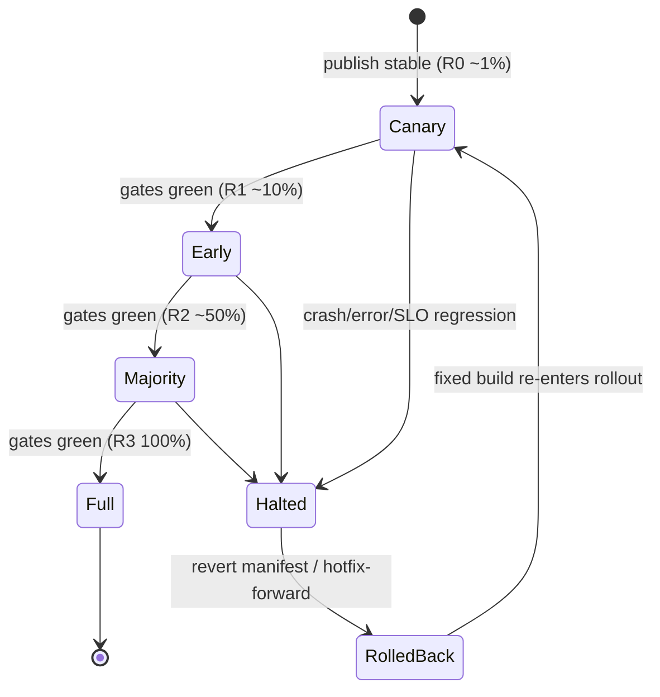
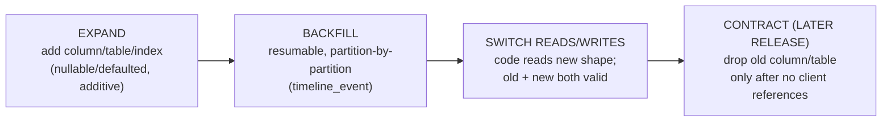
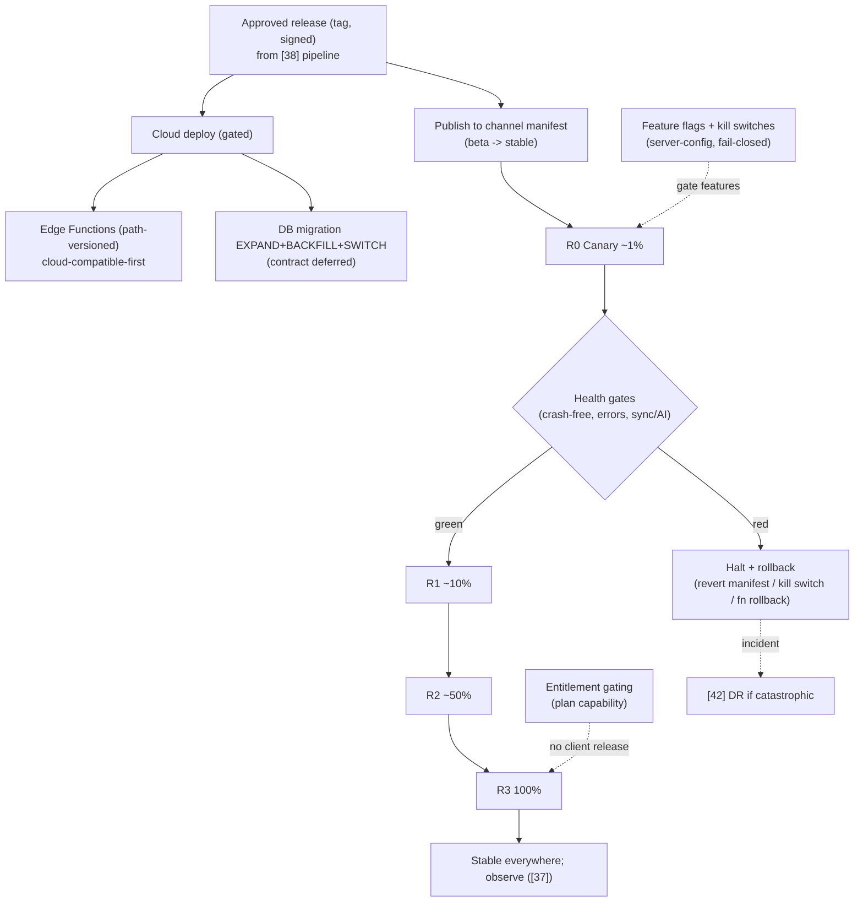

# 40. Deployment Strategy

> How DeviceLifeline reaches users and production: desktop distribution (MSI/MSIX, Microsoft Store, direct download), auto-update channels (stable/beta), staged/phased rollouts with rollback, Supabase + Edge Function deploys, database migration rollout/rollback choreography, and feature flags. Part of the DeviceLifeline documentation suite — see [Documentation Index](README.md).

**Status:** Draft v1 · **Authoring role:** Senior DevOps Engineer + Site Reliability Engineer · **Last updated:** 2026-06-07
**Related:** [38. DevOps Architecture](38-devops-architecture.md), [39. Infrastructure Requirements](39-infrastructure-requirements.md), [45. Release Management Plan](45-release-management-plan.md), [37. Observability Strategy](37-observability-strategy.md), [42. Disaster Recovery Plan](42-disaster-recovery-plan.md), [27. Windows Architecture Plan](27-windows-architecture-plan.md), [32. Database Design](32-database-design.md), [34. API Specification](34-api-specification.md), [14. Subscription Plans](14-subscription-plans.md)

---

## 1. Purpose & Scope

This document defines **how a built, signed release becomes a running update on a user's machine and in production cloud** — the deployment half of delivery. It covers **desktop distribution** (MSI/MSIX, Microsoft Store, direct download), **auto-update channels** (stable/beta) using the Tauri updater, **staged/phased rollouts** with **rollback**, **Supabase + Edge Function** production deploys, **database migration** rollout/rollback choreography (the runtime side of the schema changes built in [38](38-devops-architecture.md)/[32](32-database-design.md)), and **feature flags** for decoupling code-ship from feature-on.

It consumes the artifacts produced by [38. DevOps Architecture](38-devops-architecture.md) (signed installers, update manifests, environment-gated Supabase CD) and is governed by [45. Release Management Plan](45-release-management-plan.md) (cadence, sign-off). Rollout health is judged against [37. Observability Strategy](37-observability-strategy.md) (crash-free, error budgets); catastrophic-failure recovery escalates to [42. Disaster Recovery Plan](42-disaster-recovery-plan.md).

**In scope:** installer formats + distribution channels; updater + channel model; phased rollout %, halt/rollback criteria; Supabase migration + Edge Function deploy choreography; **expand/contract** migration and rollback at runtime; feature-flag model + kill switches; client/cloud version-skew handling. V1 plus near-term post-MVP.

**Out of scope:** building/signing artifacts and the CI/CD graph ([38](38-devops-architecture.md)); infra sizing/CDN cost ([39. Infrastructure Requirements](39-infrastructure-requirements.md)); SLO definitions ([37](37-observability-strategy.md)); DR backup mechanics ([42](42-disaster-recovery-plan.md)); Windows packaging internals/code-signing posture detail ([27 §8](27-windows-architecture-plan.md), [38 §5](38-devops-architecture.md)).

---

## 2. Assumptions

- **A1:** The app is **Tauri (Windows-first V1)**; releases are **EV/Authenticode-signed** MSI/MSIX with a **signed Tauri update manifest** (`latest.json`) per channel, produced by the release pipeline ([38 §5](38-devops-architecture.md)). macOS/Linux distribution is **post-MVP** ([28](28-macos-architecture-plan.md), [29](29-linux-architecture-plan.md)).
- **A2:** **Offline-first** ([30 AP-01](30-system-architecture.md)): the desktop app keeps working without the cloud; a cloud deploy or rollback never bricks core local features. Updates are downloaded from the **DeviceLifeline CDN** (or Microsoft Store for that channel) ([39 §5](39-infrastructure-requirements.md)).
- **A3:** **Three environments** dev/staging/prod map to channels internal/**beta**/**stable**; prod deploys are **approval-gated** ([38 §7](38-devops-architecture.md)).
- **A4:** **Edge Functions are versioned by path** (`/<fn>/v1`) and **Postgres migrations are expand/contract** (backward-compatible), so an older client and a newer cloud (or vice-versa) **interoperate during a rollout** ([34 §versioning](34-api-specification.md), [32](32-database-design.md)).
- **A5:** **Capability is gated by Entitlement**, not hard-coded tier checks, so plan/feature availability changes need **no client release** ([34 A7](34-api-specification.md), [14. Subscription Plans](14-subscription-plans.md)); this complements feature flags.
- **A6:** Rollout **health signals** come from [37](37-observability-strategy.md): per-version **crash-free sessions** (SLO-10), error spikes, sync/AI success — these drive **halt/rollback** decisions automatically and manually.
- **A7:** Database changes are **forward-only** with reviewed reversibility; **destructive** changes (drop column/table) happen **only after** all supported clients no longer reference them (a later release) ([32 §migrations](32-database-design.md)).
- **A8:** Feature flags + Entitlements are evaluated with **safe defaults** (off / least-privilege) and **fail closed** if the resolver is unreachable, while core local features remain available offline.

---

## 3. Desktop Distribution

DeviceLifeline ships through **three channels**, all from the same signed artifacts:

| Channel | Format | Audience | Update mechanism | Notes |
|---|---|---|---|---|
| **Direct download** | **MSI** (+ MSIX) from CDN | Power users, businesses, MSPs | **Tauri auto-updater** via signed `latest.json` | Primary V1 path; full control over phased rollout |
| **Microsoft Store** | **MSIX** | Mainstream consumers | **Store-managed** updates | Store handles distribution/egress; phased % governed by Store tooling |
| **Enterprise / fleet** | **MSI** for silent/managed install | Business Edition, MSPs (Intune/SCCM/GPO) | Managed by IT, or DL updater per policy | Per-machine MSI; unattended switches; [57. Business Edition](57-business-edition-specification.md) |

- **MSI vs MSIX:** MSI is the **primary** direct-download/enterprise format (silent install, broad compatibility, IT tooling); MSIX powers the **Microsoft Store** and modern packaging. Both are EV-signed ([38 §5](38-devops-architecture.md)).
- **Background components:** install configures the Windows **service + scheduled task** that run the Rust Core ([27 §5–§6](27-windows-architecture-plan.md)); uninstall cleanly removes them and (optionally) local data per the user's choice.
- **First-run + WebView2:** the installer ensures the **WebView2 runtime** (bootstrap) is present ([27 §8](27-windows-architecture-plan.md)).

---

## 4. Auto-Update Channels

The **Tauri updater** checks the channel's signed manifest, downloads the delta/installer, verifies the **signature**, and applies on next launch (or prompts), then the new build self-attributes via `app_version` ([36 §4.1](36-logging-strategy.md)).

| Channel | Manifest | Who | Cadence | Rollout |
|---|---|---|---|---|
| **stable** | `stable/latest.json` | All production users (default) | Normal release cadence ([45](45-release-management-plan.md)) | **Phased** (§5) |
| **beta** | `beta/latest.json` | Opt-in testers, internal, MSP pilots | Ahead of stable | Faster/full to small cohort |
| **(dev/internal)** | internal | Engineers/CI | Continuous from `main` | n/a |

- **Update integrity:** the updater verifies the manifest/artifact **signature** before applying; an unsigned or mismatched update is **refused** ([17. Security Requirements](17-security-requirements.md)).
- **Channel switching** is a user/IT setting; beta users can return to stable (with a guard against silent downgrade across incompatible schema, §7).
- **Egress smoothing:** because updates are bursty, phased rollout also flattens CDN egress ([39 §5](39-infrastructure-requirements.md)).

---

## 5. Staged / Phased Rollout & Rollback

New **stable** desktop releases roll out **in phases**, watched against health signals, with a fast **halt** and **rollback**.

### 5.1 Phased rollout rings

| Ring | Audience | % | Promote when (gate) |
|---|---|---|---|
| **R0 Canary** | Internal + opt-in beta graduates | ~1% | Crash-free ≥ SLO-10, no error spike, AI/sync nominal over bake time |
| **R1 Early** | Broader opt-in + low-risk cohort | ~10% | Same gates hold over 24–48h |
| **R2 Majority** | General population | ~50% | Gates hold; no SEV-1/2 ([37 §8](37-observability-strategy.md)) |
| **R3 Full** | Everyone on stable | 100% | Gates hold |

- **Mechanism:** the **percentage is encoded in the manifest/rollout config** (and/or a feature-flag gate); the updater only offers the new version to in-ring clients. Microsoft Store uses its own phased-rollout control for the Store channel.
- **Bake time** between rings gives [37](37-observability-strategy.md) signals time to surface regressions per version.

### 5.2 Halt & rollback criteria

| Trigger | Action |
|---|---|
| Per-version crash-free < 99% (SLO-10 regression) | **Halt** promotion; investigate; rollback if confirmed |
| Error spike / new top Sentry issue post-deploy | Halt; assess; rollback |
| Sync/AI success drops below SLO on the new version | Halt; rollback |
| SEV-1 attributable to the release | Immediate **rollback** + incident ([42](42-disaster-recovery-plan.md)) |

- **Desktop rollback** = **roll **forward** to the previous known-good version** by pointing the channel manifest back (clients update to the prior build). True downgrade-in-place is constrained by schema (§7), so the standard play is **halt + hotfix-forward**; a re-published prior build is used only when safe (no schema-forward dependency).
- **Cloud rollback** = redeploy the previous Edge Function version (path-versioned) and/or apply the migration's reviewed **down** step (§6).

---

## 6. Supabase & Edge Function Deploys + DB Migration Rollout/Rollback

Cloud deploys are **environment-gated** ([38 §6](38-devops-architecture.md)); this section is the **runtime choreography** of making them safe.

### 6.1 Edge Function deploy

- Deploy is **atomic per function** to the target project; functions are **path-versioned** (`/<fn>/v1`), so a new major is additive and the old stays for a **deprecation window** — older clients keep calling the version they know ([34 §versioning](34-api-specification.md)).
- **Order:** deploy **cloud-compatible-first** — new function versions that **tolerate both old and new** clients go out before the client release; client switches to a new function major only after it's live.
- **Rollback:** redeploy the prior function build (kept) or route clients back to the previous path version.

### 6.2 Database migration rollout (expand/contract)

Migrations are **forward-only, backward-compatible**, applied in three logical phases so a **mixed fleet** (old + new clients) never breaks ([32 §migrations](32-database-design.md), [38 §6.1](38-devops-architecture.md)):

| Phase | Property | Rollback |
|---|---|---|
| **Expand** | Additive, non-breaking; safe on live prod | Drop the added object (no data loss) |
| **Backfill** | Resumable, idempotent; partition-by-partition for high-volume ([32 §6](32-database-design.md)) | Re-runnable; pause/resume |
| **Switch** | Reads/writes move to new shape; old still readable | Flip code/flag back to old shape |
| **Contract** | **Deferred** to a release after all clients upgraded (A7) | Only run when irreversible-safe |

- **Rehearsed in staging** with prod-like, anonymized data before prod ([39 §7](39-infrastructure-requirements.md)).
- **Destructive/contract** steps gated by confirming the **minimum supported client** no longer references the dropped shape — tying desktop rollout (§5) to schema lifecycle.
- **Catastrophic** migration failure → restore/PITR path in [42. Disaster Recovery Plan](42-disaster-recovery-plan.md).

### 6.3 Version skew & minimum supported client

- The client sends `X-DL-Api-Version`; Edge Functions are **tolerant of unknown fields** and pin behavior by version ([34 §versioning](34-api-specification.md)).
- A **minimum supported client** floor lets us deprecate old behavior safely; clients below the floor are nudged to update (and core local features still work offline, A2).

---

## 7. Feature Flags & Kill Switches

Feature flags **decouple deploy from release** and provide **kill switches**; they complement (not replace) **Entitlement**-based capability gating (A5).

| Concept | Purpose | Source | Default |
|---|---|---|---|
| **Release flag** | Turn a shipped-but-dark feature on for a cohort/%/channel | Server-config (Edge/`entitlements` resolve) + local cache | **Off** |
| **Kill switch** | Instantly disable a risky path (e.g., a new collector, an AI route) without a client release | Server-config | **On→Off on incident** |
| **Entitlement** | Plan-based capability (restore, AI quota, fleet) | `Plan → Entitlement` ([34](34-api-specification.md), [14](14-subscription-plans.md)) | Least-privilege |
| **Experiment flag** | A/B exposure (post-MVP), measured via PostHog | Server-config + PostHog | Control |

- **Evaluation:** flags resolve server-side (cached locally for offline), **fail closed** (off) if unreachable, and are observable (which cohort got what) via [35](35-event-tracking-specification.md)/[37](37-observability-strategy.md).
- **Kill switches** are part of the incident toolkit: disable a misbehaving feature in seconds while a fixed build rolls out (§5) — a SEV-2/1 mitigation in [37 §8](37-observability-strategy.md).
- **Flag hygiene:** flags are temporary; stale flags are removed (tracked in [46. Technical Debt Strategy](46-technical-debt-strategy.md)).

---

## Diagrams

The rollout state machine (§5.2) and the expand/contract migration flow (§6.2) anchor the strategy. The diagram below is the **end-to-end deployment flow** from an approved release to in-ring users + production cloud, the central artifact.

---

## Risks & Mitigations

| Risk | Likelihood | Impact | Mitigation |
|---|---|---|---|
| Bad release reaches all users at once | Medium | High | Phased rollout rings + bake time (§5); gates halt promotion; canary first |
| Unsigned/tampered update applied | Low | Critical | Signature verification in updater; EV-signed artifacts; refuse mismatched ([17](17-security-requirements.md), [38 §5](38-devops-architecture.md)) |
| Migration breaks a mixed-version fleet | Medium | High | Expand/contract; backward-compatible; contract deferred to later release (§6.2, [32](32-database-design.md)) |
| Downgrade against forward schema corrupts data | Medium | High | Hotfix-forward default; guard downgrades; min-supported-client floor (§6.3) |
| Feature-flag/Entitlement resolver down | Medium | Medium | Fail-closed defaults; local cache; offline core unaffected (A8) |
| Rollback unavailable (Edge/DB irreversible) | Low | High | Path-versioned functions kept; reviewed migration down steps; PITR fallback ([42](42-disaster-recovery-plan.md)) |
| CDN egress spike on full rollout | Medium | Medium | Phased rollout smooths egress; delta updates; Store channel offload ([39 §5](39-infrastructure-requirements.md)) |
| Store vs direct channels drift in version | Medium | Low | Same artifacts/manifest source; channel parity tracked in [45](45-release-management-plan.md) |
| Stale flags accumulate | Medium | Low | Flag hygiene + removal tracked ([46](46-technical-debt-strategy.md)) |

---

## Future Considerations

- **Delta/differential updates** to cut update size + CDN egress ([39](39-infrastructure-requirements.md)).
- **Canary cloud deploys** (shift a fraction of Edge traffic to a new function version) once supported, mirroring desktop rings ([38](38-devops-architecture.md)).
- **Automated rollback** driven directly by [37](37-observability-strategy.md) burn-rate alerts (auto-halt on regression).
- **In-app changelog + staged "what's new"** tied to rollout ring.
- **Blue/green or shadow** Edge deploys for heavier functions.
- **macOS/Linux distribution + update** (notarization, Homebrew, AppImage/`.deb`, OS update mechanisms) on the same channel/manifest model ([28](28-macos-architecture-plan.md), [29](29-linux-architecture-plan.md)).
- **Fleet-policy deployment controls** for Business Edition (pin version, maintenance windows, ring assignment) ([57. Business Edition](57-business-edition-specification.md)).

---

## Acceptance Criteria

- [ ] AC-01: Desktop distribution is defined across MSI/MSIX direct download, Microsoft Store, and enterprise/managed install, all from signed artifacts (§3).
- [ ] AC-02: Auto-update channels (stable/beta) use the Tauri updater with signature verification of a signed manifest (§4, [38 §5](38-devops-architecture.md)).
- [ ] AC-03: A phased-rollout ring model (canary→early→majority→full) with promotion gates and halt/rollback criteria is specified and tied to [37](37-observability-strategy.md) health signals (§5).
- [ ] AC-04: Edge Function deploys are path-versioned and rolled out cloud-compatible-first with a rollback path (§6.1).
- [ ] AC-05: Database migration rollout uses expand→backfill→switch→(deferred) contract, is rehearsed in staging, and has per-phase rollback (§6.2, [32](32-database-design.md)).
- [ ] AC-06: Version-skew handling (path versions, `X-DL-Api-Version`, minimum supported client) keeps mixed fleets working during rollout (§6.3).
- [ ] AC-07: Feature flags and kill switches are defined, fail closed, complement Entitlement gating, and serve as an incident mitigation (§7).
- [ ] AC-08: A deployment flow diagram plus rollout and migration diagrams render on GitHub (Diagrams, §5.2, §6.2).
- [ ] AC-09: Offline-first is preserved: no cloud deploy/rollback bricks core local features (A2); hand-off to [42](42-disaster-recovery-plan.md) for catastrophic failure.
- [ ] AC-10: The MVP boundary is respected; delta updates, canary cloud deploys, automated rollback, and macOS/Linux distribution are labeled post-MVP.
