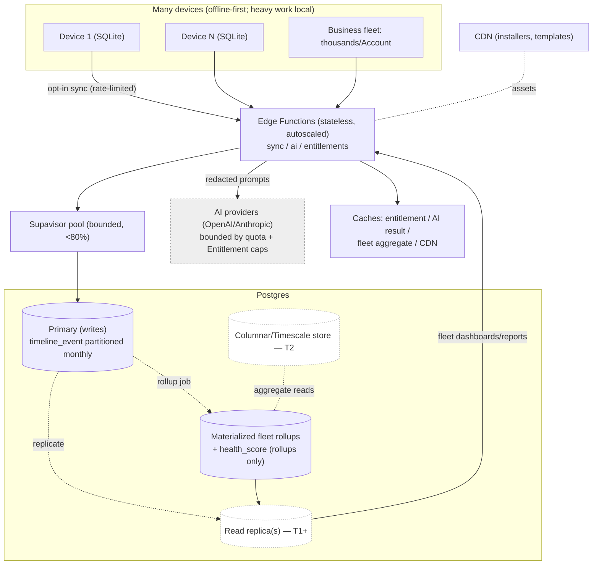
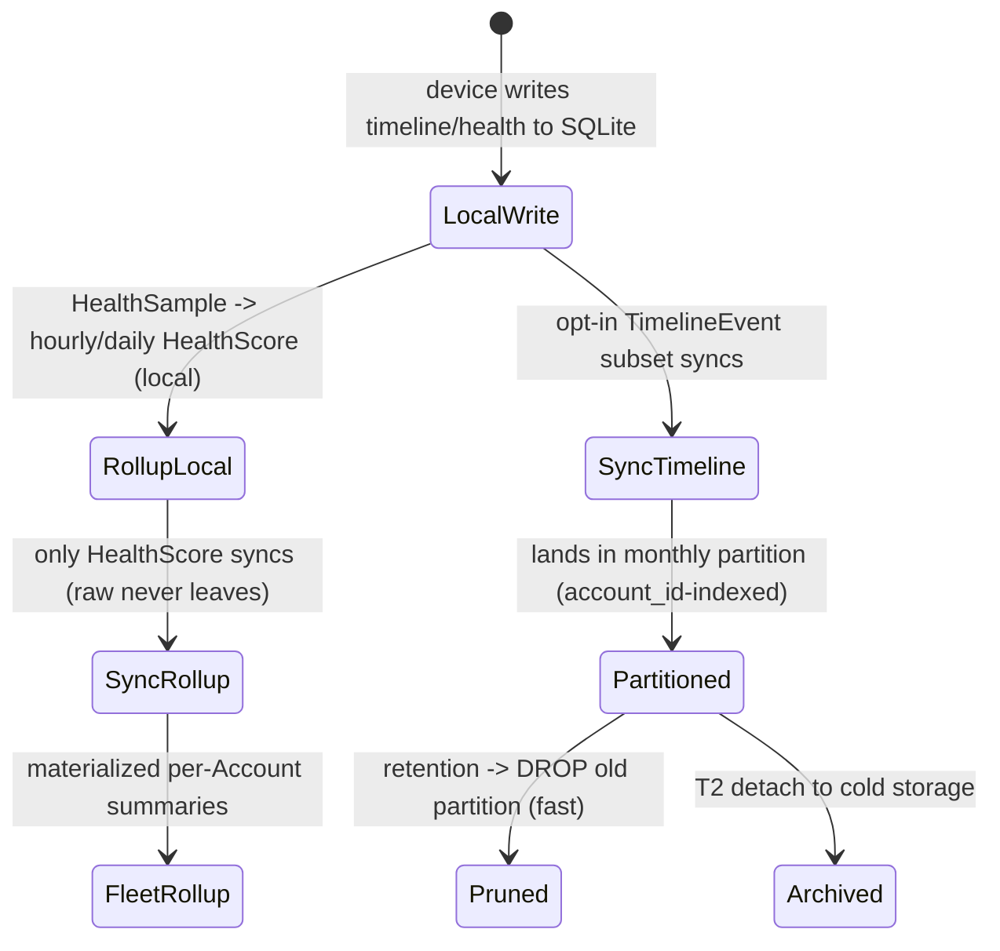

# 41. Scalability Strategy

> How DeviceLifeline's cloud scales from thousands to millions of devices and to Business fleets of thousands of devices per Account: Postgres partitioning + rollups for TimelineEvent and HealthSample at volume, connection pooling, Edge Function concurrency, Storage growth, AI cost/throughput scaling, caching, and fleet scale — with explicit growth assumptions and a scaling diagram. Part of the DeviceLifeline documentation suite — see [Documentation Index](README.md).

**Status:** Draft v1 · **Authoring role:** Principal Software Architect + Site Reliability Engineer · **Last updated:** 2026-06-07
**Related:** [39. Infrastructure Requirements](39-infrastructure-requirements.md), [42. Disaster Recovery Plan](42-disaster-recovery-plan.md), [32. Database Design](32-database-design.md), [30. System Architecture](30-system-architecture.md), [37. Observability Strategy](37-observability-strategy.md), [22. AI Diagnostics Design](22-ai-diagnostics-design.md), [57. Business Edition Specification](57-business-edition-specification.md), [07. Non-Functional Requirements](07-non-functional-requirements.md)

---

## 1. Purpose & Scope

This document defines **how DeviceLifeline's cloud scales** as the install base and per-Account fleets grow, without re-architecting. It addresses the highest-volume realities of the product: **`TimelineEvent`** and **`HealthSample`** data ([23. Performance Timeline Design](23-performance-timeline-design.md)), the **stateless Edge compute** tier ([30 §9](30-system-architecture.md)), **Postgres** connection limits, **Storage** growth, **AI cost/throughput**, **caching**, and **fleet scale** (thousands of devices per Business Account, [57. Business Edition](57-business-edition-specification.md)). It states **growth assumptions** so capacity ([39. Infrastructure Requirements](39-infrastructure-requirements.md)) and resilience ([42. Disaster Recovery Plan](42-disaster-recovery-plan.md)) have a shared baseline.

The single most important scalability fact is structural: **DeviceLifeline is offline-first** ([30 AP-01](30-system-architecture.md)). The heavy, per-device work (collection, correlation, health sampling, installs) runs **on the user's machine against local SQLite**; the cloud handles only the **opt-in synced subset, AI orchestration, licensing, and fleet coordination**. The platform therefore scales **sub-linearly** in cloud cost relative to device count — the architecture *is* the scaling strategy, and the levers below extend it.

**In scope:** growth assumptions/tiers; Postgres partitioning + rollups + retention at volume; connection pooling (Supavisor); Edge Function concurrency + statelessness; Storage growth; AI cost/throughput scaling; caching layers; fleet scale; read-path scaling (replicas); the staged scaling roadmap. V1 plus the post-MVP levers.

**Out of scope:** the component inventory + base sizing ([39](39-infrastructure-requirements.md)); the physical schema/DDL ([32. Database Design](32-database-design.md)); DR/backup ([42](42-disaster-recovery-plan.md)); SLOs/alerting ([37. Observability Strategy](37-observability-strategy.md)); deployment mechanics ([40. Deployment Strategy](40-deployment-strategy.md)).

---

## 2. Assumptions

- **A1:** **Offline-first**: core local features (snapshot, timeline, health, restore) require **no cloud** and add **zero** cloud load; only opt-in sync, AI, billing, fleet reads, and telemetry hit the cloud (A2 of [39](39-infrastructure-requirements.md)).
- **A2:** **Raw `HealthSample` never leaves the device**; only **`HealthScore` rollups** (hourly/daily) sync, and `TimelineEvent` syncs as an **opt-in, partitioned, retention-bound** subset ([32 §6](32-database-design.md)). This caps the highest-volume streams at the source.
- **A3:** Cloud compute is **stateless, autoscaled Edge Functions** over **managed Postgres**; horizontal scale is the default, vertical scale is a knob ([30 AP-08](30-system-architecture.md)).
- **A4:** Postgres connections are **mediated by Supavisor** (pooler); clients/Edge never open unbounded direct connections ([39 §3](39-infrastructure-requirements.md)).
- **A5:** **AI is the dominant variable cost** and most throughput-sensitive dependency; it is bounded by **per-Entitlement caps** + per-minute burst ([34 §3](34-api-specification.md)) and minimized by **on-device redaction/pre-processing** ([22](22-ai-diagnostics-design.md)).
- **A6:** **Tenancy is RLS-keyed on `account_id`** ([32 §RLS](32-database-design.md)); a Business Account with thousands of devices is one tenant whose rows must stay isolated and queryable at scale.
- **A7:** Growth figures (§3) are **planning assumptions** to be re-baselined from real telemetry ([37](37-observability-strategy.md)); levers are **staged** — adopt the cheapest sufficient one first.
- **A8:** Identifiers are **client-generated UUIDs** so devices write offline and reconcile on sync without server round-trips ([33 A2](33-entity-relationship-design.md)) — no central-id bottleneck.

---

## 3. Growth Assumptions

Three planning tiers frame the levers. Numbers are **order-of-magnitude** planning inputs, not commitments.

| Tier | Active devices | Devices/Account (typical / max) | Cloud posture |
|---|---|---|---|
| **T0 — MVP / Launch** | ~1k–10k | 1 (consumer) / tens (small biz) | Single Postgres (vertical), pooler, autoscaled Edge; native dashboards |
| **T1 — Early Growth** | ~10k–100k | 1 / hundreds | + Read replica(s), partition automation, caching, AI cost controls hardened |
| **T2 — Scale / Fleet** | ~100k–1M+ | 1 / **thousands** (Business) | + Multi-replica reads, columnar/rollup store, queue/async, possibly multi-region |

**Volume intuition (why timeline/health dominate):** a single Business Account at T2 with **5,000 devices**, each emitting (say) tens of synced `TimelineEvent`s/day, produces **hundreds of thousands of rows/day** for that one tenant — while raw `HealthSample` (far higher frequency) **never** reaches the cloud (A2). Timeline is the table we engineer for volume; health is solved by **not storing raw centrally**.

---

## 4. Scaling Postgres — TimelineEvent & HealthSample at Volume

### 4.1 Partitioning (TimelineEvent)

- `timeline_event` is **`PARTITION BY RANGE (occurred_at)` monthly** in Postgres ([32 §6.1](32-database-design.md)); partitions are **pre-created ahead** (scheduled job → **`pg_partman`** at T1+), with an alert if the next partition is missing (OBS-044, [37](37-observability-strategy.md)).
- **Why:** queries are time-bounded ("last 90 days timeline for this device/Account") → **partition pruning** keeps scans small; **retention = partition `DROP`** (fast, low-lock) instead of row-by-row deletes ([20. Data Retention Policies](20-data-retention-policies.md) RET-020).
- **Indexing:** composite indexes on `(account_id, device_id, occurred_at)` within partitions for fleet + per-device reads under RLS.
- **Archival (T2):** detach old partitions to **cold storage** rather than keep them hot.

```sql
-- Illustrative (see 32 §6.1 for canonical)
create table public.timeline_event ( /* ...cols... */ occurred_at timestamptz not null )
  partition by range (occurred_at);
-- pg_partman maintains monthly partitions ahead of time + retention drop
```

### 4.2 Rollups (HealthSample → HealthScore)

- **Raw `HealthSample` stays on-device** (A2). The Rust scheduler computes **hourly + daily `HealthScore`** rollups locally; only those **rollups** sync ([32 §6](32-database-design.md)).
- **Effect:** the highest-frequency stream contributes **near-zero** cloud row volume; the cloud stores compact scores, not raw telemetry. This is the decisive scalability choice for health data.
- **Post-MVP:** if cloud health analytics expand, a **columnar/TimescaleDB rollup store** absorbs aggregate queries without bloating the primary ([32 Future](32-database-design.md)).

### 4.3 Read-path scaling

- **Vertical first** (bigger Postgres) at T0/T1; then **read replicas** for fleet read traffic (dashboards, Business reports) while writes stay on the primary ([39 §4.1](39-infrastructure-requirements.md)).
- **Materialized rollups / summary tables** for expensive fleet aggregates (per-Account health distribution, compliance rollups) refreshed on a schedule, so the dashboard reads a small table, not the partitioned firehose.

---

## 5. Connection Pooling

- **Supavisor** multiplexes many short-lived client/Edge connections onto a **bounded** set of Postgres backends (A4); the **SLO is < 80% pool saturation sustained** (SLO-08, [37 §6.1](37-observability-strategy.md)).
- **Edge Functions** use pooled connections and keep work **short** (broker-and-return), avoiding long-held transactions that starve the pool.
- **Backpressure:** when saturated, Edge sheds/queues with `429` + client exponential backoff ([34 §3](34-api-specification.md)); the **`sync-broker` is rate-limited per device** (1 batch / 10s steady) so a large fleet cannot stampede the pool.
- **Scale lever:** raise pool size with instance size; add **replica** pools for read traffic at T1+.

---

## 6. Edge Function Concurrency

- Edge Functions are **stateless** (A3) → **horizontal autoscale**; no sticky state, so adding concurrency is transparent.
- **Concurrency ceilings** per function are monitored (OBS-042) and tuned; **cold starts** are minimized by keeping functions lean and dependencies small.
- **`ai-orchestrate`** concurrency is bounded by **AI provider rate limits** (RPM/TPM), not just Edge — so its real ceiling is governed by §7 (provider quotas + Entitlement caps), with **queueing/backoff** under burst.
- **`sync-broker`** scales by coalescing bursts and rate-limiting per device; spikes (e.g., fleet wakes after maintenance window) are smoothed by client jittered backoff.
- **Async offload (T1+):** long/expensive work (heavy AI correlation, large fleet report generation) moves to an **async job + Realtime/poll for result** pattern rather than holding a synchronous Edge invocation.

---

## 7. AI Cost & Throughput Scaling

AI is bounded by **economics and provider limits**, so scaling is as much **cost** as capacity:

| Lever | Effect |
|---|---|
| **On-device pre-processing + redaction** | Smaller prompts → lower tokens/cost **and** privacy ([22](22-ai-diagnostics-design.md), [30 §8](30-system-architecture.md)) |
| **Per-Entitlement monthly caps + burst limit** | Bounds spend and provider load per tier ([34 §3](34-api-specification.md), [14](14-subscription-plans.md)) |
| **Model routing / tiering** | Cheaper/smaller models for summarization; premium models for hard diagnoses |
| **Multi-provider (OpenAI + Anthropic)** | Spread load + failover around a provider's rate limit/outage ([37 §8](37-observability-strategy.md)) |
| **Caching of repeat/similar diagnoses** | Avoid re-paying for identical context (privacy-safe, hashed) (§8) |
| **Async + batching** | Smooth bursts; batch where latency allows |
| **Cost observability** | OBS-022 token-$ dashboard + spike alert gates runaway spend ([37 §7](37-observability-strategy.md)) |

The result: AI **throughput scales with provisioned provider quota**, while **cost scales with tokens**, both actively bounded — never an uncontrolled multiplier of device count.

---

## 8. Caching

| Layer | What | Where | Win |
|---|---|---|---|
| **Entitlement claim cache** | Resolved `Plan → Entitlement` | Client (short TTL) + Edge | Avoids re-resolving per call ([34 A7](34-api-specification.md)) |
| **AI result cache** | Diagnoses keyed by hashed, redacted context | Edge/Postgres | Cuts AI cost for repeat questions (§7) |
| **Fleet aggregate cache** | Materialized rollups/summary tables | Postgres | Fast Business dashboards without scanning partitions |
| **Template/static cache** | Shared restore templates, app metadata | Storage/CDN | Offload Postgres; cache at edge |
| **CDN cache** | Installers/manifests, public assets | CDN edge | Offload + egress smoothing ([39 §5](39-infrastructure-requirements.md)) |

Caches use **short, safe TTLs** and **fail open to source**; nothing cached weakens RLS isolation (cache keys are tenant-scoped).

---

## 9. Fleet Scale (Business Edition)

A Business **Account** can own **thousands of devices** (A6); scaling this is about **per-tenant volume + isolation + read efficiency**:

- **Isolation at scale:** RLS keyed on `account_id` keeps a 5,000-device tenant's rows private; composite indexes `(account_id, …)` keep tenant-scoped queries fast (§4.1).
- **Fleet reads:** dashboards/reports read **materialized rollups** (per-Account health/compliance summaries) and **read replicas**, not the live partitioned tables (§4.3).
- **Write fan-in:** each device syncs **independently and rate-limited**; the pooler + partitioned writes absorb fan-in; bursts (fleet maintenance windows) are jitter-smoothed (§5/§6).
- **Realtime at fleet scale:** live fleet views use Realtime selectively (opt-in, scoped channels) to avoid unbounded WSS fan-out ([39 §3](39-infrastructure-requirements.md)).
- **Hot-tenant guardrails:** per-Account quotas/limits and monitoring (a single huge tenant shouldn't degrade others); noisy-tenant isolation is a T2 consideration (e.g., dedicated replica).

---

## 10. Staged Scaling Roadmap

| Stage | Trigger | Levers to add |
|---|---|---|
| **T0 → ready** | Launch | Partitioned `timeline_event`; pooler; autoscaled Edge; per-Entitlement AI caps; native dashboards |
| **T1** | Read load / fleets grow; partitions accumulate | `pg_partman` automation; **read replica(s)**; materialized fleet rollups; AI result cache; async offload |
| **T2** | Large fleets / very high volume | Multi-replica reads; **columnar/Timescale** rollup store; queue-based async; cold-partition archival; possibly **multi-region**; hot-tenant isolation |

Adopt the **cheapest sufficient** lever per [37](37-observability-strategy.md) signals (A7); avoid premature complexity.

---

## Diagrams

### 11.1 Scaling architecture (write fan-in, read scale-out, bounded AI)



### 11.2 High-volume data lifecycle (timeline partition vs health rollup)



---

## Risks & Mitigations

| Risk | Likelihood | Impact | Mitigation |
|---|---|---|---|
| TimelineEvent volume bloats Postgres cost/latency | High | Medium | Monthly partitioning + pruning-by-drop; opt-in sync; indexes; archival ([32 §6](32-database-design.md), [20](20-data-retention-policies.md)) |
| Raw health would overwhelm cloud if synced | High (if mis-designed) | High | **Never sync raw** — rollups only (A2); decisive at source |
| Connection pool exhaustion under fleet fan-in | Medium | High | Supavisor bounded pool; <80% SLO; per-device sync rate limit; replica pools (§5) |
| AI cost/throughput scales with device count | Medium | High | Per-Entitlement caps; redaction; model routing; caching; multi-provider; cost alerts (§7) |
| Edge concurrency capped by AI provider limits | Medium | Medium | Provider quotas as the real ceiling; queue/backoff; async offload (§6) |
| Hot/noisy Business tenant degrades others | Medium | Medium | Per-Account quotas; monitoring; dedicated replica/isolation at T2 (§9) |
| Realtime WSS fan-out explodes at fleet scale | Medium | Medium | Opt-in, scoped channels; selective live views (§9) |
| Premature complex scaling adds risk/cost | Medium | Medium | Staged roadmap; cheapest-sufficient lever per telemetry (A7, §10) |
| Partition automation fails (no future partition) | Low | High | Pre-create ahead; `pg_partman`; missing-partition alert (OBS-044, [37](37-observability-strategy.md)) |

---

## Future Considerations

- **Multi-region** Postgres/Storage/Edge for latency + residency, tenancy routed by Account region ([39 §8](39-infrastructure-requirements.md), [18. Compliance Requirements](18-compliance-requirements.md)).
- **Columnar / TimescaleDB** rollup store for large-scale fleet/health analytics ([32](32-database-design.md)).
- **Queue-based async** pipeline for heavy AI/report jobs (decouple from synchronous Edge) ([30](30-system-architecture.md)).
- **Sharding by Account** (or dedicated projects) for the largest enterprise tenants if a single primary is outgrown.
- **Edge caching / CDN-fronted reads** for shared templates and public metadata.
- **Predictive autoscaling** from [37](37-observability-strategy.md) trends; pre-warm before known fleet maintenance windows.
- **Cost-aware AI scheduling** (route by price/latency/quality in real time) ([22](22-ai-diagnostics-design.md), [13. Monetization Strategy](13-monetization-strategy.md)).

---

## Acceptance Criteria

- [ ] AC-01: Growth assumptions are stated as planning tiers (T0/T1/T2) including thousands of devices per Business Account (§3).
- [ ] AC-02: `TimelineEvent` scaling uses monthly range partitioning with forward partition creation, partition-drop retention, and tenant-scoped indexing, consistent with [32 §6](32-database-design.md) (§4.1).
- [ ] AC-03: `HealthSample` scaling keeps raw local and syncs only `HealthScore` rollups; an optional columnar store is noted post-MVP (§4.2).
- [ ] AC-04: Connection pooling (Supavisor) with a saturation SLO and per-device sync rate limiting is specified (§5, [37](37-observability-strategy.md)).
- [ ] AC-05: Edge Function concurrency is addressed as stateless autoscale bounded by AI provider limits, with async offload post-MVP (§6).
- [ ] AC-06: AI cost/throughput scaling levers (redaction, caps, routing, multi-provider, caching, observability) are enumerated (§7).
- [ ] AC-07: Caching layers and fleet-scale (isolation, read replicas, materialized rollups, Realtime scoping) are defined (§8, §9, [57](57-business-edition-specification.md)).
- [ ] AC-08: A staged scaling roadmap (T0→T1→T2) ties triggers to levers, favoring the cheapest sufficient option (§10).
- [ ] AC-09: A scaling architecture diagram and a high-volume data-lifecycle diagram render on GitHub (§11).
- [ ] AC-10: The offline-first sub-linear-cost insight is stated, and post-MVP levers (replicas, columnar, multi-region, sharding, queues) are labeled as future.
