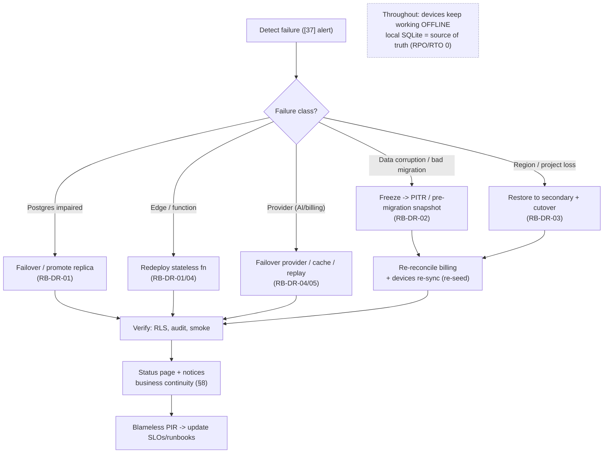
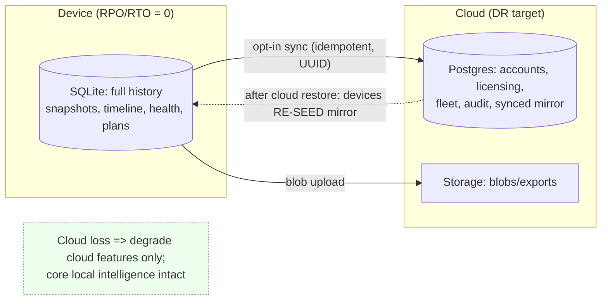

# 42. Disaster Recovery Plan

> DeviceLifeline's plan for surviving and recovering from failures: RTO/RPO targets per data class, Supabase backups + point-in-time recovery, the resilience advantage that on-device SQLite is the local source of truth, cloud restore procedures, region/Edge Function failover, incident runbooks, and business continuity — with a DR scenario table and a recovery flow diagram. Part of the DeviceLifeline documentation suite — see [Documentation Index](README.md).

**Status:** Draft v1 · **Authoring role:** Site Reliability Engineer + Principal Software Architect · **Last updated:** 2026-06-07
**Related:** [39. Infrastructure Requirements](39-infrastructure-requirements.md), [41. Scalability Strategy](41-scalability-strategy.md), [40. Deployment Strategy](40-deployment-strategy.md), [37. Observability Strategy](37-observability-strategy.md), [20. Data Retention Policies](20-data-retention-policies.md), [32. Database Design](32-database-design.md), [30. System Architecture](30-system-architecture.md), [18. Compliance Requirements](18-compliance-requirements.md), [54. Support Operations Plan](54-support-operations-plan.md)

---

## 1. Purpose & Scope

This document defines **how DeviceLifeline withstands and recovers from disasters** — from a single Edge Function outage to total loss of the cloud project — with explicit **Recovery Time Objectives (RTO)** and **Recovery Point Objectives (RPO)** per **data class**, the **backup + point-in-time recovery (PITR)** design for Supabase, the **cloud restore** procedures, **region/Edge failover**, **incident runbooks**, and **business continuity**. It builds directly on the infrastructure inventory ([39. Infrastructure Requirements](39-infrastructure-requirements.md)) and is the resilience counterpart to the scaling plan ([41. Scalability Strategy](41-scalability-strategy.md)).

DeviceLifeline has a **structural DR advantage**: it is **offline-first**, and **on-device SQLite is the local source of truth** ([30 AP-01](30-system-architecture.md)). A user's complete device history — snapshots, **Performance Timeline**, **Health Intelligence**, restore plans — lives **on their machine** and keeps working even if the **entire cloud is down**. The cloud holds accounts, licensing, the **opt-in synced subset**, fleet data, and shared templates. DR therefore focuses on **cloud-side** data classes; the device tier is inherently resilient and is itself part of the recovery story (it can re-seed cloud state).

**In scope:** data classification + RTO/RPO; Supabase backups/PITR + retention; cloud restore runbooks; region + Edge + AI-provider failover; incident severities + runbooks (hand-off from [37](37-observability-strategy.md)); the device-as-source-of-truth resilience advantage; business continuity + comms. V1 plus near-term post-MVP.

**Out of scope:** routine deploy rollback ([40. Deployment Strategy](40-deployment-strategy.md)); SLO/alert definitions ([37. Observability Strategy](37-observability-strategy.md)); retention *policy* rationale ([20. Data Retention Policies](20-data-retention-policies.md)); schema DDL ([32. Database Design](32-database-design.md)); support ticket workflow ([54. Support Operations Plan](54-support-operations-plan.md)).

---

## 2. Assumptions

- **A1:** **On-device SQLite is the local source of truth** and works fully offline (A2 of [30](30-system-architecture.md)); the cloud is an **opt-in mirror + coordination layer**. Loss of cloud does **not** lose a user's local device history.
- **A2:** Cloud durability rests on **Supabase managed backups + continuous WAL PITR** ([20 §7](20-data-retention-policies.md)); we do not run our own Postgres host.
- **A3:** **Edge Functions are stateless** ([30 AP-08](30-system-architecture.md)) — they hold no durable state, so their "recovery" is **redeploy** (fast), not data restore.
- **A4:** **Identifiers are client-generated UUIDs** ([33 A2](33-entity-relationship-design.md)) and sync is **idempotent** with explicit merge rules ([32 §7](32-database-design.md)); therefore **devices can re-sync and re-seed** much cloud device-data after a cloud restore without conflict.
- **A5:** **AI is multi-provider** (OpenAI + Anthropic) and **billing is multi-provider** (Stripe + Paystack); a single external provider outage is **degraded**, not down ([37 §8](37-observability-strategy.md)).
- **A6:** **Raw `HealthSample` never leaves the device** ([41 §4.2](41-scalability-strategy.md)); it is not a cloud DR concern (and not recoverable from cloud — it was never there).
- **A7:** Backups and any cross-region copies respect **data residency** ([18. Compliance Requirements](18-compliance-requirements.md)); backups have a **bounded retention** and age out ([20 §7](20-data-retention-policies.md)).
- **A8:** DR is **tested**, not assumed: restore drills and failover game-days are scheduled (§9); RTO/RPO are validated against drills, not just documented.

---

## 3. Data Classification & RTO/RPO

RTO = max tolerable **time to restore service**; RPO = max tolerable **data loss window**. Targets are set per **data class** by criticality and by **where the source of truth lives**.

| Data class | Source of truth | Store | RPO | RTO | Recovery method |
|---|---|---|---|---|---|
| **Local device history** (snapshots, `TimelineEvent`, raw `HealthSample`, restore plans) | **Device (SQLite)** | On-device | **0** (local) | **0** (offline-first) | None needed for the owning device; cloud-independent (A1) |
| **Accounts / Auth** (`User`, `Account`, sessions) | **Cloud** | Postgres/Auth | ≤ 5 min (PITR) | ≤ 1–2 h | PITR / restore (§5) |
| **Licensing / Subscriptions** (`Subscription`, `LicenseSeat`, `Entitlement`, `Plan`) | **Cloud** (reconcilable from Stripe/Paystack) | Postgres | ≤ 5 min | ≤ 1–2 h | PITR + **webhook re-reconciliation** from providers |
| **Synced device subset** (`TimelineEvent`/snapshot mirror, `HealthScore`) | **Device** (cloud is mirror) | Postgres/Storage | ≤ 1 h cloud (devices re-sync) | ≤ 2–4 h | PITR **and/or device re-sync re-seed** (A4) |
| **Fleet data** (`FleetGroup`, `Policy`, assignments) | **Cloud** | Postgres | ≤ 5 min | ≤ 2 h | PITR (§5) |
| **AuditLog** (`audit_log`, append-only) | **Cloud** | Postgres | ≤ 5 min | ≤ 2 h | PITR; integrity-critical ([17](17-security-requirements.md)) |
| **Object storage** (snapshot blobs, exports, templates) | **Device** (most blobs re-uploadable) | Supabase Storage | ≤ 24 h | ≤ 4 h | Storage backup/versioning + device re-upload |
| **Edge Functions** (code/config) | **Git** | Supabase (deployed) | 0 (in VCS) | ≤ 30 min | **Redeploy** from tag (A3, [38](38-devops-architecture.md)) |
| **Analytics / Errors** (PostHog, Sentry) | External SaaS | Vendor | Vendor | Best-effort | Vendor DR; non-critical to product function |

> The **decisive DR property**: the most valuable, highest-volume data (a user's device history) has **RPO/RTO = 0** because it lives on the device. Cloud DR is about **accounts, licensing, fleet, audit, and the synced mirror** — and even the mirror can be **re-seeded by devices re-syncing** (A4).

---

## 4. Backup Strategy (Supabase)

| Backup type | Store | Frequency / window | Retention | Use |
|---|---|---|---|---|
| **Postgres WAL (PITR)** | Supabase managed | Continuous | Rolling PITR window (e.g., 7 days; longer for prod, §10) | Point-in-time restore to any second in window |
| **Postgres snapshots** | Supabase managed | Daily (+ pre-migration on-demand) | Rotation per [20 §7](20-data-retention-policies.md) | Full restore baseline |
| **Pre-migration snapshot** | Supabase managed | Before each prod migration ([40 §6.2](40-deployment-strategy.md)) | Until migration verified | Fast rollback of a bad migration |
| **Storage backup/versioning** | Supabase Storage | Per bucket policy | Bounded | Recover deleted/corrupted blobs |
| **Cross-region backup copy** | Secondary region (post-MVP) | Periodic | Bounded, residency-aware (A7) | Region-loss resilience |
| **Config/IaC** | Git | On change | VCS history | Recreate project config, RLS, functions ([38](38-devops-architecture.md)) |

- **Backups exist for DR only** and **age out** on a fixed rotation, then are destroyed ([20 §7](20-data-retention-policies.md)) — DR retention is **not** product data retention.
- **Verification:** backups are **periodically test-restored** (A8) to confirm they are usable, not just present.
- **Local "backup":** the user's own **SQLite export** is a user-controlled local backup, not a DeviceLifeline cloud backup ([20 §7](20-data-retention-policies.md)) — but it reinforces device-tier resilience.

---

## 5. Cloud Restore Procedures

### 5.1 Point-in-time restore (data corruption / bad write / bad migration)

1. **Detect + declare** incident (SEV from [37 §8](37-observability-strategy.md)); identify the **last-good timestamp** before corruption.
2. **Freeze** the affected surface (kill switch / maintenance, [40 §7](40-deployment-strategy.md)) to stop further bad writes.
3. **PITR** the Postgres project to the last-good point (or restore the pre-migration snapshot for a bad migration).
4. **Re-reconcile** provider-derived state: replay/refetch **Stripe/Paystack** to true-up `Subscription`/`LicenseSeat` ([34 §6](34-api-specification.md)).
5. **Allow devices to re-sync**: idempotent sync re-seeds any synced device rows lost in the restore window (A4) — no manual per-device recovery.
6. **Verify** (RLS tests, audit integrity, smoke), **unfreeze**, **post-incident review**.

### 5.2 Full project loss (region/project unavailable)

1. **Declare SEV-1**; activate the incident bridge (§7).
2. **Restore** Postgres from the latest snapshot/PITR into a **new/secondary project** (post-MVP: pre-provisioned secondary region, A7).
3. **Recreate** Storage from backup/versioning; **redeploy** Edge Functions from the release tag (A3, [38](38-devops-architecture.md)); restore **config/RLS** from IaC.
4. **Repoint** clients (DNS/endpoint) to the recovered project; **re-reconcile** billing; **devices re-sync** to re-seed mirror data.
5. **Validate + comms** (§8); resume.

> Throughout, **users keep working locally** (A1) — the outage degrades cloud features (sync, server-side AI, fleet, new licensing) but **not** core local device intelligence.

---

## 6. Failover

| Failure | Failover behavior |
|---|---|
| **Single Edge Function down/erroring** | Stateless redeploy / retry; clients backoff; core local unaffected ([37 §8](37-observability-strategy.md)) |
| **AI provider outage / rate-limit** | **Failover OpenAI ↔ Anthropic** (A5); degrade to cached/last-known diagnoses; AI queued ([22](22-ai-diagnostics-design.md)) |
| **Billing provider outage** | Webhooks are **idempotent + retried**; reconcile on recovery; entitlements use cached claims (fail-closed for *new* upgrades, [40 §7](40-deployment-strategy.md)) |
| **Postgres primary impaired** | Promote replica / managed failover (Supabase); pooler reconnects; SEV-1 runbook |
| **Region loss** (post-MVP multi-region) | Restore/cutover to secondary region (§5.2); residency-aware (A7) |
| **CDN/update distribution down** | Auto-update pauses gracefully; app keeps running installed version; Store channel independent ([39 §5](39-infrastructure-requirements.md)) |
| **Total cloud outage** | **Offline-first**: all core local features continue; sync resumes from outbox on recovery ([30 §7](30-system-architecture.md)) |

Multi-provider AI/billing and stateless Edge make most failures **degradations**, not outages; offline-first makes even total cloud loss survivable for the core product.

---

## 7. Incident Runbooks

DR runbooks are the **escalation target** of the alerting in [37 §8](37-observability-strategy.md). Each is a numbered, tested checklist.

| Runbook | Trigger | Core steps |
|---|---|---|
| **RB-DR-01 Postgres down/impaired** | SLO-08 saturation / unreachable | Declare SEV-1 → failover/promote → verify pooler → comms → PIR |
| **RB-DR-02 Data corruption / bad migration** | Bad write / migration alert | Freeze → identify last-good → PITR/pre-migration snapshot → reconcile billing → devices re-sync → verify (§5.1) |
| **RB-DR-03 Region/project loss** | Region outage | §5.2 full restore + cutover + repoint + comms |
| **RB-DR-04 AI provider outage** | OBS-023 failover storm | Switch provider; serve cache; queue; notify; restore routing |
| **RB-DR-05 Billing webhook failure** | OBS-045 failures | Verify signatures/endpoint; replay provider events; reconcile; PIR |
| **RB-DR-06 Storage loss/corruption** | Storage errors | Restore from backup/versioning; trigger device re-upload of blobs |
| **RB-DR-07 Mass sync failure** | SLO-02 fleet-wide | Diagnose broker/pool; throttle; drain outboxes safely on recovery |

Every SEV-1/2 runs a **blameless post-incident review (PIR)** feeding back into SLOs/alerts ([37 §8](37-observability-strategy.md)) and these runbooks. On-call ownership + comms cadence align with [54. Support Operations Plan](54-support-operations-plan.md).

---

## 8. Business Continuity

- **Roles:** an **Incident Commander** (coordination), a **Comms lead** (status page + user/Business notices), and the technical responder/on-call; defined per incident.
- **Communication:** a **status page** + in-app/email notices for SEV-1/2; Business/MSP customers get fleet-impact notices ([54](54-support-operations-plan.md), [57. Business Edition](57-business-edition-specification.md)).
- **Continuity during cloud outage:** because the product is offline-first, **users continue working**; messaging emphasizes that **local device history is safe and intact** (A1) — a differentiated continuity story.
- **Vendor dependency continuity:** documented **exit/fallback** for Supabase (standard Postgres/REST/JWT, thin Edge brokers → self-hostable Supabase) ([30 Future](30-system-architecture.md), [39](39-infrastructure-requirements.md)); multi-provider AI/billing reduce single-vendor risk (A5).
- **Compliance during DR:** restores, cross-region copies, and any data movement remain within residency + breach-notification obligations ([18](18-compliance-requirements.md), [19. Privacy Requirements](19-privacy-requirements.md)).

---

## 9. DR Testing

- **Restore drills** (quarterly): test-restore a PITR/snapshot into a scratch project; validate RLS, audit integrity, and that RTO/RPO targets (§3) are actually met.
- **Failover game-days:** simulate AI-provider outage (force failover), billing webhook failure (replay), and a region-loss tabletop.
- **Migration rollback rehearsal** in staging before every prod migration ([40 §6.2](40-deployment-strategy.md)).
- **Re-sync re-seed test:** wipe a synced row set in a scratch project, confirm devices re-seed idempotently (A4).
- Drill outcomes update RTO/RPO realism and the runbooks (A8).

---

## Diagrams

### 10.1 DR decision / recovery flow

### 10.2 Source-of-truth resilience (why the device tier is the safety net)

---

## Risks & Mitigations

| Risk | Likelihood | Impact | Mitigation |
|---|---|---|---|
| Cloud data loss / corruption | Low | Critical | Continuous PITR + daily snapshots + pre-migration snapshot; tested restores (§4, §9) |
| Bad migration corrupts prod | Medium | High | Expand/contract + pre-migration snapshot + staging rehearsal; PITR fallback ([40 §6.2](40-deployment-strategy.md)) |
| Region/project total loss | Low | Critical | Restore to secondary; cross-region backup copy (post-MVP); IaC + redeploy (§5.2) |
| Backups present but unusable | Medium | Critical | **Periodic test-restores** + RTO/RPO validation drills (A8, §9) |
| AI/billing provider outage | Medium | Medium | Multi-provider failover; idempotent webhooks + replay; cached entitlements (A5, §6) |
| Synced mirror lost on restore | Medium | Low | Idempotent device **re-sync re-seed** (A4, §5); low RTO impact |
| Audit log integrity gap during DR | Low | High | Append-only; PITR-restored; integrity verified post-restore ([17](17-security-requirements.md)) |
| Residency violated by cross-region restore | Medium | High | Residency-aware backup copies; region-pinned restore ([18](18-compliance-requirements.md), A7) |
| Slow/ad-hoc incident response | Medium | High | Numbered runbooks (RB-DR-01..07); IC/Comms roles; game-days (§7–§9) |

---

## Future Considerations

- **Pre-provisioned secondary region** with automated cutover for near-zero-downtime region failover ([39 §8](39-infrastructure-requirements.md), [41](41-scalability-strategy.md)).
- **Cross-region backup replication** + automated restore verification pipeline.
- **Self-hosted/on-prem Supabase** DR runbook for enterprise data-residency mandates ([18](18-compliance-requirements.md)).
- **Automated failover** for AI/billing providers driven by [37](37-observability-strategy.md) burn-rate alerts.
- **Per-Business-fleet recovery dashboards** + SLAs for enterprise customers ([57. Business Edition](57-business-edition-specification.md)).
- **Chaos engineering** (fault injection) to continuously validate resilience assumptions.
- **macOS/Linux device tiers** inherit the same source-of-truth resilience; only collectors differ ([28](28-macos-architecture-plan.md), [29](29-linux-architecture-plan.md)).

---

## Acceptance Criteria

- [ ] AC-01: A data classification with **RTO/RPO per class** is defined, explicitly noting device-local data is RPO/RTO ≈ 0 (§3).
- [ ] AC-02: Supabase backup strategy covers continuous WAL **PITR**, snapshots, pre-migration snapshots, Storage backup, and config-in-Git, with DR-only bounded retention ([20 §7](20-data-retention-policies.md)) (§4).
- [ ] AC-03: Cloud restore procedures cover PITR for corruption/bad-migration and full project-loss restore, including billing re-reconciliation and device re-sync re-seed (§5).
- [ ] AC-04: Failover is defined for Edge functions, AI provider, billing provider, Postgres, region, CDN, and total cloud outage (§6).
- [ ] AC-05: Numbered incident runbooks (RB-DR-01..07) exist and are the escalation target of [37 §8](37-observability-strategy.md) alerting (§7).
- [ ] AC-06: The on-device-SQLite-as-source-of-truth **resilience advantage** is stated and shown to keep core features working during cloud outage (§3, §6, §10.2, [30 §7](30-system-architecture.md)).
- [ ] AC-07: Business continuity (roles, comms/status page, vendor exit, compliance during DR) is specified (§8, [18](18-compliance-requirements.md), [54](54-support-operations-plan.md)).
- [ ] AC-08: DR is **tested** via restore drills, failover game-days, migration rehearsals, and re-seed tests validating RTO/RPO (§9).
- [ ] AC-09: A DR scenario/runbook table and a recovery flow diagram plus a source-of-truth resilience diagram render on GitHub (§3, §7, §10).
- [ ] AC-10: The MVP boundary is respected; multi-region/secondary failover, cross-region replication, self-host DR, automated failover, and chaos engineering are labeled post-MVP.
