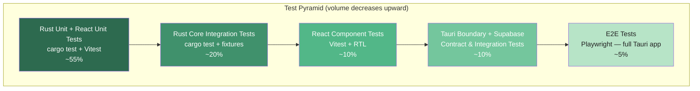
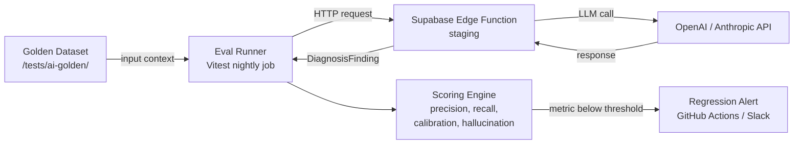
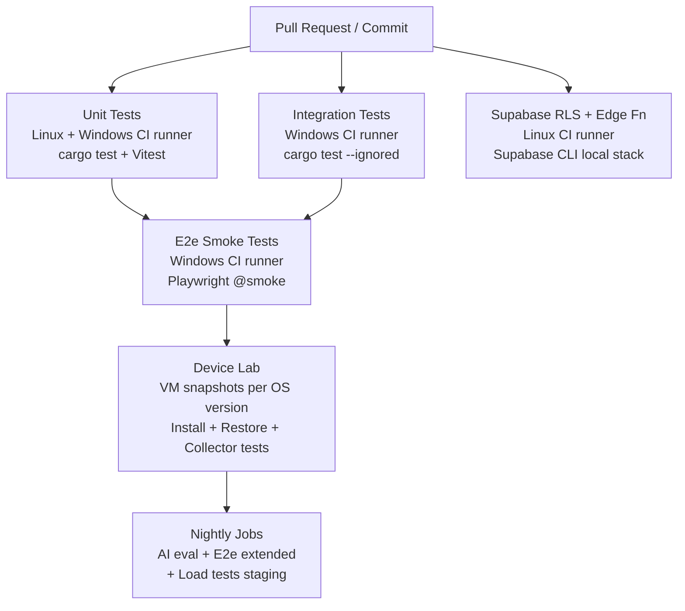

# 43. Testing Strategy

> Defines the end-to-end approach to verifying quality across all layers of DeviceLifeline — Rust Core, Tauri boundary, React UI, and Supabase — including platform matrix testing, install/restore safety, and AI non-determinism evaluation. Part of the DeviceLifeline documentation suite — see [Documentation Index](README.md).

**Status:** Draft v1 · **Authoring role:** Staff Engineer / QA Lead · **Last updated:** 2026-06-07
**Related:** [44. QA Plan](44-qa-plan.md), [45. Release Management Plan](45-release-management-plan.md), [30. System Architecture](30-system-architecture.md), [22. AI Diagnostics Design](22-ai-diagnostics-design.md), [25. Restore Engine Design](25-restore-engine-design.md), [26. Software Installation Engine Design](26-software-installation-engine-design.md), [38. DevOps Architecture](38-devops-architecture.md)

---

## 1. Purpose & Scope

This document defines the testing strategy for DeviceLifeline across all layers of the product stack. It establishes the test pyramid structure, toolchain choices, coverage targets, and the specialized approaches required for the product's hardest testing challenges: cross-platform Windows device variation, destructive install/restore operations, and probabilistic AI outputs.

**In scope:**
- Rust Core unit, integration, and collector tests
- React UI unit, component, and end-to-end tests
- Tauri IPC boundary contract tests
- Supabase RLS policy tests and Edge Function tests
- Performance and load testing
- Security testing strategy
- AI evaluation methodology

**Out of scope:**
- Detailed test case authoring (see [44. QA Plan](44-qa-plan.md))
- CI/CD pipeline configuration (see [38. DevOps Architecture](38-devops-architecture.md))
- Release gate criteria (see [45. Release Management Plan](45-release-management-plan.md))

---

## 2. Assumptions

- **A-01:** The primary test platform is Windows (10 22H2, 11 22H2, 11 23H2) during MVP; macOS and Linux are post-MVP.
- **A-02:** CI runners are Windows-based (GitHub Actions `windows-latest`) for Rust Core and Tauri tests; Linux runners are used for Supabase Edge Function tests.
- **A-03:** Disposable VM snapshots (Hyper-V or VMware) are available in the device lab for install/restore destructive tests.
- **A-04:** The AI evaluation dataset is maintained by the engineering team; external annotation is post-MVP.
- **A-05:** Coverage targets apply to business-logic modules; auto-generated Tauri glue code is excluded from coverage enforcement.
- **A-06:** Supabase CLI is used to spin up a local Supabase instance for RLS and Edge Function tests; production Supabase is never targeted by automated tests.
- **A-07:** Playwright runs in headed mode on a Windows desktop agent for e2e tests that require a real Tauri window; headless mode is used for pure React component tests.

---

## 3. Test Pyramid

The DeviceLifeline test pyramid reflects the multi-layer architecture. The vast majority of tests are fast, isolated unit tests; integration and e2e tests cover only the workflows that cannot be verified in isolation.

### 3.1 Pyramid Layers

| Layer | Type | Primary Tool | Approx. Share | Run Frequency |
|---|---|---|---|---|
| Rust Core — unit | Unit | `cargo test` | 40% | Every commit |
| Rust Core — integration | Integration | `cargo test` + fixtures | 20% | Every commit |
| React UI — unit | Unit | Vitest | 15% | Every commit |
| React UI — component | Component | Vitest + React Testing Library | 10% | Every commit |
| Tauri boundary | Contract | `cargo test` + Tauri test harness | 5% | Every PR |
| Supabase RLS & Edge Fn | Integration | Supabase CLI + pgTAP + Vitest | 5% | Every PR |
| React UI — e2e | End-to-end | Playwright | 5% | Pre-merge to main / nightly |

### 3.2 Coverage Targets

| Module | Line Coverage Target | Branch Coverage Target |
|---|---|---|
| Rust Core — collectors | 80% | 75% |
| Rust Core — restore engine | 85% | 80% |
| Rust Core — install engine | 85% | 80% |
| Rust Core — scheduler | 80% | 75% |
| React UI — hooks | 80% | 75% |
| React UI — utility functions | 90% | 85% |
| Supabase Edge Functions | 80% | 75% |

Coverage is enforced via `cargo tarpaulin` (Rust) and Vitest's built-in `c8` coverage provider (TypeScript). Coverage gates block PR merges if targets drop by more than 2 percentage points from the last main-branch measurement.

---

## 4. Rust Core Testing

### 4.1 Unit Tests

Unit tests live adjacent to the module under test (`src/` tree with `#[cfg(test)]` blocks). They must:
- Run in under 5 ms each (no I/O, no filesystem).
- Use mock trait implementations for OS-level collectors (e.g., `MockWmiProvider`, `MockRegistryReader`).
- Cover all error paths returned as `Result<T, E>` using `thiserror`-derived error types.

Key modules requiring thorough unit coverage:
- `DeviceDNASnapshot` construction from collector output
- `SoftwareInventoryItem` deduplication and normalization
- `ConfigItem` change detection (diff logic)
- `HealthSample` aggregation into `HealthScore`
- `TimelineEvent` ordering and correlation logic

### 4.2 Integration Tests

Integration tests live in `/src-tauri/tests/` and may perform real filesystem and registry reads on the CI Windows runner. They:
- Test that collector pipelines produce valid, schema-conformant output on a real Windows environment.
- Verify SQLite writes and reads (using a temp database file, not the production path).
- Test the full `RestorePlan` → `RestoreJob` → `RestoreStep` state machine against a fixture-based plan.
- Test `InstallTask` execution sequences against a WinGet stub that returns canned exit codes.

Integration tests are tagged `#[test] #[ignore = "integration"]` and run via `cargo test -- --ignored` in CI to keep the default `cargo test` fast.

### 4.3 Collector Fidelity Tests

A specialized sub-suite validates that collectors produce structurally correct output across the Windows version matrix (see Section 7). These tests:
- Run on each OS image in the device lab.
- Assert that mandatory fields in `DeviceDNASnapshot` are non-null.
- Assert that software inventory counts are within expected ranges for a known reference image.
- Flag any field that returns a Windows-version-specific error.

### 4.4 Tools

| Tool | Purpose |
|---|---|
| `cargo test` | Default unit and integration test runner |
| `cargo tarpaulin` | Line/branch coverage reporting |
| `cargo clippy` | Lint enforcement (also see [47. Coding Standards](47-coding-standards.md)) |
| `cargo audit` | Dependency vulnerability scanning |
| `mockall` | Mock trait generation |
| `tempfile` | Temporary file/directory fixtures |
| `assert_cmd` | CLI subprocess testing |

---

## 5. React UI Testing

### 5.1 Unit Tests

Unit tests target pure TypeScript utility functions and custom React hooks. They:
- Use Vitest as the test runner and assertion library.
- Run in a jsdom environment (no browser required).
- Test hooks with `@testing-library/react-hooks`.
- Must complete in under 50 ms each.

Key areas:
- Data transformation functions (e.g., formatting `HealthScore`, rendering `TimelineEvent` diffs)
- Entitlement gate logic (which Plan unlocks which UI sections)
- Local state machines governing `DiagnosisSession` UI flow

### 5.2 Component Tests

Component tests render isolated React components with React Testing Library. They:
- Assert rendered output, user interactions (clicks, form inputs), and component state transitions.
- Use MSW (Mock Service Worker) to intercept Supabase client calls and Tauri `invoke` calls.
- Do not test visual appearance (that is the responsibility of the design system; see [49. Design System Specification](49-design-system-specification.md)).

Key component test scenarios:
- `HealthScoreDial` renders correct color tier for each score range.
- `TimelineEventCard` expands/collapses correctly and fires the correct Tauri command.
- `RestoreJobProgress` updates in real time when Tauri events arrive via the mock event bus.
- Plan gating: components behind Entitlement checks render upgrade prompts for Free users.

### 5.3 End-to-End Tests

E2e tests use Playwright targeting the full Tauri application window on a real Windows runner. They:
- Launch the Tauri binary (debug or release build) and drive it as a desktop application.
- Cover critical user journeys (see [08. User Flows](08-user-flows.md)):
  - First-run onboarding through device scan completion.
  - Viewing a `DeviceDNASnapshot` and navigating to `SoftwareInventoryItem` details.
  - Initiating a `DiagnosisSession` from the AI Detective panel.
  - Starting and monitoring a `RestoreJob` from a `RestorePlan`.
- Use snapshot assertions sparingly — only for charts/health dials that cannot be tested with DOM queries.
- Run tagged as `@smoke` (5 core flows, always) or `@extended` (full suite, nightly + pre-release).

### 5.4 Tools

| Tool | Purpose |
|---|---|
| Vitest | Unit + component test runner |
| React Testing Library | Component rendering and interaction |
| MSW | HTTP/IPC mock interception |
| Playwright | E2e browser/desktop automation |
| `@playwright/test` | Test runner and assertion library |
| Vitest `c8` | Coverage reporting for TypeScript |

---

## 6. Tauri Boundary Testing

The Tauri bridge is a high-risk boundary: mismatched types between Rust `#[tauri::command]` handlers and TypeScript `invoke` call-sites cause silent runtime failures. The contract testing approach:

### 6.1 Command Contract Tests

- A shared JSON schema file (`src-tauri/schema/commands.json`) documents every command name, argument types, and return type.
- Rust-side: integration tests invoke each registered command handler directly (bypassing the Tauri runtime) and assert the return shape against the schema.
- TypeScript-side: Vitest tests assert that each typed `invoke` wrapper function matches the schema.
- Schema drift is caught in CI: any change to a command's Rust signature that does not update the shared schema file causes a schema-diff check step to fail.

### 6.2 IPC Event Contract Tests

- Tauri events emitted by Rust (e.g., `restore-progress`, `health-sample`) are documented in the same schema file.
- Playwright e2e tests assert that event payloads received in the UI match the documented shape.

---

## 7. Cross-Platform Windows Testing Matrix

Windows version variation is one of the highest-risk areas. The target matrix for MVP:

| OS Version | Build | Architecture | Form Factor | Test Priority |
|---|---|---|---|---|
| Windows 11 23H2 | 22631 | x64 | Desktop/Laptop | P0 — primary dev target |
| Windows 11 22H2 | 22621 | x64 | Desktop/Laptop | P0 |
| Windows 10 22H2 | 19045 | x64 | Desktop/Laptop | P0 |
| Windows 11 23H2 | 22631 | ARM64 | Laptop (Surface) | P1 — post-MVP |
| Windows 10 21H2 | 19044 | x64 | Desktop/Laptop | P2 |
| Windows Server 2022 | — | x64 | Server | Out of scope MVP |

**Hardware variation dimensions:**
- Storage: NVMe SSD, SATA SSD, HDD (for health collector accuracy)
- GPU: integrated (Intel/AMD), discrete (NVIDIA/AMD) (for GPU health collector)
- RAM: 4 GB (minimum spec), 8 GB (typical), 16 GB+
- CPU: Intel 10th gen+, AMD Ryzen 3000+

Testing on real hardware complements VM testing for storage and GPU collector fidelity. See [44. QA Plan](44-qa-plan.md) for device lab inventory.

---

## 8. Install and Restore Testing

Install and restore operations are inherently destructive — they modify the OS. Tests in this category require isolated environments.

### 8.1 VM Snapshot Strategy

- Each install/restore test run starts from a known-good VM snapshot.
- Snapshots are maintained for each OS version in the matrix.
- After each test, the VM is reverted to the snapshot. No state persists between tests.
- Snapshots are stored on the device lab NAS and refreshed monthly with cumulative Windows updates applied.

### 8.2 WinGet Integration Tests

- A `WinGetStub` shim replaces the real WinGet binary in CI environments where real installs are impractical (Linux CI runners, limited Windows runners).
- The stub accepts the same CLI arguments and returns canned JSON exit codes and output.
- Against the stub: test `InstallTask` queuing, retry logic, error handling, and progress event emission.
- Against real WinGet (on Windows device lab runners): test a short list of known-stable packages (e.g., `Git.Git`, `Microsoft.VisualStudioCode`) to validate end-to-end install flow.

### 8.3 RestoreJob State Machine Tests

The `RestoreJob` → `RestoreStep` state machine is tested at three levels:
1. **Unit:** Each state transition (pending → running → success/failed/skipped) tested in isolation with mock step executors.
2. **Integration:** A complete `RestorePlan` with 5–10 steps executed against the WinGetStub and file-system fixtures.
3. **E2e (VM):** A full restore from a real `DeviceDNASnapshot` executed on a clean VM snapshot, verifying that the restored state matches the source snapshot.

### 8.4 Rollback and Error Recovery Tests

- Simulate WinGet install failure (exit code 1602, 1618, etc.) mid-plan and verify `RestoreJob` transitions to `partially_complete` with correct step failure records.
- Verify rollback of completed steps where rollback is defined.
- Confirm that a user-aborted restore leaves the system in a consistent state (no half-installed packages).

---

## 9. AI Evaluation Under Non-Determinism

AI responses (from OpenAI and Anthropic APIs routed through Supabase Edge Functions) are non-deterministic. Standard assertions cannot be used. The following approach is used instead.

### 9.1 Golden Dataset

- A curated dataset of 50+ device states (combinations of `DeviceDNASnapshot`, `TimelineEvent` list, `HealthSample` list, and `CrashEvent` list) with known expected diagnoses.
- Each dataset entry has: input context, expected `DiagnosisFinding` categories, expected confidence score ranges, and expected recommended actions.
- Dataset is version-controlled in `/tests/ai-golden/`.

### 9.2 Evaluation Metrics

| Metric | Definition | Target |
|---|---|---|
| Category precision | Fraction of returned finding categories that match expected categories | ≥ 0.80 |
| Category recall | Fraction of expected categories that are present in returned findings | ≥ 0.75 |
| Confidence calibration | Mean absolute error between returned confidence and empirical accuracy | ≤ 0.10 |
| Hallucination rate | Fraction of findings with no grounding in the provided context | ≤ 0.05 |
| Response latency P95 | End-to-end time from Edge Function call to `DiagnosisFinding` returned | ≤ 8 s |

### 9.3 Evaluation Runner

- A dedicated Vitest test suite (`tests/ai-eval/`) executes the golden dataset against the staging Supabase Edge Function endpoints (not mocked).
- Each test case makes a real LLM API call and scores the response against the expected criteria.
- This suite runs on a separate nightly CI job, not on every commit (latency + cost).
- A regression alert fires if any metric drops below its target threshold.

### 9.4 Prompt Regression Testing

- When the system prompt for any AI Orchestration Edge Function changes, the full golden dataset eval runs in CI before the change can merge.
- Prompt changes that cause a regression on any metric gate the PR.

### 9.5 Temperature and Seed Controls

- Where supported by the API, evaluation calls use a fixed temperature (0.2) and seed to reduce variance.
- Anthropic API calls do not support seeds; three independent calls are made and results are averaged.

---

## 10. Performance and Load Testing

### 10.1 On-Device Performance Tests

These tests run on real Windows hardware in the device lab:

| Scenario | Target | Tool |
|---|---|---|
| Full `DeviceDNASnapshot` collection time | ≤ 60 s on reference hardware | Custom Rust bench harness |
| SQLite write throughput (1000 `TimelineEvent` inserts) | ≤ 500 ms | `criterion` Rust benchmarks |
| App cold start to interactive | ≤ 3 s | Playwright `performance.now()` measurement |
| App memory footprint (idle) | ≤ 150 MB RAM | Process monitor probe in Rust test |
| App CPU usage (idle, collector quiesced) | ≤ 1% CPU | Process monitor probe |

### 10.2 Supabase Load Tests

See [41. Scalability Strategy](41-scalability-strategy.md) for full targets. Test tooling:

| Scenario | Tool | Target |
|---|---|---|
| Concurrent device sync uploads | k6 | 500 concurrent devices at 50 req/s |
| Edge Function invocation under load | k6 | P95 latency ≤ 500 ms at 200 RPS |
| Realtime subscription fan-out | k6 + WS client | 1000 simultaneous subscribers |

Load tests run weekly against the staging environment (never production).

### 10.3 Rust Micro-benchmarks

`criterion`-based benchmarks are maintained for:
- `DeviceDNASnapshot` diff computation
- `HealthScore` aggregation from 1000 `HealthSample` records
- SQLite query performance for `TimelineEvent` range queries (1-year window)

Benchmarks run in CI on every PR targeting the Rust Core; a regression of more than 10% on any benchmark blocks the PR.

---

## 11. Security Testing

Security testing is a first-class concern. See [17. Security Requirements](17-security-requirements.md) for the full requirements set.

### 11.1 Static Analysis

| Tool | Target | Gate |
|---|---|---|
| `cargo audit` | Rust dependency CVEs | Block on any CVSS ≥ 7.0 |
| `cargo clippy` | Rust security lints | Block on any `clippy::security_*` warning |
| `npm audit` / `pnpm audit` | JS dependency CVEs | Block on any CVSS ≥ 7.0 |
| Semgrep | TypeScript + Rust custom rules | Block on high-confidence findings |

### 11.2 Dynamic Security Tests

- **SQL injection:** Parameterized query tests using SQLite with crafted inputs.
- **Path traversal:** Collector file-path inputs fuzzed with traversal sequences.
- **Tauri IPC privilege tests:** Verify that un-authenticated Tauri command calls (simulating a malicious webview payload) are rejected.
- **RLS bypass attempts:** Supabase RLS tests (Section 12) include adversarial cross-account queries.

### 11.3 Dependency and Supply Chain

- `cargo deny` enforces license allowlist and blocks known-malicious crates.
- All Supabase Edge Function npm dependencies are pinned to exact versions in `package-lock.json`.
- GitHub Dependabot is configured for both Rust and npm ecosystems with auto-merge for patch-level security updates (after CI passes).

---

## 12. Supabase Testing

### 12.1 RLS Policy Tests

Row-Level Security is the primary data isolation mechanism for multi-tenant data. Every RLS policy on every table must have a corresponding test.

Test approach using pgTAP (run via Supabase CLI `supabase test db`):
- For each table with RLS: assert that an authenticated user can SELECT/INSERT/UPDATE/DELETE only rows belonging to their own Account.
- Assert that cross-account read attempts return empty result sets (not errors — RLS silently filters).
- Test service-role bypass explicitly: service-role key queries return all rows.
- Test each FleetGroup isolation rule for Business Edition data.

Test matrix per table:

| Table | Own-account SELECT | Cross-account SELECT | Own INSERT | Cross-account INSERT |
|---|---|---|---|---|
| `devices` | Pass | Empty | Pass | Reject |
| `device_dna_snapshots` | Pass | Empty | Pass | Reject |
| `timeline_events` | Pass | Empty | Pass | Reject |
| `health_samples` | Pass | Empty | Pass | Reject |
| `diagnosis_sessions` | Pass | Empty | Pass | Reject |
| `subscriptions` | Pass | Empty | Reject | Reject |

### 12.2 Edge Function Tests

Supabase Edge Functions (Deno runtime) are tested with Vitest running against the local Supabase CLI stack.

Test categories:
- **Auth guard:** Calls without a valid JWT return 401.
- **Input validation:** Malformed request bodies return 400 with structured error.
- **AI orchestration:** The AI call is mocked (via MSW or a Deno fetch mock); test the surrounding logic (prompt construction, response parsing, error handling).
- **Rate limiting:** Rapid successive calls trigger the rate-limit response (429).

---

## Diagrams

### Test Pyramid

### AI Evaluation Pipeline

### Cross-Platform Test Execution Flow

---

## Risks & Mitigations

| Risk | Likelihood | Impact | Mitigation |
|---|---|---|---|
| RISK-TS-01: Windows OS updates break collector output on CI runner before lab tests catch it | Medium | High | Pin CI runner Windows build; lab refresh cadence aligned with Windows update schedule |
| RISK-TS-02: AI golden dataset becomes stale as LLM models update | High | Medium | Quarterly dataset review; monitor eval metrics for drift |
| RISK-TS-03: VM snapshot storage grows unmanageable | Medium | Low | Automate snapshot cleanup; keep only 2 versions per OS per month |
| RISK-TS-04: Playwright tests are flaky on Tauri desktop (webview timing) | High | Medium | Use `waitForSelector` + retry policies; flag flaky tests in quarantine before blocking CI |
| RISK-TS-05: RLS test gaps allow cross-account data leaks to reach production | Low | Critical | RLS test coverage is a mandatory PR gate; security review on every schema migration |
| RISK-TS-06: Load tests on staging consume Supabase quota | Medium | Low | Cap load test duration; run only on dedicated staging project |
| RISK-TS-07: `cargo tarpaulin` coverage is inaccurate for conditional compilation | Medium | Low | Document exclusions; use `#[cfg_attr(test, ...)]` carefully |

---

## Future Considerations

- **macOS and Linux coverage:** When those platforms are promoted from future to active, the Windows-specific parts of this strategy (collector tests, install engine tests, Windows device matrix) will be replicated for each platform.
- **Property-based testing:** Introduce `proptest` for Rust Core data-model invariants (e.g., `HealthScore` always in 0–100 range regardless of input).
- **Mutation testing:** `cargo-mutants` for Rust Core to identify under-tested logic branches post-MVP.
- **Visual regression testing:** Percy or Chromatic for the React component library once the design system is stable (see [49. Design System Specification](49-design-system-specification.md)).
- **AI red-teaming:** Adversarial prompt injection tests against DiagnosisSession Edge Functions post-MVP.
- **Fuzz testing:** `cargo-fuzz` for collector input parsing (registry data, WMI output) to find parser panics on malformed OS data.

---

## Acceptance Criteria

- [ ] AC-TS-01: The test pyramid diagram accurately reflects tool choices and approximate layer proportions.
- [ ] AC-TS-02: Coverage targets are documented for each module; `cargo tarpaulin` and Vitest `c8` report against them in CI.
- [ ] AC-TS-03: The Windows version test matrix is populated and reviewed with the engineering lead.
- [ ] AC-TS-04: A WinGet stub exists and is used in all CI install tests.
- [ ] AC-TS-05: VM snapshot strategy is documented and approved by the infrastructure owner.
- [ ] AC-TS-06: The AI golden dataset contains at least 50 entries and eval metrics are defined with numeric thresholds.
- [ ] AC-TS-07: Every Supabase table with RLS has at least one cross-account rejection test in the pgTAP suite.
- [ ] AC-TS-08: Every Tauri command has a contract test entry in `commands.json`.
- [ ] AC-TS-09: Security static analysis (cargo audit, npm audit, Semgrep) runs on every PR with blocking thresholds defined.
- [ ] AC-TS-10: Load test scenarios and targets are agreed with the team and run weekly against staging.
