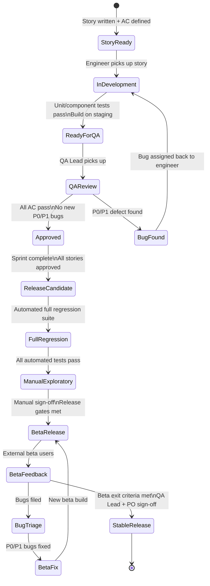

# 44. QA Plan

> Defines the QA process, ownership model, test environments, device lab configuration, bug taxonomy, release gates, and sign-off criteria for DeviceLifeline. Part of the DeviceLifeline documentation suite — see [Documentation Index](README.md).

**Status:** Draft v1 · **Authoring role:** QA Lead · **Last updated:** 2026-06-07
**Related:** [43. Testing Strategy](43-testing-strategy.md), [45. Release Management Plan](45-release-management-plan.md), [16. Risk Analysis](16-risk-analysis.md), [38. DevOps Architecture](38-devops-architecture.md), [40. Deployment Strategy](40-deployment-strategy.md)

---

## 1. Purpose & Scope

This document defines how quality is owned and executed within DeviceLifeline. It covers the QA process lifecycle from story-ready through production release, the people and environments involved, the severity/priority taxonomy used to triage defects, the split between manual and automated testing, the beta program structure, and the formal sign-off criteria for each release channel.

**In scope:**
- QA ownership and RACI
- Test environment tiers and device lab inventory
- Entry and exit criteria at each gate
- Bug severity and priority taxonomy
- Triage process and escalation paths
- Regression suite structure
- Manual vs automated split
- Beta program and external feedback
- Release sign-off checklist

**Out of scope:**
- Low-level test case authoring (test cases live in the test management system)
- CI/CD pipeline implementation details (see [38. DevOps Architecture](38-devops-architecture.md))
- Specific tool configuration (see [43. Testing Strategy](43-testing-strategy.md))

---

## 2. Assumptions

- **A-01:** MVP team size is small (2–5 engineers); the QA Lead role is held by a senior engineer who also writes code.
- **A-02:** A formal test management system (e.g., Linear or Notion with structured test templates) is in place before the first Beta release.
- **A-03:** The device lab is a shared physical/virtual lab accessible to all engineers.
- **A-04:** Bug tracking is done in the same issue tracker as feature development (Linear).
- **A-05:** The beta program uses a limited external cohort (≤200 users) during MVP beta phase.
- **A-06:** There is no dedicated QA engineer at MVP; quality ownership is distributed across the engineering team with a designated QA Lead who owns the process and sign-off authority.

---

## 3. QA Ownership and RACI

### 3.1 Roles

| Role | Responsibility |
|---|---|
| **QA Lead** (Staff Engineer) | Owns the QA plan, release gate sign-off, bug triage, test strategy, device lab. |
| **Feature Engineer** | Writes unit + component tests for their own work; triages bugs in their domain. |
| **Release Manager** | Coordinates release schedule; escalates blockers to QA Lead. |
| **Product Owner** | Provides acceptance criteria; participates in sign-off review for major releases. |
| **Beta Participants** | Provide real-world feedback; file bug reports via in-app feedback channel. |

### 3.2 RACI — Key QA Activities

| Activity | QA Lead | Feature Eng | Release Mgr | Product Owner |
|---|---|---|---|---|
| Define test coverage targets | R/A | C | I | I |
| Write and maintain regression suite | R/A | C | I | I |
| Execute automated tests | A | R | I | — |
| Execute manual exploratory tests | R/A | C | I | I |
| Triage and severity-assign bugs | R/A | C | I | C |
| Release gate review | R/A | C | C | C |
| Sign off release | A | — | C | C |
| Manage beta program | R/A | C | C | I |

*R = Responsible, A = Accountable, C = Consulted, I = Informed*

---

## 4. Test Environments

### 4.1 Environment Tiers

| Environment | Purpose | Data | Access |
|---|---|---|---|
| **Local dev** | Engineer feature development; unit + component tests | Synthetic only | Engineer |
| **CI** | Automated PR gates; integration + smoke tests | Synthetic + fixtures | Automated |
| **Staging** | Pre-release integration; manual exploratory; load tests | Anonymized production-like | QA Lead + engineers |
| **Beta** | External user acceptance; real-world device data | Real user data (consented) | QA Lead + beta users |
| **Production** | Live user traffic | Real user data | Release Manager + on-call |

### 4.2 Staging Environment Spec

| Component | Configuration |
|---|---|
| Supabase project | Dedicated `devicelifeline-staging` project (separate from production) |
| Database | Separate Postgres instance; seeded with anonymized device fixtures |
| Supabase Edge Functions | Deployed separately; uses staging AI API keys with usage caps |
| Windows builds | Debug + release builds deployed to staging distribution endpoint |
| Monitoring | Sentry staging project; PostHog staging property |

### 4.3 Device Lab Inventory

The device lab supports cross-platform testing that cannot be covered on CI runners.

**Virtual Machines (Hyper-V hosted):**

| VM ID | OS | Build | RAM | Storage | Purpose |
|---|---|---|---|---|---|
| VM-W11-23H2-01 | Windows 11 | 22631 | 8 GB | 256 GB NVMe (virtual) | Primary test VM; snapshot-based install/restore tests |
| VM-W11-22H2-01 | Windows 11 | 22621 | 8 GB | 256 GB NVMe (virtual) | OS regression |
| VM-W10-22H2-01 | Windows 10 | 19045 | 8 GB | 256 GB NVMe (virtual) | Windows 10 regression |
| VM-W10-22H2-LOWSPEC | Windows 10 | 19045 | 4 GB | 128 GB HDD (virtual) | Performance + minimum spec testing |

**Physical Hardware:**

| Device ID | Hardware | OS | Purpose |
|---|---|---|---|
| PHY-LAPTOP-01 | Intel i7 12th gen, 16 GB RAM, 512 GB NVMe | Windows 11 23H2 | Real hardware collector fidelity; battery/GPU testing |
| PHY-DESKTOP-01 | AMD Ryzen 7, 32 GB RAM, NVIDIA GPU, 1 TB NVMe | Windows 11 23H2 | GPU/discrete health collector; high-spec performance baseline |
| PHY-LAPTOP-02 | Intel i5 8th gen, 8 GB RAM, 256 GB SATA SSD | Windows 10 22H2 | Older hardware compatibility; SATA SSD health collector |

**Snapshot Management:**
- Each VM has a named "clean baseline" snapshot refreshed with Windows cumulative updates on the first Monday of each month.
- Install/restore tests revert to the clean baseline before each run.
- Snapshot storage is on a dedicated NAS with 2 TB allocated to the device lab.

---

## 5. Entry and Exit Criteria

### 5.1 Feature-Level Gates

**Entry to QA (feature is testable):**
- [ ] All acceptance criteria from the story are defined and agreed.
- [ ] Unit and component tests are written and passing in CI.
- [ ] A build artifact is available on the staging distribution endpoint.
- [ ] No open P0 or P1 defects from the same engineer's recent work.

**Exit from QA (feature is approved):**
- [ ] All defined acceptance criteria pass in the staging environment.
- [ ] No new P0 or P1 defects introduced by the feature.
- [ ] Code coverage targets are met (see [43. Testing Strategy](43-testing-strategy.md) §3.2).
- [ ] QA Lead signs off in the issue tracker.

### 5.2 Release-Level Gates

Each release channel has escalating gate criteria:

| Gate | Canary | Beta | Stable |
|---|---|---|---|
| All automated tests pass | Required | Required | Required |
| Zero open P0 bugs | Required | Required | Required |
| Zero open P1 bugs | Not required | Required | Required |
| P2 bugs reviewed + triaged | Recommended | Required | Required |
| Regression suite pass rate | ≥ 90% | ≥ 98% | 100% |
| AI eval metrics met | Recommended | Required | Required |
| Performance benchmarks within 10% of baseline | Recommended | Required | Required |
| QA Lead sign-off | Required | Required | Required |
| Product Owner sign-off | Not required | Required | Required |
| Load test pass | Not required | Not required | Required |
| Security audit (static analysis clean) | Required | Required | Required |

---

## 6. Bug Severity and Priority Taxonomy

### 6.1 Severity (impact of the defect)

| Severity | Code | Definition | Examples |
|---|---|---|---|
| **Critical** | S0 | Data loss, security vulnerability, application crash on all configurations, data corruption | `RestoreJob` corrupts user files; RLS bypass; crash on launch |
| **High** | S1 | Major feature unusable, no workaround, affects most users | `DeviceDNASnapshot` collection always fails; AI Detective returns 500; install engine silent failure |
| **Medium** | S2 | Feature partially broken, workaround exists, affects a subset of users | `TimelineEvent` timestamps wrong on one Windows version; health chart not rendering for some GPU types |
| **Low** | S3 | Minor visual, non-blocking, cosmetic, or edge-case issue | UI alignment off by a few pixels; tooltip text truncated; rare edge-case error message unclear |

### 6.2 Priority (urgency of fix)

| Priority | Code | Definition | SLA (target fix) |
|---|---|---|---|
| **Urgent** | P0 | Must fix before any release proceeds; blocks sign-off | Same day / immediate hotfix |
| **High** | P1 | Must fix before stable release; may block Beta sign-off | Within current sprint (≤ 1 week) |
| **Medium** | P2 | Should fix before stable release but can be deferred if constrained | Within 2 sprints (≤ 2 weeks) |
| **Low** | P3 | Fix in a future release; does not block any release | Backlog, prioritized opportunistically |

### 6.3 Severity × Priority Matrix (defaults)

|  | S0 Critical | S1 High | S2 Medium | S3 Low |
|---|---|---|---|---|
| Affects all users | P0 | P0 | P1 | P2 |
| Affects majority of users | P0 | P1 | P2 | P3 |
| Affects minority of users | P1 | P2 | P3 | P3 |
| Affects one edge case | P1 | P2 | P3 | P3 |

Priority can be manually overridden by the QA Lead with documented justification.

---

## 7. Bug Triage Process

### 7.1 Triage Cadence

| Meeting | Frequency | Attendees | Duration |
|---|---|---|---|
| Daily bug review | Daily (async, Linear board) | QA Lead | 15 min |
| Sprint triage | Per sprint start | QA Lead, Feature Engineers | 30 min |
| Pre-release triage | 3 days before each release | QA Lead, Release Manager, Product Owner | 45 min |

### 7.2 Triage Steps

1. **Intake:** Bug filed in Linear with title, steps to reproduce, OS version, build version, Sentry error link (if applicable), and screenshot/screen recording.
2. **Reproduce:** QA Lead or assigned engineer reproduces the bug in staging or device lab within 24 hours of filing.
3. **Classify:** Assign Severity (S0–S3) and Priority (P0–P3) using the matrix above.
4. **Assign:** Assign to the engineer whose domain owns the affected component.
5. **Resolution path:** P0/P1 bugs are tracked in the active sprint; P2/P3 go to backlog.
6. **Verification:** Fixed bugs are verified by the QA Lead (not the fixing engineer) in the staging environment.
7. **Close:** Bug closed with verification note and fix version recorded.

---

## 8. Regression Suites

### 8.1 Suite Tiers

| Suite | Trigger | Contents | Duration |
|---|---|---|---|
| **Smoke** | Every PR merge to main | 20 highest-risk automated tests (Playwright @smoke + Rust integration) | ≤ 5 min |
| **Full Regression** | Every release candidate build | Entire automated test suite | ≤ 45 min |
| **Manual Exploratory** | Pre-Beta + Pre-Stable release | Session-based testing on device lab against a test charter | 2–4 hours |
| **AI Eval** | Nightly + prompt changes | Golden dataset evaluation suite | ≤ 20 min |
| **Load / Performance** | Weekly + Pre-Stable | k6 staging load tests + Rust criterion benchmarks | 30 min |

### 8.2 Regression Scope by Release Type

| Release Type | Smoke | Full Auto | Manual Exploratory | AI Eval | Load |
|---|---|---|---|---|---|
| Canary | Yes | No | No | No | No |
| Beta | Yes | Yes | Yes (abbreviated) | Yes | No |
| Stable | Yes | Yes | Yes (full) | Yes | Yes |
| Hotfix | Yes | Yes (affected modules) | Targeted only | No | No |

---

## 9. Manual vs Automated Split

### 9.1 Automation Candidates (should always be automated)

- Deterministic business logic (Rust unit + integration)
- UI component rendering and interaction (Vitest + RTL)
- API contract validation (command schema tests)
- RLS policy enforcement
- Performance benchmarks with numeric thresholds
- Security static analysis

### 9.2 Manual Testing Candidates

- **Exploratory / unknown-unknowns:** Session-based testing by the QA Lead with a written charter, targeting recent changes and high-risk areas.
- **Usability assessment:** Is the UI intuitive? Does the onboarding flow feel coherent? (Automation cannot judge this.)
- **Real hardware collector fidelity:** Does the `DeviceDNASnapshot` on a real physical machine look correct?
- **Visual polish:** Does the health dashboard look right on a high-DPI display vs a 1080p display?
- **Edge-case install scenarios:** Attempting to restore a package that no longer exists in WinGet.
- **Accessibility review:** Screen reader, keyboard navigation (see [53. Accessibility Requirements](53-accessibility-requirements.md)).

### 9.3 Target Automation Rate

| Phase | Automation Rate (of regression suite) | Manual Rate |
|---|---|---|
| MVP Beta | 70% | 30% |
| MVP Stable | 80% | 20% |
| Post-MVP (6 months) | 88% | 12% |

---

## 10. Beta Program

### 10.1 Structure

| Attribute | Value |
|---|---|
| Beta cohort size | 50–200 external users |
| Recruitment channel | Waitlist sign-ups, developer communities, direct outreach |
| Duration | 4–6 weeks before Stable release |
| Feedback channel | In-app feedback form → Linear; dedicated Beta Slack/Discord channel |
| Compensation | Free Pro subscription for the beta period |

### 10.2 Beta Feedback Handling

- All beta bug reports are triaged using the same S0–S3 / P0–P3 taxonomy.
- Beta users are notified of fixes via the changelog in the next beta build.
- Aggregated feedback themes are reviewed by the Product Owner for roadmap input.

### 10.3 Beta Exit Criteria

- [ ] No S0 bugs open.
- [ ] No S1 bugs open that affect more than 10% of beta users.
- [ ] Net Promoter Score (beta survey) ≥ 35.
- [ ] At least 30 beta users have completed the core onboarding + DNA scan flow successfully.
- [ ] AI Detective satisfaction rating (in-app thumbs up/down) ≥ 70% positive.

---

## 11. QA Lifecycle Diagram

---

## Risks & Mitigations

| Risk | Likelihood | Impact | Mitigation |
|---|---|---|---|
| RISK-QA-01: QA Lead bottleneck at small team size — single person blocks releases | High | High | Document all processes so any senior engineer can stand in; automate as much sign-off as possible |
| RISK-QA-02: Bug triage backlog grows faster than resolution capacity | Medium | High | Weekly P2/P3 pruning; time-box triage meetings; separate bug backlog from sprint |
| RISK-QA-03: Device lab hardware ages and drifts from user hardware reality | Medium | Medium | Annual hardware refresh plan; prioritize real beta feedback over lab findings |
| RISK-QA-04: Beta cohort is too homogeneous (e.g., all developers) to surface consumer bugs | Medium | Medium | Actively recruit non-technical beta users; use PostHog telemetry to complement beta feedback |
| RISK-QA-05: Manual exploratory testing surface area grows with feature set | High | Medium | Increase automation rate progressively; use risk-based testing charters to focus manual time |
| RISK-QA-06: AI eval metrics mislead if golden dataset is not representative | Medium | High | Quarterly dataset review; track real-user AI satisfaction ratings from PostHog in parallel |

---

## Future Considerations

- **Dedicated QA engineer:** At scale, hire a dedicated QA Engineer to own test case authoring, device lab management, and beta program coordination.
- **Test management tool:** Graduate from Linear-with-templates to a dedicated test management system (e.g., TestRail, Zephyr) when the test suite exceeds ~500 test cases.
- **Automated accessibility testing:** Integrate `axe-core` into the Playwright e2e suite to catch accessibility regressions automatically (post-MVP).
- **Chaos engineering:** Introduce fault injection (Supabase offline, AI API timeout) into the automated suite post-MVP.
- **Community-driven testing:** Post-MVP, expand beta to a public preview channel with community bug bounty.
- **Cross-platform QA:** When macOS support launches, replicate the device lab and manual test charters for macOS hardware.

---

## Acceptance Criteria

- [ ] AC-QA-01: RACI table is reviewed and agreed by the full engineering team.
- [ ] AC-QA-02: Device lab inventory is documented, physically confirmed, and snapshots are initialized.
- [ ] AC-QA-03: Entry/exit criteria for each release channel are defined and communicated to engineers.
- [ ] AC-QA-04: Bug severity and priority taxonomy is documented in the issue tracker as a label set.
- [ ] AC-QA-05: Triage process is followed for 100% of bugs within 24 hours of filing.
- [ ] AC-QA-06: Regression suite tiers are implemented and run times match the documented targets.
- [ ] AC-QA-07: Beta program recruitment plan and feedback channels are established before first Beta release.
- [ ] AC-QA-08: Beta exit criteria are met before any Stable release is authorized.
- [ ] AC-QA-09: Automation rate targets are tracked and reported per release.
