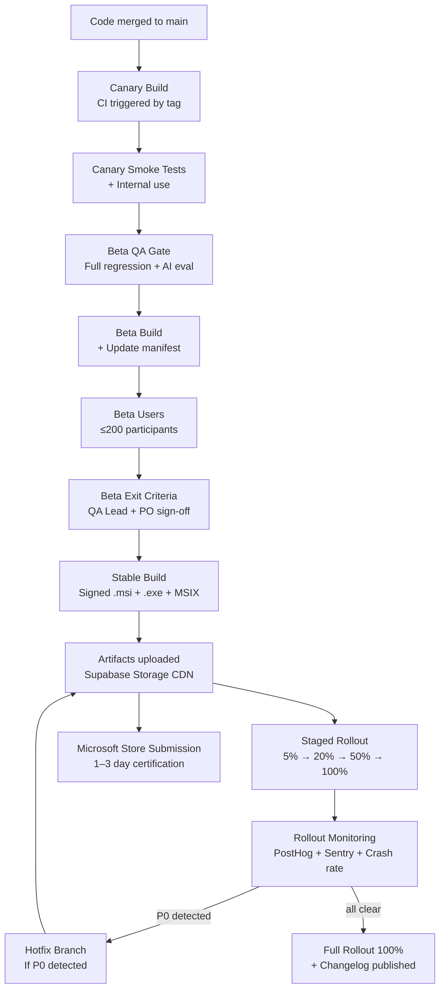
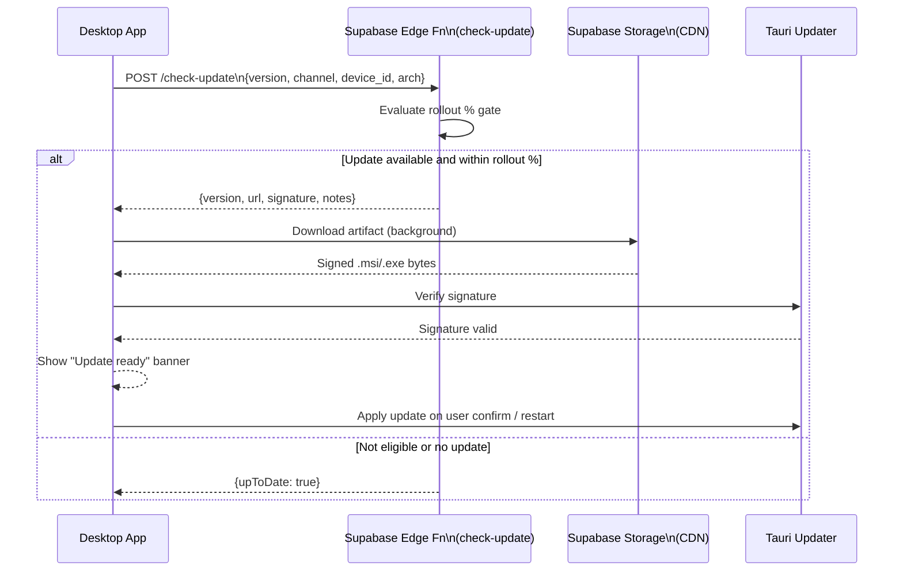

# 45. Release Management Plan

> Defines the versioning scheme, release cadence, channel structure, auto-update mechanism, hotfix process, store submission, and deprecation policy for DeviceLifeline desktop releases. Part of the DeviceLifeline documentation suite — see [Documentation Index](README.md).

**Status:** Draft v1 · **Authoring role:** Release Manager / Staff Engineer · **Last updated:** 2026-06-07
**Related:** [40. Deployment Strategy](40-deployment-strategy.md), [43. Testing Strategy](43-testing-strategy.md), [44. QA Plan](44-qa-plan.md), [38. DevOps Architecture](38-devops-architecture.md), [16. Risk Analysis](16-risk-analysis.md)

---

## 1. Purpose & Scope

This document defines the end-to-end release management process for DeviceLifeline. It covers everything from the moment a release is cut to the moment it reaches a user's device — and what happens if something goes wrong. It is the authoritative reference for version numbering, release channels, the auto-update pipeline, staged rollout mechanics, hotfix procedures, and platform store submission.

**In scope:**
- Semantic versioning scheme and version number format
- Release cadence and channel definitions (stable, beta, canary)
- Release checklist and build pipeline
- Changelog authoring and publication
- Desktop auto-update mechanism (Tauri updater + staged rollout)
- Rollback and hotfix procedures
- Microsoft Store submission cadence
- Deprecation and end-of-life policy

**Out of scope:**
- CI/CD pipeline internals (see [38. DevOps Architecture](38-devops-architecture.md))
- QA gates and sign-off criteria (see [44. QA Plan](44-qa-plan.md))
- Infrastructure provisioning (see [39. Infrastructure Requirements](39-infrastructure-requirements.md))
- Supabase backend deployment (see [40. Deployment Strategy](40-deployment-strategy.md))

---

## 2. Assumptions

- **A-01:** Tauri's built-in updater (`tauri-update`) is used for auto-update delivery. The update server is a Supabase Edge Function that returns update metadata and signed artifact URLs.
- **A-02:** Build artifacts are signed with a code-signing certificate (EV certificate for Windows) stored in GitHub Actions secrets.
- **A-03:** The Microsoft Store pipeline uses the Partner Center API for automated submission; manual Partner Center interaction is reserved for first-time setup and policy exceptions.
- **A-04:** Release artifacts are stored in Supabase Storage (public bucket, CDN-fronted) for the auto-update delivery path.
- **A-05:** The monorepo produces a single versioned desktop artifact per release; the Supabase backend is versioned independently (see [40. Deployment Strategy](40-deployment-strategy.md)).
- **A-06:** At MVP there is no Linux or macOS release pipeline; this document is Windows-first.

---

## 3. Semantic Versioning

### 3.1 Version Format

DeviceLifeline uses [Semantic Versioning 2.0.0](https://semver.org/): `MAJOR.MINOR.PATCH[-PRERELEASE][+BUILD]`

| Component | When to increment | Example |
|---|---|---|
| `MAJOR` | Breaking changes to data models, API contracts, or behavior that cannot be migrated silently | `2.0.0` |
| `MINOR` | New features that are backward-compatible | `1.3.0` |
| `PATCH` | Bug fixes that are backward-compatible | `1.3.1` |
| `-PRERELEASE` | Pre-release channel suffix | `1.3.0-beta.2`, `1.3.0-canary.7` |
| `+BUILD` | CI build metadata (not user-visible) | `1.3.0+20260607.abc1234` |

### 3.2 Version Across Components

| Component | Version Source | Notes |
|---|---|---|
| Tauri desktop app | `src-tauri/tauri.conf.json` `.version` | Single source of truth for user-facing version |
| Rust Core library | `src-tauri/Cargo.toml` | Kept in sync with app version |
| React UI | `package.json` `.version` | Kept in sync with app version |
| Supabase Edge Functions | Independent deployment tags | `edge-fn-v1.2.3` — not exposed to end users |
| Database migrations | Sequential integer prefix | `20260607_001_add_health_index.sql` |

A pre-release script (`scripts/bump-version.sh`) updates all three app version files atomically and creates the Git tag.

---

## 4. Release Cadence and Channels

### 4.1 Channels

| Channel | Audience | Stability | Update Frequency | Auto-update |
|---|---|---|---|---|
| **Canary** | Internal engineers + opt-in power users | Experimental — may have known issues | Multiple per week (every main-branch merge) | Automatic, immediate |
| **Beta** | Beta program participants (≤ 200 users) | Pre-release — feature-complete, light bugs acceptable | 1–2 per week | Automatic, immediate |
| **Stable** | All users | Production quality — zero open P0/P1 bugs | Every 2–4 weeks | Staged rollout (see §7) |

### 4.2 Release Cadence

| Release Type | Trigger | Typical Cadence |
|---|---|---|
| Canary release | Successful CI on `main` branch | Multiple per week |
| Beta release | Sprint complete + QA Beta gate passed | Every 1–2 weeks |
| Stable release | Beta exit criteria met + Release Manager sign-off | Every 2–4 weeks |
| Hotfix release | P0 bug confirmed in production | Within 24 hours of confirmation |

### 4.3 Channel Promotion Flow

```
main branch commit
       ↓
   Canary build
       ↓ (QA + manual review)
   Beta build
       ↓ (Beta exit criteria + sign-off)
  Stable release
```

A version is never promoted backward (e.g., stable to beta). A new release candidate must be cut for each channel promotion.

---

## 5. Release Checklist

The following checklist must be completed for every Stable release. Canary and Beta releases use an abbreviated version (marked with *).

### Pre-Build
- [ ] * All planned stories for the release are merged to `main`.
- [ ] * All automated tests pass in CI (cargo test, Vitest, Playwright @smoke).
- [ ] * Zero open P0 bugs; no regression from previous release.
- [ ] Full regression suite passes (P1 bugs reviewed and dispositioned).
- [ ] AI evaluation metrics meet all thresholds.
- [ ] Performance benchmarks within 10% of previous Stable baseline.
- [ ] Load test on staging passes.
- [ ] Security static analysis clean (cargo audit, npm audit, Semgrep).
- [ ] * `CHANGELOG.md` updated with all user-facing changes.
- [ ] Version number bumped in all version files (`scripts/bump-version.sh` executed).
- [ ] Git tag created: `v{MAJOR}.{MINOR}.{PATCH}`.

### Build and Sign
- [ ] * GitHub Actions release workflow triggered by version tag.
- [ ] * Windows installer built (`.msi` and `.exe` portable) using Tauri bundler.
- [ ] * Artifact signed with EV code-signing certificate.
- [ ] * SHA-256 checksums generated for each artifact.
- [ ] * Artifacts uploaded to Supabase Storage release bucket.
- [ ] * Update manifest (`update.json`) generated and uploaded.

### Deployment
- [ ] * Supabase Edge Function update server updated with new manifest.
- [ ] Staged rollout percentage set to initial value (see §7.2).
- [ ] Microsoft Store submission initiated (see §9).
- [ ] Sentry release created (`sentry-cli releases new v{VERSION}`).

### Post-Release
- [ ] * Changelog published to product website / app news feed.
- [ ] Rollout percentage monitored for 24 hours (see §7.4).
- [ ] * Release announcement published (Discord, email to subscribers).
- [ ] Post-release retrospective scheduled (within 3 days).

---

## 6. Changelogs

### 6.1 Format

DeviceLifeline changelogs follow [Keep a Changelog](https://keepachangelog.com/) conventions with a DeviceLifeline-specific structure:

```
## [1.3.0] — 2026-06-07

### New
- Describe user-visible new features in plain English.

### Improved
- Describe enhancements to existing features.

### Fixed
- Describe bug fixes. Include the severity where notable.

### Performance
- Describe measurable performance improvements with numbers.

### Security
- Describe security fixes. Include CVE ID where applicable.

### Removed / Deprecated
- Describe removed features. Link to migration guide.
```

### 6.2 Authoring Rules

- Written by the Release Manager, reviewed by the Feature Engineer who built each change.
- User-facing language only — no internal ticket numbers, no implementation details.
- Every entry maps to one or more Linear issue IDs (recorded in the release branch, not the user-facing changelog).
- The changelog is maintained in `CHANGELOG.md` at the root of the monorepo and published to the product website.

---

## 7. Auto-Update Mechanism

### 7.1 Architecture

Tauri's built-in updater (`tauri-plugin-updater`) polls an update endpoint on application startup and every 4 hours while the app is running.

The update endpoint is a Supabase Edge Function (`/functions/v1/check-update`) that:
1. Receives the client's current version, OS, architecture, and release channel (from the request payload).
2. Queries the update manifest for the appropriate channel.
3. Returns a JSON response conforming to Tauri's update response schema:
   - `version`: new version string
   - `notes`: brief changelog excerpt
   - `pub_date`: ISO 8601 publish date
   - `url`: signed Supabase Storage URL for the update artifact
   - `signature`: Tauri update signature for artifact integrity verification

The response is only returned if the server-side rollout percentage gate allows the device through (§7.2).

### 7.2 Staged Rollout

Staged rollout limits blast radius for new Stable releases. The Edge Function implements a deterministic percentage gate: a hash of the device's `device_id` (stored in Supabase) modulo 100 is compared to the rollout percentage threshold. If the hash falls within the threshold, the update is offered; otherwise the function returns the previous stable version.

| Day | Rollout % | Action if healthy | Action if issues found |
|---|---|---|---|
| Day 0 (release) | 5% | Monitor error rates + crash reports | Halt rollout (set to 0%); assess hotfix |
| Day 1 | 20% | Expand if no P0/P1 bugs emerging | Halt + hotfix |
| Day 3 | 50% | Expand if metrics stable | Halt + hotfix |
| Day 7 | 100% | Full rollout complete | Hotfix |

Monitoring: PostHog `app_updated` event + Sentry error rate + crash count are reviewed daily during rollout.

### 7.3 Update User Experience

- The app shows a non-intrusive banner: "An update is available — restart to apply."
- Critical security updates (P0 security bugs) use a forced-update prompt that cannot be permanently dismissed.
- The update is downloaded silently in the background while the user continues working.
- If the update download fails, the app retries on next startup; no user action required.

### 7.4 Rollout Halt and Rollback

If a critical regression is detected during rollout:
1. Release Manager sets the rollout percentage to 0% on the Edge Function update manifest — immediately stops new devices receiving the update.
2. Users who already updated are offered a rollback build (the previous Stable version) via a dedicated rollback manifest endpoint.
3. A hotfix cycle begins (see §8).

Rollback is technically the same mechanism as a forward update — the rollback build is delivered via the auto-updater with a version string that may be lower than the current version (Tauri supports downgrade if the `allowDowngrade` flag is set in the updater config).

---

## 8. Hotfix Process

Hotfixes are reserved for P0 bugs (data loss, security vulnerabilities, crashes on launch) in a Stable release.

### 8.1 Hotfix Lifecycle

```
P0 confirmed in production
        ↓
Release Manager declares hotfix
        ↓
Engineer cuts hotfix branch from release tag:
  git checkout -b hotfix/v1.3.1 v1.3.0
        ↓
Fix implemented + code review (at least 1 reviewer)
        ↓
Targeted test suite runs (CI + affected-module regression + smoke)
        ↓
QA Lead verifies fix in staging
        ↓
Hotfix build signed + uploaded
        ↓
Rollout at 100% immediately (hotfixes skip staged rollout for P0 bugs)
        ↓
Hotfix branch merged back to main
        ↓
Post-incident review within 48 hours
```

### 8.2 Hotfix SLAs

| Severity | Time to Declare Hotfix | Time to Deploy |
|---|---|---|
| S0 — data loss / security | ≤ 1 hour of confirmation | ≤ 24 hours |
| S0 — crash on launch (all users) | ≤ 2 hours | ≤ 24 hours |
| S1 — major feature broken | Not a hotfix; normal P1 sprint | ≤ 1 week |

---

## 9. Microsoft Store Submission

### 9.1 Submission Cadence

The Microsoft Store package (`MSIX`) is submitted for every Stable release. Canary and Beta releases are not submitted to the Store.

| Step | Owner | Timing |
|---|---|---|
| MSIX package build | CI pipeline | Triggered by release tag |
| Store submission via Partner Center API | Release Manager | Within 2 hours of Stable artifacts being available |
| Microsoft Store certification | Microsoft | Typically 1–3 business days |
| Store release | Auto (on certification pass) | 1–3 days after submission |

### 9.2 Direct Download vs Store

Direct download (via the product website and the auto-update endpoint) is the primary distribution channel and is not delayed by Store certification. The Store provides discoverability and an alternative trust vector for enterprise/managed device users.

Users who install from the Store receive updates via the Store update mechanism; users who install from the direct download receive updates via the Tauri auto-updater.

### 9.3 Store Metadata Updates

- Screenshots and store listing text are updated for major (MINOR or MAJOR version) releases.
- An automated check validates that the `AppxManifest.xml` version matches the release tag version.

---

## 10. Deprecation Policy

### 10.1 Feature Deprecation

1. **Announce:** Feature marked `[DEPRECATED]` in the changelog at least 2 Stable releases before removal.
2. **In-app notice:** Deprecated UI elements show a dismissible deprecation notice with the removal version.
3. **Remove:** Feature removed in the announced version; migration guide published if user data migration is needed.

### 10.2 OS Version End-of-Life

When Microsoft ends extended support for a Windows version:
- DeviceLifeline announces end of support for that OS version in the next Stable release after Microsoft's EOL date.
- The product continues to work on that OS version for at least 3 more Stable release cycles (approximately 3 months).
- Automated testing for that OS version is removed from the matrix after the support window closes.

### 10.3 API / Schema Deprecation

Backend API and database schema deprecation is governed by [40. Deployment Strategy](40-deployment-strategy.md). Desktop client schema migrations are handled by the SQLite migration runner in the Rust Core; old schema versions are supported for 2 MAJOR versions before being dropped.

---

## Diagrams

### Release Flow



### Auto-Update Sequence



---

## Risks & Mitigations

| Risk | Likelihood | Impact | Mitigation |
|---|---|---|---|
| RISK-RM-01: Staged rollout is bypassed and a P0 bug reaches 100% of users | Low | Critical | Enforce rollout automation; Release Manager has sole authority to set rollout %; alert on rapid error rate increase |
| RISK-RM-02: Code-signing certificate expires mid-release | Low | High | Certificate expiry tracked in a calendar reminder 60 days ahead; renewal is a P0 operational task |
| RISK-RM-03: Microsoft Store certification fails or is delayed for a critical update | Medium | Medium | Direct download is primary channel; Store is secondary; hotfixes never wait for Store |
| RISK-RM-04: Rollback via auto-updater fails on some devices (firewall, corporate proxy) | Medium | High | Document manual rollback procedure (download previous version from website); include in support playbook |
| RISK-RM-05: Version drift between Tauri app and Edge Function API schema causes silent breakage | Medium | High | API versioning headers; Tauri app always sends its version; Edge Functions support N and N-1 major versions |
| RISK-RM-06: Changelog is published with incorrect or missing entries | Medium | Low | Changelog authoring is part of the pre-build checklist; reviewed by at least one other engineer |

---

## Future Considerations

- **macOS release pipeline:** When macOS support launches, this plan extends to cover notarization (Apple Developer account), Homebrew Cask distribution, and macOS-specific staged rollout.
- **Linux release pipeline:** Flatpak or AppImage for future Linux support.
- **Delta updates:** Investigate binary delta updates (e.g., `zstd` patch files) to reduce update download size as the app binary grows.
- **Release notes AI generation:** Auto-draft changelog entries from commit messages and Linear issue titles using an Anthropic API call, reviewed by the Release Manager.
- **Enterprise MSI distribution:** For Business Edition customers, provide a silent-install MSI and GPO-compatible update mechanism that bypasses the auto-update channel.

---

## Acceptance Criteria

- [ ] AC-RM-01: Version format matches SemVer 2.0 and is applied consistently across all version files.
- [ ] AC-RM-02: All three release channels (canary, beta, stable) are operational and distinct before the first Beta release.
- [ ] AC-RM-03: The full release checklist is executed and documented for every Stable release.
- [ ] AC-RM-04: The auto-update endpoint is tested end-to-end on all supported Windows versions before first Stable release.
- [ ] AC-RM-05: Staged rollout mechanism is verified — devices outside the rollout percentage do not receive the new version.
- [ ] AC-RM-06: Rollback mechanism is tested: rolling back from v1.1.0 to v1.0.x delivers the previous build via auto-updater.
- [ ] AC-RM-07: Hotfix SLAs are documented and communicated to the engineering team.
- [ ] AC-RM-08: Microsoft Store submission is automated via the Partner Center API and tested with a dummy submission.
- [ ] AC-RM-09: Deprecation notices are shown in-app for at least 2 Stable releases before a feature is removed.
