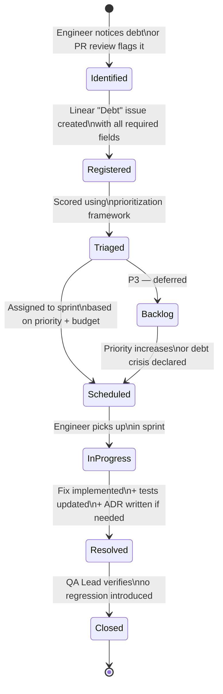
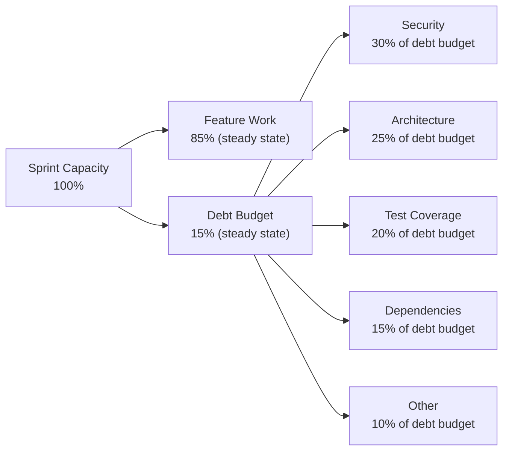

# 46. Technical Debt Strategy

> Defines DeviceLifeline's working definition of technical debt, how it is tracked and budgeted, how debt is categorized and prioritized, the ADR process, and guardrails that prevent uncontrolled accrual. Part of the DeviceLifeline documentation suite — see [Documentation Index](README.md).

**Status:** Draft v1 · **Authoring role:** Staff Engineer · **Last updated:** 2026-06-07
**Related:** [47. Coding Standards](47-coding-standards.md), [43. Testing Strategy](43-testing-strategy.md), [38. DevOps Architecture](38-devops-architecture.md), [16. Risk Analysis](16-risk-analysis.md), [45. Release Management Plan](45-release-management-plan.md)

---

## 1. Purpose & Scope

Technical debt, left unmanaged, compounds into system fragility, reduced velocity, and eventually a rewrite. This document gives the DeviceLifeline engineering team a shared vocabulary and working process for treating debt as a first-class concern: something tracked, budgeted, prioritized, and resolved — not accumulated silently.

**In scope:**
- Shared definition of technical debt (and what it is not)
- Debt registry: how debt is captured and maintained
- Debt budgets: how much capacity per cycle is allocated to debt work
- Debt categories
- Prioritization framework
- Metrics: test coverage, cyclomatic complexity, dependency age
- Architecture Decision Records (ADRs) as a long-term debt prevention tool
- Guardrails: code review, CI gates, and escalation paths

**Out of scope:**
- Detailed coding standards (see [47. Coding Standards](47-coding-standards.md))
- Sprint/project planning mechanics
- Individual team performance management

---

## 2. Assumptions

- **A-01:** The engineering team uses Linear for issue tracking; debt items are tracked as a dedicated issue type ("Debt") in Linear.
- **A-02:** ADRs live in the repository under `docs/adr/` and are numbered sequentially.
- **A-03:** The team operates in 2-week sprints.
- **A-04:** Code quality metrics (coverage, complexity) are reported by CI on every PR and aggregated weekly.
- **A-05:** At MVP scale (2–5 engineers), debt governance is lightweight — no formal committee, just a documented process owned by the Staff Engineer.
- **A-06:** "MVP debt" — deliberate shortcuts taken to hit the MVP timeline — is explicitly documented and scheduled for resolution in the post-MVP backlog.

---

## 3. Working Definition

### 3.1 What is Technical Debt?

Technical debt is any aspect of the codebase, infrastructure, or process that:
- Creates **additional cost** to implement future changes (above what a clean implementation would cost), or
- **Increases the probability** of defects, incidents, or security vulnerabilities.

Technical debt is not:
- A bug or production defect (those are tracked as bugs).
- A feature request or product enhancement.
- A one-time complexity that is inherent to the problem domain (complexity that is necessary is not debt).

### 3.2 Two Types of Debt

| Type | Definition | Example |
|---|---|---|
| **Deliberate debt** | A conscious shortcut taken with full awareness of the cost, documented at the time. | "We hardcode the WinGet path for MVP; post-MVP we will use `which`-style resolution." |
| **Accidental debt** | Unintentional design flaws, discovered later. | A Rust module accrues too many responsibilities because the domain was poorly understood initially. |

Deliberate debt that is not scheduled for resolution within 2 major releases is automatically re-classified as accidental debt.

---

## 4. Debt Registry

### 4.1 Registry Location

The debt registry is a label-filtered view in Linear (`type:Debt`) combined with a maintainer-owned tracking document in the repo at `docs/DEBT_REGISTRY.md`. Linear is the authoritative record; the registry file is a human-readable summary updated quarterly.

### 4.2 Debt Item Fields

Every registered debt item must include:

| Field | Description | Example |
|---|---|---|
| `ID` | Linear issue ID | `DEBT-042` |
| `Title` | Short description | "Collector module has mixed IO + business logic" |
| `Category` | See §5 | `Architecture` |
| `Affected module` | Codebase location | `src-tauri/src/collectors/software.rs` |
| `Date identified` | When it was first recorded | `2026-05-10` |
| `Identified by` | Who found it | `@alice` |
| `Origin` | Deliberate or accidental | `Deliberate — MVP shortcut` |
| `Cost to fix (estimate)` | Rough days effort | `2d` |
| `Impact if not fixed` | Velocity drag, fragility, security, etc. | "Makes adding macOS collector path very hard" |
| `Priority` | See §6 | `P2` |
| `Target resolution` | Sprint or release target | `Post-MVP Sprint 3` |
| `ADR link` | If a design decision is involved | `docs/adr/0007-collector-separation.md` |

### 4.3 Registry Lifecycle

```
Identified → Registered (in Linear) → Triaged → Scheduled → In progress → Resolved → Closed
```

Resolved items are retained in the registry for 6 months for retrospective analysis, then archived.

---

## 5. Debt Categories

| Category | Code | Description | Examples |
|---|---|---|---|
| **Architecture** | ARCH | Structural issues: wrong separation of concerns, missing abstraction layers, circular dependencies | Rust Core collector module doing SQLite writes directly; React component calling Tauri commands directly instead of going through a service layer |
| **Test coverage** | TEST | Modules or behaviors not covered by automated tests | Restore engine error paths untested; RLS policies missing pgTAP tests |
| **Dependency** | DEP | Outdated, deprecated, or risky third-party dependencies | Old version of a Tauri plugin; Supabase client library multiple major versions behind |
| **Performance** | PERF | Known performance issues deferred for later | Unindexed SQL queries; synchronous blocking in async Rust context |
| **Security** | SEC | Security weaknesses that are not yet exploitable but represent risk | Overly permissive CORS config; insufficient input validation in Edge Function |
| **Documentation** | DOC | Missing or out-of-date technical documentation | Module-level Rust doc comments absent; ADR not written for a significant decision |
| **Observability** | OBS | Missing or insufficient logging, tracing, or metrics | Collector errors swallowed without Sentry events; missing structured log fields |
| **Process** | PROC | Development process weaknesses that slow the team | Manual steps in the release checklist that should be automated; missing CI gate |

---

## 6. Debt Budget

### 6.1 Budget Allocation

Technical debt work is allocated a fixed fraction of each sprint's engineering capacity:

| Phase | Debt Budget (% of sprint capacity) | Rationale |
|---|---|---|
| MVP development | 10% | Intentionally low — velocity is the priority; deliberate debt is being created |
| Post-MVP (first 3 months) | 20% | Pay down MVP debt; high-value architectural improvements |
| Steady state | 15% | Ongoing maintenance; prevent new accidental debt |
| Debt-crisis sprint (declared) | 40% | When debt backlog risk score exceeds threshold (see §6.3) |

Budget is not roll-over: unused debt capacity in one sprint does not accumulate.

### 6.2 Budget Allocation Within Categories

| Category | Default % of debt budget | Can be overridden? |
|---|---|---|
| Security (SEC) | 30% | No — security debt always gets first allocation |
| Architecture (ARCH) | 25% | Yes |
| Test coverage (TEST) | 20% | Yes |
| Dependency (DEP) | 15% | Yes |
| All others | 10% | Yes |

### 6.3 Debt Crisis Threshold

If the debt backlog reaches a point where the estimated aggregate cost-to-fix exceeds 20 engineering-days, the Staff Engineer may declare a "Debt Crisis Sprint" — a focused sprint where 40% of capacity is dedicated to debt reduction. This requires agreement from the Product Owner (acknowledging feature work delay).

---

## 7. Prioritization Framework

Debt items are prioritized using a simple scoring model evaluated at each sprint planning session:

### 7.1 Scoring Dimensions

| Dimension | Weight | Score 1 (low) | Score 2 (medium) | Score 3 (high) |
|---|---|---|---|---|
| **Velocity drag** | 30% | Rarely touched area; minimal drag | Occasionally causes slowdowns | Core path; daily friction for engineers |
| **Defect risk** | 30% | Unlikely to cause bugs | Could cause intermittent bugs | High probability of production defect |
| **Security risk** | 25% | No security implication | Theoretical exposure | Real exploit path |
| **Fix cost** | 15% (inverse) | Easy (< 1d) | Moderate (1–5d) | Expensive (> 5d) |

**Composite score** = (velocity_drag × 0.30) + (defect_risk × 0.30) + (security_risk × 0.25) + ((4 - fix_cost) × 0.15)

Items scoring ≥ 2.5 are P1 and should be resolved within 2 sprints. Items scoring ≥ 2.0 are P2 (within 4 sprints). Items < 2.0 are P3 (backlog).

---

## 8. Metrics

### 8.1 Coverage

| Metric | Tool | Threshold | Review Frequency |
|---|---|---|---|
| Rust line coverage | `cargo tarpaulin` | ≥ 80% (see [43. Testing Strategy](43-testing-strategy.md)) | Per PR + weekly report |
| TypeScript line coverage | Vitest `c8` | ≥ 80% | Per PR + weekly report |
| Coverage trend | CI report diff | No sustained downward trend over 3 sprints | Weekly |

### 8.2 Cyclomatic Complexity

| Metric | Tool | Threshold | Review Frequency |
|---|---|---|---|
| Rust function complexity | `cargo-geiger` / custom clippy lint | Cyclomatic complexity ≤ 10 per function | PR gate |
| TypeScript function complexity | ESLint `complexity` rule | Complexity ≤ 10 per function | PR gate |
| High-complexity function count | Weekly report | No increase sprint-over-sprint without a registered debt item | Weekly |

Functions exceeding the threshold must either be refactored immediately or a `DEBT` issue registered before the PR can merge.

### 8.3 Dependency Age

| Metric | Tool | Threshold | Review Frequency |
|---|---|---|---|
| Rust crate major-version lag | `cargo outdated` | No dependency > 2 major versions behind | Monthly |
| npm/pnpm package lag | `npm outdated` | No dependency > 2 major versions behind | Monthly |
| Known CVE count | `cargo audit` + `npm audit` | Zero CVSS ≥ 7.0 | Per PR |

### 8.4 Debt Backlog Health

| Metric | Target |
|---|---|
| Total debt items (open) | ≤ 30 |
| P1 debt items open | ≤ 5 |
| Average age of open debt items | ≤ 60 days |
| Debt items closed per sprint | ≥ 2 (steady state) |

These metrics are reported in the weekly engineering health summary.

---

## 9. Architecture Decision Records (ADRs)

ADRs are the primary tool for preventing future accidental debt. By documenting _why_ a significant decision was made, the team avoids re-litigating it and has a clear record to revisit when the decision no longer fits.

### 9.1 ADR Template

```markdown
# ADR-NNNN: [Short Title]

**Date:** YYYY-MM-DD
**Status:** [Proposed | Accepted | Deprecated | Superseded by ADR-XXXX]
**Deciders:** [Names]

## Context
What is the problem or force driving this decision?

## Decision
What is the decision?

## Rationale
Why this option over the alternatives?

## Alternatives Considered
| Option | Rejected because |
|---|---|
| ... | ... |

## Consequences
### Positive
### Negative (debt created)

## Review Trigger
When should this decision be re-evaluated?
```

### 9.2 When to Write an ADR

An ADR is required when:
- A technology or library is chosen over a realistic alternative.
- A module boundary or data flow design is decided.
- A deliberate technical debt shortcut is taken.
- A significant change to the locked stack is proposed.
- A security-relevant design choice is made.

An ADR is optional (but encouraged) for lower-stakes decisions.

### 9.3 ADR Lifecycle

- ADRs live in `docs/adr/ADR-NNNN-short-title.md` in the monorepo.
- Every ADR is reviewed by at least one other engineer before being marked "Accepted."
- Superseded ADRs are not deleted; their status is updated to "Superseded by ADR-XXXX."
- ADRs are reviewed quarterly as part of the debt review process; any ADR older than 12 months is flagged for a "still relevant?" check.

### 9.4 Seed ADRs for MVP

The following ADRs should be written before or during MVP development:

| ADR | Topic |
|---|---|
| ADR-0001 | Choice of Tauri over Electron |
| ADR-0002 | SQLite as on-device store |
| ADR-0003 | Supabase as cloud backend |
| ADR-0004 | AI API calls routed through Edge Functions (no on-device keys) |
| ADR-0005 | WinGet as primary installer backend |
| ADR-0006 | Rust Core for collectors (vs. Node.js or PowerShell) |
| ADR-0007 | Monorepo structure |
| ADR-0008 | TypeScript strict mode |

---

## 10. Guardrails

### 10.1 Code Review Debt Checks

All PRs must pass code review by at least one engineer who is not the author. Reviewers must:
- Flag any new deliberate debt introduced with a comment including the tag `// TODO(debt): DEBT-XXX`.
- Reject PRs where new debt is introduced without a corresponding registered Linear issue.
- Flag complexity threshold violations.

### 10.2 CI Gates

| Gate | Trigger | Action on failure |
|---|---|---|
| Coverage drop > 2% from main | Every PR | Block merge |
| `cargo clippy` warnings | Every PR | Block merge |
| ESLint complexity rule | Every PR | Block merge |
| `cargo audit` CVSS ≥ 7.0 | Every PR | Block merge |
| New `TODO(debt)` without Linear ID | Every PR | Warning (not block at MVP) |

### 10.3 Debt Review Cadence

| Review | Frequency | Owner | Artifact |
|---|---|---|---|
| Sprint debt triage | Every sprint start | Staff Engineer | Debt items scheduled for sprint |
| Weekly health report | Weekly | CI automated | Coverage + complexity trends |
| Quarterly debt review | Quarterly | Staff Engineer + Product Owner | Debt registry audit; ADR review; budget adjustment |
| Post-MVP debt blitz planning | Once, 4 weeks post-MVP GA | Staff Engineer | Prioritized post-MVP debt sprint plan |

---

## Diagrams

### Debt Lifecycle



### Debt Budget Allocation



---

## Risks & Mitigations

| Risk | Likelihood | Impact | Mitigation |
|---|---|---|---|
| RISK-TD-01: MVP time pressure causes deliberate debt to be unregistered ("invisible debt") | High | High | Make debt registration a PR merge requirement; add `TODO(debt):` scanner to CI |
| RISK-TD-02: Debt budget is consistently raided for feature work | High | High | Product Owner signs off on debt budget at each sprint; report budget adherence in retrospectives |
| RISK-TD-03: ADR process is ignored under pressure | Medium | Medium | ADR for a significant decision is a merge requirement on the relevant PR |
| RISK-TD-04: Debt backlog grows faster than the budget can reduce it | Medium | High | Declare debt crisis sprint if backlog exceeds threshold; never let P1 debt age beyond 4 sprints |
| RISK-TD-05: Complexity metrics are gamed (function decomposition without real simplification) | Low | Low | Code review catches superficial decomposition; complexity of call graph also reviewed |

---

## Future Considerations

- **Automated debt discovery:** Post-MVP, integrate a tool like SonarQube or CodeClimate to automatically surface complexity, duplication, and coverage gaps — reducing reliance on manual registration.
- **Debt cost tracking:** Record estimated vs. actual effort for debt items to improve future scoring.
- **Cross-team ADR governance:** If the team grows significantly, introduce an ADR review board for architectural decisions that span subsystems.
- **Rust `#[allow(dead_code)]` and `#[allow(clippy::...)]` audit:** Periodic automated report of suppression annotations to ensure they are still justified.

---

## Acceptance Criteria

- [ ] AC-TD-01: Debt registry (Linear label + `DEBT_REGISTRY.md`) is initialized with all known MVP deliberate debt items before the first Beta release.
- [ ] AC-TD-02: Debt budget percentages are communicated to the team and enforced at sprint planning.
- [ ] AC-TD-03: Seed ADRs (ADR-0001 through ADR-0008) are written and merged to `main` before MVP Beta.
- [ ] AC-TD-04: CI gates for coverage, complexity, and security are active and block PRs on failure.
- [ ] AC-TD-05: Debt prioritization scores are calculated for all P1 debt items in the registry.
- [ ] AC-TD-06: Quarterly debt review process is scheduled and conducted at least once before Stable release.
- [ ] AC-TD-07: The team can demonstrate that every `TODO(debt):` comment in the codebase has a corresponding Linear issue.
