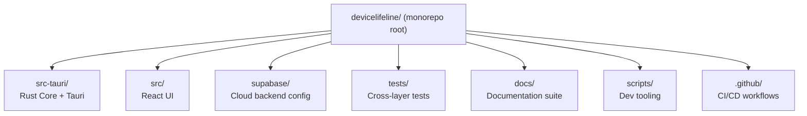
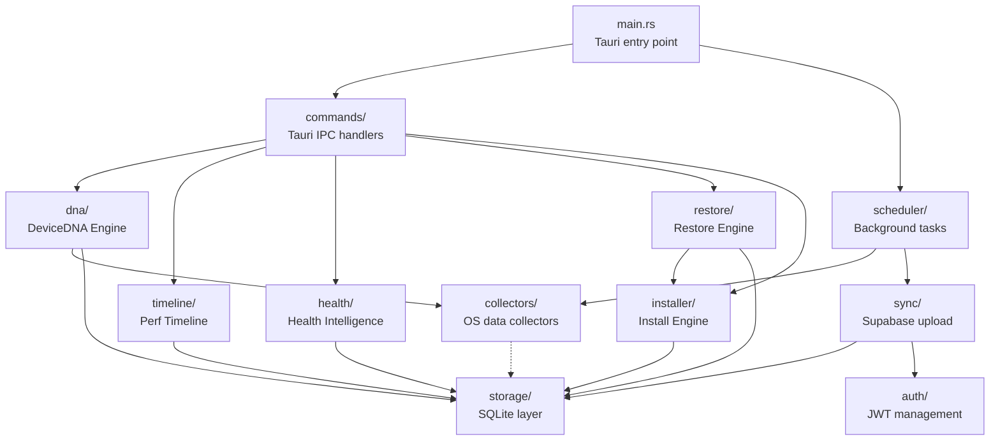
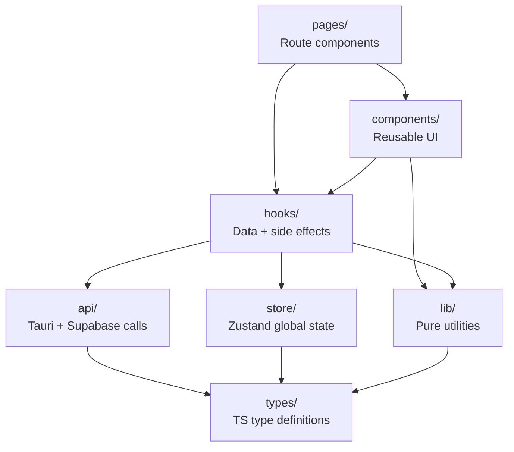

# 48. Folder Structure Specification

> Defines the authoritative monorepo layout for DeviceLifeline — directory tree, module boundaries, naming conventions, and rationale for every top-level and significant sub-directory. Part of the DeviceLifeline documentation suite — see [Documentation Index](README.md).

**Status:** Draft v1 · **Authoring role:** Staff Engineer · **Last updated:** 2026-06-07
**Related:** [47. Coding Standards](47-coding-standards.md), [30. System Architecture](30-system-architecture.md), [38. DevOps Architecture](38-devops-architecture.md), [43. Testing Strategy](43-testing-strategy.md), [46. Technical Debt Strategy](46-technical-debt-strategy.md)

---

## 1. Purpose & Scope

A well-defined folder structure is the first thing a new engineer sees and the last thing anyone wants to refactor. This document specifies the canonical layout of the DeviceLifeline monorepo — every top-level directory and significant sub-directory, with annotations explaining what belongs where, what does not, and where the module boundaries lie.

**In scope:**
- Monorepo root layout
- `src-tauri/` — Rust Core + Tauri configuration
- `src/` — React UI
- `supabase/` — Migrations, Edge Functions, seed data
- `shared-types/` — Cross-boundary type definitions
- `tests/` — Cross-layer test suites
- `.github/` — CI/CD and workflow configuration
- `docs/` — Documentation suite
- `scripts/` — Developer tooling scripts
- Naming conventions for files within each area

**Out of scope:**
- Detailed module API design (see [30. System Architecture](30-system-architecture.md))
- CI pipeline logic (see [38. DevOps Architecture](38-devops-architecture.md))
- Database schema (see [32. Database Design](32-database-design.md))

---

## 2. Assumptions

- **A-01:** The repository is a single Git monorepo (`devicelifeline/`). There are no sub-repositories or git submodules at MVP.
- **A-02:** The Tauri build tool (`tauri-cli`) expects the Rust code at `src-tauri/` and the web assets at `src/` (matching the default Tauri project scaffold).
- **A-03:** Supabase CLI expects the cloud configuration at `supabase/` in the repo root.
- **A-04:** `pnpm` workspaces are used for the JavaScript side; the workspace root `package.json` manages `src/` and any `supabase/functions/` JavaScript tooling.
- **A-05:** The `docs/` directory holds the DeviceLifeline documentation suite (this document and its siblings). It is not shipped in any build artifact.
- **A-06:** All generated files (build outputs, compiled binaries, coverage reports) are in `.gitignore`; their output directories are noted below but not committed.

---

## 3. Annotated Directory Tree

```
devicelifeline/                       ← Monorepo root
├── .github/                          ← GitHub Actions CI/CD
│   ├── workflows/
│   │   ├── ci.yml                    ← PR checks (lint, test, build)
│   │   ├── release.yml               ← Release build + sign + publish
│   │   ├── nightly.yml               ← AI eval, load tests, extended e2e
│   │   └── security.yml              ← Dependency audit, Semgrep scan
│   ├── PULL_REQUEST_TEMPLATE.md
│   └── CODEOWNERS                    ← Module ownership mapping
│
├── src-tauri/                        ← Rust Core + Tauri shell
│   ├── Cargo.toml                    ← Workspace root for Rust crates
│   ├── Cargo.lock
│   ├── rust-toolchain.toml           ← Pinned Rust toolchain version
│   ├── tauri.conf.json               ← Tauri app config (version, bundle, allowlist)
│   ├── build.rs                      ← Tauri build script
│   ├── icons/                        ← App icons (all sizes, platforms)
│   ├── migrations/                   ← SQLite schema migrations
│   │   └── YYYYMMDD_NNN_description.sql
│   ├── schema/
│   │   └── commands.json             ← Tauri IPC command contract schema
│   ├── src/                          ← Rust source code
│   │   ├── main.rs                   ← Tauri entry point; registers commands + events
│   │   ├── lib.rs                    ← Library root (for tests)
│   │   ├── commands/                 ← Tauri command handlers (thin wrappers only)
│   │   │   ├── mod.rs
│   │   │   ├── device.rs             ← Commands: collect_dna_snapshot, get_devices
│   │   │   ├── timeline.rs           ← Commands: get_timeline_events
│   │   │   ├── health.rs             ← Commands: get_health_samples, get_health_score
│   │   │   ├── diagnosis.rs          ← Commands: start_diagnosis_session
│   │   │   ├── restore.rs            ← Commands: create_restore_plan, start_restore_job
│   │   │   └── installer.rs          ← Commands: run_install_task
│   │   ├── collectors/               ← OS data collectors
│   │   │   ├── mod.rs
│   │   │   ├── software.rs           ← SoftwareInventoryItem collector (WMI + registry)
│   │   │   ├── config.rs             ← ConfigItem collector (startup, services, power)
│   │   │   ├── hardware.rs           ← Hardware info collector (CPU, RAM, storage, GPU)
│   │   │   ├── browser.rs            ← Browser profile + extension collector
│   │   │   ├── dev_env.rs            ← Developer environment collector (SDKs, IDEs)
│   │   │   ├── performance.rs        ← HealthSample collector (CPU %, memory, disk I/O)
│   │   │   └── events.rs             ← TimelineEvent collector (event log, change detection)
│   │   ├── dna/                      ← Device DNA Engine
│   │   │   ├── mod.rs
│   │   │   ├── snapshot.rs           ← DeviceDNASnapshot construction + diffing
│   │   │   └── diff.rs               ← Change detection between snapshots
│   │   ├── timeline/                 ← Performance Timeline domain
│   │   │   ├── mod.rs
│   │   │   ├── event.rs              ← TimelineEvent recording + correlation
│   │   │   └── correlator.rs         ← Event-to-performance correlation logic
│   │   ├── health/                   ← Health Intelligence domain
│   │   │   ├── mod.rs
│   │   │   ├── sample.rs             ← HealthSample recording
│   │   │   ├── score.rs              ← HealthScore aggregation
│   │   │   └── alert.rs              ← Predictive alert logic
│   │   ├── installer/                ← Software Installation Engine
│   │   │   ├── mod.rs
│   │   │   ├── winget.rs             ← WinGet integration
│   │   │   ├── store.rs              ← Microsoft Store integration
│   │   │   ├── vendor.rs             ← Vendor installer execution
│   │   │   └── task.rs               ← InstallTask state machine
│   │   ├── restore/                  ← Recovery Center / Restore Engine
│   │   │   ├── mod.rs
│   │   │   ├── plan.rs               ← RestorePlan construction from DeviceDNASnapshot
│   │   │   ├── job.rs                ← RestoreJob + RestoreStep state machine
│   │   │   └── executor.rs           ← Step execution dispatcher
│   │   ├── storage/                  ← On-device SQLite storage layer
│   │   │   ├── mod.rs
│   │   │   ├── db.rs                 ← Database connection pool + migration runner
│   │   │   ├── device_repo.rs        ← CRUD for Device, DeviceDNASnapshot
│   │   │   ├── timeline_repo.rs      ← CRUD for TimelineEvent
│   │   │   ├── health_repo.rs        ← CRUD for HealthSample
│   │   │   └── restore_repo.rs       ← CRUD for RestorePlan, RestoreJob, RestoreStep
│   │   ├── sync/                     ← Supabase cloud sync
│   │   │   ├── mod.rs
│   │   │   ├── client.rs             ← Supabase REST + Realtime client wrapper
│   │   │   └── upload.rs             ← DeviceDNASnapshot + event upload logic
│   │   ├── scheduler/                ← Background task scheduler
│   │   │   ├── mod.rs
│   │   │   └── jobs.rs               ← Scheduled collector runs, sync, health checks
│   │   ├── auth/                     ← Authentication (Supabase Auth token management)
│   │   │   ├── mod.rs
│   │   │   └── token.rs              ← JWT storage, refresh, validation
│   │   └── error.rs                  ← Top-level CoreError + sub-module error re-exports
│   └── tests/                        ← Rust integration tests
│       ├── collector_integration.rs
│       ├── restore_integration.rs
│       ├── installer_integration.rs
│       └── storage_integration.rs
│
├── src/                              ← React UI (TypeScript + Tailwind)
│   ├── main.tsx                      ← React entry point
│   ├── App.tsx                       ← Root component + router
│   ├── api/                          ← Tauri IPC + Supabase API service layer
│   │   ├── tauri/                    ← Typed Tauri invoke wrappers
│   │   │   ├── device.ts
│   │   │   ├── timeline.ts
│   │   │   ├── health.ts
│   │   │   ├── diagnosis.ts
│   │   │   ├── restore.ts
│   │   │   └── installer.ts
│   │   └── supabase/                 ← Supabase client calls (auth, cloud data)
│   │       ├── client.ts             ← Supabase client singleton
│   │       ├── auth.ts
│   │       └── fleet.ts              ← Business Edition fleet queries
│   ├── components/                   ← Reusable UI components
│   │   ├── common/                   ← Atoms/molecules: buttons, badges, cards
│   │   ├── charts/                   ← HealthScoreDial, TimelineChart, etc.
│   │   ├── device/                   ← DeviceDNASnapshot viewer, SoftwareInventory list
│   │   ├── timeline/                 ← TimelineEvent cards + filters
│   │   ├── health/                   ← Health dashboard components
│   │   ├── diagnosis/                ← DiagnosisSession panel + DiagnosisFinding cards
│   │   ├── restore/                  ← RestoreJob progress, RestorePlan builder
│   │   └── layout/                   ← Shell, sidebar, nav, modal scaffolding
│   ├── pages/                        ← Route-level page components
│   │   ├── Dashboard.tsx
│   │   ├── DeviceDNA.tsx
│   │   ├── Timeline.tsx
│   │   ├── HealthIntelligence.tsx
│   │   ├── AIDetective.tsx
│   │   ├── RestoreCenter.tsx
│   │   ├── Settings.tsx
│   │   └── Onboarding.tsx
│   ├── hooks/                        ← Custom React hooks
│   │   ├── use-device-dna.ts
│   │   ├── use-timeline-events.ts
│   │   ├── use-health-score.ts
│   │   ├── use-diagnosis-session.ts
│   │   ├── use-restore-job.ts
│   │   └── use-entitlement.ts        ← Plan/Entitlement gating hook
│   ├── store/                        ← Zustand state stores
│   │   ├── device.store.ts
│   │   ├── diagnosis.store.ts
│   │   ├── restore.store.ts
│   │   └── auth.store.ts
│   ├── lib/                          ← Pure utility functions (no React)
│   │   ├── formatHealthScore.ts
│   │   ├── formatTimelineEvent.ts
│   │   ├── entitlements.ts           ← Plan → Entitlement mapping
│   │   └── constants.ts
│   ├── types/                        ← TypeScript type definitions
│   │   ├── device.types.ts           ← DeviceDNASnapshot, SoftwareInventoryItem, etc.
│   │   ├── timeline.types.ts         ← TimelineEvent
│   │   ├── health.types.ts           ← HealthSample, HealthScore
│   │   ├── diagnosis.types.ts        ← DiagnosisSession, DiagnosisFinding
│   │   ├── restore.types.ts          ← RestorePlan, RestoreJob, RestoreStep
│   │   └── subscription.types.ts     ← Plan, Entitlement
│   └── styles/                       ← Global CSS + Tailwind config
│       ├── global.css
│       └── tailwind.config.ts
│
├── supabase/                         ← Supabase cloud configuration
│   ├── config.toml                   ← Supabase CLI project config
│   ├── migrations/                   ← Postgres schema migrations
│   │   └── YYYYMMDDHHMMSS_description.sql
│   ├── seed.sql                      ← Reference data seed (Plans, etc.)
│   ├── functions/                    ← Supabase Edge Functions (Deno)
│   │   ├── check-update/             ← Auto-update manifest endpoint
│   │   │   ├── index.ts
│   │   │   └── package.json
│   │   ├── ai-diagnose/              ← AI Detective orchestration
│   │   │   ├── index.ts
│   │   │   └── package.json
│   │   ├── ai-summarize/             ← DNA / timeline summarization
│   │   │   ├── index.ts
│   │   │   └── package.json
│   │   ├── sync-device/              ← Device data sync endpoint
│   │   │   ├── index.ts
│   │   │   └── package.json
│   │   └── _shared/                  ← Shared Deno utilities across functions
│   │       ├── auth.ts               ← JWT validation helper
│   │       ├── cors.ts               ← CORS headers
│   │       └── validate.ts           ← Zod schema validation helpers
│   └── tests/                        ← Supabase local test suite
│       ├── rls/                      ← pgTAP RLS policy tests
│       │   ├── devices_rls.test.sql
│       │   ├── snapshots_rls.test.sql
│       │   └── subscriptions_rls.test.sql
│       └── functions/                ← Edge Function Vitest tests
│           ├── ai-diagnose.test.ts
│           └── check-update.test.ts
│
├── tests/                            ← Cross-layer test suites
│   ├── ai-golden/                    ← AI evaluation golden dataset
│   │   ├── README.md
│   │   ├── cases/                    ← Individual eval cases (JSON)
│   │   │   └── case-001-slow-pc.json
│   │   └── schema.json               ← Golden case schema definition
│   ├── ai-eval/                      ← AI eval runner (Vitest)
│   │   └── eval.test.ts
│   ├── e2e/                          ← Playwright e2e tests
│   │   ├── playwright.config.ts
│   │   ├── smoke/                    ← @smoke tagged tests
│   │   │   ├── onboarding.spec.ts
│   │   │   ├── dna-scan.spec.ts
│   │   │   └── restore-flow.spec.ts
│   │   └── extended/                 ← @extended tagged tests
│   │       ├── timeline.spec.ts
│   │       └── ai-detective.spec.ts
│   └── load/                         ← k6 load test scripts
│       ├── sync-device.js
│       └── edge-functions.js
│
├── docs/                             ← Documentation suite (this directory)
│   ├── README.md                     ← Documentation index
│   ├── adr/                          ← Architecture Decision Records
│   │   ├── ADR-0001-tauri-over-electron.md
│   │   └── ...
│   └── NN-title.md                   ← 60 document suite (docs 01–60)
│
├── scripts/                          ← Developer + CI tooling scripts
│   ├── bump-version.sh               ← Atomic version bump across all version files
│   ├── create-vm-snapshot.sh         ← Device lab VM snapshot automation
│   ├── seed-dev-db.sh                ← Seed local SQLite DB with fixtures
│   └── check-schema-drift.sh         ← Verify commands.json matches Rust handler signatures
│
├── .github/
├── .gitignore
├── .nvmrc                            ← Node.js version pin
├── .tool-versions                    ← asdf version pins (Node, pnpm)
├── CHANGELOG.md                      ← User-facing changelog
├── CONTRIBUTING.md                   ← Contribution guide + standards reference
├── LICENSE
├── package.json                      ← pnpm workspace root
├── pnpm-workspace.yaml               ← Workspace package globs
├── README.md                         ← Repository overview
└── turbo.json                        ← Turborepo task pipeline (optional, post-MVP)
```

---

## 4. Module Boundaries

Module boundaries define what each major directory owns and what it must not contain. Crossing these boundaries without a documented reason creates architectural debt (see [46. Technical Debt Strategy](46-technical-debt-strategy.md)).

### 4.1 Rust Core (`src-tauri/src/`)

| Sub-module | Owns | Must NOT contain |
|---|---|---|
| `commands/` | Tauri command handler registration; thin IPC adapters | Business logic; direct DB calls |
| `collectors/` | OS API calls; raw data collection | Persistence; transformation beyond normalization |
| `dna/` | DeviceDNASnapshot construction; diffing | Collector I/O; storage writes |
| `timeline/` | TimelineEvent creation and correlation | Direct collector calls |
| `health/` | HealthSample aggregation; HealthScore; alerts | Collector I/O; UI state |
| `installer/` | WinGet/Store/vendor install execution; InstallTask state machine | Restore planning; UI concerns |
| `restore/` | RestorePlan, RestoreJob, RestoreStep orchestration | Install execution details (delegates to `installer/`) |
| `storage/` | All SQLite read/write operations | Business logic; collector calls |
| `sync/` | Supabase upload/download; Realtime subscriptions | Local storage; business logic |
| `scheduler/` | Cron-like job scheduling; background task dispatch | Job implementation logic |
| `auth/` | JWT storage and refresh | Application business logic |

### 4.2 React UI (`src/`)

| Sub-directory | Owns | Must NOT contain |
|---|---|---|
| `api/` | All Tauri `invoke` calls; all Supabase client calls | Business logic; UI rendering |
| `components/` | Reusable React components; visual presentation | Direct API calls; global state writes |
| `pages/` | Route-level composition of components | Business logic; direct API calls |
| `hooks/` | Side-effect encapsulation; data fetching; derived state | JSX rendering |
| `store/` | Zustand global state definitions | API calls; derived computation |
| `lib/` | Pure TypeScript utilities | React; side effects; API calls |
| `types/` | TypeScript interface and type definitions | Logic; imports from `components/` |

### 4.3 Supabase (`supabase/`)

| Sub-directory | Owns | Must NOT contain |
|---|---|---|
| `migrations/` | All Postgres schema DDL | DML data changes (use `seed.sql`) |
| `functions/` | Server-side Edge Function logic; AI API calls | Client-side state management |
| `functions/_shared/` | Cross-function shared utilities | Function-specific business logic |
| `tests/rls/` | pgTAP RLS policy tests | Application logic tests |
| `tests/functions/` | Edge Function unit/integration tests | UI tests |

### 4.4 Cross-Boundary Type Sharing

TypeScript types shared between the React UI and Supabase Edge Functions live in `src/types/`. These types are:
- Validated against the corresponding Rust `serde`-derived structs manually (automated via `ts-rs` post-MVP).
- Imported by Edge Functions via the pnpm workspace (functions reference `@devicelifeline/types`).
- Used as the shape of Tauri command responses in `src/api/tauri/`.

---

## 5. Naming Conventions

Naming conventions for files and directories follow from [47. Coding Standards](47-coding-standards.md) §6. Key rules per location:

### 5.1 Rust (`src-tauri/src/`)

| Item | Convention | Example |
|---|---|---|
| Directory (module) | `snake_case` | `collectors/`, `dna/` |
| File | `snake_case.rs` | `software.rs`, `snapshot.rs` |
| Entry file | `mod.rs` | `collectors/mod.rs` |

### 5.2 React (`src/`)

| Item | Convention | Example |
|---|---|---|
| Component file | `PascalCase.tsx` | `HealthScoreDial.tsx` |
| Hook file | `use-kebab-case.ts` | `use-health-score.ts` |
| Store file | `kebab-case.store.ts` | `device.store.ts` |
| Utility file | `camelCase.ts` | `formatHealthScore.ts` |
| Type file | `kebab-case.types.ts` | `health.types.ts` |
| Directory | `kebab-case` | `common/`, `charts/`, `device/` |

### 5.3 Supabase (`supabase/`)

| Item | Convention | Example |
|---|---|---|
| Migration file | `YYYYMMDDHHMMSS_description.sql` | `20260607120000_add_health_index.sql` |
| Edge Function directory | `kebab-case` | `ai-diagnose/`, `check-update/` |
| Edge Function entry | `index.ts` | `functions/ai-diagnose/index.ts` |
| Shared utility | `camelCase.ts` | `_shared/auth.ts` |

### 5.4 Tests (`tests/`)

| Item | Convention | Example |
|---|---|---|
| Playwright spec | `kebab-case.spec.ts` | `onboarding.spec.ts` |
| Vitest test | `kebab-case.test.ts` | `eval.test.ts` |
| Golden case file | `case-NNN-description.json` | `case-001-slow-pc.json` |
| k6 load script | `kebab-case.js` | `sync-device.js` |

---

## 6. What Belongs Where — Decision Guide

Quick-reference for common "where does this go?" questions:

| Item | Location | Reason |
|---|---|---|
| New OS data collector | `src-tauri/src/collectors/<name>.rs` | Collector boundary |
| New SQLite table | `src-tauri/migrations/` + `src-tauri/src/storage/<name>_repo.rs` | Storage boundary |
| New Tauri command | `src-tauri/src/commands/<domain>.rs` + schema entry in `schema/commands.json` | IPC boundary |
| New React page/route | `src/pages/<PageName>.tsx` | Route-level |
| Reusable UI widget | `src/components/<domain>/<WidgetName>.tsx` | Reuse |
| Data-fetching logic | `src/hooks/use-<feature>.ts` | Hook boundary |
| New Supabase table | `supabase/migrations/<timestamp>_<description>.sql` | DB schema |
| New AI API call | `supabase/functions/<function-name>/index.ts` | Server-side secret boundary |
| Architecture decision | `docs/adr/ADR-NNNN-<title>.md` | ADR process |
| Developer tooling script | `scripts/<name>.sh` or `scripts/<name>.ts` | Tooling |
| Shared TypeScript type | `src/types/<domain>.types.ts` | Type sharing |

---

## Diagrams

### Top-Level Monorepo Structure



### Rust Core Module Dependency Graph



### React UI Dependency Layers



---

## Risks & Mitigations

| Risk | Likelihood | Impact | Mitigation |
|---|---|---|---|
| RISK-FS-01: Engineers add business logic to `commands/` (violating thin-handler rule) | High | Medium | Code review checklist item; clippy lint banning DB calls in command modules post-MVP |
| RISK-FS-02: `src/types/` drifts from Rust serde structs | High | High | Document the manual sync process; `ts-rs` automation is on the post-MVP roadmap |
| RISK-FS-03: `supabase/functions/_shared/` grows into a large dependency that is hard to test | Medium | Medium | Keep `_shared/` to pure utilities only; no cross-function business logic |
| RISK-FS-04: Test files scattered across the codebase rather than in designated locations | Medium | Low | CI checks that Playwright specs are in `tests/e2e/` and golden data in `tests/ai-golden/` |
| RISK-FS-05: `docs/adr/` is not maintained as the team grows | High | Medium | ADR creation is a PR merge requirement for qualifying decisions (see [46. Technical Debt Strategy](46-technical-debt-strategy.md)) |

---

## Future Considerations

- **Turborepo / Nx:** Post-MVP, when the monorepo grows, introduce Turborepo for task caching and parallelism (a stub `turbo.json` is already in the root).
- **Shared package extraction:** If the React UI and Edge Functions share significant code, extract `@devicelifeline/shared` as a proper pnpm workspace package.
- **`ts-rs` type generation:** Automate TypeScript type generation from Rust `serde` types, eliminating the manual sync between `src/types/` and Rust structs.
- **macOS and Linux source trees:** When those platforms are added, the `src-tauri/src/collectors/` directory will gain platform-conditional modules (e.g., `collectors/macos/`, `collectors/linux/`), while keeping the existing `collectors/windows/` sub-tree.
- **Monorepo tooling upgrade:** Evaluate Cargo workspaces with multiple crates (e.g., a separate `devicelifeline-core` library crate) once the Rust Core exceeds ~20k lines.

---

## Acceptance Criteria

- [ ] AC-FS-01: The repository root exactly matches the top-level structure documented here before the first Beta release.
- [ ] AC-FS-02: `schema/commands.json` exists and contains an entry for every registered Tauri command.
- [ ] AC-FS-03: No Tauri command handler in `commands/` contains direct SQLite calls — all storage is delegated to `storage/`.
- [ ] AC-FS-04: No React component in `components/` or `pages/` directly calls Tauri `invoke` — all IPC goes through `src/api/tauri/`.
- [ ] AC-FS-05: All Supabase migrations are in `supabase/migrations/` and follow the naming convention.
- [ ] AC-FS-06: All AI API calls (OpenAI, Anthropic) originate from `supabase/functions/`, not from the desktop client.
- [ ] AC-FS-07: `docs/adr/` contains at least the 8 seed ADRs documented in [46. Technical Debt Strategy](46-technical-debt-strategy.md).
- [ ] AC-FS-08: CODEOWNERS file maps each top-level directory to an owning engineer or team.
- [ ] AC-FS-09: `CONTRIBUTING.md` references this document for the folder structure and [47. Coding Standards](47-coding-standards.md) for code conventions.
