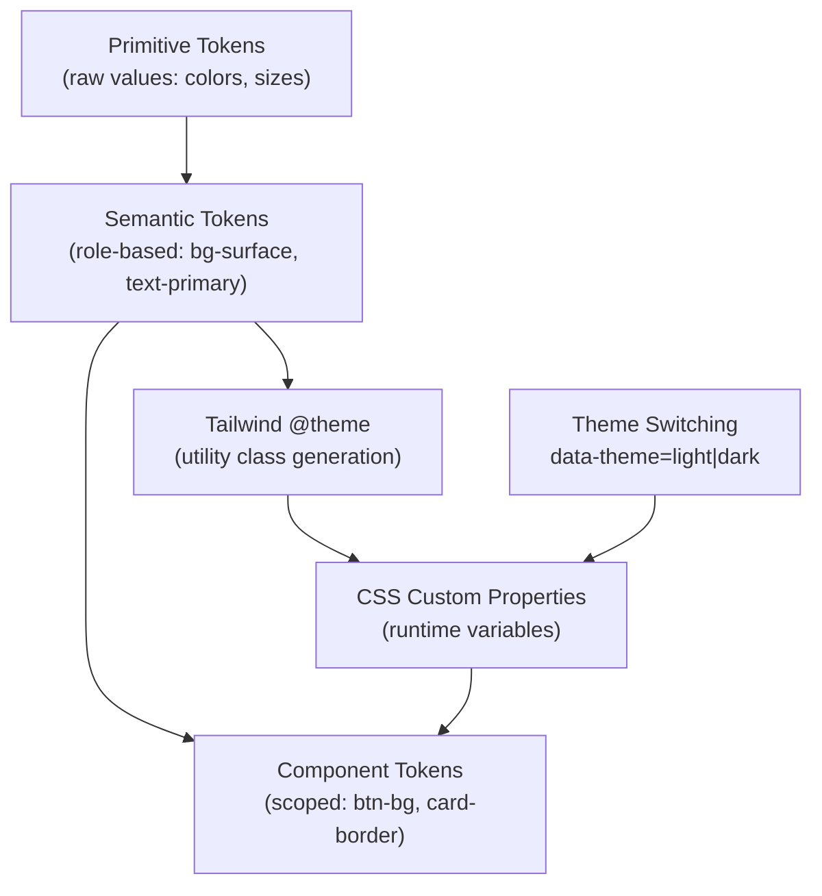
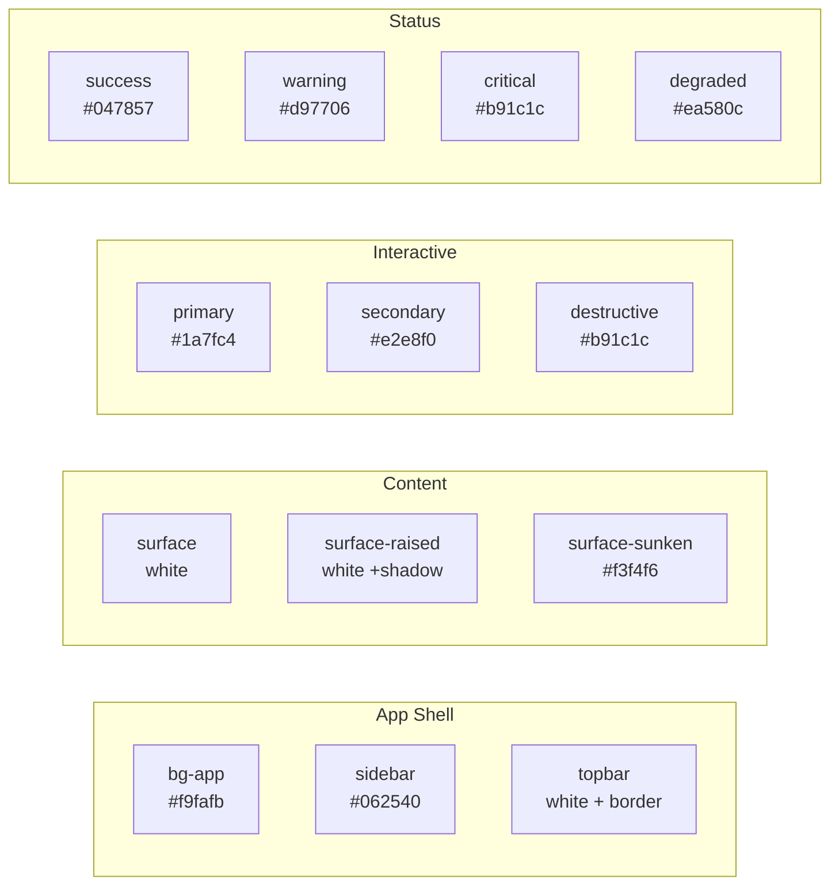
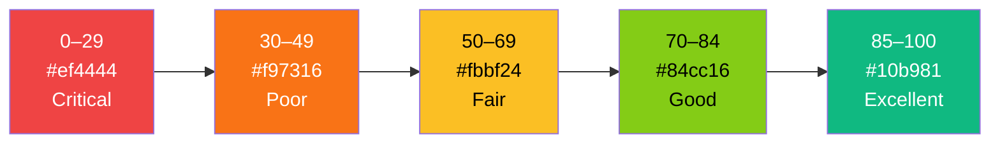

# 49. Design System Specification

> Defines the complete visual language for DeviceLifeline: design tokens (color, typography, spacing, radii, shadows, motion), Tailwind theme mapping, light/dark themes, brand expression, iconography, density model, and voice/tone. Part of the DeviceLifeline documentation suite — see [Documentation Index](README.md).

**Status:** Draft v1 · **Authoring role:** Senior UX Designer + Design Systems Lead · **Last updated:** 2026-06-07
**Related:** [09. Information Architecture](09-information-architecture.md), [50. UI/UX Specification](50-ui-ux-specification.md), [51. Wireframe Documentation](51-wireframe-documentation.md), [52. Component Library Specification](52-component-library-specification.md), [53. Accessibility Requirements](53-accessibility-requirements.md)

---

## 1. Purpose & Scope

This document is the single source of truth for DeviceLifeline's design tokens, visual language, and Tailwind CSS theme configuration. It governs every visual decision in the Tauri + React + TypeScript + Tailwind UI — from a button's border radius to an animated health gauge's color ramp. Engineers must not introduce colors, spacings, shadows, or type styles that are not defined here or approved via the token extension process.

Scope:
- Design token definitions (primitive and semantic) in all categories
- Tailwind v4 theme configuration mapping
- Light and dark theme specification
- Data-visualization palette (Performance Timeline, Health charts)
- Brand expression, illustration style, and iconography guidelines
- Desktop density model
- Motion/animation system
- Voice and tone guidelines

Out of scope: Component-level specifications (see [52. Component Library](52-component-library-specification.md)); accessibility contrast audit (see [53. Accessibility Requirements](53-accessibility-requirements.md)).

---

## 2. Assumptions

- A1: Tailwind CSS v4 is the utility framework; `@theme` directive stores all custom tokens.
- A2: CSS custom properties (`--var`) underpin every token so runtime theming (light/dark) is possible without JavaScript.
- A3: Tauri uses the OS default system webview (WebView2 on Windows); CSS features must be compatible with Chromium-based engines.
- A4: The app targets a pro desktop audience — density is compact-to-standard, not touch-optimized.
- A5: Two themes are required at launch: Light and Dark. System-default follows the OS preference via `prefers-color-scheme`.
- A6: Charts and data-visualization components are rendered in React (via a charting library such as Recharts or custom SVG/Canvas); chart colors are part of this token system.
- A7: Icons are sourced from Lucide Icons (open source, MIT), customized SVGs, or a dedicated icon font. No external CDN at runtime — icons bundled with the app.
- A8: Brand identity (logo, wordmark) exists but detailed brand guidelines are a marketing deliverable. This document covers the UI-level brand expression only.

---

## 3. Design Token Architecture

Tokens follow a two-layer model:

```
Primitive tokens (raw values, never referenced directly in components)
    ↓
Semantic tokens (named by role, reference primitives)
    ↓
Component tokens (optional, scoped to specific components)
```

This ensures that a single primitive palette change propagates through the entire system without touching components.

### 3.1 Token Naming Convention

```
--dl-{category}-{variant}-{modifier?}

Examples:
  --dl-color-surface-primary
  --dl-color-text-secondary
  --dl-color-status-warning
  --dl-space-4
  --dl-radius-card
  --dl-shadow-elevated
  --dl-motion-duration-fast
```

---

## 4. Color Tokens

### 4.1 Primitive Palette

The DeviceLifeline brand is built on a deep teal-blue primary, neutral grays, and a controlled set of status and data-viz accents. All primitives use OKLCH for perceptual uniformity.

#### Brand Blue-Teal Scale

| Token | OKLCH | Hex (approx) | Usage |
|-------|-------|-------------|-------|
| `--dl-blue-50` | `oklch(97% 0.012 220)` | `#f0f7ff` | Subtle tinted backgrounds |
| `--dl-blue-100` | `oklch(94% 0.025 220)` | `#ddeeff` | Hover states on light |
| `--dl-blue-200` | `oklch(88% 0.045 220)` | `#b8daf5` | Borders, dividers on light |
| `--dl-blue-300` | `oklch(79% 0.075 220)` | `#82bfe8` | Secondary interactive |
| `--dl-blue-400` | `oklch(68% 0.110 220)` | `#4a9fd6` | Primary interactive (light mode) |
| `--dl-blue-500` | `oklch(57% 0.135 220)` | `#1a7fc4` | Brand primary |
| `--dl-blue-600` | `oklch(48% 0.130 220)` | `#1265a0` | Pressed/active on light |
| `--dl-blue-700` | `oklch(40% 0.120 225)` | `#0e4f82` | Dark mode primary interactive |
| `--dl-blue-800` | `oklch(32% 0.100 225)` | `#0a3a60` | Dark mode hover |
| `--dl-blue-900` | `oklch(22% 0.075 225)` | `#062540` | Deep background accent |

#### Neutral Gray Scale

| Token | OKLCH | Hex (approx) | Usage |
|-------|-------|-------------|-------|
| `--dl-gray-0` | `oklch(100% 0 0)` | `#ffffff` | |
| `--dl-gray-25` | `oklch(98.5% 0.002 240)` | `#f9fafb` | App background (light) |
| `--dl-gray-50` | `oklch(97% 0.003 240)` | `#f3f4f6` | Surface background (light) |
| `--dl-gray-100` | `oklch(94% 0.006 240)` | `#e9ebee` | Subtle borders |
| `--dl-gray-200` | `oklch(89% 0.010 240)` | `#d1d5db` | Component borders |
| `--dl-gray-300` | `oklch(80% 0.015 240)` | `#9ca3af` | Placeholder text |
| `--dl-gray-400` | `oklch(68% 0.020 240)` | `#6b7280` | Muted text |
| `--dl-gray-500` | `oklch(56% 0.022 240)` | `#4b5563` | Secondary text |
| `--dl-gray-600` | `oklch(44% 0.020 240)` | `#374151` | Primary text (dark mode) |
| `--dl-gray-700` | `oklch(34% 0.018 240)` | `#1f2937` | Surface (dark mode) |
| `--dl-gray-800` | `oklch(24% 0.015 240)` | `#111827` | Background (dark mode) |
| `--dl-gray-900` | `oklch(16% 0.010 240)` | `#0a0f18` | Deep background (dark mode) |
| `--dl-gray-950` | `oklch(10% 0.008 240)` | `#060a12` | Sidebar background (dark mode) |

#### Status / Semantic Color Primitives

| Token | Hex (approx) | Semantic Use |
|-------|-------------|-------------|
| `--dl-green-400` | `#34d399` | Success, healthy |
| `--dl-green-500` | `#10b981` | Confirmed good |
| `--dl-green-700` | `#047857` | Success on light |
| `--dl-yellow-300` | `#fcd34d` | Warning (chart) |
| `--dl-yellow-400` | `#fbbf24` | Warning default |
| `--dl-yellow-600` | `#d97706` | Warning on light |
| `--dl-orange-400` | `#fb923c` | Degraded performance |
| `--dl-orange-600` | `#ea580c` | Critical warning |
| `--dl-red-400` | `#f87171` | Error / critical (dark) |
| `--dl-red-500` | `#ef4444` | Error default |
| `--dl-red-700` | `#b91c1c` | Error on light |
| `--dl-purple-400` | `#a78bfa` | AI Detective accent |
| `--dl-purple-500` | `#8b5cf6` | AI accent default |
| `--dl-teal-400` | `#2dd4bf` | Developer environment accent |
| `--dl-teal-500` | `#14b8a6` | Developer accent default |

### 4.2 Semantic Color Tokens

These are what components reference. They switch values between light and dark themes.

#### Surface Tokens

| Semantic Token | Light Value | Dark Value |
|----------------|------------|-----------|
| `--dl-color-bg-app` | `--dl-gray-25` | `--dl-gray-900` |
| `--dl-color-bg-surface` | `--dl-gray-0` | `--dl-gray-800` |
| `--dl-color-bg-surface-raised` | `--dl-gray-0` | `--dl-gray-700` |
| `--dl-color-bg-surface-sunken` | `--dl-gray-50` | `--dl-gray-950` |
| `--dl-color-bg-sidebar` | `--dl-blue-900` | `--dl-gray-950` |
| `--dl-color-bg-overlay` | `rgba(0,0,0,0.4)` | `rgba(0,0,0,0.6)` |
| `--dl-color-border-default` | `--dl-gray-200` | `--dl-gray-700` |
| `--dl-color-border-subtle` | `--dl-gray-100` | `--dl-gray-800` |
| `--dl-color-border-strong` | `--dl-gray-300` | `--dl-gray-600` |

#### Text Tokens

| Semantic Token | Light Value | Dark Value |
|----------------|------------|-----------|
| `--dl-color-text-primary` | `--dl-gray-900` (via gray scale) | `--dl-gray-50` |
| `--dl-color-text-secondary` | `--dl-gray-500` | `--dl-gray-400` |
| `--dl-color-text-muted` | `--dl-gray-400` | `--dl-gray-500` |
| `--dl-color-text-disabled` | `--dl-gray-300` | `--dl-gray-600` |
| `--dl-color-text-inverse` | `--dl-gray-0` | `--dl-gray-900` |
| `--dl-color-text-link` | `--dl-blue-500` | `--dl-blue-300` |
| `--dl-color-text-link-hover` | `--dl-blue-600` | `--dl-blue-200` |
| `--dl-color-text-on-sidebar` | `--dl-gray-200` | `--dl-gray-200` |
| `--dl-color-text-on-sidebar-active` | `--dl-gray-0` | `--dl-gray-0` |

#### Interactive / Brand Tokens

| Semantic Token | Light Value | Dark Value |
|----------------|------------|-----------|
| `--dl-color-interactive-primary` | `--dl-blue-500` | `--dl-blue-400` |
| `--dl-color-interactive-primary-hover` | `--dl-blue-600` | `--dl-blue-300` |
| `--dl-color-interactive-primary-active` | `--dl-blue-700` | `--dl-blue-200` |
| `--dl-color-interactive-primary-subtle` | `--dl-blue-50` | `--dl-blue-900` |
| `--dl-color-interactive-secondary` | `--dl-gray-200` | `--dl-gray-700` |
| `--dl-color-interactive-secondary-hover` | `--dl-gray-300` | `--dl-gray-600` |
| `--dl-color-focus-ring` | `--dl-blue-400` | `--dl-blue-400` |

#### Status Tokens

| Semantic Token | Light | Dark | Use |
|----------------|-------|------|-----|
| `--dl-color-status-success` | `--dl-green-700` | `--dl-green-400` | Healthy, complete |
| `--dl-color-status-success-bg` | `--dl-green-50`* | `rgba(52,211,153,.12)` | Success tinted surface |
| `--dl-color-status-warning` | `--dl-yellow-600` | `--dl-yellow-400` | Warning |
| `--dl-color-status-warning-bg` | `#fefce8` | `rgba(251,191,36,.12)` | Warning tinted surface |
| `--dl-color-status-critical` | `--dl-red-700` | `--dl-red-400` | Critical / error |
| `--dl-color-status-critical-bg` | `#fef2f2` | `rgba(239,68,68,.12)` | Error tinted surface |
| `--dl-color-status-degraded` | `--dl-orange-600` | `--dl-orange-400` | Performance degraded |
| `--dl-color-status-degraded-bg` | `#fff7ed` | `rgba(251,146,60,.12)` | Degraded tinted surface |
| `--dl-color-status-info` | `--dl-blue-500` | `--dl-blue-300` | Informational |
| `--dl-color-status-info-bg` | `--dl-blue-50` | `rgba(26,127,196,.12)` | Info tinted surface |
| `--dl-color-status-unknown` | `--dl-gray-400` | `--dl-gray-500` | Unknown / collecting |

_*green-50 = `#f0fdf4` approximate_

### 4.3 Data-Visualization Palette

The data-viz palette is optimized for:
- Distinguishability for colorblind users (tested against deuteranopia simulation)
- Legibility on both light and dark chart backgrounds
- Categorical series (up to 8 distinct series before grouping)
- Sequential/diverging ramps for health scores

#### Categorical Series Colors

| Index | Token | Hex | Purpose |
|-------|-------|-----|---------|
| 0 | `--dl-viz-series-0` | `#1a7fc4` (brand blue) | Primary metric / CPU |
| 1 | `--dl-viz-series-1` | `#10b981` (green) | RAM / Memory |
| 2 | `--dl-viz-series-2` | `#8b5cf6` (purple) | GPU |
| 3 | `--dl-viz-series-3` | `#f59e0b` (amber) | Disk / Storage |
| 4 | `--dl-viz-series-4` | `#14b8a6` (teal) | Network |
| 5 | `--dl-viz-series-5` | `#f97316` (orange) | Battery |
| 6 | `--dl-viz-series-6` | `#ec4899` (pink) | Baseline / Reference |
| 7 | `--dl-viz-series-7` | `#64748b` (slate) | Aggregate / Other |

#### Health Score Gradient (Sequential)

Health scores 0–100 map to a diverging ramp:

| Score Range | Color | Meaning |
|-------------|-------|---------|
| 0–29 | `#ef4444` (red-500) | Critical |
| 30–49 | `#f97316` (orange-500) | Poor |
| 50–69 | `#fbbf24` (yellow-400) | Fair / Degraded |
| 70–84 | `#84cc16` (lime-400) | Good |
| 85–100 | `#10b981` (green-500) | Excellent |

#### Timeline Event Colors

| Event Type | Token | Color |
|------------|-------|-------|
| Software Install | `--dl-event-install` | `#1a7fc4` |
| Software Remove | `--dl-event-remove` | `#64748b` |
| Windows Update | `--dl-event-win-update` | `#8b5cf6` |
| Driver Update | `--dl-event-driver` | `#14b8a6` |
| Performance Impact | `--dl-event-perf-impact` | `#f97316` |
| Crash Event | `--dl-event-crash` | `#ef4444` |
| Health Alert | `--dl-event-health-alert` | `#fbbf24` |
| Correlation Marker | `--dl-event-correlation` | `#f97316` |
| Rollback / Recovery | `--dl-event-recovery` | `#10b981` |

---

## 5. Typography Tokens

### 5.1 Font Families

DeviceLifeline uses Inter for UI text (optimal on screen, widely available, excellent legibility at small sizes) and JetBrains Mono for technical data (crash codes, event IDs, file paths, hex values).

| Token | Value | Use |
|-------|-------|-----|
| `--dl-font-ui` | `'Inter', system-ui, -apple-system, sans-serif` | All UI text |
| `--dl-font-mono` | `'JetBrains Mono', 'Cascadia Code', ui-monospace, monospace` | Code, paths, IDs |
| `--dl-font-numeric` | `'Inter'` with `font-variant-numeric: tabular-nums` | All numbers in tables and charts |

Both fonts are bundled with the application; no network font load.

### 5.2 Type Scale

Based on a 1.25 (Major Third) modular scale from a 14px base, optimized for desktop density.

| Token | Size | Line Height | Weight | Usage |
|-------|------|-------------|--------|-------|
| `--dl-text-xs` | `11px` | `16px` | 400 | Metadata labels, badge text |
| `--dl-text-sm` | `12px` | `18px` | 400 | Secondary text, table cells |
| `--dl-text-base` | `14px` | `20px` | 400 | Primary body, inputs, nav items |
| `--dl-text-md` | `15px` | `22px` | 400/500 | Slightly elevated body |
| `--dl-text-lg` | `16px` | `24px` | 500 | Section headers (cards, panels) |
| `--dl-text-xl` | `18px` | `26px` | 600 | Page section titles |
| `--dl-text-2xl` | `22px` | `30px` | 600 | Page H1 titles |
| `--dl-text-3xl` | `28px` | `36px` | 700 | Dashboard hero numbers |
| `--dl-text-4xl` | `36px` | `44px` | 700 | Health score gauges |

### 5.3 Font Weight Tokens

| Token | Value | Usage |
|-------|-------|-------|
| `--dl-weight-regular` | `400` | Body copy |
| `--dl-weight-medium` | `500` | Navigation labels, field labels |
| `--dl-weight-semibold` | `600` | Section headings, button labels |
| `--dl-weight-bold` | `700` | Dashboard numbers, gauge values |

### 5.4 Letter Spacing

| Token | Value | Usage |
|-------|-------|-------|
| `--dl-tracking-tight` | `-0.01em` | Large display numerals |
| `--dl-tracking-normal` | `0` | Body text |
| `--dl-tracking-wide` | `0.04em` | UPPERCASE status labels, badge text |
| `--dl-tracking-wider` | `0.08em` | Metric unit labels |

---

## 6. Spacing Tokens

Based on a 4px base unit. Named `--dl-space-{n}` where n = multiplier.

| Token | px | rem | Common Use |
|-------|----|-----|-----------|
| `--dl-space-0` | `0` | `0` | |
| `--dl-space-0-5` | `2px` | `0.125rem` | Icon to text gap |
| `--dl-space-1` | `4px` | `0.25rem` | Dense internal padding |
| `--dl-space-1-5` | `6px` | `0.375rem` | Tight label spacing |
| `--dl-space-2` | `8px` | `0.5rem` | Internal component padding |
| `--dl-space-3` | `12px` | `0.75rem` | Badge/pill padding |
| `--dl-space-4` | `16px` | `1rem` | Card padding (compact) |
| `--dl-space-5` | `20px` | `1.25rem` | Standard section gap |
| `--dl-space-6` | `24px` | `1.5rem` | Card padding (standard) |
| `--dl-space-8` | `32px` | `2rem` | Section separation |
| `--dl-space-10` | `40px` | `2.5rem` | Large section gap |
| `--dl-space-12` | `48px` | `3rem` | Panel header |
| `--dl-space-16` | `64px` | `4rem` | Major layout gap |

### 6.1 Layout Dimensions

| Token | Value | Use |
|-------|-------|-----|
| `--dl-sidebar-width` | `220px` | Collapsed: `56px` |
| `--dl-topbar-height` | `48px` | Fixed top bar |
| `--dl-panel-max-width` | `400px` | Side panels (detail, filters) |
| `--dl-content-max-width` | `1280px` | Max page content width |
| `--dl-modal-sm` | `400px` | Small modals (confirm, paywall) |
| `--dl-modal-md` | `600px` | Standard modals (export config) |
| `--dl-modal-lg` | `800px` | Large modals (restore preview) |

---

## 7. Border Radius Tokens

| Token | Value | Use |
|-------|-------|-----|
| `--dl-radius-none` | `0` | Sharp utility (dividers) |
| `--dl-radius-sm` | `4px` | Badges, inputs |
| `--dl-radius-md` | `6px` | Buttons, dropdowns |
| `--dl-radius-lg` | `8px` | Cards |
| `--dl-radius-xl` | `12px` | Modals, drawers |
| `--dl-radius-2xl` | `16px` | Onboarding panels |
| `--dl-radius-full` | `9999px` | Pills, circular avatars |

---

## 8. Shadow Tokens

Shadows use `box-shadow` with no heavy drop shadows (desktop app convention). Elevation expressed via layered subtle shadows.

| Token | Value (light) | Use |
|-------|--------------|-----|
| `--dl-shadow-none` | `none` | Flat surfaces |
| `--dl-shadow-sm` | `0 1px 2px 0 rgba(0,0,0,0.05)` | Input fields, subtle cards |
| `--dl-shadow-md` | `0 2px 6px 0 rgba(0,0,0,0.08), 0 1px 2px 0 rgba(0,0,0,0.04)` | Standard cards |
| `--dl-shadow-lg` | `0 4px 12px 0 rgba(0,0,0,0.10), 0 2px 4px 0 rgba(0,0,0,0.06)` | Modals, elevated panels |
| `--dl-shadow-xl` | `0 8px 24px 0 rgba(0,0,0,0.12), 0 4px 8px 0 rgba(0,0,0,0.08)` | Tooltips on dark |
| `--dl-shadow-focus` | `0 0 0 3px var(--dl-color-focus-ring)` | Focus ring |

In dark mode, shadows reduce opacity by ~60% as dark surfaces make outer shadows less visible; inner separation is achieved via border tokens instead.

---

## 9. Motion Tokens

DeviceLifeline targets a composed, professional feel — animations are purposeful and restrained. Respect `prefers-reduced-motion` at every animation site.

| Token | Value | Use |
|-------|-------|-----|
| `--dl-motion-duration-instant` | `50ms` | Hover color change |
| `--dl-motion-duration-fast` | `100ms` | Tooltip fade, badge appear |
| `--dl-motion-duration-base` | `150ms` | Button state, dropdown open |
| `--dl-motion-duration-slow` | `250ms` | Panel slide-in, modal open |
| `--dl-motion-duration-slower` | `400ms` | Page transition, health gauge |
| `--dl-motion-duration-chart` | `600ms` | Timeline / chart data entry |
| `--dl-motion-easing-default` | `cubic-bezier(0.4, 0, 0.2, 1)` | General (Material "standard") |
| `--dl-motion-easing-enter` | `cubic-bezier(0, 0, 0.2, 1)` | Elements entering |
| `--dl-motion-easing-exit` | `cubic-bezier(0.4, 0, 1, 1)` | Elements leaving |
| `--dl-motion-easing-spring` | `cubic-bezier(0.34, 1.56, 0.64, 1)` | Playful entrance (onboarding only) |

### 9.1 Reduced-Motion Override

All motion tokens must be gated:

```css
@media (prefers-reduced-motion: reduce) {
  --dl-motion-duration-fast: 0ms;
  --dl-motion-duration-base: 0ms;
  --dl-motion-duration-slow: 0ms;
  --dl-motion-duration-slower: 0ms;
  --dl-motion-duration-chart: 0ms;
}
```

See [53. Accessibility Requirements](53-accessibility-requirements.md) §8.

---

## 10. Tailwind v4 Theme Configuration

Tokens map to Tailwind via the `@theme` directive in the root CSS file. The mapping below shows representative entries; the full list mirrors every token in Sections 4–9.

```css
/* Illustrative @theme mapping — not exhaustive */
@theme {
  /* Colors */
  --color-brand-500: var(--dl-blue-500);
  --color-surface: var(--dl-color-bg-surface);
  --color-bg-app: var(--dl-color-bg-app);
  --color-text-primary: var(--dl-color-text-primary);
  --color-status-success: var(--dl-color-status-success);
  --color-status-warning: var(--dl-color-status-warning);
  --color-status-critical: var(--dl-color-status-critical);
  --color-focus: var(--dl-color-focus-ring);

  /* Typography */
  --font-ui: var(--dl-font-ui);
  --font-mono: var(--dl-font-mono);
  --text-xs: var(--dl-text-xs);
  --text-sm: var(--dl-text-sm);
  --text-base: var(--dl-text-base);

  /* Spacing */
  --spacing-1: var(--dl-space-1);
  --spacing-2: var(--dl-space-2);
  --spacing-4: var(--dl-space-4);
  --spacing-6: var(--dl-space-6);
  --spacing-8: var(--dl-space-8);

  /* Radii */
  --radius-sm: var(--dl-radius-sm);
  --radius-md: var(--dl-radius-md);
  --radius-lg: var(--dl-radius-lg);
  --radius-xl: var(--dl-radius-xl);

  /* Shadows */
  --shadow-sm: var(--dl-shadow-sm);
  --shadow-md: var(--dl-shadow-md);
  --shadow-lg: var(--dl-shadow-lg);
}
```

### 10.1 Theme Switching

The root `<html>` element receives `data-theme="light"` or `data-theme="dark"`. CSS custom properties are redefined per theme:

```css
:root, [data-theme="light"] {
  --dl-color-bg-app: var(--dl-gray-25);
  --dl-color-bg-surface: var(--dl-gray-0);
  /* ... all light tokens */
}

[data-theme="dark"] {
  --dl-color-bg-app: var(--dl-gray-900);
  --dl-color-bg-surface: var(--dl-gray-800);
  /* ... all dark tokens */
}
```

The React app reads the OS preference via `window.matchMedia('(prefers-color-scheme: dark)')` and applies `data-theme` on mount. Users can override via Settings > Appearance. The preference is persisted to local SQLite and survives restarts.

---

## 11. Light and Dark Theme Specification

### 11.1 Light Theme

- App background: `--dl-gray-25` (#f9fafb) — off-white, not stark white
- Sidebar: deep `--dl-blue-900` (#062540) for brand contrast and clear navigation separation
- Cards/surfaces: pure white with `--dl-shadow-md`
- Primary interactive: `--dl-blue-500`
- Borders: `--dl-gray-200` (2px separators); `--dl-gray-100` for subtle
- Text primary: near-black, not pure `#000`
- Status indicators use full-saturation status tokens for visibility

### 11.2 Dark Theme

- App background: `--dl-gray-900` (#0a0f18) — near-black with slight blue undertone
- Sidebar: `--dl-gray-950` (#060a12) — darkest surface, distinct from content
- Cards/surfaces: `--dl-gray-800`, elevated to `--dl-gray-700` for popovers
- Primary interactive: `--dl-blue-400` (slightly lighter for dark-mode contrast)
- Borders: `--dl-gray-700` (subtle, structural); `--dl-gray-600` for emphasis
- Text primary: `--dl-gray-50`; secondary: `--dl-gray-400`
- Status indicators: use lighter variants for readability on dark backgrounds

### 11.3 Sidebar Specifics

Both themes keep the sidebar visually distinct to provide a strong navigation anchor:

| Element | Light | Dark |
|---------|-------|------|
| Background | `--dl-blue-900` | `--dl-gray-950` |
| Item label (resting) | `--dl-gray-300` | `--dl-gray-400` |
| Item label (active) | `--dl-gray-0` | `--dl-gray-0` |
| Item bg (active) | `rgba(255,255,255,0.12)` | `rgba(255,255,255,0.08)` |
| Item bg (hover) | `rgba(255,255,255,0.06)` | `rgba(255,255,255,0.05)` |
| Icon (resting) | `--dl-gray-400` | `--dl-gray-500` |
| Icon (active) | `--dl-blue-300` | `--dl-blue-300` |

---

## 12. Brand Expression

### 12.1 Design Personality

DeviceLifeline is a professional tool for technical users. The visual language should communicate:
- **Precision** — clean grids, precise alignment, no decorative noise
- **Intelligence** — subtle use of the brand blue, purposeful accent colors
- **Trustworthiness** — consistent, predictable patterns; no visual surprises
- **Power** — density and data density appropriate for pro users; not dumbed down

Avoid: neon gradients, heavy glassmorphism, excessive rounded corners, cartoonish illustrations.

### 12.2 Illustration Style

Onboarding and empty-state illustrations:
- Line-based, geometric, minimal fill
- Brand blue + one neutral accent
- No photorealism; no abstract swirls
- Illustrations depict computing objects (circuit traces, device outlines, data graphs) in a clean line style
- Maximum 3-color palette per illustration

### 12.3 Logo / Wordmark

- Wordmark: "DeviceLifeline" in `--dl-font-ui` semibold; no hyphen in UI text
- Logo mark: compact form of the wordmark used in sidebar top and window title bar
- On dark sidebar: white wordmark
- On light surfaces: `--dl-blue-900` wordmark
- Minimum size: 16px height (mark only)

---

## 13. Iconography

### 13.1 Icon Library

Source: Lucide Icons (MIT licensed; consistent stroke-based style). Custom product icons (e.g., Device DNA helix mark, Timeline icon) are SVG files stored at `src/assets/icons/`.

| Category | Source |
|----------|--------|
| Navigation, actions, UI | Lucide Icons |
| Product-specific | Custom SVG in `/assets/icons/` |
| Emoji / decorative | None in production UI |

### 13.2 Icon Sizing

| Context | Size | Token |
|---------|------|-------|
| Inline with body text | `14×14px` | `--dl-icon-sm` |
| Button / form icon | `16×16px` | `--dl-icon-base` |
| Sidebar nav icon | `18×18px` | `--dl-icon-nav` |
| Dashboard widget icon | `20×20px` | `--dl-icon-md` |
| Empty-state icon | `48×48px` | `--dl-icon-xl` |
| Onboarding feature icon | `64×64px` | `--dl-icon-2xl` |

### 13.3 Icon Color

- Icons inherit color from their parent text context unless explicitly overridden
- Status icons use the corresponding `--dl-color-status-*` token
- AI Detective uses `--dl-purple-400` for its sparkle/wand icon
- Never render icons at opacity below `0.4` (accessibility)

---

## 14. Desktop Density Model

DeviceLifeline targets a **compact-standard** density — denser than consumer apps, appropriate for power users who want more data on screen.

### 14.1 Density Scale

| Density | Context | Description |
|---------|---------|-------------|
| Compact | Data tables, timelines, crash/event lists | Row height 32px; minimum padding |
| Standard | Cards, forms, settings panels | Row/card internal padding `--dl-space-4` |
| Comfortable | Onboarding, empty states, paywall modals | More whitespace; larger type |

### 14.2 Touch Target Minimum

Although this is a desktop app, minimum interactive target: **24×24px**. Interactive icons that appear smaller visually must have an invisible hit-area padding to meet this. See [53. Accessibility Requirements](53-accessibility-requirements.md).

### 14.3 Information Density Guideline

- Dashboard: standard density with widget grid
- Timeline: compact density; events are 28px row height minimum
- Software Inventory tables: compact 32px rows
- Forms / settings: standard density
- Onboarding: comfortable density

---

## 15. Voice and Tone

### 15.1 Principles

| Principle | Description |
|-----------|-------------|
| **Plain English** | Translate technical concepts (BSOD stop codes, SMART attributes, WMI) into clear prose. Never surface raw technical IDs without a human-readable label. |
| **Direct but not terse** | Say what you mean in as few words as needed. Avoid filler like "Please note that..." |
| **Action-oriented** | Error messages and alerts always suggest next steps. Never a dead end. |
| **Honest about uncertainty** | AI Detective always displays a confidence score. Do not overstate certainty. |
| **Professional, not corporate** | Friendly and clear, not stiff or robotic. Avoid jargon buzzwords ("synergy", "leverage"). |
| **Device-centric, not machine-centric** | Refer to users' computers as "your device," not "your machine" or "your PC." |

### 15.2 Tone by Surface

| Surface | Tone |
|---------|------|
| Onboarding | Warm, encouraging, brief. Welcome and orient. |
| Dashboard | Neutral, informational. Facts with context. |
| Health alerts | Calm urgency. Serious but not alarming. |
| Crash Intelligence | Explanatory, empathetic. "Here's what happened and why." |
| AI Detective | Investigative, thoughtful. Shows reasoning, not just conclusions. |
| Error messages | Honest, specific, next-step always present. |
| Paywall / upgrade | Value-focused, not pushy. Show what they unlock. |
| Success states | Brief, positive. Don't over-celebrate. |

### 15.3 Microcopy Patterns

| Context | Pattern | Example |
|---------|---------|---------|
| Empty states | `[Illustration] + [What it is] + [Why empty] + [CTA]` | "No snapshots yet. Take your first snapshot to start tracking your device history. [Take Snapshot Now]" |
| Confirmation dialogs | `[Consequence stated] + [Irreversibility if applicable] + [Cancel / Confirm]` | "Archive this snapshot? Archived snapshots cannot be edited but remain searchable." |
| Error messages | `[What failed] + [Why] + [What to do]` | "Snapshot failed: the agent service is not responding. Restart the agent in Settings > Agent." |
| Paywall modals | `[Feature name] + [What it enables] + [Upgrade CTA]` | "Performance Timeline is a Pro feature. See exactly when and why your device slowed down. [Upgrade to Pro]" |
| Loading states | Verb-phrase describing active work | "Analyzing your device..." / "Correlating timeline events..." |

---

## Diagrams

### Token Architecture Flow



### Color Relationships (Light Theme)



### Health Score Color Ramp



---

## Risks & Mitigations

| Risk | Likelihood | Impact | Mitigation |
|------|-----------|--------|------------|
| Tailwind v4 `@theme` API changes before launch | Medium | Medium | Pin Tailwind version; abstract tokens in CSS custom properties so migration is mechanical |
| Sidebar dark background fails WCAG contrast for nav labels | Low | High | Pre-audit all sidebar text/icon against `--dl-blue-900`; table in [53] |
| Data-viz color series indistinguishable for colorblind users | Medium | High | Run deuteranopia simulation on all 8 series; use pattern fills as secondary discriminator |
| Motion tokens ignored by developers, causing inconsistent animation | Medium | Low | Lint rule checking for hard-coded `transition-duration` values not referencing `--dl-motion-*` |
| Health score gradient poorly perceived on medium-gamut displays | Low | Medium | Test on sRGB displays; include text labels alongside color in all health indicators |
| Font bundles add significant app size | Low | Low | Variable Inter + subset JetBrains Mono; estimate <400KB total |

---

## Future Considerations

- **FC-01:** High-contrast theme (beyond WCAG AA to AAA) for users who need it — define additional `data-theme="high-contrast"` token set [Post-MVP].
- **FC-02:** macOS/Linux platform adaptations may require system font fallbacks (SF Pro on macOS) and adjusted shadows for native feel [Post-MVP — see 28. Future macOS Architecture Plan](28-macos-architecture-plan.md)].
- **FC-03:** Business Edition may require white-label theming capability for MSP branding — token system supports this via a `data-org-theme` override layer [Post-MVP].
- **FC-04:** Expand icon library with animated Lottie icons for onboarding and empty states to increase delight [Post-MVP].
- **FC-05:** Design token export to Figma variables to keep design tools in sync — establish a build-time token pipeline [Post-MVP].

---

## Acceptance Criteria

- [ ] AC-49-01: Every color, spacing, radius, shadow, and motion value used in the UI can be traced to a named token in this document.
- [ ] AC-49-02: All semantic tokens are defined for both light and dark themes; no component hardcodes a primitive color value.
- [ ] AC-49-03: Tailwind `@theme` block compiles without errors and generates utility classes for all mapped tokens.
- [ ] AC-49-04: Light and dark theme toggle works at runtime (data-theme attribute swap) and persists across app restarts.
- [ ] AC-49-05: All 8 data-viz categorical series colors pass the deuteranopia contrast simulation test.
- [ ] AC-49-06: Health score gradient (Section 4.3) is used consistently in HealthGauge and timeline health markers.
- [ ] AC-49-07: `prefers-reduced-motion` override resets all duration tokens to `0ms` and is verified by automated CSS test.
- [ ] AC-49-08: Inter and JetBrains Mono fonts are bundled with the app; no network font requests appear in network inspector.
- [ ] AC-49-09: Voice/tone patterns (Section 15.3) are reviewed and approved by a UX writer before first beta release.
- [ ] AC-49-10: Design token documentation is reviewed against [52. Component Library Specification](52-component-library-specification.md) to confirm all component tokens are covered.
