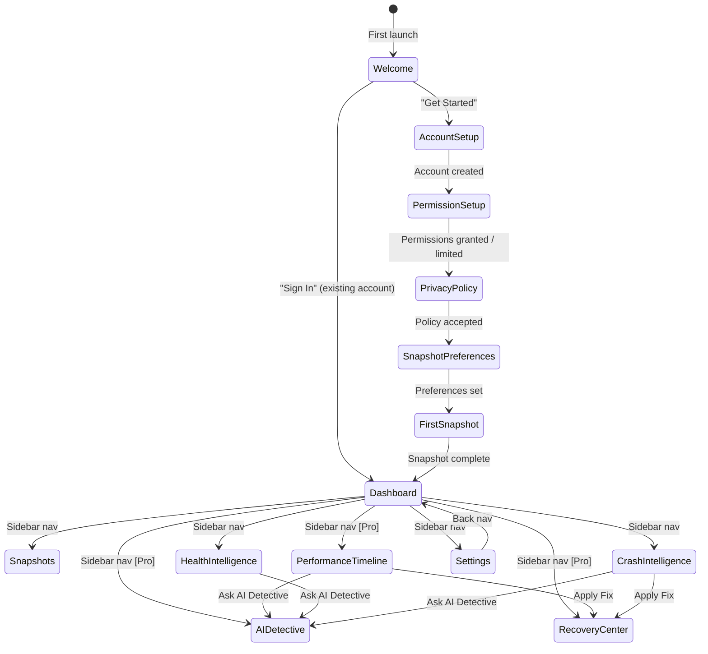
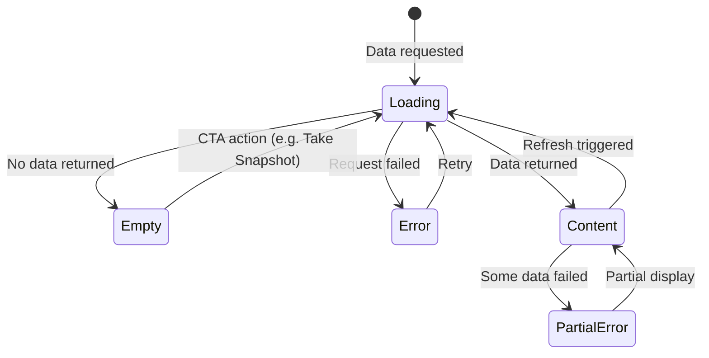
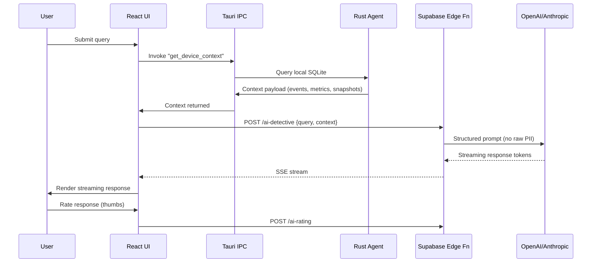
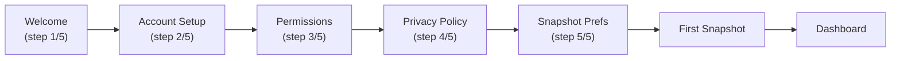

# 50. UI/UX Specification

> Defines UX principles, core navigation model, universal interaction patterns, universal states, notification/Alert system, onboarding experience, AI Detective conversational UX, Performance Timeline visualization UX, and desktop window behaviors for DeviceLifeline. Part of the DeviceLifeline documentation suite — see [Documentation Index](README.md).

**Status:** Draft v1 · **Authoring role:** Senior UX Designer · **Last updated:** 2026-06-07
**Related:** [08. User Flows](08-user-flows.md), [09. Information Architecture](09-information-architecture.md), [22. AI Diagnostics Design](22-ai-diagnostics-design.md), [23. Performance Timeline Design](23-performance-timeline-design.md), [49. Design System Specification](49-design-system-specification.md), [51. Wireframe Documentation](51-wireframe-documentation.md), [52. Component Library Specification](52-component-library-specification.md), [53. Accessibility Requirements](53-accessibility-requirements.md)

---

## 1. Purpose & Scope

This document specifies the UX design decisions that govern every screen and interaction in the DeviceLifeline Tauri desktop application. It translates the information architecture defined in [09. Information Architecture](09-information-architecture.md) and the flows in [08. User Flows](08-user-flows.md) into concrete interaction patterns, states, component behaviors, and copy conventions.

Scope:
- UX principles and design philosophy
- Navigation model implementation (sidebar, top bar, routing)
- Universal interaction patterns (selection, context menus, drag, keyboard)
- Universal UI states (loading, empty, error, success, offline, permission-required)
- Alert and notification system UX
- Onboarding experience design
- AI Detective conversational UX
- Performance Timeline visualization UX
- Desktop window behaviors (resize, minimize, title bar, system tray)
- Paywall/upgrade interaction patterns

Out of scope: Visual tokens (see [49. Design System Specification](49-design-system-specification.md)); component API specs (see [52. Component Library Specification](52-component-library-specification.md)); accessibility audit (see [53. Accessibility Requirements](53-accessibility-requirements.md)).

---

## 2. Assumptions

- A1: Tauri v2 is the desktop shell; the app runs in a Chromium-based WebView2 on Windows 10/11.
- A2: The application is a single-page React app; navigation uses client-side routing (React Router in memory or hash mode).
- A3: Window minimum size: 1024×640px. Optimal design target: 1280×800px and above.
- A4: The user operates a standard keyboard + mouse; touchscreen is not a priority for MVP.
- A5: The Rust agent runs as a Windows service independently of the UI; IPC (Tauri commands/events) bridges UI to agent.
- A6: Users may have multiple monitors; the app must respect the display it was launched on.
- A7: Internet connectivity is assumed but the app must gracefully degrade to an offline/limited mode.

---

## 3. UX Principles

These seven principles are the decision filter for all design choices. When two options conflict, the earlier principle wins.

| # | Principle | Definition |
|---|-----------|-----------|
| 1 | **Legible at a glance** | The most important information on any screen is immediately scannable without hunting. Data density is high but never chaotic. |
| 2 | **Progressive disclosure** | Surface what matters now; hide depth until the user needs it. No overwhelming walls of data. |
| 3 | **Actionable insights, not raw data** | Every metric, score, and event should answer "so what?" — with a suggested next step wherever possible. |
| 4 | **Keyboard-first navigation** | Power users should be able to operate the entire app without touching the mouse. Full keyboard support is not optional. |
| 5 | **Transparent system** | The user should always be able to understand what the agent is doing, why, and with what data. No black-box behaviors. |
| 6 | **Graceful degradation** | The app must present meaningful UI in every failure state — offline, agent stopped, no data collected yet, API timeout. |
| 7 | **Earn trust before asking for data** | Privacy settings and data collection choices are clearly explained before any collection begins. Defaults are conservative. |

---

## 4. Core Navigation Model

The navigation model is defined in detail in [09. Information Architecture §3](09-information-architecture.md). This section specifies the interaction behavior.

### 4.1 Persistent Left Sidebar

- **Width:** 220px expanded; 56px collapsed (icon-only mode)
- **Collapse trigger:** Toggle button at sidebar bottom; state persisted to local storage
- **Active item indicator:** Left-border accent (3px, `--dl-blue-300`) + filled icon + white label
- **Hover state:** Subtle background tint (see [49. Design System §11.3](49-design-system-specification.md))
- **Locked items (edition gating):** Item rendered at full opacity with a lock icon badge. Clicking opens a compact inline paywall tooltip (not a modal) explaining the required tier and showing an "Upgrade" CTA. The item is never hidden or removed from DOM (see A3 in [09. IA §2](09-information-architecture.md)).
- **Section separators:** 1px `--dl-color-border-subtle` horizontal rules grouping nav items (Monitoring group, Intelligence group, Tools group)
- **Sidebar bottom:** User avatar + plan badge + collapse toggle

### 4.2 Top Bar

- **Height:** 48px; always visible; fixed to top
- **Left:** DeviceLifeline logo/wordmark (collapsed sidebar) or spacing (expanded sidebar — wordmark in sidebar header)
- **Center:** Device selector dropdown (shows current device name + OS icon; multi-device in Pro+)
- **Right:** Global search (Cmd/Ctrl+K), notification bell with unread badge count, account avatar
- **Device selector behavior:** Click opens a popover list of linked devices. Switching device updates the entire app context (timeline, health, snapshots) to the selected device. A loading spinner replaces content during context switch (max 300ms before skeleton appears).

### 4.3 Global Search (Command Palette)

- **Trigger:** `Ctrl+K` (Windows)
- **Scope:** Snapshots by date, Timeline Events by description, Health Alerts, Crash Events, AI Detective history, Settings sections
- **Appearance:** Full-width modal overlay centered, `--dl-modal-md` width, auto-focused input
- **Result groups:** Type-labeled sections (Snapshots, Events, Alerts, Settings)
- **Keyboard navigation:** Arrow keys move selection; Enter opens; Escape closes
- **Empty state:** "No results for [query]" + suggested queries

### 4.4 In-App Routing Transitions

- **Route changes:** No page-wipe transitions — instant content swap. Only the content area transitions, not the sidebar/topbar.
- **Within-section navigation (tabs):** Instant tab swap; no animation.
- **Panel open/close (detail, filter):** Slide-in from right at `--dl-motion-duration-slow` (250ms).
- **Modal open:** Fade + slight scale-up (`0.95 → 1.0`) at `--dl-motion-duration-slow`.
- **Toast appear/disappear:** Slide up from bottom-right; auto-dismiss at 4s.

---

## 5. Universal Interaction Patterns

### 5.1 Selection

- **Single select:** Click row/item; highlighted with `--dl-color-interactive-primary-subtle` background
- **Multi-select:** `Ctrl+Click` for additive; `Shift+Click` for range (tables); checkbox column for bulk operations
- **Deselect:** Click selected item again or click empty area; `Escape` clears selection

### 5.2 Context Menus

All list items and table rows support a right-click context menu and a visible kebab (⋮) icon on hover. The context menu is a standard popover positioned relative to the cursor. Actions mirror those in [09. IA §8.2](09-information-architecture.md).

### 5.3 Drag and Drop

Drag-and-drop is used in:
- Restore Preview item list: drag to reorder installation sequence
- Dashboard widget grid: drag to rearrange widgets (post-MVP)

Drag handles are explicit (visible `⠿` grip icon on hover). Keyboard alternative: move item buttons or a reorder modal.

### 5.4 Keyboard Shortcuts

| Action | Shortcut |
|--------|---------|
| Open global search | `Ctrl+K` |
| Take snapshot | `Ctrl+Shift+S` |
| Navigate to Dashboard | `Ctrl+1` |
| Navigate to Snapshots | `Ctrl+2` |
| Navigate to Timeline | `Ctrl+3` |
| Navigate to Health | `Ctrl+4` |
| Navigate to Crashes | `Ctrl+5` |
| Navigate to AI Detective | `Ctrl+6` |
| Navigate to Recovery | `Ctrl+7` |
| Navigate to Settings | `Ctrl+,` |
| Dismiss modal / close panel | `Escape` |
| Confirm dialog (destructive) | Enter only after explicit tab to Confirm button |
| Refresh current section | `Ctrl+R` |
| Toggle sidebar | `Ctrl+B` |
| Toggle theme | Not keyboard-accessible (Settings only) |

### 5.5 Scroll Behavior

- Page-level scrolling: vertical only; sidebar fixed
- Performance Timeline: horizontal scrolling within the timeline container; mouse wheel scrolls horizontally when hovering the timeline
- Long tables: virtual scrolling for lists > 200 rows (via `react-virtual` or equivalent)
- Sticky headers: table column headers stick to top during vertical scroll within the table container

### 5.6 Resize Handles

- Sidebar panel: resizable drag handle between sidebar and content (min 180px, max 320px); double-click resets to default
- Detail side panel: fixed width; not resizable in MVP

---

## 6. Universal States

Every data-presenting component must implement all states listed below. No component may show a blank/white rectangle.

### 6.1 Loading State

- **Skeleton screens preferred** over spinners for content areas (matches layout, reduces visual jank)
- **Skeleton anatomy:** Gray animated shimmer blocks matching the expected content layout
- **Spinner usage:** Only for actions (button in progress, inline refresh)
- **Loading copy:** Active verb phrases, e.g., "Loading snapshots..." / "Analyzing your device..."
- **Timeout handling:** If loading exceeds 8 seconds, surface a retry action: "This is taking longer than expected. [Retry]"

### 6.2 Empty State

Each empty state has four elements:

1. **Icon:** Contextual, from the icon library, `--dl-icon-xl` (48px)
2. **Heading:** What this section is for (e.g., "No snapshots yet")
3. **Body:** Why it's empty and what the user can do (one sentence)
4. **CTA:** Primary action to populate or configure (where applicable)

| Section | Empty Heading | Body Copy |
|---------|--------------|-----------|
| Snapshots | "No snapshots yet" | "Take your first snapshot to start building your device's digital history." |
| Performance Timeline | "No timeline data" | "Timeline data builds after your first 24 hours. Check back tomorrow." |
| Health Intelligence | "No health data" | "Health monitoring starts after the first full scan. This usually takes a few minutes." |
| Crash Intelligence | "No crashes detected" | "Great news — no crashes have been recorded on this device." |
| AI Detective (no history) | "Ask AI Detective anything" | "Type a question about your device's performance or stability." |
| Recovery Center | "Nothing to restore" | "Restore a setup or roll back a change from here when you're ready." |

### 6.3 Error State

- **Network/API error:** Show error card with: error description in plain English + error code in mono (collapsed by default, expandable) + Retry button + Contact Support link
- **Partial data error:** Show partial content with a warning banner at top of section: "Some data could not be loaded. [Show Details] [Retry]"
- **Agent not running:** Persistent amber banner at top of app: "Agent service is not responding. Data collection is paused. [Restart Agent] [Settings]"
- **Fatal error:** Full-screen error view with app version, error trace (collapsed), and "Report Issue" CTA sending anonymized report via Sentry

### 6.4 Success State

- **Inline confirmation:** Green toast notification, bottom-right, 4-second auto-dismiss
- **Modal confirmation:** Modal replaced by success view with summary (e.g., Restore complete: X installed, Y failed) + Close / Next action buttons
- **Persistent change confirmed:** Updated UI state reflects change immediately (optimistic update where safe); no separate success page for simple edits

### 6.5 Offline State

- Amber banner at top of app: "You're offline. Some features require an internet connection."
- Local-only features remain fully functional: snapshot viewing, timeline browsing (cached data), health history, crash list
- Features that require network (AI Detective, cloud sync, subscription management) show inline "Requires internet connection" message
- Queued actions (e.g., snapshot cloud sync) are shown with a "Queued" badge, not an error

### 6.6 Permission-Required State

- Triggered when the Rust agent lacks the required Windows permissions (e.g., UAC not granted)
- Full-section overlay (not a toast): explains exactly what permission is needed, what it enables, and provides "Grant Permission" CTA
- Never silently fails; never shows empty data without explaining why

---

## 7. Notifications and Alerts

The alert system translates health thresholds and system events into user-facing notifications across two channels: Windows OS notifications and the in-app Alert Center.

### 7.1 Notification Channels

| Channel | When Used | User Control |
|---------|-----------|-------------|
| Windows system notification | Critical/Warning health thresholds, crash detected | OS notification settings + in-app Settings > Notifications |
| In-app notification bell | All alerts (badge count) | Always available |
| In-app Alert Center | Browsable history of all alerts | Always available |
| Toast notification | Action confirmations, sync complete, snapshot done | 4s auto-dismiss |

### 7.2 Alert Severity Model

| Severity | Color | Icon | Windows Notification | In-App Badge |
|----------|-------|------|---------------------|-------------|
| **Critical** | `--dl-color-status-critical` (red) | `alert-octagon` | Yes — with sound (default off) | Red badge |
| **Warning** | `--dl-color-status-warning` (yellow) | `alert-triangle` | Yes — silent | Amber badge |
| **Info** | `--dl-color-status-info` (blue) | `info` | No | Blue badge |
| **Resolved** | `--dl-color-status-success` (green) | `check-circle` | No | Dimmed |

### 7.3 Alert Card UX

Each alert rendered in the Alert Center or as an in-app notification card has:

1. **Severity badge** (color + icon + label)
2. **Title:** Plain-English summary (e.g., "SSD health is degrading")
3. **Body:** One to two sentences explaining the metric, current value, and context
4. **Timestamp and device name**
5. **Actions:** "What should I do?" (→ AI Detective pre-filled) + "Acknowledge" + "Snooze 7 days" + "Dismiss"
6. **Expandable technical detail:** Metric raw value, threshold value, measurement method (collapsed by default)

### 7.4 Notification Bell Popover

- Opens on click; shows last 10 unread alerts grouped by severity
- "View all" link goes to Alert Center
- "Mark all as read" button
- Empty state: "No new alerts" with a small green checkmark

---

## 8. Onboarding Experience

The onboarding experience is documented step-by-step in [08. User Flows §4](08-user-flows.md). This section specifies the UX design of each onboarding step.

### 8.1 Onboarding Screen Sequence

```
Welcome → Account Setup → Permission Setup → Privacy Policy → Snapshot Preferences → First Snapshot → Dashboard
```

### 8.2 Welcome Screen

- **Layout:** Centered, comfortable density; DeviceLifeline logo prominent; tagline below
- **Hero copy:** "Your device, finally understood." + two-sentence value proposition
- **CTAs:** "Create Account" (primary) + "Sign In" (secondary link)
- **Background:** Brand illustration — a minimal line-art device with subtle network/timeline motifs
- **No distracting animations** — one subtle entrance fade on load (200ms, only if reduced-motion not set)

### 8.3 Account Setup

- **Email/password form:** Clean, single-column; password strength indicator
- **OAuth options:** Google + Microsoft sign-in buttons (secondary style, icon + label)
- **Error handling:** Inline field errors (not page-level); no form reset on error
- **Progress indicator:** Step dots at top (5 steps total) — user sees where they are in onboarding

### 8.4 Permission Setup Screen

- **Purpose:** Explain UAC elevation before requesting it — reduce rejection rate
- **Layout:** Three-row feature list: what is collected, how it is used, what would not work without it
- **Iconography:** Each item has an icon + short title + one-sentence explanation
- **CTA:** "Grant Permissions" → triggers Windows UAC prompt
- **Skip path:** "Continue in limited mode" link below CTA — agent collects no system-level data; user can grant later from Settings
- **No dark patterns:** Skip is not hidden; the user's choice is respected

### 8.5 Privacy Policy Accept

- **Scrollable policy text** in a contained pane (not external browser)
- **Accept CTA** becomes active after reaching bottom of policy (UX convention for legal compliance)
- **Plain-English summary** above the full policy: three bullet points covering what is collected, what is not, and deletion rights

### 8.6 Snapshot Preferences

- **Two options presented as cards:** "Automatic (Recommended)" — daily at 2 AM / "Manual only" — user takes snapshots on demand
- **Automatic card:** Shows the schedule picker (time + day selection) pre-filled with recommended defaults
- **Free-tier note:** Free tier limits to daily snapshots; hourly shown as "Pro" labeled but not blocked at this step

### 8.7 First Snapshot Progress

- **Full-screen progress view** (not a modal) to give the first snapshot appropriate ceremony
- **Progress bar:** Indeterminate → determinate as collectors report in
- **Collector list:** Live updating list of collectors with status icons (running → done/error)
- **Copy:** "Building your device's digital memory..." — reinforces the platform concept
- **Time estimate:** "Usually takes 1–3 minutes" shown below progress bar
- **Error handling:** Partial failure shown with warning icon; completion allowed with partial data flagged

### 8.8 Post-Onboarding Tooltip Tour

- **Trigger:** Shown once, after first Dashboard load
- **Style:** Spotlight overlay with popover callouts (not a slideshow modal)
- **Tour stops (6 maximum):**
  1. Sidebar navigation
  2. Snapshot card on Dashboard
  3. Health score widget
  4. Notification bell
  5. AI Detective nav item
  6. Take Snapshot button
- **Dismissal:** "Skip tour" at any point; "Got it" advances. Never shown again after dismissal or completion.
- **State persisted** in local SQLite so it does not re-appear after app restart.

---

## 9. AI Detective Conversational UX

The AI Detective is a primary differentiator. Its UX must balance speed, transparency, and usability.

Full flow documented in [08. User Flows §9](08-user-flows.md). This section specifies the UX patterns.

### 9.1 Query Interface

- **Layout:** Split view — query input + conversation history on left; context panel (what data was sent) on right (collapsible)
- **Input:** Multi-line auto-expanding textarea; `Enter` submits; `Shift+Enter` inserts newline
- **Character limit:** 500 characters (shown as countdown when > 400)
- **Suggested queries:** Chip buttons below the input when no history exists (e.g., "Why is my device slow?", "When did my startup time change?", "What caused my last crash?")
- **Streaming response:** Tokens appear as they stream; typing indicator (animated dots) while waiting for first token; hard 20-second timeout

### 9.2 Response Anatomy

Each AI Detective response is structured (enforced server-side by the Supabase Edge Function output schema):

```
┌─────────────────────────────────────────────┐
│ SUMMARY (1–2 sentences, plain English)      │
├─────────────────────────────────────────────┤
│ HYPOTHESES (up to 3)                        │
│   [Confidence meter] Hypothesis title        │
│   Evidence: bullet list of supporting data  │
│   Timeline reference: linked event          │
├─────────────────────────────────────────────┤
│ SUGGESTED ACTIONS (up to 3 action chips)    │
│   [Apply Fix] [View in Timeline] [Details]  │
├─────────────────────────────────────────────┤
│ FEEDBACK: Was this helpful? [👍] [👎]       │
└─────────────────────────────────────────────┘
```

### 9.3 Confidence Meter

- Each hypothesis has a ConfidenceMeter component (see [52. Component Library](52-component-library-specification.md))
- Visual: segmented bar 0–100%, colored using the status token ramp
- Label: text percentage + verbal qualifier: `< 40%` = "Low confidence", `40–69%` = "Moderate confidence", `70–89%` = "Likely", `≥ 90%` = "High confidence"
- Tooltip on hover: "Confidence score reflects available evidence in your timeline and health data."

### 9.4 Context Viewer Panel

- Collapsible right panel showing what context was sent to the AI (summarized, not raw data)
- Sections: Timeline events included, Health metrics included, Snapshots referenced, Date range analyzed
- "Why is this data used?" expandable explanation
- Users can see exactly what went to the AI; privacy-first transparency principle

### 9.5 Query History

- Left sidebar within AI Detective section lists past queries (most recent first)
- Each item: query truncated to 60 chars + timestamp + response rating (thumbs)
- Clicking loads the full response into the main panel (read-only replay)
- "Clear history" option in section menu (confirmation dialog required)

### 9.6 Paywall for AI Detective

- Free tier: 1 query per month. The query count is visible: "1 of 1 free queries used this month."
- After limit: Input is disabled; inline banner replaces it: "You've used your free AI Detective query for this month. Upgrade to Pro for unlimited queries. [Upgrade to Pro]"
- The paywall does not modal-block the page; users can still read past responses

---

## 10. Performance Timeline Visualization UX

The Performance Timeline is the primary differentiator. Its UX must communicate historical causality clearly.

Technical design in [23. Performance Timeline Design](23-performance-timeline-design.md).

### 10.1 Layout

```
┌──────────────────────────────────────────────────────────┐
│ Time Range Selector   [7d] [30d] [90d] [Custom]          │
│ Zoom: [Day] [Week] [Month]     Filter: [All event types ▾]│
├───────────┬──────────────────────────────────────────────┤
│ Swim Lane │ ← Timeline scroll area (horizontal) →       │
│ Labels    │                                              │
│           │ ─── Software Changes ─────────────────────── │
│           │     ●  ●    ●●   ●                           │
│           │                                              │
│           │ ─── Driver / Windows Updates ──────────────── │
│           │        ●         ●                           │
│           │                                              │
│           │ ─── Performance Metrics ───────────────────── │
│           │     ─────╮                  ╭─────           │
│           │          ╰──────────────────╯                │
│           │                                              │
│           │ ─── Hardware Events ───────────────────────── │
│           │                 ●                            │
├───────────┴──────────────────────────────────────────────┤
│ [Selected event details or hover tooltip]                │
└──────────────────────────────────────────────────────────┘
```

### 10.2 Swim Lanes

| Lane | Content | Event Marker Shape |
|------|---------|-------------------|
| Software Changes | Install/remove/update events | Circle (filled) |
| Driver / Windows Updates | Driver and OS update events | Diamond |
| Performance Metrics | CPU, RAM, startup time trend line | Line chart overlay |
| Hardware Events | Hardware changes, battery events | Square |
| Crash Events | BSOD, app crashes | X marker (red) |
| Health Alerts | Threshold breaches | Triangle (warning color) |

### 10.3 Correlation Markers

- Rendered as orange circle with pulsing ring animation (reduced for `prefers-reduced-motion`)
- Positioned on the time axis at the correlated event's timestamp
- Size proportional to impact magnitude (min 8px, max 16px)
- Hover: tooltip showing "Possible cause: [Event] → [Impact] (+X%)"
- Click: opens Correlation Detail Panel (side panel, 400px)

### 10.4 Correlation Detail Panel

Matches the panel anatomy described in [08. User Flows §8](08-user-flows.md):

1. Header: event description + timestamp
2. Impact measurement: before/after metric comparison with delta shown
3. Confidence score (ConfidenceMeter component)
4. Contributing factors: bulleted list with data references
5. Suggested actions: action chips (up to 3)
6. "Ask AI Detective about this" button (auto-populates query)
7. "Apply Suggested Fix" button (→ Recovery Center)
8. Dismiss (×)

### 10.5 Timeline Interaction Details

- **Horizontal scroll:** Mouse wheel or trackpad horizontal scroll when hovering the timeline container
- **Zoom in/out:** Scroll with `Ctrl` held; pinch-to-zoom on trackpad
- **Date marker:** Vertical line tracking mouse position; shows exact date/time in a fixed label
- **Range selection:** Click and drag on the timeline axis to select a date range; selected range highlighted; "Analyze this period with AI Detective" CTA appears above timeline
- **Event cluster handling:** When events are dense (> 5 markers within 8px), cluster into a numbered pill; click to expand into a popover list
- **Performance metric lines:** Hover on line shows value at that point; tooltip with date + metric value + comparison to 7-day average

### 10.6 Empty / Insufficient Data States

- **Less than 24 hours of data:** "Timeline fills in after the first day. Come back tomorrow to see your device's history."
- **No events in selected range:** "No events recorded in this period." + [Expand range] CTA
- **Pro gate on free tier:** Swim lanes shown as gray silhouettes; "Unlock Performance Timeline" overlay with upgrade CTA

---

## 11. Desktop Window Behaviors

### 11.1 Window Chrome

DeviceLifeline uses a **custom Tauri title bar** (Tauri `decorations: false` + custom drag region) to maintain consistent branding across Windows versions.

- Title bar: 32px height; drag region covers the full width minus window controls
- Window controls (minimize, maximize, close): custom-drawn using Windows-style iconography in `--dl-color-text-secondary`; hover states per OS convention
- Title text: "DeviceLifeline — [Current Section]" updated on navigation

### 11.2 Window Size Constraints

| Constraint | Value |
|-----------|-------|
| Minimum width | `1024px` |
| Minimum height | `640px` |
| Default launch size | `1280×800px` |
| Remember last size | Yes (persisted to local SQLite) |
| Maximizable | Yes |
| Full-screen (F11) | Not supported in MVP |

### 11.3 System Tray

- DeviceLifeline agent icon in system tray (always present when agent is running)
- Tray icon states: Normal (blue icon), Alert (amber badge), Critical (red badge)
- Right-click tray menu: "Open DeviceLifeline", "Take Snapshot Now", "View Alerts", "Pause Agent", "Quit"
- The Tauri UI window can be closed; the agent and tray icon persist
- Double-click tray icon restores/shows the window

### 11.4 Window Focus Behavior

- App does not steal focus when showing notifications
- Health alerts and snapshot completions use Windows notification center only (no forced focus)
- Crash detection notification: appears in notification center; user clicks to bring window to front

### 11.5 Multi-Monitor Support

- Window position is remembered per monitor ID
- App renders correctly at all DPI scales (100%, 125%, 150%, 200%) — CSS `zoom` or logical pixel approach via Tauri config
- At 150%+ DPI: base font size effectively increases; no separate high-DPI asset variants needed (SVG icons scale natively)

---

## 12. Paywall / Upgrade UX Patterns

Paywall interactions occur in two forms:

### 12.1 Feature Lock (Passive)

When a nav item or section is gated:
- Nav item renders with a lock icon badge
- On click: opens an **inline tooltip panel** (not a blocking modal) explaining what is locked and what tier is required
- Tooltip has "Upgrade to [Tier]" button and "Learn more" link
- User can dismiss and continue using available features

### 12.2 Action Paywall (Active)

When a user attempts a Pro-only action (Export Setup, AI Detective over quota):
- **Modal dialog** (not a toast): `--dl-modal-sm` (400px)
- Anatomy: feature icon + feature name + one paragraph of value copy + feature list (3 bullets) + pricing teaser + primary CTA "Upgrade to Pro" + secondary link "Not now"
- Never uses fear or urgency copy ("Your data is at risk if you don't upgrade")
- Price shown as monthly figure with "Billed monthly or annually" option link

### 12.3 Post-Upgrade Success

- Modal replaced by success state: "Welcome to Pro! All features are now unlocked."
- Sidebar locked items immediately remove lock badges (via Supabase Realtime entitlement push — see [08. User Flows §13](08-user-flows.md))
- Confetti animation: one-time, 800ms, respects `prefers-reduced-motion`

---

## Diagrams

### Navigation State Machine



### Universal Component State Machine



### AI Detective Response Flow



### Onboarding Step Progress



---

## Risks & Mitigations

| Risk | Likelihood | Impact | Mitigation |
|------|-----------|--------|------------|
| Custom title bar on Windows 11 conflicts with Snap Assist / window snapping | Medium | Medium | Test with Tauri `decorations: false`; implement fallback to native title bar via setting |
| AI Detective 20s timeout frustrates users waiting for complex queries | Medium | High | Streaming tokens appear within 1–2s; timeout only applies to non-starting responses; progressive disclosure of "still thinking" states |
| Horizontal timeline scroll is unintuitive for users unfamiliar with Gantt-style views | Medium | Medium | Tutorial tooltip on first Timeline visit; arrow key navigation alternative; scroll indicator |
| Paywall modals shown too frequently cause friction and churn | Medium | High | Passive lock pattern (tooltip not modal) for nav items; modal only on direct action attempt |
| Global search indexing becomes slow with large SQLite databases (1000+ events) | Low | Medium | Index title fields; limit search results to 20 per category; full-text search extension |
| Onboarding UAC prompt rejected causes user confusion about app functionality | Medium | High | Clear pre-prompt explanation; limited mode gracefully documented; retry accessible from Settings |

---

## Future Considerations

- **FC-01:** Multi-turn conversational AI Detective (follow-up questions without re-loading context) — requires conversation state management in Supabase [Post-MVP — see 22. AI Diagnostics Design](22-ai-diagnostics-design.md)].
- **FC-02:** Dashboard widget customization (drag-to-reorder, add/remove widgets) [Post-MVP].
- **FC-03:** Timeline zoom to minute-level granularity for developer debugging use cases [Post-MVP].
- **FC-04:** Command palette natural-language navigation ("Go to June 10 crash") [Post-MVP — see 09. IA §FC-03](09-information-architecture.md)].
- **FC-05:** Keyboard shortcut customization in Settings [Post-MVP].
- **FC-06:** macOS-specific title bar integration (traffic light buttons, native vibrancy) [Post-MVP — see 28. Future macOS Architecture Plan](28-macos-architecture-plan.md)].

---

## Acceptance Criteria

- [ ] AC-50-01: All 7 UX principles are documented and circulated to the design and engineering team before Sprint 1.
- [ ] AC-50-02: All 6 universal states (loading, empty, error, success, offline, permission-required) are implemented for every data-presenting section.
- [ ] AC-50-03: AI Detective response anatomy (Section 9.2) is enforced by the Supabase Edge Function response schema — no freeform unstructured output.
- [ ] AC-50-04: Keyboard shortcuts table (Section 5.4) is fully functional and listed in the in-app help panel.
- [ ] AC-50-05: Custom title bar renders correctly on Windows 10 (1903+) and Windows 11 across 100%, 125%, and 150% DPI.
- [ ] AC-50-06: Performance Timeline horizontal scroll is operable by mouse wheel and keyboard arrow keys.
- [ ] AC-50-07: Paywall pattern (passive lock + active modal) is consistent across all gated features with no blocking modal for passive browsing.
- [ ] AC-50-08: Onboarding tooltip tour appears exactly once and never re-appears after dismissal.
- [ ] AC-50-09: AI Detective query history persists across app restarts (stored in local SQLite).
- [ ] AC-50-10: System tray icon reflects current agent status (normal / warning / critical) and is updated within 30 seconds of status change.
