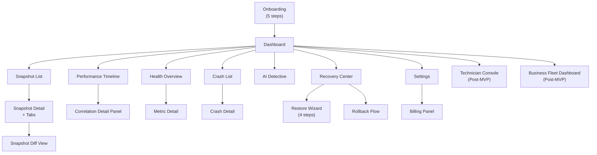
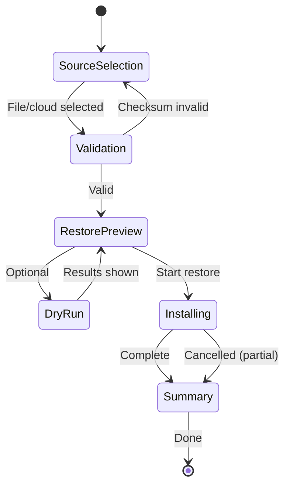

# 51. Screen-by-Screen Wireframe Documentation

> Low-fidelity layout documentation for every key DeviceLifeline surface: purpose, ASCII wireframe sketch, component inventory, data shown, states, and primary actions. Part of the DeviceLifeline documentation suite — see [Documentation Index](README.md).

**Status:** Draft v1 · **Authoring role:** Senior UX Designer · **Last updated:** 2026-06-07
**Related:** [08. User Flows](08-user-flows.md), [09. Information Architecture](09-information-architecture.md), [49. Design System Specification](49-design-system-specification.md), [50. UI/UX Specification](50-ui-ux-specification.md), [52. Component Library Specification](52-component-library-specification.md), [53. Accessibility Requirements](53-accessibility-requirements.md)

---

## 1. Purpose & Scope

This document provides a screen-by-screen wireframe reference for every key surface in the DeviceLifeline Tauri desktop application. Each entry includes:
- **Purpose:** What the screen does and who uses it
- **Layout sketch:** Low-fidelity ASCII box representation of the layout
- **Components present:** Canonical component names (see [52. Component Library](52-component-library-specification.md))
- **Data shown:** The data objects from [09. IA §6](09-information-architecture.md) rendered on screen
- **States:** Which universal states apply (see [50. UX Specification §6](50-ui-ux-specification.md))
- **Primary actions:** The main things a user can do on this screen

Surfaces covered (in navigation order):
1. Onboarding flow (5 steps)
2. Dashboard
3. Device DNA Snapshot View (Snapshot Detail)
4. Software Inventory (tab within Snapshot Detail)
5. Performance Timeline
6. AI Detective
7. Health Intelligence Overview
8. Crash Intelligence
9. Recovery Center
10. Restore Wizard (modal flow)
11. Settings / Billing
12. Technician Console (post-MVP)
13. Business Fleet Dashboard (post-MVP)

Wireframes use ASCII art with legend:
```
[ Button ]         Interactive button
[_________]        Text input field
(● Radio)          Radio button
[✓ Checkbox]       Checkbox
▸ item             List/nav item
──────────────     Horizontal divider
│ │ │              Vertical divider / column separator
╔═══╗ ╚═══╝        Box/card border
```

---

## 2. Assumptions

- A1: The persistent sidebar (220px) and top bar (48px) are present on all post-onboarding screens; they are not re-drawn in each wireframe — the content area is what is documented.
- A2: Window size assumed 1280×800px for all wireframes.
- A3: Content area dimensions after sidebar and top bar: approximately 1060×752px.
- A4: Wireframes are low-fidelity and proportional — not pixel-perfect.
- A5: Post-MVP screens (Technician, Business) are included to establish the IA intent; they are clearly labeled.

---

## 3. Global Shell

The persistent shell present on all authenticated screens:

```
╔══════════════════════════════════════════════════════════════════════════╗
║  [Title Bar — Drag region]                          [─] [□] [×]         ║
╠══════╦═══════════════════════════════════════════════════════════════════╣
║      ║  [DeviceLifeline Logo]    [Device: Dell XPS 15 ▾]  [🔍] [🔔2] [👤] ║
║ Side ║  ══ Top Bar (48px) ══════════════════════════════════════════════ ║
║  bar ║                                                                   ║
║ 220px║           CONTENT AREA (1060 × 752px)                            ║
║      ║                                                                   ║
║ ▸ Dashboard                                                              ║
║ ▸ Snapshots                                                              ║
║ ▸ Timeline 🔒                                                            ║
║ ▸ Health                                                                 ║
║ ▸ Crashes                                                                ║
║ ▸ AI Detective 🔒                                                        ║
║ ▸ Recovery 🔒                                                            ║
║ ──                                                                       ║
║ ▸ Settings                                                               ║
║      ║                                                                   ║
║ [👤 Jane — Pro]                                                          ║
║ [← Collapse]                                                             ║
╚══════╩═══════════════════════════════════════════════════════════════════╝
```

**Components:** `AppShell`, `Sidebar`, `SidebarItem`, `TopBar`, `DeviceSelector`, `NotificationBell`, `AccountAvatar`

---

## 4. Onboarding Flow

### 4.1 Welcome Screen

**Purpose:** First impression; introduce DeviceLifeline and route to sign-in or account creation.

```
╔══════════════════════════════════════════════════════╗
║                                                      ║
║         [DeviceLifeline Logo + Wordmark]             ║
║                                                      ║
║      ┌──────────────────────────────────────┐        ║
║      │   [Illustration: device + timeline]  │        ║
║      └──────────────────────────────────────┘        ║
║                                                      ║
║        "Your device, finally understood."            ║
║                                                      ║
║      Track history. Diagnose problems.               ║
║      Restore your setup. In minutes.                 ║
║                                                      ║
║           [ Create Account ]   (primary)             ║
║           Sign In              (text link)           ║
║                                                      ║
║      ○ ○ ○ ○ ○  (step progress dots)                ║
╚══════════════════════════════════════════════════════╝
```

**Components:** `Button`, `IllustrationBlock`, `ProgressDots`
**States:** Loading (OAuth callback), Error (network down during sign-in)
**Primary actions:** Create Account, Sign In

---

### 4.2 Account Setup Screen

**Purpose:** Collect email/password or OAuth sign-in to create/authenticate account.

```
╔══════════════════════════════════════════════════════╗
║  ● ○ ○ ○ ○   Step 1 of 5 — Create Account           ║
║                                                      ║
║  Email address                                       ║
║  [______________________________________]            ║
║                                                      ║
║  Password                                            ║
║  [______________________________________]  [👁]      ║
║  ████░░░░░░  Strength: Good                          ║
║                                                      ║
║  [ Create Account ]   (primary)                      ║
║  ──────── or ────────                                ║
║  [G Continue with Google]  [⊞ Continue with Microsoft]║
║                                                      ║
║  Already have an account? Sign In                    ║
╚══════════════════════════════════════════════════════╝
```

**Components:** `Input`, `PasswordInput`, `PasswordStrengthBar`, `Button`, `Divider`
**Data:** User email, password (never stored in UI state beyond submission)
**States:** Loading (API call), Error (invalid email, weak password, account exists)
**Primary actions:** Create Account, OAuth sign-in

---

### 4.3 Permission Setup Screen

**Purpose:** Explain what system access the agent needs before triggering the UAC prompt.

```
╔══════════════════════════════════════════════════════╗
║  ○ ● ○ ○ ○   Step 2 of 5 — Grant Permissions        ║
║                                                      ║
║  DeviceLifeline needs system access to monitor       ║
║  and protect your device.                            ║
║                                                      ║
║  ┌─────────────────────────────────────────────┐    ║
║  │ 📋  Software Inventory                       │    ║
║  │     Reads installed apps and versions        │    ║
║  ├─────────────────────────────────────────────┤    ║
║  │ ⏱  Performance Monitoring                   │    ║
║  │     Tracks CPU, RAM, startup time            │    ║
║  ├─────────────────────────────────────────────┤    ║
║  │ 🔔  Event Log Access                         │    ║
║  │     Reads Windows Event Log for crashes      │    ║
║  └─────────────────────────────────────────────┘    ║
║                                                      ║
║  [ Grant Permissions ]  (primary — triggers UAC)    ║
║  Continue in limited mode  (text link)               ║
╚══════════════════════════════════════════════════════╝
```

**Components:** `FeatureList`, `Button`, `PermissionRow`
**States:** Pending UAC, UAC denied (shows retry banner), Limited mode warning
**Primary actions:** Grant Permissions, Continue in limited mode

---

### 4.4 Snapshot Preferences Screen

**Purpose:** Configure the snapshot schedule before taking the first snapshot.

```
╔══════════════════════════════════════════════════════╗
║  ○ ○ ● ○ ○   Step 4 of 5 — Snapshot Schedule        ║
║                                                      ║
║  How often should we capture your device?            ║
║                                                      ║
║  ╔════════════════════════════╗  ╔══════════════════╗║
║  ║ ● Automatic (Recommended)  ║  ║ ○ Manual only    ║║
║  ║                            ║  ║                  ║║
║  ║ Daily at [02:00 ▾]         ║  ║ You take         ║║
║  ║ When: [● Every day ▾]      ║  ║ snapshots when   ║║
║  ║                            ║  ║ you choose.      ║║
║  ╚════════════════════════════╝  ╚══════════════════╝║
║                                                      ║
║  Hourly snapshots available on Pro  [Upgrade ↗]     ║
║                                                      ║
║  [ Continue ]  (primary)                             ║
╚══════════════════════════════════════════════════════╝
```

**Components:** `OptionCard`, `TimeSelector`, `FrequencySelector`, `Button`, `PlanBadge`
**States:** Valid (either option selected), Invalid (none selected — prevented by default)
**Primary actions:** Continue (save preferences)

---

### 4.5 First Snapshot Progress Screen

**Purpose:** Run and display progress of the first Device DNA Snapshot.

```
╔══════════════════════════════════════════════════════╗
║  ○ ○ ○ ○ ●   Building your device's digital memory  ║
║                                                      ║
║              [Animated DNA helix illustration]       ║
║                                                      ║
║  ████████████████████░░░░  78%                       ║
║  Usually takes 1–3 minutes                           ║
║                                                      ║
║  ✓ Installed software       (456 items)              ║
║  ✓ System configuration     (done)                   ║
║  ⟳ Browser extensions       (scanning...)            ║
║  ◌ Developer environment    (waiting)                ║
║  ◌ Hardware fingerprint     (waiting)                ║
║                                                      ║
║  All data stays on your device unless you enable     ║
║  cloud sync.                                         ║
╚══════════════════════════════════════════════════════╝
```

**Components:** `ProgressBar`, `CollectorStatusList`, `StatusIcon`, `IllustrationBlock`
**Data:** DeviceDNASnapshot progress (per-collector status from Tauri IPC events)
**States:** In-progress, Partial failure (warning banner), Complete (auto-advance to Dashboard)
**Primary actions:** None (automatic); Cancel (rare, with confirmation)

---

## 5. Dashboard

**Purpose:** Home screen; surface the most important current state of the device — last snapshot, health summary, recent alerts, quick actions.

```
╔══════════════════════════════════════════════════════════════════════════╗
║  Dashboard                                    [ Take Snapshot ▸ ]       ║
║                                                                          ║
║  ┌──────────────────┐  ┌──────────────────┐  ┌──────────────────────┐  ║
║  │ Last Snapshot     │  │ Overall Health    │  │ Active Alerts         │  ║
║  │ Today 02:01       │  │                   │  │                       │  ║
║  │ 423 items         │  │      [82]         │  │ ⚠ SSD: 87% TBW        │  ║
║  │ [View Snapshot]   │  │   ████░░  Good    │  │ ℹ RAM usage elevated  │  ║
║  │ [Export Setup]    │  │ CPU 91  SSD 82    │  │ [View All Alerts]     │  ║
║  │                   │  │ RAM 78  GPU 95    │  │                       │  ║
║  └──────────────────┘  └──────────────────┘  └──────────────────────┘  ║
║                                                                          ║
║  ┌───────────────────────────────────────┐  ┌──────────────────────┐   ║
║  │ Recent Activity                        │  │ Quick Actions         │   ║
║  │                                        │  │                       │   ║
║  │ 14:22  Docker Desktop 4.29 installed  │  │ [ Take Snapshot ]     │   ║
║  │ 13:51  Startup time: 22s (+8%)        │  │ [ Ask AI Detective ]  │   ║
║  │ 11:04  Windows Update applied         │  │ [ View Timeline ]     │   ║
║  │ 09:30  Chrome 124 updated             │  │ [ Compare Snapshots ] │   ║
║  │ [View Performance Timeline]           │  │                       │   ║
║  └───────────────────────────────────────┘  └──────────────────────┘   ║
╚══════════════════════════════════════════════════════════════════════════╝
```

**Components:** `DashboardCard`, `HealthGauge`, `AlertCard`, `ActivityFeed`, `QuickActionList`, `Button`
**Data:** Most recent DeviceDNASnapshot (item count, timestamp), HealthScore (per subsystem), recent Alerts, recent TimelineEvents
**States:** Loading (skeleton), Empty (no snapshot yet → First Snapshot CTA), Error (agent not responding), Offline (cached data with banner)
**Primary actions:** Take Snapshot, View Snapshot, Export Setup, Ask AI Detective, View Alerts, View Timeline

---

## 6. Device DNA Snapshot View

**Purpose:** Browse the complete contents of a specific Device DNA Snapshot; compare two snapshots.

```
╔══════════════════════════════════════════════════════════════════════════╗
║  Device DNA Snapshot — Dell XPS 15 — 2026-06-07 02:01                   ║
║  423 items  ●  Cloud synced  ●  [Compare with...▾]  [Export Setup]      ║
║                                                                          ║
║  ┌─────────────────────────────────────────────────────────────────┐   ║
║  │ [Software Inventory] │ [System Config] │ [Browser Env] │ [Dev Env] │ [Hardware] │
║  └─────────────────────────────────────────────────────────────────┘   ║
║                                                                          ║
║  (Active tab: Software Inventory — see §7 below)                        ║
╚══════════════════════════════════════════════════════════════════════════╝
```

### 6.1 Snapshot Diff View

When "Compare with..." is triggered, the layout changes to a dual-column diff:

```
╔══════════════════════════════════════════════════════════════════════════╗
║  Compare Snapshots                                          [✕ Close]   ║
║                                                                          ║
║  [◀ Jun 01, 2026]                          [Jun 07, 2026 ▶]            ║
║                                                                          ║
║  ADDED (12)      │  REMOVED (3)      │  CHANGED (7)   │  UNCHANGED (401)║
║  ────────────────┼───────────────────┼────────────────┼─────────────────║
║  + Docker 4.29   │  - Python 3.10    │  ↑ Chrome 124  │  ...            ║
║  + Node.js 22.2  │  - Git 2.40       │  ↑ VS Code 1.9 │                 ║
║  + ...           │  - ...            │  ↑ ...         │                 ║
║                                                                          ║
║  [ Export Diff ]    [ Ask AI Detective about these changes ]            ║
╚══════════════════════════════════════════════════════════════════════════╝
```

**Components:** `SnapshotDiffViewer`, `DiffColumn`, `DiffRow`, `Tabs`, `Button`
**Data:** Two DeviceDNASnapshot objects; diff computed client-side (added/removed/changed SoftwareInventoryItems)
**States:** Loading (computing diff), Empty (snapshots identical), Error
**Primary actions:** Select compare target, Export Diff, Ask AI Detective

---

## 7. Software Inventory

**Purpose:** Browse, search, and filter the full list of installed software in a snapshot.

```
╔══════════════════════════════════════════════════════════════════════════╗
║  Software Inventory  (423 items)                                         ║
║                                                                          ║
║  [🔍 Search apps...]       [Source: All ▾]  [Category: All ▾]  [↕ Name]║
║                                                                          ║
║  ┌───────────────────────────────────────────────────────────────────┐  ║
║  │ Name              │ Version    │ Source    │ Install Date │ Size   │  ║
║  ├───────────────────┼────────────┼───────────┼──────────────┼────────┤  ║
║  │ Chrome            │ 124.0.0.1  │ Google    │ 2024-01-15   │ 182 MB │  ║
║  │ Docker Desktop    │ 4.29.0     │ WinGet    │ 2026-06-05   │ 1.2 GB │  ║
║  │ Node.js 22.2      │ 22.2.0     │ WinGet    │ 2026-06-06   │ 56 MB  │  ║
║  │ VS Code           │ 1.90.0     │ WinGet    │ 2024-03-01   │ 340 MB │  ║
║  │ ...               │ ...        │ ...       │ ...          │ ...    │  ║
║  └───────────────────────────────────────────────────────────────────┘  ║
║                                                                          ║
║  Showing 50 of 423   [Load more]                                        ║
╚══════════════════════════════════════════════════════════════════════════╝
```

**Components:** `Table`, `TableRow`, `SearchInput`, `FilterDropdown`, `SortControl`, `Badge`
**Data:** SoftwareInventoryItem list (name, version, source, install date, size, publisher)
**States:** Loading (skeleton rows), Empty (no items matching filter), Error
**Primary actions:** Search, Filter, Sort, Right-click row → Context menu (View in Timeline, Include in Export)

---

## 8. Performance Timeline

**Purpose:** Visualize device history as a multi-lane timeline with correlated events and performance trends.

```
╔══════════════════════════════════════════════════════════════════════════╗
║  Performance Timeline                                                    ║
║                                                                          ║
║  [7d] [30d] [90d] [Custom...]   Zoom: [Day▾]   [Filter: All ▾]         ║
║                                                                          ║
║  ┌──────────────┬──────────────────────────────────────────────────┐   ║
║  │ Software     │   ●                ●● ●             ●            │   ║
║  │ Changes      │  Jun1              Jun5             Jun7          │   ║
║  ├──────────────┼──────────────────────────────────────────────────┤   ║
║  │ Driver/Win   │            ◆               ◆                     │   ║
║  │ Updates      │           Jun3            Jun6                    │   ║
║  ├──────────────┼──────────────────────────────────────────────────┤   ║
║  │ Performance  │  ──────╮               ╭──                       │   ║
║  │ Metrics      │        ╰───────────────╯                         │   ║
║  │              │          ⊙ Startup +35%                          │   ║
║  ├──────────────┼──────────────────────────────────────────────────┤   ║
║  │ Hardware     │                    ■                              │   ║
║  │ Events       │                   Jun5                            │   ║
║  └──────────────┴──────────────────────────────────────────────────┘   ║
║  ◄─────────────────── Scroll left/right ──────────────────────────►   ║
║                                                                          ║
║  Click any marker to view details.  ⊙ = Correlation detected            ║
╚══════════════════════════════════════════════════════════════════════════╝
```

### 8.1 Correlation Detail Panel (open state, right-side panel)

```
╔═══════════════════════════════╗
║  Correlation Detected    [✕] ║
║                               ║
║  📦 Docker Desktop 4.28       ║
║  Installed — Jun 10, 14:32    ║
║                               ║
║  Impact: Startup Time         ║
║  Before: 18.2s → After: 24.6s ║
║  Change: +35.2%               ║
║                               ║
║  Confidence                   ║
║  ████████░░  87%   Likely     ║
║                               ║
║  Contributing factors:        ║
║  • Docker services set to     ║
║    auto-start (3 services)    ║
║  • Docker VM allocated 2GB    ║
║    RAM on startup             ║
║                               ║
║  [ Ask AI Detective ]         ║
║  [ Apply Suggested Fix ]      ║
║  [ View in Snapshot ]         ║
╚═══════════════════════════════╝
```

**Components:** `TimelineChart`, `SwimLane`, `EventMarker`, `CorrelationMarker`, `CorrelationDetailPanel`, `ConfidenceMeter`, `DateRangePicker`, `FilterDropdown`
**Data:** TimelineEvents (all types), Correlations, HealthSamples (as metric lines)
**States:** Loading (skeleton lanes), Empty (< 24h data), Pro gate (silhouette + upgrade overlay), Error
**Primary actions:** Scroll, zoom, click marker → detail panel, Ask AI Detective, Apply Fix

---

## 9. AI Detective

**Purpose:** Natural-language diagnostic interface; surfaces causes and recommendations based on device history.

```
╔══════════════════════════════════════════════════════════════════════════╗
║  AI Detective                                                            ║
║                                                                          ║
║  ┌─────────────────────────────────┐  ┌───────────────────────────────┐ ║
║  │ CONVERSATION                    │  │ DATA CONTEXT (collapsible)    │ ║
║  │                                 │  │                               │ ║
║  │  Jun 07, 10:15                  │  │ Timeline events analyzed: 23  │ ║
║  │  ┌────────────────────────────┐ │  │ Date range: Jun 1 – Jun 7     │ ║
║  │  │ "Why is my PC slow since   │ │  │ Health metrics included: 5    │ ║
║  │  │  last Tuesday?"            │ │  │ Snapshots referenced: 2       │ ║
║  │  └────────────────────────────┘ │  │                               │ ║
║  │                                 │  │ [What data was sent? ▸]       │ ║
║  │  Most likely cause:             │  └───────────────────────────────┘ ║
║  │  Docker services at startup     │                                     ║
║  │  ████████░░  87%  Likely        │                                     ║
║  │  • 3 auto-start services added  │                                     ║
║  │  • Startup +35% after Jun 10    │                                     ║
║  │  [ Apply Fix ] [View Timeline ] │                                     ║
║  │                                 │                                     ║
║  │  Was this helpful? [👍] [👎]    │                                     ║
║  │                                 │                                     ║
║  │  ─────────────────────────────  │                                     ║
║  │  QUERY HISTORY                  │                                     ║
║  │  • "Why is my PC slow..." 👍    │                                     ║
║  │  • "What changed last week?"    │                                     ║
║  │                                 │                                     ║
║  ├─────────────────────────────────┤                                     ║
║  │ [_ Ask about your device... __] │                                     ║
║  │                         [Send] │                                     ║
║  └─────────────────────────────────┘                                     ║
╚══════════════════════════════════════════════════════════════════════════╝
```

**Components:** `AIChatPanel`, `MessageBubble`, `ConfidenceMeter`, `SuggestedQueryChips`, `ContextViewer`, `QueryHistoryList`, `Button`, `Textarea`
**Data:** Past DetectiveQuery/DetectiveResponse pairs, device context summary (sent to LLM)
**States:** Loading/streaming (token stream), Empty (no history), Error (API timeout), Pro gate (input disabled)
**Primary actions:** Submit query, Rate response, Apply fix, View in Timeline, Browse history

---

## 10. Health Intelligence

**Purpose:** Monitor hardware health across all subsystems; view trends and manage alerts.

```
╔══════════════════════════════════════════════════════════════════════════╗
║  Health Intelligence                                                     ║
║                                                                          ║
║  [Overview] [Alerts]                                                     ║
║                                                                          ║
║  Overall Device Health: 82 / 100   Good                                 ║
║                                                                          ║
║  ┌──────────────┐ ┌──────────────┐ ┌──────────────┐ ┌──────────────┐  ║
║  │  CPU          │ │  RAM          │ │  SSD          │ │  GPU          │  ║
║  │  ┌──────┐    │ │  ┌──────┐    │ │  ┌──────┐    │ │  ┌──────┐    │  ║
║  │  │  91  │    │ │  │  78  │    │ │  │  82  │    │ │  │  95  │    │  ║
║  │  └──────┘    │ │  └──────┘    │ │  └──────┘    │ │  └──────┘    │  ║
║  │  Excellent   │ │  Good        │ │  Good ⚠       │ │  Excellent   │  ║
║  │  [Details ▸] │ │  [Details ▸] │ │  [Details ▸] │ │  [Details ▸] │  ║
║  └──────────────┘ └──────────────┘ └──────────────┘ └──────────────┘  ║
║                                                                          ║
║  ┌──────────────┐ ┌──────────────┐                                     ║
║  │  Battery      │ │  Network      │                                     ║
║  │  ┌──────┐    │ │  ┌──────┐    │                                     ║
║  │  │  64  │    │ │  │  88  │    │                                     ║
║  │  └──────┘    │ │  └──────┘    │                                     ║
║  │  Fair         │ │  Good        │                                     ║
║  │  [Details ▸] │ │  [Details ▸] │                                     ║
║  └──────────────┘ └──────────────┘                                     ║
╚══════════════════════════════════════════════════════════════════════════╝
```

### 10.1 Metric Detail View

```
╔══════════════════════════════════════════════════════════════════════════╗
║  ← Health Intelligence   SSD Health Details                             ║
║                                                                          ║
║  Health Score: 82  Good  ⚠ 87% TBW written (threshold: 90%)            ║
║                                                                          ║
║  ┌──────────────────────────────────────────────────────────────────┐  ║
║  │ SSD Health Score — Last 90 days                                  │  ║
║  │                                                                  │  ║
║  │  100 ─────────────────────────────────────────────────────       │  ║
║  │   90 ──────────────────────────────────────╮                     │  ║
║  │   80 ──────────────────────────────────────╯─────────────        │  ║
║  │      Jun 1                                           Jun 7       │  ║
║  └──────────────────────────────────────────────────────────────────┘  ║
║                                                                          ║
║  SMART Attributes  ⓘ                                                    ║
║  TBW (Total Bytes Written): 87% of rated capacity                       ║
║  Reallocated Sectors: 0                                                  ║
║  Power-On Hours: 14,200 hours                                            ║
║                                                                          ║
║  ⚠ Active Alert: SSD TBW approaching threshold                          ║
║  [ Ask AI Detective ]   [ Acknowledge ]   [ Snooze 7 days ]             ║
╚══════════════════════════════════════════════════════════════════════════╝
```

**Components:** `HealthGauge`, `MetricDetailChart`, `AlertCard`, `SmartAttributeTable`, `Button`
**Data:** HealthScore (per subsystem), HealthSample history, Alerts
**States:** Loading (skeleton gauges), Empty (< 1 hour data), Error, Pro gate (history charts locked on free)
**Primary actions:** View Detail, Ask AI Detective, Acknowledge alert, Snooze alert

---

## 11. Crash Intelligence

**Purpose:** List all detected crashes and BSODs; provide plain-English explanations and recommended actions.

```
╔══════════════════════════════════════════════════════════════════════════╗
║  Crash Intelligence                                                      ║
║                                                                          ║
║  [🔍 Search crashes...]              [Type: All ▾]  [↕ Date]            ║
║                                                                          ║
║  ● BSOD — Jun 06, 22:14   SYSTEM_SERVICE_EXCEPTION  nvlddmkm.sys  [▸]  ║
║  ● App Crash — Jun 04, 08:33   Chrome.exe  Not Responding         [▸]  ║
║  ● BSOD — May 28, 03:10   DRIVER_IRQL  nvlddmkm.sys               [▸]  ║
║  ● App Crash — May 15, 14:22   Teams.exe  Out of memory            [▸]  ║
║                                                                          ║
║  4 crashes in last 30 days                                              ║
╚══════════════════════════════════════════════════════════════════════════╝
```

### 11.1 Crash Detail View

```
╔══════════════════════════════════════════════════════════════════════════╗
║  ← Crash Intelligence   BSOD — Jun 06, 22:14                           ║
║                                                                          ║
║  🔴 Blue Screen of Death (BSOD)                                         ║
║                                                                          ║
║  "Your PC crashed because of a faulty display driver:                    ║
║   NVIDIA Display Driver (nvlddmkm.sys). This driver version             ║
║   (545.92) has a known stability issue on Windows 11."                  ║
║                                                                          ║
║  ▸ Technical Details (collapsed)                                        ║
║    Stop code: SYSTEM_SERVICE_EXCEPTION                                  ║
║    Faulting module: nvlddmkm.sys at offset 0x01ab2340                  ║
║    Dump: C:\Windows\Minidump\060626-22140.dmp                           ║
║                                                                          ║
║  Timeline correlation:                                                   ║
║  ● NVIDIA driver 545.92 installed — May 29 (8 days before first crash)  ║
║                                                                          ║
║  Recommended actions:                                                    ║
║  [ Update NVIDIA Driver ]   [ Roll Back Driver ]   [ Ask AI Detective ] ║
║                                                                          ║
║  🔄 Recurring issue: Also crashed May 28 with same driver.              ║
╚══════════════════════════════════════════════════════════════════════════╝
```

**Components:** `CrashList`, `CrashDetailCard`, `TechnicalDetailsAccordion`, `TimelineEventReference`, `Button`, `RecurringIssueBanner`
**Data:** CrashEvent (type, timestamp, module, stop code), correlated TimelineEvents
**States:** Loading, Empty (no crashes — positive state), Error (dump parsing failed)
**Primary actions:** View detail, Ask AI Detective, Apply recommended fix (→ Recovery Center)

---

## 12. Recovery Center

**Purpose:** Central hub for restoring setups, rolling back changes, and reviewing restore history.

```
╔══════════════════════════════════════════════════════════════════════════╗
║  Recovery Center                                                         ║
║                                                                          ║
║  [Restore Setup] [Rollback a Change] [Restore History]                  ║
║                                                                          ║
║  ┌──────────────────────────┐  ┌──────────────────────────┐            ║
║  │ Restore Setup             │  │ Rollback a Change         │            ║
║  │                           │  │                           │            ║
║  │ Reinstall apps and config │  │ Undo a specific software  │            ║
║  │ from a .dlsetup file or   │  │ install, driver update,   │            ║
║  │ your cloud account.       │  │ or config change.         │            ║
║  │                           │  │                           │            ║
║  │ [ Start Restore ]         │  │ [ Choose a Change ]       │            ║
║  └──────────────────────────┘  └──────────────────────────┘            ║
║                                                                          ║
║  Recent Restore Jobs                                                     ║
║  • Restore — Jun 05  ✓ 87 installed, 2 failed   [Details]              ║
║  • Rollback — Jun 03  ✓ Docker Desktop removed    [Details]             ║
╚══════════════════════════════════════════════════════════════════════════╝
```

**Components:** `ActionCard`, `RestoreJobList`, `Tabs`, `Button`
**Data:** Recent RestoreJobs (status, item counts, timestamp)
**States:** Loading, Empty (no restore history yet), Pro gate (execute disabled on free)
**Primary actions:** Start Restore, Choose a Change to roll back, View restore history

---

## 13. Restore Wizard

**Purpose:** Multi-step modal flow for restoring a setup from file or cloud. Triggered from Recovery Center.

### Step 1: Source Selection

```
╔══════════════════════════════════════════════╗
║  Restore Setup — Step 1 of 4: Choose Source  ║
║                                              ║
║  ● From a file on this device                ║
║    [ Browse... ]  DeviceLifeline_Export.dlsetup║
║                                              ║
║  ○ From my cloud account (Jun 05 — 423 items)║
║    [▾ Select a saved setup]                  ║
║                                              ║
║  [Cancel]            [Next: Preview →]       ║
╚══════════════════════════════════════════════╝
```

### Step 2: Restore Preview

```
╔══════════════════════════════════════════════╗
║  Restore Setup — Step 2 of 4: Review Items   ║
║                                              ║
║  387 items selected. Deselect any you don't  ║
║  want to restore.                            ║
║                                              ║
║  [✓] Chrome 124.0       WinGet  [✕ Remove]  ║
║  [✓] VS Code 1.90       WinGet  [✕ Remove]  ║
║  [✓] Docker Desktop 4.28 WinGet [✕ Remove]  ║
║  [✓] Python 3.12        WinGet  [✕ Remove]  ║
║  ...                                         ║
║  [ ] browser extensions (manual only)  ℹ    ║
║                                              ║
║  [ Run Dry Run (Optional) ]                  ║
║  [Back]               [Next: Start →]        ║
╚══════════════════════════════════════════════╝
```

### Step 3: Progress

```
╔══════════════════════════════════════════════╗
║  Restore Setup — Step 3 of 4: Installing     ║
║                                              ║
║  ████████████████░░░░  82%  Installing...    ║
║  Chrome 124.0  ✓                             ║
║  VS Code 1.90  ✓                             ║
║  Docker Desktop  ⟳  Installing...            ║
║  Python 3.12  ◌  Queued                      ║
║                                              ║
║  Do not close the app. You can minimize it.  ║
║  [Cancel Restore]                            ║
╚══════════════════════════════════════════════╝
```

### Step 4: Summary

```
╔══════════════════════════════════════════════╗
║  Restore Complete ✓                          ║
║                                              ║
║  ✓ 384 installed successfully                ║
║  ✗ 2 failed (see below)                      ║
║  ⊘ 1 skipped (already installed)             ║
║                                              ║
║  Failed items:                               ║
║  • Adobe XD (not in WinGet — vendor link ↗)  ║
║  • GitKraken (Store unavailable)             ║
║                                              ║
║  [ Download Failure Report ]                 ║
║  [ Apply System Config... ]                  ║
║  [ Done ]                                    ║
╚══════════════════════════════════════════════╝
```

**Components:** `RestoreWizard`, `StepIndicator`, `CheckboxList`, `ProgressBar`, `ItemStatusRow`, `SummaryCard`, `Button`
**Data:** Setup file contents (SoftwareInventoryItems), RestoreJob progress/results
**States:** Loading (checksum validation), Dry-run in progress, Installing, Complete, Failed
**Primary actions:** Select source, Deselect items, Run dry run, Start restore, View failure report

---

## 14. Settings / Billing

**Purpose:** Configure all aspects of the application — account, agent, schedule, privacy, billing.

```
╔══════════════════════════════════════════════════════════════════════════╗
║  Settings                                                                ║
║                                                                          ║
║  ┌──────────────────────┬─────────────────────────────────────────────┐║
║  │ Account               │  Account                                    │║
║  │ Agent                 │                                             │║
║  │ Snapshot Schedule     │  Email:    jane@example.com                 │║
║  │ Cloud Sync            │  Plan:     Pro  [Manage Subscription]       │║
║  │ Notifications         │  Billing:  Stripe  Next: Jul 07             │║
║  │ Privacy & Telemetry   │  Devices:  2 linked                         │║
║  │ Appearance            │                                             │║
║  │ About                 │  [Change Email]  [Change Password]          │║
║  │                       │  [Sign Out]      [Delete Account]           │║
║  └──────────────────────┴─────────────────────────────────────────────┘║
╚══════════════════════════════════════════════════════════════════════════╝
```

### 14.1 Subscription / Billing Panel

```
╔════════════════════════════════════════════════════════════╗
║  Subscription                                              ║
║                                                            ║
║  Current Plan: Pro  ($9.99/month)                         ║
║  Billing cycle: Monthly  Next payment: Jul 07, 2026        ║
║  Payment method: Visa ••••4242                            ║
║                                                            ║
║  [ Upgrade to Developer ]  [ Cancel Subscription ]         ║
║                                                            ║
║  Billing History                                           ║
║  Jun 07  Pro Monthly  $9.99  ✓ Paid  [Receipt]            ║
║  May 07  Pro Monthly  $9.99  ✓ Paid  [Receipt]            ║
╚════════════════════════════════════════════════════════════╝
```

**Components:** `SettingsLayout`, `SettingsNavList`, `AccountForm`, `SubscriptionCard`, `BillingHistoryTable`, `Button`, `Tabs`
**Data:** User account info, subscription tier/status, billing history
**States:** Loading (Supabase fetch), Error (payment provider unavailable)
**Primary actions:** Manage subscription, Change email/password, Sign out, Delete account

---

## 15. Technician Console [Post-MVP]

**Purpose:** Multi-device diagnostic workspace for repair technicians. Replaces single-device model.

> This screen is post-MVP. Documented here to establish IA intent per [09. IA §5.4](09-information-architecture.md).

```
╔══════════════════════════════════════════════════════════════════════════╗
║  Client Devices                         [+ Add Device]  [⬇ Import]     ║
║                                                                          ║
║  [🔍 Search devices...]   [Status: All ▾]   [Health: All ▾]            ║
║                                                                          ║
║  ┌────────────────────────────────────────────────────────────────────┐ ║
║  │ Device          │ Owner       │ Health │ Last Snapshot │ Actions   │ ║
║  ├─────────────────┼─────────────┼────────┼───────────────┼───────────┤ ║
║  │ Dell XPS 15     │ John Smith  │ 82 ●   │ Today 02:01   │[Diagnose] │ ║
║  │ HP EliteBook    │ Maria Chen  │ 61 ⚠   │ Yesterday     │[Diagnose] │ ║
║  │ Lenovo T14      │ Bob Torres  │ 45 ⛔  │ 3 days ago    │[Diagnose] │ ║
║  └────────────────────────────────────────────────────────────────────┘ ║
║                                                                          ║
║  ┌─────────────────────────────────────────────────────────────────┐   ║
║  │ SELECTED: HP EliteBook — Maria Chen                              │   ║
║  │ [View DNA Snapshot] [Open Timeline] [Generate Report] [Ask AI]  │   ║
║  └─────────────────────────────────────────────────────────────────┘   ║
╚══════════════════════════════════════════════════════════════════════════╝
```

**Components:** `DeviceTable`, `DeviceRow`, `HealthBadge`, `ActionBar`, `SearchInput`, `FilterDropdown`
**Data:** Device list (name, owner, HealthScore, last snapshot date), per-device DNA/Timeline/Health
**States:** Loading, Empty (no clients added), Error
**Primary actions:** View device DNA, Open timeline, Generate diagnostic report, Ask AI Detective

---

## 16. Business Fleet Dashboard [Post-MVP]

**Purpose:** Fleet-level overview for IT administrators managing multiple devices across an organization.

> Post-MVP. See [09. IA §5.5](09-information-architecture.md) and [57. Business Edition Specification](57-business-edition-specification.md).

```
╔══════════════════════════════════════════════════════════════════════════╗
║  Fleet Dashboard                          [Policies] [Reports] [Admin]  ║
║                                                                          ║
║  ┌──────────────────┐ ┌──────────────────┐ ┌──────────────────────┐   ║
║  │ Fleet Health      │ │ Software Compliance│ │ Onboarding Queue      │   ║
║  │ 48 devices        │ │ 42 / 48 compliant  │ │ 3 devices pending     │   ║
║  │ Avg score: 79     │ │ 6 non-compliant    │ │                       │   ║
║  │ ⛔ 2 critical     │ │ [View Issues]      │ │ [Start Onboarding]    │   ║
║  └──────────────────┘ └──────────────────┘ └──────────────────────┘   ║
║                                                                          ║
║  ┌──────────────────────────────────────────────────────────────────┐  ║
║  │ Fleet Table                                                       │  ║
║  │ Device     │ User         │ Health │ Compliance │ Last Active     │  ║
║  │ ...        │ ...          │ ...    │ ...        │ ...             │  ║
║  └──────────────────────────────────────────────────────────────────┘  ║
╚══════════════════════════════════════════════════════════════════════════╝
```

**Components:** `FleetTable`, `FleetSummaryCard`, `ComplianceStatusBadge`, `OnboardingQueueList`, `Button`
**Data:** Aggregate HealthScore per fleet, compliance status per device, onboarding queue
**States:** Loading, Empty (no devices enrolled), Error
**Primary actions:** View compliance issues, Start onboarding, View individual device, Export fleet report

---

## Diagrams

### Screen Navigation Map



### Restore Wizard Step Flow



---

## Risks & Mitigations

| Risk | Likelihood | Impact | Mitigation |
|------|-----------|--------|------------|
| ASCII wireframes misinterpreted as final designs by engineers | Medium | Medium | Clearly label all wireframes "LOW-FIDELITY — NOT FINAL"; link to design file when visual mocks exist |
| Dashboard information density overwhelming new users | Medium | Medium | Progressive disclosure: collapsed activity feed by default; Dashboard density configurable |
| Restore Wizard step 3 (installing) runs long; users close app | Medium | High | Progress persists across window close/open; agent continues installs independently |
| Technician/Business wireframes (post-MVP) misread as MVP scope | Low | High | All post-MVP sections clearly labeled; excluded from MVP acceptance criteria |
| Timeline horizontal scroll not discoverable | Medium | Medium | Add scroll indicator (fade edge + arrows) and tooltip on first visit |

---

## Future Considerations

- **FC-01:** Visual high-fidelity mockups (Figma) to be linked alongside this document once produced — this document remains the structural reference.
- **FC-02:** Developer Edition workspace template screens (snapshot templates, dev environment export) need dedicated wireframe addition [Post-MVP].
- **FC-03:** Mobile companion app wireframes — separate document [Post-MVP — see 59. Future Mobile App Strategy](59-future-mobile-app-strategy.md)].
- **FC-04:** Expand Technician Console to include a diagnostic report builder wireframe [Post-MVP — see 56. Technician Edition Specification](56-technician-edition-specification.md)].

---

## Acceptance Criteria

- [ ] AC-51-01: Every screen listed in [09. IA §4](09-information-architecture.md) (Screen Hierarchy) has a corresponding wireframe entry in this document.
- [ ] AC-51-02: Every wireframe includes all five required elements: purpose, layout sketch, components, data, states, and primary actions.
- [ ] AC-51-03: Restore Wizard wireframe covers all 4 steps and the dry-run path.
- [ ] AC-51-04: AI Detective wireframe shows response anatomy matching the structured format in [50. UX Specification §9.2](50-ui-ux-specification.md).
- [ ] AC-51-05: All post-MVP screens (Technician Console, Business Fleet Dashboard) are explicitly labeled as post-MVP.
- [ ] AC-51-06: Correlation Detail Panel wireframe matches the data fields described in [23. Performance Timeline Design](23-performance-timeline-design.md).
- [ ] AC-51-07: The screen navigation map Mermaid diagram renders correctly and matches the routes in [09. IA §8.1](09-information-architecture.md).
- [ ] AC-51-08: Design/engineering team reviews and signs off on wireframes before component implementation begins.
