# 52. Component Library Specification

> Catalogs every React component in the DeviceLifeline UI: primitives and domain composites. For each: purpose, key props/variants, states, and accessibility notes. Defines Storybook usage and Tailwind conventions. Part of the DeviceLifeline documentation suite — see [Documentation Index](README.md).

**Status:** Draft v1 · **Authoring role:** Senior UX Designer + Design Systems Lead + Frontend Architect · **Last updated:** 2026-06-07
**Related:** [49. Design System Specification](49-design-system-specification.md), [50. UI/UX Specification](50-ui-ux-specification.md), [51. Wireframe Documentation](51-wireframe-documentation.md), [53. Accessibility Requirements](53-accessibility-requirements.md)

---

## 1. Purpose & Scope

This document is the authoritative catalog of every React component in the DeviceLifeline UI layer. It serves as the contract between design and engineering: any component not listed here must go through a design review before implementation.

Scope:
- **Primitive components:** foundational building blocks (Button, Input, Modal, etc.)
- **Domain composite components:** DeviceLifeline-specific compound components (TimelineChart, HealthGauge, AIChatPanel, etc.)
- For each component: purpose, key props shape, variants, states, accessibility notes
- Storybook story conventions
- Tailwind CSS authoring conventions

Not in scope: Implementation code; business logic inside components.

---

## 2. Assumptions

- A1: Components are React functional components with TypeScript; props interfaces are illustrative (not final code).
- A2: Tailwind CSS v4 utility classes are used for styling; no CSS modules or styled-components unless documented as an exception.
- A3: Storybook (v8+) is the component development environment; every component has a corresponding `.stories.tsx` file.
- A4: All interactive components implement ARIA patterns per [53. Accessibility Requirements](53-accessibility-requirements.md).
- A5: Design tokens from [49. Design System Specification](49-design-system-specification.md) are the only source of raw values; no hardcoded hex colors or pixel values in component files.
- A6: Component file structure follows the folder spec in [48. Folder Structure Specification](48-folder-structure-specification.md).

---

## 3. Primitive Component Catalog

### 3.1 Button

**Purpose:** The primary interactive element for all user-triggered actions.

**Props (illustrative interface):**
```typescript
interface ButtonProps {
  variant: 'primary' | 'secondary' | 'ghost' | 'danger' | 'link';
  size: 'sm' | 'md' | 'lg';
  leftIcon?: ReactNode;
  rightIcon?: ReactNode;
  loading?: boolean;
  disabled?: boolean;
  fullWidth?: boolean;
  onClick?: () => void;
  type?: 'button' | 'submit' | 'reset';
  children: ReactNode;
}
```

**Variants:**

| Variant | Use | Visual |
|---------|-----|--------|
| `primary` | Main CTA on any page | Filled, `--dl-color-interactive-primary` background |
| `secondary` | Secondary actions | Outlined border, transparent background |
| `ghost` | Tertiary / toolbar actions | No border, hover tint only |
| `danger` | Destructive actions (delete, cancel subscription) | Red filled |
| `link` | Inline navigation actions | No border/background, underline on hover |

**Sizes:** `sm` (28px height, text-sm), `md` (36px, text-base — default), `lg` (44px, text-md)

**States:** default, hover, active/pressed, focus (focus-ring), loading (spinner replaces content, width locked), disabled (opacity 0.4, no pointer events)

**Accessibility:**
- Always has an accessible label via `children` or `aria-label`
- Loading state sets `aria-busy="true"` and `aria-disabled="true"`
- Disabled state uses `disabled` attribute (not just opacity)
- `type="button"` default prevents accidental form submission

**Storybook:** `primitives/Button.stories.tsx` — stories for all variants × states.

---

### 3.2 Input

**Purpose:** Single-line text entry field.

```typescript
interface InputProps {
  label?: string;
  placeholder?: string;
  value: string;
  onChange: (val: string) => void;
  type?: 'text' | 'email' | 'password' | 'search' | 'number';
  size?: 'sm' | 'md';
  leftIcon?: ReactNode;
  rightIcon?: ReactNode;
  error?: string;
  hint?: string;
  disabled?: boolean;
  required?: boolean;
  id: string; // required — always link to label
}
```

**States:** default, focus (ring), filled, disabled, error (red border + error message below), readonly

**Accessibility:**
- `<label>` always associated via `htmlFor={id}`; never `aria-label` alone
- Error message rendered in `<p role="alert" aria-live="polite">` below field
- `aria-describedby` links input to hint and error message
- Password input has toggle visibility button with `aria-label="Show/hide password"`

---

### 3.3 Textarea

**Purpose:** Multi-line text entry. Used primarily in AI Detective query input.

```typescript
interface TextareaProps extends Omit<InputProps, 'type' | 'leftIcon'> {
  rows?: number;           // default 3
  autoExpand?: boolean;    // grows with content up to maxRows
  maxRows?: number;        // default 8
  charLimit?: number;      // shows countdown when near limit
}
```

**States:** Same as Input plus: expanded (auto-height), char-limit warning (amber text when < 20% remaining), char-limit reached (red text, submit disabled)

**Accessibility:** Same as Input. `aria-multiline="true"` implicit from element.

---

### 3.4 Select

**Purpose:** Single-option dropdown for structured choices (time range, filter, sort).

```typescript
interface SelectProps {
  label?: string;
  options: Array<{ value: string; label: string; disabled?: boolean }>;
  value: string;
  onChange: (val: string) => void;
  size?: 'sm' | 'md';
  placeholder?: string;
  disabled?: boolean;
  error?: string;
  id: string;
}
```

**Implementation note:** Custom-styled but semantically backed by a native `<select>` element on Windows (for consistent system behavior) or a Headless UI / Radix combobox for custom rendering. Decision to be made at implementation time; both are acceptable; Radix preferred for custom styling parity.

**Accessibility:** Roving tabindex within open dropdown; type-ahead character search; `aria-expanded`, `aria-haspopup="listbox"`.

---

### 3.5 Modal

**Purpose:** Blocking overlay dialogs — confirmations, paywalls, export configuration, restore preview.

```typescript
interface ModalProps {
  isOpen: boolean;
  onClose: () => void;
  title: string;
  description?: string;
  size?: 'sm' | 'md' | 'lg';
  closeable?: boolean; // shows × button; default true
  footer?: ReactNode;
  children: ReactNode;
}
```

**Variants:** `sm` (400px — confirm dialogs), `md` (600px — config modals), `lg` (800px — restore preview)

**States:** closed, opening (fade + scale), open, closing

**Accessibility:**
- `role="dialog"` with `aria-modal="true"`, `aria-labelledby` (title), `aria-describedby` (description)
- Focus trapped within modal while open (FocusTrap pattern)
- Focus returns to the trigger element on close
- `Escape` key closes (unless `closeable={false}`)
- Scroll lock on body while open

---

### 3.6 Drawer

**Purpose:** Side panel that slides in from the right for detail views (Correlation Detail, device detail in Technician).

```typescript
interface DrawerProps {
  isOpen: boolean;
  onClose: () => void;
  title: string;
  width?: number; // default 400 (--dl-panel-max-width)
  position?: 'right' | 'left';
  children: ReactNode;
}
```

**States:** closed, opening (slide-in at `--dl-motion-duration-slow`), open, closing

**Accessibility:** Same focus trap and `role="dialog"` as Modal. Drawer does not block main content keyboard access — use `aria-hidden` on main content when drawer is open if keyboard navigation should be restricted.

---

### 3.7 Toast

**Purpose:** Non-blocking, auto-dismissing feedback notifications.

```typescript
interface ToastProps {
  message: string;
  variant: 'success' | 'warning' | 'error' | 'info';
  duration?: number;   // ms, default 4000; 0 = no auto-dismiss
  action?: { label: string; onClick: () => void };
  onDismiss?: () => void;
}
```

**Behavior:** Rendered in a `ToastContainer` portal at bottom-right. Multiple toasts stack vertically (max 3 visible; oldest hidden first). Each dismisses on click or timer.

**Accessibility:**
- `role="status"` for success/info; `role="alert"` for error/warning
- `aria-live="polite"` for success/info; `aria-live="assertive"` for error
- Dismissed by keyboard focus + Enter or `Escape`

---

### 3.8 Card

**Purpose:** The primary content container. Wraps widgets, list items, settings panels.

```typescript
interface CardProps {
  variant?: 'default' | 'raised' | 'sunken' | 'bordered';
  padding?: 'compact' | 'standard' | 'comfortable';
  interactive?: boolean; // adds hover state + cursor pointer
  selected?: boolean;
  onClick?: () => void;
  children: ReactNode;
  className?: string;
}
```

**Variants:** `default` (shadow-md), `raised` (shadow-lg), `sunken` (inset background, no shadow), `bordered` (border, no shadow — used in settings)

**Accessibility:** Interactive cards use `role="button"` or a wrapping `<button>` — never a bare div with onClick. Selected state: `aria-pressed="true"`.

---

### 3.9 Table

**Purpose:** Tabular data display for Software Inventory, crash lists, fleet tables.

```typescript
interface TableProps<T> {
  columns: Array<{
    key: keyof T | string;
    header: string;
    width?: number | string;
    sortable?: boolean;
    render?: (row: T) => ReactNode;
  }>;
  data: T[];
  sortColumn?: string;
  sortDirection?: 'asc' | 'desc';
  onSort?: (column: string) => void;
  onRowClick?: (row: T) => void;
  onRowContextMenu?: (row: T, e: MouseEvent) => void;
  selectedRows?: string[];
  emptyState?: ReactNode;
  loading?: boolean;
  virtualScroll?: boolean; // enable react-virtual for 200+ rows
}
```

**States:** loading (skeleton rows), empty (emptyState slot), error (error row)

**Accessibility:**
- `<table>` with `<thead>` and `<tbody>` — semantic table markup
- Sortable columns: `aria-sort="ascending|descending|none"` on `<th>`
- Row selection: `aria-selected` on `<tr>`; selection announced by screen reader
- Virtual scroll: ARIA `rowcount` and `aria-rowindex` maintained for virtual rows

---

### 3.10 Tabs

**Purpose:** In-page navigation between sub-views (Snapshot Detail tabs, Settings tabs).

```typescript
interface TabsProps {
  tabs: Array<{ id: string; label: string; disabled?: boolean }>;
  activeTab: string;
  onChange: (id: string) => void;
  variant?: 'line' | 'pill';
}
```

**Accessibility:** ARIA `role="tablist"`, `role="tab"`, `role="tabpanel"`. Arrow key navigation within tablist. `aria-selected` on active tab. Tabpanel has `aria-labelledby` pointing to its tab.

---

### 3.11 Badge

**Purpose:** Compact label for status, counts, edition indicators.

```typescript
interface BadgeProps {
  label: string;
  variant: 'default' | 'success' | 'warning' | 'critical' | 'info' | 'pro' | 'locked';
  size?: 'sm' | 'md';
  icon?: ReactNode;
  dot?: boolean; // dot-only variant (no text)
}
```

**Variants:** `pro` (brand blue, "Pro" label), `locked` (gray, lock icon), status variants per [49. Design System §4.2](49-design-system-specification.md)

**Accessibility:** When Badge conveys meaningful status (not just decoration), wrap with `<span aria-label="Status: Warning">` or include visually hidden text.

---

### 3.12 Tooltip

**Purpose:** Contextual help text on hover/focus for icons, truncated labels, and metadata.

```typescript
interface TooltipProps {
  content: string | ReactNode;
  placement?: 'top' | 'bottom' | 'left' | 'right';
  delay?: number;     // ms before show, default 400
  children: ReactElement; // must be a single focusable element
}
```

**Behavior:** Appears after `delay` ms on hover or immediately on keyboard focus. Disappears on mouse-out, blur, or Escape.

**Accessibility:**
- Tooltip element has `role="tooltip"`
- Trigger has `aria-describedby` pointing to tooltip id
- Tooltip is never the only source of critical information (always redundant with visible label)
- Keyboard-reachable: shown on `:focus-visible` of trigger

---

### 3.13 Dropdown Menu (Context Menu)

**Purpose:** Contextual action menus triggered by right-click or kebab button.

```typescript
interface DropdownMenuProps {
  trigger: ReactElement;
  items: Array<{
    id: string;
    label: string;
    icon?: ReactNode;
    variant?: 'default' | 'danger';
    disabled?: boolean;
    onClick: () => void;
    separator?: boolean; // renders a divider before this item
  }>;
  placement?: 'bottom-start' | 'bottom-end' | 'right-start';
}
```

**Accessibility:** `role="menu"`, `role="menuitem"`. Arrow key navigation. Escape closes. Focus returns to trigger on close.

---

### 3.14 SearchInput

**Purpose:** Styled search field with icon; used in table headers and global search.

Extends `Input` with `type="search"`, left search icon, and clear (×) button when value is non-empty.

**Accessibility:** `aria-label="Search [context]"` required. Clear button: `aria-label="Clear search"`.

---

### 3.15 Checkbox

```typescript
interface CheckboxProps {
  checked: boolean | 'indeterminate';
  onChange: (checked: boolean) => void;
  label?: string;
  disabled?: boolean;
  id: string;
}
```

**Accessibility:** Native `<input type="checkbox">` element. `aria-checked="mixed"` for indeterminate. Label always associated via `htmlFor`.

---

### 3.16 ProgressBar

```typescript
interface ProgressBarProps {
  value: number;        // 0–100
  indeterminate?: boolean;
  variant?: 'default' | 'success' | 'warning' | 'error';
  label?: string;       // accessible label
  showValue?: boolean;  // render percentage text
}
```

**Accessibility:** `role="progressbar"` with `aria-valuenow`, `aria-valuemin="0"`, `aria-valuemax="100"`, `aria-label`.

---

### 3.17 Accordion

**Purpose:** Collapsible content sections — used for Technical Details in Crash Intelligence, Settings groups.

```typescript
interface AccordionProps {
  items: Array<{ id: string; trigger: string; content: ReactNode }>;
  defaultOpen?: string[];
  allowMultiple?: boolean;
}
```

**Accessibility:** `role="button"` on trigger with `aria-expanded`. Content region has `role="region"` with `aria-labelledby` pointing to trigger.

---

### 3.18 Divider

```typescript
interface DividerProps {
  orientation?: 'horizontal' | 'vertical';
  label?: string; // "or" divider with text
}
```

**Accessibility:** `role="separator"` with `aria-orientation`.

---

### 3.19 Avatar

```typescript
interface AvatarProps {
  name: string;
  src?: string;        // image URL; falls back to initials
  size?: 'sm' | 'md' | 'lg';
  badge?: ReactNode;
}
```

**Accessibility:** `` when src present; aria-hidden initials when no src (container has `aria-label="{name}"`).

---

### 3.20 EmptyState

**Purpose:** Standardizes empty-state presentation across all sections.

```typescript
interface EmptyStateProps {
  icon: ReactNode;
  heading: string;
  body: string;
  action?: { label: string; onClick: () => void };
  secondaryAction?: { label: string; onClick: () => void };
}
```

All empty state copy must follow the pattern defined in [50. UX Specification §6.2](50-ui-ux-specification.md).

---

## 4. Domain Composite Component Catalog

### 4.1 TimelineChart

**Purpose:** The core visualization component for the Performance Timeline. Renders multi-lane swim-lane chart with event markers, metric lines, and correlation indicators.

```typescript
interface TimelineChartProps {
  events: TimelineEvent[];
  correlations: Correlation[];
  healthSamples: HealthSample[];
  dateRange: { start: Date; end: Date };
  zoom: 'day' | 'week' | 'month';
  visibleLanes: TimelineLane[];
  onEventClick: (event: TimelineEvent) => void;
  onCorrelationClick: (correlation: Correlation) => void;
  onRangeSelect?: (start: Date, end: Date) => void;
}

type TimelineLane = 'software' | 'drivers' | 'performance' | 'hardware' | 'crashes' | 'health';
```

**States:** loading (skeleton lanes), empty (EmptyState), insufficient-data (< 24h warning), pro-gated (silhouette overlay)

**Rendering approach:** SVG-based (not canvas) for accessibility and DOM interaction. Virtualized: only renders events within the visible viewport + 1-screen buffer. Horizontal scroll managed via `scrollLeft` on the chart container — no full re-render on scroll.

**Accessibility:**
- The chart is supplemented by a sortable table view (accessible equivalent) togglable via a "View as table" button
- Individual event markers are focusable (`tabIndex` set on SVG `<circle>` / `<rect>` elements) and have `aria-label` describing the event
- Keyboard navigation: Tab moves between events; Enter opens detail panel; Arrow keys scroll the timeline
- See [53. Accessibility Requirements §5](53-accessibility-requirements.md) for chart-specific ARIA guidance

**Storybook:** `domain/TimelineChart.stories.tsx` — stories for: 30-day data, empty, loading, correlation-highlighted, pro-gated.

---

### 4.2 HealthGauge

**Purpose:** Displays a single subsystem health score (0–100) as a circular gauge with color-coded fill.

```typescript
interface HealthGaugeProps {
  score: number;           // 0–100
  subsystem: 'cpu' | 'ram' | 'ssd' | 'hdd' | 'gpu' | 'battery' | 'network';
  size?: 'sm' | 'md' | 'lg';
  showLabel?: boolean;
  trend?: 'improving' | 'stable' | 'degrading';
  alert?: boolean;         // amber ring around gauge if true
  onClick?: () => void;
}
```

**Visual:** SVG arc gauge. Color maps to health score ramp from [49. Design System §4.3](49-design-system-specification.md). Score numeral centered in large `--dl-text-3xl` with `--dl-font-numeric` (tabular nums). Verbal label below (Excellent / Good / Fair / Poor / Critical).

**States:** loading (animated arc shimmer), unknown (gray arc, "Collecting..." label), normal, alert-highlighted

**Accessibility:**
- `role="img"` on the SVG with `aria-label="{subsystem} health score: {score}/100, {verbal label}"`
- Trend indicator text is visually present and not icon-only

---

### 4.3 SnapshotDiffViewer

**Purpose:** Side-by-side or column comparison of two Device DNA Snapshots.

```typescript
interface SnapshotDiffViewerProps {
  snapshotA: DeviceDNASnapshot;
  snapshotB: DeviceDNASnapshot;
  diff: SnapshotDiff; // precomputed by Rust/worker: added, removed, changed arrays
  filter?: 'all' | 'added' | 'removed' | 'changed';
  onAskAIDetective?: (diff: SnapshotDiff) => void;
}

interface SnapshotDiff {
  added: SoftwareInventoryItem[];
  removed: SoftwareInventoryItem[];
  changed: Array<{ before: SoftwareInventoryItem; after: SoftwareInventoryItem }>;
  unchanged: SoftwareInventoryItem[];
}
```

**Layout:** Four column tabs (Added, Removed, Changed, Unchanged) with counts. Changed items show before/after version inline. Color coding matches event colors from [49. Design System §4.3](49-design-system-specification.md): green (added), gray (removed), blue (changed).

**Accessibility:** Diff rendered as a `<table>` with column headers and `aria-label` on each row describing the change type.

---

### 4.4 RestoreWizard

**Purpose:** Multi-step wizard orchestrator for the setup restore flow (see wireframe in [51. Wireframe Documentation §13](51-wireframe-documentation.md)).

```typescript
interface RestoreWizardProps {
  isOpen: boolean;
  onClose: () => void;
  onComplete: (result: RestoreJobResult) => void;
  initialSource?: 'file' | 'cloud';
}
```

**Internal steps:** `SourceSelection` → `Validation` → `Preview` → `DryRun?` → `Installing` → `Summary`

**State management:** Uses a local step-state machine (useReducer pattern); each step is a separate sub-component. Wizard state is not in a global store — scoped to the modal lifetime.

**Accessibility:** Wizard is a Modal; each step updates `aria-label` on the dialog to reflect current step. Step indicator (ProgressStepper) has `aria-label="Step {n} of {total}: {step name}"`.

---

### 4.5 AIChatPanel

**Purpose:** The full conversational interface for AI Detective.

```typescript
interface AIChatPanelProps {
  queryHistory: DetectiveQuery[];
  onSubmit: (query: string) => void;
  streamingResponse?: string;        // partial response tokens
  isLoading: boolean;
  error?: string;
  isLocked: boolean;                 // true if Pro gate active
  freeQueriesRemaining: number;
  onRating: (queryId: string, rating: 'up' | 'down') => void;
}
```

**Sub-components:**
- `MessageBubble` (user query / AI response)
- `ConfidenceMeter` (per hypothesis)
- `SuggestedQueryChips` (shown when history is empty)
- `QueryHistoryList` (left sidebar within section)
- `ContextViewer` (collapsible right panel)
- `StreamingResponseBlock` (renders tokens as they arrive)

**Accessibility:**
- Chat log container: `role="log"` with `aria-live="polite"` and `aria-atomic="false"` so incremental updates are announced without replaying the full log
- Streaming tokens: announced in chunks, not character-by-character
- When locked: input has `aria-disabled="true"` and `aria-describedby` pointing to the paywall explanation

---

### 4.6 DeviceCard

**Purpose:** Compact card representing a single device — used in device selector, technician client list, and business fleet table.

```typescript
interface DeviceCardProps {
  device: Device;
  healthScore?: HealthScore;
  lastSnapshot?: DeviceDNASnapshot;
  variant?: 'compact' | 'standard' | 'selected';
  actions?: ReactNode;
  onClick?: () => void;
}
```

**Visual:** Device name (bold), OS icon, health score gauge (sm size), last snapshot timestamp, edition badge. Compact variant shows device name + score only.

**Accessibility:** Entire card is a button if `onClick` is provided (`role="button"` or wrapping `<button>`). Individual action buttons within card are separate focusable targets.

---

### 4.7 FleetTable

**Purpose:** Business Edition fleet overview table with sortable columns, bulk selection, and health-status indicators. Post-MVP.

```typescript
interface FleetTableProps {
  devices: Array<Device & { healthScore: HealthScore; complianceStatus: ComplianceStatus }>;
  selectedDevices: string[];
  onSelectionChange: (ids: string[]) => void;
  onDeviceClick: (device: Device) => void;
  onBulkAction: (action: FleetBulkAction, deviceIds: string[]) => void;
  loading?: boolean;
}
```

Extends base `Table` component with fleet-specific columns and bulk action toolbar (appears when ≥ 1 device selected).

**Accessibility:** Checkbox column for selection. Bulk action toolbar appears above table with `role="toolbar"` and `aria-label="Bulk actions for {n} selected devices"`.

---

### 4.8 ConfidenceMeter

**Purpose:** Visualizes AI confidence scores (0–100%) with color and verbal qualifier.

```typescript
interface ConfidenceMeterProps {
  score: number;         // 0–100
  size?: 'sm' | 'md';
  showLabel?: boolean;   // verbal qualifier
  tooltip?: string;
}
```

**Visual:** Segmented progress bar, 8 segments, filled proportionally. Color: `< 40%` gray, `40–69%` amber, `70–89%` blue, `≥ 90%` green. Verbal label: "Low confidence", "Moderate", "Likely", "High confidence".

**Accessibility:**
- `role="meter"` with `aria-valuenow`, `aria-valuemin="0"`, `aria-valuemax="100"`, `aria-label="Confidence: {score}%, {verbal}"`
- Not icon-only; verbal qualifier always present when space allows

---

### 4.9 AlertCard

**Purpose:** Renders a single Health Alert with severity, explanation, and action buttons.

```typescript
interface AlertCardProps {
  alert: HealthAlert;
  onAcknowledge: (id: string) => void;
  onSnooze: (id: string, days: number) => void;
  onAskAI: (alert: HealthAlert) => void;
  onDismiss: (id: string) => void;
  expanded?: boolean;
}
```

**States:** unread (bold title), acknowledged (muted), snoozed (italic with snooze-until date), resolved (green checkmark)

**Accessibility:** `role="article"` on each alert card in a feed; action buttons have explicit `aria-labels` referencing the alert (e.g., `aria-label="Acknowledge SSD health warning"`).

---

### 4.10 CrashList / CrashDetailCard

**CrashList:** Table-style list of CrashEvents with severity icon, type, timestamp, module, and expand button.

```typescript
interface CrashListProps {
  crashes: CrashEvent[];
  onSelect: (crash: CrashEvent) => void;
  selected?: string;
  loading?: boolean;
}
```

**CrashDetailCard:** Full detail view for a selected crash event.

```typescript
interface CrashDetailCardProps {
  crash: CrashEvent;
  correlatedEvents: TimelineEvent[];
  onAskAI: () => void;
  onApplyFix: (crash: CrashEvent) => void;
}
```

**Sub-components:** `TechnicalDetailsAccordion`, `TimelineEventReference`, `RecurringIssueBanner`

**Accessibility:** Technical details accordion: properly labeled expand/collapse button. Crash detail card is a `role="region"` with `aria-label="Crash report: {type}, {date}"`.

---

### 4.11 CollectorStatusList

**Purpose:** Real-time list of Device DNA collector progress during snapshot capture.

```typescript
interface CollectorStatusListProps {
  collectors: Array<{
    name: string;
    status: 'waiting' | 'running' | 'complete' | 'error';
    itemCount?: number;
    error?: string;
  }>;
}
```

**Visual:** Each row shows collector name, animated status icon, and item count on completion. Used in onboarding first-snapshot screen and manual snapshot progress modal.

**Accessibility:** `aria-live="polite"` on the list container; each status change announces via `aria-label` update on the status icon span.

---

### 4.12 SnapshotCard

**Purpose:** Compact card for a Device DNA Snapshot — used in Snapshot List and Dashboard.

```typescript
interface SnapshotCardProps {
  snapshot: DeviceDNASnapshot;
  variant?: 'list' | 'dashboard-widget';
  onView: () => void;
  onExport: () => void;
  onCompare?: () => void;
  onArchive?: () => void;
}
```

**Visual:** Snapshot date (bold), item count, cloud sync status badge, optional partial-snapshot warning badge. Context menu exposes compare/archive.

---

### 4.13 PermissionRow

**Purpose:** Used in onboarding Permission Setup screen to explain each system permission.

```typescript
interface PermissionRowProps {
  icon: ReactNode;
  title: string;
  description: string;
  status?: 'granted' | 'denied' | 'pending';
}
```

---

### 4.14 PlanBadge

**Purpose:** Inline badge showing required subscription tier for a feature.

```typescript
interface PlanBadgeProps {
  tier: 'Pro' | 'Developer' | 'Technician' | 'Business';
  style?: 'badge' | 'lock-icon' | 'inline-label';
}
```

**Usage:** Appears adjacent to gated features in Settings, next to nav items, and in paywall modals.

---

### 4.15 StepIndicator

**Purpose:** Shows progress through a multi-step wizard (onboarding, restore wizard).

```typescript
interface StepIndicatorProps {
  steps: Array<{ id: string; label: string }>;
  currentStep: string;
  completedSteps: string[];
}
```

**Visual:** Horizontal sequence of numbered circles connected by lines. Completed = filled, current = outlined active, pending = gray.

**Accessibility:** `role="list"` with each step as `role="listitem"`. Current step has `aria-current="step"`. Visually hidden text announces "Step {n} of {total}".

---

## 5. Storybook Conventions

### 5.1 Story File Structure

Every component has a co-located story file:

```
src/components/primitives/Button/
├── Button.tsx
├── Button.stories.tsx
└── index.ts
```

### 5.2 Required Stories per Component

Every component must have stories covering:
1. **Default** — most common usage
2. **All variants** — one story per variant
3. **All states** — loading, disabled, error, empty as applicable
4. **Dark theme** — using the `dark` decorator (Storybook global)
5. **Accessibility** — annotated with `play` function running `axe` checks

### 5.3 Story Template Shape

```typescript
// Illustrative — not production code
import type { Meta, StoryObj } from '@storybook/react';
import { Button } from './Button';

const meta: Meta<typeof Button> = {
  title: 'Primitives/Button',
  component: Button,
  tags: ['autodocs'],
  argTypes: {
    variant: { control: 'select', options: ['primary', 'secondary', 'ghost', 'danger', 'link'] },
    size: { control: 'select', options: ['sm', 'md', 'lg'] },
  },
};
export default meta;

export const Primary: StoryObj<typeof Button> = {
  args: { variant: 'primary', size: 'md', children: 'Take Snapshot' },
};
```

### 5.4 Storybook Global Decorators

- **ThemeDecorator:** Wraps all stories in the `[data-theme]` root with a global `theme` toolbar toggle
- **ViewportDecorator:** Provides a "Desktop 1280" viewport preset as default

---

## 6. Tailwind Authoring Conventions

### 6.1 Token Reference Rule

All components must reference Tailwind utility classes that map to design tokens. No raw hex values or px values in JSX class strings.

```
Correct:   className="bg-surface text-primary"
Incorrect: className="bg-white text-[#111827]"
```

### 6.2 Conditional Classes

Use `clsx` or `tailwind-merge` for conditional class composition:

```typescript
// Illustrative pattern
import { clsx } from 'clsx';

const buttonClasses = clsx(
  'inline-flex items-center font-semibold rounded-md transition-colors',
  variant === 'primary' && 'bg-brand-500 text-white hover:bg-brand-600',
  variant === 'secondary' && 'border border-default bg-transparent hover:bg-interactive-secondary',
  disabled && 'opacity-40 cursor-not-allowed pointer-events-none',
);
```

### 6.3 Responsive Utility Prohibition

Do not use Tailwind responsive prefixes (`sm:`, `md:`, `lg:`) for layout adaptation — the app has a minimum window width of 1024px, and Tailwind responsive prefixes are designed for websites. Adaptive layout (e.g., sidebar collapse) is handled via JS state, not CSS breakpoints.

### 6.4 Arbitrary Value Prohibition

Arbitrary Tailwind values (`w-[423px]`, `text-[11.5px]`) are prohibited unless the value corresponds to a design token that has not yet been mapped. If an arbitrary value appears more than twice in the codebase, it must be promoted to a token.

### 6.5 Dark Mode Authoring

Dark mode is handled via `data-theme="dark"` on `<html>` and CSS custom property switching (see [49. Design System §10.1](49-design-system-specification.md)). Do not use Tailwind's `dark:` variant — it conflicts with the CSS custom property approach.

---

## Diagrams

### Component Hierarchy Overview

```mermaid
graph TD
    subgraph "Primitives"
        BTN["Button"]
        INP["Input / Textarea"]
        SEL["Select"]
        MOD["Modal"]
        DRW["Drawer"]
        TST["Toast"]
        CRD["Card"]
        TBL["Table"]
        TBS["Tabs"]
        BAD["Badge"]
        TTP["Tooltip"]
        DDM["DropdownMenu"]
        CHK["Checkbox"]
        PBR["ProgressBar"]
        ACC["Accordion"]
        AVT["Avatar"]
        EST["EmptyState"]
    end

    subgraph "Domain Composites"
        TLC["TimelineChart"]
        HGG["HealthGauge"]
        SDV["SnapshotDiffViewer"]
        RWZ["RestoreWizard"]
        ACP["AIChatPanel"]
        DVC["DeviceCard"]
        FTB["FleetTable"]
        CFM["ConfidenceMeter"]
        ALC["AlertCard"]
        CRL["CrashList"]
        CSL["CollectorStatusList"]
        SNC["SnapshotCard"]
        STP["StepIndicator"]
    end

    TLC --> CRD
    TLC --> EST
    HGG --> TTP
    SDV --> TBL
    RWZ --> MOD
    RWZ --> STP
    RWZ --> CHK
    RWZ --> PBR
    ACP --> CFM
    ACP --> DRW
    FTB --> TBL
    FTB --> CHK
    ALC --> BAD
    ALC --> BTN
    CRL --> TBL
    SNC --> BAD
    SNC --> DDM
```



---

## Risks & Mitigations

| Risk | Likelihood | Impact | Mitigation |
|------|-----------|--------|------------|
| Storybook stories not maintained as components evolve | High | Medium | CI check: Storybook build must pass on every PR; stories in same folder as component |
| Arbitrary Tailwind values proliferating in complex chart components | Medium | Medium | ESLint rule blocking `class="[...]"` patterns; exceptions require comment explaining pending token |
| TimelineChart SVG performance degrades with large datasets (1000+ events) | Medium | High | Virtualization of SVG elements; benchmark with realistic data volume before release |
| Composite components tightly coupling to global state | Medium | Medium | All data passed as props; components are display-only; no direct Zustand/React Query calls inside composites |
| Accessibility audit fails on chart components (most complex ARIA) | Medium | High | Dedicated a11y test pass for TimelineChart and HealthGauge against WCAG 2.2 AA before release |

---

## Future Considerations

- **FC-01:** Introduce a `DateRangePicker` composite when Timeline custom range UX is built [Post-MVP].
- **FC-02:** `PolicyEditor` composite for Business Edition policy builder [Post-MVP — see 57. Business Edition Specification](57-business-edition-specification.md)].
- **FC-03:** `DiagnosticReportViewer` for Technician Edition export/preview [Post-MVP — see 56. Technician Edition Specification](56-technician-edition-specification.md)].
- **FC-04:** Formal component versioning once the library stabilizes; use Changesets for tracking breaking prop changes [Post-MVP].
- **FC-05:** Investigate React Server Components for Tauri if webview rendering performance becomes a bottleneck [Post-MVP].

---

## Acceptance Criteria

- [ ] AC-52-01: Every component listed in this document has an implementation file and a co-located Storybook story file before launch.
- [ ] AC-52-02: All Storybook stories build without errors and render in both light and dark theme.
- [ ] AC-52-03: Automated axe accessibility check passes in Storybook play functions for all interactive primitive components.
- [ ] AC-52-04: No component file references a hardcoded hex color or raw px value outside the token system.
- [ ] AC-52-05: TimelineChart renders with 500 events at 60fps (measured in Chrome DevTools Performance panel) on a mid-range Windows device.
- [ ] AC-52-06: RestoreWizard step transitions are keyboard-navigable (Tab, Enter, Escape) without requiring a mouse.
- [ ] AC-52-07: AIChatPanel `role="log"` container announces new AI response tokens to screen readers (verified with NVDA on Windows).
- [ ] AC-52-08: HealthGauge `aria-label` includes subsystem name, numeric score, and verbal qualifier in all render states.
- [ ] AC-52-09: No arbitrary Tailwind values (`w-[...]`, `text-[...]`) appear in any component file without a documented justification comment.
- [ ] AC-52-10: Design token usage in components cross-references to [49. Design System Specification](49-design-system-specification.md) with no discrepancies in naming.
